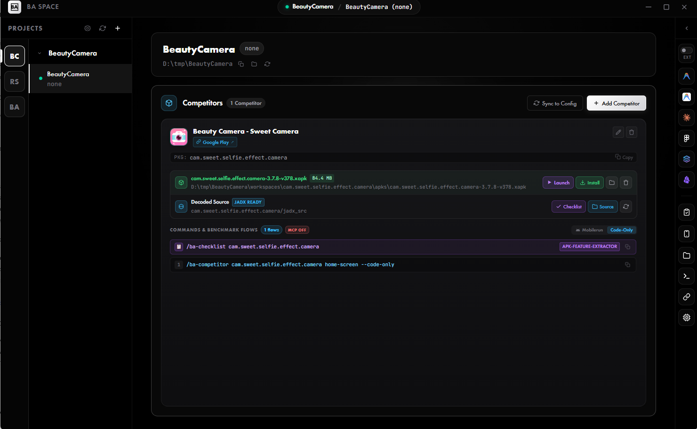

# BA Space

> AI-augmented Business Analyst workspace bridging requirements, live application screens, Figma specifications, and AI agent harnesses.



---

## Key Features

### 1. Live Device Inspection & UI Capture
- **Real-Time Mirroring (`scrcpy-cli`)**: Launch low-latency Android device screen mirroring with a single click.
- **Black-box UI Capture**: Capture both high-resolution screenshots and XML UI hierarchy dumps (`uiautomator dump`) directly from connected devices for rapid UX documentation and agent visual context.

### 2. BAKit — Antigravity BA Toolkit
- **BA Agent Roster**: `ba-lead`, `competitor-analyst`, `ba-researcher`, `ba-brainstormer`, `ba-spec-writer`.
- **Template Catalog**: FSD, use case, user stories, feature brief, test cases, readiness review, competitor analysis and gap analysis — deliverables in Vietnamese.
- **Competitor App Analysis**: drives a competitor Android app through the `mobilerun` MCP server (registered in Antigravity's global MCP config) and writes evidence-backed BA documents.
- **Batch Toolkit Deployment**: One-click "Apply Selected Toolkits" to provision worktrees with BAKit harnesses.

### 3. BA Quick Launchers & External Integrations
- **Antigravity IDE & Agent Manager**: Jump straight into Antigravity with your current worktree context.
- **Figma Integration**: Launch Figma desktop app or navigate to custom project design URLs.
- **Embedded & External Terminals**: Integrated xterm.js tabs with AI CLI launchers (Antigravity CLI with `--dangerously-skip-permissions`, OpenCode, Codex YOLO, Claude), alongside external terminal support (Windows Terminal on Windows, Terminal.app on macOS, default terminal emulator on Linux).

---

## Getting Started

### Prerequisites
- **Supported Operating Systems**:
  - **Windows**: Windows 10 / 11 (x64)
  - **macOS**: macOS 12 Monterey or later (Apple Silicon `arm64` & Intel `x64`)
  - **Linux**: Ubuntu 20.04+, Debian 11+, Fedora, or equivalent modern distribution (x64)
- **Node.js**: v20+ (Node.js 22 recommended) and npm
- **Python**: 3.8+ on system PATH (required to run harness scripts such as `apk_index.py` and ReaKit APK decompilation)
- **Git**: Installed and on system PATH
- **ADB & Scrcpy**: Required for device mirroring and UI capture features (`scrcpy` and `adb` available on system PATH or standard SDK / Homebrew install paths)
- **Optional Tools**: Android Studio, Antigravity CLI / IDE, Figma Desktop, Obsidian, Claude Desktop (all detected automatically across Windows, macOS, and Linux)

### Installation & Run

```bash
# Clone the repository
git clone https://github.com/impeterwayne/BAS_Business_Analysis_Space.git
cd BAS_Business_Analysis_Space

# Install dependencies
npm install

# Run unit tests
npm test

# Start development application
npm start
```

### Build & Package for Production

All packaging commands automatically compile TypeScript (`npm run build`) before invoking Electron Builder.

#### 1. Compile TypeScript Only
```bash
npm run build
```

#### 2. Fast Unpacked Package (Current Platform)
```bash
npm run pack
# Generates unpacked binaries in release/<platform>-unpacked/
```

#### 3. Package for Current Host OS
```bash
npm run make
```

#### 4. Platform-Specific Builds

##### Windows (x64)
```bash
npm run make:win
```
Outputs in `release/`:
- `BA-Space-<version>-Setup.exe` (NSIS Installer with desktop shortcut & custom directory support)
- `BA-Space-<version>-Portable.exe` (Standalone portable executable)

##### macOS (Apple Silicon arm64 & Intel x64)
```bash
npm run make:mac
```
Outputs in `release/`:
- `BA-Space-<version>-mac-arm64.dmg` & `BA-Space-<version>-mac-arm64.zip` (Apple Silicon)
- `BA-Space-<version>-mac-x64.dmg` & `BA-Space-<version>-mac-x64.zip` (Intel)

> **macOS Note**: Builds use ad-hoc code signing (`identity: -`). On first launch, right-click the application in Finder and select **Open**, or run:
> ```bash
> xattr -cr "/Applications/BA Space.app"
> ```

##### Linux (x64)
```bash
npm run make:linux
```
Outputs in `release/`:
- `BA-Space-<version>-linux-x86_64.AppImage` (Universal Linux package)
- `BA-Space-<version>-linux-x64.tar.gz` (Standalone archive)

> **Linux Note**: Grant executable permissions to the AppImage before launching:
> ```bash
> chmod +x release/BA-Space-*-linux-x86_64.AppImage
> ```

All distribution artifacts are generated into the `release/` directory.

