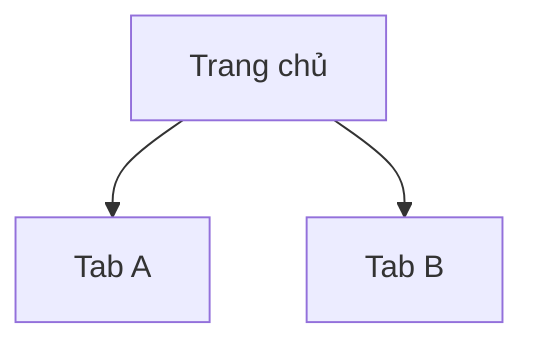

# Hồ sơ ứng dụng đối thủ (Competitor App Profile) — {Tên ứng dụng}

| Thuộc tính (Attribute) | Giá trị (Value) |
| :--- | :--- |
| Ứng dụng (App) | {App name} |
| Package | `{com.competitor.app}` |
| Phiên bản ứng dụng (App version) | {versionName (versionCode)} |
| Thiết bị (Device) | {serial / model / Android version} |
| Tài khoản sử dụng (Account used) | {Khách / tài khoản test — không ghi mật khẩu} |
| Ngày khảo sát (Captured) | {YYYY-MM-DD} |
| Tác giả / Agent (Author) | {name / agent} |
| Phiên bản tài liệu (Version) | v1 |
| Thư mục bằng chứng (Evidence folder) | `docs/BA/competitor/{app-slug}/screens/` |

## 1. Tổng quan (Overview)

{2–4 câu: ứng dụng làm gì, cho ai. Chỉ ghi điều quan sát được hoặc có nguồn; suy luận phải gắn nhãn [Suy luận (Inferred)].}

## 2. Phạm vi khảo sát (Survey Scope)

| Luồng (Flow) | Trạng thái (Status) | Tài liệu (Doc) | Ghi chú (Notes) |
| :--- | :--- | :--- | :--- |
| {Onboarding / Đăng nhập / …} | Đã khảo sát / Một phần / Bị chặn | `{app-slug}_flow-{slug}_{YYYYMMDD}_v1.md` | {bị chặn bởi OTP, paywall, …} |

## 3. Bản đồ tính năng (Feature Map)

| ID | Nhóm (Area) | Tính năng (Feature) | Mô tả quan sát (Observed description) | Bằng chứng (Evidence) |
| :--- | :--- | :--- | :--- | :--- |
| CF-001 | {Tài khoản} | {Đăng nhập bằng OTP} | {…} | `screens/login-02-otp.png` |

## 4. Điều hướng chính (Primary Navigation)

## 5. Điểm mạnh (Strengths)

- {Điểm mạnh} — bằng chứng: `{screens/...png}`

## 6. Điểm yếu & Ma sát (Weaknesses & Friction)

- {Điểm yếu, số bước thừa, thông báo khó hiểu} — bằng chứng: `{screens/...png}`

## 7. Mô hình kinh doanh quan sát được (Observed Business Model)

{Miễn phí / Freemium / Phí giao dịch / Quảng cáo — chỉ ghi điều nhìn thấy trên màn hình.}

## 8. Ranh giới khảo sát (Survey Boundaries)

| Ranh giới (Boundary) | Lý do (Reason) | Cần gì để vượt qua (What would unblock it) |
| :--- | :--- | :--- |
| {Màn hình thanh toán} | {Hành động phá hủy / cần tài khoản thật} | {Tài khoản sandbox} |

## 9. Câu hỏi mở (Open Questions)

| ID | Câu hỏi (Question) | Bước tiếp theo để trả lời (Next step) |
| :--- | :--- | :--- |
| Q-01 | {câu hỏi} | {…} |
