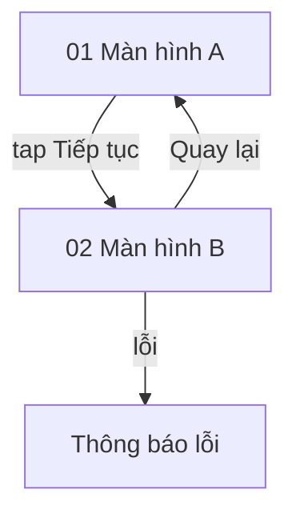

# Phân tích luồng (Flow Analysis) — {Tên ứng dụng}: {Tên luồng}

| Thuộc tính (Attribute) | Giá trị (Value) |
| :--- | :--- |
| Ứng dụng (App) | {App name} · `{com.competitor.app}` · {version} |
| Luồng (Flow) | {flow-slug} |
| Thiết bị (Device) | {serial / model} |
| Ngày khảo sát (Captured) | {YYYY-MM-DD} |
| Tác giả / Agent (Author) | {name / agent} |
| Phiên bản (Version) | v1 |

## 1. Mục tiêu người dùng (User Goal)

{Người dùng muốn đạt được gì qua luồng này.}

## 2. Điểm vào (Entry Point)

{Người dùng đến luồng này từ đâu.}

## 3. Các bước (Steps)

| Bước (Step) | Màn hình (Screen) | Hành động (Action) | Phản hồi hệ thống (System response) | Bằng chứng (Evidence) |
| :--- | :--- | :--- | :--- | :--- |
| 1 | 01 {tên} | tap "{nhãn}" | {→ 02} | `screens/{flow}-01-{slug}.png` |

**Số bước để hoàn thành (Steps to complete):** {N lần chạm / N màn hình}

## 4. Sơ đồ chuyển trạng thái (State Transitions)

## 5. Quy tắc & Kiểm tra hợp lệ quan sát được (Observed Rules & Validations)

| # | Quy tắc (Rule) | Cách quan sát (How observed) | Bằng chứng (Evidence) |
| :--- | :--- | :--- | :--- |
| 1 | {Trường SĐT từ chối 11 chữ số} | {nhập 11 số → thông báo "..."} | `screens/...png` |

## 6. Trải nghiệm & Ma sát (UX & Friction)

- **Tốt (Good):** {…}
- **Ma sát (Friction):** {…}

## 7. Độ phủ (Coverage)

| Nhánh chưa đi (Unvisited branch) | Lý do (Reason) |
| :--- | :--- |
| {Quên mật khẩu} | {Ngoài phạm vi / cần OTP / hành động phá hủy} |

## 8. Ý nghĩa với sản phẩm của chúng ta (Implications for Our Product)

- {Bài học → đề xuất GAP-ID trong báo cáo so sánh}
