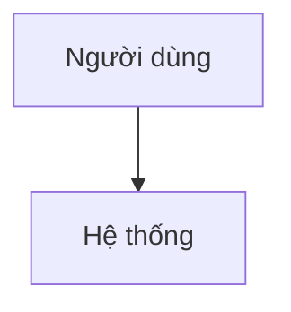

# Bản mô tả tính năng (Feature Brief) — {Tên tính năng}

| Thuộc tính (Attribute) | Giá trị (Value) |
| :--- | :--- |
| Tính năng (Feature) | {feature-name} |
| Ngày tạo (Created) | {YYYY-MM-DD} |
| Tác giả / Agent (Author) | {name / agent} |
| Phiên bản (Version) | v1 |
| Trạng thái (Status) | Draft / In Review / Approved |
| Nguồn (Sources) | {yêu cầu gốc, biên bản, GAP-ID từ phân tích đối thủ} |

## 1. Phát biểu vấn đề (Problem Statement)

{Vấn đề kinh doanh cần giải quyết, ai gặp vấn đề, bằng chứng.}

## 2. Mục tiêu & Chỉ số thành công (Goals & Success Metrics)

| Mục tiêu (Goal) | Chỉ số (Metric) | Mục tiêu định lượng (Target) |
| :--- | :--- | :--- |
| {goal} | {metric} | {target} |

## 3. Người dùng & User Story (Users & User Stories)

- Là {vai trò}, tôi muốn {chức năng}, để {lợi ích}.

## 4. Các phương án đã đánh giá (Evaluated Approaches)

| Phương án (Approach) | Ưu điểm (Pros) | Nhược điểm (Cons) | Rủi ro (Risks) |
| :--- | :--- | :--- | :--- |
| A — {tên} | {pros} | {cons} | {risks} |
| B — {tên} | {pros} | {cons} | {risks} |

**Phương án được chọn (Chosen approach):** {A/B} — {lý do, người quyết định, ngày}

## 5. Thiết kế đề xuất (Proposed Design)

- **Thành phần (Components):** {…}
- **Luồng dữ liệu (Data flow):** {…}
- **Ranh giới & giao diện (Boundaries & interfaces):** {…}

## 6. Xử lý lỗi & Trường hợp biên (Error Handling & Edge Cases)

| # | Tình huống (Scenario) | Hành vi mong đợi (Expected behaviour) |
| :--- | :--- | :--- |
| 1 | {edge case} | {behaviour} |

## 7. Phạm vi (Scope)

- **Trong phạm vi (In scope):** {…}
- **Ngoài phạm vi (Out of scope):** {…}

## 8. Rủi ro, Phụ thuộc & Giả định (Risks, Dependencies & Assumptions)

| Loại (Type) | Nội dung (Item) | Cách xử lý (Mitigation) |
| :--- | :--- | :--- |
| Rủi ro (Risk) | {…} | {…} |
| Phụ thuộc (Dependency) | {…} | {…} |
| Giả định (Assumption) | {…} | {cần xác nhận bởi ai} |

## 9. Bước tiếp theo (Next Steps)

1. {Viết FSD / Use Case bằng `specs`}
2. {Rà soát sẵn sàng bằng `BA-audit-SRS`}

## 10. Câu hỏi mở (Open Questions)

| ID | Câu hỏi (Question) | Ảnh hưởng (Impact) | Trạng thái (Status) |
| :--- | :--- | :--- | :--- |
| Q-01 | {câu hỏi} | {vì sao quan trọng} | Open |
