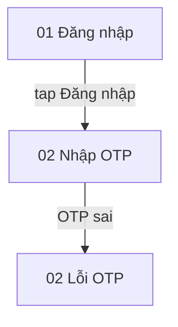

# Phân tích thiết kế Figma (Figma Design Analysis) — {Tên tính năng / luồng}

| Thuộc tính (Attribute) | Giá trị (Value) |
| :--- | :--- |
| Figma file | {Tên file} · `{file-key}` |
| Link | `{https://www.figma.com/design/…?node-id=…}` |
| Node gốc (Root nodes) | `{123:456}`, `{123:789}` |
| Ngày phân tích (Analysed) | {YYYY-MM-DD} |
| Tác giả / Agent (Author) | {name / agent} |
| Phiên bản (Version) | v1 |
| Trạng thái (Status) | DRAFT / CONFIRMED |
| Phân tích trước (Previous analysis) | `{đường dẫn v[N-1]}` hoặc none |

Nhãn bằng chứng (Evidence grades): **[Design]** thấy trực tiếp trong node Figma (ghi node id) ·
**[Annotation]** ghi chú của designer · **[Prototype]** từ prototype reaction · **[Inferred]** suy luận, cần xác nhận.

## 1. Nguồn gốc & phạm vi (Provenance & Scope)

**MCP calls** — mỗi dòng một call, để người sau biết phần nào đã xem và phần nào chưa:

```
get_metadata                                 -> file {name}, page {page}
get_design_context depth=2 detail=minimal    -> skeleton of {123:456}
scan_text_nodes    {123:456} depth=4         -> {n} text nodes
get_reactions      {123:470}                 -> {n} reactions
```

**Không kiểm tra (Not inspected):** {nhánh / frame đã bỏ qua và lý do; để trống nghĩa là đã xem hết}

## 2. Danh mục màn hình (Screen Inventory)

| # | Màn hình (Screen) | Node ID | Ảnh tham chiếu (Reference image) | Mục đích (Purpose) | Vào từ (Entry from) |
| :--- | :--- | :--- | :--- | :--- | :--- |
| 01 | {Đăng nhập} | `{123:456}` | `screens/01-login.png` | {một dòng} | {Splash / deep link / —} |

## 3. Luồng màn hình (Screen Flow)



Cạnh lấy từ `get_reactions` là **[Prototype]**; cạnh suy từ tên frame hoặc nút là **[Inferred]** và vẽ nét đứt (`-.->`).

## 4. Chi tiết màn hình (Screen Details)

### 01 — {Tên màn hình}

- **Mục đích (Purpose):** {Màn hình dùng để làm gì}
- **Bố cục (Layout):** {Các vùng chính: header, nội dung, bottom bar, …}

**Thành phần (Elements):**

| Nhãn gốc (Original label) | Tiếng Anh (English) | Loại (Type) | Bắt buộc (Required) | Mặc định / Placeholder | Node ID | Ghi chú (Notes) |
| :--- | :--- | :--- | :--- | :--- | :--- | :--- |
| {Số điện thoại} | {Phone number} | Text field | Yes / No / ? | {Nhập số điện thoại} | `{123:460}` | {[Design] bàn phím số} |
| {Đăng nhập} | {Log in} | Primary button | — | — | `{123:470}` | {[Design] variant disabled tồn tại} |

**Hành động (Actions):**

| Kích hoạt (Trigger) | Thành phần (Element) | Phản hồi hệ thống (System response) | Đích (Destination) | Nhãn (Grade) |
| :--- | :--- | :--- | :--- | :--- |
| tap | {Đăng nhập} | {Gửi OTP} | 02 | [Prototype] |

## 5. Trường nhập & kiểm tra hợp lệ (Input Fields & Validation)

| Màn hình (Screen) | Trường (Field) | Kiểu dữ liệu (Data type) | Ràng buộc thấy được (Visible constraint) | Thông báo lỗi trong thiết kế (Error text in design) | Nhãn (Grade) |
| :--- | :--- | :--- | :--- | :--- | :--- |
| 01 | {Số điện thoại} | {string, 10 số} | {placeholder 10 số, prefix +84} | {Số điện thoại không hợp lệ} | [Design] |

Ràng buộc không có trong thiết kế (độ dài tối đa, định dạng, khoảng giá trị) **không được đoán**: ghi vào §11.

## 6. Trạng thái & biến thể (States & Variants)

Một dòng cho mỗi trạng thái của mỗi màn hình, kể cả trạng thái **không được thiết kế** — đó là một phát hiện, không phải ô trống.

| Màn hình (Screen) | Trạng thái (State) | Thiết kế (Designed) | Node ID / Ảnh | Ghi chú (Notes) |
| :--- | :--- | :--- | :--- | :--- |
| 01 | Default | Yes | `{123:456}` | — |
| 01 | Loading | not designed | — | {→ Q-01} |
| 01 | Error (sai định dạng) | Yes | `{123:520}` · `screens/01-login-error.png` | — |
| 01 | Empty / Disabled / Success / No network / Permission denied | {Yes / not designed} | — | — |

## 7. Nội dung & thông báo (Copy & Messages)

| Màn hình (Screen) | Loại (Kind) | Nội dung gốc (Original text) | Tiếng Anh (English) | Tĩnh / Động (Static / Dynamic) | Node ID |
| :--- | :--- | :--- | :--- | :--- | :--- |
| 01 | Title / Label / CTA / Error / Toast / Dialog / Empty state | {Chào mừng bạn} | {Welcome} | Static | `{123:458}` |
| 01 | Label | {Xin chào, {tên}} | {Hello, {name}} | Dynamic: {tên người dùng} | `{123:459}` |

## 8. Dữ liệu hiển thị (Displayed Data)

Dữ liệu màn hình hiển thị hoặc thu thập — đầu vào cho Data Models của FSD.

| Thực thể gợi ý (Candidate entity) | Trường (Field) | Màn hình (Screens) | Định dạng hiển thị (Display format) | Nhãn (Grade) |
| :--- | :--- | :--- | :--- | :--- |
| {Giao dịch} | {số tiền} | 03, 05 | {1.000.000 đ} | [Design] |

## 9. Ghi chú của designer (Designer Annotations)

| Node ID | Ghi chú gốc (Original note) | Tác động tới yêu cầu (Requirement impact) |
| :--- | :--- | :--- |
| `{123:470}` | {"Disable cho tới khi nhập đủ 10 số"} | {→ BR-CAND-01} |

Ghi chú của designer ghi đè mọi suy luận ở các mục khác.

## 10. Yêu cầu & quy tắc ứng viên (Candidate Requirements & Rules)

Ứng viên chỉ được đưa vào FSD / use case / user story **sau khi người dùng xác nhận**; giữ cột Nguồn để truy vết.

| ID | Yêu cầu / Quy tắc (Requirement / Rule) | Loại (Kind) | Nguồn (Source) | Nhãn (Grade) | Đưa vào (Feeds) |
| :--- | :--- | :--- | :--- | :--- | :--- |
| FR-DSN-001 | {Người dùng đăng nhập bằng số điện thoại và OTP} | Functional | 01, 02 · `{123:456}` | [Design] | FSD §1, UC-AUTH-00x |
| BR-CAND-01 | {Nút Đăng nhập bị vô hiệu cho tới khi nhập đủ 10 số} | Business rule | `{123:470}` annotation | [Annotation] | FSD §6 |

## 11. Câu hỏi mở (Open Questions)

| ID | Câu hỏi (Question) | Màn hình / Node | Hỏi ai (Ask) | Ảnh hưởng nếu chưa trả lời (Impact if unanswered) |
| :--- | :--- | :--- | :--- | :--- |
| Q-01 | {Trạng thái loading khi gửi OTP hiển thị thế nào?} | 01 · `{123:470}` | Designer | {UC thiếu luồng chờ; QA không có kỳ vọng} |

Mục này trống nghĩa là thiết kế không có gì mơ hồ — điều hiếm khi đúng.

## 12. So sánh với phiên bản trước (Diff vs Previous Analysis)

Chỉ dùng khi chạy `diff`. Mỗi thành phần: **matches**, **changed** (cũ → mới) hoặc **new** / **removed**.

| Màn hình (Screen) | Thành phần (Element) | Thay đổi (Change) | Cũ (Old) | Mới (New) | Tài liệu bị ảnh hưởng (Affected docs) |
| :--- | :--- | :--- | :--- | :--- | :--- |
| 01 | {Đăng nhập} | changed | {Tiếp tục} | {Đăng nhập} | {UC-AUTH-001 bước 3} |
