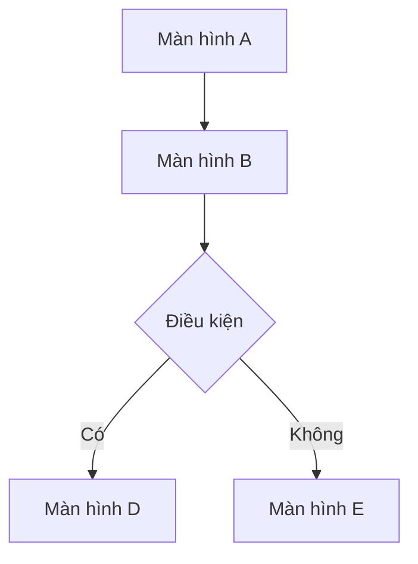

# Tài liệu Đặc tả Chức năng (Functional Specification Document) — {Tên dự án}

| Thuộc tính (Attribute) | Giá trị (Value) |
| :--- | :--- |
| Dự án (Project) | {project-name} |
| Loại dự án (Project type) | {web-frontend / api-backend / fullstack-web / mobile} |
| Ngày tạo (Created) | {YYYY-MM-DD} |
| Cập nhật lần cuối (Last updated) | {YYYY-MM-DD} |
| Tác giả / Agent (Author) | {name / agent} |
| Phiên bản (Version) | v1 |
| Nguồn (Sources) | {PRD, cuộc họp, bằng chứng đối thủ — đường dẫn cụ thể} |

## 1. Đặc tả tính năng (Feature Specifications)

### {Tên phân hệ (Module name)}

**Mô tả (Description):** {Mô tả ngắn phân hệ}

| ID | Yêu cầu (Requirement) | Độ ưu tiên (Priority) | Trạng thái (Status) | Nguồn (Source) |
| :--- | :--- | :--- | :--- | :--- |
| FR-{MOD}-001 | {Yêu cầu chức năng, kiểm thử được} | Critical / High / Medium / Low | Draft | {mục tài liệu / GAP-ID} |

**Tham chiếu Use Case (Use case references):** `docs/usecases/{module}/`

<!-- SECTION: web-frontend, fullstack-web, mobile -->
## 2. Mô tả màn hình (Screen Descriptions)

### {Tên màn hình (Screen name)}

- **Mục đích (Purpose):** {Màn hình dùng để làm gì}
- **Bố cục (Layout):** {Các vùng chính}
- **Thành phần tương tác (Interactive elements):** {Nút, form, trường nhập — giữ nhãn gốc, kèm tiếng Anh trong ngoặc}
- **Trạng thái (States):** {Loading / Empty / Error / Success}
<!-- END SECTION -->

<!-- SECTION: web-frontend, fullstack-web, mobile -->
## 3. Luồng màn hình (Screen Flows)

<!-- END SECTION -->

<!-- SECTION: api-backend, fullstack-web -->
## 4. Hợp đồng API (API Contracts)

### {Tên endpoint}

- **Phương thức (Method):** GET / POST / PUT / DELETE
- **Đường dẫn (Path):** `/api/v1/{resource}`
- **Xác thực (Auth):** Required / Public
- **Request:** `{schema}`
- **Response:** `{schema}`
- **Mã lỗi (Error codes):** 400, 401, 404, 500
<!-- END SECTION -->

## 5. Mô hình dữ liệu (Data Models)

### {Tên thực thể (Entity name)}

| Trường (Field) | Kiểu (Type) | Ràng buộc (Constraints) | Mô tả (Description) |
| :--- | :--- | :--- | :--- |
| id | UUID | PK | Định danh duy nhất |
| {field} | {type} | {constraints} | {description} |

**Quan hệ (Relationships):** {entity} → {related entity} (1:N)

## 6. Quy tắc nghiệp vụ & Kiểm tra hợp lệ (Business Rules & Validations)

| ID | Quy tắc (Rule) | Áp dụng cho (Applies to) | Thực thi tại (Enforcement) |
| :--- | :--- | :--- | :--- |
| BR-001 | {Mô tả quy tắc} | {Phân hệ / Tính năng} | Server / Client / Both |

## 7. Yêu cầu phi chức năng (Non-Functional Requirements)

| Nhóm (Category) | Yêu cầu (Requirement) | Mục tiêu (Target) |
| :--- | :--- | :--- |
| Hiệu năng (Performance) | {requirement} | {metric} |
| Bảo mật (Security) | {requirement} | {standard} |
| Khả năng mở rộng (Scalability) | {requirement} | {target} |
| Tính sẵn sàng (Availability) | {requirement} | {SLA} |

## 8. Lịch sử thay đổi (Change Log)

| Phiên bản (Version) | Ngày (Date) | Tác giả (Author) | Thay đổi (Changes) |
| :--- | :--- | :--- | :--- |
| v1 | {YYYY-MM-DD} | {author} | Khởi tạo tài liệu |
