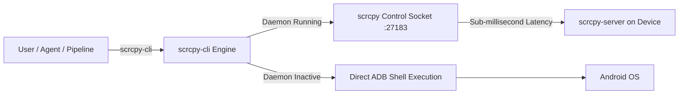

# Android Device Control & Automation Guide

**POKit** vendors [`@impeterwayne/scrcpy-cli`](https://github.com/impeterwayne/scrcpy_cli) as `core/scrcpy_cli` (git submodule) to enable low-latency, agent-friendly Android device automation and real-time screen mirroring. Ported from [REAKit](https://github.com/impeterwayne/REAKit)'s harness — business-analyst / screen-analyst / device-control slice only, no code-analysis tooling.

---

## Architecture: Fast Daemon vs. ADB Fallback



1. **Daemon Mode (Recommended):** Keeps a persistent `scrcpy-server` connection open via TCP socket forwarding. Touch events, text entry, key injection, screenshots, and UI dumps execute in single-digit milliseconds without spawning separate ADB processes.
2. **Direct ADB Fallback:** If the background daemon is not running, commands automatically fall back to standard ADB shell executions.

---

## Daemon Lifecycle

```bash
# Start background daemon for default device
scrcpy-cli daemon start

# Check daemon running status
scrcpy-cli daemon status

# Run daemon in foreground (useful for debugging)
scrcpy-cli daemon run

# Stop background daemon
scrcpy-cli daemon stop
```

### Targeting Specific Devices
```bash
scrcpy-cli -s emulator-5554 daemon start
```

---

## Action Commands Reference

### 1. Touch & Gestures
```bash
# Tap coordinate (x, y)
scrcpy-cli tap 540 1200

# Swipe from (x1, y1) to (x2, y2) with duration in ms
scrcpy-cli swipe 540 1600 540 400 300

# Scroll at coordinate (x, y) by (dx, dy)
scrcpy-cli scroll 540 1200 0 -200
```

### 2. Text Input & Keycodes
```bash
# Type text into focused input field
scrcpy-cli write "Search query text"

# Press named Android keys
scrcpy-cli key HOME
scrcpy-cli key BACK
scrcpy-cli key ENTER
scrcpy-cli key VOLUME_UP
scrcpy-cli key POWER

# Press numeric Android keycode
scrcpy-cli key 3
```

### 3. Screen Capture & UI Inspection
```bash
# Capture screenshot (saves to screenshot.png by default)
scrcpy-cli screenshot app_screen.png

# Dump UI hierarchy XML (saves to ui-dump.xml by default)
scrcpy-cli ui-dump layout.xml
```

### 4. Clipboard Operations
```bash
# Read device clipboard
scrcpy-cli clipboard-get

# Set device clipboard
scrcpy-cli clipboard-set "Sample auth token"
```

### 5. Application Management
```bash
# Launch application
scrcpy-cli app-start com.zodiac.horoscope.palmreader.scanpalmistry

# Force-stop application
scrcpy-cli app-stop com.zodiac.horoscope.palmreader.scanpalmistry

# List installed packages
scrcpy-cli app-list
```

### 6. Device Diagnostics
```bash
# Display model, Android version, SDK, and resolution
scrcpy-cli device-info

# List all connected ADB devices
scrcpy-cli device-list
```

---

## Interactive Screen Mirroring (`scrcpy-cli mirror`)

To launch a desktop screen mirroring window with full mouse and keyboard interaction:

```bash
# Launch interactive mirror on default device
scrcpy-cli mirror

# Mirror specific device serial with custom max resolution & frame rate
scrcpy-cli mirror -s emulator-5554 -m 1280 --fps 60

# Pass extra scrcpy flags
scrcpy-cli mirror -- --stay-awake --turn-screen-off
```

### Mirror Options

| Flag | Long Option | Description |
|---|---|---|
| `-s` | `--serial <serial>` | Specific Android device serial |
| `-m` | `--max-size <size>` | Limit video width and height (e.g. `1280`) |
| | `--fps <fps>` | Limit video frame rate (e.g. `60`) |
