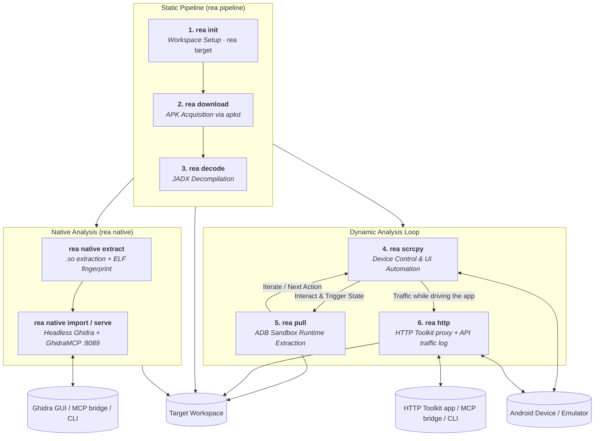

# Reverse Engineering Android Kit (REAKit)
---
## Installation & Setup

### 1. System Dependencies

REAKit bundles matching versions of **`scrcpy` (v4.1)**, **`adb`**, **`jadx`**, and **`apktool`** automatically. You only need the base runtime compilers and runtimes:

* **Linux (Fedora / RHEL)**:
  ```bash
  sudo dnf install -y nodejs java-openjdk-devel golang maven
  ```
* **Linux (Ubuntu / Debian)**:
  ```bash
  sudo apt update && sudo apt install -y nodejs openjdk-21-jdk golang-go maven
  ```
* **Linux (Arch)**:
  ```bash
  sudo pacman -S nodejs jdk21-openjdk go maven
  ```
* **macOS (Homebrew)**:
  ```bash
  brew install node openjdk@21 go maven
  ```
* **Windows**:
  * Ensure **Python 3.8+**, **Node.js 22+**, and **JDK 11+ / 21+** are installed and added to `PATH`.

---

### 2. Clone & Initialize REAKit

Clone the repository with submodules and run the installer:

```bash
git clone --recurse-submodules https://github.com/impeterwayne/REAKit.git
cd REAKit

# On Linux / macOS:
./install.sh

# On Windows:
install.bat
# (or: python rea.py install)
```

The installer will automatically set up everything in a single step:
1. Register `rea` and `reakit` into your Python environment.
2. Build and link `scrcpy-cli` device automation globally.
3. Automatically download matching **`scrcpy` & `adb` (v4.1)** native binaries for your OS.
4. Compile the **`apkd`** APK downloader for your platform via Go.
5. Fetch the official **Ghidra** distribution and build the **GhidraMCP** plugin jar & MCP bridge.
6. Configure execution permissions (`chmod +x`) on all bundled tools.

*(Tip: pass `--skip-ghidra` if you wish to skip the optional Ghidra native analysis bundle).*

---

### 4. Verify Installation

Run the system diagnostics check to ensure all components are `READY`:

```bash
# General environment check
rea check
# (or: python rea.py check / rea env)

# Native analysis readiness check
rea native setup
```

---
## Architecture

`REA_Kit` is partitioned into clean, modular components coordinated by a unified CLI engine:



---

## Agentic Harness

REAKit ships a drop-in **reverse-engineering agent harness** for Google Antigravity — a
self-contained `.agents/` payload of always-on rules, 7 specialist agents, 15 domain skills, and
5 deterministic safety hooks, injected into any engagement repo with `rea harness`. It follows the
AndroidHarnessAGY standard, retargeted from building apps to reversing them: the agents delegate,
cite evidence for every claim, and never hand-edit generated decompilation.

```bash
rea harness init /path/to/engagement           # full harness
rea harness init /path/to/engagement --profile native   # focused profile
rea harness list                               # rules, agents, skills, hooks, profiles
```

Profiles: `full` (default), `static`, `native`, `dynamic`, `minimal`. Full details in the
**[Agentic Harness Guide](./docs/agent_harness.md)**.

---

## Documentation Index

1. **[CLI Reference Manual](./docs/cli_reference.md)** - Comprehensive manual for the `rea` CLI and all its subcommands.
2. **[Device Control & Automation Guide](./docs/scrcpy_control.md)** - Low-latency scrcpy daemon control and automation actions.
3. **[Workspace Setup & Management Guide](./docs/workspace_management.md)** - Directory schemas and target workspace management.
4. **[Target Downloading Guide](./docs/downloading_targets.md)** - Automated APK downloading via `apkd`.
5. **[Bytecode Decompilation & JADX Guide](./docs/decompilation.md)** - JADX memory safeguards, split APK merging, and decompilation.
6. **[Runtime Extraction Guide](./docs/runtime_extraction.md)** - ADB privilege escalation (native root, Magisk su, run-as) and sandbox pulling.
7. **[Native Library Analysis Guide](./docs/native_analysis.md)** - `.so` extraction, ELF/packer fingerprinting, and headless-or-GUI Ghidra analysis via GhidraMCP.
8. **[API Traffic Capture Guide](./docs/http_toolkit.md)** - listening to live traffic with `rea http`, plus HTTP Toolkit lifecycle, device proxy wiring and the captured-exchange log.
9. **[Configuration Schema Guide](./docs/workspace_config.md)** - Central `workspace_config.json` schema details.
10. **[Agentic Harness Guide](./docs/agent_harness.md)** - The `.agents/` Antigravity reverse-engineering harness and the `rea harness` injector.

---

## Prerequisites

To run all capabilities of `REA_Kit`, ensure the following are installed:

* **Python 3.8+** (runs the `reakit` engine).
* **Node.js 22+** (required for `scrcpy-cli` device automation).
* **Java Development Kit (JDK) 11+** (required for `JADX` decompiler and `APKTool`; **JDK 21** for native analysis with Ghidra).
* **Go (Golang)** (required to build the `apkd` APK downloader).
* **A Connected Device or Emulator** (physical device, Genymotion, or Android Studio AVD).
* **Ghidra 12.x + Maven** (optional, only for `rea native` — see the [Native Library Analysis Guide](./docs/native_analysis.md)).
* **HTTP Toolkit** (optional, only for `rea http` — install the desktop app from [httptoolkit.com/download](https://httptoolkit.com/download/); see the [API Traffic Capture Guide](./docs/http_toolkit.md)).
