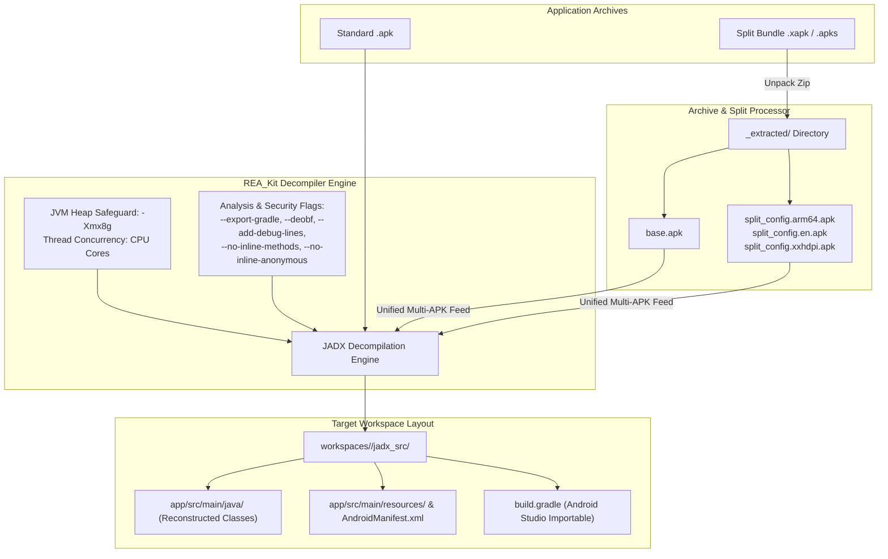

# Bytecode Decompilation & JADX Guide

This guide covers the static decompilation and bytecode analysis architecture in **REA_Kit**, which converts raw Android application packages (`.apk`, `.xapk`, `.apks`) into navigable, structured Java source codebases and Android Studio-ready Gradle projects.

---

## Decompilation Pipeline Architecture

`REA_Kit` integrates **JADX v1.5.6+** and **APKTool** within a unified orchestration layer. It automatically handles archive extraction, multi-APK split bundle aggregation, CPU-aware multi-threading, and JVM memory allocation safeguards.



---

## Decompilation via CLI (`rea decode` / `rea decompile`)

The `rea decode` command reads packages from your active workspace, unpacks multi-APK splits, optimizes JVM memory parameters, and decompiles classes into `workspaces/<package>/jadx_src/`.

### Command Syntax

```bash
rea decode [target] [options]
```

*Alias:* `rea decompile`

### Options

| Flag | Long Option | Description | Default |
|---|---|---|---|
| `-t` | `--target <pkg_or_alias>` | Target package name or configured alias | Active target / all |
| `-l` | `--link <url_or_pkg>` | Direct Play Store URL or package name | None |
| `-j` | `--threads <n>` | Worker thread count for parallel processing | Auto-detect (`os.cpu_count()`) |
| | `--heap <size>` | JVM Heap allocation memory limit | `8g` |
| `-w` | `--workspace <dir>` | Custom workspace root directory path | `./workspaces` |
| `-c` | `--config <file>` | Path to workspace configuration file | `config/workspace_config.json` |
| | `--targets <file>` | Custom plain text file containing package names | None |

---

### Practical Examples

#### 1. Decompile All Configured Targets
Decompile every target defined in your `workspace_config.json`:
```bash
rea decode
```

#### 2. Decompile a Specific Target Package
Target a specific app by its Android package identifier:
```bash
rea decode com.zodiac.horoscope.palmreader.scanpalmistry
```

#### 3. Decompile Using a Friendly Alias
Use an alias configured in `workspace_config.json`:
```bash
rea decode -t Scanpalmistry
```

#### 4. Decompile from a Google Play Store URL
Pass a direct store link (automatically parses the package name):
```bash
rea decode "https://play.google.com/store/apps/details?id=com.zodiac.horoscope.palmreader.scanpalmistry"
```

#### 5. High-Performance / High-Memory Tuning
For massive enterprise apps (50MB+ DEX code), assign custom thread count and allocate 16 GB of JVM heap memory:
```bash
rea decode -t Scanpalmistry -j 16 --heap 16g
```

---

## Interactive JADX GUI (`rea jadx-gui`)

For interactive reverse engineering, graph viewing, class searching, and live decompilation inspection, `REA_Kit` provides direct integration with the graphical JADX GUI.

```bash
# Launch empty JADX GUI
rea jadx-gui

# Launch JADX GUI and automatically open the target's APK
rea jadx-gui com.zodiac.horoscope.palmreader.scanpalmistry

# Launch JADX GUI using target alias
rea jadx-gui -t Scanpalmistry
```

> [!TIP]
> When a target package or alias is provided, `rea jadx-gui` automatically inspects `workspaces/<package>/apks/` and loads the primary APK file directly into the editor.

---

## Low-Level Smali & Resource Inspection (`rea apktool`)

When you need direct Smali disassembly, manifest editing, or raw resource decompilation and rebuilding, use the bundled APKTool wrapper:

```bash
# Disassemble an APK to Smali and raw resources
rea apktool d workspaces/com.example.app/apks/base.apk -o workspaces/com.example.app/smali_out

# Reassemble / Rebuild an APK from modified Smali sources
rea apktool b workspaces/com.example.app/smali_out -o workspaces/com.example.app/rebuilt_app.apk
```

---

## Multi-APK Split Installations (`.xapk` & `.apks`)

Modern applications on Google Play are commonly published as **Android App Bundles (AAB)** and distributed to devices as **Split APKs** (`.xapk` or `.apks` archives). Individual split APKs contain only partial bytecode and assets (such as ABI-specific native libraries `arm64-v8a` or language-specific string tables).

`REA_Kit` manages this automatically:

1. **Auto-Detection:** Detects `.xapk` and `.apks` archives inside `workspaces/<package>/apks/`.
2. **Recursive Extraction:** Unpacks the archive into a dedicated `<archive_name>_extracted/` directory.
3. **Split Aggregation:** Gathers `base.apk` alongside all auxiliary split files (`split_config.arm64_v8a.apk`, `split_config.en.apk`, etc.).
4. **Unified Merging:** Invokes JADX with all discovered APK paths passed simultaneously in a single command, producing a unified, coherent Java codebase.

---

## JADX Decompiler Flags & Security Optimization

`REA_Kit` applies specialized decompiler flags tuned for security reviews, malware auditing, and code readability:

| Flag | Purpose & Impact |
|---|---|
| `--export-gradle` | Generates a standard Android Studio Gradle project structure (`build.gradle`, `app/src/main/...`) for direct IDE import. |
| `--deobf` | Activates deobfuscation engine to rename short obfuscated identifiers (`a`, `b`, `c`) into readable unique aliases (`f1234a`). |
| `--add-debug-lines` | Injects original bytecode line numbers as comments (`// line 42`) to enable exact mapping against stack traces and Frida hook points. |
| `--comments-level debug` | Adds compiler warnings, type inference errors, and bytecode offsets directly into generated Java files for deeper analysis. |
| `--respect-bytecode-access-modifiers` | Retains original class, method, and field visibilities (`private`, `protected`, `package-private`) rather than artificially converting them to `public`. |
| `--no-inline-anonymous` | Prevents inlining of anonymous inner classes (e.g. `Runnable`, `OnClickListener`) to keep callback logic distinct and searchable. |
| `--no-inline-methods` | Disables method inlining to preserve exact method signatures, call hierarchies, and cross-reference graphs. |
| `--no-replace-consts` | Retains original integer and string constant values rather than replacing them with mismatched constant names from external libraries. |

---

## Memory Management & Out-of-Memory (OOM) Safeguards

Decompiling complex Android applications with multiple DEX files can consume substantial JVM heap space. `REA_Kit` implements the following safeguards:

### 1. Automatic JVM Heap Reservation
The decompiler checks for the `JADX_OPTS` environment variable. If not explicitly set by the user, it assigns:
```bash
JADX_OPTS="-Xmx8g -Xms8g"
```
You can customize this per command using the `--heap` flag (e.g. `--heap 12g` or `--heap 16g`).

### 2. Dynamic CPU Core Allocation
The engine queries the host machine's hardware threads via `os.cpu_count()` and forwards this value to JADX via `-j <cores>`. This accelerates decompilation across all available CPU threads without manual tuning.

---

## Output Workspace Directory Structure

Following decompilation, your target workspace folder is populated as follows:

```text
workspaces/com.zodiac.horoscope.palmreader.scanpalmistry/
├── apks/                                      # Downloaded APK / XAPK files
│   ├── com.zodiac.horoscope.palmreader.xapk
│   └── com.zodiac.horoscope.palmreader.xapk_extracted/
│       ├── base.apk
│       ├── split_config.arm64_v8a.apk
│       └── split_config.en.apk
├── jadx_src/                                  # Decompiled Java Gradle Project
│   ├── app/
│   │   ├── build.gradle                       # Gradle subproject configuration
│   │   └── src/
│   │       └── main/
│   │           ├── AndroidManifest.xml        # Reconstructed Application Manifest
│   │           ├── java/                      # Decompiled Java classes (.java)
│   │           └── resources/                 # Decoded assets and resources
│   ├── build.gradle                           # Root Gradle build script
│   └── settings.gradle                        # Gradle project settings
└── runtime/                                   # Extracted device runtime data (ADB)
    ├── databases/                             # SQLite databases
    └── shared_prefs/                          # XML preferences
```

---

## Troubleshooting & FAQs

### 1. Java Out-Of-Memory (`java.lang.OutOfMemoryError`)
* **Cause:** The target APK contains hundreds of classes or heavy multidex archives exceeding JVM heap memory.
* **Fix:** Increase heap allocation using the `--heap` argument:
  ```bash
  rea decode com.example.app --heap 16g
  ```

### 2. `jadx` or `java` is not recognized
* **Cause:** Java Development Kit (JDK 11+) is missing or not registered in your `PATH`.
* **Fix:** Verify your environment setup with `rea env`, install a modern JDK (such as OpenJDK 17 or 21), and run `rea install` to register bundled binaries.

### 3. Corrupted Split Archive (`zipfile.BadZipFile`)
* **Cause:** The downloaded `.xapk` or `.apks` was truncated during download.
* **Fix:** Re-download the target using `rea dl <target> -F` (force overwrite), then re-run `rea decode <target>`.

### 4. Decompilation of Kotlin Coroutines or Lambdas Produces Incomplete Code
* **Cause:** Obfuscators (R8 / ProGuard) strip variable names and fold lambda structures.
* **Fix:** Launch the interactive GUI (`rea jadx-gui -t <target>`) to inspect bytecode mappings or toggle decompilation modes (`restructure` vs `simple` vs `fallback`).
