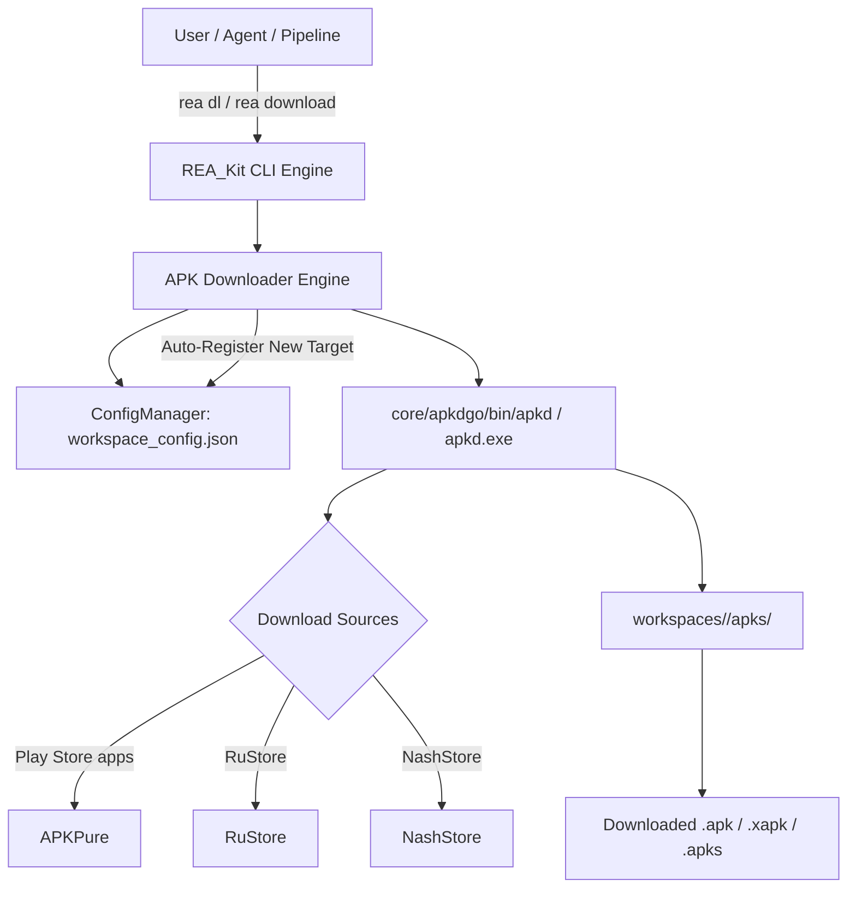

# Automated Target Downloader Guide

This guide describes how to configure and execute automated target APK downloads in **REA_Kit** using the unified CLI and the bundled Go-based downloading binary (**`apkd`**).

---

## Downloading Engine Overview

Downloading Android applications manually from third-party app stores or web aggregators is slow, prone to version drift, and difficult to automate. `REA_Kit` integrates a compiled Go-based downloading utility (**`apkd`**), located in `core/apkdgo/bin/apkd` (or `apkd.exe` on Windows), orchestrated directly by the `rea download` command.



---

## Downloading Targets via CLI (`rea dl` / `rea download`)

The unified CLI command `rea dl` reads targets directly from `workspace_config.json` or accepts targets on the command line, resolves package names and URLs, provisions target folders, and downloads packages directly into `workspaces/<package>/apks/`.

### Command-line Syntax

```bash
rea download [target] [options]
```

*Alias:* `rea dl`

### Options

| Flag | Long Option | Description | Default |
|---|---|---|---|
| `-t` | `--target <pkg_or_alias>` | Target package name or configured alias | Active target / all |
| `-l` | `--link <url_or_pkg>` | Direct Play Store URL or package name | None |
| `-s` | `--source <provider>` | Pin a source (`apkpure`, `rustore`, `nashstore`); retries with all sources if it fails | All sources |
| | `--targets <file>` | Path to custom targets text file | None |
| `-w` | `--workspace <dir>` | Custom workspace root directory path | `./workspaces` |
| `-c` | `--config <file>` | Path to workspace configuration file | `config/workspace_config.json` |

---

### Practical Examples

#### 1. Download All Configured Targets
Download packages for every target configured in `workspace_config.json`:
```bash
rea dl
```

#### 2. Download a Specific Target by Package Name
```bash
rea dl com.zodiac.horoscope.palmreader.scanpalmistry
```

#### 3. Download from a Google Play Store URL
Pass the Play Store URL directly (automatically extracts package ID and initializes workspace):
```bash
rea dl "https://play.google.com/store/apps/details?id=com.zodiac.horoscope.palmreader.scanpalmistry"
```

#### 4. Specify a Download Source Repository
Download from alternative app repositories such as RuStore or NashStore:
```bash
# Download from RuStore
rea dl ru.vk.store -s rustore
```

---

## Automatic Target Registration

When you download a package that was not previously registered in `workspace_config.json`, `REA_Kit` automatically registers it:

1. **Detection:** Identifies new package IDs from CLI arguments or Play Store URLs.
2. **Alias Generation:** Derives a clean, readable alias (e.g. `com.lichess.mobileV2` -> `Mobilev2`).
3. **Configuration Persistence:** Appends the target entry to the `"targets"` array in `workspace_config.json`.
4. **Workspace Provisioning:** Initializes directory trees (`apks/`, `jadx_src/`, `docs/`, `runtime/`) on the fly.

This ensures newly fetched packages are immediately accessible by decompiler and runtime tools without manual JSON editing.

---

## Downloader Engine Reference (`apkd`)

The core downloader is powered by the compiled Go binary in `core/apkdgo/bin/apkd` (or `apkd.exe` on Windows).

### Standalone CLI Arguments

```text
Flags:
      --config string       path to YAML config file (defaults to ~/.config/apkd/config.yml if present)
      --dev                 download all apps from developer
  -f, --file string         file containing package names
  -F, --force               force download even if the file already exists
  -l, --list-sources        list available download sources
  -O, --output-dir string   output directory for downloaded APKs
  -o, --output-file string  output file name for downloaded APKs
  -p, --package stringArray package name of the app
      --proxy string        global proxy URL for all traffic
      --proxy-insecure      skip TLS certificate verification for requests sent through proxy
  -s, --source stringArray  specify source(s) for downloading
  -v, --verbose count       Set verbosity level. Use -v or -vv for more verbosity
  -V, --version             print version and exit
      --workers int         number of worker goroutines (default 3)
```

---

## Troubleshooting & Network Tips

1. **Network Timeout or Cloudflare Block:**
   Some aggregators rate-limit aggressive downloads. If downloads stall, verify your internet connection or use a proxy.
2. **App Not Found on Source:**
   By default every source is queried and the newest version wins. If that download fails, apkd falls back to the next source that has the app, so a single blocked store no longer fails the download.
3. **Force Redownload:**
   If an APK archive is incomplete or corrupted, run the download with force flag or remove the existing file in `workspaces/<package>/apks/`.
