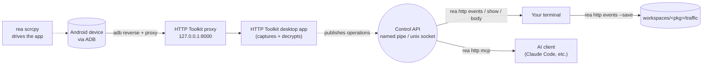

# API Traffic Capture Guide (`rea http`)

Static analysis tells you what an app *could* do; the network tells you what it *does*. `rea http`
is the network half of a target, alongside `rea native` (compiled code) and `rea pull` (on-device
files). It drives [HTTP Toolkit](https://httptoolkit.com) — a local intercepting proxy — from the
`rea` CLI:

1. **Start** the HTTP Toolkit desktop app on demand and wait until its API answers.
2. **Point** a connected ADB device at the proxy so app traffic flows through it.
3. **Read** the captured exchange log from the shell — list, filter, inspect, dump bodies.
4. Optionally expose the *same* app over MCP so an AI client can drive it.

Nothing here is a re-implementation: HTTP Toolkit already ships a local control API, and `rea http`
is a first-class client of it, in the same shape as `rea native` is a client of GhidraMCP.



---

## 1. One-time setup

| Requirement | Notes |
|---|---|
| **HTTP Toolkit desktop app** | Download from [httptoolkit.com/download](https://httptoolkit.com/download/). The installer bundles everything else — the server, the `httptoolkit-ctl` and `httptoolkit-mcp` wrappers. Nothing is vendored into `core/`. |
| **ADB** | Already bundled with REA_Kit (`core/scrcpy_cli/vendor/scrcpy/adb.exe`). Only needed for `rea http android`. |

REA_Kit finds the installation automatically in the usual per-platform locations. If yours lives
somewhere unusual, point at it with either:

```jsonc
// workspace_config.json
{ "httpToolkitHome": "D:/Tools/HTTP Toolkit" }
```

...or the environment variables the app's own wrappers use: `HTK_DESKTOP_RESOURCES` (the
`resources` directory) and `HTK_DESKTOP_EXE` (the executable).

```bash
rea http setup     # doctor: install, wrappers, live API, proxy, event log, adb
```

---

## 2. How REA_Kit talks to HTTP Toolkit

The desktop app exposes a small control API over a **local IPC endpoint** — a named pipe
(`\\.\pipe\httptoolkit-ctl`) on Windows, a unix socket elsewhere. It has three routes:

| Route | Purpose |
|---|---|
| `GET /api/status` | `{"ready": true}` once the UI has connected |
| `GET /api/operations` | the operations the UI currently publishes, with JSON schemas |
| `POST /api/execute` | run one operation |

`reakit/httptoolkit.py` speaks HTTP/1.1 over that endpoint using nothing but the standard library,
keeping REA_Kit's zero-dependency rule. There is no port to configure and no token to manage.

> **Why the UI must be running.** The operation list is published *by the desktop UI* over the
> app's operation bridge. Starting only the headless `httptoolkit-server` gives you a working proxy
> but an empty operation list — so `rea http start` launches the desktop app, not the server.

### Account tiering — read this before you file a bug

HTTP Toolkit gates its remote-control API by account tier, and the gate keys off the `source` field
of `/api/execute`:

| Source | Free tier | Pro |
|---|---|---|
| `ctl` (what `httptoolkit-ctl` sends) | **blocked** for everything except `account.*` | everything |
| `mcp` (what `rea http` sends) | every operation whose `tiers` includes `free` | everything |

Today that free set covers the whole `events.*` log, `proxy.get-config` and `interceptors.list` —
i.e. everything `rea http` needs. **`rea http` therefore identifies as an MCP client**, which is
what makes the traffic log readable without Pro. Running `httptoolkit-ctl` directly returns
`TIER_REQUIRED_PRO`; `rea http ctl` is a passthrough for that upstream CLI and inherits the same gate.

Free tier also enforces per-session limits the app itself applies, not REA_Kit:

* 500 `events.get-outline` calls per session
* 100 body calls per session, each capped at 100,000 characters (`rea http body` reports truncation
  and prints the `--offset` to continue with)

Check what your account can reach at any time:

```bash
rea http ops              # each operation, its tiers, and whether it is free
```

---

## 3. A dynamic session, end to end

Once HTTP Toolkit is running and the device is wired (see below), **bare `rea http` just
listens** — that is the command you want mid-session:

```bash
rea http                          # stream new exchanges while you drive the app
# ...in another terminal:
rea scrcpy tap 500 1200           # drive the UI; traffic appears in the feed
rea http events -f "hostname*=api"
rea http show 4a72e9f1            # headers, status, timing, body sizes
rea http body 4a72e9f1 --response # dump the response body
```

`rea http` takes the same flags as `rea http watch` (`-f`, `-g`, `--interval`, `--limit`)
and assumes the app, the device proxy and the CA are already set up. If nothing is
listening it says so immediately rather than spinning.

First-time (or after a reboot) wiring, which the listen path assumes has happened:

```bash
rea http start                    # launch the app, wait for the API, report the proxy port
rea http android --on             # adb reverse + device proxy + push the CA certificate
rea http android --off            # afterwards: hand the device back
```

### Pointing the device at the proxy

`rea http android --on` mirrors what HTTP Toolkit's own `android-adb` interceptor does:

1. `adb reverse tcp:<port> tcp:<port>` so the device reaches the proxy on its **own loopback** —
   this survives Wi-Fi changes and works on emulators.
2. `settings put global http_proxy 127.0.0.1:<port>`.
3. Pushes the CA certificate to `/data/local/tmp/httptoolkit-ca.pem`.

If `adb reverse` fails it falls back to the first LAN address the app reports; `--host <ip>` forces
that path explicitly.

**Certificate trust is the part that is not automatic.** Pushing the file is not installing it.
Since Android 7, user-store CAs are ignored by apps unless they opt in, so pick one:

| Approach | Applies to |
|---|---|
| Settings → Security → Encryption & credentials → Install a certificate | apps that trust user CAs (rare in production apps) |
| Rooted/system store: remount `/system` and copy the cert in as `<subject_hash_old>.0` | every app on the device |
| A debuggable rebuild with a `network_security_config` trusting user CAs | one app you control |
| HTTP Toolkit's own Frida interceptor (`android-frida`) | apps with certificate pinning |

> **Rooted devices:** HTTP Toolkit's Android app injects the CA into the system store by
> bind-mounting a **tmpfs** over `/system/etc/security/cacerts`. That grants system-wide trust, but
> it is not persistent — **a reboot drops it**, and the interceptor has to be re-activated. Verify
> with `adb shell su -c "mount | grep cacerts"` (expect a `tmpfs` line) and
> `adb shell su -c "ls /system/etc/security/cacerts"` (expect the extra `<hash>.0`).

`rea http android --off` clears the device proxy and removes **only** the reverse tunnel on the
proxy port — never `--remove-all`, since HTTP Toolkit's own interceptor keeps a tunnel on that port
and other tooling may hold unrelated ones.

---

## 4. Reading the log

### `rea http events` (`log`, `ls`)

```bash
rea http events -n 50                          # last 50 exchanges
rea http events -f "status>=400"               # server-side filter
rea http events -f "hostname*=api method=POST"
rea http events -g "login|token"               # client-side regex over URL / method / source
rea http events --json                         # raw JSON
rea http events --save -t com.example.app      # snapshot into the workspace
```

`--filter` uses **HTTP Toolkit's own filter syntax** — the same expressions as the UI search bar.
Filters are space-separated and ANDed; operators are `=`, `!=`, `^=`, `$=`, `*=`, `>`, `>=`, `<`, `<=`.

| Filter | Matches |
|---|---|
| `method=POST` | POST requests |
| `hostname$=.google.com` | hosts ending in `.google.com` |
| `path^=/api` | paths starting with `/api` |
| `status>=400` | error responses |
| `header[Authorization]^=Bearer` | bearer-token requests |
| `body*=password` | bodies containing `password` |
| `bodySize>=10000` | large payloads |
| `contains(secret)` | method, URL, headers **and** body at once |
| `not(path$=.css)` / `or(a, b)` | logical composition |

Full reference: [httptoolkit.com/docs/reference/view-page](https://httptoolkit.com/docs/reference/view-page/#filtering-intercepted-traffic).

`--save` writes a snapshot to `workspaces/<pkg>/traffic/traffic_<label>_<timestamp>.json`, so
captured traffic lands beside the APKs, decompiled sources and pulled runtime files for the same
target.

> **Ordering.** HTTP Toolkit's `events.list` paginates **oldest-first**, so a naive `limit=20` returns
> the twenty requests the session *started* with. `rea http events` therefore seeks to the tail and
> shows the newest exchanges, printed chronologically (newest at the bottom, next to your prompt).
> Passing `--offset` explicitly switches to literal paging from the oldest exchange, which is what
> you want when walking a long capture forward.

### `rea http` / `rea http watch` (`tail`)

Polls the API and prints only exchanges it has not seen yet — the backlog is noted and skipped, so
the feed is live traffic only. Pair it with `rea scrcpy` in another terminal. This is what a bare
`rea http` does, so the subcommand is optional.

```bash
rea http                           # every new exchange (same as `rea http watch`)
rea http -f "hostname*=api"        # server-side filter
rea http -g "token" --interval 1
```

It refuses to start if HTTP Toolkit is not running and ready; once attached, it rides out a
restart of the app rather than exiting.

### `rea http show` / `rea http body`

Event ids are UUIDs, but **any 8-character prefix from the `events` table is enough** — `rea http`
expands it against the recent log.

```bash
rea http show 4a72e9f1                              # headers, status, timing, body sizes
rea http body 4a72e9f1 --response                   # response body to stdout
rea http body 4a72e9f1 --request --out req.json     # request body to a file
rea http body 4a72e9f1 --response --offset 100000   # continue past a free-tier truncation
```

---

## 5. Command reference

| Command | Aliases | Description |
|---|---|---|
| `rea http` | | **Default: listen.** Stream new exchanges (`-f`, `-g`, `--interval`, `--limit`) |
| `rea http status` | | Is the app running, ready, and what has it captured |
| `rea http start` | `launch` | Launch the desktop app and wait for its API (`--no-wait`, `--timeout`) |
| `rea http events` | `log`, `ls` | List captured exchanges (`-f`, `-n`, `--offset`, `-g`, `--json`, `--save`, `-t`, `--label`) |
| `rea http watch` | `tail` | Stream new exchanges (`-f`, `-g`, `--interval`, `--limit`) |
| `rea http show <id>` | `outline` | Headers, status, timing and body sizes (`--json`) |
| `rea http body <id>` | | Dump a body (`--request`, `--response`, `--offset`, `--max-length`, `-o`, `--json`) |
| `rea http clear` | | Clear captured events (`--pinned`) |
| `rea http proxy` | | Proxy port, CA certificate path, fingerprint, reachable addresses (`--json`) |
| `rea http interceptors` | `int` | Interceptors and their state (`-a`, `-g`, `--json`) |
| `rea http cert` | | Print or export the CA certificate (`-o`) |
| `rea http android` | `device` | Wire an ADB device to the proxy (`--on`, `--off`, `-s`, `--host`, `--no-cert`, `--port`) |
| `rea http ops` | `operations` | Operations the app publishes, with tiers (`-v`, `--json`) |
| `rea http call <op>` | | Call any operation directly (`-p key=value`, `--source`, `-g`) |
| `rea http mcp` | | Run HTTP Toolkit's stdio MCP server (`--print-config`) |
| `rea http ctl` | | Passthrough to the bundled `httptoolkit-ctl` (**requires Pro**) |
| `rea http setup` | `doctor` | Check the installation and the live API |

### `rea http call`

The escape hatch, mirroring `rea native call`. Operation names come from `rea http ops`; short
aliases (`events`, `outline`, `proxy`, `interceptors`, `clear`, …) map onto them. Values are
coerced to the JSON type the operation's schema expects.

```bash
rea http call proxy
rea http call events -p limit=100 -p "filter=status>=400"
rea http call events.get-outline -p id=<full-uuid>
rea http call events.clear -p clearPinned=true
```

---

## 6. For AI clients

HTTP Toolkit ships its own stdio MCP server; `rea http mcp` runs it and `--print-config` emits
ready-to-paste client configuration:

```bash
rea http mcp --print-config
```

```json
{
  "mcpServers": {
    "http-toolkit": {
      "type": "stdio",
      "command": "C:\\Users\\you\\AppData\\Local\\Programs\\HTTP Toolkit\\resources\\httptoolkit-mcp.cmd"
    }
  }
}
```

```bash
claude mcp add http-toolkit -- "<path>/httptoolkit-mcp.cmd"
```

The MCP server exposes the same operations `rea http` uses. When the app is not running it
advertises a single `start_httptoolkit` tool and the rest appear once it is up — the same
launch-on-demand behaviour as `rea http start`.

---

## 7. Troubleshooting

| Symptom | Cause / fix |
|---|---|
| `HTTP Toolkit is not running` | The control endpoint is absent. `rea http start`. |
| `Running, UI not connected yet` | The server is up but the desktop window has not connected. Open the app once. |
| `TIER_REQUIRED_PRO` | A Pro-only operation, or a `ctl`-sourced call. `rea http ops` shows what is free. |
| Body comes back truncated | Free-tier 100,000-character cap. Continue with the `--offset` the warning prints. |
| Empty event log while the device is busy | Traffic is not reaching the proxy. Check `rea http proxy`, re-run `rea http android --on`, and confirm certificate trust. |
| HTTPS requests fail or the app shows network errors | Certificate not trusted by the app. See the certificate table in §3 — for pinned apps use HTTP Toolkit's `android-frida` interceptor. |
| `adb reverse failed` | No device, or another tunnel holds the port. `rea env` lists devices; `adb reverse --list` shows tunnels. |
