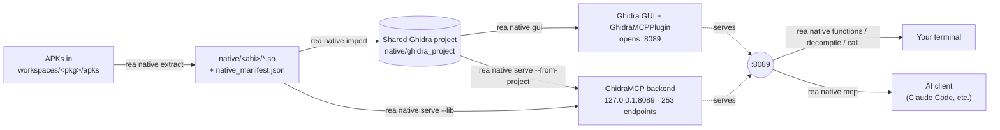

# Native Library Analysis Guide (`rea native`)

Android apps hide their interesting logic in `lib/<abi>/*.so`: crypto, signing, anti-tamper,
device fingerprinting, protocol serialization. JADX cannot see any of it. `rea native` covers
that half of the target:

1. **Extract** every `.so` out of the APK / XAPK / split archives and fingerprint it offline.
2. **Serve** one library through a headless Ghidra backend — no GUI, no clicking.
3. **Query** that backend from the shell (functions, strings, decompiled C, xrefs, …).
4. Optionally expose the *same* backend over MCP so an AI client can drive it.

The backend is [bethington/ghidra-mcp](https://github.com/bethington/ghidra-mcp) (`GhidraMCP`),
cloned into `core/ghidra_mcp`. It exposes **253 REST endpoints** on `http://127.0.0.1:8089`, and
that port can be opened **two interchangeable ways** — everything downstream (the CLI, the MCP
bridge, `claude mcp add`) is identical either way:

* **Headless** — `com.xebyte.headless.GhidraMCPHeadlessServer`, a GUI-free process
  (`rea native serve`). Best for scripting and CI.
* **GUI + plugin** — the `GhidraMCPPlugin` running inside the Ghidra CodeBrowser
  (`rea native gui`, then enable the plugin). Best for browsing visually while an AI or the CLI
  drives the same program.

The port is a **server**; the CLI and the MCP bridge are **clients** that dial it. They meet at
`GHIDRA_MCP_URL` and never talk to each other directly.

**Two predefined ports** so the GUI and a headless server can run at the same time without
colliding:

| Backend | Default port | Configure | Notes |
|---|---|---|---|
| GUI plugin | **8089** | `ghidraGuiPort` / `GHIDRA_GUI_PORT` | the GhidraMCP plugin's own fixed default |
| Headless server | **8192** | `ghidraHeadlessPort` / `GHIDRA_HEADLESS_PORT` | what `rea native serve` uses, and the CLI's default query URL |

The CLI defaults to the **headless** port (8192). To drive a GUI-hosted plugin instead, point at
its port: `rea native functions --url http://127.0.0.1:8089` or `export GHIDRA_MCP_URL=…:8089`.
`rea native setup` probes both and tells you which is live.



---

## 1. One-time setup

| Requirement | Notes |
|---|---|
| **Ghidra 12.x** | A downloaded release **binary** (~875 MB) — gitignored, not committed. Get it with `rea native fetch-ghidra`, or set `GHIDRA_HOME` / `"ghidraHome": "<dir>"` in `workspace_config.json` to point at an existing install (relative paths resolve against the project root). |
| **JDK 21** | Taken from the machine. REA_Kit prefers a JDK 21 found in `JAVA_HOME`, on `PATH`, or under the usual multi-JDK roots (`C:\Program Files\Java`, `~/.jdks`, `/usr/lib/jvm`, …). Override with `REA_JAVA`. |
| **Maven 3.9+** | Only needed to build the plugin jar. |
| **GhidraMCP** | A **git submodule** at `core/ghidra_mcp` → [bethington/ghidra-mcp](https://github.com/bethington/ghidra-mcp). Pulled by `git clone --recurse-submodules`, or `git submodule update --init core/ghidra_mcp`. |

> **Why not bundle Ghidra in the repo?** It's an 875 MB / 5,000-file release binary (with
> individual jars near GitHub's 100 MB file limit). Like the JDK, it's fetched, not committed.
> GhidraMCP *is* source, so it's a pinned submodule. Small tools (jadx, apktool) stay vendored.

```bash
rea native build      # installs Ghidra jars into ~/.m2, builds GhidraMCP.jar,
                      # deploys the extension, pip-installs the MCP bridge
rea native setup      # doctor: Ghidra, JDK, jar, endpoint spec, bridge, live server
```

Useful `build` flags: `--ghidra-home <dir>`, `--no-deploy` (skip installing into Ghidra),
`--skip-prereqs` (Maven repo already primed), `--bridge-only`, `--no-bridge`.

Extraction (step 2 below) needs **none** of this — it is pure Python.

---

## 2. Extract the native libraries

```bash
rea native extract com.example.app                 # every ABI found
rea native extract com.example.app --abi arm64-v8a # one ABI
rea native extract com.example.app --force         # re-extract over existing files
```

Reads `workspaces/<pkg>/apks/` — plain APKs, XAPK/APKS bundles (expanded automatically), and
split config APKs — and writes:

```
workspaces/<pkg>/native/
├── arm64-v8a/libfoo.so
├── armeabi-v7a/libfoo.so
├── embedded/assets/…/libhidden.so    # .so files smuggled outside lib/
└── native_manifest.json              # per-library fingerprint (see below)
```

Each entry is fingerprinted by a dependency-free ELF parser: class/endianness, machine and ABI,
SONAME, `DT_NEEDED`, dynamic symbol counts, exported/imported symbol names, `Java_*` JNI exports,
`JNI_OnLoad`, `.text` size, strip state, compiler `.comment`, SHA-256, plus:

* **Packer detection** — 360 Jiagu, Bangcle, SecNeo, Tencent Legu, Alibaba, NQ Shield, Virbox, …
* **Framework detection** — Flutter, Unity IL2CPP, React Native/Hermes, Xamarin, Go, V8, …
* **Non-ELF payloads** — files with a `.so` name that are really DEX, ZIP, or a packed container
  (TikTok, for example, ships 56 of them: `libdex_df_*.so` are ZIPs, `libttc2pa.so` is a
  ByteDance `KOM` container).

Inspect without Ghidra:

```bash
rea native list com.example.app                    # ranked table (packers and JNI first)
rea native list com.example.app --grep crypto --limit 0
rea native list com.example.app --json             # the raw manifest
rea native info com.example.app --lib libfoo.so    # full ELF report for one library
rea native info ./some/other.so                    # any path works
```

---

## 3a. GUI path — import a project and open it in Ghidra

To browse in the Ghidra GUI, import the libraries into one shared project first (per-ABI folders),
then open it. Analysis runs once during import and is cached, so the GUI — and a later headless
`serve --from-project` — both open instantly.

```bash
rea native import com.example.app                 # one preferred ABI, all its libraries
rea native import com.example.app --lib libfoo    # just matching libraries
rea native import com.example.app --all-abis      # every ABI (separate project folders)
rea native import com.example.app --abi arm64-v8a --overwrite

rea native gui com.example.app                    # launch Ghidra on that project
```

Import writes `workspaces/<pkg>/native/ghidra_project/<pkg>.gpr` with programs under `/<abi>/…`.
Libraries over 64 MB are skipped by default (`--max-size-mb 0` or `--force` to include them);
`--no-analyze` imports without auto-analysis, `--cpu` / `--analysis-timeout` / `--heap` tune it.

**Enabling the GhidraMCP plugin in the GUI** (needed once, so the GUI itself serves `:8089`):

1. Install the extension where Ghidra loads it (done automatically by `rea native build`; run it
   by hand any time with):
   ```bash
   rea native gui --install-plugin          # extracts GhidraMCP into the user Extensions dir
   rea native setup                         # doctor line "GUI plugin installed: ..." confirms it
   ```
2. **Restart Ghidra** if it was already open (a running GUI won't see a newly installed extension).
3. Open a program — Ghidra prompts *"Configure new plugins?"*; accept it. Or enable it manually:
   `File > Configure > Miscellaneous > GhidraMCPPlugin`.
4. Confirm it is live from another terminal:
   ```bash
   rea native call check                    # -> connection ok, from the GUI-hosted server
   ```

Once enabled, the plugin serves `:8089`, so the CLI and the MCP bridge below work against whatever
program you have open — exactly as they do against the headless server. Do not run
`rea native serve` at the same time; both want port `8089` (give one a different `--port`).

## 3b. Headless path — serve one library (no GUI)

```bash
# start detached, wait until the HTTP API answers, keep it running
rea native serve com.example.app --lib libfoo.so --background

# foreground (Ctrl+C to stop), pick ABI, larger heap
rea native serve com.example.app --lib libfoo --abi arm64-v8a --heap 8g
```

Without `--lib` the largest library for the preferred ABI is chosen; a warning is printed for
libraries over 64 MB, where auto-analysis takes a long time (TikTok's 143 MB
`libAwebviewbytedance.so` is the cautionary example).

Other flags: `--file <path>` (any binary, no workspace needed), `--no-load` (empty server),
`--port`, `--bind`, `--project` / `--program` (reuse a saved Ghidra project), `--jar`, `--java`,
`--timeout` (readiness wait in background mode).

You can also reuse the GUI-imported project headlessly — no re-analysis:

```bash
rea native serve com.example.app --from-project --lib libfoo -d
```

`--from-project` opens `native/ghidra_project` and auto-loads a program (pin it with `--lib` or
`--program /<abi>/<name>`; only libraries that were `import`ed are loadable).

```bash
rea native stop            # stop the detached server
rea native load com.example.app --lib libbar.so   # swap in another library, same server
```

Background servers log to `~/.reakit/ghidra_mcp.log` with the PID in `~/.reakit/ghidra_mcp.pid`.

---

## 4. Query it from the shell

Short commands cover the everyday endpoints. Every one accepts `--grep <regex>` (filters
response lines), `--limit N`, `-p key=value` (any documented parameter), `--raw`, `--url`,
`--token`.

```bash
rea native program                        # what is loaded, language, image base
rea native jni                            # Java_* entry points - the Java/native boundary
rea native functions --grep ^Java_ --limit 50
rea native decompile Java_com_example_Foo_check   # decompiled C, by name
rea native decompile 0x001180a4                   # or by address
rea native disassemble 0x001180a4
rea native strings --grep -i "api|token|secret"
rea native search-strings http --limit 20
rea native imports --grep "ptrace|dlopen|prctl"   # anti-debug surface
rea native exports
rea native segments
rea native xrefs-to 0x001180a4
rea native memory 0x00100000 -p length=64
```

Anything not covered by a short command is still one call away — the CLI reads the upstream
endpoint spec (`core/ghidra_mcp/tests/endpoints.json`, 253 endpoints) and validates parameters
against it:

```bash
rea native endpoints                      # browse the whole API
rea native endpoints --grep struct
rea native endpoints --category decompile
rea native call /analyze_function_complete -p name=JNI_OnLoad
rea native call /rename_function -p old_name=FUN_00101234 -p new_name=verify_signature
rea native call /set_comment -p address=0x101234 -p comment="checks the APK signature"
```

Renames, comments, struct edits and re-analysis all persist in the Ghidra project, so work done
from the CLI is visible if you later open the same project in the Ghidra GUI.

---

## 5. Same backend, over MCP

The REST server the CLI just used is exactly what the MCP bridge proxies, so an AI client can
continue the session:

```bash
rea native mcp --print-config     # config snippet + a ready-made 'claude mcp add' line
rea native mcp                    # run the bridge on stdio
rea native mcp -- --transport streamable-http --mcp-port 8081
```

```bash
claude mcp add ghidra --env GHIDRA_MCP_URL=http://127.0.0.1:8089 -- bridge-mcp-ghidra
```

---

## 6. Full walkthrough

```bash
rea pipeline com.example.app          # init -> download -> decode -> extract .so
rea native list com.example.app       # what native code ships, packed or not
rea native serve com.example.app --lib libsecurity.so -d
rea native jni                        # find the JNI entry points
rea native decompile Java_com_example_Security_sign
rea native strings --grep -i "key|secret|token"
rea native imports --grep "ptrace|prctl|dlopen"
rea native stop
```

`rea pipeline` runs the extraction step automatically (skip it with `--skip-native`), and
`rea target list` reports how many native libraries each workspace holds.

---

## Troubleshooting

| Symptom | Cause and fix |
|---|---|
| `GhidraMCP jar not built` | Run `rea native build` (needs Maven and a JDK). |
| `Ghidra installation not found` | Unzip Ghidra into `core/ghidra/`, or set `GHIDRA_HOME`. |
| `... unreachable: [WinError 10061]` | No server running: `rea native serve <pkg> --lib <name> -d`. |
| Server never becomes ready | Auto-analysis of a large `.so` can take many minutes; watch `~/.reakit/ghidra_mcp.log` and raise `--timeout`. |
| `Running on JDK 25; Ghidra 12.x targets JDK 21` | Informational. Point `REA_JAVA` or `JAVA_HOME` at a JDK 21 if anything misbehaves. |
| `not ELF: ZIP/JAR/APK archive` in `list` | That `.so` is a disguised payload (dynamic feature module), not native code — nothing to analyze. |
| Empty `functions` output | The program is loaded but not analyzed yet: `rea native call /reanalyze -X POST`. |
| Packer detected | The real code is unpacked at runtime; dump the loaded library from memory (`rea pull`, Frida) and analyze that instead. |
| `URL can't contain control characters … /C:/Program Files/Git/…` | Git Bash rewrites a leading-slash argument into a Windows path. Use the bare alias (`rea native call count`, no slash), prefix the command with `MSYS_NO_PATHCONV=1`, or run from PowerShell/cmd. |
