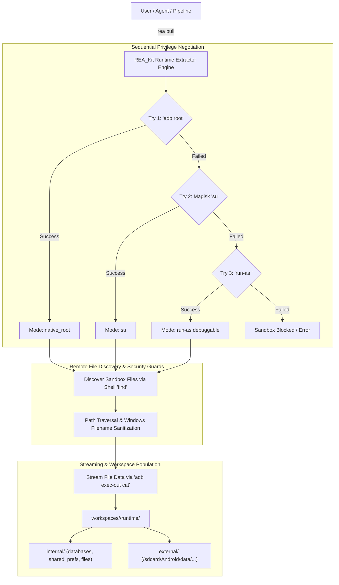

# Android Runtime Sandbox Data Extraction Guide

This guide details how to automatically extract dynamic application sandbox storage (SQLite databases, Shared Preferences XML, caches, and external files) from physical devices and emulators using **REA_Kit**.

---

## Sandbox Data Puller (`rea pull` / `rea runtime`)

During application execution on Android, internal app states are protected behind Linux user-isolation sandboxes (`/data/data/<package_name>`).

The `rea pull` command bridges this boundary by automatically negotiating permissions across multiple privilege tiers and downloading internal databases, configurations, and caches directly into your local workspace.

### Core Extraction Architecture



---

## CLI Command Reference (`rea pull` / `rea runtime`)

```bash
rea pull [package_name] [options]
```

*Alias:* `rea runtime`

### Options

| Flag | Long Option | Description | Default |
|---|---|---|---|
| | `[package_name]` | Target package name (positional) | Active target from config |
| `-p` | `--package <pkg>` | Target Android package name | Active target from config |
| `-t` | `--target <pkg>` | Alias for `--package` | Active target from config |
| `-w` | `--workspace <dir>` | Custom workspace root directory path | `./workspaces` |
| `-c` | `--config <file>` | Path to workspace configuration file | `config/workspace_config.json` |

---

### Practical Examples

#### 1. Extract Runtime Data for Active Target
Pulls data for the primary target configured in `workspace_config.json`:
```bash
rea pull
```

#### 2. Extract Runtime Data by Package Identifier
Specify the target package directly as a positional argument:
```bash
rea pull com.zodiac.horoscope.palmreader.scanpalmistry
```

#### 3. Extract Runtime Data with Explicit Package Flag
```bash
rea pull --package com.example.target
```

---

## Sequential Privilege Escalation Negotiation

`REA_Kit` automatically evaluates and executes a 3-tier fallback strategy to access locked internal files without manual shell commands:

### Tier 1: Native ADB Daemon Root (`native_root`)
* **Target Environments:** Standard Android Virtual Devices (AVD), Android Studio Emulators, Genymotion, or engineering firmware builds.
* **Mechanism:** Runs `adb root` to restart the adbd daemon with root privileges, granting immediate unrestricted filesystem access.

### Tier 2: Magisk Superuser Elevation (`su`)
* **Target Environments:** Rooted physical hardware (e.g. Pixel, Samsung, OnePlus with Magisk / KernelSU / APatch).
* **Mechanism:** Executes file search commands wrapped via Magisk shell elevation:
  ```bash
  adb shell "su -c 'find /data/data/<package_name> -type f'"
  ```
  File streams are transferred using `adb exec-out "su -c 'cat <file>'"` to bypass standard Unix permissions.

### Tier 3: Debuggable Run-As Sandbox Entry (`run-as`)
* **Target Environments:** Non-rooted production devices running debug-built applications (`android:debuggable="true"`).
* **Mechanism:** Executes instructions directly under the target package's application Linux UID:
  ```bash
  adb shell run-as <package_name> find /data/data/<package_name> -type f
  ```
  This allows extracting sandbox data without rooting the physical device.

---

## Security: Path Traversal & Filename Sanitization

Transferring file hierarchies from Unix-based Android devices to Windows hosts requires active filesystem protections. `RuntimeExtractor` enforces:

* **Filename Sanitization:** Replaces characters illegal on Windows filesystems (`<>:"/\|?*`) with underscores to prevent OS filesystem exceptions.
* **Path Traversal Guards:** Computes `PurePosixPath` mappings relative to the app's base sandbox folder. Any path containing injection markers (`..`, absolute path escapes, or symbolic links escaping the sandbox) is rejected.

---

## Extracted File Layout

Extracted files are cleanly partitioned into local workspace directories:

```text
workspaces/com.zodiac.horoscope.palmreader.scanpalmistry/runtime/
├── internal/                                  # Pulled from /data/data/<package_name>/
│   ├── databases/                             # SQLite database files
│   │   ├── app_database.db
│   │   └── app_database.db-journal
│   ├── shared_prefs/                          # XML preference key-value stores
│   │   ├── user_session.xml
│   │   └── analytics_config.xml
│   └── files/                                 # Encrypted blobs, keys, local caches
└── external/                                  # Pulled from /sdcard/Android/data/<package>/
    ├── cache/
    └── files/
```

---

## Troubleshooting Access Blocks

If you encounter:
`[!] Sandbox blocked read. Make sure the app is installed, device is rooted, or app is debuggable.`

1. **Verify ADB Connectivity:** Run `rea env` or `adb devices` to ensure your device is recognized with authorization (`device` status, not `unauthorized` or `offline`).
2. **Confirm App is Installed:** Ensure the target package is installed on the connected device.
3. **Grant Magisk Permissions:** On rooted physical devices, unlock the screen and confirm that the Magisk Superuser prompt was granted to `com.android.shell` / ADB.
4. **Debuggable Flag:** On non-rooted devices, ensure the APK was built with `android:debuggable="true"` in its `AndroidManifest.xml` to allow `run-as` execution.
