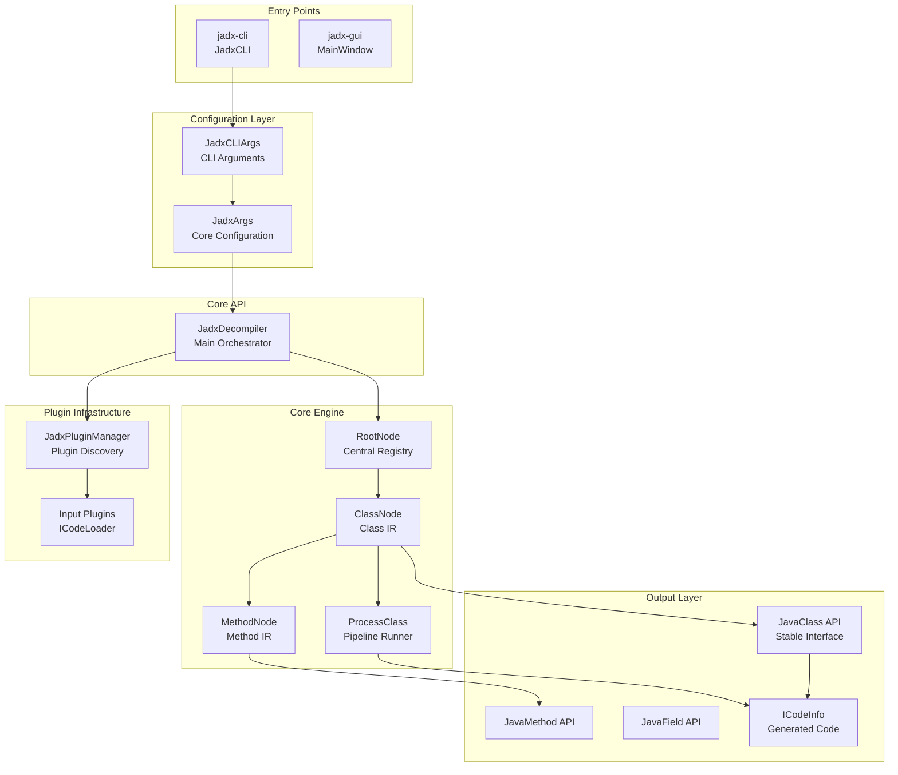
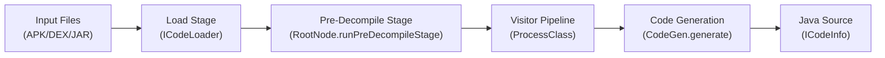

# Overview

Relevant source files

The following files were used as context for generating this wiki page:

- [README.md](https://github.com/skylot/jadx/blob/HEAD/README.md)
- [jadx-cli/src/main/java/jadx/cli/JCommanderWrapper.java](https://github.com/skylot/jadx/blob/HEAD/jadx-cli/src/main/java/jadx/cli/JCommanderWrapper.java)
- [jadx-cli/src/main/java/jadx/cli/JadxCLI.java](https://github.com/skylot/jadx/blob/HEAD/jadx-cli/src/main/java/jadx/cli/JadxCLI.java)
- [jadx-cli/src/main/java/jadx/cli/JadxCLIArgs.java](https://github.com/skylot/jadx/blob/HEAD/jadx-cli/src/main/java/jadx/cli/JadxCLIArgs.java)
- [jadx-cli/src/main/java/jadx/cli/LogHelper.java](https://github.com/skylot/jadx/blob/HEAD/jadx-cli/src/main/java/jadx/cli/LogHelper.java)
- [jadx-cli/src/test/java/jadx/cli/JadxCLIArgsTest.java](https://github.com/skylot/jadx/blob/HEAD/jadx-cli/src/test/java/jadx/cli/JadxCLIArgsTest.java)
- [jadx-core/src/main/java/jadx/api/JadxArgs.java](https://github.com/skylot/jadx/blob/HEAD/jadx-core/src/main/java/jadx/api/JadxArgs.java)
- [jadx-core/src/main/java/jadx/api/JadxDecompiler.java](https://github.com/skylot/jadx/blob/HEAD/jadx-core/src/main/java/jadx/api/JadxDecompiler.java)
- [jadx-core/src/main/java/jadx/api/JavaClass.java](https://github.com/skylot/jadx/blob/HEAD/jadx-core/src/main/java/jadx/api/JavaClass.java)
- [jadx-core/src/main/java/jadx/api/JavaField.java](https://github.com/skylot/jadx/blob/HEAD/jadx-core/src/main/java/jadx/api/JavaField.java)
- [jadx-core/src/main/java/jadx/api/JavaMethod.java](https://github.com/skylot/jadx/blob/HEAD/jadx-core/src/main/java/jadx/api/JavaMethod.java)
- [jadx-core/src/main/java/jadx/core/ProcessClass.java](https://github.com/skylot/jadx/blob/HEAD/jadx-core/src/main/java/jadx/core/ProcessClass.java)
- [jadx-core/src/main/java/jadx/core/dex/info/ClassInfo.java](https://github.com/skylot/jadx/blob/HEAD/jadx-core/src/main/java/jadx/core/dex/info/ClassInfo.java)
- [jadx-core/src/main/java/jadx/core/dex/nodes/ClassNode.java](https://github.com/skylot/jadx/blob/HEAD/jadx-core/src/main/java/jadx/core/dex/nodes/ClassNode.java)
- [jadx-core/src/main/java/jadx/core/dex/nodes/RootNode.java](https://github.com/skylot/jadx/blob/HEAD/jadx-core/src/main/java/jadx/core/dex/nodes/RootNode.java)
- [jadx-core/src/main/java/jadx/core/utils/android/AndroidResourcesUtils.java](https://github.com/skylot/jadx/blob/HEAD/jadx-core/src/main/java/jadx/core/utils/android/AndroidResourcesUtils.java)
- [jadx-core/src/main/java/jadx/core/utils/files/FileUtils.java](https://github.com/skylot/jadx/blob/HEAD/jadx-core/src/main/java/jadx/core/utils/files/FileUtils.java)
- [jadx-core/src/main/java/jadx/core/xmlgen/BinaryXMLParser.java](https://github.com/skylot/jadx/blob/HEAD/jadx-core/src/main/java/jadx/core/xmlgen/BinaryXMLParser.java)
- [jadx-core/src/test/java/jadx/tests/api/IntegrationTest.java](https://github.com/skylot/jadx/blob/HEAD/jadx-core/src/test/java/jadx/tests/api/IntegrationTest.java)
- [jadx-gui/src/main/java/jadx/gui/JadxGUI.java](https://github.com/skylot/jadx/blob/HEAD/jadx-gui/src/main/java/jadx/gui/JadxGUI.java)
- [jadx-gui/src/main/java/jadx/gui/JadxWrapper.java](https://github.com/skylot/jadx/blob/HEAD/jadx-gui/src/main/java/jadx/gui/JadxWrapper.java)

## Purpose and Scope

JADX is a Dex to Java decompiler designed to convert Android APK files, DEX bytecode, and Java bytecode back into readable Java source code. It serves as both a high-performance engine for automated analysis and an interactive tool for reverse engineering.

For detailed information about specific subsystems:
- Installation and basic usage: see [Getting Started](02_1.1-getting-started.md)
- Deep dive into core components: see [Architecture Overview](03_1.2-architecture-overview.md)
- Build configuration and distribution: see [Build System and Distribution](24_5-build-system-and-distribution.md)
- Plugin development: see [Plugin System](29_6-plugin-system.md)

**Sources:** [README.md:14-26](https://github.com/skylot/jadx/blob/HEAD/README.md#L14-L26), [jadx-core/src/main/java/jadx/api/JadxDecompiler.java:59-85](https://github.com/skylot/jadx/blob/HEAD/jadx-core/src/main/java/jadx/api/JadxDecompiler.java#L59-L85)

## What JADX Does

JADX transforms compiled Android and Java applications back into source code through a multi-stage decompilation pipeline. It accepts various input formats including APK, DEX, JAR, AAR, AAB, ZIP, and individual `.class` or `.smali` files [README.md:88-90](https://github.com/skylot/jadx/blob/HEAD/README.md#L88-L90).

The system provides two primary interfaces:
- **jadx-gui**: A graphical interface featuring syntax highlighting, jump-to-declaration, find usage, full-text search, and a smali debugger [README.md:27-32](https://github.com/skylot/jadx/blob/HEAD/README.md#L27-L32).
- **jadx-cli**: A command-line tool for batch decompilation, resource decoding, and automated scripting [README.md:16-17](https://github.com/skylot/jadx/blob/HEAD/README.md#L16-L17).

Beyond Java source code, JADX decodes `AndroidManifest.xml` and other resources from `resources.arsc` [jadx-core/src/main/java/jadx/core/xmlgen/BinaryXMLParser.java:26-50](https://github.com/skylot/jadx/blob/HEAD/jadx-core/src/main/java/jadx/core/xmlgen/BinaryXMLParser.java#L26-L50), and includes a deobfuscator to rename cryptic identifiers [README.md:23-25](https://github.com/skylot/jadx/blob/HEAD/README.md#L23-L25).

**Sources:** [README.md:14-32](https://github.com/skylot/jadx/blob/HEAD/README.md#L14-L32), [jadx-cli/src/main/java/jadx/cli/JadxCLIArgs.java:51-52](https://github.com/skylot/jadx/blob/HEAD/jadx-cli/src/main/java/jadx/cli/JadxCLIArgs.java#L51-L52), [jadx-core/src/main/java/jadx/core/xmlgen/BinaryXMLParser.java:26-50](https://github.com/skylot/jadx/blob/HEAD/jadx-core/src/main/java/jadx/core/xmlgen/BinaryXMLParser.java#L26-L50)

## System Architecture

**JADX System Architecture Diagram**

This diagram shows the layered organization of JADX:

1.  **Entry Points**: `jadx-cli` [jadx-cli/src/main/java/jadx/cli/JadxCLI.java:25-25](https://github.com/skylot/jadx/blob/HEAD/jadx-cli/src/main/java/jadx/cli/JadxCLI.java#L25) and `jadx-gui` [jadx-gui/src/main/java/jadx/gui/JadxWrapper.java:62-65](https://github.com/skylot/jadx/blob/HEAD/jadx-gui/src/main/java/jadx/gui/JadxWrapper.java#L62-L65) parse user input.
2.  **Configuration**: `JadxArgs` [jadx-core/src/main/java/jadx/api/JadxArgs.java:47-47](https://github.com/skylot/jadx/blob/HEAD/jadx-core/src/main/java/jadx/api/JadxArgs.java#L47) centralizes all decompilation options.
3.  **Core API**: `JadxDecompiler` [jadx-core/src/main/java/jadx/api/JadxDecompiler.java:86-86](https://github.com/skylot/jadx/blob/HEAD/jadx-core/src/main/java/jadx/api/JadxDecompiler.java#L86) orchestrates the process.
4.  **Core Engine**: `RootNode` [jadx-core/src/main/java/jadx/core/dex/nodes/RootNode.java:69-69](https://github.com/skylot/jadx/blob/HEAD/jadx-core/src/main/java/jadx/core/dex/nodes/RootNode.java#L69) and `ClassNode` [jadx-core/src/main/java/jadx/core/dex/nodes/ClassNode.java:59-59](https://github.com/skylot/jadx/blob/HEAD/jadx-core/src/main/java/jadx/core/dex/nodes/ClassNode.java#L59) hold the intermediate representation.
5.  **Plugin Infrastructure**: Discovers and loads external input formats via `JadxPluginManager` [jadx-core/src/main/java/jadx/api/JadxDecompiler.java:114-114](https://github.com/skylot/jadx/blob/HEAD/jadx-core/src/main/java/jadx/api/JadxDecompiler.java#L114).
6.  **Output Layer**: Exposes decompiled code through stable `JavaClass` [jadx-core/src/main/java/jadx/api/JavaClass.java:27-27](https://github.com/skylot/jadx/blob/HEAD/jadx-core/src/main/java/jadx/api/JavaClass.java#L27) interfaces.

**Sources:** [jadx-core/src/main/java/jadx/api/JadxDecompiler.java:86-139](https://github.com/skylot/jadx/blob/HEAD/jadx-core/src/main/java/jadx/api/JadxDecompiler.java#L86-L139), [jadx-core/src/main/java/jadx/core/dex/nodes/RootNode.java:69-127](https://github.com/skylot/jadx/blob/HEAD/jadx-core/src/main/java/jadx/core/dex/nodes/RootNode.java#L69-L127), [jadx-core/src/main/java/jadx/core/dex/nodes/ClassNode.java:59-116](https://github.com/skylot/jadx/blob/HEAD/jadx-core/src/main/java/jadx/core/dex/nodes/ClassNode.java#L59-L116), [jadx-core/src/main/java/jadx/api/JadxArgs.java:47-47](https://github.com/skylot/jadx/blob/HEAD/jadx-core/src/main/java/jadx/api/JadxArgs.java#L47)

## Key Components

### JadxDecompiler
The main orchestrator for the library. It manages the lifecycle of a decompilation session, from `load()` [jadx-core/src/main/java/jadx/api/JadxDecompiler.java:119-139](https://github.com/skylot/jadx/blob/HEAD/jadx-core/src/main/java/jadx/api/JadxDecompiler.java#L119-L139) (which initializes plugins and loads inputs) to generating the final code. It provides high-level access to decompiled classes via `getClasses()` [jadx-core/src/main/java/jadx/api/JadxDecompiler.java:95-95](https://github.com/skylot/jadx/blob/HEAD/jadx-core/src/main/java/jadx/api/JadxDecompiler.java#L95).

### RootNode
The central repository for a decompilation session [jadx-core/src/main/java/jadx/core/dex/nodes/RootNode.java:69-69](https://github.com/skylot/jadx/blob/HEAD/jadx-core/src/main/java/jadx/core/dex/nodes/RootNode.java#L69). It stores the global class map, manages the visitor pipeline via `ProcessClass` [jadx-core/src/main/java/jadx/core/dex/nodes/RootNode.java:94-94](https://github.com/skylot/jadx/blob/HEAD/jadx-core/src/main/java/jadx/core/dex/nodes/RootNode.java#L94), and provides utility services like `TypeUtils` and `InfoStorage` [jadx-core/src/main/java/jadx/core/dex/nodes/RootNode.java:76-80](https://github.com/skylot/jadx/blob/HEAD/jadx-core/src/main/java/jadx/core/dex/nodes/RootNode.java#L76-L80).

### ClassNode
Represents a single class within the JADX internal representation [jadx-core/src/main/java/jadx/core/dex/nodes/ClassNode.java:59-59](https://github.com/skylot/jadx/blob/HEAD/jadx-core/src/main/java/jadx/core/dex/nodes/ClassNode.java#L59). It contains all structural information including methods, fields, and inner classes [jadx-core/src/main/java/jadx/core/dex/nodes/ClassNode.java:74-76](https://github.com/skylot/jadx/blob/HEAD/jadx-core/src/main/java/jadx/core/dex/nodes/ClassNode.java#L74-L76). `ClassNode` tracks its own `ProcessState` [jadx-core/src/main/java/jadx/core/dex/nodes/ClassNode.java:85-85](https://github.com/skylot/jadx/blob/HEAD/jadx-core/src/main/java/jadx/core/dex/nodes/ClassNode.java#L85) to ensure it passes through the decompilation pipeline correctly.

### JavaClass, JavaMethod, JavaField
These classes constitute the stable API layer [jadx-core/src/main/java/jadx/api/JavaClass.java:27-27](https://github.com/skylot/jadx/blob/HEAD/jadx-core/src/main/java/jadx/api/JavaClass.java#L27). They wrap the internal `Node` types to provide a read-only, stable interface for external tools and the GUI, abstracting away the complexities of the internal transformation passes [jadx-core/src/main/java/jadx/api/JavaClass.java:122-125](https://github.com/skylot/jadx/blob/HEAD/jadx-core/src/main/java/jadx/api/JavaClass.java#L122-L125).

**Sources:** [jadx-core/src/main/java/jadx/api/JadxDecompiler.java:86-139](https://github.com/skylot/jadx/blob/HEAD/jadx-core/src/main/java/jadx/api/JadxDecompiler.java#L86-L139), [jadx-core/src/main/java/jadx/core/dex/nodes/RootNode.java:69-127](https://github.com/skylot/jadx/blob/HEAD/jadx-core/src/main/java/jadx/core/dex/nodes/RootNode.java#L69-L127), [jadx-core/src/main/java/jadx/api/JavaClass.java:27-51](https://github.com/skylot/jadx/blob/HEAD/jadx-core/src/main/java/jadx/api/JavaClass.java#L27-L51)

## Decompilation Pipeline Overview

**Decompilation Pipeline Flow**

1.  **Loading**: `JadxDecompiler.loadInputFiles()` uses plugins to resolve input paths into `ICodeLoader` instances [jadx-core/src/main/java/jadx/api/JadxDecompiler.java:158-179](https://github.com/skylot/jadx/blob/HEAD/jadx-core/src/main/java/jadx/api/JadxDecompiler.java#L158-L179).
2.  **Initialization**: `RootNode` populates its class map and initializes the visitor passes [jadx-core/src/main/java/jadx/core/dex/nodes/RootNode.java:131-138](https://github.com/skylot/jadx/blob/HEAD/jadx-core/src/main/java/jadx/core/dex/nodes/RootNode.java#L131-L138).
3.  **Transformation**: `ProcessClass` executes a sequence of `IDexTreeVisitor` passes [jadx-core/src/main/java/jadx/core/dex/nodes/RootNode.java:123-123](https://github.com/skylot/jadx/blob/HEAD/jadx-core/src/main/java/jadx/core/dex/nodes/RootNode.java#L123). These visitors perform tasks like SSA transformation, type inference, and control flow reconstruction.
4.  **Generation**: The final IR is converted to Java source text. Classes can be triggered for decompilation via `JavaClass.getCode()` [jadx-core/src/main/java/jadx/api/JavaClass.java:53-55](https://github.com/skylot/jadx/blob/HEAD/jadx-core/src/main/java/jadx/api/JavaClass.java#L53-L55).

For details on the transformation stages, see [Architecture Overview](03_1.2-architecture-overview.md).

**Sources:** [jadx-core/src/main/java/jadx/api/JadxDecompiler.java:119-139](https://github.com/skylot/jadx/blob/HEAD/jadx-core/src/main/java/jadx/api/JadxDecompiler.java#L119-L139), [jadx-core/src/main/java/jadx/core/dex/nodes/RootNode.java:119-152](https://github.com/skylot/jadx/blob/HEAD/jadx-core/src/main/java/jadx/core/dex/nodes/RootNode.java#L119-L152), [jadx-core/src/main/java/jadx/api/JavaClass.java:53-63](https://github.com/skylot/jadx/blob/HEAD/jadx-core/src/main/java/jadx/api/JavaClass.java#L53-L63)

## Entry Points and Interfaces

### Command-Line Interface (jadx-cli)
The CLI entry point uses `JadxCLIArgs` [jadx-cli/src/main/java/jadx/cli/JadxCLIArgs.java:47-47](https://github.com/skylot/jadx/blob/HEAD/jadx-cli/src/main/java/jadx/cli/JadxCLIArgs.java#L47) to parse options like output directories (`-d`), thread counts (`-j`), and decompilation modes (`-m`) [jadx-cli/src/main/java/jadx/cli/JadxCLIArgs.java:55-110](https://github.com/skylot/jadx/blob/HEAD/jadx-cli/src/main/java/jadx/cli/JadxCLIArgs.java#L55-L110). It supports exporting projects to Gradle format for immediate compilation [README.md:103-108](https://github.com/skylot/jadx/blob/HEAD/README.md#L103-L108).

### Graphical Interface (jadx-gui)
The GUI provides an interactive environment. It manages user preferences via `JadxSettings` and uses `JadxWrapper` [jadx-gui/src/main/java/jadx/gui/JadxWrapper.java:53-64](https://github.com/skylot/jadx/blob/HEAD/jadx-gui/src/main/java/jadx/gui/JadxWrapper.java#L53-L64) to bridge the UI with the `JadxDecompiler`. It provides rich navigation features like "Jump to Declaration" and "Find Usage" [README.md:27-32](https://github.com/skylot/jadx/blob/HEAD/README.md#L27-L32).

### Plugin System
JADX is highly extensible through its plugin architecture. Plugins can provide new `ICodeLoader` implementations for novel input formats or inject custom `JadxPass` transformations into the visitor pipeline [jadx-core/src/main/java/jadx/api/JadxDecompiler.java:163-174](https://github.com/skylot/jadx/blob/HEAD/jadx-core/src/main/java/jadx/api/JadxDecompiler.java#L163-L174).

For details on extending JADX, see [Plugin System](29_6-plugin-system.md).

**Sources:** [jadx-cli/src/main/java/jadx/cli/JadxCLIArgs.java:47-160](https://github.com/skylot/jadx/blob/HEAD/jadx-cli/src/main/java/jadx/cli/JadxCLIArgs.java#L47-L160), [README.md:88-113](https://github.com/skylot/jadx/blob/HEAD/README.md#L88-L113), [jadx-core/src/main/java/jadx/api/JadxDecompiler.java:215-227](https://github.com/skylot/jadx/blob/HEAD/jadx-core/src/main/java/jadx/api/JadxDecompiler.java#L215-L227), [jadx-gui/src/main/java/jadx/gui/JadxWrapper.java:53-88](https://github.com/skylot/jadx/blob/HEAD/jadx-gui/src/main/java/jadx/gui/JadxWrapper.java#L53-L88)