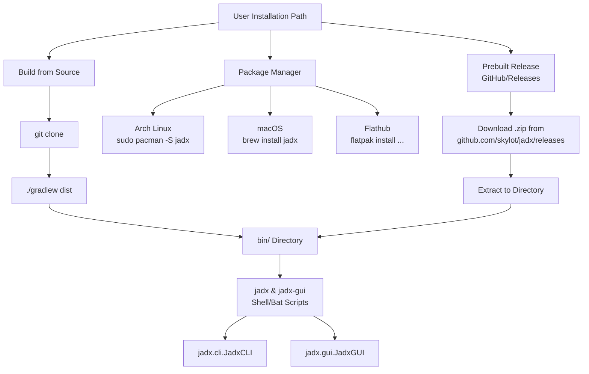
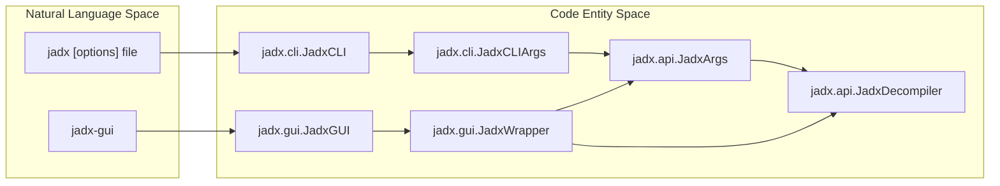

# Getting Started

<details>
<summary>Relevant source files</summary>

The following files were used as context for generating this wiki page:

- [.github/pull_request_template.md](https://github.com/skylot/jadx/blob/HEAD/.github/pull_request_template.md)
- [CODE_OF_CONDUCT.md](https://github.com/skylot/jadx/blob/HEAD/CODE_OF_CONDUCT.md)
- [CONTRIBUTING.md](https://github.com/skylot/jadx/blob/HEAD/CONTRIBUTING.md)
- [README.md](https://github.com/skylot/jadx/blob/HEAD/README.md)
- [SECURITY.md](https://github.com/skylot/jadx/blob/HEAD/SECURITY.md)
- [build.gradle.kts](https://github.com/skylot/jadx/blob/HEAD/build.gradle.kts)
- [buildSrc/build.gradle.kts](https://github.com/skylot/jadx/blob/HEAD/buildSrc/build.gradle.kts)
- [buildSrc/src/main/kotlin/jadx-java.gradle.kts](https://github.com/skylot/jadx/blob/HEAD/buildSrc/src/main/kotlin/jadx-java.gradle.kts)
- [buildSrc/src/main/kotlin/jadx-library.gradle.kts](https://github.com/skylot/jadx/blob/HEAD/buildSrc/src/main/kotlin/jadx-library.gradle.kts)
- [buildSrc/src/main/kotlin/jadx-rewrite.gradle.kts](https://github.com/skylot/jadx/blob/HEAD/buildSrc/src/main/kotlin/jadx-rewrite.gradle.kts)
- [jadx-cli/build.gradle.kts](https://github.com/skylot/jadx/blob/HEAD/jadx-cli/build.gradle.kts)
- [jadx-cli/src/main/java/jadx/cli/JCommanderWrapper.java](https://github.com/skylot/jadx/blob/HEAD/jadx-cli/src/main/java/jadx/cli/JCommanderWrapper.java)
- [jadx-cli/src/main/java/jadx/cli/JadxCLI.java](https://github.com/skylot/jadx/blob/HEAD/jadx-cli/src/main/java/jadx/cli/JadxCLI.java)
- [jadx-cli/src/main/java/jadx/cli/JadxCLIArgs.java](https://github.com/skylot/jadx/blob/HEAD/jadx-cli/src/main/java/jadx/cli/JadxCLIArgs.java)
- [jadx-cli/src/main/java/jadx/cli/LogHelper.java](https://github.com/skylot/jadx/blob/HEAD/jadx-cli/src/main/java/jadx/cli/LogHelper.java)
- [jadx-cli/src/test/java/jadx/cli/JadxCLIArgsTest.java](https://github.com/skylot/jadx/blob/HEAD/jadx-cli/src/test/java/jadx/cli/JadxCLIArgsTest.java)
- [jadx-core/build.gradle.kts](https://github.com/skylot/jadx/blob/HEAD/jadx-core/build.gradle.kts)
- [jadx-core/src/main/java/jadx/api/JadxArgs.java](https://github.com/skylot/jadx/blob/HEAD/jadx-core/src/main/java/jadx/api/JadxArgs.java)
- [jadx-core/src/main/java/jadx/core/utils/files/FileUtils.java](https://github.com/skylot/jadx/blob/HEAD/jadx-core/src/main/java/jadx/core/utils/files/FileUtils.java)
- [jadx-core/src/main/java/jadx/core/xmlgen/BinaryXMLParser.java](https://github.com/skylot/jadx/blob/HEAD/jadx-core/src/main/java/jadx/core/xmlgen/BinaryXMLParser.java)
- [jadx-gui/build.gradle.kts](https://github.com/skylot/jadx/blob/HEAD/jadx-gui/build.gradle.kts)
- [jadx-gui/src/main/java/jadx/gui/JadxGUI.java](https://github.com/skylot/jadx/blob/HEAD/jadx-gui/src/main/java/jadx/gui/JadxGUI.java)
- [jadx-gui/src/main/java/jadx/gui/JadxWrapper.java](https://github.com/skylot/jadx/blob/HEAD/jadx-gui/src/main/java/jadx/gui/JadxWrapper.java)
- [jadx-plugins/jadx-aab-input/build.gradle.kts](https://github.com/skylot/jadx/blob/HEAD/jadx-plugins/jadx-aab-input/build.gradle.kts)
- [jadx-plugins/jadx-dex-input/build.gradle.kts](https://github.com/skylot/jadx/blob/HEAD/jadx-plugins/jadx-dex-input/build.gradle.kts)
- [jadx-plugins/jadx-java-convert/build.gradle.kts](https://github.com/skylot/jadx/blob/HEAD/jadx-plugins/jadx-java-convert/build.gradle.kts)
- [jadx-plugins/jadx-kotlin-metadata/build.gradle.kts](https://github.com/skylot/jadx/blob/HEAD/jadx-plugins/jadx-kotlin-metadata/build.gradle.kts)
- [jadx-plugins/jadx-kotlin-source-debug-extension/build.gradle.kts](https://github.com/skylot/jadx/blob/HEAD/jadx-plugins/jadx-kotlin-source-debug-extension/build.gradle.kts)
- [jadx-plugins/jadx-smali-input/build.gradle.kts](https://github.com/skylot/jadx/blob/HEAD/jadx-plugins/jadx-smali-input/build.gradle.kts)

</details>


This page guides you through installing and running JADX for the first time. It covers installation options, system requirements, basic command-line usage, and initial configuration. For deeper architectural concepts, see [Architecture Overview](03_1.2-architecture-overview.md). For detailed GUI features, see [GUI Application](13_3-gui-application.md). For build system internals, see [Build System and Distribution](24_5-build-system-and-distribution.md).

## System Requirements

JADX requires **Java 11 or later (64-bit)** to run. Both the CLI and GUI applications are distributed as platform-independent JAR files that run on any operating system with a compatible Java Runtime Environment (JRE).

**Recommended:** JDK 17 or higher is required if you intend to build JADX from source.

Sources: [README.md:50-51](https://github.com/skylot/jadx/blob/HEAD/README.md#L50-L51), [README.md:75-75](https://github.com/skylot/jadx/blob/HEAD/README.md#L75), [buildSrc/src/main/kotlin/jadx-java.gradle.kts:44-52](https://github.com/skylot/jadx/blob/HEAD/buildSrc/src/main/kotlin/jadx-java.gradle.kts#L44-L52)

## Installation Options

The following diagram illustrates the different paths to setting up JADX on your system.

Title: JADX Installation Paths

Sources: [README.md:40-85](https://github.com/skylot/jadx/blob/HEAD/README.md#L40-L85), [jadx-cli/build.gradle.kts:33-35](https://github.com/skylot/jadx/blob/HEAD/jadx-cli/build.gradle.kts#L33-L35), [jadx-gui/build.gradle.kts:75-77](https://github.com/skylot/jadx/blob/HEAD/jadx-gui/build.gradle.kts#L75-L77)

### Prebuilt Releases

Download the latest release from the [GitHub releases page](https://github.com/skylot/jadx/releases/latest). 

After downloading, unpack the zip file and navigate to the `bin` directory:
- **Unix/Linux/macOS:** Run `jadx` (CLI) or `jadx-gui` (UI).
- **Windows:** Run `jadx.bat` or `jadx-gui.bat` by double-clicking or via command prompt.

Sources: [README.md:40-51](https://github.com/skylot/jadx/blob/HEAD/README.md#L40-L51)

### Package Managers

JADX is available through several official and community package repositories:

- **Arch Linux:** `sudo pacman -S jadx`
- **macOS (Homebrew):** `brew install jadx`
- **Flathub:** `flatpak install flathub com.github.skylot.jadx`

Sources: [README.md:54-69](https://github.com/skylot/jadx/blob/HEAD/README.md#L54-L69)

### Building from Source

To build the latest version from the master branch, ensure JDK 17+ is installed:

```bash
git clone https://github.com/skylot/jadx.git
cd jadx
./gradlew dist
```
*(On Windows, use `gradlew.bat`)*

The compiled executable scripts will be located in `build/jadx/bin`. A distribution zip is also created at `build/jadx-<version>.zip`.

Sources: [README.md:74-85](https://github.com/skylot/jadx/blob/HEAD/README.md#L74-L85)

## Running JADX

JADX provides two primary interfaces that share the same core decompilation engine (`JadxDecompiler`).

Title: Entry Point to Code Entity Mapping

Sources: [jadx-cli/build.gradle.kts:33-35](https://github.com/skylot/jadx/blob/HEAD/jadx-cli/build.gradle.kts#L33-L35), [jadx-gui/build.gradle.kts:75-77](https://github.com/skylot/jadx/blob/HEAD/jadx-gui/build.gradle.kts#L75-L77), [jadx-cli/src/main/java/jadx/cli/JadxCLIArgs.java:47-47](https://github.com/skylot/jadx/blob/HEAD/jadx-cli/src/main/java/jadx/cli/JadxCLIArgs.java#L47), [jadx-core/src/main/java/jadx/api/JadxArgs.java:47-47](https://github.com/skylot/jadx/blob/HEAD/jadx-core/src/main/java/jadx/api/JadxArgs.java#L47), [jadx-gui/src/main/java/jadx/gui/JadxWrapper.java:53-59](https://github.com/skylot/jadx/blob/HEAD/jadx-gui/src/main/java/jadx/gui/JadxWrapper.java#L53-L59)

### Command Line Interface (CLI)

The CLI tool (`jadx`) is designed for batch processing and integration into scripts. It uses `JCommander` for argument parsing.

**Basic Syntax:**
```bash
jadx [command] [options] <input files>
```

**Supported Input Formats:** `.apk`, `.dex`, `.jar`, `.class`, `.smali`, `.zip`, `.aar`, `.arsc`, `.aab`, `.xapk`, `.apkm`, `.jadx.kts`.

Sources: [README.md:88-89](https://github.com/skylot/jadx/blob/HEAD/README.md#L88-L89), [jadx-cli/src/main/java/jadx/cli/JadxCLIArgs.java:51-52](https://github.com/skylot/jadx/blob/HEAD/jadx-cli/src/main/java/jadx/cli/JadxCLIArgs.java#L51-L52)

### GUI Application

The GUI tool (`jadx-gui`) provides an interactive environment for exploring code, searching, and debugging. It is built using Swing and the FlatLaf look-and-feel.

**Features include:**
- Syntax highlighting and navigation (jump to declaration).
- Full-text search and usage finding.
- Smali debugger integration.
- Resource decoding (e.g., `AndroidManifest.xml` via `BinaryXMLParser`).

Sources: [README.md:27-32](https://github.com/skylot/jadx/blob/HEAD/README.md#L27-L32), [jadx-gui/build.gradle.kts:25-36](https://github.com/skylot/jadx/blob/HEAD/jadx-gui/build.gradle.kts#L25-L36), [jadx-core/src/main/java/jadx/core/xmlgen/BinaryXMLParser.java:26-26](https://github.com/skylot/jadx/blob/HEAD/jadx-core/src/main/java/jadx/core/xmlgen/BinaryXMLParser.java#L26)

## Basic Usage Examples

### Decompile an APK
To decompile an APK to a specific directory:
```bash
jadx -d out_dir app.apk
```
This will produce Java source code in `out_dir/sources` and decoded resources in `out_dir/resources`.

Sources: [README.md:94-96](https://github.com/skylot/jadx/blob/HEAD/README.md#L94-L96), [jadx-core/src/main/java/jadx/api/JadxArgs.java:55-57](https://github.com/skylot/jadx/blob/HEAD/jadx-core/src/main/java/jadx/api/JadxArgs.java#L55-L57)

### Decompile a Single Class
To decompile only one specific class (using its full name):
```bash
jadx --single-class com.package.MyClass app.apk
```

Sources: [README.md:100](https://github.com/skylot/jadx/blob/HEAD/README.md#L100), [jadx-cli/src/main/java/jadx/cli/JadxCLIArgs.java:76-77](https://github.com/skylot/jadx/blob/HEAD/jadx-cli/src/main/java/jadx/cli/JadxCLIArgs.java#L76-L77)

### Control Parallelism
Specify the number of threads for processing (default is half of available cores):
```bash
jadx -j 4 app.apk
```

Sources: [README.md:99](https://github.com/skylot/jadx/blob/HEAD/README.md#L99), [jadx-core/src/main/java/jadx/api/JadxArgs.java:50-50](https://github.com/skylot/jadx/blob/HEAD/jadx-core/src/main/java/jadx/api/JadxArgs.java#L50)

## Common Command-Line Options

JADX offers extensive configuration via `JadxCLIArgs`, which are subsequently mapped to `JadxArgs` for the core engine.

| Option | Description | Class Reference |
|--------|-------------|-----------------|
| `-d`, `--output-dir` | Set main output directory | [jadx-cli/src/main/java/jadx/cli/JadxCLIArgs.java:55-56](https://github.com/skylot/jadx/blob/HEAD/jadx-cli/src/main/java/jadx/cli/JadxCLIArgs.java#L55-L56) |
| `-r`, `--no-res` | Do not decode resources | [jadx-cli/src/main/java/jadx/cli/JadxCLIArgs.java:66-67](https://github.com/skylot/jadx/blob/HEAD/jadx-cli/src/main/java/jadx/cli/JadxCLIArgs.java#L66-L67) |
| `-s`, `--no-src` | Do not decompile source code | [jadx-cli/src/main/java/jadx/cli/JadxCLIArgs.java:69-70](https://github.com/skylot/jadx/blob/HEAD/jadx-cli/src/main/java/jadx/cli/JadxCLIArgs.java#L69-L70) |
| `-m`, `--decompilation-mode` | Set mode: `auto`, `restructure`, `simple`, `fallback` | [jadx-cli/src/main/java/jadx/cli/JadxCLIArgs.java:101-109](https://github.com/skylot/jadx/blob/HEAD/jadx-cli/src/main/java/jadx/cli/JadxCLIArgs.java#L101-L109) |
| `--show-bad-code` | Show incorrectly decompiled code | [jadx-cli/src/main/java/jadx/cli/JadxCLIArgs.java:111-112](https://github.com/skylot/jadx/blob/HEAD/jadx-cli/src/main/java/jadx/cli/JadxCLIArgs.java#L111-L112) |
| `--deobf` | Activate deobfuscation | [jadx-cli/src/main/java/jadx/cli/JadxCLIArgs.java:169-170](https://github.com/skylot/jadx/blob/HEAD/jadx-cli/src/main/java/jadx/cli/JadxCLIArgs.java#L169-L170) |
| `--mappings-path` | Path to deobfuscation mapping file | [jadx-cli/src/main/java/jadx/cli/JadxCLIArgs.java:153-157](https://github.com/skylot/jadx/blob/HEAD/jadx-cli/src/main/java/jadx/cli/JadxCLIArgs.java#L153-L157) |

### Decompilation Modes
The mode affects how `JadxDecompiler` transforms bytecode:
- **restructure**: Standard Java code reconstruction (default).
- **simple**: Linear instructions with `goto`s, simplified.
- **fallback**: Raw instructions, no modifications; useful when standard decompilation fails.

Sources: [jadx-cli/src/main/java/jadx/cli/JadxCLIArgs.java:101-110](https://github.com/skylot/jadx/blob/HEAD/jadx-cli/src/main/java/jadx/cli/JadxCLIArgs.java#L101-L110), [jadx-core/src/main/java/jadx/api/JadxArgs.java:157-157](https://github.com/skylot/jadx/blob/HEAD/jadx-core/src/main/java/jadx/api/JadxArgs.java#L157)

## Advanced Configuration

### Argument Processing
The `JadxCLI` entry point uses `JadxCLIArgs.processArgs` to handle inputs and converts them to `JadxArgs` via `buildArgs`. It also applies environment variables via `JadxAppCommon.applyEnvVars`.

Sources: [jadx-cli/src/main/java/jadx/cli/JadxCLI.java:43-49](https://github.com/skylot/jadx/blob/HEAD/jadx-cli/src/main/java/jadx/cli/JadxCLI.java#L43-L49), [jadx-cli/src/main/java/jadx/cli/JadxCLI.java:63-72](https://github.com/skylot/jadx/blob/HEAD/jadx-cli/src/main/java/jadx/cli/JadxCLI.java#L63-L72)

### Caching and Memory
The GUI application manages several cache types to improve performance during interactive sessions, including `InMemoryCodeCache`, `DiskCodeCache`, and `BufferCodeCache`.

Sources: [jadx-gui/src/main/java/jadx/gui/JadxWrapper.java:125-155](https://github.com/skylot/jadx/blob/HEAD/jadx-gui/src/main/java/jadx/gui/JadxWrapper.java#L125-L155), [jadx-core/src/main/java/jadx/api/JadxArgs.java:65-65](https://github.com/skylot/jadx/blob/HEAD/jadx-core/src/main/java/jadx/api/JadxArgs.java#L65)

### Plugins Subcommand
The `plugins` command allows managing external plugins. The CLI also includes support for generating call graphs in JSON or DOT formats via the `JadxCallGraph` analysis module.

Sources: [README.md:90-91](https://github.com/skylot/jadx/blob/HEAD/README.md#L90-L91), [jadx-cli/src/main/java/jadx/cli/JadxCLI.java:140-163](https://github.com/skylot/jadx/blob/HEAD/jadx-cli/src/main/java/jadx/cli/JadxCLI.java#L140-L163)