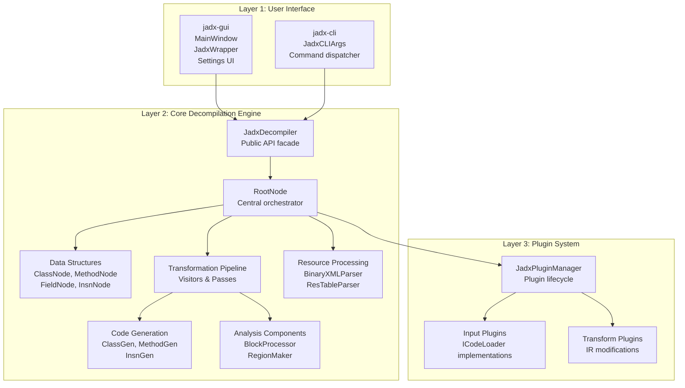
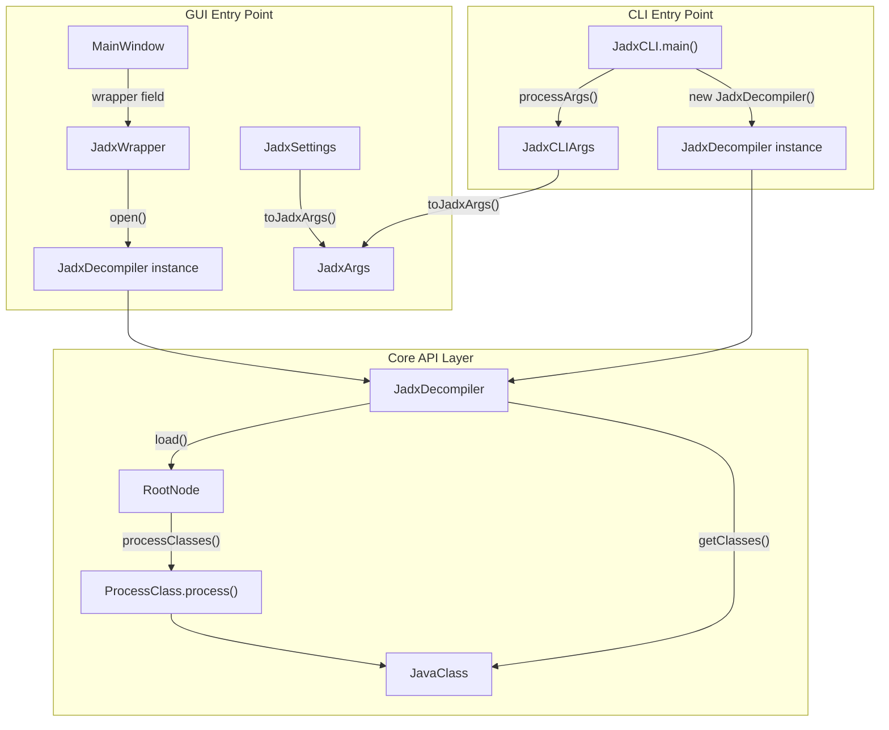
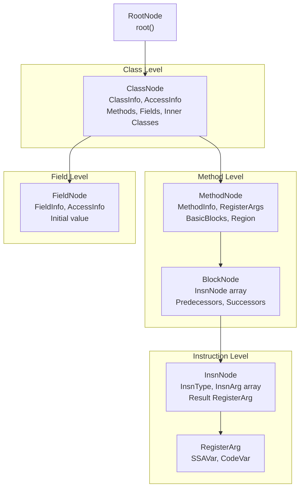
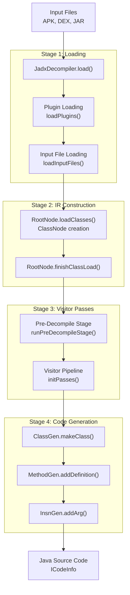
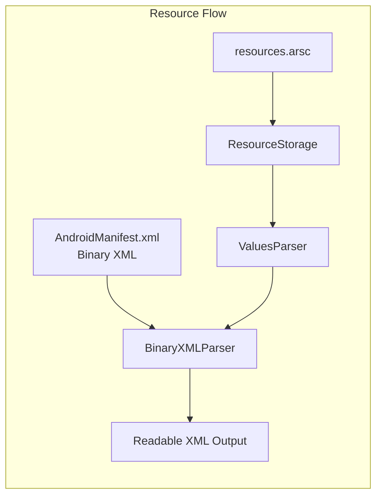

# Architecture Overview

Relevant source files

The following files were used as context for generating this wiki page:

- [README.md](https://github.com/skylot/jadx/blob/HEAD/README.md)
- [jadx-cli/src/main/java/jadx/cli/JCommanderWrapper.java](https://github.com/skylot/jadx/blob/HEAD/jadx-cli/src/main/java/jadx/cli/JCommanderWrapper.java)
- [jadx-cli/src/main/java/jadx/cli/JadxCLI.java](https://github.com/skylot/jadx/blob/HEAD/jadx-cli/src/main/java/jadx/cli/JadxCLI.java)
- [jadx-cli/src/main/java/jadx/cli/JadxCLIArgs.java](https://github.com/skylot/jadx/blob/HEAD/jadx-cli/src/main/java/jadx/cli/JadxCLIArgs.java)
- [jadx-cli/src/main/java/jadx/cli/LogHelper.java](https://github.com/skylot/jadx/blob/HEAD/jadx-cli/src/main/java/jadx/cli/LogHelper.java)
- [jadx-cli/src/test/java/jadx/cli/JadxCLIArgsTest.java](https://github.com/skylot/jadx/blob/HEAD/jadx-cli/src/test/java/jadx/cli/JadxCLIArgsTest.java)
- [jadx-core/src/main/java/jadx/api/JadxArgs.java](https://github.com/skylot/jadx/blob/HEAD/jadx-core/src/main/java/jadx/api/JadxArgs.java)
- [jadx-core/src/main/java/jadx/api/JadxDecompiler.java](https://github.com/skylot/jadx/blob/HEAD/jadx-core/src/main/java/jadx/api/JadxDecompiler.java)
- [jadx-core/src/main/java/jadx/api/JavaClass.java](https://github.com/skylot/jadx/blob/HEAD/jadx-core/src/main/java/jadx/api/JavaClass.java)
- [jadx-core/src/main/java/jadx/api/JavaField.java](https://github.com/skylot/jadx/blob/HEAD/jadx-core/src/main/java/jadx/api/JavaField.java)
- [jadx-core/src/main/java/jadx/api/JavaMethod.java](https://github.com/skylot/jadx/blob/HEAD/jadx-core/src/main/java/jadx/api/JavaMethod.java)
- [jadx-core/src/main/java/jadx/core/Jadx.java](https://github.com/skylot/jadx/blob/HEAD/jadx-core/src/main/java/jadx/core/Jadx.java)
- [jadx-core/src/main/java/jadx/core/ProcessClass.java](https://github.com/skylot/jadx/blob/HEAD/jadx-core/src/main/java/jadx/core/ProcessClass.java)
- [jadx-core/src/main/java/jadx/core/codegen/ClassGen.java](https://github.com/skylot/jadx/blob/HEAD/jadx-core/src/main/java/jadx/core/codegen/ClassGen.java)
- [jadx-core/src/main/java/jadx/core/codegen/InsnGen.java](https://github.com/skylot/jadx/blob/HEAD/jadx-core/src/main/java/jadx/core/codegen/InsnGen.java)
- [jadx-core/src/main/java/jadx/core/codegen/MethodGen.java](https://github.com/skylot/jadx/blob/HEAD/jadx-core/src/main/java/jadx/core/codegen/MethodGen.java)
- [jadx-core/src/main/java/jadx/core/codegen/NameGen.java](https://github.com/skylot/jadx/blob/HEAD/jadx-core/src/main/java/jadx/core/codegen/NameGen.java)
- [jadx-core/src/main/java/jadx/core/codegen/RegionGen.java](https://github.com/skylot/jadx/blob/HEAD/jadx-core/src/main/java/jadx/core/codegen/RegionGen.java)
- [jadx-core/src/main/java/jadx/core/dex/info/ClassInfo.java](https://github.com/skylot/jadx/blob/HEAD/jadx-core/src/main/java/jadx/core/dex/info/ClassInfo.java)
- [jadx-core/src/main/java/jadx/core/dex/nodes/ClassNode.java](https://github.com/skylot/jadx/blob/HEAD/jadx-core/src/main/java/jadx/core/dex/nodes/ClassNode.java)
- [jadx-core/src/main/java/jadx/core/dex/nodes/MethodNode.java](https://github.com/skylot/jadx/blob/HEAD/jadx-core/src/main/java/jadx/core/dex/nodes/MethodNode.java)
- [jadx-core/src/main/java/jadx/core/dex/nodes/RootNode.java](https://github.com/skylot/jadx/blob/HEAD/jadx-core/src/main/java/jadx/core/dex/nodes/RootNode.java)
- [jadx-core/src/main/java/jadx/core/dex/visitors/ClassModifier.java](https://github.com/skylot/jadx/blob/HEAD/jadx-core/src/main/java/jadx/core/dex/visitors/ClassModifier.java)
- [jadx-core/src/main/java/jadx/core/dex/visitors/ModVisitor.java](https://github.com/skylot/jadx/blob/HEAD/jadx-core/src/main/java/jadx/core/dex/visitors/ModVisitor.java)
- [jadx-core/src/main/java/jadx/core/utils/android/AndroidResourcesUtils.java](https://github.com/skylot/jadx/blob/HEAD/jadx-core/src/main/java/jadx/core/utils/android/AndroidResourcesUtils.java)
- [jadx-core/src/main/java/jadx/core/utils/files/FileUtils.java](https://github.com/skylot/jadx/blob/HEAD/jadx-core/src/main/java/jadx/core/utils/files/FileUtils.java)
- [jadx-core/src/main/java/jadx/core/xmlgen/BinaryXMLParser.java](https://github.com/skylot/jadx/blob/HEAD/jadx-core/src/main/java/jadx/core/xmlgen/BinaryXMLParser.java)
- [jadx-core/src/test/java/jadx/tests/api/IntegrationTest.java](https://github.com/skylot/jadx/blob/HEAD/jadx-core/src/test/java/jadx/tests/api/IntegrationTest.java)
- [jadx-gui/src/main/java/jadx/gui/JadxGUI.java](https://github.com/skylot/jadx/blob/HEAD/jadx-gui/src/main/java/jadx/gui/JadxGUI.java)
- [jadx-gui/src/main/java/jadx/gui/JadxWrapper.java](https://github.com/skylot/jadx/blob/HEAD/jadx-gui/src/main/java/jadx/gui/JadxWrapper.java)

## Purpose and Scope

This document describes the high-level architecture of the JADX decompiler system, explaining how the major components—GUI, CLI, core decompilation engine, and plugin system—interact to transform Android DEX bytecode and other input formats into readable Java source code. It covers the system's layered design, key data structures, and data flow from input to output.

For detailed information on specific subsystems:
- For core decompilation pipeline details, see [Decompilation Pipeline](06_2.2-decompilation-pipeline.md)
- For GUI implementation specifics, see [GUI Application](13_3-gui-application.md)
- For plugin architecture details, see [Plugin System](29_6-plugin-system.md)
- For build and distribution, see [Build System and Distribution](24_5-build-system-and-distribution.md)

---

## System Layers

JADX is organized into three primary architectural layers that separate concerns and enable extensibility:

**Sources:** [jadx-core/src/main/java/jadx/api/JadxDecompiler.java:86-118](https://github.com/skylot/jadx/blob/HEAD/jadx-core/src/main/java/jadx/api/JadxDecompiler.java#L86-L118), [jadx-core/src/main/java/jadx/core/dex/nodes/RootNode.java:69-129](https://github.com/skylot/jadx/blob/HEAD/jadx-core/src/main/java/jadx/core/dex/nodes/RootNode.java#L69-L129), [jadx-cli/src/main/java/jadx/cli/JadxCLIArgs.java:47-52](https://github.com/skylot/jadx/blob/HEAD/jadx-cli/src/main/java/jadx/cli/JadxCLIArgs.java#L47-L52)

---

## Core API Entry Points

The system provides two primary entry points for decompilation:

**API Entry Point Flow**

**Key Classes and Methods:**

| Class | Key Methods | Purpose | Location |
|-------|-------------|---------|----------|
| `JadxDecompiler` | `load()`, `save()`, `getClasses()`, `getResources()` | Main public API, orchestrates decompilation lifecycle | [jadx-core/src/main/java/jadx/api/JadxDecompiler.java:86-139](https://github.com/skylot/jadx/blob/HEAD/jadx-core/src/main/java/jadx/api/JadxDecompiler.java#L86-L139) |
| `JadxArgs` | `getInputFiles()`, `getOutDir()` | Configuration object for decompilation settings | [jadx-core/src/main/java/jadx/api/JadxDecompiler.java:89-89](https://github.com/skylot/jadx/blob/HEAD/jadx-core/src/main/java/jadx/api/JadxDecompiler.java#L89) |
| `JadxWrapper` | `open()`, `getClasses()` | GUI-specific wrapper with caching and resource exclusion | [jadx-gui/src/main/java/jadx/gui/JadxWrapper.java:1-100](https://github.com/skylot/jadx/blob/HEAD/jadx-gui/src/main/java/jadx/gui/JadxWrapper.java#L1-L100) |
| `RootNode` | `loadClasses()`, `initClassPath()`, `initPasses()` | Central registry and orchestrator for all classes | [jadx-core/src/main/java/jadx/core/dex/nodes/RootNode.java:131-151](https://github.com/skylot/jadx/blob/HEAD/jadx-core/src/main/java/jadx/core/dex/nodes/RootNode.java#L131-L151) |

**Sources:** [jadx-core/src/main/java/jadx/api/JadxDecompiler.java:86-139](https://github.com/skylot/jadx/blob/HEAD/jadx-core/src/main/java/jadx/api/JadxDecompiler.java#L86-L139), [jadx-cli/src/main/java/jadx/cli/JadxCLIArgs.java:47-167](https://github.com/skylot/jadx/blob/HEAD/jadx-cli/src/main/java/jadx/cli/JadxCLIArgs.java#L47-L167), [jadx-gui/src/main/java/jadx/gui/JadxWrapper.java:1-100](https://github.com/skylot/jadx/blob/HEAD/jadx-gui/src/main/java/jadx/gui/JadxWrapper.java#L1-L100)

---

## Core Data Structures

The decompilation engine centers around a hierarchical node structure representing the program:

**Core Node Hierarchy:**

- **`RootNode`**: Central orchestrator that manages global state, class loading, and pass initialization. [jadx-core/src/main/java/jadx/core/dex/nodes/RootNode.java:69-129](https://github.com/skylot/jadx/blob/HEAD/jadx-core/src/main/java/jadx/core/dex/nodes/RootNode.java#L69-L129)
- **`ClassNode`**: Represents a single class, containing its metadata, methods, and fields. It handles its own loading lifecycle via `load()`. [jadx-core/src/main/java/jadx/core/dex/nodes/ClassNode.java:59-116](https://github.com/skylot/jadx/blob/HEAD/jadx-core/src/main/java/jadx/core/dex/nodes/ClassNode.java#L59-L116)
- **`MethodNode`**: Represents a method within a class, holding the control flow graph (CFG) and instruction list. It manages its own `loaded` state and instruction decoding via `InsnDecoder`. [jadx-core/src/main/java/jadx/core/dex/nodes/MethodNode.java:51-188](https://github.com/skylot/jadx/blob/HEAD/jadx-core/src/main/java/jadx/core/dex/nodes/MethodNode.java#L51-L188)
- **`FieldNode`**: Represents a field within a class, including its type and initial value attributes. [jadx-core/src/main/java/jadx/core/dex/nodes/ClassNode.java:75-75](https://github.com/skylot/jadx/blob/HEAD/jadx-core/src/main/java/jadx/core/dex/nodes/ClassNode.java#L75)
- **`InsnNode`**: The fundamental unit of the Intermediate Representation (IR), representing a single instruction with its arguments (`InsnArg`) and result. [jadx-core/src/main/java/jadx/core/codegen/InsnGen.java:149-156](https://github.com/skylot/jadx/blob/HEAD/jadx-core/src/main/java/jadx/core/codegen/InsnGen.java#L149-L156)

**Sources:** [jadx-core/src/main/java/jadx/core/dex/nodes/RootNode.java:69-129](https://github.com/skylot/jadx/blob/HEAD/jadx-core/src/main/java/jadx/core/dex/nodes/RootNode.java#L69-L129), [jadx-core/src/main/java/jadx/core/dex/nodes/ClassNode.java:59-146](https://github.com/skylot/jadx/blob/HEAD/jadx-core/src/main/java/jadx/core/dex/nodes/ClassNode.java#L59-L146), [jadx-core/src/main/java/jadx/core/dex/nodes/MethodNode.java:51-188](https://github.com/skylot/jadx/blob/HEAD/jadx-core/src/main/java/jadx/core/dex/nodes/MethodNode.java#L51-L188)

---

## Decompilation Pipeline

The decompilation process follows a multi-stage transformation pipeline orchestrated by `JadxDecompiler`:

**Pipeline Stages:**

1. **Loading**: `JadxDecompiler.load()` validates arguments, initializes plugins, and expands input directories to find DEX/JAR files. [jadx-core/src/main/java/jadx/api/JadxDecompiler.java:119-126](https://github.com/skylot/jadx/blob/HEAD/jadx-core/src/main/java/jadx/api/JadxDecompiler.java#L119-L126)
2. **Input Processing**: Plugins are resolved and their `ICodeLoader` implementations are invoked via `loadInputFiles()` to read bytecode. [jadx-core/src/main/java/jadx/api/JadxDecompiler.java:158-179](https://github.com/skylot/jadx/blob/HEAD/jadx-core/src/main/java/jadx/api/JadxDecompiler.java#L158-L179)
3. **IR Construction**: `RootNode` triggers class loading from inputs and performs final loading steps like inner class detection. [jadx-core/src/main/java/jadx/api/JadxDecompiler.java:127-133](https://github.com/skylot/jadx/blob/HEAD/jadx-core/src/main/java/jadx/api/JadxDecompiler.java#L127-L133)
4. **Visitor Passes**: `Jadx.getPassesList()` provides the sequence of visitors (e.g., `SSATransform`, `TypeInferenceVisitor`, `RegionMakerVisitor`) that transform the IR. [jadx-core/src/main/java/jadx/core/Jadx.java:90-102](https://github.com/skylot/jadx/blob/HEAD/jadx-core/src/main/java/jadx/core/Jadx.java#L90-L102)
5. **Code Generation**: The pipeline culminates in `ClassGen.makeClass()`, which uses `MethodGen` and `InsnGen` to produce the final Java source code. [jadx-core/src/main/java/jadx/core/codegen/ClassGen.java:99-112](https://github.com/skylot/jadx/blob/HEAD/jadx-core/src/main/java/jadx/core/codegen/ClassGen.java#L99-L112)

**Sources:** [jadx-core/src/main/java/jadx/api/JadxDecompiler.java:119-179](https://github.com/skylot/jadx/blob/HEAD/jadx-core/src/main/java/jadx/api/JadxDecompiler.java#L119-L179), [jadx-core/src/main/java/jadx/core/codegen/ClassGen.java:99-112](https://github.com/skylot/jadx/blob/HEAD/jadx-core/src/main/java/jadx/core/codegen/ClassGen.java#L99-L112), [jadx-core/src/main/java/jadx/core/codegen/MethodGen.java:81-164](https://github.com/skylot/jadx/blob/HEAD/jadx-core/src/main/java/jadx/core/codegen/MethodGen.java#L81-L164), [jadx-core/src/main/java/jadx/core/Jadx.java:90-187](https://github.com/skylot/jadx/blob/HEAD/jadx-core/src/main/java/jadx/core/Jadx.java#L90-L187)

---

## Resource Processing

JADX includes a specialized subsystem for handling Android binary resources, primarily through the `BinaryXMLParser`.

**Key Components:**

- **`BinaryXMLParser`**: Decodes binary XML chunks (e.g., `RES_XML_START_ELEMENT_TYPE`) into a human-readable format. It uses `BinaryXMLStrings` for string pool resolution. [jadx-core/src/main/java/jadx/core/xmlgen/BinaryXMLParser.java:26-136](https://github.com/skylot/jadx/blob/HEAD/jadx-core/src/main/java/jadx/core/xmlgen/BinaryXMLParser.java#L26-L136)
- **`ValuesParser`**: Decodes resource IDs and values using the resource names mapped from the global `ConstStorage`. [jadx-core/src/main/java/jadx/core/xmlgen/BinaryXMLParser.java:106-107](https://github.com/skylot/jadx/blob/HEAD/jadx-core/src/main/java/jadx/core/xmlgen/BinaryXMLParser.java#L106-L107)
- **`ManifestAttributes`**: Interprets Android-specific manifest attributes during XML parsing. [jadx-core/src/main/java/jadx/core/xmlgen/BinaryXMLParser.java:54-54](https://github.com/skylot/jadx/blob/HEAD/jadx-core/src/main/java/jadx/core/xmlgen/BinaryXMLParser.java#L54)

**Sources:** [jadx-core/src/main/java/jadx/core/xmlgen/BinaryXMLParser.java:1-136](https://github.com/skylot/jadx/blob/HEAD/jadx-core/src/main/java/jadx/core/xmlgen/BinaryXMLParser.java#L1-L136), [jadx-core/src/main/java/jadx/core/dex/nodes/RootNode.java:105-105](https://github.com/skylot/jadx/blob/HEAD/jadx-core/src/main/java/jadx/core/dex/nodes/RootNode.java#L105)

---

## Plugin System

The plugin system allows JADX to support new input formats and custom transformation passes without modifying the core engine.

**Plugin Lifecycle and Orchestration:**

1. **Discovery**: `JadxPluginManager` loads plugins using a `JadxPluginLoader` provided in `JadxArgs`. [jadx-core/src/main/java/jadx/api/JadxDecompiler.java:215-217](https://github.com/skylot/jadx/blob/HEAD/jadx-core/src/main/java/jadx/api/JadxDecompiler.java#L215-L217)
2. **Initialization**: Plugins are initialized and resolved contexts are stored in the manager. [jadx-core/src/main/java/jadx/api/JadxDecompiler.java:221-221](https://github.com/skylot/jadx/blob/HEAD/jadx-core/src/main/java/jadx/api/JadxDecompiler.java#L221)
3. **Execution**: During `load()`, the decompiler queries resolved plugins for `JadxCodeInput` to load files and registers any custom `JadxPass` provided by plugins. [jadx-core/src/main/java/jadx/api/JadxDecompiler.java:163-174](https://github.com/skylot/jadx/blob/HEAD/jadx-core/src/main/java/jadx/api/JadxDecompiler.java#L163-L174)

**Sources:** [jadx-core/src/main/java/jadx/api/JadxDecompiler.java:163-174](https://github.com/skylot/jadx/blob/HEAD/jadx-core/src/main/java/jadx/api/JadxDecompiler.java#L163-L174), [jadx-core/src/main/java/jadx/api/JadxDecompiler.java:215-227](https://github.com/skylot/jadx/blob/HEAD/jadx-core/src/main/java/jadx/api/JadxDecompiler.java#L215-L227)1a:T