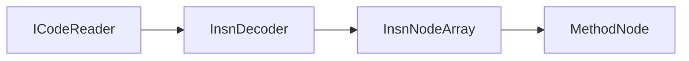
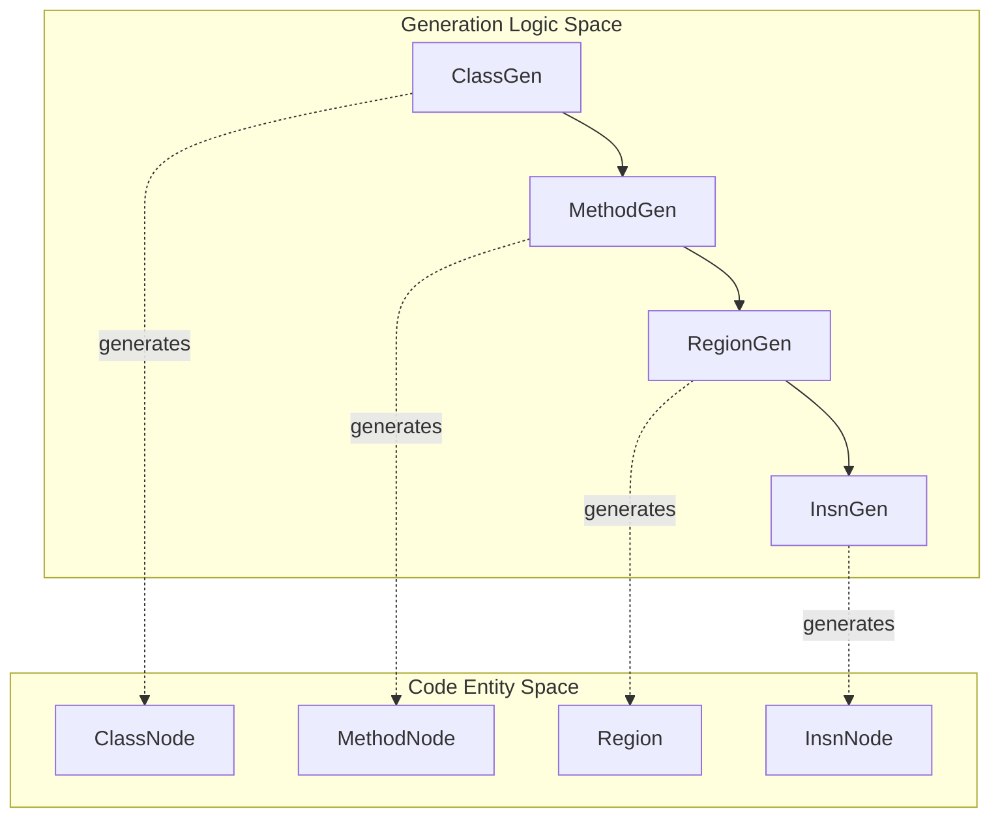

# Core Decompilation Engine

Relevant source files

The following files were used as context for generating this wiki page:

- [jadx-core/src/main/java/jadx/api/JadxDecompiler.java](https://github.com/skylot/jadx/blob/HEAD/jadx-core/src/main/java/jadx/api/JadxDecompiler.java)
- [jadx-core/src/main/java/jadx/api/JavaClass.java](https://github.com/skylot/jadx/blob/HEAD/jadx-core/src/main/java/jadx/api/JavaClass.java)
- [jadx-core/src/main/java/jadx/api/JavaField.java](https://github.com/skylot/jadx/blob/HEAD/jadx-core/src/main/java/jadx/api/JavaField.java)
- [jadx-core/src/main/java/jadx/api/JavaMethod.java](https://github.com/skylot/jadx/blob/HEAD/jadx-core/src/main/java/jadx/api/JavaMethod.java)
- [jadx-core/src/main/java/jadx/core/Jadx.java](https://github.com/skylot/jadx/blob/HEAD/jadx-core/src/main/java/jadx/core/Jadx.java)
- [jadx-core/src/main/java/jadx/core/ProcessClass.java](https://github.com/skylot/jadx/blob/HEAD/jadx-core/src/main/java/jadx/core/ProcessClass.java)
- [jadx-core/src/main/java/jadx/core/codegen/ClassGen.java](https://github.com/skylot/jadx/blob/HEAD/jadx-core/src/main/java/jadx/core/codegen/ClassGen.java)
- [jadx-core/src/main/java/jadx/core/codegen/InsnGen.java](https://github.com/skylot/jadx/blob/HEAD/jadx-core/src/main/java/jadx/core/codegen/InsnGen.java)
- [jadx-core/src/main/java/jadx/core/codegen/MethodGen.java](https://github.com/skylot/jadx/blob/HEAD/jadx-core/src/main/java/jadx/core/codegen/MethodGen.java)
- [jadx-core/src/main/java/jadx/core/codegen/NameGen.java](https://github.com/skylot/jadx/blob/HEAD/jadx-core/src/main/java/jadx/core/codegen/NameGen.java)
- [jadx-core/src/main/java/jadx/core/codegen/RegionGen.java](https://github.com/skylot/jadx/blob/HEAD/jadx-core/src/main/java/jadx/core/codegen/RegionGen.java)
- [jadx-core/src/main/java/jadx/core/dex/info/ClassInfo.java](https://github.com/skylot/jadx/blob/HEAD/jadx-core/src/main/java/jadx/core/dex/info/ClassInfo.java)
- [jadx-core/src/main/java/jadx/core/dex/nodes/ClassNode.java](https://github.com/skylot/jadx/blob/HEAD/jadx-core/src/main/java/jadx/core/dex/nodes/ClassNode.java)
- [jadx-core/src/main/java/jadx/core/dex/nodes/MethodNode.java](https://github.com/skylot/jadx/blob/HEAD/jadx-core/src/main/java/jadx/core/dex/nodes/MethodNode.java)
- [jadx-core/src/main/java/jadx/core/dex/nodes/RootNode.java](https://github.com/skylot/jadx/blob/HEAD/jadx-core/src/main/java/jadx/core/dex/nodes/RootNode.java)
- [jadx-core/src/main/java/jadx/core/dex/visitors/ClassModifier.java](https://github.com/skylot/jadx/blob/HEAD/jadx-core/src/main/java/jadx/core/dex/visitors/ClassModifier.java)
- [jadx-core/src/main/java/jadx/core/dex/visitors/ModVisitor.java](https://github.com/skylot/jadx/blob/HEAD/jadx-core/src/main/java/jadx/core/dex/visitors/ModVisitor.java)
- [jadx-core/src/main/java/jadx/core/utils/android/AndroidResourcesUtils.java](https://github.com/skylot/jadx/blob/HEAD/jadx-core/src/main/java/jadx/core/utils/android/AndroidResourcesUtils.java)
- [jadx-core/src/test/java/jadx/tests/api/IntegrationTest.java](https://github.com/skylot/jadx/blob/HEAD/jadx-core/src/test/java/jadx/tests/api/IntegrationTest.java)

The Core Decompilation Engine is the heart of JADX, responsible for transforming DEX bytecode and other input formats into readable Java source code. It orchestrates a multi-stage pipeline that parses bytecode, constructs an intermediate representation (IR), performs control flow analysis, applies semantic transformations, and generates Java code.

For information about the public API and orchestration layer, see [API and Orchestration](05_2.1-api-and-orchestration.md). For details on specific transformation stages, see [Decompilation Pipeline](06_2.2-decompilation-pipeline.md), [Control Flow Analysis](07_2.3-control-flow-analysis.md), [Region Formation](08_2.4-region-formation.md), [Instruction Simplification](09_2.5-instruction-simplification.md), [Type System and Inference](11_2.7-type-system-and-inference.md), and [Code Generation](10_2.6-code-generation.md).

## Architecture Overview

The core engine follows a multi-stage transformation architecture where bytecode is progressively refined through a series of visitor passes until Java source code is produced.

### Data Flow Diagram
This diagram bridges the natural language concepts of "loading" and "analysis" to the specific `RootNode` and `Visitor` classes used in the codebase.

```mermaid
graph TB
    InputFiles["InputFiles"] --> JadxPluginManager["JadxPluginManager"]
    JadxPluginManager["JadxPluginManager"] --> ICodeLoader["ICodeLoader"]
    ICodeLoader["ICodeLoader"] --> InsnDecoder["InsnDecoder"]
    
    subgraph Core_Data_Structures ["Core Data Structures"]
        RootNode["RootNode"]
        ClassNode["ClassNode"]
        MethodNode["MethodNode"]
        BlockNode["BlockNode"]
        InsnNode["InsnNode"]
    end
    
    subgraph Transformation_Pipeline ["Transformation Pipeline"]
        PreDecompilePasses["PreDecompilePasses"] --> AnalysisPasses["AnalysisPasses"]
        AnalysisPasses["AnalysisPasses"] --> RegionPasses["RegionPasses"]
        RegionPasses["RegionPasses"] --> SimplifyPasses["SimplifyPasses"]
    end
    
    subgraph Code_Generation ["Code Generation"]
        ClassGen["ClassGen"]
        MethodGen["MethodGen"]
        InsnGen["InsnGen"]
        RegionGen["RegionGen"]
    end
    
    InsnDecoder["InsnDecoder"] --> RootNode["RootNode"]
    RootNode["RootNode"] --> ClassNode["ClassNode"]
    ClassNode["ClassNode"] --> MethodNode["MethodNode"]
    MethodNode["MethodNode"] --> BlockNode["BlockNode"]
    BlockNode["BlockNode"] --> InsnNode["InsnNode"]
    
    InsnNode["InsnNode"] --> PreDecompilePasses["PreDecompilePasses"]
    SimplifyPasses["SimplifyPasses"] --> ClassGen["ClassGen"]
    
    ClassGen["ClassGen"] --> MethodGen["MethodGen"]
    MethodGen["MethodGen"] --> RegionGen["RegionGen"]
    RegionGen["RegionGen"] --> InsnGen["InsnGen"]
    
    InsnGen["InsnGen"] --> Output["Java Source Code"]
```

**Sources:** [jadx-core/src/main/java/jadx/core/dex/nodes/RootNode.java:140-151](https://github.com/skylot/jadx/blob/HEAD/jadx-core/src/main/java/jadx/core/dex/nodes/RootNode.java#L140-L151), [jadx-core/src/main/java/jadx/core/Jadx.java:90-102](https://github.com/skylot/jadx/blob/HEAD/jadx-core/src/main/java/jadx/core/Jadx.java#L90-L102), [jadx-api/src/main/java/jadx/api/JadxDecompiler.java:119-139](https://github.com/skylot/jadx/blob/HEAD/jadx-api/src/main/java/jadx/api/JadxDecompiler.java#L119-L139)

### Core Data Structures

The engine uses a hierarchical IR organized around several key node types:

| Class | Purpose | Key Fields |
|-------|---------|------------|
| `RootNode` | Global registry for all classes, manages compilation state | `clsMap`, `packages`, `preDecompilePasses`, `processClasses` |
| `ClassNode` | Represents a class with metadata and methods | `methods`, `fields`, `innerClasses`, `superClass`, `interfaces` |
| `MethodNode` | Represents a method with IR and control flow | `instructions`, `blocks`, `region`, `argsList`, `sVars` |
| `BlockNode` | Basic block in control flow graph | `instructions`, `predecessors`, `successors` |
| `InsnNode` | Single instruction in the IR | `type`, `result`, `arguments` |

**Sources:** [jadx-core/src/main/java/jadx/core/dex/nodes/RootNode.java:72-82](https://github.com/skylot/jadx/blob/HEAD/jadx-core/src/main/java/jadx/core/dex/nodes/RootNode.java#L72-L82), [jadx-core/src/main/java/jadx/core/dex/nodes/ClassNode.java:59-108](https://github.com/skylot/jadx/blob/HEAD/jadx-core/src/main/java/jadx/core/dex/nodes/ClassNode.java#L59-L108), [jadx-core/src/main/java/jadx/core/dex/nodes/MethodNode.java:51-96](https://github.com/skylot/jadx/blob/HEAD/jadx-core/src/main/java/jadx/core/dex/nodes/MethodNode.java#L51-L96)

## Pipeline Stages

### Stage 1: Loading and Decoding

The `InsnDecoder` class parses bytecode from `ICodeReader` and produces an array of `InsnNode` objects representing the instruction stream.

Key operations in `MethodNode.load()`:
- Initializes arguments using `initArguments` [jadx-core/src/main/java/jadx/core/dex/nodes/MethodNode.java:199-210](https://github.com/skylot/jadx/blob/HEAD/jadx-core/src/main/java/jadx/core/dex/nodes/MethodNode.java#L199-L210).
- Invokes `InsnDecoder` to process the `codeReader` [jadx-core/src/main/java/jadx/core/dex/nodes/MethodNode.java:174-176](https://github.com/skylot/jadx/blob/HEAD/jadx-core/src/main/java/jadx/core/dex/nodes/MethodNode.java#L174-L176).
- Decodes opcodes into typed `InsnNode` instances.

**Sources:** [jadx-core/src/main/java/jadx/core/dex/nodes/MethodNode.java:152-188](https://github.com/skylot/jadx/blob/HEAD/jadx-core/src/main/java/jadx/core/dex/nodes/MethodNode.java#L152-L188)

### Stage 2: Pre-Decompile Processing

Before individual method decompilation begins, several preparation passes run across the `RootNode`. These operate on the class structure before methods are processed into SSA form.

| Pass Class | Purpose |
|------------|---------|
| `SignatureProcessor` | Parse generic signatures [jadx-core/src/main/java/jadx/core/Jadx.java:106-106](https://github.com/skylot/jadx/blob/HEAD/jadx-core/src/main/java/jadx/core/Jadx.java#L106) |
| `OverrideMethodVisitor` | Build override hierarchy [jadx-core/src/main/java/jadx/core/Jadx.java:107-107](https://github.com/skylot/jadx/blob/HEAD/jadx-core/src/main/java/jadx/core/Jadx.java#L107) |
| `DeobfuscatorVisitor` | Apply deobfuscation rules [jadx-core/src/main/java/jadx/core/Jadx.java:111-111](https://github.com/skylot/jadx/blob/HEAD/jadx-core/src/main/java/jadx/core/Jadx.java#L111) |
| `UsageInfoVisitor` | Collect usage data for cross-references [jadx-core/src/main/java/jadx/core/Jadx.java:116-116](https://github.com/skylot/jadx/blob/HEAD/jadx-core/src/main/java/jadx/core/Jadx.java#L116) |

**Sources:** [jadx-core/src/main/java/jadx/core/Jadx.java:104-121](https://github.com/skylot/jadx/blob/HEAD/jadx-core/src/main/java/jadx/core/Jadx.java#L104-L121), [jadx-core/src/main/java/jadx/core/dex/nodes/RootNode.java:122-138](https://github.com/skylot/jadx/blob/HEAD/jadx-core/src/main/java/jadx/core/dex/nodes/RootNode.java#L122-L138)

### Stage 3: Control Flow Graph and SSA

The engine transforms the flat instruction array into a control flow graph (CFG) and then into Static Single Assignment (SSA) form.

- **CFG Construction**: `BlockSplitter` scans for jump targets and creates `BlockNode` instances [jadx-core/src/main/java/jadx/core/Jadx.java:138-138](https://github.com/skylot/jadx/blob/HEAD/jadx-core/src/main/java/jadx/core/Jadx.java#L138).
- **SSA Transform**: `SSATransform` converts register-based instructions to use `SSAVar` [jadx-core/src/main/java/jadx/core/Jadx.java:145-145](https://github.com/skylot/jadx/blob/HEAD/jadx-core/src/main/java/jadx/core/Jadx.java#L145).
- **Type Inference**: `TypeInferenceVisitor` resolves the specific types of variables based on usage and constraints [jadx-core/src/main/java/jadx/core/Jadx.java:153-153](https://github.com/skylot/jadx/blob/HEAD/jadx-core/src/main/java/jadx/core/Jadx.java#L153).

**Sources:** [jadx-core/src/main/java/jadx/core/Jadx.java:138-158](https://github.com/skylot/jadx/blob/HEAD/jadx-core/src/main/java/jadx/core/Jadx.java#L138-L158), [jadx-core/src/main/java/jadx/core/dex/nodes/MethodNode.java:77-81](https://github.com/skylot/jadx/blob/HEAD/jadx-core/src/main/java/jadx/core/dex/nodes/MethodNode.java#L77-L81)

### Stage 4: Region Formation

The `RegionMakerVisitor` transforms the CFG into a hierarchical structure of high-level control flow constructs (regions).

- **`IfRegion`**: Represents `if-then-else` structures [jadx-core/src/main/java/jadx/core/codegen/RegionGen.java:103-147](https://github.com/skylot/jadx/blob/HEAD/jadx-core/src/main/java/jadx/core/codegen/RegionGen.java#L103-L147).
- **`LoopRegion`**: Represents `while`, `for`, and `do-while` loops [jadx-core/src/main/java/jadx/core/codegen/RegionGen.java:164-212](https://github.com/skylot/jadx/blob/HEAD/jadx-core/src/main/java/jadx/core/codegen/RegionGen.java#L164-L212).
- **`SwitchRegion`**: Represents `switch-case` structures [jadx-core/src/main/java/jadx/core/dex/regions/SwitchRegion.java:40-41](https://github.com/skylot/jadx/blob/HEAD/jadx-core/src/main/java/jadx/core/dex/regions/SwitchRegion.java#L40-L41).

**Sources:** [jadx-core/src/main/java/jadx/core/Jadx.java:181-187](https://github.com/skylot/jadx/blob/HEAD/jadx-core/src/main/java/jadx/core/Jadx.java#L181-L187), [jadx-core/src/main/java/jadx/core/codegen/RegionGen.java:57-85](https://github.com/skylot/jadx/blob/HEAD/jadx-core/src/main/java/jadx/core/codegen/RegionGen.java#L57-L85)

### Stage 5: Simplification and Modification

The `ModVisitor` and `SimplifyVisitor` passes optimize the IR. `ModVisitor` handles instruction replacement:
- **Anonymous Constructors**: Processes inner class initialization [jadx-core/src/main/java/jadx/core/dex/visitors/ModVisitor.java:110-112](https://github.com/skylot/jadx/blob/HEAD/jadx-core/src/main/java/jadx/core/dex/visitors/ModVisitor.java#L110-L112).
- **Filled Arrays**: Replaces `new-array` + `fill-array` with a single `filled-new-array` [jadx-core/src/main/java/jadx/core/dex/visitors/ModVisitor.java:124-136](https://github.com/skylot/jadx/blob/HEAD/jadx-core/src/main/java/jadx/core/dex/visitors/ModVisitor.java#L124-L136).
- **Field Usage**: Fixes field access visibility by inserting casts where necessary [jadx-core/src/main/java/jadx/core/dex/visitors/ModVisitor.java:175-209](https://github.com/skylot/jadx/blob/HEAD/jadx-core/src/main/java/jadx/core/dex/visitors/ModVisitor.java#L175-L209).

**Sources:** [jadx-core/src/main/java/jadx/core/Jadx.java:152-191](https://github.com/skylot/jadx/blob/HEAD/jadx-core/src/main/java/jadx/core/Jadx.java#L152-L191), [jadx-core/src/main/java/jadx/core/dex/visitors/ModVisitor.java:78-170](https://github.com/skylot/jadx/blob/HEAD/jadx-core/src/main/java/jadx/core/dex/visitors/ModVisitor.java#L78-L170)

### Stage 6: Code Generation

The final stage transforms the region tree into Java source code through a hierarchical generation system.

**Code Generation Components:**
- **`ClassGen`**: Orchestrates the class file, adding the package [jadx-core/src/main/java/jadx/core/codegen/ClassGen.java:114-120](https://github.com/skylot/jadx/blob/HEAD/jadx-core/src/main/java/jadx/core/codegen/ClassGen.java#L114-L120), imports [jadx-core/src/main/java/jadx/core/codegen/ClassGen.java:122-139](https://github.com/skylot/jadx/blob/HEAD/jadx-core/src/main/java/jadx/core/codegen/ClassGen.java#L122-L139), and class declaration [jadx-core/src/main/java/jadx/core/codegen/ClassGen.java:163-220](https://github.com/skylot/jadx/blob/HEAD/jadx-core/src/main/java/jadx/core/codegen/ClassGen.java#L163-L220).
- **`MethodGen`**: Adds method definitions [jadx-core/src/main/java/jadx/core/codegen/MethodGen.java:81-164](https://github.com/skylot/jadx/blob/HEAD/jadx-core/src/main/java/jadx/core/codegen/MethodGen.java#L81-L164) and manages local variable naming via `NameGen`.
- **`InsnGen`**: Handles individual instruction logic, including argument formatting [jadx-core/src/main/java/jadx/core/codegen/InsnGen.java:103-127](https://github.com/skylot/jadx/blob/HEAD/jadx-core/src/main/java/jadx/core/codegen/InsnGen.java#L103-L127) and variable assignment [jadx-core/src/main/java/jadx/core/codegen/InsnGen.java:149-156](https://github.com/skylot/jadx/blob/HEAD/jadx-core/src/main/java/jadx/core/codegen/InsnGen.java#L149-L156).

**Sources:** [jadx-core/src/main/java/jadx/core/codegen/ClassGen.java:99-112](https://github.com/skylot/jadx/blob/HEAD/jadx-core/src/main/java/jadx/core/codegen/ClassGen.java#L99-L112), [jadx-core/src/main/java/jadx/core/codegen/MethodGen.java:57-80](https://github.com/skylot/jadx/blob/HEAD/jadx-core/src/main/java/jadx/core/codegen/MethodGen.java#L57-L80), [jadx-core/src/main/java/jadx/core/codegen/InsnGen.java:70-89](https://github.com/skylot/jadx/blob/HEAD/jadx-core/src/main/java/jadx/core/codegen/InsnGen.java#L70-L89)

## Decompilation Modes

JADX supports three primary modes determined by `JadxArgs` [jadx-core/src/main/java/jadx/core/Jadx.java:90-102](https://github.com/skylot/jadx/blob/HEAD/jadx-core/src/main/java/jadx/core/Jadx.java#L90-L102):

- **RESTRUCTURE**: Full pipeline with region analysis (Default).
- **SIMPLE**: Basic passes without full region formation.
- **FALLBACK**: Minimal processing, outputs raw instructions. Markings like `AFlag.INCONSISTENT_CODE` trigger warnings in the output [jadx-core/src/main/java/jadx/core/codegen/MethodGen.java:114-127](https://github.com/skylot/jadx/blob/HEAD/jadx-core/src/main/java/jadx/core/codegen/MethodGen.java#L114-L127).

**Sources:** [jadx-core/src/main/java/jadx/core/Jadx.java:90-102](https://github.com/skylot/jadx/blob/HEAD/jadx-core/src/main/java/jadx/core/Jadx.java#L90-L102), [jadx-core/src/main/java/jadx/core/dex/nodes/RootNode.java:123-123](https://github.com/skylot/jadx/blob/HEAD/jadx-core/src/main/java/jadx/core/dex/nodes/RootNode.java#L123)