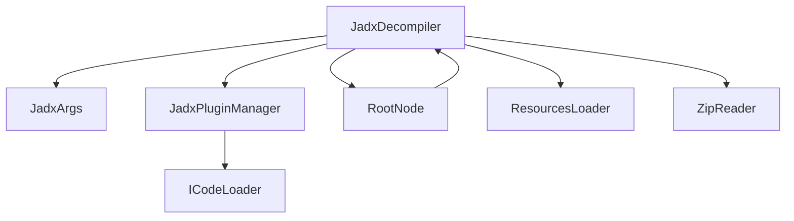
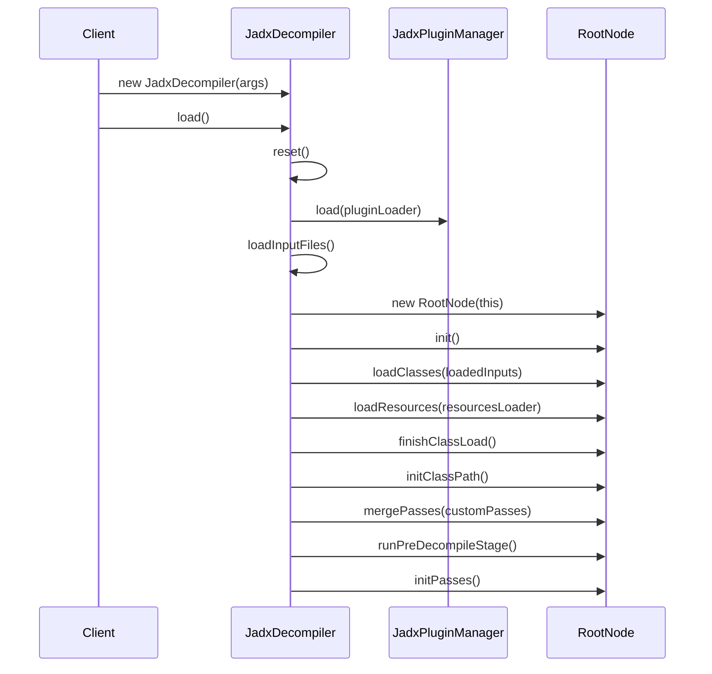
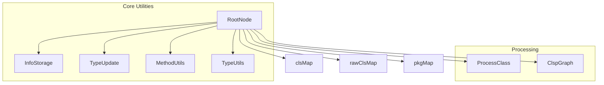
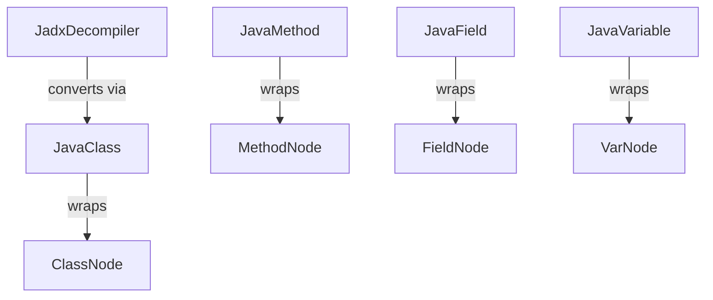

# API and Orchestration

Relevant source files

The following files were used as context for generating this wiki page:

- [jadx-core/src/main/java/jadx/api/JadxDecompiler.java](https://github.com/skylot/jadx/blob/HEAD/jadx-core/src/main/java/jadx/api/JadxDecompiler.java)
- [jadx-core/src/main/java/jadx/api/JavaClass.java](https://github.com/skylot/jadx/blob/HEAD/jadx-core/src/main/java/jadx/api/JavaClass.java)
- [jadx-core/src/main/java/jadx/api/JavaField.java](https://github.com/skylot/jadx/blob/HEAD/jadx-core/src/main/java/jadx/api/JavaField.java)
- [jadx-core/src/main/java/jadx/api/JavaMethod.java](https://github.com/skylot/jadx/blob/HEAD/jadx-core/src/main/java/jadx/api/JavaMethod.java)
- [jadx-core/src/main/java/jadx/api/JavaNode.java](https://github.com/skylot/jadx/blob/HEAD/jadx-core/src/main/java/jadx/api/JavaNode.java)
- [jadx-core/src/main/java/jadx/api/JavaPackage.java](https://github.com/skylot/jadx/blob/HEAD/jadx-core/src/main/java/jadx/api/JavaPackage.java)
- [jadx-core/src/main/java/jadx/api/JavaVariable.java](https://github.com/skylot/jadx/blob/HEAD/jadx-core/src/main/java/jadx/api/JavaVariable.java)
- [jadx-core/src/main/java/jadx/core/ProcessClass.java](https://github.com/skylot/jadx/blob/HEAD/jadx-core/src/main/java/jadx/core/ProcessClass.java)
- [jadx-core/src/main/java/jadx/core/deobf/DeobfAliasProvider.java](https://github.com/skylot/jadx/blob/HEAD/jadx-core/src/main/java/jadx/core/deobf/DeobfAliasProvider.java)
- [jadx-core/src/main/java/jadx/core/dex/attributes/nodes/JadxCommentsAttr.java](https://github.com/skylot/jadx/blob/HEAD/jadx-core/src/main/java/jadx/core/dex/attributes/nodes/JadxCommentsAttr.java)
- [jadx-core/src/main/java/jadx/core/dex/info/ClassInfo.java](https://github.com/skylot/jadx/blob/HEAD/jadx-core/src/main/java/jadx/core/dex/info/ClassInfo.java)
- [jadx-core/src/main/java/jadx/core/dex/nodes/ClassNode.java](https://github.com/skylot/jadx/blob/HEAD/jadx-core/src/main/java/jadx/core/dex/nodes/ClassNode.java)
- [jadx-core/src/main/java/jadx/core/dex/nodes/PackageNode.java](https://github.com/skylot/jadx/blob/HEAD/jadx-core/src/main/java/jadx/core/dex/nodes/PackageNode.java)
- [jadx-core/src/main/java/jadx/core/dex/nodes/RootNode.java](https://github.com/skylot/jadx/blob/HEAD/jadx-core/src/main/java/jadx/core/dex/nodes/RootNode.java)
- [jadx-core/src/main/java/jadx/core/dex/visitors/DepthTraversal.java](https://github.com/skylot/jadx/blob/HEAD/jadx-core/src/main/java/jadx/core/dex/visitors/DepthTraversal.java)
- [jadx-core/src/main/java/jadx/core/utils/DecompilerScheduler.java](https://github.com/skylot/jadx/blob/HEAD/jadx-core/src/main/java/jadx/core/utils/DecompilerScheduler.java)
- [jadx-core/src/main/java/jadx/core/utils/android/AndroidResourcesUtils.java](https://github.com/skylot/jadx/blob/HEAD/jadx-core/src/main/java/jadx/core/utils/android/AndroidResourcesUtils.java)
- [jadx-core/src/test/java/jadx/tests/api/IntegrationTest.java](https://github.com/skylot/jadx/blob/HEAD/jadx-core/src/test/java/jadx/tests/api/IntegrationTest.java)
- [jadx-gui/src/main/java/jadx/gui/treemodel/JVariable.java](https://github.com/skylot/jadx/blob/HEAD/jadx-gui/src/main/java/jadx/gui/treemodel/JVariable.java)
- [jadx-gui/src/main/java/jadx/gui/utils/pkgs/JRenamePackage.java](https://github.com/skylot/jadx/blob/HEAD/jadx-gui/src/main/java/jadx/gui/utils/pkgs/JRenamePackage.java)
- [jadx-gui/src/main/java/jadx/gui/utils/pkgs/PackageHelper.java](https://github.com/skylot/jadx/blob/HEAD/jadx-gui/src/main/java/jadx/gui/utils/pkgs/PackageHelper.java)
- [jadx-gui/src/test/java/jadx/gui/utils/pkgs/TestJRenamePackage.java](https://github.com/skylot/jadx/blob/HEAD/jadx-gui/src/test/java/jadx/gui/utils/pkgs/TestJRenamePackage.java)

This page documents the orchestration layer of JADX's core decompilation engine, focusing on how `JadxDecompiler` coordinates the decompilation process, how `RootNode` serves as the central registry, and how the public API layer (`JavaClass`, `JavaMethod`, `JavaField`) provides a stable interface to decompiled code.

**Scope:** This page covers the top-level orchestration and API components. For details on the decompilation pipeline itself (visitor passes, transformations), see [Decompilation Pipeline](https://github.com/skylot/jadx/blob/HEAD/2.2). For internal node representations and control flow, see [Control Flow Analysis](https://github.com/skylot/jadx/blob/HEAD/2.3) and subsequent sections.

---

## JadxDecompiler: Main Orchestrator

`JadxDecompiler` is the primary entry point and orchestrator for all decompilation operations. It manages the complete lifecycle from loading input files through plugin initialization to generating decompiled output.

**Class Diagram: JadxDecompiler Core Components**

Sources: [jadx-core/src/main/java/jadx/api/JadxDecompiler.java:86-117](https://github.com/skylot/jadx/blob/HEAD/jadx-core/src/main/java/jadx/api/JadxDecompiler.java#L86-L117)

### Initialization Lifecycle

The decompiler follows a strict initialization sequence managed by the `load()` method:

**Key Initialization Steps:**

| Step | Method | Purpose |
|------|--------|---------|
| 1 | `loadPlugins()` | Discover and initialize plugins via `JadxPluginManager` [jadx-core/src/main/java/jadx/api/JadxDecompiler.java:215-227](https://github.com/skylot/jadx/blob/HEAD/jadx-core/src/main/java/jadx/api/JadxDecompiler.java#L215-L227) |
| 2 | `loadInputFiles()` | Use input plugins to load DEX/JAR/CLASS files into `loadedInputs` [jadx-core/src/main/java/jadx/api/JadxDecompiler.java:158-179](https://github.com/skylot/jadx/blob/HEAD/jadx-core/src/main/java/jadx/api/JadxDecompiler.java#L158-L179) |
| 3 | `new RootNode(this)` | Create central registry [jadx-core/src/main/java/jadx/api/JadxDecompiler.java:127-127](https://github.com/skylot/jadx/blob/HEAD/jadx-core/src/main/java/jadx/api/JadxDecompiler.java#L127) |
| 4 | `root.loadClasses()` | Convert input data to `ClassNode` instances via `ICodeLoader.visitClasses` [jadx-core/src/main/java/jadx/core/dex/nodes/RootNode.java:140-151](https://github.com/skylot/jadx/blob/HEAD/jadx-core/src/main/java/jadx/core/dex/nodes/RootNode.java#L140-L151) |
| 5 | `root.loadResources()` | Parse Android resources (ARSC, manifest) [jadx-core/src/main/java/jadx/api/JadxDecompiler.java:131-131](https://github.com/skylot/jadx/blob/HEAD/jadx-core/src/main/java/jadx/api/JadxDecompiler.java#L131) |
| 6 | `root.finishClassLoad()` | Resolve duplicates, sort classes, and initialize inner classes [jadx-core/src/main/java/jadx/core/dex/nodes/RootNode.java:153-174](https://github.com/skylot/jadx/blob/HEAD/jadx-core/src/main/java/jadx/core/dex/nodes/RootNode.java#L153-L174) |
| 7 | `root.initClassPath()` | Build classpath graph (`ClspGraph`) [jadx-core/src/main/java/jadx/api/JadxDecompiler.java:133-133](https://github.com/skylot/jadx/blob/HEAD/jadx-core/src/main/java/jadx/api/JadxDecompiler.java#L133) |
| 8 | `root.mergePasses()` | Integrate custom passes from plugins [jadx-core/src/main/java/jadx/api/JadxDecompiler.java:135-135](https://github.com/skylot/jadx/blob/HEAD/jadx-core/src/main/java/jadx/api/JadxDecompiler.java#L135) |
| 9 | `root.runPreDecompileStage()` | Execute preparation visitor passes [jadx-core/src/main/java/jadx/api/JadxDecompiler.java:136-136](https://github.com/skylot/jadx/blob/HEAD/jadx-core/src/main/java/jadx/api/JadxDecompiler.java#L136) |
| 10 | `root.initPasses()` | Initialize decompilation visitor passes [jadx-core/src/main/java/jadx/api/JadxDecompiler.java:137-137](https://github.com/skylot/jadx/blob/HEAD/jadx-core/src/main/java/jadx/api/JadxDecompiler.java#L137) |

Sources: [jadx-core/src/main/java/jadx/api/JadxDecompiler.java:119-139](https://github.com/skylot/jadx/blob/HEAD/jadx-core/src/main/java/jadx/api/JadxDecompiler.java#L119-L139), [jadx-core/src/main/java/jadx/core/dex/nodes/RootNode.java:140-174](https://github.com/skylot/jadx/blob/HEAD/jadx-core/src/main/java/jadx/core/dex/nodes/RootNode.java#L140-L174)

---

## RootNode: Central Registry

`RootNode` serves as the central registry and coordination point for all decompilation state. It stores all loaded classes, manages packages, and provides utility components for type resolution and instruction analysis.

**RootNode Architecture:**

Sources: [jadx-core/src/main/java/jadx/core/dex/nodes/RootNode.java:69-106](https://github.com/skylot/jadx/blob/HEAD/jadx-core/src/main/java/jadx/core/dex/nodes/RootNode.java#L69-L106)

### Class Storage and Resolution

`RootNode` maintains multiple indices for efficient class lookup:

**Storage Maps:**

| Map | Key Type | Purpose |
|-----|----------|---------|
| `clsMap` | `ClassInfo` | Primary class lookup by type info [jadx-core/src/main/java/jadx/core/dex/nodes/RootNode.java:86-86](https://github.com/skylot/jadx/blob/HEAD/jadx-core/src/main/java/jadx/core/dex/nodes/RootNode.java#L86) |
| `rawClsMap` | `String` (raw name) | Direct lookup by raw bytecode name [jadx-core/src/main/java/jadx/core/dex/nodes/RootNode.java:87-87](https://github.com/skylot/jadx/blob/HEAD/jadx-core/src/main/java/jadx/core/dex/nodes/RootNode.java#L87) |
| `classes` | - | Sorted list of all classes used for iteration [jadx-core/src/main/java/jadx/core/dex/nodes/RootNode.java:88-88](https://github.com/skylot/jadx/blob/HEAD/jadx-core/src/main/java/jadx/core/dex/nodes/RootNode.java#L88) |

### Pass Management and Orchestration

`RootNode` coordinates the visitor pipeline through the `ProcessClass` component:

1. **Pre-decompile Passes:** Execute before main decompilation (e.g., signature processing, deobfuscation setup) [jadx-core/src/main/java/jadx/core/dex/nodes/RootNode.java:93-93](https://github.com/skylot/jadx/blob/HEAD/jadx-core/src/main/java/jadx/core/dex/nodes/RootNode.java#L93).
2. **Decompile Passes:** Main decompilation transformations managed by `ProcessClass` [jadx-core/src/main/java/jadx/core/dex/nodes/RootNode.java:94-94](https://github.com/skylot/jadx/blob/HEAD/jadx-core/src/main/java/jadx/core/dex/nodes/RootNode.java#L94).

**ProcessClass Coordination:**
`ProcessClass` manages the state transitions of `ClassNode` (from `NOT_LOADED` to `PROCESS_COMPLETE`) and executes the visitor list using `DepthTraversal` [jadx-core/src/main/java/jadx/core/ProcessClass.java:77-86](https://github.com/skylot/jadx/blob/HEAD/jadx-core/src/main/java/jadx/core/ProcessClass.java#L77-L86). It also handles code generation via `CodeGen.generate(cls)` [jadx-core/src/main/java/jadx/core/ProcessClass.java:89-89](https://github.com/skylot/jadx/blob/HEAD/jadx-core/src/main/java/jadx/core/ProcessClass.java#L89).

Sources: [jadx-core/src/main/java/jadx/core/dex/nodes/RootNode.java:119-129](https://github.com/skylot/jadx/blob/HEAD/jadx-core/src/main/java/jadx/core/dex/nodes/RootNode.java#L119-L129), [jadx-core/src/main/java/jadx/core/ProcessClass.java:35-44](https://github.com/skylot/jadx/blob/HEAD/jadx-core/src/main/java/jadx/core/ProcessClass.java#L35-L44), [jadx-core/src/main/java/jadx/core/dex/visitors/DepthTraversal.java:9-18](https://github.com/skylot/jadx/blob/HEAD/jadx-core/src/main/java/jadx/core/dex/visitors/DepthTraversal.java#L9-L18)

---

## API Layer: Stable Public Interface

The API layer provides a stable interface for accessing decompiled code through `JavaClass`, `JavaMethod`, and `JavaField`. These classes wrap internal node representations and are managed by `JadxDecompiler`.

**API Layer Architecture:**

Sources: [jadx-core/src/main/java/jadx/api/JavaClass.java:27-51](https://github.com/skylot/jadx/blob/HEAD/jadx-core/src/main/java/jadx/api/JavaClass.java#L27-L51), [jadx-core/src/main/java/jadx/api/JavaMethod.java:19-26](https://github.com/skylot/jadx/blob/HEAD/jadx-core/src/main/java/jadx/api/JavaMethod.java#L19-L26), [jadx-core/src/main/java/jadx/api/JavaField.java:13-21](https://github.com/skylot/jadx/blob/HEAD/jadx-core/src/main/java/jadx/api/JavaField.java#L13-L21)

### JavaClass: Class API Wrapper

`JavaClass` provides the public interface to a decompiled class:

**Key Features:**

| Feature | Method | Description |
|---------|--------|-------------|
| Code Access | `getCode()` | Retrieve decompiled Java source [jadx-core/src/main/java/jadx/api/JavaClass.java:53-55](https://github.com/skylot/jadx/blob/HEAD/jadx-core/src/main/java/jadx/api/JavaClass.java#L53-L55) |
| Lazy Loading | `load()` | Decompile and load class internals (fields, methods) [jadx-core/src/main/java/jadx/api/JavaClass.java:133-146](https://github.com/skylot/jadx/blob/HEAD/jadx-core/src/main/java/jadx/api/JavaClass.java#L133-L146) |
| Reload Support | `reload()` | Force redecompilation [jadx-core/src/main/java/jadx/api/JavaClass.java:84-87](https://github.com/skylot/jadx/blob/HEAD/jadx-core/src/main/java/jadx/api/JavaClass.java#L84-L87) |
| Unload Support | `unload()` | Free memory by unloading code [jadx-core/src/main/java/jadx/api/JavaClass.java:89-92](https://github.com/skylot/jadx/blob/HEAD/jadx-core/src/main/java/jadx/api/JavaClass.java#L89-L92) |
| Inner Classes | `getInnerClasses()` | Access nested classes [jadx-core/src/main/java/jadx/api/JavaClass.java:151-161](https://github.com/skylot/jadx/blob/HEAD/jadx-core/src/main/java/jadx/api/JavaClass.java#L151-L161) |

**Code Access Pattern:**
When `getCode()` is called, it triggers `load()`. If the class is not yet processed, it calls `cls.decompile()` [jadx-core/src/main/java/jadx/api/JavaClass.java:62-62](https://github.com/skylot/jadx/blob/HEAD/jadx-core/src/main/java/jadx/api/JavaClass.java#L62), which eventually enters the `ProcessClass` pipeline to generate the `ICodeInfo` [jadx-core/src/main/java/jadx/core/ProcessClass.java:108-135](https://github.com/skylot/jadx/blob/HEAD/jadx-core/src/main/java/jadx/core/ProcessClass.java#L108-L135).

Sources: [jadx-core/src/main/java/jadx/api/JavaClass.java:53-146](https://github.com/skylot/jadx/blob/HEAD/jadx-core/src/main/java/jadx/api/JavaClass.java#L53-L146), [jadx-core/src/main/java/jadx/core/ProcessClass.java:108-135](https://github.com/skylot/jadx/blob/HEAD/jadx-core/src/main/java/jadx/core/ProcessClass.java#L108-L135)

### Reference Resolution and Metadata

`JavaClass` allows mapping character offsets in the decompiled source code back to `JavaNode` instances via `getUsageMap()` [jadx-core/src/main/java/jadx/api/JavaClass.java:209-226](https://github.com/skylot/jadx/blob/HEAD/jadx-core/src/main/java/jadx/api/JavaClass.java#L209-L226). This metadata is derived from `ICodeMetadata` generated during the code generation stage.

**Decompilation Scheduling:**
To optimize performance and avoid thread locking, JADX uses `DecompilerScheduler` to build batches of classes for parallel decompilation, ensuring dependencies are processed appropriately [jadx-core/src/main/java/jadx/core/utils/DecompilerScheduler.java:26-44](https://github.com/skylot/jadx/blob/HEAD/jadx-core/src/main/java/jadx/core/utils/DecompilerScheduler.java#L26-L44).

Sources: [jadx-core/src/main/java/jadx/api/JavaClass.java:209-226](https://github.com/skylot/jadx/blob/HEAD/jadx-core/src/main/java/jadx/api/JavaClass.java#L209-L226), [jadx-core/src/main/java/jadx/core/utils/DecompilerScheduler.java:19-44](https://github.com/skylot/jadx/blob/HEAD/jadx-core/src/main/java/jadx/core/utils/DecompilerScheduler.java#L19-L44)

---

## Summary

The API and orchestration layer provides:

1.  **JadxDecompiler:** Central orchestrator managing plugins, inputs, and the high-level decompilation lifecycle.
2.  **RootNode:** Central registry and utility hub for all internal engine operations, storing `ClassInfo` and `MethodInfo` metadata.
3.  **ProcessClass:** The executor that moves classes through the visitor pipeline and triggers code generation.
4.  **API Layer:** A stable public interface (`JavaClass`, `JavaMethod`, `JavaField`) that shields users from internal core changes.

This architecture ensures that while the internal engine logic (like SSA transformation or region building) can change, the interface for GUI and CLI tools remains consistent.