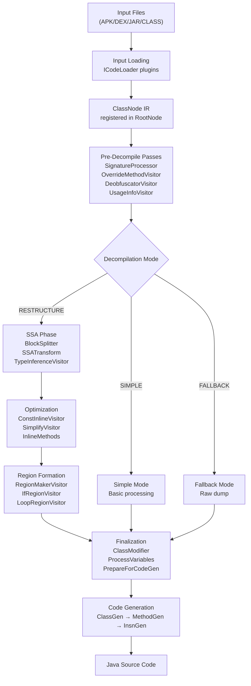
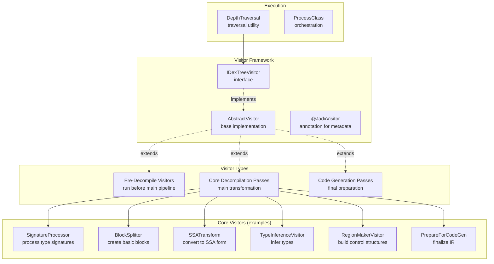
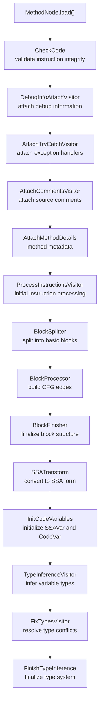
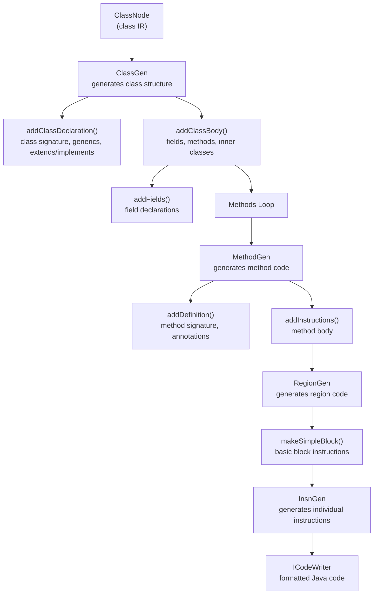

# Decompilation Pipeline

Relevant source files

The following files were used as context for generating this wiki page:

- [jadx-core/src/main/java/jadx/api/JadxDecompiler.java](https://github.com/skylot/jadx/blob/HEAD/jadx-core/src/main/java/jadx/api/JadxDecompiler.java)
- [jadx-core/src/main/java/jadx/api/JavaClass.java](https://github.com/skylot/jadx/blob/HEAD/jadx-core/src/main/java/jadx/api/JavaClass.java)
- [jadx-core/src/main/java/jadx/api/JavaField.java](https://github.com/skylot/jadx/blob/HEAD/jadx-core/src/main/java/jadx/api/JavaField.java)
- [jadx-core/src/main/java/jadx/api/JavaMethod.java](https://github.com/skylot/jadx/blob/HEAD/jadx-core/src/main/java/jadx/api/JavaMethod.java)
- [jadx-core/src/main/java/jadx/core/Jadx.java](https://github.com/skylot/jadx/blob/HEAD/jadx-core/src/main/java/jadx/core/Jadx.java)
- [jadx-core/src/main/java/jadx/core/ProcessClass.java](https://github.com/skylot/jadx/blob/HEAD/jadx-core/src/main/java/jadx/core/ProcessClass.java)
- [jadx-core/src/main/java/jadx/core/codegen/ClassGen.java](https://github.com/skylot/jadx/blob/HEAD/jadx-core/src/main/java/jadx/core/codegen/ClassGen.java)
- [jadx-core/src/main/java/jadx/core/codegen/InsnGen.java](https://github.com/skylot/jadx/blob/HEAD/jadx-core/src/main/java/jadx/core/codegen/InsnGen.java)
- [jadx-core/src/main/java/jadx/core/codegen/MethodGen.java](https://github.com/skylot/jadx/blob/HEAD/jadx-core/src/main/java/jadx/core/codegen/MethodGen.java)
- [jadx-core/src/main/java/jadx/core/codegen/NameGen.java](https://github.com/skylot/jadx/blob/HEAD/jadx-core/src/main/java/jadx/core/codegen/NameGen.java)
- [jadx-core/src/main/java/jadx/core/codegen/RegionGen.java](https://github.com/skylot/jadx/blob/HEAD/jadx-core/src/main/java/jadx/core/codegen/RegionGen.java)
- [jadx-core/src/main/java/jadx/core/dex/attributes/AType.java](https://github.com/skylot/jadx/blob/HEAD/jadx-core/src/main/java/jadx/core/dex/attributes/AType.java)
- [jadx-core/src/main/java/jadx/core/dex/attributes/nodes/CodeFeaturesAttr.java](https://github.com/skylot/jadx/blob/HEAD/jadx-core/src/main/java/jadx/core/dex/attributes/nodes/CodeFeaturesAttr.java)
- [jadx-core/src/main/java/jadx/core/dex/attributes/nodes/EnumClassAttr.java](https://github.com/skylot/jadx/blob/HEAD/jadx-core/src/main/java/jadx/core/dex/attributes/nodes/EnumClassAttr.java)
- [jadx-core/src/main/java/jadx/core/dex/attributes/nodes/JadxCommentsAttr.java](https://github.com/skylot/jadx/blob/HEAD/jadx-core/src/main/java/jadx/core/dex/attributes/nodes/JadxCommentsAttr.java)
- [jadx-core/src/main/java/jadx/core/dex/attributes/nodes/SkipMethodArgsAttr.java](https://github.com/skylot/jadx/blob/HEAD/jadx-core/src/main/java/jadx/core/dex/attributes/nodes/SkipMethodArgsAttr.java)
- [jadx-core/src/main/java/jadx/core/dex/info/ClassInfo.java](https://github.com/skylot/jadx/blob/HEAD/jadx-core/src/main/java/jadx/core/dex/info/ClassInfo.java)
- [jadx-core/src/main/java/jadx/core/dex/nodes/ClassNode.java](https://github.com/skylot/jadx/blob/HEAD/jadx-core/src/main/java/jadx/core/dex/nodes/ClassNode.java)
- [jadx-core/src/main/java/jadx/core/dex/nodes/MethodNode.java](https://github.com/skylot/jadx/blob/HEAD/jadx-core/src/main/java/jadx/core/dex/nodes/MethodNode.java)
- [jadx-core/src/main/java/jadx/core/dex/nodes/RootNode.java](https://github.com/skylot/jadx/blob/HEAD/jadx-core/src/main/java/jadx/core/dex/nodes/RootNode.java)
- [jadx-core/src/main/java/jadx/core/dex/visitors/ClassModifier.java](https://github.com/skylot/jadx/blob/HEAD/jadx-core/src/main/java/jadx/core/dex/visitors/ClassModifier.java)
- [jadx-core/src/main/java/jadx/core/dex/visitors/ConstructorVisitor.java](https://github.com/skylot/jadx/blob/HEAD/jadx-core/src/main/java/jadx/core/dex/visitors/ConstructorVisitor.java)
- [jadx-core/src/main/java/jadx/core/dex/visitors/DepthTraversal.java](https://github.com/skylot/jadx/blob/HEAD/jadx-core/src/main/java/jadx/core/dex/visitors/DepthTraversal.java)
- [jadx-core/src/main/java/jadx/core/dex/visitors/EnumVisitor.java](https://github.com/skylot/jadx/blob/HEAD/jadx-core/src/main/java/jadx/core/dex/visitors/EnumVisitor.java)
- [jadx-core/src/main/java/jadx/core/dex/visitors/ModVisitor.java](https://github.com/skylot/jadx/blob/HEAD/jadx-core/src/main/java/jadx/core/dex/visitors/ModVisitor.java)
- [jadx-core/src/main/java/jadx/core/utils/DecompilerScheduler.java](https://github.com/skylot/jadx/blob/HEAD/jadx-core/src/main/java/jadx/core/utils/DecompilerScheduler.java)
- [jadx-core/src/main/java/jadx/core/utils/android/AndroidResourcesUtils.java](https://github.com/skylot/jadx/blob/HEAD/jadx-core/src/main/java/jadx/core/utils/android/AndroidResourcesUtils.java)
- [jadx-core/src/test/java/jadx/tests/api/IntegrationTest.java](https://github.com/skylot/jadx/blob/HEAD/jadx-core/src/test/java/jadx/tests/api/IntegrationTest.java)
- [jadx-core/src/test/java/jadx/tests/integration/enums/TestEnums11.java](https://github.com/skylot/jadx/blob/HEAD/jadx-core/src/test/java/jadx/tests/integration/enums/TestEnums11.java)
- [jadx-core/src/test/raung/enums/TestEnums11.raung](https://github.com/skylot/jadx/blob/HEAD/jadx-core/src/test/raung/enums/TestEnums11.raung)

The Decompilation Pipeline is the core processing system that transforms bytecode (DEX or Java class files) into readable Java source code. This multi-stage pipeline applies a series of transformation passes to convert low-level instructions into high-level control flow structures and finally into formatted Java code.

**Scope:** This page covers the visitor-based transformation pipeline, decompilation modes, and code generation stages. For information about the orchestration layer, see [API and Orchestration](https://github.com/skylot/jadx/blob/HEAD/2.1). For details on specific transformation passes like control flow analysis and region formation, see [Control Flow Analysis](https://github.com/skylot/jadx/blob/HEAD/2.3) and [Region Formation](https://github.com/skylot/jadx/blob/HEAD/2.4).

## Pipeline Overview

The decompilation pipeline processes each class through sequential stages:

1. **Input Loading** - Plugin-based loaders convert various formats into `ClassNode` IR.
2. **Pre-Decompile Passes** - Initial analysis passes run before the main decompilation.
3. **Mode Selection** - Choose decompilation strategy (`RESTRUCTURE`, `SIMPLE`, or `FALLBACK`).
4. **SSA Transformation** - Convert to Single Static Assignment form for analysis.
5. **Optimization** - Simplify and improve code quality.
6. **Region Formation** - Build high-level control structures from basic blocks.
7. **Finalization** - Prepare the IR for code generation.
8. **Code Generation** - Generate formatted Java source code.

### Decompilation Data Flow

Sources: [jadx-core/src/main/java/jadx/core/Jadx.java:90-101](https://github.com/skylot/jadx/blob/HEAD/jadx-core/src/main/java/jadx/core/Jadx.java#L90-L101), [jadx-core/src/main/java/jadx/core/Jadx.java:104-121](https://github.com/skylot/jadx/blob/HEAD/jadx-core/src/main/java/jadx/core/Jadx.java#L104-L121), [jadx-core/src/main/java/jadx/core/Jadx.java:123-195](https://github.com/skylot/jadx/blob/HEAD/jadx-core/src/main/java/jadx/core/Jadx.java#L123-L195)

## Visitor Pattern Architecture

The pipeline is built on the Visitor pattern using the `IDexTreeVisitor` interface. Each pass implements this interface to transform the intermediate representation.

### Visitor Framework Class Association

The `@JadxVisitor` annotation provides metadata for each pass:
- `name`: Display name for the pass.
- `desc`: Description of what the pass does.
- `runAfter`: Dependencies (passes that must run before).
- `runBefore`: Ordering constraints (passes that must run after).

Sources: [jadx-core/src/main/java/jadx/core/dex/visitors/ModVisitor.java:70-77](https://github.com/skylot/jadx/blob/HEAD/jadx-core/src/main/java/jadx/core/dex/visitors/ModVisitor.java#L70-L77), [jadx-core/src/main/java/jadx/core/dex/visitors/ClassModifier.java:41-50](https://github.com/skylot/jadx/blob/HEAD/jadx-core/src/main/java/jadx/core/dex/visitors/ClassModifier.java#L41-L50)

## Decompilation Modes

JADX supports three decompilation modes selected via `JadxArgs.getDecompilationMode()`:

| Mode | Description | Use Case | Pipeline |
|------|-------------|----------|----------|
| **AUTO** / **RESTRUCTURE** | Full decompilation with SSA and region formation | Default mode for production | Complete pass list (40+ passes) |
| **SIMPLE** | Basic decompilation without advanced transformations | Faster processing, simpler output | Minimal passes, no region formation |
| **FALLBACK** | Raw instruction dump when decompilation fails | Error recovery | `FallbackModeVisitor` only |

Methods can override the mode using the `DecompileModeOverrideAttr` attribute, allowing per-method fallback even when the class uses `RESTRUCTURE` mode.

Sources: [jadx-core/src/main/java/jadx/core/Jadx.java:90-101](https://github.com/skylot/jadx/blob/HEAD/jadx-core/src/main/java/jadx/core/Jadx.java#L90-L101), [jadx-core/src/main/java/jadx/core/codegen/MethodGen.java:114-127](https://github.com/skylot/jadx/blob/HEAD/jadx-core/src/main/java/jadx/core/codegen/MethodGen.java#L114-L127), [jadx-core/src/main/java/jadx/core/codegen/MethodGen.java:50-52](https://github.com/skylot/jadx/blob/HEAD/jadx-core/src/main/java/jadx/core/codegen/MethodGen.java#L50-L52)

## SSA Transformation Phase

For `RESTRUCTURE` mode, the pipeline transforms bytecode into Static Single Assignment (SSA) form for advanced analysis.

### SSA Transformation Sequence

### Key Components
- **BlockSplitter**: Identifies block boundaries and creates `BlockNode` instances [jadx-core/src/main/java/jadx/core/Jadx.java:138](https://github.com/skylot/jadx/blob/HEAD/jadx-core/src/main/java/jadx/core/Jadx.java#L138).
- **SSATransform**: Creates phi-nodes at block merge points and renames variables to ensure single assignment [jadx-core/src/main/java/jadx/core/Jadx.java:145](https://github.com/skylot/jadx/blob/HEAD/jadx-core/src/main/java/jadx/core/Jadx.java#L145).
- **TypeInferenceVisitor**: Collects type constraints and propagates types through the SSA graph [jadx-core/src/main/java/jadx/core/Jadx.java:153](https://github.com/skylot/jadx/blob/HEAD/jadx-core/src/main/java/jadx/core/Jadx.java#L153).

Sources: [jadx-core/src/main/java/jadx/core/Jadx.java:123-159](https://github.com/skylot/jadx/blob/HEAD/jadx-core/src/main/java/jadx/core/Jadx.java#L123-L159), [jadx-core/src/main/java/jadx/core/dex/nodes/MethodNode.java:152-188](https://github.com/skylot/jadx/blob/HEAD/jadx-core/src/main/java/jadx/core/dex/nodes/MethodNode.java#L152-L188)

## Optimization and Region Formation

After SSA transformation, optimization passes improve code quality, followed by region formation which builds high-level control structures.

### Optimization Highlights
- **ModVisitor**: Modifies or replaces specific instruction patterns, such as anonymous constructor calls, constant keys in switches, and array filling [jadx-core/src/main/java/jadx/core/dex/visitors/ModVisitor.java:101-169](https://github.com/skylot/jadx/blob/HEAD/jadx-core/src/main/java/jadx/core/dex/visitors/ModVisitor.java#L101-L169).
- **ClassModifier**: Removes synthetic classes, methods, and fields to clean up the output [jadx-core/src/main/java/jadx/core/dex/visitors/ClassModifier.java:54-69](https://github.com/skylot/jadx/blob/HEAD/jadx-core/src/main/java/jadx/core/dex/visitors/ClassModifier.java#L54-L69). It specifically targets synthetic bridge methods [jadx-core/src/main/java/jadx/core/dex/visitors/ClassModifier.java:161-168](https://github.com/skylot/jadx/blob/HEAD/jadx-core/src/main/java/jadx/core/dex/visitors/ClassModifier.java#L161-L168) and synthetic fields in inner classes [jadx-core/src/main/java/jadx/core/dex/visitors/ClassModifier.java:81-111](https://github.com/skylot/jadx/blob/HEAD/jadx-core/src/main/java/jadx/core/dex/visitors/ClassModifier.java#L81-L111).
- **EnumVisitor**: Restores enum classes by identifying static init patterns and extracting enum fields [jadx-core/src/main/java/jadx/core/dex/visitors/EnumVisitor.java:118-197](https://github.com/skylot/jadx/blob/HEAD/jadx-core/src/main/java/jadx/core/dex/visitors/EnumVisitor.java#L118-L197).

### Region Formation
`RegionMakerVisitor` transforms flat basic blocks into hierarchical regions (e.g., `IfRegion`, `LoopRegion`) [jadx-core/src/main/java/jadx/core/Jadx.java:181](https://github.com/skylot/jadx/blob/HEAD/jadx-core/src/main/java/jadx/core/Jadx.java#L181). This is followed by:
- **IfRegionVisitor**: Optimizes if-else structures and ternary expressions [jadx-core/src/main/java/jadx/core/Jadx.java:182](https://github.com/skylot/jadx/blob/HEAD/jadx-core/src/main/java/jadx/core/Jadx.java#L182).
- **ReturnVisitor**: Consolidates return statements [jadx-core/src/main/java/jadx/core/Jadx.java:186](https://github.com/skylot/jadx/blob/HEAD/jadx-core/src/main/java/jadx/core/Jadx.java#L186).

Sources: [jadx-core/src/main/java/jadx/core/Jadx.java:160-192](https://github.com/skylot/jadx/blob/HEAD/jadx-core/src/main/java/jadx/core/Jadx.java#L160-L192), [jadx-core/src/main/java/jadx/core/dex/visitors/ModVisitor.java:78-99](https://github.com/skylot/jadx/blob/HEAD/jadx-core/src/main/java/jadx/core/dex/visitors/ModVisitor.java#L78-L99), [jadx-core/src/main/java/jadx/core/dex/visitors/ClassModifier.java:81-111](https://github.com/skylot/jadx/blob/HEAD/jadx-core/src/main/java/jadx/core/dex/visitors/ClassModifier.java#L81-L111)

## Code Generation Stage

Code generation transforms the final IR into Java source code using a hierarchical generator system.

### Code Generation Hierarchy

### Core Generators
- **ClassGen**: Handles class declarations, imports, and member orchestration [jadx-core/src/main/java/jadx/core/codegen/ClassGen.java:56-112](https://github.com/skylot/jadx/blob/HEAD/jadx-core/src/main/java/jadx/core/codegen/ClassGen.java#L56-L112). It manages package info [jadx-core/src/main/java/jadx/core/codegen/ClassGen.java:114-120](https://github.com/skylot/jadx/blob/HEAD/jadx-core/src/main/java/jadx/core/codegen/ClassGen.java#L114-L120) and imports [jadx-core/src/main/java/jadx/core/codegen/ClassGen.java:122-139](https://github.com/skylot/jadx/blob/HEAD/jadx-core/src/main/java/jadx/core/codegen/ClassGen.java#L122-L139).
- **MethodGen**: Manages method signatures [jadx-core/src/main/java/jadx/core/codegen/MethodGen.java:81-164](https://github.com/skylot/jadx/blob/HEAD/jadx-core/src/main/java/jadx/core/codegen/MethodGen.java#L81-L164) and delegates body generation. It also handles `@Override` annotations [jadx-core/src/main/java/jadx/core/codegen/MethodGen.java:174-191](https://github.com/skylot/jadx/blob/HEAD/jadx-core/src/main/java/jadx/core/codegen/MethodGen.java#L174-L191) and uses `NameGen` for variable naming [jadx-core/src/main/java/jadx/core/codegen/MethodGen.java:66](https://github.com/skylot/jadx/blob/HEAD/jadx-core/src/main/java/jadx/core/codegen/MethodGen.java#L66).
- **InsnGen**: Translates individual `InsnNode` and `InsnArg` objects into Java syntax [jadx-core/src/main/java/jadx/core/codegen/InsnGen.java:70-127](https://github.com/skylot/jadx/blob/HEAD/jadx-core/src/main/java/jadx/core/codegen/InsnGen.java#L70-L127). It handles variable assignment [jadx-core/src/main/java/jadx/core/codegen/InsnGen.java:149-156](https://github.com/skylot/jadx/blob/HEAD/jadx-core/src/main/java/jadx/core/codegen/InsnGen.java#L149-L156) and declaration [jadx-core/src/main/java/jadx/core/codegen/InsnGen.java:158-169](https://github.com/skylot/jadx/blob/HEAD/jadx-core/src/main/java/jadx/core/codegen/InsnGen.java#L158-L169).
- **RegionGen**: Generates high-level control structures like `if` [jadx-core/src/main/java/jadx/core/codegen/RegionGen.java:103-147](https://github.com/skylot/jadx/blob/HEAD/jadx-core/src/main/java/jadx/core/codegen/RegionGen.java#L103-L147) and `loop` [jadx-core/src/main/java/jadx/core/codegen/RegionGen.java:164-212](https://github.com/skylot/jadx/blob/HEAD/jadx-core/src/main/java/jadx/core/codegen/RegionGen.java#L164-L212). It also handles variable declarations within regions [jadx-core/src/main/java/jadx/core/codegen/RegionGen.java:69-79](https://github.com/skylot/jadx/blob/HEAD/jadx-core/src/main/java/jadx/core/codegen/RegionGen.java#L69-L79).

Sources: [jadx-core/src/main/java/jadx/core/codegen/ClassGen.java:56-112](https://github.com/skylot/jadx/blob/HEAD/jadx-core/src/main/java/jadx/core/codegen/ClassGen.java#L56-L112), [jadx-core/src/main/java/jadx/core/codegen/MethodGen.java:62-80](https://github.com/skylot/jadx/blob/HEAD/jadx-core/src/main/java/jadx/core/codegen/MethodGen.java#L62-L80), [jadx-core/src/main/java/jadx/core/codegen/InsnGen.java:70-127](https://github.com/skylot/jadx/blob/HEAD/jadx-core/src/main/java/jadx/core/codegen/InsnGen.java#L70-L127), [jadx-core/src/main/java/jadx/core/codegen/RegionGen.java:57-67](https://github.com/skylot/jadx/blob/HEAD/jadx-core/src/main/java/jadx/core/codegen/RegionGen.java#L57-L67)

## Pipeline Orchestration

The pipeline is orchestrated by selecting the appropriate list of visitors based on the desired decompilation mode.

### Execution Logic
1. **Mode Selection**: `Jadx.getPassesList(args)` returns the sequence of visitors [jadx-core/src/main/java/jadx/core/Jadx.java:90-102](https://github.com/skylot/jadx/blob/HEAD/jadx-core/src/main/java/jadx/core/Jadx.java#L90-L102).
2. **Pre-Decompile**: `Jadx.getPreDecompilePassesList()` runs global analysis including deobfuscation and usage info collection [jadx-core/src/main/java/jadx/core/Jadx.java:104-121](https://github.com/skylot/jadx/blob/HEAD/jadx-core/src/main/java/jadx/core/Jadx.java#L104-L121).
3. **Generate**: `ClassGen.makeClass()` triggers the final code generation [jadx-core/src/main/java/jadx/core/codegen/ClassGen.java:99-112](https://github.com/skylot/jadx/blob/HEAD/jadx-core/src/main/java/jadx/core/codegen/ClassGen.java#L99-L112).

Sources: [jadx-core/src/main/java/jadx/core/Jadx.java:90-102](https://github.com/skylot/jadx/blob/HEAD/jadx-core/src/main/java/jadx/core/Jadx.java#L90-L102), [jadx-core/src/main/java/jadx/core/codegen/ClassGen.java:99-112](https://github.com/skylot/jadx/blob/HEAD/jadx-core/src/main/java/jadx/core/codegen/ClassGen.java#L99-L112), [jadx-api/src/main/java/jadx/api/JadxDecompiler.java:119-139](https://github.com/skylot/jadx/blob/HEAD/jadx-api/src/main/java/jadx/api/JadxDecompiler.java#L119-L139)1d:T