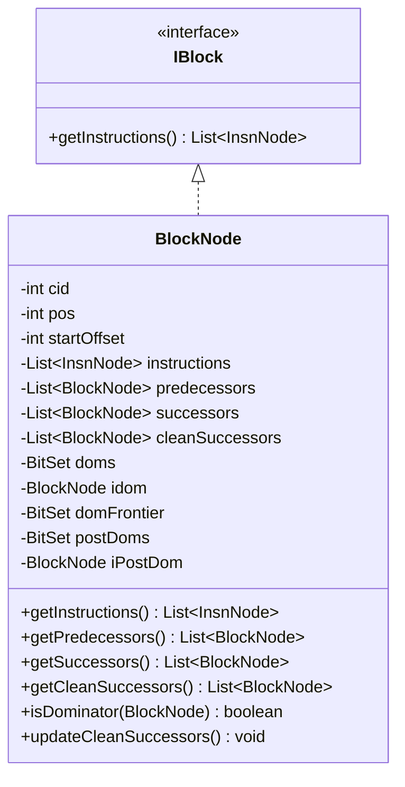
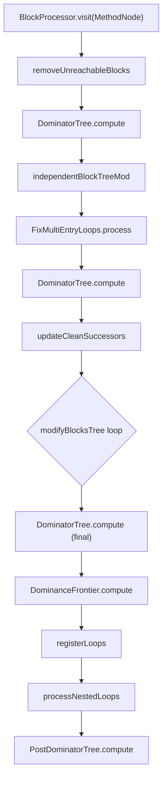
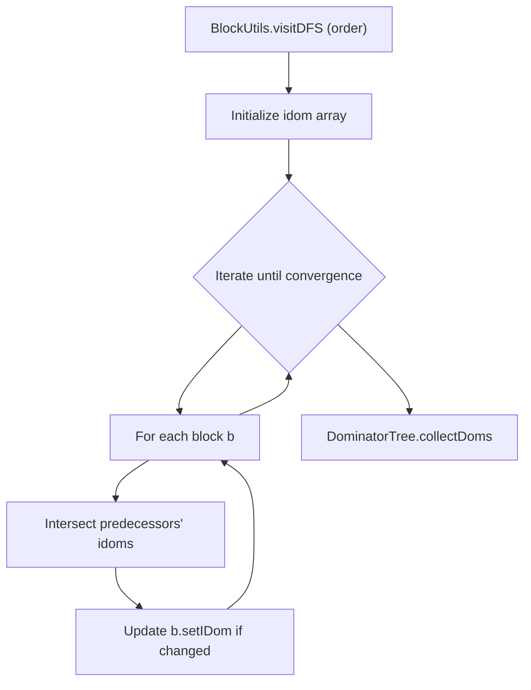

# Control Flow Analysis

Relevant source files

The following files were used as context for generating this wiki page:

- [jadx-core/src/main/java/jadx/core/codegen/SimpleModeHelper.java](https://github.com/skylot/jadx/blob/HEAD/jadx-core/src/main/java/jadx/core/codegen/SimpleModeHelper.java)
- [jadx-core/src/main/java/jadx/core/dex/attributes/AFlag.java](https://github.com/skylot/jadx/blob/HEAD/jadx-core/src/main/java/jadx/core/dex/attributes/AFlag.java)
- [jadx-core/src/main/java/jadx/core/dex/attributes/nodes/ForceReturnAttr.java](https://github.com/skylot/jadx/blob/HEAD/jadx-core/src/main/java/jadx/core/dex/attributes/nodes/ForceReturnAttr.java)
- [jadx-core/src/main/java/jadx/core/dex/instructions/PhiInsn.java](https://github.com/skylot/jadx/blob/HEAD/jadx-core/src/main/java/jadx/core/dex/instructions/PhiInsn.java)
- [jadx-core/src/main/java/jadx/core/dex/nodes/BlockNode.java](https://github.com/skylot/jadx/blob/HEAD/jadx-core/src/main/java/jadx/core/dex/nodes/BlockNode.java)
- [jadx-core/src/main/java/jadx/core/dex/trycatch/CatchAttr.java](https://github.com/skylot/jadx/blob/HEAD/jadx-core/src/main/java/jadx/core/dex/trycatch/CatchAttr.java)
- [jadx-core/src/main/java/jadx/core/dex/visitors/AttachTryCatchVisitor.java](https://github.com/skylot/jadx/blob/HEAD/jadx-core/src/main/java/jadx/core/dex/visitors/AttachTryCatchVisitor.java)
- [jadx-core/src/main/java/jadx/core/dex/visitors/DotGraphVisitor.java](https://github.com/skylot/jadx/blob/HEAD/jadx-core/src/main/java/jadx/core/dex/visitors/DotGraphVisitor.java)
- [jadx-core/src/main/java/jadx/core/dex/visitors/blocks/BlockExceptionHandler.java](https://github.com/skylot/jadx/blob/HEAD/jadx-core/src/main/java/jadx/core/dex/visitors/blocks/BlockExceptionHandler.java)
- [jadx-core/src/main/java/jadx/core/dex/visitors/blocks/BlockProcessor.java](https://github.com/skylot/jadx/blob/HEAD/jadx-core/src/main/java/jadx/core/dex/visitors/blocks/BlockProcessor.java)
- [jadx-core/src/main/java/jadx/core/dex/visitors/blocks/BlockSplitter.java](https://github.com/skylot/jadx/blob/HEAD/jadx-core/src/main/java/jadx/core/dex/visitors/blocks/BlockSplitter.java)
- [jadx-core/src/main/java/jadx/core/dex/visitors/blocks/DominatorTree.java](https://github.com/skylot/jadx/blob/HEAD/jadx-core/src/main/java/jadx/core/dex/visitors/blocks/DominatorTree.java)
- [jadx-core/src/main/java/jadx/core/dex/visitors/blocks/PostDominatorTree.java](https://github.com/skylot/jadx/blob/HEAD/jadx-core/src/main/java/jadx/core/dex/visitors/blocks/PostDominatorTree.java)
- [jadx-core/src/main/java/jadx/core/dex/visitors/finaly/MarkFinallyVisitor.java](https://github.com/skylot/jadx/blob/HEAD/jadx-core/src/main/java/jadx/core/dex/visitors/finaly/MarkFinallyVisitor.java)
- [jadx-core/src/main/java/jadx/core/utils/BlockUtils.java](https://github.com/skylot/jadx/blob/HEAD/jadx-core/src/main/java/jadx/core/utils/BlockUtils.java)
- [jadx-core/src/main/java/jadx/core/utils/DebugUtils.java](https://github.com/skylot/jadx/blob/HEAD/jadx-core/src/main/java/jadx/core/utils/DebugUtils.java)
- [jadx-core/src/main/java/jadx/core/utils/blocks/BlockPair.java](https://github.com/skylot/jadx/blob/HEAD/jadx-core/src/main/java/jadx/core/utils/blocks/BlockPair.java)
- [jadx-core/src/main/java/jadx/core/utils/blocks/BlockSet.java](https://github.com/skylot/jadx/blob/HEAD/jadx-core/src/main/java/jadx/core/utils/blocks/BlockSet.java)
- [jadx-core/src/test/java/jadx/tests/integration/conditions/TestTernary4.java](https://github.com/skylot/jadx/blob/HEAD/jadx-core/src/test/java/jadx/tests/integration/conditions/TestTernary4.java)
- [jadx-core/src/test/java/jadx/tests/integration/trycatch/TestNestedTryCatch2.java](https://github.com/skylot/jadx/blob/HEAD/jadx-core/src/test/java/jadx/tests/integration/trycatch/TestNestedTryCatch2.java)
- [jadx-core/src/test/java/jadx/tests/integration/trycatch/TestTryCatch10.java](https://github.com/skylot/jadx/blob/HEAD/jadx-core/src/test/java/jadx/tests/integration/trycatch/TestTryCatch10.java)
- [jadx-core/src/test/java/jadx/tests/integration/trycatch/TestTryCatchFinally12.java](https://github.com/skylot/jadx/blob/HEAD/jadx-core/src/test/java/jadx/tests/integration/trycatch/TestTryCatchFinally12.java)
- [jadx-core/src/test/java/jadx/tests/integration/trycatch/TestTryCatchMultiException.java](https://github.com/skylot/jadx/blob/HEAD/jadx-core/src/test/java/jadx/tests/integration/trycatch/TestTryCatchMultiException.java)
- [jadx-core/src/test/java/jadx/tests/integration/trycatch/TestTryCatchMultiException2.java](https://github.com/skylot/jadx/blob/HEAD/jadx-core/src/test/java/jadx/tests/integration/trycatch/TestTryCatchMultiException2.java)
- [jadx-core/src/test/java/jadx/tests/integration/types/TestTypeResolver3.java](https://github.com/skylot/jadx/blob/HEAD/jadx-core/src/test/java/jadx/tests/integration/types/TestTypeResolver3.java)
- [jadx-core/src/test/smali/conditions/TestTernary4.smali](https://github.com/skylot/jadx/blob/HEAD/jadx-core/src/test/smali/conditions/TestTernary4.smali)
- [jadx-core/src/test/smali/trycatch/TestTryCatch10.smali](https://github.com/skylot/jadx/blob/HEAD/jadx-core/src/test/smali/trycatch/TestTryCatch10.smali)
- [jadx-core/src/test/smali/trycatch/TestTryCatchMultiException2.smali](https://github.com/skylot/jadx/blob/HEAD/jadx-core/src/test/smali/trycatch/TestTryCatchMultiException2.smali)

Control flow analysis transforms the flat sequence of basic blocks into a structured representation with dominator relationships, loop information, and exception handling boundaries. This phase builds the Control Flow Graph (CFG), computes dominance relationships, and identifies loops and exception handlers.

For instruction-level transformations and SSA construction, see [Decompilation Pipeline](06_2.2-decompilation-pipeline.md). For conversion of the CFG into hierarchical region structures, see [Region Formation](08_2.4-region-formation.md).

---

## Block Representation

### BlockNode Structure

Each basic block is represented by a `BlockNode` object containing instructions, control flow edges, and computed analysis data.

**Sources:** [jadx-core/src/main/java/jadx/core/dex/nodes/BlockNode.java:20-282](https://github.com/skylot/jadx/blob/HEAD/jadx-core/src/main/java/jadx/core/dex/nodes/BlockNode.java#L20-L282)

### Key Block Properties

| Property | Type | Description |
|----------|------|-------------|
| `cid` | `int` | Constant identifier, immutable [jadx-core/src/main/java/jadx/core/dex/nodes/BlockNode.java:25-25](https://github.com/skylot/jadx/blob/HEAD/jadx-core/src/main/java/jadx/core/dex/nodes/BlockNode.java#L25) |
| `pos` | `int` | Position in blocks list (for BitSet indexing) [jadx-core/src/main/java/jadx/core/dex/nodes/BlockNode.java:30-30](https://github.com/skylot/jadx/blob/HEAD/jadx-core/src/main/java/jadx/core/dex/nodes/BlockNode.java#L30) |
| `startOffset` | `int` | Bytecode offset of first instruction [jadx-core/src/main/java/jadx/core/dex/nodes/BlockNode.java:35-35](https://github.com/skylot/jadx/blob/HEAD/jadx-core/src/main/java/jadx/core/dex/nodes/BlockNode.java#L35) |
| `instructions` | `List<InsnNode>` | Instructions in this block [jadx-core/src/main/java/jadx/core/dex/nodes/BlockNode.java:37-37](https://github.com/skylot/jadx/blob/HEAD/jadx-core/src/main/java/jadx/core/dex/nodes/BlockNode.java#L37) |
| `predecessors` | `List<BlockNode>` | Incoming control flow edges [jadx-core/src/main/java/jadx/core/dex/nodes/BlockNode.java:39-39](https://github.com/skylot/jadx/blob/HEAD/jadx-core/src/main/java/jadx/core/dex/nodes/BlockNode.java#L39) |
| `successors` | `List<BlockNode>` | Outgoing control flow edges [jadx-core/src/main/java/jadx/core/dex/nodes/BlockNode.java:40-40](https://github.com/skylot/jadx/blob/HEAD/jadx-core/src/main/java/jadx/core/dex/nodes/BlockNode.java#L40) |
| `cleanSuccessors` | `List<BlockNode>` | Successors excluding exception handlers and back edges [jadx-core/src/main/java/jadx/core/dex/nodes/BlockNode.java:41-41](https://github.com/skylot/jadx/blob/HEAD/jadx-core/src/main/java/jadx/core/dex/nodes/BlockNode.java#L41) |
| `doms` | `BitSet` | All dominators (excluding self) [jadx-core/src/main/java/jadx/core/dex/nodes/BlockNode.java:46-46](https://github.com/skylot/jadx/blob/HEAD/jadx-core/src/main/java/jadx/core/dex/nodes/BlockNode.java#L46) |
| `idom` | `BlockNode` | Immediate dominator [jadx-core/src/main/java/jadx/core/dex/nodes/BlockNode.java:61-61](https://github.com/skylot/jadx/blob/HEAD/jadx-core/src/main/java/jadx/core/dex/nodes/BlockNode.java#L61) |
| `domFrontier` | `BitSet` | Dominance frontier blocks [jadx-core/src/main/java/jadx/core/dex/nodes/BlockNode.java:56-56](https://github.com/skylot/jadx/blob/HEAD/jadx-core/src/main/java/jadx/core/dex/nodes/BlockNode.java#L56) |

Clean successors exclude exception handler paths and loop back edges, simplifying forward control flow analysis [jadx-core/src/main/java/jadx/core/dex/nodes/BlockNode.java:140-163](https://github.com/skylot/jadx/blob/HEAD/jadx-core/src/main/java/jadx/core/dex/nodes/BlockNode.java#L140-L163).

**Sources:** [jadx-core/src/main/java/jadx/core/dex/nodes/BlockNode.java:20-71](https://github.com/skylot/jadx/blob/HEAD/jadx-core/src/main/java/jadx/core/dex/nodes/BlockNode.java#L20-L71), [jadx-core/src/main/java/jadx/core/dex/nodes/BlockNode.java:140-163](https://github.com/skylot/jadx/blob/HEAD/jadx-core/src/main/java/jadx/core/dex/nodes/BlockNode.java#L140-L163)

---

## BlockProcessor Pipeline

The `BlockProcessor` orchestrates control flow analysis through a multi-stage pipeline, ensuring that dominators and loops are correctly identified even after graph modifications.

### Processing Stages

**Sources:** [jadx-core/src/main/java/jadx/core/dex/visitors/blocks/BlockProcessor.java:53-96](https://github.com/skylot/jadx/blob/HEAD/jadx-core/src/main/java/jadx/core/dex/visitors/blocks/BlockProcessor.java#L53-L96)

### Dominance and Loop Registration

The `BlockProcessor` manages the lifecycle of block metadata. If the block tree is changed by custom passes, `updateBlocksData(mth)` is used to recalculate dominators, dominance frontiers, and loop information [jadx-core/src/main/java/jadx/core/dex/visitors/blocks/BlockProcessor.java:111-123](https://github.com/skylot/jadx/blob/HEAD/jadx-core/src/main/java/jadx/core/dex/visitors/blocks/BlockProcessor.java#L111-L123).

The final stage of analysis includes:
- **Dominance Frontier**: Used for SSA form construction [jadx-core/src/main/java/jadx/core/dex/visitors/blocks/BlockProcessor.java:89-89](https://github.com/skylot/jadx/blob/HEAD/jadx-core/src/main/java/jadx/core/dex/visitors/blocks/BlockProcessor.java#L89).
- **Post Dominator Tree**: Computed if `AFlag.COMPUTE_POST_DOM` is present or required by the method [jadx-core/src/main/java/jadx/core/dex/visitors/blocks/PostDominatorTree.java:15-18](https://github.com/skylot/jadx/blob/HEAD/jadx-core/src/main/java/jadx/core/dex/visitors/blocks/PostDominatorTree.java#L15-L18).

**Sources:** [jadx-core/src/main/java/jadx/core/dex/visitors/blocks/BlockProcessor.java:53-123](https://github.com/skylot/jadx/blob/HEAD/jadx-core/src/main/java/jadx/core/dex/visitors/blocks/BlockProcessor.java#L53-L123), [jadx-core/src/main/java/jadx/core/dex/visitors/blocks/PostDominatorTree.java:13-18](https://github.com/skylot/jadx/blob/HEAD/jadx-core/src/main/java/jadx/core/dex/visitors/blocks/PostDominatorTree.java#L13-L18)

---

## Dominator Tree Computation

Jadx computes dominators using a standard iterative algorithm.

### Algorithm Overview

The algorithm iterates over blocks in depth-first order, computing immediate dominators until convergence.

**Sources:** [jadx-core/src/main/java/jadx/core/dex/visitors/blocks/DominatorTree.java:1-166](https://github.com/skylot/jadx/blob/HEAD/jadx-core/src/main/java/jadx/core/dex/visitors/blocks/DominatorTree.java#L1-L166), [jadx-core/src/main/java/jadx/core/dex/visitors/blocks/PostDominatorTree.java:15-49](https://github.com/skylot/jadx/blob/HEAD/jadx-core/src/main/java/jadx/core/dex/visitors/blocks/PostDominatorTree.java#L15-L49)

### Post-Dominators

Post-dominator computation involves reversing the graph edges and applying the dominator algorithm starting from the exit block [jadx-core/src/main/java/jadx/core/dex/visitors/blocks/PostDominatorTree.java:22-32](https://github.com/skylot/jadx/blob/HEAD/jadx-core/src/main/java/jadx/core/dex/visitors/blocks/PostDominatorTree.java#L22-L32). This is critical for identifying control flow dependencies in complex structures like `finally` blocks and for certain type inference scenarios.

**Sources:** [jadx-core/src/main/java/jadx/core/dex/visitors/blocks/PostDominatorTree.java:13-73](https://github.com/skylot/jadx/blob/HEAD/jadx-core/src/main/java/jadx/core/dex/visitors/blocks/PostDominatorTree.java#L13-L73)

---

## Exception Flow Analysis

Exception handling significantly complicates the CFG by adding edges from potentially throwing instructions to handlers.

### Try/Catch Attachment

The `AttachTryCatchVisitor` marks instructions with `CatchAttr` based on raw DEX try/catch data [jadx-core/src/main/java/jadx/core/dex/visitors/AttachTryCatchVisitor.java:42-60](https://github.com/skylot/jadx/blob/HEAD/jadx-core/src/main/java/jadx/core/dex/visitors/AttachTryCatchVisitor.java#L42-L60). It identifies `AFlag.TRY_ENTER` and `AFlag.TRY_LEAVE` boundaries [jadx-core/src/main/java/jadx/core/dex/visitors/AttachTryCatchVisitor.java:74-84](https://github.com/skylot/jadx/blob/HEAD/jadx-core/src/main/java/jadx/core/dex/visitors/AttachTryCatchVisitor.java#L74-L84).

### Exception Handler Connection

The `BlockExceptionHandler` class connects catch blocks to the CFG. It creates synthetic "splitter" blocks to manage entry and exit from `try` regions and ensures that `ExceptionHandler` blocks are correctly integrated into the dominator tree [jadx-core/src/main/java/jadx/core/dex/visitors/blocks/BlockExceptionHandler.java:82-98](https://github.com/skylot/jadx/blob/HEAD/jadx-core/src/main/java/jadx/core/dex/visitors/blocks/BlockExceptionHandler.java#L82-L98).

| Flag/Attribute | Purpose |
|----------------|---------|
| `AFlag.EXC_BOTTOM_SPLITTER` | Marks the block where control flow returns after a handler [jadx-core/src/main/java/jadx/core/utils/BlockUtils.java:93-93](https://github.com/skylot/jadx/blob/HEAD/jadx-core/src/main/java/jadx/core/utils/BlockUtils.java#L93) |
| `AType.EXC_HANDLER` | Identifies a block as the start of an exception handler [jadx-core/src/main/java/jadx/core/utils/BlockUtils.java:92-92](https://github.com/skylot/jadx/blob/HEAD/jadx-core/src/main/java/jadx/core/utils/BlockUtils.java#L92) |
| `AType.TRY_BLOCKS_LIST` | Stores the list of `TryCatchBlockAttr` for the method [jadx-core/src/main/java/jadx/core/dex/visitors/blocks/BlockExceptionHandler.java:63-63](https://github.com/skylot/jadx/blob/HEAD/jadx-core/src/main/java/jadx/core/dex/visitors/blocks/BlockExceptionHandler.java#L63) |

**Sources:** [jadx-core/src/main/java/jadx/core/dex/visitors/AttachTryCatchVisitor.java:34-153](https://github.com/skylot/jadx/blob/HEAD/jadx-core/src/main/java/jadx/core/dex/visitors/AttachTryCatchVisitor.java#L34-L153), [jadx-core/src/main/java/jadx/core/dex/visitors/blocks/BlockExceptionHandler.java:48-180](https://github.com/skylot/jadx/blob/HEAD/jadx-core/src/main/java/jadx/core/dex/visitors/blocks/BlockExceptionHandler.java#L48-L180), [jadx-core/src/main/java/jadx/core/utils/BlockUtils.java:91-102](https://github.com/skylot/jadx/blob/HEAD/jadx-core/src/main/java/jadx/core/utils/BlockUtils.java#L91-L102)

---

## Path and Utility Classes

### BlockUtils Traversal Utilities

`BlockUtils` provides high-level utilities for analyzing paths and instruction properties within blocks.

| Function | Description |
|----------|-------------|
| `getBlockByOffset(offset, blocks)` | Finds a block starting at a specific bytecode offset [jadx-core/src/main/java/jadx/core/utils/BlockUtils.java:51-60](https://github.com/skylot/jadx/blob/HEAD/jadx-core/src/main/java/jadx/core/utils/BlockUtils.java#L51-L60) |
| `isExceptionHandlerPath(block)` | Returns true if the block is part of an exception handling flow [jadx-core/src/main/java/jadx/core/utils/BlockUtils.java:91-102](https://github.com/skylot/jadx/blob/HEAD/jadx-core/src/main/java/jadx/core/utils/BlockUtils.java#L91-L102) |
| `visitDFS(mth, consumer)` | Performs a Depth-First Search traversal of the method's blocks [jadx-core/src/main/java/jadx/core/utils/BlockUtils.java:500-503](https://github.com/skylot/jadx/blob/HEAD/jadx-core/src/main/java/jadx/core/utils/BlockUtils.java#L500-L503) |
| `collectBlocksDominatedBy(mth, root)` | Gathers all blocks dominated by a specific block [jadx-core/src/main/java/jadx/core/utils/BlockUtils.java:448-450](https://github.com/skylot/jadx/blob/HEAD/jadx-core/src/main/java/jadx/core/utils/BlockUtils.java#L448-L450) |

### BlockSet and Data Structures

`BlockSet` is a specialized collection for `BlockNode` objects implemented using a `BitSet` for efficiency during graph traversals [jadx-core/src/main/java/jadx/core/utils/blocks/BlockSet.java:24-42](https://github.com/skylot/jadx/blob/HEAD/jadx-core/src/main/java/jadx/core/utils/blocks/BlockSet.java#L24-L42).

### Phi Instruction Mapping

`PhiInsn` (used in SSA) maintains a mapping between incoming arguments and the predecessor blocks they originate from [jadx-core/src/main/java/jadx/core/dex/instructions/PhiInsn.java:23-23](https://github.com/skylot/jadx/blob/HEAD/jadx-core/src/main/java/jadx/core/dex/instructions/PhiInsn.java#L23). Utilities like `getBlockByArg(arg)` allow the decompiler to trace variable sources back through the CFG [jadx-core/src/main/java/jadx/core/dex/instructions/PhiInsn.java:55-61](https://github.com/skylot/jadx/blob/HEAD/jadx-core/src/main/java/jadx/core/dex/instructions/PhiInsn.java#L55-L61).

**Sources:** [jadx-core/src/main/java/jadx/core/utils/BlockUtils.java:46-503](https://github.com/skylot/jadx/blob/HEAD/jadx-core/src/main/java/jadx/core/utils/BlockUtils.java#L46-L503), [jadx-core/src/main/java/jadx/core/dex/instructions/PhiInsn.java:20-163](https://github.com/skylot/jadx/blob/HEAD/jadx-core/src/main/java/jadx/core/dex/instructions/PhiInsn.java#L20-L163), [jadx-core/src/main/java/jadx/core/utils/blocks/BlockSet.java:24-199](https://github.com/skylot/jadx/blob/HEAD/jadx-core/src/main/java/jadx/core/utils/blocks/BlockSet.java#L24-L199)

---

## CFG Visualization and Debugging

JADX includes tools to visualize the CFG at various stages of analysis, which is essential for debugging complex control flow transformations.

### DotGraphVisitor

`DotGraphVisitor` exports the CFG to Graphviz DOT format. It supports several modes:
- **Normal**: Standard CFG with basic blocks [jadx-core/src/main/java/jadx/core/dex/visitors/DotGraphVisitor.java:24-26](https://github.com/skylot/jadx/blob/HEAD/jadx-core/src/main/java/jadx/core/dex/visitors/DotGraphVisitor.java#L24-L26).
- **Raw**: CFG with original bytecode-level instructions [jadx-core/src/main/java/jadx/core/dex/visitors/DotGraphVisitor.java:28-30](https://github.com/skylot/jadx/blob/HEAD/jadx-core/src/main/java/jadx/core/dex/visitors/DotGraphVisitor.java#L28-L30).
- **Regions**: CFG showing the hierarchical region structure [jadx-core/src/main/java/jadx/core/dex/visitors/DotGraphVisitor.java:32-34](https://github.com/skylot/jadx/blob/HEAD/jadx-core/src/main/java/jadx/core/dex/visitors/DotGraphVisitor.java#L32-L34).

### DebugUtils

`DebugUtils` provides programmatic ways to dump method state to logs or files during development [jadx-core/src/main/java/jadx/core/utils/DebugUtils.java:57-105](https://github.com/skylot/jadx/blob/HEAD/jadx-core/src/main/java/jadx/core/utils/DebugUtils.java#L57-L105). It can print the region tree for a method, including the instructions contained within each block and their associated attributes [jadx-core/src/main/java/jadx/core/utils/DebugUtils.java:129-163](https://github.com/skylot/jadx/blob/HEAD/jadx-core/src/main/java/jadx/core/utils/DebugUtils.java#L129-L163).

**Sources:** [jadx-core/src/main/java/jadx/core/dex/visitors/DotGraphVisitor.java:11-81](https://github.com/skylot/jadx/blob/HEAD/jadx-core/src/main/java/jadx/core/dex/visitors/DotGraphVisitor.java#L11-L81), [jadx-core/src/main/java/jadx/core/utils/DebugUtils.java:49-210](https://github.com/skylot/jadx/blob/HEAD/jadx-core/src/main/java/jadx/core/utils/DebugUtils.java#L49-L210)