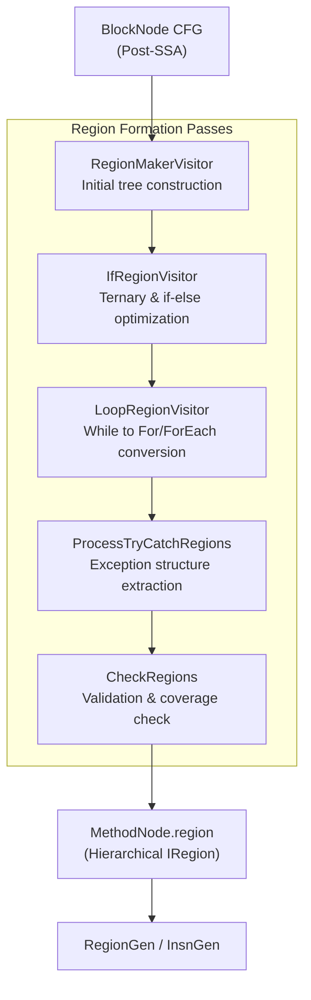
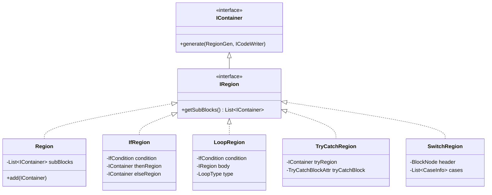
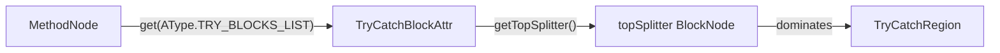

# Region Formation

Relevant source files

The following files were used as context for generating this wiki page:

- [jadx-core/src/main/java/jadx/core/dex/attributes/nodes/RegionRefAttr.java](https://github.com/skylot/jadx/blob/HEAD/jadx-core/src/main/java/jadx/core/dex/attributes/nodes/RegionRefAttr.java)
- [jadx-core/src/main/java/jadx/core/dex/instructions/args/RegisterArg.java](https://github.com/skylot/jadx/blob/HEAD/jadx-core/src/main/java/jadx/core/dex/instructions/args/RegisterArg.java)
- [jadx-core/src/main/java/jadx/core/dex/nodes/InsnContainer.java](https://github.com/skylot/jadx/blob/HEAD/jadx-core/src/main/java/jadx/core/dex/nodes/InsnContainer.java)
- [jadx-core/src/main/java/jadx/core/dex/regions/Region.java](https://github.com/skylot/jadx/blob/HEAD/jadx-core/src/main/java/jadx/core/dex/regions/Region.java)
- [jadx-core/src/main/java/jadx/core/dex/regions/SwitchRegion.java](https://github.com/skylot/jadx/blob/HEAD/jadx-core/src/main/java/jadx/core/dex/regions/SwitchRegion.java)
- [jadx-core/src/main/java/jadx/core/dex/regions/conditions/IfInfo.java](https://github.com/skylot/jadx/blob/HEAD/jadx-core/src/main/java/jadx/core/dex/regions/conditions/IfInfo.java)
- [jadx-core/src/main/java/jadx/core/dex/trycatch/ExceptionHandler.java](https://github.com/skylot/jadx/blob/HEAD/jadx-core/src/main/java/jadx/core/dex/trycatch/ExceptionHandler.java)
- [jadx-core/src/main/java/jadx/core/dex/visitors/regions/AbstractRegionVisitor.java](https://github.com/skylot/jadx/blob/HEAD/jadx-core/src/main/java/jadx/core/dex/visitors/regions/AbstractRegionVisitor.java)
- [jadx-core/src/main/java/jadx/core/dex/visitors/regions/CheckRegions.java](https://github.com/skylot/jadx/blob/HEAD/jadx-core/src/main/java/jadx/core/dex/visitors/regions/CheckRegions.java)
- [jadx-core/src/main/java/jadx/core/dex/visitors/regions/CleanRegions.java](https://github.com/skylot/jadx/blob/HEAD/jadx-core/src/main/java/jadx/core/dex/visitors/regions/CleanRegions.java)
- [jadx-core/src/main/java/jadx/core/dex/visitors/regions/DepthRegionTraversal.java](https://github.com/skylot/jadx/blob/HEAD/jadx-core/src/main/java/jadx/core/dex/visitors/regions/DepthRegionTraversal.java)
- [jadx-core/src/main/java/jadx/core/dex/visitors/regions/IRegionPartialVisitor.java](https://github.com/skylot/jadx/blob/HEAD/jadx-core/src/main/java/jadx/core/dex/visitors/regions/IRegionPartialVisitor.java)
- [jadx-core/src/main/java/jadx/core/dex/visitors/regions/IfRegionVisitor.java](https://github.com/skylot/jadx/blob/HEAD/jadx-core/src/main/java/jadx/core/dex/visitors/regions/IfRegionVisitor.java)
- [jadx-core/src/main/java/jadx/core/dex/visitors/regions/LoopRegionVisitor.java](https://github.com/skylot/jadx/blob/HEAD/jadx-core/src/main/java/jadx/core/dex/visitors/regions/LoopRegionVisitor.java)
- [jadx-core/src/main/java/jadx/core/dex/visitors/regions/PostProcessRegions.java](https://github.com/skylot/jadx/blob/HEAD/jadx-core/src/main/java/jadx/core/dex/visitors/regions/PostProcessRegions.java)
- [jadx-core/src/main/java/jadx/core/dex/visitors/regions/ProcessTryCatchRegions.java](https://github.com/skylot/jadx/blob/HEAD/jadx-core/src/main/java/jadx/core/dex/visitors/regions/ProcessTryCatchRegions.java)
- [jadx-core/src/main/java/jadx/core/dex/visitors/regions/RegionMakerVisitor.java](https://github.com/skylot/jadx/blob/HEAD/jadx-core/src/main/java/jadx/core/dex/visitors/regions/RegionMakerVisitor.java)
- [jadx-core/src/main/java/jadx/core/dex/visitors/regions/ReturnVisitor.java](https://github.com/skylot/jadx/blob/HEAD/jadx-core/src/main/java/jadx/core/dex/visitors/regions/ReturnVisitor.java)
- [jadx-core/src/main/java/jadx/core/dex/visitors/regions/TracedRegionVisitor.java](https://github.com/skylot/jadx/blob/HEAD/jadx-core/src/main/java/jadx/core/dex/visitors/regions/TracedRegionVisitor.java)
- [jadx-core/src/main/java/jadx/core/dex/visitors/regions/maker/ExcHandlersRegionMaker.java](https://github.com/skylot/jadx/blob/HEAD/jadx-core/src/main/java/jadx/core/dex/visitors/regions/maker/ExcHandlersRegionMaker.java)
- [jadx-core/src/main/java/jadx/core/dex/visitors/regions/maker/IfRegionMaker.java](https://github.com/skylot/jadx/blob/HEAD/jadx-core/src/main/java/jadx/core/dex/visitors/regions/maker/IfRegionMaker.java)
- [jadx-core/src/main/java/jadx/core/dex/visitors/regions/maker/RegionMaker.java](https://github.com/skylot/jadx/blob/HEAD/jadx-core/src/main/java/jadx/core/dex/visitors/regions/maker/RegionMaker.java)
- [jadx-core/src/main/java/jadx/core/dex/visitors/regions/maker/RegionStack.java](https://github.com/skylot/jadx/blob/HEAD/jadx-core/src/main/java/jadx/core/dex/visitors/regions/maker/RegionStack.java)
- [jadx-core/src/main/java/jadx/core/dex/visitors/regions/maker/SwitchRegionMaker.java](https://github.com/skylot/jadx/blob/HEAD/jadx-core/src/main/java/jadx/core/dex/visitors/regions/maker/SwitchRegionMaker.java)
- [jadx-core/src/main/java/jadx/core/dex/visitors/ssa/LiveVarAnalysis.java](https://github.com/skylot/jadx/blob/HEAD/jadx-core/src/main/java/jadx/core/dex/visitors/ssa/LiveVarAnalysis.java)
- [jadx-core/src/main/java/jadx/core/dex/visitors/ssa/RenameState.java](https://github.com/skylot/jadx/blob/HEAD/jadx-core/src/main/java/jadx/core/dex/visitors/ssa/RenameState.java)
- [jadx-core/src/main/java/jadx/core/dex/visitors/ssa/SSATransform.java](https://github.com/skylot/jadx/blob/HEAD/jadx-core/src/main/java/jadx/core/dex/visitors/ssa/SSATransform.java)
- [jadx-core/src/main/java/jadx/core/dex/visitors/typeinference/TypeUpdateInfo.java](https://github.com/skylot/jadx/blob/HEAD/jadx-core/src/main/java/jadx/core/dex/visitors/typeinference/TypeUpdateInfo.java)
- [jadx-core/src/main/java/jadx/core/utils/ListUtils.java](https://github.com/skylot/jadx/blob/HEAD/jadx-core/src/main/java/jadx/core/utils/ListUtils.java)
- [jadx-core/src/main/java/jadx/core/utils/RegionUtils.java](https://github.com/skylot/jadx/blob/HEAD/jadx-core/src/main/java/jadx/core/utils/RegionUtils.java)
- [jadx-core/src/test/java/jadx/tests/integration/conditions/TestOutBlock.java](https://github.com/skylot/jadx/blob/HEAD/jadx-core/src/test/java/jadx/tests/integration/conditions/TestOutBlock.java)
- [jadx-core/src/test/java/jadx/tests/integration/switches/TestSwitch2.java](https://github.com/skylot/jadx/blob/HEAD/jadx-core/src/test/java/jadx/tests/integration/switches/TestSwitch2.java)
- [jadx-core/src/test/java/jadx/tests/integration/switches/TestSwitch3.java](https://github.com/skylot/jadx/blob/HEAD/jadx-core/src/test/java/jadx/tests/integration/switches/TestSwitch3.java)
- [jadx-core/src/test/java/jadx/tests/integration/switches/TestSwitch4.java](https://github.com/skylot/jadx/blob/HEAD/jadx-core/src/test/java/jadx/tests/integration/switches/TestSwitch4.java)
- [jadx-core/src/test/java/jadx/tests/integration/switches/TestSwitchInLoop5.java](https://github.com/skylot/jadx/blob/HEAD/jadx-core/src/test/java/jadx/tests/integration/switches/TestSwitchInLoop5.java)
- [jadx-core/src/test/java/jadx/tests/integration/switches/TestSwitchWithTryCatch.java](https://github.com/skylot/jadx/blob/HEAD/jadx-core/src/test/java/jadx/tests/integration/switches/TestSwitchWithTryCatch.java)
- [jadx-core/src/test/java/jadx/tests/integration/trycatch/TestIfInTryCatch.java](https://github.com/skylot/jadx/blob/HEAD/jadx-core/src/test/java/jadx/tests/integration/trycatch/TestIfInTryCatch.java)
- [jadx-core/src/test/java/jadx/tests/integration/trycatch/TestLoopInTryCatch2.java](https://github.com/skylot/jadx/blob/HEAD/jadx-core/src/test/java/jadx/tests/integration/trycatch/TestLoopInTryCatch2.java)
- [jadx-core/src/test/java/jadx/tests/integration/trycatch/TestTryCatchFinally8.java](https://github.com/skylot/jadx/blob/HEAD/jadx-core/src/test/java/jadx/tests/integration/trycatch/TestTryCatchFinally8.java)
- [jadx-core/src/test/java/jadx/tests/integration/trycatch/TestTryCatchInIf2.java](https://github.com/skylot/jadx/blob/HEAD/jadx-core/src/test/java/jadx/tests/integration/trycatch/TestTryCatchInIf2.java)
- [jadx-core/src/test/smali/conditions/TestOutBlock.smali](https://github.com/skylot/jadx/blob/HEAD/jadx-core/src/test/smali/conditions/TestOutBlock.smali)

## Overview

Region formation is the process of transforming a flat Control Flow Graph (CFG) of `BlockNode` objects into a hierarchical tree of `IRegion` objects. This stage is critical for generating readable Java code as it maps low-level bytecode jumps to high-level structured control flow such as `if-else` blocks, loops, `switch` statements, and `try-catch` structures.

**Input**: CFG with dominance information and loop detection from [Control Flow Analysis](07_2.3-control-flow-analysis.md).
**Output**: A hierarchical `IRegion` tree rooted at `MethodNode.region` [jadx-core/src/main/java/jadx/core/dex/nodes/MethodNode.java:85](https://github.com/skylot/jadx/blob/HEAD/jadx-core/src/main/java/jadx/core/dex/nodes/MethodNode.java#L85).
**Next Stage**: [Instruction Simplification](09_2.5-instruction-simplification.md) and [Code Generation](10_2.6-code-generation.md).

Sources: [jadx-core/src/main/java/jadx/core/dex/visitors/regions/RegionMakerVisitor.java:13-17](https://github.com/skylot/jadx/blob/HEAD/jadx-core/src/main/java/jadx/core/dex/visitors/regions/RegionMakerVisitor.java#L13-L17), [jadx-core/src/main/java/jadx/core/dex/nodes/MethodNode.java:85](https://github.com/skylot/jadx/blob/HEAD/jadx-core/src/main/java/jadx/core/dex/nodes/MethodNode.java#L85)

## Transformation Pipeline

The region formation process is executed through a series of visitors in the decompiler pipeline.

**Key Orchestrators**:
- `RegionMakerVisitor`: The primary visitor that orchestrates the region building lifecycle [jadx-core/src/main/java/jadx/core/dex/visitors/regions/RegionMakerVisitor.java:17-36](https://github.com/skylot/jadx/blob/HEAD/jadx-core/src/main/java/jadx/core/dex/visitors/regions/RegionMakerVisitor.java#L17-L36).
- `RegionMaker`: The core logic class that recursively traverses blocks to build regions [jadx-core/src/main/java/jadx/core/dex/visitors/regions/maker/RegionMaker.java:52-76](https://github.com/skylot/jadx/blob/HEAD/jadx-core/src/main/java/jadx/core/dex/visitors/regions/maker/RegionMaker.java#L52-L76).
- `DepthRegionTraversal`: A utility class used to navigate the hierarchical region tree for various optimization passes [jadx-core/src/main/java/jadx/core/dex/visitors/regions/DepthRegionTraversal.java:19-28](https://github.com/skylot/jadx/blob/HEAD/jadx-core/src/main/java/jadx/core/dex/visitors/regions/DepthRegionTraversal.java#L19-L28).

Sources: [jadx-core/src/main/java/jadx/core/dex/visitors/regions/RegionMakerVisitor.java:24-36](https://github.com/skylot/jadx/blob/HEAD/jadx-core/src/main/java/jadx/core/dex/visitors/regions/RegionMakerVisitor.java#L24-L36), [jadx-core/src/main/java/jadx/core/dex/visitors/regions/DepthRegionTraversal.java:26-28](https://github.com/skylot/jadx/blob/HEAD/jadx-core/src/main/java/jadx/core/dex/visitors/regions/DepthRegionTraversal.java#L26-L28)

## Region Types and Hierarchy

All structural elements in JADX's intermediate representation implement the `IContainer` interface. Regions specifically implement `IRegion`.

| Region Type | Class | Purpose | Key Attributes |
|-------------|-------|---------|----------------|
| Sequential | `Region` | Linear execution of blocks/sub-regions | `subBlocks` list |
| Conditional | `IfRegion` | `if-then-else` branching | `condition`, `thenRegion`, `elseRegion` |
| Loop | `LoopRegion` | `while`, `do-while`, `for`, `for-each` | `condition`, `body`, `LoopType` |
| Try-Catch | `TryCatchRegion` | Exception handling | `tryRegion`, `tryCatchBlock` |
| Switch | `SwitchRegion` | Multi-way branching | `header`, `cases` |

### Class Relationship Diagram

Sources: [jadx-core/src/main/java/jadx/core/dex/regions/Region.java:20-27](https://github.com/skylot/jadx/blob/HEAD/jadx-core/src/main/java/jadx/core/dex/regions/Region.java#L20-L27), [jadx-core/src/main/java/jadx/core/dex/regions/conditions/IfRegion.java:21-35](https://github.com/skylot/jadx/blob/HEAD/jadx-core/src/main/java/jadx/core/dex/regions/conditions/IfRegion.java#L21-L35), [jadx-core/src/main/java/jadx/core/dex/regions/loops/LoopRegion.java:23-42](https://github.com/skylot/jadx/blob/HEAD/jadx-core/src/main/java/jadx/core/dex/regions/loops/LoopRegion.java#L23-L42), [jadx-core/src/main/java/jadx/core/dex/regions/TryCatchRegion.java:16-25](https://github.com/skylot/jadx/blob/HEAD/jadx-core/src/main/java/jadx/core/dex/regions/TryCatchRegion.java#L16-L25), [jadx-core/src/main/java/jadx/core/dex/regions/SwitchRegion.java:16-33](https://github.com/skylot/jadx/blob/HEAD/jadx-core/src/main/java/jadx/core/dex/regions/SwitchRegion.java#L16-L33)

## Loop Region Transformation

`LoopRegionVisitor` attempts to convert generic loops into specific Java constructs [jadx-core/src/main/java/jadx/core/dex/visitors/regions/LoopRegionVisitor.java:45-50](https://github.com/skylot/jadx/blob/HEAD/jadx-core/src/main/java/jadx/core/dex/visitors/regions/LoopRegionVisitor.java#L45-L50).

### For-Loop Detection
`checkForIndexedLoop` analyzes the loop structure to identify standard `for(i=0; i<n; i++)` patterns [jadx-core/src/main/java/jadx/core/dex/visitors/regions/LoopRegionVisitor.java:87](https://github.com/skylot/jadx/blob/HEAD/jadx-core/src/main/java/jadx/core/dex/visitors/regions/LoopRegionVisitor.java#L87):
1. **Increment**: Finds an increment instruction (`incrInsn`) at the end of the loop body [jadx-core/src/main/java/jadx/core/dex/visitors/regions/LoopRegionVisitor.java:88-89](https://github.com/skylot/jadx/blob/HEAD/jadx-core/src/main/java/jadx/core/dex/visitors/regions/LoopRegionVisitor.java#L88-L89).
2. **Phi Linkage**: Verifies the incremented variable is linked via a `PhiInsn` to an initial value [jadx-core/src/main/java/jadx/core/dex/visitors/regions/LoopRegionVisitor.java:93-103](https://github.com/skylot/jadx/blob/HEAD/jadx-core/src/main/java/jadx/core/dex/visitors/regions/LoopRegionVisitor.java#L93-L103).
3. **Initialization**: Locates the initialization instruction (`initInsn`) before the loop [jadx-core/src/main/java/jadx/core/dex/visitors/regions/LoopRegionVisitor.java:114-115](https://github.com/skylot/jadx/blob/HEAD/jadx-core/src/main/java/jadx/core/dex/visitors/regions/LoopRegionVisitor.java#L114-L115).

### For-Each Detection
`checkArrayForEach` identifies array iteration patterns by verifying [jadx-core/src/main/java/jadx/core/dex/visitors/regions/LoopRegionVisitor.java:146-147](https://github.com/skylot/jadx/blob/HEAD/jadx-core/src/main/java/jadx/core/dex/visitors/regions/LoopRegionVisitor.java#L146-L147):
- The loop condition involves an `ARRAY_LENGTH` instruction [jadx-core/src/main/java/jadx/core/dex/visitors/regions/LoopRegionVisitor.java:202](https://github.com/skylot/jadx/blob/HEAD/jadx-core/src/main/java/jadx/core/dex/visitors/regions/LoopRegionVisitor.java#L202).
- Elements are accessed via `AGET` using the loop index [jadx-core/src/main/java/jadx/core/dex/visitors/regions/LoopRegionVisitor.java:178](https://github.com/skylot/jadx/blob/HEAD/jadx-core/src/main/java/jadx/core/dex/visitors/regions/LoopRegionVisitor.java#L178).

Sources: [jadx-core/src/main/java/jadx/core/dex/visitors/regions/LoopRegionVisitor.java:70-82](https://github.com/skylot/jadx/blob/HEAD/jadx-core/src/main/java/jadx/core/dex/visitors/regions/LoopRegionVisitor.java#L70-L82), [jadx-core/src/main/java/jadx/core/dex/visitors/regions/LoopRegionVisitor.java:141-143](https://github.com/skylot/jadx/blob/HEAD/jadx-core/src/main/java/jadx/core/dex/visitors/regions/LoopRegionVisitor.java#L141-L143)

## Try-Catch Region Formation

Exception handling regions are processed by `ProcessTryCatchRegions`. It extracts blocks into separate `TryCatchRegion` containers based on `TryCatchBlockAttr` metadata [jadx-core/src/main/java/jadx/core/dex/visitors/regions/ProcessTryCatchRegions.java:23-25](https://github.com/skylot/jadx/blob/HEAD/jadx-core/src/main/java/jadx/core/dex/visitors/regions/ProcessTryCatchRegions.java#L23-L25).

### Implementation Details
1. **Collection**: It gathers `TryCatchBlockAttr` from the method [jadx-core/src/main/java/jadx/core/dex/visitors/regions/ProcessTryCatchRegions.java:41-49](https://github.com/skylot/jadx/blob/HEAD/jadx-core/src/main/java/jadx/core/dex/visitors/regions/ProcessTryCatchRegions.java#L41-L49).
2. **Nesting**: It sorts try blocks to ensure parent (outer) blocks are processed before nested ones [jadx-core/src/main/java/jadx/core/dex/visitors/regions/ProcessTryCatchRegions.java:47](https://github.com/skylot/jadx/blob/HEAD/jadx-core/src/main/java/jadx/core/dex/visitors/regions/ProcessTryCatchRegions.java#L47).
3. **Wrapping**: `wrapBlocks` identifies all blocks dominated by the "splitter" block that are not part of an exception handler path and moves them into a new `Region` within a `TryCatchRegion` [jadx-core/src/main/java/jadx/core/dex/visitors/regions/ProcessTryCatchRegions.java:69-118](https://github.com/skylot/jadx/blob/HEAD/jadx-core/src/main/java/jadx/core/dex/visitors/regions/ProcessTryCatchRegions.java#L69-L118).

Sources: [jadx-core/src/main/java/jadx/core/dex/visitors/regions/ProcessTryCatchRegions.java:27-39](https://github.com/skylot/jadx/blob/HEAD/jadx-core/src/main/java/jadx/core/dex/visitors/regions/ProcessTryCatchRegions.java#L27-L39), [jadx-core/src/main/java/jadx/core/dex/visitors/regions/ProcessTryCatchRegions.java:53-64](https://github.com/skylot/jadx/blob/HEAD/jadx-core/src/main/java/jadx/core/dex/visitors/regions/ProcessTryCatchRegions.java#L53-L64)

## Validation and Coverage

`CheckRegions` ensures the transformation from CFG to Regions is complete and no code is lost [jadx-core/src/main/java/jadx/core/dex/visitors/regions/CheckRegions.java:26](https://github.com/skylot/jadx/blob/HEAD/jadx-core/src/main/java/jadx/core/dex/visitors/regions/CheckRegions.java#L26).

### Coverage Check
It traverses the final `IRegion` tree and collects all `BlockNode` instances. It then compares this set against the original `mth.getBasicBlocks()` [jadx-core/src/main/java/jadx/core/dex/visitors/regions/CheckRegions.java:38-60](https://github.com/skylot/jadx/blob/HEAD/jadx-core/src/main/java/jadx/core/dex/visitors/regions/CheckRegions.java#L38-L60).

### Handling Missing Blocks
If a block is missing from the regions (usually due to complex or irreducible control flow), JADX adds a warning to the method: `"Code restructure failed: missing block..."` and attempts to include the lost instructions as comments in the generated source [jadx-core/src/main/java/jadx/core/dex/visitors/regions/CheckRegions.java:61-71](https://github.com/skylot/jadx/blob/HEAD/jadx-core/src/main/java/jadx/core/dex/visitors/regions/CheckRegions.java#L61-L71).

Sources: [jadx-core/src/main/java/jadx/core/dex/visitors/regions/CheckRegions.java:30-87](https://github.com/skylot/jadx/blob/HEAD/jadx-core/src/main/java/jadx/core/dex/visitors/regions/CheckRegions.java#L30-L87)

## If-Region Optimization

`IfRegionVisitor` refines `if-else` structures to improve readability [jadx-core/src/main/java/jadx/core/dex/visitors/regions/IfRegionVisitor.java:21](https://github.com/skylot/jadx/blob/HEAD/jadx-core/src/main/java/jadx/core/dex/visitors/regions/IfRegionVisitor.java#L21).

### Branch Ordering
`orderBranches` decides which block should be the `then` branch and which the `else`. It may invert the condition to [jadx-core/src/main/java/jadx/core/dex/visitors/regions/IfRegionVisitor.java:62](https://github.com/skylot/jadx/blob/HEAD/jadx-core/src/main/java/jadx/core/dex/visitors/regions/IfRegionVisitor.java#L62):
- Prefer simpler conditions or smaller `then` blocks [jadx-core/src/main/java/jadx/core/dex/visitors/regions/IfRegionVisitor.java:86-112](https://github.com/skylot/jadx/blob/HEAD/jadx-core/src/main/java/jadx/core/dex/visitors/regions/IfRegionVisitor.java#L86-L112).
- Move `break` instructions into the `then` branch [jadx-core/src/main/java/jadx/core/dex/visitors/regions/IfRegionVisitor.java:127-130](https://github.com/skylot/jadx/blob/HEAD/jadx-core/src/main/java/jadx/core/dex/visitors/regions/IfRegionVisitor.java#L127-L130).

### Redundant Else Removal
`RemoveRedundantElseVisitor` converts patterns like `if (c) { return; } else { ... }` into a sequential structure by removing the `else` and moving its content into the parent region [jadx-core/src/main/java/jadx/core/dex/visitors/regions/IfRegionVisitor.java:172-207](https://github.com/skylot/jadx/blob/HEAD/jadx-core/src/main/java/jadx/core/dex/visitors/regions/IfRegionVisitor.java#L172-L207).

Sources: [jadx-core/src/main/java/jadx/core/dex/visitors/regions/IfRegionVisitor.java:161-170](https://github.com/skylot/jadx/blob/HEAD/jadx-core/src/main/java/jadx/core/dex/visitors/regions/IfRegionVisitor.java#L161-L170), [jadx-core/src/main/java/jadx/core/dex/visitors/regions/IfRegionVisitor.java:147-159](https://github.com/skylot/jadx/blob/HEAD/jadx-core/src/main/java/jadx/core/dex/visitors/regions/IfRegionVisitor.java#L147-L159)