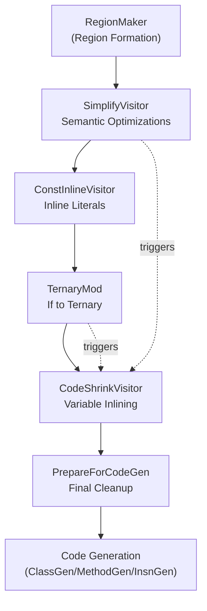
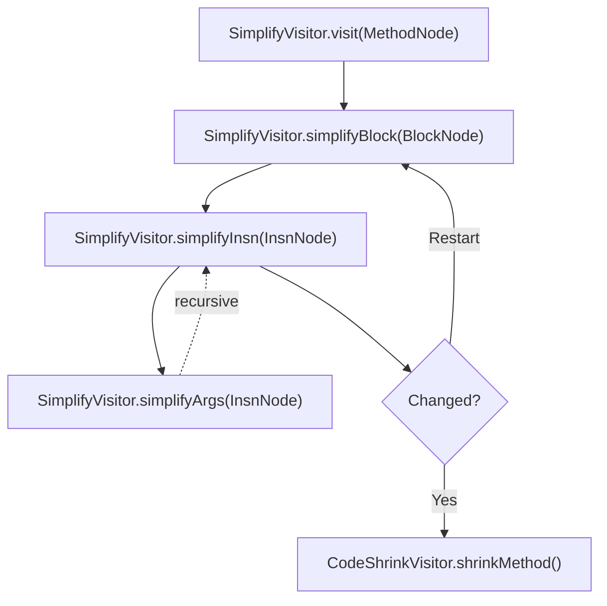
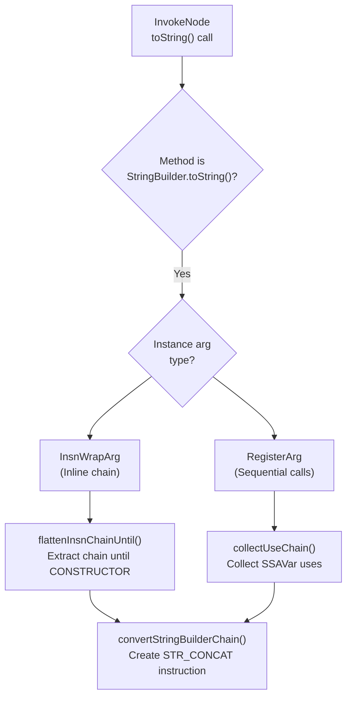

# Instruction Simplification

Relevant source files

The following files were used as context for generating this wiki page:

- [jadx-core/src/main/java/jadx/api/impl/SimpleCodeWriter.java](https://github.com/skylot/jadx/blob/HEAD/jadx-core/src/main/java/jadx/api/impl/SimpleCodeWriter.java)
- [jadx-core/src/main/java/jadx/core/codegen/ConditionGen.java](https://github.com/skylot/jadx/blob/HEAD/jadx-core/src/main/java/jadx/core/codegen/ConditionGen.java)
- [jadx-core/src/main/java/jadx/core/dex/attributes/nodes/MethodInlineAttr.java](https://github.com/skylot/jadx/blob/HEAD/jadx-core/src/main/java/jadx/core/dex/attributes/nodes/MethodInlineAttr.java)
- [jadx-core/src/main/java/jadx/core/dex/instructions/args/InsnArg.java](https://github.com/skylot/jadx/blob/HEAD/jadx-core/src/main/java/jadx/core/dex/instructions/args/InsnArg.java)
- [jadx-core/src/main/java/jadx/core/dex/instructions/args/InsnWrapArg.java](https://github.com/skylot/jadx/blob/HEAD/jadx-core/src/main/java/jadx/core/dex/instructions/args/InsnWrapArg.java)
- [jadx-core/src/main/java/jadx/core/dex/instructions/mods/TernaryInsn.java](https://github.com/skylot/jadx/blob/HEAD/jadx-core/src/main/java/jadx/core/dex/instructions/mods/TernaryInsn.java)
- [jadx-core/src/main/java/jadx/core/dex/nodes/InsnNode.java](https://github.com/skylot/jadx/blob/HEAD/jadx-core/src/main/java/jadx/core/dex/nodes/InsnNode.java)
- [jadx-core/src/main/java/jadx/core/dex/regions/conditions/IfCondition.java](https://github.com/skylot/jadx/blob/HEAD/jadx-core/src/main/java/jadx/core/dex/regions/conditions/IfCondition.java)
- [jadx-core/src/main/java/jadx/core/dex/regions/conditions/IfRegion.java](https://github.com/skylot/jadx/blob/HEAD/jadx-core/src/main/java/jadx/core/dex/regions/conditions/IfRegion.java)
- [jadx-core/src/main/java/jadx/core/dex/visitors/ConstInlineVisitor.java](https://github.com/skylot/jadx/blob/HEAD/jadx-core/src/main/java/jadx/core/dex/visitors/ConstInlineVisitor.java)
- [jadx-core/src/main/java/jadx/core/dex/visitors/InlineMethods.java](https://github.com/skylot/jadx/blob/HEAD/jadx-core/src/main/java/jadx/core/dex/visitors/InlineMethods.java)
- [jadx-core/src/main/java/jadx/core/dex/visitors/MarkMethodsForInline.java](https://github.com/skylot/jadx/blob/HEAD/jadx-core/src/main/java/jadx/core/dex/visitors/MarkMethodsForInline.java)
- [jadx-core/src/main/java/jadx/core/dex/visitors/PrepareForCodeGen.java](https://github.com/skylot/jadx/blob/HEAD/jadx-core/src/main/java/jadx/core/dex/visitors/PrepareForCodeGen.java)
- [jadx-core/src/main/java/jadx/core/dex/visitors/SimplifyVisitor.java](https://github.com/skylot/jadx/blob/HEAD/jadx-core/src/main/java/jadx/core/dex/visitors/SimplifyVisitor.java)
- [jadx-core/src/main/java/jadx/core/dex/visitors/regions/TernaryMod.java](https://github.com/skylot/jadx/blob/HEAD/jadx-core/src/main/java/jadx/core/dex/visitors/regions/TernaryMod.java)
- [jadx-core/src/main/java/jadx/core/dex/visitors/shrink/ArgsInfo.java](https://github.com/skylot/jadx/blob/HEAD/jadx-core/src/main/java/jadx/core/dex/visitors/shrink/ArgsInfo.java)
- [jadx-core/src/main/java/jadx/core/dex/visitors/shrink/CodeShrinkVisitor.java](https://github.com/skylot/jadx/blob/HEAD/jadx-core/src/main/java/jadx/core/dex/visitors/shrink/CodeShrinkVisitor.java)
- [jadx-core/src/main/java/jadx/core/utils/DebugChecks.java](https://github.com/skylot/jadx/blob/HEAD/jadx-core/src/main/java/jadx/core/utils/DebugChecks.java)
- [jadx-core/src/main/java/jadx/core/utils/InsnRemover.java](https://github.com/skylot/jadx/blob/HEAD/jadx-core/src/main/java/jadx/core/utils/InsnRemover.java)
- [jadx-core/src/test/java/jadx/tests/integration/code/TestArrayAccessReorder.java](https://github.com/skylot/jadx/blob/HEAD/jadx-core/src/test/java/jadx/tests/integration/code/TestArrayAccessReorder.java)
- [jadx-core/src/test/java/jadx/tests/integration/conditions/TestBitwiseAnd.java](https://github.com/skylot/jadx/blob/HEAD/jadx-core/src/test/java/jadx/tests/integration/conditions/TestBitwiseAnd.java)
- [jadx-core/src/test/java/jadx/tests/integration/conditions/TestBitwiseOr.java](https://github.com/skylot/jadx/blob/HEAD/jadx-core/src/test/java/jadx/tests/integration/conditions/TestBitwiseOr.java)
- [jadx-core/src/test/java/jadx/tests/integration/conditions/TestConditions14.java](https://github.com/skylot/jadx/blob/HEAD/jadx-core/src/test/java/jadx/tests/integration/conditions/TestConditions14.java)
- [jadx-core/src/test/java/jadx/tests/integration/conditions/TestConditions17.java](https://github.com/skylot/jadx/blob/HEAD/jadx-core/src/test/java/jadx/tests/integration/conditions/TestConditions17.java)
- [jadx-core/src/test/java/jadx/tests/integration/conditions/TestConditions18.java](https://github.com/skylot/jadx/blob/HEAD/jadx-core/src/test/java/jadx/tests/integration/conditions/TestConditions18.java)
- [jadx-core/src/test/java/jadx/tests/integration/conditions/TestConditions21.java](https://github.com/skylot/jadx/blob/HEAD/jadx-core/src/test/java/jadx/tests/integration/conditions/TestConditions21.java)
- [jadx-core/src/test/java/jadx/tests/integration/conditions/TestTernaryInIf.java](https://github.com/skylot/jadx/blob/HEAD/jadx-core/src/test/java/jadx/tests/integration/conditions/TestTernaryInIf.java)
- [jadx-core/src/test/java/jadx/tests/integration/conditions/TestTernaryInIf2.java](https://github.com/skylot/jadx/blob/HEAD/jadx-core/src/test/java/jadx/tests/integration/conditions/TestTernaryInIf2.java)
- [jadx-core/src/test/java/jadx/tests/integration/invoke/TestCastInOverloadedAccessor.java](https://github.com/skylot/jadx/blob/HEAD/jadx-core/src/test/java/jadx/tests/integration/invoke/TestCastInOverloadedAccessor.java)
- [jadx-core/src/test/java/jadx/tests/integration/others/TestFieldAccessReorder.java](https://github.com/skylot/jadx/blob/HEAD/jadx-core/src/test/java/jadx/tests/integration/others/TestFieldAccessReorder.java)
- [jadx-core/src/test/java/jadx/tests/integration/special/TestPackageInfoSupport.java](https://github.com/skylot/jadx/blob/HEAD/jadx-core/src/test/java/jadx/tests/integration/special/TestPackageInfoSupport.java)
- [jadx-core/src/test/java/jadx/tests/integration/variables/TestVariables8.java](https://github.com/skylot/jadx/blob/HEAD/jadx-core/src/test/java/jadx/tests/integration/variables/TestVariables8.java)
- [jadx-core/src/test/smali/conditions/TestConditions18.smali](https://github.com/skylot/jadx/blob/HEAD/jadx-core/src/test/smali/conditions/TestConditions18.smali)
- [jadx-core/src/test/smali/conditions/TestConditions21.smali](https://github.com/skylot/jadx/blob/HEAD/jadx-core/src/test/smali/conditions/TestConditions21.smali)
- [jadx-core/src/test/smali/conditions/TestTernaryInIf2.smali](https://github.com/skylot/jadx/blob/HEAD/jadx-core/src/test/smali/conditions/TestTernaryInIf2.smali)
- [jadx-core/src/test/smali/special/TestPackageInfoSupport/pkg1.smali](https://github.com/skylot/jadx/blob/HEAD/jadx-core/src/test/smali/special/TestPackageInfoSupport/pkg1.smali)
- [jadx-core/src/test/smali/special/TestPackageInfoSupport/pkg2.smali](https://github.com/skylot/jadx/blob/HEAD/jadx-core/src/test/smali/special/TestPackageInfoSupport/pkg2.smali)
- [jadx-core/src/test/smali/special/TestPackageInfoSupport/pkg3.smali](https://github.com/skylot/jadx/blob/HEAD/jadx-core/src/test/smali/special/TestPackageInfoSupport/pkg3.smali)
- [jadx-core/src/test/smali/variables/TestVariables8.smali](https://github.com/skylot/jadx/blob/HEAD/jadx-core/src/test/smali/variables/TestVariables8.smali)
- [jadx-gui/src/main/java/jadx/gui/device/debugger/smali/SmaliWriter.java](https://github.com/skylot/jadx/blob/HEAD/jadx-gui/src/main/java/jadx/gui/device/debugger/smali/SmaliWriter.java)

This page documents the instruction simplification subsystem in JADX's decompilation pipeline. Simplification optimizes and transforms intermediate representation (IR) instructions to produce more readable Java code. This occurs after region formation (see [Region Formation](https://github.com/skylot/jadx/blob/HEAD/2.4)) and before code generation (see [Code Generation](https://github.com/skylot/jadx/blob/HEAD/2.6)).

The simplification process consists of several key passes:
1. **SimplifyVisitor**: Performs semantic optimizations, pattern-based transformations (like `StringBuilder` conversion), and field arithmetic merging.
2. **ConstInlineVisitor**: Inlines constant values and strings into their usage sites.
3. **CodeShrinkVisitor**: Inlines variables and removes dead code to make the IR more compact.
4. **TernaryMod**: Converts `if-else` regions into ternary operations (`? :`).
5. **PrepareForCodeGen**: Final cleanup and preparation immediately before code generation.

## Simplification Pipeline

The following diagram shows when and how instruction simplification fits into the decompilation pipeline:

**Pipeline Flow**: `SimplifyVisitor` processes instructions iteratively. When transformations are made or the `AFlag.REQUEST_CODE_SHRINK` flag is set, `CodeShrinkVisitor.shrinkMethod()` runs to remove dead code and inline variables [jadx-core/src/main/java/jadx/core/dex/visitors/SimplifyVisitor.java:75-77](https://github.com/skylot/jadx/blob/HEAD/jadx-core/src/main/java/jadx/core/dex/visitors/SimplifyVisitor.java#L75-L77). `PrepareForCodeGen` executes as the final pass after variable processing is complete [jadx-core/src/main/java/jadx/core/dex/visitors/PrepareForCodeGen.java:55-59](https://github.com/skylot/jadx/blob/HEAD/jadx-core/src/main/java/jadx/core/dex/visitors/PrepareForCodeGen.java#L55-L59).

Sources: [jadx-core/src/main/java/jadx/core/dex/visitors/SimplifyVisitor.java:48-78](https://github.com/skylot/jadx/blob/HEAD/jadx-core/src/main/java/jadx/core/dex/visitors/SimplifyVisitor.java#L48-L78), [jadx-core/src/main/java/jadx/core/dex/visitors/shrink/CodeShrinkVisitor.java:30-42](https://github.com/skylot/jadx/blob/HEAD/jadx-core/src/main/java/jadx/core/dex/visitors/shrink/CodeShrinkVisitor.java#L30-L42), [jadx-core/src/main/java/jadx/core/dex/visitors/ConstInlineVisitor.java:40-48](https://github.com/skylot/jadx/blob/HEAD/jadx-core/src/main/java/jadx/core/dex/visitors/ConstInlineVisitor.java#L40-L48), [jadx-core/src/main/java/jadx/core/dex/visitors/regions/TernaryMod.java:29-46](https://github.com/skylot/jadx/blob/HEAD/jadx-core/src/main/java/jadx/core/dex/visitors/regions/TernaryMod.java#L29-L46), [jadx-core/src/main/java/jadx/core/dex/visitors/PrepareForCodeGen.java:50-60](https://github.com/skylot/jadx/blob/HEAD/jadx-core/src/main/java/jadx/core/dex/visitors/PrepareForCodeGen.java#L50-L60)

## SimplifyVisitor

`SimplifyVisitor` is the primary optimization pass that performs semantic transformations on instructions. It operates on a per-method basis, processing each `BlockNode`'s instructions [jadx-core/src/main/java/jadx/core/dex/visitors/SimplifyVisitor.java:70-74](https://github.com/skylot/jadx/blob/HEAD/jadx-core/src/main/java/jadx/core/dex/visitors/SimplifyVisitor.java#L70-L74).

### Visitor Entry Point

The visitor iterates through all basic blocks in a method, applying simplifications until convergence:

**Iterative Processing**: The visitor processes instructions in a block via `simplifyBlock`. If an instruction is modified, it rebinds arguments and may restart block processing if instructions were removed to catch new simplification opportunities [jadx-core/src/main/java/jadx/core/dex/visitors/SimplifyVisitor.java:80-108](https://github.com/skylot/jadx/blob/HEAD/jadx-core/src/main/java/jadx/core/dex/visitors/SimplifyVisitor.java#L80-L108).

Sources: [jadx-core/src/main/java/jadx/core/dex/visitors/SimplifyVisitor.java:64-107](https://github.com/skylot/jadx/blob/HEAD/jadx-core/src/main/java/jadx/core/dex/visitors/SimplifyVisitor.java#L64-L107)

### Instruction Type Dispatch

`SimplifyVisitor.simplifyInsn()` dispatches to specialized handlers based on `InsnType` [jadx-core/src/main/java/jadx/core/dex/visitors/SimplifyVisitor.java:133-171](https://github.com/skylot/jadx/blob/HEAD/jadx-core/src/main/java/jadx/core/dex/visitors/SimplifyVisitor.java#L133-L171):

| Instruction Type | Handler Method | Transformation |
|-----------------|----------------|----------------|
| `ARITH` | `simplifyArith()` | Arithmetic optimizations (e.g., XOR, negative addition) |
| `IF` | `simplifyIf()` | Condition simplification (e.g., comparison to zero) |
| `TERNARY` | `simplifyTernary()` | Ternary condition simplification |
| `INVOKE` | `convertInvoke()` | StringBuilder chain conversion |
| `IPUT`, `SPUT` | `convertFieldArith()` | Field arithmetic to compound assignment (`+=`, etc.) |
| `CAST`, `CHECK_CAST` | `processCast()` | Unnecessary cast removal |
| `MOVE` | inline | Convert `MOVE` with literal to `CONST` [jadx-core/src/main/java/jadx/core/dex/visitors/SimplifyVisitor.java:155-164](https://github.com/skylot/jadx/blob/HEAD/jadx-core/src/main/java/jadx/core/dex/visitors/SimplifyVisitor.java#L155-L164) |
| `CONSTRUCTOR` | `simplifyStringConstructor()` | String constructor optimization from byte/char arrays |

Sources: [jadx-core/src/main/java/jadx/core/dex/visitors/SimplifyVisitor.java:128-173](https://github.com/skylot/jadx/blob/HEAD/jadx-core/src/main/java/jadx/core/dex/visitors/SimplifyVisitor.java#L128-L173)

## CodeShrinkVisitor

`CodeShrinkVisitor` is responsible for variable inlining to reduce the number of temporary registers and produce cleaner code.

### Inlining Logic
The visitor checks if an `SSAVar` can be safely inlined into its usage site.
- **Single Use**: Generally inlines if the variable is used only once [jadx-core/src/main/java/jadx/core/dex/visitors/shrink/CodeShrinkVisitor.java:111-113](https://github.com/skylot/jadx/blob/HEAD/jadx-core/src/main/java/jadx/core/dex/visitors/shrink/CodeShrinkVisitor.java#L111-L113).
- **Forced Inline**: Inlines if `AFlag.FORCE_ASSIGN_INLINE` is present [jadx-core/src/main/java/jadx/core/dex/visitors/shrink/CodeShrinkVisitor.java:95](https://github.com/skylot/jadx/blob/HEAD/jadx-core/src/main/java/jadx/core/dex/visitors/shrink/CodeShrinkVisitor.java#L95).
- **Constraints**: It forbids inlining lambda expressions as instance arguments (e.g., `(() -> {}).run()`) to maintain valid Java syntax [jadx-core/src/main/java/jadx/core/dex/visitors/shrink/CodeShrinkVisitor.java:153-167](https://github.com/skylot/jadx/blob/HEAD/jadx-core/src/main/java/jadx/core/dex/visitors/shrink/CodeShrinkVisitor.java#L153-L167).
- **Metadata Inheritance**: When inlining, the parent instruction inherits metadata from the inlined instruction [jadx-core/src/main/java/jadx/core/dex/visitors/shrink/CodeShrinkVisitor.java:215-218](https://github.com/skylot/jadx/blob/HEAD/jadx-core/src/main/java/jadx/core/dex/visitors/shrink/CodeShrinkVisitor.java#L215-L218).

Sources: [jadx-core/src/main/java/jadx/core/dex/visitors/shrink/CodeShrinkVisitor.java:78-147](https://github.com/skylot/jadx/blob/HEAD/jadx-core/src/main/java/jadx/core/dex/visitors/shrink/CodeShrinkVisitor.java#L78-L147), [jadx-core/src/main/java/jadx/core/dex/visitors/shrink/CodeShrinkVisitor.java:207-220](https://github.com/skylot/jadx/blob/HEAD/jadx-core/src/main/java/jadx/core/dex/visitors/shrink/CodeShrinkVisitor.java#L207-L220)

## Ternary Operation Modification

`TernaryMod` transforms `IfRegion` structures into `TernaryInsn` nodes.

### Transformation Conditions
1. **Branch Content**: Both "then" and "else" branches must contain exactly one instruction [jadx-core/src/main/java/jadx/core/dex/visitors/regions/TernaryMod.java:213-215](https://github.com/skylot/jadx/blob/HEAD/jadx-core/src/main/java/jadx/core/dex/visitors/regions/TernaryMod.java#L213-L215).
2. **Phi Integration**: The results of both branches must feed into the same `PhiInsn` [jadx-core/src/main/java/jadx/core/dex/visitors/regions/TernaryMod.java:108-112](https://github.com/skylot/jadx/blob/HEAD/jadx-core/src/main/java/jadx/core/dex/visitors/regions/TernaryMod.java#L108-L112).
3. **Return Pattern**: It also handles ternary returns, where an `if-else` returns two different values [jadx-core/src/main/java/jadx/core/dex/visitors/regions/TernaryMod.java:148-180](https://github.com/skylot/jadx/blob/HEAD/jadx-core/src/main/java/jadx/core/dex/visitors/regions/TernaryMod.java#L148-L180).
4. **Source Lines**: It attempts to merge source line information from branches into the resulting ternary instruction [jadx-core/src/main/java/jadx/core/dex/visitors/regions/TernaryMod.java:129-130](https://github.com/skylot/jadx/blob/HEAD/jadx-core/src/main/java/jadx/core/dex/visitors/regions/TernaryMod.java#L129-L130).

Sources: [jadx-core/src/main/java/jadx/core/dex/visitors/regions/TernaryMod.java:72-181](https://github.com/skylot/jadx/blob/HEAD/jadx-core/src/main/java/jadx/core/dex/visitors/regions/TernaryMod.java#L72-L181)

## StringBuilder Chain Conversion

`SimplifyVisitor` converts `StringBuilder` chains back to Java string concatenation (`STR_CONCAT`).

### Pattern Detection

The visitor detects patterns where a `StringBuilder` is initialized, appended to, and finally converted to a string via `toString()`.

**Chain Extraction**: For inline chains, `flattenInsnChainUntil()` walks backward through wrapped instructions until reaching the `CONSTRUCTOR` node. For sequential calls, `collectUseChain()` follows SSA variable uses.

Sources: [jadx-core/src/main/java/jadx/core/dex/visitors/SimplifyVisitor.java:305-367](https://github.com/skylot/jadx/blob/HEAD/jadx-core/src/main/java/jadx/core/dex/visitors/SimplifyVisitor.java#L305-L367), [jadx-core/src/main/java/jadx/core/dex/visitors/SimplifyVisitor.java:487-522](https://github.com/skylot/jadx/blob/HEAD/jadx-core/src/main/java/jadx/core/dex/visitors/SimplifyVisitor.java#L487-L522)

## Cast Removal

`SimplifyVisitor.processCast()` removes unnecessary cast operations. A cast is considered unnecessary if:

1. **Type system doesn't require it**: Based on `ArgType.isCastNeeded()`.
2. **Duplicate cast**: The source value is already cast to the same type [jadx-core/src/main/java/jadx/core/dex/visitors/SimplifyVisitor.java:237-251](https://github.com/skylot/jadx/blob/HEAD/jadx-core/src/main/java/jadx/core/dex/visitors/SimplifyVisitor.java#L237-L251).
3. **Shadowed by outer cast**: A parent instruction casts to a narrower type [jadx-core/src/main/java/jadx/core/dex/visitors/SimplifyVisitor.java:254-266](https://github.com/skylot/jadx/blob/HEAD/jadx-core/src/main/java/jadx/core/dex/visitors/SimplifyVisitor.java#L254-L266).

Sources: [jadx-core/src/main/java/jadx/core/dex/visitors/SimplifyVisitor.java:218-286](https://github.com/skylot/jadx/blob/HEAD/jadx-core/src/main/java/jadx/core/dex/visitors/SimplifyVisitor.java#L218-L286)

## Preparation for Code Generation

`PrepareForCodeGen` performs final cleanup before the code generator runs. This pass often breaks register dependencies, so it must run last [jadx-core/src/main/java/jadx/core/dex/visitors/PrepareForCodeGen.java:50-54](https://github.com/skylot/jadx/blob/HEAD/jadx-core/src/main/java/jadx/core/dex/visitors/PrepareForCodeGen.java#L50-L54).

### Key Transformations
- **Instruction Removal**: Removes `NOP`, `MONITOR_ENTER/EXIT`, and redundant `MOVE` instructions (e.g., `a = a`) [jadx-core/src/main/java/jadx/core/dex/visitors/PrepareForCodeGen.java:96-128](https://github.com/skylot/jadx/blob/HEAD/jadx-core/src/main/java/jadx/core/dex/visitors/PrepareForCodeGen.java#L96-L128).
- **Arithmetic Shortening**: Replaces arithmetic operations with short forms like `a += 2` [jadx-core/src/main/java/jadx/core/dex/visitors/PrepareForCodeGen.java:229-235](https://github.com/skylot/jadx/blob/HEAD/jadx-core/src/main/java/jadx/core/dex/visitors/PrepareForCodeGen.java#L229-L235).
- **Parenthesis Removal**: Removes unnecessary parentheses for wrapped arithmetic instructions (e.g., `(a + b) + c` -> `a + b + c`) [jadx-core/src/main/java/jadx/core/dex/visitors/PrepareForCodeGen.java:187-202](https://github.com/skylot/jadx/blob/HEAD/jadx-core/src/main/java/jadx/core/dex/visitors/PrepareForCodeGen.java#L187-L202).
- **Explicit Type Hints**: Adds `AFlag.EXPLICIT_PRIMITIVE_TYPE` to literals that are not `INT` to ensure correct literal suffixes in generated code [jadx-core/src/main/java/jadx/core/dex/visitors/PrepareForCodeGen.java:148-161](https://github.com/skylot/jadx/blob/HEAD/jadx-core/src/main/java/jadx/core/dex/visitors/PrepareForCodeGen.java#L148-L161).

### Condition Simplification
`IfCondition.simplify()` is used to normalize complex boolean expressions, such as inverting `!(a != b)` to `a == b` or merging nested logical operations [jadx-core/src/main/java/jadx/core/dex/regions/conditions/IfCondition.java:152-204](https://github.com/skylot/jadx/blob/HEAD/jadx-core/src/main/java/jadx/core/dex/regions/conditions/IfCondition.java#L152-L204).

Sources: [jadx-core/src/main/java/jadx/core/dex/visitors/PrepareForCodeGen.java:77-94](https://github.com/skylot/jadx/blob/HEAD/jadx-core/src/main/java/jadx/core/dex/visitors/PrepareForCodeGen.java#L77-L94), [jadx-core/src/main/java/jadx/core/dex/regions/conditions/IfCondition.java:152-204](https://github.com/skylot/jadx/blob/HEAD/jadx-core/src/main/java/jadx/core/dex/regions/conditions/IfCondition.java#L152-L204), [jadx-core/src/main/java/jadx/core/utils/InsnRemover.java:91-133](https://github.com/skylot/jadx/blob/HEAD/jadx-core/src/main/java/jadx/core/utils/InsnRemover.java#L91-L133), [jadx-core/src/main/java/jadx/core/dex/visitors/shrink/CodeShrinkVisitor.java:243-264](https://github.com/skylot/jadx/blob/HEAD/jadx-core/src/main/java/jadx/core/dex/visitors/shrink/CodeShrinkVisitor.java#L243-L264)