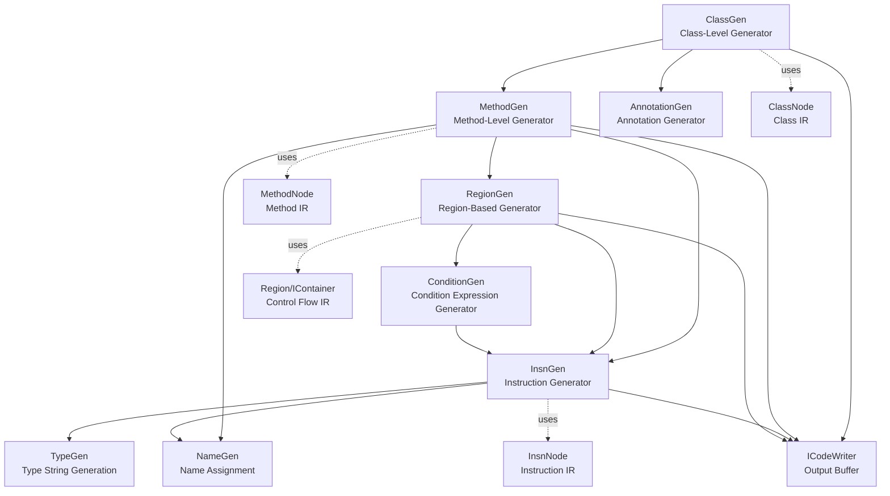
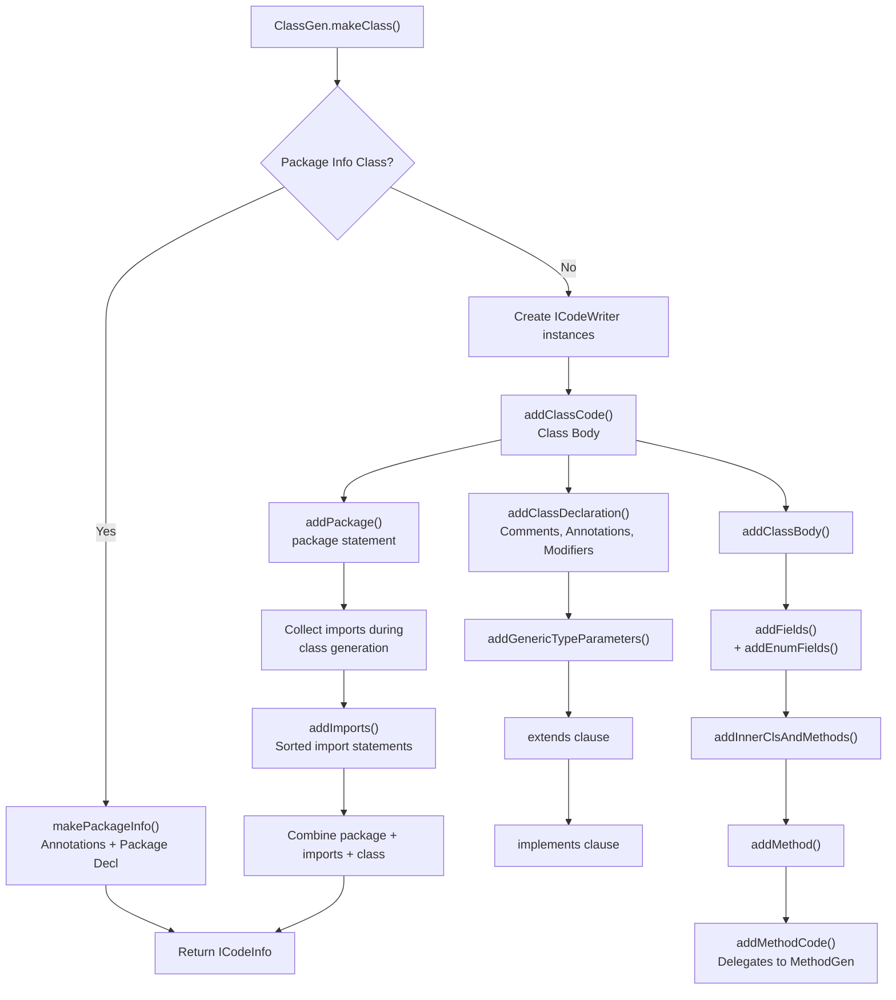
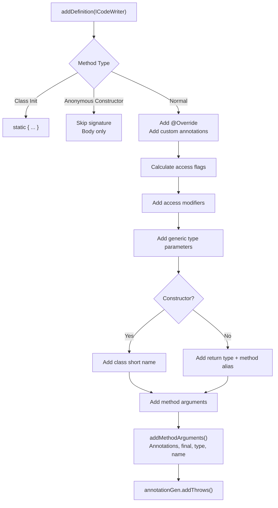
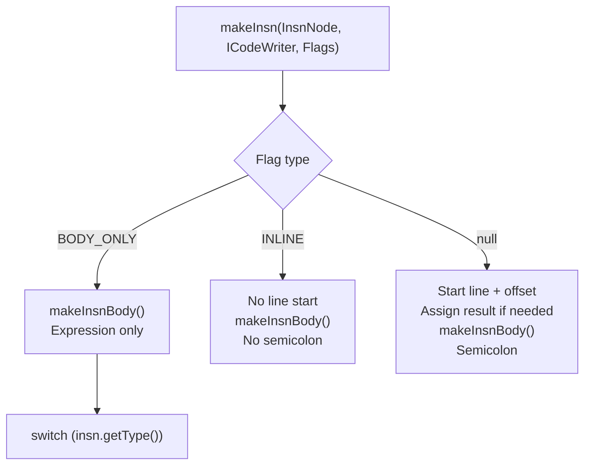
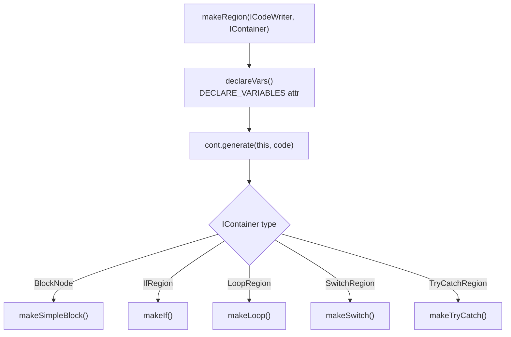
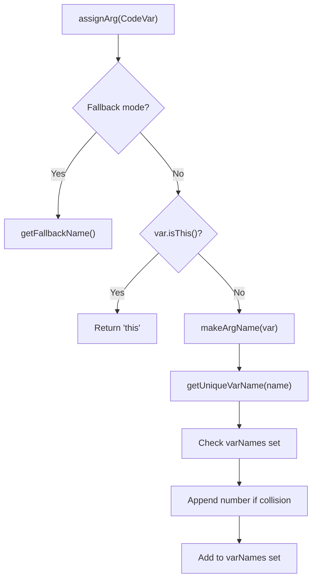

# Code Generation

Relevant source files

The following files were used as context for generating this wiki page:

- [jadx-core/src/main/java/jadx/core/Jadx.java](https://github.com/skylot/jadx/blob/HEAD/jadx-core/src/main/java/jadx/core/Jadx.java)
- [jadx-core/src/main/java/jadx/core/codegen/AnnotationGen.java](https://github.com/skylot/jadx/blob/HEAD/jadx-core/src/main/java/jadx/core/codegen/AnnotationGen.java)
- [jadx-core/src/main/java/jadx/core/codegen/ClassGen.java](https://github.com/skylot/jadx/blob/HEAD/jadx-core/src/main/java/jadx/core/codegen/ClassGen.java)
- [jadx-core/src/main/java/jadx/core/codegen/InsnGen.java](https://github.com/skylot/jadx/blob/HEAD/jadx-core/src/main/java/jadx/core/codegen/InsnGen.java)
- [jadx-core/src/main/java/jadx/core/codegen/MethodGen.java](https://github.com/skylot/jadx/blob/HEAD/jadx-core/src/main/java/jadx/core/codegen/MethodGen.java)
- [jadx-core/src/main/java/jadx/core/codegen/NameGen.java](https://github.com/skylot/jadx/blob/HEAD/jadx-core/src/main/java/jadx/core/codegen/NameGen.java)
- [jadx-core/src/main/java/jadx/core/codegen/RegionGen.java](https://github.com/skylot/jadx/blob/HEAD/jadx-core/src/main/java/jadx/core/codegen/RegionGen.java)
- [jadx-core/src/main/java/jadx/core/codegen/TypeGen.java](https://github.com/skylot/jadx/blob/HEAD/jadx-core/src/main/java/jadx/core/codegen/TypeGen.java)
- [jadx-core/src/main/java/jadx/core/dex/instructions/args/LiteralArg.java](https://github.com/skylot/jadx/blob/HEAD/jadx-core/src/main/java/jadx/core/dex/instructions/args/LiteralArg.java)
- [jadx-core/src/main/java/jadx/core/dex/nodes/MethodNode.java](https://github.com/skylot/jadx/blob/HEAD/jadx-core/src/main/java/jadx/core/dex/nodes/MethodNode.java)
- [jadx-core/src/main/java/jadx/core/dex/visitors/ClassModifier.java](https://github.com/skylot/jadx/blob/HEAD/jadx-core/src/main/java/jadx/core/dex/visitors/ClassModifier.java)
- [jadx-core/src/main/java/jadx/core/dex/visitors/ModVisitor.java](https://github.com/skylot/jadx/blob/HEAD/jadx-core/src/main/java/jadx/core/dex/visitors/ModVisitor.java)
- [jadx-core/src/main/java/jadx/core/dex/visitors/SaveCode.java](https://github.com/skylot/jadx/blob/HEAD/jadx-core/src/main/java/jadx/core/dex/visitors/SaveCode.java)
- [jadx-core/src/test/java/jadx/tests/integration/arith/TestNumbersFormat.java](https://github.com/skylot/jadx/blob/HEAD/jadx-core/src/test/java/jadx/tests/integration/arith/TestNumbersFormat.java)
- [jadx-core/src/test/java/jadx/tests/integration/arith/TestSpecialValues.java](https://github.com/skylot/jadx/blob/HEAD/jadx-core/src/test/java/jadx/tests/integration/arith/TestSpecialValues.java)
- [jadx-core/src/test/java/jadx/tests/integration/arith/TestSpecialValues2.java](https://github.com/skylot/jadx/blob/HEAD/jadx-core/src/test/java/jadx/tests/integration/arith/TestSpecialValues2.java)
- [jadx-core/src/test/java/jadx/tests/integration/conditions/TestCast.java](https://github.com/skylot/jadx/blob/HEAD/jadx-core/src/test/java/jadx/tests/integration/conditions/TestCast.java)
- [jadx-core/src/test/java/jadx/tests/integration/types/TestTypeResolver9.java](https://github.com/skylot/jadx/blob/HEAD/jadx-core/src/test/java/jadx/tests/integration/types/TestTypeResolver9.java)

The Code Generation subsystem transforms JADX's intermediate representation (IR) into human-readable Java source code. This is the final stage of the decompilation pipeline, occurring after all analysis, optimization, and region formation passes have completed. The system produces syntactically correct Java code with proper formatting, imports, annotations, and metadata attachments for IDE integration.

For information about the preceding IR transformation stages, see [Decompilation Pipeline](06_2.2-decompilation-pipeline.md), [Control Flow Analysis](07_2.3-control-flow-analysis.md), [Region Formation](08_2.4-region-formation.md), and [Instruction Simplification](09_2.5-instruction-simplification.md). For type-related IR processing, see [Type System and Inference](11_2.7-type-system-and-inference.md).

## Hierarchical Generator Architecture

The code generation system follows a hierarchical, top-down architecture where each generator is responsible for a specific scope level. Generators delegate to lower-level generators to produce complete code.

**Generator Hierarchy Diagram**

Sources: [jadx-core/src/main/java/jadx/core/codegen/ClassGen.java:56-93](https://github.com/skylot/jadx/blob/HEAD/jadx-core/src/main/java/jadx/core/codegen/ClassGen.java#L56-L93), [jadx-core/src/main/java/jadx/core/codegen/MethodGen.java:54-80](https://github.com/skylot/jadx/blob/HEAD/jadx-core/src/main/java/jadx/core/codegen/MethodGen.java#L54-L80), [jadx-core/src/main/java/jadx/core/codegen/InsnGen.java:70-89](https://github.com/skylot/jadx/blob/HEAD/jadx-core/src/main/java/jadx/core/codegen/InsnGen.java#L70-L89), [jadx-core/src/main/java/jadx/core/codegen/RegionGen.java:57-62](https://github.com/skylot/jadx/blob/HEAD/jadx-core/src/main/java/jadx/core/codegen/RegionGen.java#L57-L62)

### Generator Instantiation and Delegation

Each generator maintains references to its parent generator and the core IR node it operates on:

| Generator | Parent | Core IR Node | Primary Responsibility |
|-----------|--------|--------------|------------------------|
| `ClassGen` | `ClassGen` (for inner classes) or `null` | `ClassNode` | Package, imports, class declaration, fields, methods |
| `MethodGen` | `ClassGen` | `MethodNode` | Method signature, argument list, body generation mode |
| `InsnGen` | `MethodGen` | N/A (processes many `InsnNode`) | Individual instruction code generation |
| `RegionGen` | `MethodGen` | N/A (processes `IContainer`) | Control flow structures (if/loop/switch/try-catch) |
| `NameGen` | `ClassGen` | `MethodNode` | Variable naming and collision avoidance |

Sources: [jadx-core/src/main/java/jadx/core/codegen/ClassGen.java:78-93](https://github.com/skylot/jadx/blob/HEAD/jadx-core/src/main/java/jadx/core/codegen/ClassGen.java#L78-L93), [jadx-core/src/main/java/jadx/core/codegen/MethodGen.java:62-67](https://github.com/skylot/jadx/blob/HEAD/jadx-core/src/main/java/jadx/core/codegen/MethodGen.java#L62-L67), [jadx-core/src/main/java/jadx/core/codegen/InsnGen.java:84-89](https://github.com/skylot/jadx/blob/HEAD/jadx-core/src/main/java/jadx/core/codegen/InsnGen.java#L84-L89), [jadx-core/src/main/java/jadx/core/codegen/RegionGen.java:60-62](https://github.com/skylot/jadx/blob/HEAD/jadx-core/src/main/java/jadx/core/codegen/RegionGen.java#L60-L62), [jadx-core/src/main/java/jadx/core/codegen/NameGen.java:17-30](https://github.com/skylot/jadx/blob/HEAD/jadx-core/src/main/java/jadx/core/codegen/NameGen.java#L17-L30)

## Class Code Generation (ClassGen)

`ClassGen` is the top-level generator responsible for producing complete class source files.

### Class Generation Flow

Sources: [jadx-core/src/main/java/jadx/core/codegen/ClassGen.java:99-112](https://github.com/skylot/jadx/blob/HEAD/jadx-core/src/main/java/jadx/core/codegen/ClassGen.java#L99-L112), [jadx-core/src/main/java/jadx/core/codegen/ClassGen.java:114-150](https://github.com/skylot/jadx/blob/HEAD/jadx-core/src/main/java/jadx/core/codegen/ClassGen.java#L114-L150), [jadx-core/src/main/java/jadx/core/codegen/ClassGen.java:152-161](https://github.com/skylot/jadx/blob/HEAD/jadx-core/src/main/java/jadx/core/codegen/ClassGen.java#L152-L161), [jadx-core/src/main/java/jadx/core/codegen/ClassGen.java:163-221](https://github.com/skylot/jadx/blob/HEAD/jadx-core/src/main/java/jadx/core/codegen/ClassGen.java#L163-L221)

### Import Management

`ClassGen` tracks which classes are referenced via the `imports` set and automatically generates import statements. The system uses short class names when possible and full names when conflicts exist. Referenced classes are added to the `imports` set via `useClass` and `useType` methods.

Sources: [jadx-core/src/main/java/jadx/core/codegen/ClassGen.java:66-68](https://github.com/skylot/jadx/blob/HEAD/jadx-core/src/main/java/jadx/core/codegen/ClassGen.java#L66-L68), [jadx-core/src/main/java/jadx/core/codegen/ClassGen.java:122-139](https://github.com/skylot/jadx/blob/HEAD/jadx-core/src/main/java/jadx/core/codegen/ClassGen.java#L122-L139), [jadx-core/src/main/java/jadx/core/codegen/ClassGen.java:512-540](https://github.com/skylot/jadx/blob/HEAD/jadx-core/src/main/java/jadx/core/codegen/ClassGen.java#L512-L540)

## Method Code Generation (MethodGen)

`MethodGen` handles method-level code generation, including method signatures and coordinating body generation.

### Method Signature Generation

Sources: [jadx-core/src/main/java/jadx/core/codegen/MethodGen.java:81-164](https://github.com/skylot/jadx/blob/HEAD/jadx-core/src/main/java/jadx/core/codegen/MethodGen.java#L81-L164), [jadx-core/src/main/java/jadx/core/codegen/MethodGen.java:193-210](https://github.com/skylot/jadx/blob/HEAD/jadx-core/src/main/java/jadx/core/codegen/MethodGen.java#L193-L210)

### Method Body Generation Modes

`MethodGen` supports multiple code generation modes depending on the decompiler state:

| Mode | Trigger | Generator | Description |
|------|---------|-----------|-------------|
| **RESTRUCTURE** | Default mode, `mth.getRegion() != null` | `RegionGen` | Hierarchical control flow using regions. |
| **FALLBACK** | Errors or explicit mode | `InsnGen` (fallback=true) | Raw instruction dump with labels. |

Sources: [jadx-core/src/main/java/jadx/core/codegen/MethodGen.java:269-300](https://github.com/skylot/jadx/blob/HEAD/jadx-core/src/main/java/jadx/core/codegen/MethodGen.java#L269-L300), [jadx-core/src/main/java/jadx/core/codegen/MethodGen.java:390-434](https://github.com/skylot/jadx/blob/HEAD/jadx-core/src/main/java/jadx/core/codegen/MethodGen.java#L390-L434)

## Instruction Code Generation (InsnGen)

`InsnGen` is the core generator for individual instructions. It handles all instruction types and produces the corresponding Java expressions.

### Instruction Generation Entry Points

Sources: [jadx-core/src/main/java/jadx/core/codegen/InsnGen.java:272-312](https://github.com/skylot/jadx/blob/HEAD/jadx-core/src/main/java/jadx/core/codegen/InsnGen.java#L272-L312), [jadx-core/src/main/java/jadx/core/codegen/InsnGen.java:314-651](https://github.com/skylot/jadx/blob/HEAD/jadx-core/src/main/java/jadx/core/codegen/InsnGen.java#L314-L651)

### Key Instruction Types

`InsnGen.makeInsnBody` handles various `InsnType` constants:

| Instruction Type | Code Pattern | Implementation Details |
|------------------|--------------|-----------------------|
| `CONST_STR` | `"escaped string"` | Uses `StringUtils` for escaping [jadx-core/src/main/java/jadx/core/codegen/InsnGen.java:335](https://github.com/skylot/jadx/blob/HEAD/jadx-core/src/main/java/jadx/core/codegen/InsnGen.java#L335). |
| `CONST_CLASS` | `ClassName.class` | Uses `useClass` for the index [jadx-core/src/main/java/jadx/core/codegen/InsnGen.java:342](https://github.com/skylot/jadx/blob/HEAD/jadx-core/src/main/java/jadx/core/codegen/InsnGen.java#L342). |
| `ARITH` | `arg0 op arg1` | Handled by `makeArith` [jadx-core/src/main/java/jadx/core/codegen/InsnGen.java:319](https://github.com/skylot/jadx/blob/HEAD/jadx-core/src/main/java/jadx/core/codegen/InsnGen.java#L319). |
| `INVOKE` | Method calls | Handled by `makeInvoke` [jadx-core/src/main/java/jadx/core/codegen/InsnGen.java:346](https://github.com/skylot/jadx/blob/HEAD/jadx-core/src/main/java/jadx/core/codegen/InsnGen.java#L346). |
| `CONSTRUCTOR` | `new ClassName(args)` | Handled by `makeConstructor` [jadx-core/src/main/java/jadx/core/codegen/InsnGen.java:362](https://github.com/skylot/jadx/blob/HEAD/jadx-core/src/main/java/jadx/core/codegen/InsnGen.java#L362). |

Sources: [jadx-core/src/main/java/jadx/core/codegen/InsnGen.java:314-651](https://github.com/skylot/jadx/blob/HEAD/jadx-core/src/main/java/jadx/core/codegen/InsnGen.java#L314-L651), [jadx-core/src/main/java/jadx/core/codegen/TypeGen.java:42-105](https://github.com/skylot/jadx/blob/HEAD/jadx-core/src/main/java/jadx/core/codegen/TypeGen.java#L42-L105)

## Region Code Generation (RegionGen)

`RegionGen` extends `InsnGen` and handles hierarchical control flow structures built by region formation passes.

### Region Types and Code Patterns

Sources: [jadx-core/src/main/java/jadx/core/codegen/RegionGen.java:64-67](https://github.com/skylot/jadx/blob/HEAD/jadx-core/src/main/java/jadx/core/codegen/RegionGen.java#L64-L67), [jadx-core/src/main/java/jadx/core/codegen/RegionGen.java:87-101](https://github.com/skylot/jadx/blob/HEAD/jadx-core/src/main/java/jadx/core/codegen/RegionGen.java#L87-L101)

### Loop Generation

Loop generation in `makeLoop` handles `while`, `do-while`, `for`, and `foreach` structures by checking the `LoopType` attribute:

- **ForLoop**: Generates `for (init; cond; incr) { ... }` using `forLoop.getInitInsn()` and `forLoop.getIncrInsn()` [jadx-core/src/main/java/jadx/core/codegen/RegionGen.java:185-198](https://github.com/skylot/jadx/blob/HEAD/jadx-core/src/main/java/jadx/core/codegen/RegionGen.java#L185-L198).
- **ForEachLoop**: Generates `for (Type var : iterable) { ... }` using `forEachLoop.getVarArg()` and `forEachLoop.getIterableArg()` [jadx-core/src/main/java/jadx/core/codegen/RegionGen.java:199-210](https://github.com/skylot/jadx/blob/HEAD/jadx-core/src/main/java/jadx/core/codegen/RegionGen.java#L199-L210).

Sources: [jadx-core/src/main/java/jadx/core/codegen/RegionGen.java:164-212](https://github.com/skylot/jadx/blob/HEAD/jadx-core/src/main/java/jadx/core/codegen/RegionGen.java#L164-L212)

## Name Generation (NameGen)

`NameGen` manages variable naming with collision avoidance, ensuring that local variables do not shadow fields or inner classes.

### Name Assignment Strategy

Sources: [jadx-core/src/main/java/jadx/core/codegen/NameGen.java:52-62](https://github.com/skylot/jadx/blob/HEAD/jadx-core/src/main/java/jadx/core/codegen/NameGen.java#L52-L62), [jadx-core/src/main/java/jadx/core/codegen/NameGen.java:91-115](https://github.com/skylot/jadx/blob/HEAD/jadx-core/src/main/java/jadx/core/codegen/NameGen.java#L91-L115)

## Metadata and Annotations

The system attaches metadata to the `ICodeWriter` output to support IDE features like navigation and refactoring.

- `attachDefinition()`: Used for class, method, field, and variable declarations [jadx-core/src/main/java/jadx/core/codegen/ClassGen.java:192](https://github.com/skylot/jadx/blob/HEAD/jadx-core/src/main/java/jadx/core/codegen/ClassGen.java#L192).
- `attachAnnotation()`: Used for usages of classes, methods, fields, and variables [jadx-core/src/main/java/jadx/core/codegen/InsnGen.java:114-117](https://github.com/skylot/jadx/blob/HEAD/jadx-core/src/main/java/jadx/core/codegen/InsnGen.java#L114-L117).
- `InsnCodeOffset.attach()`: Maps generated code positions back to original bytecode offsets [jadx-core/src/main/java/jadx/core/codegen/RegionGen.java:122](https://github.com/skylot/jadx/blob/HEAD/jadx-core/src/main/java/jadx/core/codegen/RegionGen.java#L122).

Sources: [jadx-core/src/main/java/jadx/core/codegen/InsnGen.java:114-117](https://github.com/skylot/jadx/blob/HEAD/jadx-core/src/main/java/jadx/core/codegen/InsnGen.java#L114-L117), [jadx-core/src/main/java/jadx/core/codegen/ClassGen.java:192](https://github.com/skylot/jadx/blob/HEAD/jadx-core/src/main/java/jadx/core/codegen/ClassGen.java#L192), [jadx-core/src/main/java/jadx/core/codegen/MethodGen.java:140-147](https://github.com/skylot/jadx/blob/HEAD/jadx-core/src/main/java/jadx/core/codegen/MethodGen.java#L140-L147), [jadx-core/src/main/java/jadx/core/codegen/RegionGen.java:122](https://github.com/skylot/jadx/blob/HEAD/jadx-core/src/main/java/jadx/core/codegen/RegionGen.java#L122)