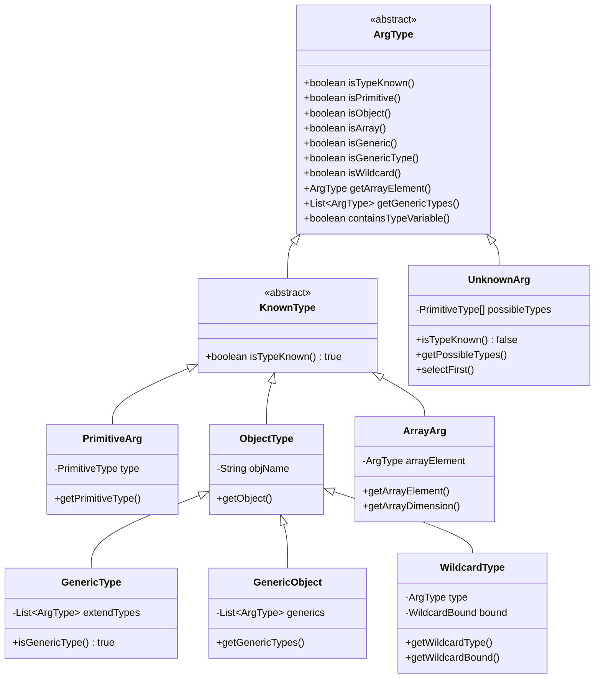
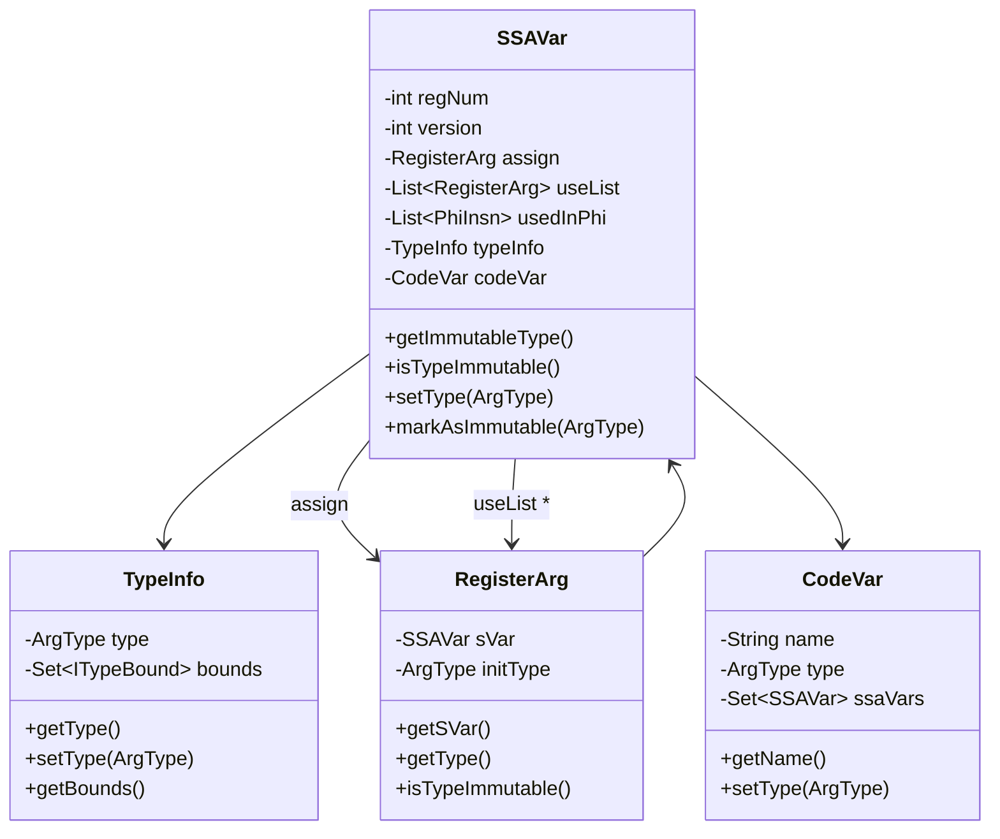
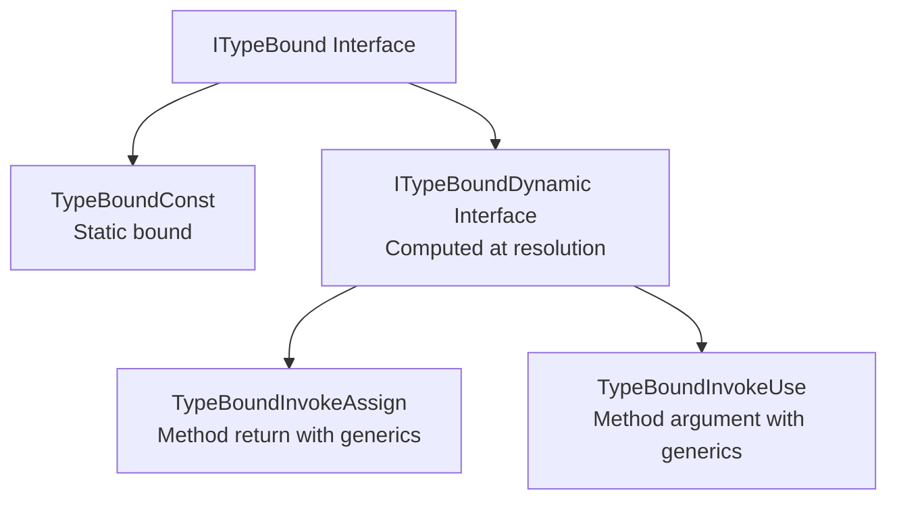
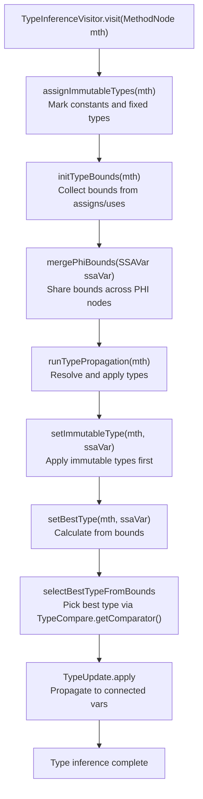
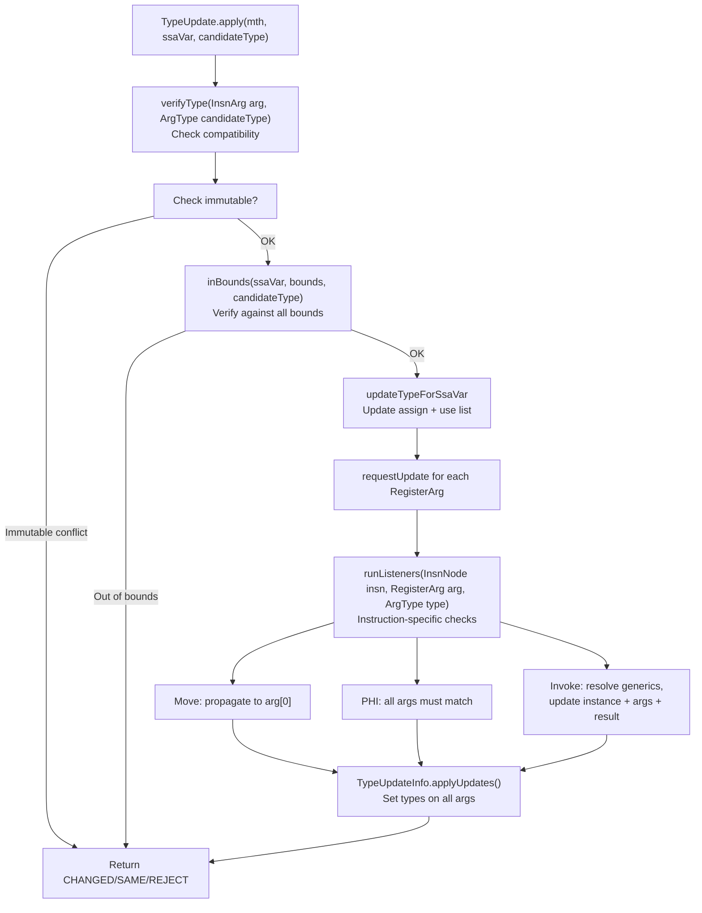
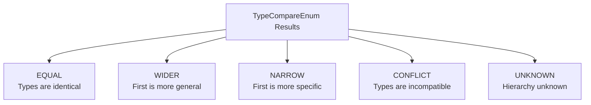
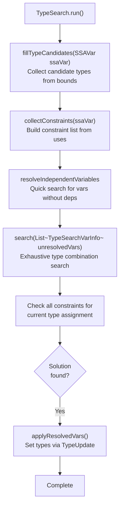
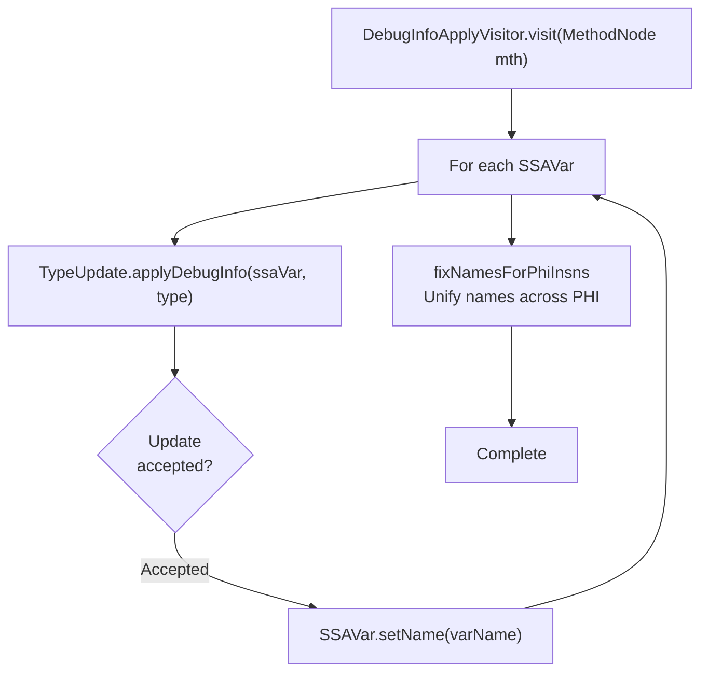

# Type System and Inference

Relevant source files

The following files were used as context for generating this wiki page:

- [jadx-core/src/main/java/jadx/api/impl/AnnotatedCodeWriter.java](https://github.com/skylot/jadx/blob/HEAD/jadx-core/src/main/java/jadx/api/impl/AnnotatedCodeWriter.java)
- [jadx-core/src/main/java/jadx/core/clsp/ClspMethod.java](https://github.com/skylot/jadx/blob/HEAD/jadx-core/src/main/java/jadx/core/clsp/ClspMethod.java)
- [jadx-core/src/main/java/jadx/core/clsp/SimpleMethodDetails.java](https://github.com/skylot/jadx/blob/HEAD/jadx-core/src/main/java/jadx/core/clsp/SimpleMethodDetails.java)
- [jadx-core/src/main/java/jadx/core/dex/attributes/nodes/ClassTypeVarsAttr.java](https://github.com/skylot/jadx/blob/HEAD/jadx-core/src/main/java/jadx/core/dex/attributes/nodes/ClassTypeVarsAttr.java)
- [jadx-core/src/main/java/jadx/core/dex/attributes/nodes/JadxError.java](https://github.com/skylot/jadx/blob/HEAD/jadx-core/src/main/java/jadx/core/dex/attributes/nodes/JadxError.java)
- [jadx-core/src/main/java/jadx/core/dex/attributes/nodes/LocalVarsDebugInfoAttr.java](https://github.com/skylot/jadx/blob/HEAD/jadx-core/src/main/java/jadx/core/dex/attributes/nodes/LocalVarsDebugInfoAttr.java)
- [jadx-core/src/main/java/jadx/core/dex/attributes/nodes/MethodTypeVarsAttr.java](https://github.com/skylot/jadx/blob/HEAD/jadx-core/src/main/java/jadx/core/dex/attributes/nodes/MethodTypeVarsAttr.java)
- [jadx-core/src/main/java/jadx/core/dex/attributes/nodes/PhiListAttr.java](https://github.com/skylot/jadx/blob/HEAD/jadx-core/src/main/java/jadx/core/dex/attributes/nodes/PhiListAttr.java)
- [jadx-core/src/main/java/jadx/core/dex/instructions/InsnDecoder.java](https://github.com/skylot/jadx/blob/HEAD/jadx-core/src/main/java/jadx/core/dex/instructions/InsnDecoder.java)
- [jadx-core/src/main/java/jadx/core/dex/instructions/args/ArgType.java](https://github.com/skylot/jadx/blob/HEAD/jadx-core/src/main/java/jadx/core/dex/instructions/args/ArgType.java)
- [jadx-core/src/main/java/jadx/core/dex/instructions/args/SSAVar.java](https://github.com/skylot/jadx/blob/HEAD/jadx-core/src/main/java/jadx/core/dex/instructions/args/SSAVar.java)
- [jadx-core/src/main/java/jadx/core/dex/nodes/parser/SignatureParser.java](https://github.com/skylot/jadx/blob/HEAD/jadx-core/src/main/java/jadx/core/dex/nodes/parser/SignatureParser.java)
- [jadx-core/src/main/java/jadx/core/dex/nodes/utils/TypeUtils.java](https://github.com/skylot/jadx/blob/HEAD/jadx-core/src/main/java/jadx/core/dex/nodes/utils/TypeUtils.java)
- [jadx-core/src/main/java/jadx/core/dex/visitors/InitCodeVariables.java](https://github.com/skylot/jadx/blob/HEAD/jadx-core/src/main/java/jadx/core/dex/visitors/InitCodeVariables.java)
- [jadx-core/src/main/java/jadx/core/dex/visitors/MethodInvokeVisitor.java](https://github.com/skylot/jadx/blob/HEAD/jadx-core/src/main/java/jadx/core/dex/visitors/MethodInvokeVisitor.java)
- [jadx-core/src/main/java/jadx/core/dex/visitors/SignatureProcessor.java](https://github.com/skylot/jadx/blob/HEAD/jadx-core/src/main/java/jadx/core/dex/visitors/SignatureProcessor.java)
- [jadx-core/src/main/java/jadx/core/dex/visitors/debuginfo/DebugInfoApplyVisitor.java](https://github.com/skylot/jadx/blob/HEAD/jadx-core/src/main/java/jadx/core/dex/visitors/debuginfo/DebugInfoApplyVisitor.java)
- [jadx-core/src/main/java/jadx/core/dex/visitors/methods/MutableMethodDetails.java](https://github.com/skylot/jadx/blob/HEAD/jadx-core/src/main/java/jadx/core/dex/visitors/methods/MutableMethodDetails.java)
- [jadx-core/src/main/java/jadx/core/dex/visitors/typeinference/TypeBoundInvokeAssign.java](https://github.com/skylot/jadx/blob/HEAD/jadx-core/src/main/java/jadx/core/dex/visitors/typeinference/TypeBoundInvokeAssign.java)
- [jadx-core/src/main/java/jadx/core/dex/visitors/typeinference/TypeCompare.java](https://github.com/skylot/jadx/blob/HEAD/jadx-core/src/main/java/jadx/core/dex/visitors/typeinference/TypeCompare.java)
- [jadx-core/src/main/java/jadx/core/dex/visitors/typeinference/TypeCompareEnum.java](https://github.com/skylot/jadx/blob/HEAD/jadx-core/src/main/java/jadx/core/dex/visitors/typeinference/TypeCompareEnum.java)
- [jadx-core/src/main/java/jadx/core/dex/visitors/typeinference/TypeInferenceVisitor.java](https://github.com/skylot/jadx/blob/HEAD/jadx-core/src/main/java/jadx/core/dex/visitors/typeinference/TypeInferenceVisitor.java)
- [jadx-core/src/main/java/jadx/core/dex/visitors/typeinference/TypeSearch.java](https://github.com/skylot/jadx/blob/HEAD/jadx-core/src/main/java/jadx/core/dex/visitors/typeinference/TypeSearch.java)
- [jadx-core/src/main/java/jadx/core/dex/visitors/typeinference/TypeUpdate.java](https://github.com/skylot/jadx/blob/HEAD/jadx-core/src/main/java/jadx/core/dex/visitors/typeinference/TypeUpdate.java)
- [jadx-core/src/main/java/jadx/core/dex/visitors/typeinference/TypeUpdateFlags.java](https://github.com/skylot/jadx/blob/HEAD/jadx-core/src/main/java/jadx/core/dex/visitors/typeinference/TypeUpdateFlags.java)
- [jadx-core/src/test/java/jadx/core/dex/instructions/args/ArgTypeTest.java](https://github.com/skylot/jadx/blob/HEAD/jadx-core/src/test/java/jadx/core/dex/instructions/args/ArgTypeTest.java)
- [jadx-core/src/test/java/jadx/core/dex/nodes/utils/TypeUtilsTest.java](https://github.com/skylot/jadx/blob/HEAD/jadx-core/src/test/java/jadx/core/dex/nodes/utils/TypeUtilsTest.java)
- [jadx-core/src/test/java/jadx/core/dex/visitors/typeinference/PrimitiveConversionsTests.java](https://github.com/skylot/jadx/blob/HEAD/jadx-core/src/test/java/jadx/core/dex/visitors/typeinference/PrimitiveConversionsTests.java)
- [jadx-core/src/test/java/jadx/core/dex/visitors/typeinference/TypeCompareTest.java](https://github.com/skylot/jadx/blob/HEAD/jadx-core/src/test/java/jadx/core/dex/visitors/typeinference/TypeCompareTest.java)
- [jadx-core/src/test/java/jadx/tests/functional/SignatureParserTest.java](https://github.com/skylot/jadx/blob/HEAD/jadx-core/src/test/java/jadx/tests/functional/SignatureParserTest.java)
- [jadx-core/src/test/java/jadx/tests/integration/enums/TestEnums9.java](https://github.com/skylot/jadx/blob/HEAD/jadx-core/src/test/java/jadx/tests/integration/enums/TestEnums9.java)
- [jadx-core/src/test/java/jadx/tests/integration/generics/TestMethodOverride.java](https://github.com/skylot/jadx/blob/HEAD/jadx-core/src/test/java/jadx/tests/integration/generics/TestMethodOverride.java)
- [jadx-core/src/test/java/jadx/tests/integration/generics/TestMissingGenericsTypes2.java](https://github.com/skylot/jadx/blob/HEAD/jadx-core/src/test/java/jadx/tests/integration/generics/TestMissingGenericsTypes2.java)
- [jadx-core/src/test/java/jadx/tests/integration/generics/TestTypeVarsFromOuterClass.java](https://github.com/skylot/jadx/blob/HEAD/jadx-core/src/test/java/jadx/tests/integration/generics/TestTypeVarsFromOuterClass.java)
- [jadx-core/src/test/java/jadx/tests/integration/invoke/TestOverloadedMethodInvoke2.java](https://github.com/skylot/jadx/blob/HEAD/jadx-core/src/test/java/jadx/tests/integration/invoke/TestOverloadedMethodInvoke2.java)
- [jadx-core/src/test/java/jadx/tests/integration/others/TestClassImplementsSignature.java](https://github.com/skylot/jadx/blob/HEAD/jadx-core/src/test/java/jadx/tests/integration/others/TestClassImplementsSignature.java)
- [jadx-core/src/test/java/jadx/tests/integration/others/TestCodeMetadata3.java](https://github.com/skylot/jadx/blob/HEAD/jadx-core/src/test/java/jadx/tests/integration/others/TestCodeMetadata3.java)
- [jadx-core/src/test/java/jadx/tests/integration/others/TestIncorrectFieldSignature.java](https://github.com/skylot/jadx/blob/HEAD/jadx-core/src/test/java/jadx/tests/integration/others/TestIncorrectFieldSignature.java)
- [jadx-core/src/test/java/jadx/tests/integration/others/TestPrimitiveCasts2.java](https://github.com/skylot/jadx/blob/HEAD/jadx-core/src/test/java/jadx/tests/integration/others/TestPrimitiveCasts2.java)
- [jadx-core/src/test/java/jadx/tests/integration/trycatch/TestNestedTryCatch3.java](https://github.com/skylot/jadx/blob/HEAD/jadx-core/src/test/java/jadx/tests/integration/trycatch/TestNestedTryCatch3.java)
- [jadx-core/src/test/java/jadx/tests/integration/types/TestTypeResolver11.java](https://github.com/skylot/jadx/blob/HEAD/jadx-core/src/test/java/jadx/tests/integration/types/TestTypeResolver11.java)
- [jadx-core/src/test/java/jadx/tests/integration/types/TestTypeResolver12.java](https://github.com/skylot/jadx/blob/HEAD/jadx-core/src/test/java/jadx/tests/integration/types/TestTypeResolver12.java)
- [jadx-core/src/test/java/jadx/tests/integration/variables/TestVariablesDeclAnnotation.java](https://github.com/skylot/jadx/blob/HEAD/jadx-core/src/test/java/jadx/tests/integration/variables/TestVariablesDeclAnnotation.java)
- [jadx-core/src/test/java/jadx/tests/integration/variables/TestVariablesInLoop.java](https://github.com/skylot/jadx/blob/HEAD/jadx-core/src/test/java/jadx/tests/integration/variables/TestVariablesInLoop.java)
- [jadx-core/src/test/raung/others/TestClassImplementsSignature.raung](https://github.com/skylot/jadx/blob/HEAD/jadx-core/src/test/raung/others/TestClassImplementsSignature.raung)
- [jadx-core/src/test/smali/generics/TestMethodOverride.smali](https://github.com/skylot/jadx/blob/HEAD/jadx-core/src/test/smali/generics/TestMethodOverride.smali)
- [jadx-core/src/test/smali/generics/TestMissingGenericsTypes2.smali](https://github.com/skylot/jadx/blob/HEAD/jadx-core/src/test/smali/generics/TestMissingGenericsTypes2.smali)
- [jadx-core/src/test/smali/others/TestIncorrectFieldSignature.smali](https://github.com/skylot/jadx/blob/HEAD/jadx-core/src/test/smali/others/TestIncorrectFieldSignature.smali)
- [jadx-core/src/test/smali/variables/TestVariablesInLoop.smali](https://github.com/skylot/jadx/blob/HEAD/jadx-core/src/test/smali/variables/TestVariablesInLoop.smali)
- [jadx-gui/src/main/java/jadx/gui/ui/codearea/SourceLineFormatter.java](https://github.com/skylot/jadx/blob/HEAD/jadx-gui/src/main/java/jadx/gui/ui/codearea/SourceLineFormatter.java)

## Purpose and Scope

This document describes JADX's type system and type inference mechanism, which determines the most accurate Java types for variables, expressions, and method signatures in decompiled bytecode. Type inference is essential because DEX bytecode uses a simplified type system (primarily primitives and object references), while Java source code requires precise generic types, array dimensions, and proper type hierarchies.

For information about SSA transformation that prepares variables for type inference, see [SSA Transform](). For code generation that uses the inferred types, see [Code Generation](10_2.6-code-generation.md).

---

## Type Representation (ArgType Hierarchy)

JADX represents all types through the abstract `ArgType` class, which defines a sophisticated type hierarchy supporting primitives, objects, arrays, generics, wildcards, and unknown types.

### ArgType Class Structure

Sources: [jadx-core/src/main/java/jadx/core/dex/instructions/args/ArgType.java:24-201](https://github.com/skylot/jadx/blob/HEAD/jadx-core/src/main/java/jadx/core/dex/instructions/args/ArgType.java#L24-L201), [jadx-core/src/main/java/jadx/core/dex/instructions/args/ArgType.java:203-578](https://github.com/skylot/jadx/blob/HEAD/jadx-core/src/main/java/jadx/core/dex/instructions/args/ArgType.java#L203-L578)

### Key Type Categories

**Primitive Types**: Fixed set of Java primitives (`INT`, `BOOLEAN`, `BYTE`, `SHORT`, `CHAR`, `FLOAT`, `DOUBLE`, `LONG`, `VOID`) represented by `PrimitiveArg` [jadx-core/src/main/java/jadx/core/dex/instructions/args/ArgType.java:25-33](https://github.com/skylot/jadx/blob/HEAD/jadx-core/src/main/java/jadx/core/dex/instructions/args/ArgType.java#L25-L33), [jadx-core/src/main/java/jadx/core/dex/instructions/args/ArgType.java:203-222](https://github.com/skylot/jadx/blob/HEAD/jadx-core/src/main/java/jadx/core/dex/instructions/args/ArgType.java#L203-L222).

**Object Types**: Reference types with class names. The `ObjectType` class stores the fully qualified class name as a string [jadx-core/src/main/java/jadx/core/dex/instructions/args/ArgType.java:237-259](https://github.com/skylot/jadx/blob/HEAD/jadx-core/src/main/java/jadx/core/dex/instructions/args/ArgType.java#L237-L259).

**Generic Types**: Type variables (`T`, `E`, etc.) represented by `GenericType` with optional extend bounds [jadx-core/src/main/java/jadx/core/dex/instructions/args/ArgType.java:317-343](https://github.com/skylot/jadx/blob/HEAD/jadx-core/src/main/java/jadx/core/dex/instructions/args/ArgType.java#L317-L343).

**Generic Objects**: Parameterized types (`List<String>`) represented by `GenericObject` with concrete generic arguments [jadx-core/src/main/java/jadx/core/dex/instructions/args/ArgType.java:433-460](https://github.com/skylot/jadx/blob/HEAD/jadx-core/src/main/java/jadx/core/dex/instructions/args/ArgType.java#L433-L460).

**Wildcard Types**: Bounded wildcards (`? extends T`, `? super T`, `?`) represented by `WildcardType` [jadx-core/src/main/java/jadx/core/dex/instructions/args/ArgType.java:369-397](https://github.com/skylot/jadx/blob/HEAD/jadx-core/src/main/java/jadx/core/dex/instructions/args/ArgType.java#L369-L397).

**Array Types**: Multi-dimensional arrays represented recursively by `ArrayArg` wrapping element types [jadx-core/src/main/java/jadx/core/dex/instructions/args/ArgType.java:279-315](https://github.com/skylot/jadx/blob/HEAD/jadx-core/src/main/java/jadx/core/dex/instructions/args/ArgType.java#L279-L315).

**Unknown Types**: Special placeholder types with a set of possible primitive types, used during inference [jadx-core/src/main/java/jadx/core/dex/instructions/args/ArgType.java:46-80](https://github.com/skylot/jadx/blob/HEAD/jadx-core/src/main/java/jadx/core/dex/instructions/args/ArgType.java#L46-L80), [jadx-core/src/main/java/jadx/core/dex/instructions/args/ArgType.java:547-578](https://github.com/skylot/jadx/blob/HEAD/jadx-core/src/main/java/jadx/core/dex/instructions/args/ArgType.java#L547-L578).

### Predefined Type Constants

Common types are cached as constants for performance:

| Constant | Type | Description |
|----------|------|-------------|
| `ArgType.INT` | Primitive | 32-bit integer |
| `ArgType.BOOLEAN` | Primitive | Boolean value |
| `ArgType.OBJECT` | Object | `java.lang.Object` |
| `ArgType.STRING` | Object | `java.lang.String` |
| `ArgType.UNKNOWN` | Unknown | All possible types |
| `ArgType.UNKNOWN_OBJECT` | Unknown | Object or array |
| `ArgType.NARROW` | Unknown | Narrow types (int, float, short, byte, char, boolean, object, array) |
| `ArgType.WIDE` | Unknown | Wide types (long, double) |

Sources: [jadx-core/src/main/java/jadx/core/dex/instructions/args/ArgType.java:25-80](https://github.com/skylot/jadx/blob/HEAD/jadx-core/src/main/java/jadx/core/dex/instructions/args/ArgType.java#L25-L80)

---

## SSA Variables and Type Information

### SSAVar Structure

Each SSA variable (`SSAVar`) represents a single assignment of a register and maintains type information through a `TypeInfo` object [jadx-core/src/main/java/jadx/core/dex/instructions/args/SSAVar.java:28-52](https://github.com/skylot/jadx/blob/HEAD/jadx-core/src/main/java/jadx/core/dex/instructions/args/SSAVar.java#L28-L52).

Sources: [jadx-core/src/main/java/jadx/core/dex/instructions/args/SSAVar.java:28-259](https://github.com/skylot/jadx/blob/HEAD/jadx-core/src/main/java/jadx/core/dex/instructions/args/SSAVar.java#L28-L259), [jadx-core/src/main/java/jadx/core/dex/visitors/typeinference/TypeInfo.java:1-30](https://github.com/skylot/jadx/blob/HEAD/jadx-core/src/main/java/jadx/core/dex/visitors/typeinference/TypeInfo.java#L1-L30)

### Type Mutability

SSA variables can have **immutable types** when the type is definitively known and cannot change:
- Constants with known types (e.g., `CONST_STRING` results in `ArgType.STRING`) [jadx-core/src/main/java/jadx/core/dex/instructions/InsnDecoder.java:85-88](https://github.com/skylot/jadx/blob/HEAD/jadx-core/src/main/java/jadx/core/dex/instructions/InsnDecoder.java#L85-L88).
- Method arguments with explicit types.
- Results of `NEW_INSTANCE` or `CHECK_CAST` instructions [jadx-core/src/main/java/jadx/core/dex/visitors/typeinference/TypeInferenceVisitor.java:207-208](https://github.com/skylot/jadx/blob/HEAD/jadx-core/src/main/java/jadx/core/dex/visitors/typeinference/TypeInferenceVisitor.java#L207-L208).
- Variables marked with `AFlag.IMMUTABLE_TYPE` [jadx-core/src/main/java/jadx/core/dex/instructions/args/SSAVar.java:96-98](https://github.com/skylot/jadx/blob/HEAD/jadx-core/src/main/java/jadx/core/dex/instructions/args/SSAVar.java#L96-L98).

Immutable types are set early and prevent later type updates from changing the type [jadx-core/src/main/java/jadx/core/dex/instructions/args/SSAVar.java:111-117](https://github.com/skylot/jadx/blob/HEAD/jadx-core/src/main/java/jadx/core/dex/instructions/args/SSAVar.java#L111-L117).

Sources: [jadx-core/src/main/java/jadx/core/dex/instructions/args/SSAVar.java:89-109](https://github.com/skylot/jadx/blob/HEAD/jadx-core/src/main/java/jadx/core/dex/instructions/args/SSAVar.java#L89-L109), [jadx-core/src/main/java/jadx/core/dex/visitors/typeinference/TypeInferenceVisitor.java:107-121](https://github.com/skylot/jadx/blob/HEAD/jadx-core/src/main/java/jadx/core/dex/visitors/typeinference/TypeInferenceVisitor.java#L107-L121)

---

## Type Bounds System

Type inference collects **type bounds** (constraints) from variable assignments and usages, then resolves these bounds to determine the best type.

### Bound Types

Sources: [jadx-core/src/main/java/jadx/core/dex/visitors/typeinference/TypeInferenceVisitor.java:185-310](https://github.com/skylot/jadx/blob/HEAD/jadx-core/src/main/java/jadx/core/dex/visitors/typeinference/TypeInferenceVisitor.java#L185-L310), [jadx-core/src/main/java/jadx/core/dex/visitors/typeinference/ITypeBound.java:1-15](https://github.com/skylot/jadx/blob/HEAD/jadx-core/src/main/java/jadx/core/dex/visitors/typeinference/ITypeBound.java#L1-L15)

### Bound Enum

Each bound has a direction indicating whether it comes from assignment or usage:

| BoundEnum | Direction | Example |
|-----------|-----------|---------|
| `ASSIGN` | Type flows into variable | `var = method()` |
| `USE` | Type flows from variable | `method(var)` |

The bound direction affects type comparison during resolution:
- `ASSIGN` bounds allow the candidate to be narrower.
- `USE` bounds allow the candidate to be wider.

Sources: [jadx-core/src/main/java/jadx/core/dex/visitors/typeinference/BoundEnum.java:1-10](https://github.com/skylot/jadx/blob/HEAD/jadx-core/src/main/java/jadx/core/dex/visitors/typeinference/BoundEnum.java#L1-L10), [jadx-core/src/main/java/jadx/core/dex/visitors/typeinference/TypeUpdate.java:1126-1159](https://github.com/skylot/jadx/blob/HEAD/jadx-core/src/main/java/jadx/core/dex/visitors/typeinference/TypeUpdate.java#L1126-L1159)

### Dynamic Bounds

Dynamic bounds (`ITypeBoundDynamic`) compute their type at resolution time using the current `TypeUpdateInfo` context. This allows resolving generic types by substituting type variables with concrete types from related variables [jadx-core/src/main/java/jadx/core/dex/visitors/typeinference/TypeInferenceVisitor.java:189-191](https://github.com/skylot/jadx/blob/HEAD/jadx-core/src/main/java/jadx/core/dex/visitors/typeinference/TypeInferenceVisitor.java#L189-L191).

For example, `TypeBoundInvokeAssign` for `List<T> list = map.values()` resolves the return type's generic `T` based on the inferred type of `map`.

Sources: [jadx-core/src/main/java/jadx/core/dex/visitors/typeinference/TypeInferenceVisitor.java:185-310](https://github.com/skylot/jadx/blob/HEAD/jadx-core/src/main/java/jadx/core/dex/visitors/typeinference/TypeInferenceVisitor.java#L185-L310)

---

## Type Inference Pipeline

The type inference process runs as a visitor pass after SSA transformation and consists of three main stages.

### Type Inference Flow

Sources: [jadx-core/src/main/java/jadx/core/dex/visitors/typeinference/TypeInferenceVisitor.java:65-106](https://github.com/skylot/jadx/blob/HEAD/jadx-core/src/main/java/jadx/core/dex/visitors/typeinference/TypeInferenceVisitor.java#L65-L106)

### Stage 1: Assign Immutable Types

Identifies variables with definitively known types that cannot change:
- Method argument types.
- Constants with literal types (e.g., `CONST_STRING` -> `STRING`) [jadx-core/src/main/java/jadx/core/dex/instructions/InsnDecoder.java:85-88](https://github.com/skylot/jadx/blob/HEAD/jadx-core/src/main/java/jadx/core/dex/instructions/InsnDecoder.java#L85-L88).
- New instance allocations.
- Variables with `AFlag.IMMUTABLE_TYPE` flag [jadx-core/src/main/java/jadx/core/dex/instructions/args/SSAVar.java:96-98](https://github.com/skylot/jadx/blob/HEAD/jadx-core/src/main/java/jadx/core/dex/instructions/args/SSAVar.java#L96-L98).

Sources: [jadx-core/src/main/java/jadx/core/dex/visitors/typeinference/TypeInferenceVisitor.java:341-361](https://github.com/skylot/jadx/blob/HEAD/jadx-core/src/main/java/jadx/core/dex/visitors/typeinference/TypeInferenceVisitor.java#L341-L361)

### Stage 2: Initialize Type Bounds

For each SSA variable, collects bounds from two sources:

**Assignment Bounds** (`BoundEnum.ASSIGN`): Type constraints from where the variable receives its value [jadx-core/src/main/java/jadx/core/dex/visitors/typeinference/TypeInferenceVisitor.java:195-254](https://github.com/skylot/jadx/blob/HEAD/jadx-core/src/main/java/jadx/core/dex/visitors/typeinference/TypeInferenceVisitor.java#L195-L254).
- Result type of instructions (`INVOKE`, `IGET`, `NEW_INSTANCE`, etc.).
- Type of assigned constant.
- Exception types from `MOVE_EXCEPTION`.

**Usage Bounds** (`BoundEnum.USE`): Type constraints from where the variable is used [jadx-core/src/main/java/jadx/core/dex/visitors/typeinference/TypeInferenceVisitor.java:256-310](https://github.com/skylot/jadx/blob/HEAD/jadx-core/src/main/java/jadx/core/dex/visitors/typeinference/TypeInferenceVisitor.java#L256-L310).
- Argument types in method calls.
- Array element types in array operations.

PHI instruction bounds are merged across all inputs and results to ensure type consistency [jadx-core/src/main/java/jadx/core/dex/visitors/typeinference/TypeInferenceVisitor.java:175-183](https://github.com/skylot/jadx/blob/HEAD/jadx-core/src/main/java/jadx/core/dex/visitors/typeinference/TypeInferenceVisitor.java#L175-L183).

Sources: [jadx-core/src/main/java/jadx/core/dex/visitors/typeinference/TypeInferenceVisitor.java:164-310](https://github.com/skylot/jadx/blob/HEAD/jadx-core/src/main/java/jadx/core/dex/visitors/typeinference/TypeInferenceVisitor.java#L164-L310)

### Stage 3: Run Type Propagation

For each SSA variable:
1. Apply immutable type if set [jadx-core/src/main/java/jadx/core/dex/visitors/typeinference/TypeInferenceVisitor.java:107-121](https://github.com/skylot/jadx/blob/HEAD/jadx-core/src/main/java/jadx/core/dex/visitors/typeinference/TypeInferenceVisitor.java#L107-L121).
2. Select best type from collected bounds using type comparator [jadx-core/src/main/java/jadx/core/dex/visitors/typeinference/TypeInferenceVisitor.java:157-162](https://github.com/skylot/jadx/blob/HEAD/jadx-core/src/main/java/jadx/core/dex/visitors/typeinference/TypeInferenceVisitor.java#L157-L162).
3. Request type update via `TypeUpdate.apply()` [jadx-core/src/main/java/jadx/core/dex/visitors/typeinference/TypeInferenceVisitor.java:147](https://github.com/skylot/jadx/blob/HEAD/jadx-core/src/main/java/jadx/core/dex/visitors/typeinference/TypeInferenceVisitor.java#L147).
4. Propagate type to all connected registers and instructions.

Sources: [jadx-core/src/main/java/jadx/core/dex/visitors/typeinference/TypeInferenceVisitor.java:100-155](https://github.com/skylot/jadx/blob/HEAD/jadx-core/src/main/java/jadx/core/dex/visitors/typeinference/TypeInferenceVisitor.java#L100-L155)

---

## Type Update and Propagation

The `TypeUpdate` class orchestrates recursive type propagation to ensure type consistency across connected variables and instructions.

### Type Update Process

Sources: [jadx-core/src/main/java/jadx/core/dex/visitors/typeinference/TypeUpdate.java:58-105](https://github.com/skylot/jadx/blob/HEAD/jadx-core/src/main/java/jadx/core/dex/visitors/typeinference/TypeUpdate.java#L58-L105), [jadx-core/src/main/java/jadx/core/dex/visitors/typeinference/TypeUpdate.java:186-242](https://github.com/skylot/jadx/blob/HEAD/jadx-core/src/main/java/jadx/core/dex/visitors/typeinference/TypeUpdate.java#L186-L242)

### Type Update Flags

Type updates can be configured with flags to control behavior:

| Flag | Purpose |
|------|---------|
| `WIDER` | Allow updating to a wider (more general) type. |
| `WIDER_IGNORE_SAME` | Force update even if types are equal. |
| `APPLY_DEBUG` | Permissive update for debug info. |

Sources: [jadx-core/src/main/java/jadx/core/dex/visitors/typeinference/TypeUpdate.java:58-80](https://github.com/skylot/jadx/blob/HEAD/jadx-core/src/main/java/jadx/core/dex/visitors/typeinference/TypeUpdate.java#L58-L80), [jadx-core/src/main/java/jadx/core/dex/visitors/typeinference/TypeUpdateFlags.java:1-20](https://github.com/skylot/jadx/blob/HEAD/jadx-core/src/main/java/jadx/core/dex/visitors/typeinference/TypeUpdateFlags.java#L1-L20)

---

## Type Comparison

The `TypeCompare` class determines relationships between types using the classpath information.

### Type Comparison Results

Sources: [jadx-core/src/main/java/jadx/core/dex/visitors/typeinference/TypeCompareEnum.java:20-27](https://github.com/skylot/jadx/blob/HEAD/jadx-core/src/main/java/jadx/core/dex/visitors/typeinference/TypeCompareEnum.java#L20-L27), [jadx-core/src/main/java/jadx/core/dex/visitors/typeinference/TypeCompare.java:61-113](https://github.com/skylot/jadx/blob/HEAD/jadx-core/src/main/java/jadx/core/dex/visitors/typeinference/TypeCompare.java#L61-L113)

---

## Multi-Variable Type Search

When standard type propagation fails to resolve all variables, JADX falls back to `TypeSearch`, which performs exhaustive search over candidate type combinations.

### Type Search Algorithm

Sources: [jadx-core/src/main/java/jadx/core/dex/visitors/typeinference/TypeSearch.java:53-107](https://github.com/skylot/jadx/blob/HEAD/jadx-core/src/main/java/jadx/core/dex/visitors/typeinference/TypeSearch.java#L53-L107)

### Search Limits

To prevent excessive computation, the algorithm enforces limits:

| Limit | Value | Purpose |
|-------|-------|---------|
| `VARS_PROCESS_LIMIT` | 5,000 | Maximum variables to process. |
| `CANDIDATES_COUNT_LIMIT` | 10 | Maximum candidate types per variable. |
| `SEARCH_ITERATION_LIMIT` | 1,000,000 | Maximum search iterations. |

Sources: [jadx-core/src/main/java/jadx/core/dex/visitors/typeinference/TypeSearch.java:37-40](https://github.com/skylot/jadx/blob/HEAD/jadx-core/src/main/java/jadx/core/dex/visitors/typeinference/TypeSearch.java#L37-L40)

---

## Debug Info Integration

Debug information from DEX files provides variable names and types that can improve type inference accuracy.

### Debug Info Application

The `DebugInfoApplyVisitor` runs after type inference to apply debug types:

Sources: [jadx-core/src/main/java/jadx/core/dex/visitors/debuginfo/DebugInfoApplyVisitor.java:52-72](https://github.com/skylot/jadx/blob/HEAD/jadx-core/src/main/java/jadx/core/dex/visitors/debuginfo/DebugInfoApplyVisitor.java#L52-L72), [jadx-core/src/main/java/jadx/core/dex/visitors/debuginfo/DebugInfoApplyVisitor.java:128-148](https://github.com/skylot/jadx/blob/HEAD/jadx-core/src/main/java/jadx/core/dex/visitors/debuginfo/DebugInfoApplyVisitor.java#L128-L148)

---

## Type Inference Error Handling

Type inference is wrapped in error handling to gracefully handle failures:

### Stack Overflow Protection

`TypeInferenceVisitor` catches `StackOverflowError` and `BootstrapMethodError`, adding errors to the method rather than crashing [jadx-core/src/main/java/jadx/core/dex/visitors/typeinference/TypeInferenceVisitor.java:76-80](https://github.com/skylot/jadx/blob/HEAD/jadx-core/src/main/java/jadx/core/dex/visitors/typeinference/TypeInferenceVisitor.java#L76-L80).

### Signature Parsing

Generic signatures are parsed by `SignatureParser` [jadx-core/src/main/java/jadx/core/dex/nodes/parser/SignatureParser.java:17-32](https://github.com/skylot/jadx/blob/HEAD/jadx-core/src/main/java/jadx/core/dex/nodes/parser/SignatureParser.java#L17-L32). The `SignatureProcessor` visitor applies these parsed types to classes, fields, and methods, often expanding type variables to their bounds [jadx-core/src/main/java/jadx/core/dex/visitors/SignatureProcessor.java:34-42](https://github.com/skylot/jadx/blob/HEAD/jadx-core/src/main/java/jadx/core/dex/visitors/SignatureProcessor.java#L34-L42).

Sources: [jadx-core/src/main/java/jadx/core/dex/visitors/typeinference/TypeInferenceVisitor.java:76-81](https://github.com/skylot/jadx/blob/HEAD/jadx-core/src/main/java/jadx/core/dex/visitors/typeinference/TypeInferenceVisitor.java#L76-L81), [jadx-core/src/main/java/jadx/core/dex/nodes/parser/SignatureParser.java:133-170](https://github.com/skylot/jadx/blob/HEAD/jadx-core/src/main/java/jadx/core/dex/nodes/parser/SignatureParser.java#L133-L170), [jadx-core/src/main/java/jadx/core/dex/visitors/SignatureProcessor.java:180-207](https://github.com/skylot/jadx/blob/HEAD/jadx-core/src/main/java/jadx/core/dex/visitors/SignatureProcessor.java#L180-L207)