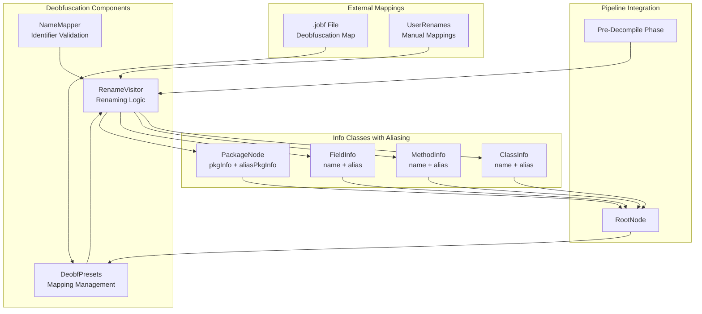
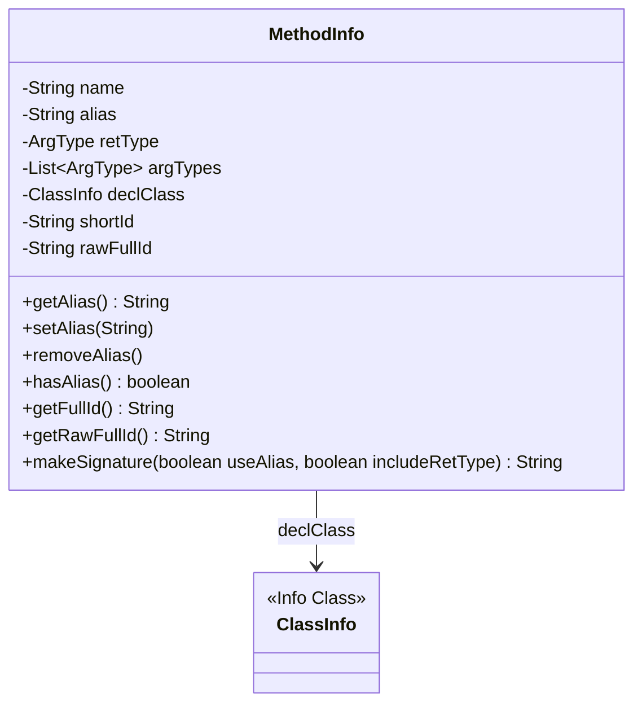
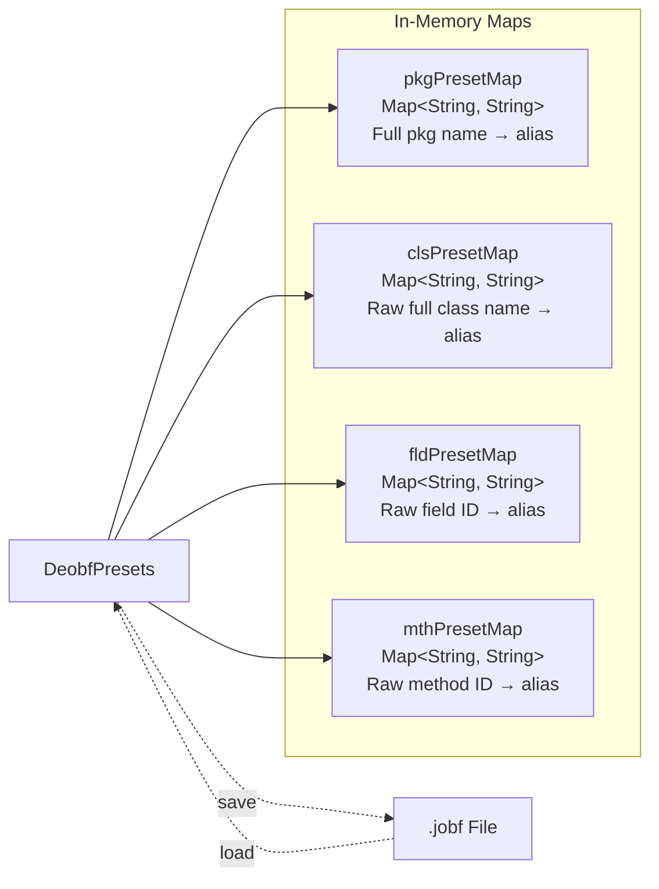

# Deobfuscation and Renaming

Relevant source files

The following files were used as context for generating this wiki page:

- [jadx-cli/src/test/resources/samples/small.apk](https://github.com/skylot/jadx/blob/HEAD/jadx-cli/src/test/resources/samples/small.apk)
- [jadx-core/src/main/java/jadx/api/args/ResourceNameSource.java](https://github.com/skylot/jadx/blob/HEAD/jadx-core/src/main/java/jadx/api/args/ResourceNameSource.java)
- [jadx-core/src/main/java/jadx/core/codegen/utils/CodeGenUtils.java](https://github.com/skylot/jadx/blob/HEAD/jadx-core/src/main/java/jadx/core/codegen/utils/CodeGenUtils.java)
- [jadx-core/src/main/java/jadx/core/deobf/DeobfPresets.java](https://github.com/skylot/jadx/blob/HEAD/jadx-core/src/main/java/jadx/core/deobf/DeobfPresets.java)
- [jadx-core/src/main/java/jadx/core/deobf/NameMapper.java](https://github.com/skylot/jadx/blob/HEAD/jadx-core/src/main/java/jadx/core/deobf/NameMapper.java)
- [jadx-core/src/main/java/jadx/core/dex/info/FieldInfo.java](https://github.com/skylot/jadx/blob/HEAD/jadx-core/src/main/java/jadx/core/dex/info/FieldInfo.java)
- [jadx-core/src/main/java/jadx/core/dex/info/MethodInfo.java](https://github.com/skylot/jadx/blob/HEAD/jadx-core/src/main/java/jadx/core/dex/info/MethodInfo.java)
- [jadx-core/src/main/java/jadx/core/dex/instructions/InvokeNode.java](https://github.com/skylot/jadx/blob/HEAD/jadx-core/src/main/java/jadx/core/dex/instructions/InvokeNode.java)
- [jadx-core/src/main/java/jadx/core/dex/instructions/mods/ConstructorInsn.java](https://github.com/skylot/jadx/blob/HEAD/jadx-core/src/main/java/jadx/core/dex/instructions/mods/ConstructorInsn.java)
- [jadx-core/src/main/java/jadx/core/dex/nodes/FieldNode.java](https://github.com/skylot/jadx/blob/HEAD/jadx-core/src/main/java/jadx/core/dex/nodes/FieldNode.java)
- [jadx-core/src/main/java/jadx/core/dex/visitors/rename/RenameVisitor.java](https://github.com/skylot/jadx/blob/HEAD/jadx-core/src/main/java/jadx/core/dex/visitors/rename/RenameVisitor.java)
- [jadx-core/src/main/java/jadx/core/dex/visitors/rename/SourceFileRename.java](https://github.com/skylot/jadx/blob/HEAD/jadx-core/src/main/java/jadx/core/dex/visitors/rename/SourceFileRename.java)
- [jadx-core/src/main/java/jadx/core/dex/visitors/rename/UserRenames.java](https://github.com/skylot/jadx/blob/HEAD/jadx-core/src/main/java/jadx/core/dex/visitors/rename/UserRenames.java)
- [jadx-core/src/main/java/jadx/core/utils/BetterName.java](https://github.com/skylot/jadx/blob/HEAD/jadx-core/src/main/java/jadx/core/utils/BetterName.java)
- [jadx-core/src/main/java/jadx/core/utils/StringUtils.java](https://github.com/skylot/jadx/blob/HEAD/jadx-core/src/main/java/jadx/core/utils/StringUtils.java)
- [jadx-core/src/test/java/jadx/core/utils/TestBetterName.java](https://github.com/skylot/jadx/blob/HEAD/jadx-core/src/test/java/jadx/core/utils/TestBetterName.java)
- [jadx-core/src/test/java/jadx/core/utils/TestGetBetterClassName.java](https://github.com/skylot/jadx/blob/HEAD/jadx-core/src/test/java/jadx/core/utils/TestGetBetterClassName.java)
- [jadx-core/src/test/java/jadx/core/utils/TestGetBetterResourceName.java](https://github.com/skylot/jadx/blob/HEAD/jadx-core/src/test/java/jadx/core/utils/TestGetBetterResourceName.java)
- [jadx-core/src/test/java/jadx/tests/integration/deobf/TestRenameOverriddenMethod.java](https://github.com/skylot/jadx/blob/HEAD/jadx-core/src/test/java/jadx/tests/integration/deobf/TestRenameOverriddenMethod.java)
- [jadx-core/src/test/java/jadx/tests/integration/names/TestCaseSensitiveClassInPkgChecks.java](https://github.com/skylot/jadx/blob/HEAD/jadx-core/src/test/java/jadx/tests/integration/names/TestCaseSensitiveClassInPkgChecks.java)
- [jadx-core/src/test/java/jadx/tests/integration/names/TestCaseSensitivePkgChecks.java](https://github.com/skylot/jadx/blob/HEAD/jadx-core/src/test/java/jadx/tests/integration/names/TestCaseSensitivePkgChecks.java)
- [jadx-core/src/test/java/jadx/tests/integration/others/TestStringConstructor.java](https://github.com/skylot/jadx/blob/HEAD/jadx-core/src/test/java/jadx/tests/integration/others/TestStringConstructor.java)
- [jadx-core/src/test/java/jadx/tests/integration/rename/TestFieldRenameFormat.java](https://github.com/skylot/jadx/blob/HEAD/jadx-core/src/test/java/jadx/tests/integration/rename/TestFieldRenameFormat.java)
- [jadx-core/src/test/java/jadx/tests/integration/rename/TestUsingSourceFileName.java](https://github.com/skylot/jadx/blob/HEAD/jadx-core/src/test/java/jadx/tests/integration/rename/TestUsingSourceFileName.java)
- [jadx-core/src/test/smali/names/TestCaseSensitiveClassInPkgChecks/1.smali](https://github.com/skylot/jadx/blob/HEAD/jadx-core/src/test/smali/names/TestCaseSensitiveClassInPkgChecks/1.smali)
- [jadx-core/src/test/smali/names/TestCaseSensitiveClassInPkgChecks/2.smali](https://github.com/skylot/jadx/blob/HEAD/jadx-core/src/test/smali/names/TestCaseSensitiveClassInPkgChecks/2.smali)
- [jadx-core/src/test/smali/names/TestCaseSensitivePkgChecks/1.smali](https://github.com/skylot/jadx/blob/HEAD/jadx-core/src/test/smali/names/TestCaseSensitivePkgChecks/1.smali)
- [jadx-core/src/test/smali/names/TestCaseSensitivePkgChecks/2.smali](https://github.com/skylot/jadx/blob/HEAD/jadx-core/src/test/smali/names/TestCaseSensitivePkgChecks/2.smali)
- [jadx-gui/src/main/java/jadx/gui/cache/code/CodeCacheMode.java](https://github.com/skylot/jadx/blob/HEAD/jadx-gui/src/main/java/jadx/gui/cache/code/CodeCacheMode.java)
- [jadx-gui/src/main/java/jadx/gui/logs/LogPanel.java](https://github.com/skylot/jadx/blob/HEAD/jadx-gui/src/main/java/jadx/gui/logs/LogPanel.java)
- [jadx-gui/src/main/java/jadx/gui/treemodel/ApkSignatureNode.java](https://github.com/skylot/jadx/blob/HEAD/jadx-gui/src/main/java/jadx/gui/treemodel/ApkSignatureNode.java)
- [jadx-gui/src/main/java/jadx/gui/ui/action/ActionCategory.java](https://github.com/skylot/jadx/blob/HEAD/jadx-gui/src/main/java/jadx/gui/ui/action/ActionCategory.java)
- [jadx-gui/src/main/java/jadx/gui/utils/NLS.java](https://github.com/skylot/jadx/blob/HEAD/jadx-gui/src/main/java/jadx/gui/utils/NLS.java)
- [jadx-gui/src/test/java/jadx/gui/TestI18n.java](https://github.com/skylot/jadx/blob/HEAD/jadx-gui/src/test/java/jadx/gui/TestI18n.java)

## Purpose and Scope

This document covers JADX's deobfuscation and renaming subsystem, which transforms obfuscated identifiers (packages, classes, methods, fields) into readable names. The system validates identifier legality, manages name aliases, and persists renaming mappings for reuse.

For information about the overall visitor pipeline where deobfuscation occurs, see [Decompilation Pipeline](https://github.com/skylot/jadx/blob/HEAD/2.2). For details on the Info classes that store metadata, see [Info Classes and Metadata](https://github.com/skylot/jadx/blob/HEAD/8.2).

---

## System Overview

The deobfuscation system operates during the pre-decompile phase of the visitor pipeline. It consists of three main components: identifier validation (`NameMapper`), an aliasing system embedded in Info classes (`MethodInfo`, `FieldInfo`, `ClassInfo`), and a preset management system (`DeobfPresets`) that loads and saves renaming mappings.

Title: Deobfuscation System Architecture

Sources: [jadx-core/src/main/java/jadx/core/deobf/NameMapper.java:12-199](https://github.com/skylot/jadx/blob/HEAD/jadx-core/src/main/java/jadx/core/deobf/NameMapper.java#L12-L199), [jadx-core/src/main/java/jadx/core/deobf/DeobfPresets.java:34-231](https://github.com/skylot/jadx/blob/HEAD/jadx-core/src/main/java/jadx/core/deobf/DeobfPresets.java#L34-L231), [jadx-core/src/main/java/jadx/core/dex/info/MethodInfo.java:15-204](https://github.com/skylot/jadx/blob/HEAD/jadx-core/src/main/java/jadx/core/dex/info/MethodInfo.java#L15-L204), [jadx-core/src/main/java/jadx/core/dex/info/FieldInfo.java:11-111](https://github.com/skylot/jadx/blob/HEAD/jadx-core/src/main/java/jadx/core/dex/info/FieldInfo.java#L11-L111), [jadx-core/src/main/java/jadx/core/dex/visitors/rename/RenameVisitor.java:30-100](https://github.com/skylot/jadx/blob/HEAD/jadx-core/src/main/java/jadx/core/dex/visitors/rename/RenameVisitor.java#L30-L100)

---

## Identifier Validation (NameMapper)

The `NameMapper` class provides static utilities for validating Java identifiers and sanitizing invalid names. It enforces Java language rules for identifier legality. [jadx-core/src/main/java/jadx/core/deobf/NameMapper.java:12-12](https://github.com/skylot/jadx/blob/HEAD/jadx-core/src/main/java/jadx/core/deobf/NameMapper.java#L12)

### Reserved Words and Patterns

`NameMapper` maintains a set of reserved Java keywords that cannot be used as identifiers:

- **RESERVED_NAMES**: Set containing keywords like `class`, `interface`, `package`, `private`, `protected`, etc. [jadx-core/src/main/java/jadx/core/deobf/NameMapper.java:20-75](https://github.com/skylot/jadx/blob/HEAD/jadx-core/src/main/java/jadx/core/deobf/NameMapper.java#L20-L75)
- **VALID_JAVA_IDENTIFIER**: Regex pattern matching valid Java identifiers (start with `javaJavaIdentifierStart`, continue with `javaJavaIdentifierPart`). [jadx-core/src/main/java/jadx/core/deobf/NameMapper.java:14-15](https://github.com/skylot/jadx/blob/HEAD/jadx-core/src/main/java/jadx/core/deobf/NameMapper.java#L14-L15)
- **VALID_JAVA_FULL_IDENTIFIER**: Pattern for dotted identifiers like `com.example.MyClass`. [jadx-core/src/main/java/jadx/core/deobf/NameMapper.java:17-18](https://github.com/skylot/jadx/blob/HEAD/jadx-core/src/main/java/jadx/core/deobf/NameMapper.java#L17-L18)

### Validation Methods

| Method | Purpose |
|--------|---------|
| `isReserved(String)` | Checks if name is a Java reserved word. [line 77-79](https://github.com/skylot/jadx/blob/HEAD/jadx-core/src/main/java/jadx/core/deobf/NameMapper.java#L77-L79) |
| `isValidIdentifier(String)` | Validates single identifier (non-empty, not reserved, matches pattern). [line 81-85](https://github.com/skylot/jadx/blob/HEAD/jadx-core/src/main/java/jadx/core/deobf/NameMapper.java#L81-L85) |
| `isValidFullIdentifier(String)` | Validates dotted identifier like package names. [line 87-91](https://github.com/skylot/jadx/blob/HEAD/jadx-core/src/main/java/jadx/core/deobf/NameMapper.java#L87-L91) |
| `isValidAndPrintable(String)` | Combines identifier validation with printability check. [line 93-95](https://github.com/skylot/jadx/blob/HEAD/jadx-core/src/main/java/jadx/core/deobf/NameMapper.java#L93-L95) |
| `isAllCharsPrintable(String)` | Verifies all characters are printable ASCII (32-126). [line 132-143](https://github.com/skylot/jadx/blob/HEAD/jadx-core/src/main/java/jadx/core/deobf/NameMapper.java#L132-L143) |
| `isPrintableCodePoint(int)` | Checks if a code point is printable, excluding control characters and specific whitespaces. [line 113-130](https://github.com/skylot/jadx/blob/HEAD/jadx-core/src/main/java/jadx/core/deobf/NameMapper.java#L113-L130) |

### Character Sanitization

`NameMapper` provides methods to remove invalid characters from obfuscated names:

- **removeInvalidCharsMiddle(String)**: Removes non-printable and non-identifier characters, but allows numbers that would be invalid at the start. [jadx-core/src/main/java/jadx/core/deobf/NameMapper.java:157-169](https://github.com/skylot/jadx/blob/HEAD/jadx-core/src/main/java/jadx/core/deobf/NameMapper.java#L157-L169)
- **removeInvalidChars(String, String)**: Sanitizes a name and prepends a prefix if the result starts with an invalid character (e.g., a number). [jadx-core/src/main/java/jadx/core/deobf/NameMapper.java:176-185](https://github.com/skylot/jadx/blob/HEAD/jadx-core/src/main/java/jadx/core/deobf/NameMapper.java#L176-L185)
- **removeNonPrintableCharacters(String)**: Removes only non-printable characters, preserving valid identifier characters even if they're numbers. [jadx-core/src/main/java/jadx/core/deobf/NameMapper.java:187-195](https://github.com/skylot/jadx/blob/HEAD/jadx-core/src/main/java/jadx/core/deobf/NameMapper.java#L187-L195)

Sources: [jadx-core/src/main/java/jadx/core/deobf/NameMapper.java:12-199](https://github.com/skylot/jadx/blob/HEAD/jadx-core/src/main/java/jadx/core/deobf/NameMapper.java#L12-L199), [jadx-core/src/main/java/jadx/core/utils/StringUtils.java:83-84](https://github.com/skylot/jadx/blob/HEAD/jadx-core/src/main/java/jadx/core/utils/StringUtils.java#L83-L84)

---

## Aliasing System

JADX uses an aliasing system where Info classes (`ClassInfo`, `MethodInfo`, `FieldInfo`) store both the original name and a renamed alias. This allows the decompiler to preserve original metadata while displaying deobfuscated names in generated code.

### MethodInfo Aliasing

`MethodInfo` stores method metadata including the original name and an optional alias:

Title: MethodInfo Aliasing Structure

- **name**: Original method name from bytecode (e.g., `"<init>"` or `"a"`). [jadx-core/src/main/java/jadx/core/dex/info/MethodInfo.java:17](https://github.com/skylot/jadx/blob/HEAD/jadx-core/src/main/java/jadx/core/dex/info/MethodInfo.java#L17)
- **alias**: Deobfuscated name (e.g., `"getUserName"`), initialized to equal `name`. [line 25, 29](https://github.com/skylot/jadx/blob/HEAD/jadx-core/src/main/java/jadx/core/dex/info/MethodInfo.java#L25)
- **setAlias(String)**: Updates the alias. [line 156-158](https://github.com/skylot/jadx/blob/HEAD/jadx-core/src/main/java/jadx/core/dex/info/MethodInfo.java#L156-L158)
- **hasAlias()**: Returns true if alias differs from original name. [line 164-166](https://github.com/skylot/jadx/blob/HEAD/jadx-core/src/main/java/jadx/core/dex/info/MethodInfo.java#L164-L166)

**ID Generation**: `MethodInfo` generates multiple identifier formats:
- **shortId**: Method signature without class: `name(argTypes)retType`. [line 33, 81-93](https://github.com/skylot/jadx/blob/HEAD/jadx-core/src/main/java/jadx/core/dex/info/MethodInfo.java#L33)
- **rawFullId**: Full path using raw class name: `declClass.rawFullName.shortId`. [line 34, 117-119](https://github.com/skylot/jadx/blob/HEAD/jadx-core/src/main/java/jadx/core/dex/info/MethodInfo.java#L34)
- **getAliasFullName()**: Full name using alias: `declClass.getAliasFullName() + '.' + alias`. [line 109-111](https://github.com/skylot/jadx/blob/HEAD/jadx-core/src/main/java/jadx/core/dex/info/MethodInfo.java#L109-L111)

Sources: [jadx-core/src/main/java/jadx/core/dex/info/MethodInfo.java:15-204](https://github.com/skylot/jadx/blob/HEAD/jadx-core/src/main/java/jadx/core/dex/info/MethodInfo.java#L15-L204)

### FieldInfo Aliasing

`FieldInfo` manages field-level aliasing, tracking the original name, type, and declaring class. [jadx-core/src/main/java/jadx/core/dex/info/FieldInfo.java:11-16](https://github.com/skylot/jadx/blob/HEAD/jadx-core/src/main/java/jadx/core/dex/info/FieldInfo.java#L11-L16)

- **alias**: Initialized to the original `name`. [line 22](https://github.com/skylot/jadx/blob/HEAD/jadx-core/src/main/java/jadx/core/dex/info/FieldInfo.java#L22)
- **setAlias(String)**: Updates the field alias for deobfuscation. [line 52-54](https://github.com/skylot/jadx/blob/HEAD/jadx-core/src/main/java/jadx/core/dex/info/FieldInfo.java#L52-L54)
- **getRawFullId()**: Returns a unique identifier using the raw (non-aliased) class name and field name/type. [line 72-74](https://github.com/skylot/jadx/blob/HEAD/jadx-core/src/main/java/jadx/core/dex/info/FieldInfo.java#L72-L74)
- **hasAlias()**: Checks if the field has been renamed. [line 60-62](https://github.com/skylot/jadx/blob/HEAD/jadx-core/src/main/java/jadx/core/dex/info/FieldInfo.java#L60-L62)

Sources: [jadx-core/src/main/java/jadx/core/dex/info/FieldInfo.java:11-111](https://github.com/skylot/jadx/blob/HEAD/jadx-core/src/main/java/jadx/core/dex/info/FieldInfo.java#L11-L111)

---

## Deobfuscation Mappings (DeobfPresets)

`DeobfPresets` manages persistent deobfuscation mappings stored in `.jobf` (JADX Obfuscation File) format. [jadx-core/src/main/java/jadx/core/deobf/DeobfPresets.java:34-34](https://github.com/skylot/jadx/blob/HEAD/jadx-core/src/main/java/jadx/core/deobf/DeobfPresets.java#L34)

### Preset Storage Structure

Title: DeobfPresets Storage Maps

- **load()**: Reads `.jobf` and populates maps. It parses type prefixes (`p`, `c`, `f`, `m`) and splits on `=`. [jadx-core/src/main/java/jadx/core/deobf/DeobfPresets.java:72-113](https://github.com/skylot/jadx/blob/HEAD/jadx-core/src/main/java/jadx/core/deobf/DeobfPresets.java#L72-L113)
- **save()**: Persists current aliases back to the file, sorting entries alphabetically. [line 123-147](https://github.com/skylot/jadx/blob/HEAD/jadx-core/src/main/java/jadx/core/deobf/DeobfPresets.java#L123-L147)
- **fill(RootNode)**: Scans the `RootNode` to extract all current aliases into the preset maps. [line 149-177](https://github.com/skylot/jadx/blob/HEAD/jadx-core/src/main/java/jadx/core/deobf/DeobfPresets.java#L149-L177)
- **apply(RootNode)**: Triggers the `DeobfuscatorVisitor` to apply these presets to the code nodes. [line 179-203](https://github.com/skylot/jadx/blob/HEAD/jadx-core/src/main/java/jadx/core/deobf/DeobfPresets.java#L179-L203)

Sources: [jadx-core/src/main/java/jadx/core/deobf/DeobfPresets.java:34-231](https://github.com/skylot/jadx/blob/HEAD/jadx-core/src/main/java/jadx/core/deobf/DeobfPresets.java#L34-L231)

---

## Rename Visitor and Validation Logic

The `RenameVisitor` is responsible for identifying identifiers that require renaming due to invalidity, collisions, or case-sensitivity issues. [jadx-core/src/main/java/jadx/core/dex/visitors/rename/RenameVisitor.java:30-30](https://github.com/skylot/jadx/blob/HEAD/jadx-core/src/main/java/jadx/core/dex/visitors/rename/RenameVisitor.java#L30)

### Renaming Rules

1. **Class Names**: Checks for non-printable characters, anonymous class patterns (`^\\d+$`), and collisions with inner classes. [line 102-132, 150-178](https://github.com/skylot/jadx/blob/HEAD/jadx-core/src/main/java/jadx/core/dex/visitors/rename/RenameVisitor.java#L102-L132)
2. **Package Names**: Validates identifiers and ensures the default package is named `defpackage`. [line 134-147](https://github.com/skylot/jadx/blob/HEAD/jadx-core/src/main/java/jadx/core/dex/visitors/rename/RenameVisitor.java#L134-L147)
3. **Case Sensitivity**: On case-insensitive filesystems, it detects collisions (e.g., `com.A` and `com.a`) and forces a rename using an `IAliasProvider`. [line 66-98](https://github.com/skylot/jadx/blob/HEAD/jadx-core/src/main/java/jadx/core/dex/visitors/rename/RenameVisitor.java#L66-L98)
4. **Field/Method Collisions**: Ensures renamed fields/methods within a class do not collide with existing names in the same scope. [line 180-196](https://github.com/skylot/jadx/blob/HEAD/jadx-core/src/main/java/jadx/core/dex/visitors/rename/RenameVisitor.java#L180-L196)

### Source File Renaming

The `SourceFileRename` visitor attempts to restore original class names using the `SourceFile` attribute often found in DEX files. [jadx-core/src/main/java/jadx/core/dex/visitors/rename/SourceFileRename.java:24-24](https://github.com/skylot/jadx/blob/HEAD/jadx-core/src/main/java/jadx/core/dex/visitors/rename/SourceFileRename.java#L24)

- **getAliasFromSourceFile**: Extracts the filename (e.g., `MyClass.java` -> `MyClass`) and validates it as a potential alias. [line 94-112](https://github.com/skylot/jadx/blob/HEAD/jadx-core/src/main/java/jadx/core/dex/visitors/rename/SourceFileRename.java#L94-L112)
- **BetterName**: A utility used to decide if the source file name is "better" (e.g., more descriptive, fewer digits) than the current name based on `UseSourceNameAsClassNameAlias` strategy. [jadx-core/src/main/java/jadx/core/dex/visitors/rename/SourceFileRename.java:81-92](https://github.com/skylot/jadx/blob/HEAD/jadx-core/src/main/java/jadx/core/dex/visitors/rename/SourceFileRename.java#L81-L92)

Sources: [jadx-core/src/main/java/jadx/core/dex/visitors/rename/RenameVisitor.java:30-200](https://github.com/skylot/jadx/blob/HEAD/jadx-core/src/main/java/jadx/core/dex/visitors/rename/RenameVisitor.java#L30-L200), [jadx-core/src/main/java/jadx/core/dex/visitors/rename/SourceFileRename.java:24-112](https://github.com/skylot/jadx/blob/HEAD/jadx-core/src/main/java/jadx/core/dex/visitors/rename/SourceFileRename.java#L24-L112), [jadx-core/src/main/java/jadx/core/utils/BetterName.java:13-136](https://github.com/skylot/jadx/blob/HEAD/jadx-core/src/main/java/jadx/core/utils/BetterName.java#L13-L136)

---

## Code Generation Integration

During code generation, JADX uses these aliases to produce readable output while providing comments about the original names and literals.

### Literal and String Escaping
The `StringUtils` class provides sophisticated escaping for characters and strings to ensure the output is valid Java source code. [jadx-core/src/main/java/jadx/core/utils/StringUtils.java:17-17](https://github.com/skylot/jadx/blob/HEAD/jadx-core/src/main/java/jadx/core/utils/StringUtils.java#L17)

- **unescapeString(String)**: Wraps a string in quotes and processes every code point to escape non-printable or special characters. [line 48-58](https://github.com/skylot/jadx/blob/HEAD/jadx-core/src/main/java/jadx/core/utils/StringUtils.java#L48-L58)
- **unescapeChar(char)**: Handles single character escaping, prioritizing readable representations (like `'\n'`) or Unicode escapes (`'\uXXXX'`) when printability is low or `escapeUnicode` is enabled. [line 89-105](https://github.com/skylot/jadx/blob/HEAD/jadx-core/src/main/java/jadx/core/utils/StringUtils.java#L89-L105)
- **isEscapeNeededForCodePoint(int)**: Determines if a code point requires escaping based on ASCII range, Unicode settings, and `NameMapper.isPrintableCodePoint`. [line 73-84](https://github.com/skylot/jadx/blob/HEAD/jadx-core/src/main/java/jadx/core/utils/StringUtils.java#L73-L84)

Sources: [jadx-core/src/main/java/jadx/core/utils/StringUtils.java:17-134](https://github.com/skylot/jadx/blob/HEAD/jadx-core/src/main/java/jadx/core/utils/StringUtils.java#L17-L134), [jadx-core/src/main/java/jadx/core/deobf/NameMapper.java:113-130](https://github.com/skylot/jadx/blob/HEAD/jadx-core/src/main/java/jadx/core/deobf/NameMapper.java#L113-L130)23:T2e47