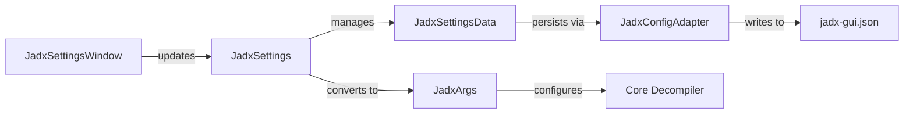

# GUI Application

Relevant source files

The following files were used as context for generating this wiki page:

- [README.md](https://github.com/skylot/jadx/blob/HEAD/README.md)
- [jadx-cli/src/main/java/jadx/cli/JCommanderWrapper.java](https://github.com/skylot/jadx/blob/HEAD/jadx-cli/src/main/java/jadx/cli/JCommanderWrapper.java)
- [jadx-cli/src/main/java/jadx/cli/JadxCLI.java](https://github.com/skylot/jadx/blob/HEAD/jadx-cli/src/main/java/jadx/cli/JadxCLI.java)
- [jadx-cli/src/main/java/jadx/cli/JadxCLIArgs.java](https://github.com/skylot/jadx/blob/HEAD/jadx-cli/src/main/java/jadx/cli/JadxCLIArgs.java)
- [jadx-cli/src/main/java/jadx/cli/LogHelper.java](https://github.com/skylot/jadx/blob/HEAD/jadx-cli/src/main/java/jadx/cli/LogHelper.java)
- [jadx-cli/src/test/java/jadx/cli/JadxCLIArgsTest.java](https://github.com/skylot/jadx/blob/HEAD/jadx-cli/src/test/java/jadx/cli/JadxCLIArgsTest.java)
- [jadx-core/src/main/java/jadx/api/JadxArgs.java](https://github.com/skylot/jadx/blob/HEAD/jadx-core/src/main/java/jadx/api/JadxArgs.java)
- [jadx-core/src/main/java/jadx/core/utils/files/FileUtils.java](https://github.com/skylot/jadx/blob/HEAD/jadx-core/src/main/java/jadx/core/utils/files/FileUtils.java)
- [jadx-core/src/main/java/jadx/core/xmlgen/BinaryXMLParser.java](https://github.com/skylot/jadx/blob/HEAD/jadx-core/src/main/java/jadx/core/xmlgen/BinaryXMLParser.java)
- [jadx-gui/src/main/java/jadx/gui/JadxGUI.java](https://github.com/skylot/jadx/blob/HEAD/jadx-gui/src/main/java/jadx/gui/JadxGUI.java)
- [jadx-gui/src/main/java/jadx/gui/JadxWrapper.java](https://github.com/skylot/jadx/blob/HEAD/jadx-gui/src/main/java/jadx/gui/JadxWrapper.java)
- [jadx-gui/src/main/java/jadx/gui/settings/JadxProject.java](https://github.com/skylot/jadx/blob/HEAD/jadx-gui/src/main/java/jadx/gui/settings/JadxProject.java)
- [jadx-gui/src/main/java/jadx/gui/settings/JadxSettings.java](https://github.com/skylot/jadx/blob/HEAD/jadx-gui/src/main/java/jadx/gui/settings/JadxSettings.java)
- [jadx-gui/src/main/java/jadx/gui/settings/data/ProjectData.java](https://github.com/skylot/jadx/blob/HEAD/jadx-gui/src/main/java/jadx/gui/settings/data/ProjectData.java)
- [jadx-gui/src/main/java/jadx/gui/settings/ui/JadxSettingsWindow.java](https://github.com/skylot/jadx/blob/HEAD/jadx-gui/src/main/java/jadx/gui/settings/ui/JadxSettingsWindow.java)
- [jadx-gui/src/main/java/jadx/gui/ui/MainWindow.java](https://github.com/skylot/jadx/blob/HEAD/jadx-gui/src/main/java/jadx/gui/ui/MainWindow.java)
- [jadx-gui/src/main/resources/i18n/Messages_de_DE.properties](https://github.com/skylot/jadx/blob/HEAD/jadx-gui/src/main/resources/i18n/Messages_de_DE.properties)
- [jadx-gui/src/main/resources/i18n/Messages_en_US.properties](https://github.com/skylot/jadx/blob/HEAD/jadx-gui/src/main/resources/i18n/Messages_en_US.properties)
- [jadx-gui/src/main/resources/i18n/Messages_es_ES.properties](https://github.com/skylot/jadx/blob/HEAD/jadx-gui/src/main/resources/i18n/Messages_es_ES.properties)
- [jadx-gui/src/main/resources/i18n/Messages_id_ID.properties](https://github.com/skylot/jadx/blob/HEAD/jadx-gui/src/main/resources/i18n/Messages_id_ID.properties)
- [jadx-gui/src/main/resources/i18n/Messages_ko_KR.properties](https://github.com/skylot/jadx/blob/HEAD/jadx-gui/src/main/resources/i18n/Messages_ko_KR.properties)
- [jadx-gui/src/main/resources/i18n/Messages_pt_BR.properties](https://github.com/skylot/jadx/blob/HEAD/jadx-gui/src/main/resources/i18n/Messages_pt_BR.properties)
- [jadx-gui/src/main/resources/i18n/Messages_ru_RU.properties](https://github.com/skylot/jadx/blob/HEAD/jadx-gui/src/main/resources/i18n/Messages_ru_RU.properties)
- [jadx-gui/src/main/resources/i18n/Messages_zh_CN.properties](https://github.com/skylot/jadx/blob/HEAD/jadx-gui/src/main/resources/i18n/Messages_zh_CN.properties)
- [jadx-gui/src/main/resources/i18n/Messages_zh_TW.properties](https://github.com/skylot/jadx/blob/HEAD/jadx-gui/src/main/resources/i18n/Messages_zh_TW.properties)

The `jadx-gui` module provides a Swing-based graphical user interface for decompiling Android applications and Java bytecode. This page documents the architecture, components, and subsystems that comprise the desktop application.

For information about the command-line interface, see [Command Line Interface](20_4-command-line-interface.md). For details about the core decompilation engine that the GUI wraps, see [Core Decompilation Engine](04_2-core-decompilation-engine.md).

## Overview

The GUI application is built around a hub-and-spoke architecture with `MainWindow` as the central orchestrator. The application manages file loading, project state, background decompilation tasks, code display, navigation, and user settings through a collection of loosely-coupled subsystems.

**Key Architectural Patterns:**
- **Hub-and-Spoke**: `MainWindow` coordinates 13+ subsystems without tight coupling. [jadx-gui/src/main/java/jadx/gui/ui/MainWindow.java:183-254](https://github.com/skylot/jadx/blob/HEAD/jadx-gui/src/main/java/jadx/gui/ui/MainWindow.java#L183-L254)
- **Facade Pattern**: `JadxWrapper` and `JadxSettings` provide simplified interfaces to complex subsystems. [jadx-gui/src/main/java/jadx/gui/JadxWrapper.java:1-50](https://github.com/skylot/jadx/blob/HEAD/jadx-gui/src/main/java/jadx/gui/JadxWrapper.java#L1-L50), [jadx-gui/src/main/java/jadx/gui/settings/JadxSettings.java:48-62](https://github.com/skylot/jadx/blob/HEAD/jadx-gui/src/main/java/jadx/gui/settings/JadxSettings.java#L48-L62)
- **MVC Separation**: Controllers manage behavior, while view components display data.
- **Event-Driven**: `JadxGuiEventsImpl` enables decoupled communication between components. [jadx-gui/src/main/java/jadx/gui/events/types/JadxGuiEventsImpl.java:1-30](https://github.com/skylot/jadx/blob/HEAD/jadx-gui/src/main/java/jadx/gui/events/types/JadxGuiEventsImpl.java#L1-L30)

Sources: [jadx-gui/src/main/java/jadx/gui/ui/MainWindow.java:183-254](https://github.com/skylot/jadx/blob/HEAD/jadx-gui/src/main/java/jadx/gui/ui/MainWindow.java#L183-L254), [jadx-gui/src/main/java/jadx/gui/JadxWrapper.java:1-50](https://github.com/skylot/jadx/blob/HEAD/jadx-gui/src/main/java/jadx/gui/JadxWrapper.java#L1-L50), [jadx-gui/src/main/java/jadx/gui/settings/JadxSettings.java:48-62](https://github.com/skylot/jadx/blob/HEAD/jadx-gui/src/main/java/jadx/gui/settings/JadxSettings.java#L48-L62)

## MainWindow: Central Hub

### Hub-and-Spoke Architecture

The diagram below illustrates how `MainWindow` serves as the central integration point for all GUI subsystems.

Title: MainWindow Subsystem Integration

```mermaid
graph TB
    MW["MainWindow<br/>(Central Hub)"]
    
    subgraph Core_Integration ["Core Integration"]
        JW["JadxWrapper"]
        JP["JadxProject"]
    end
    
    subgraph Controllers ["Controllers"]
        TC["TabsController"]
        NC["NavigationController"]
        SC["ShortcutsController"]
        ESM["EditorSyncManager"]
        ETM["EditorThemeManager"]
    end
    
    subgraph View_Components ["View Components"]
        Tree["JTree + JRoot"]
        TPane["TabbedPane"]
        Progress["ProgressPanel"]
        Issues["IssuesPanel"]
        Log["LogPanel"]
        Debug["JDebuggerPanel"]
    end
    
    subgraph Services ["Services"]
        BE["BackgroundExecutor"]
        TES["TreeExpansionService"]
        LR["LiveReloadWorker"]
        RM["RenameMappingsGui"]
        Cache["CacheObject + CacheManager"]
    end
    
    subgraph Settings_Events ["Settings & Events"]
        JS["JadxSettings"]
        Events["JadxGuiEventsImpl"]
    end
    
    MW --> JW
    MW --> JP
    MW --> TC
    MW --> NC
    MW --> SC
    MW --> ESM
    MW --> ETM
    MW --> BE
    MW --> TES
    MW --> LR
    MW --> RM
    MW --> Cache
    MW --> JS
    MW --> Events
    
    MW --> Tree
    MW --> TPane
    MW --> Progress
    MW --> Issues
    MW --> Log
    MW --> Debug
```

Sources: [jadx-gui/src/main/java/jadx/gui/ui/MainWindow.java:191-254](https://github.com/skylot/jadx/blob/HEAD/jadx-gui/src/main/java/jadx/gui/ui/MainWindow.java#L191-L254)

`MainWindow` maintains references to all major subsystems and coordinates their interactions. It implements the primary window lifecycle, menu system, toolbar, and file operations.

**Core Responsibilities:**
- Window management and layout (tree, tabs, panels). [jadx-gui/src/main/java/jadx/gui/ui/MainWindow.java:183-254](https://github.com/skylot/jadx/blob/HEAD/jadx-gui/src/main/java/jadx/gui/ui/MainWindow.java#L183-L254)
- Menu bar and toolbar initialization. [jadx-gui/src/main/java/jadx/gui/ui/MainWindow.java:150-151](https://github.com/skylot/jadx/blob/HEAD/jadx-gui/src/main/java/jadx/gui/ui/MainWindow.java#L150-L151)
- File and project operations (open, save, reload). [jadx-gui/src/main/java/jadx/gui/ui/MainWindow.java:337-567](https://github.com/skylot/jadx/blob/HEAD/jadx-gui/src/main/java/jadx/gui/ui/MainWindow.java#L337-L567)
- Background task coordination via `BackgroundExecutor`. [jadx-gui/src/main/java/jadx/gui/jobs/BackgroundExecutor.java:105-110](https://github.com/skylot/jadx/blob/HEAD/jadx-gui/src/main/java/jadx/gui/jobs/BackgroundExecutor.java#L105-L110)
- Event dispatching via `JadxGuiEventsImpl`. [jadx-gui/src/main/java/jadx/gui/events/types/JadxGuiEventsImpl.java:1-30](https://github.com/skylot/jadx/blob/HEAD/jadx-gui/src/main/java/jadx/gui/events/types/JadxGuiEventsImpl.java#L1-L30)

For details, see [Main Window and Core Architecture](14_3.1-main-window-and-core-architecture.md).

## Settings and Configuration

JADX GUI uses a persistent settings system centered around `JadxSettings`. This class acts as a facade for `JadxSettingsData`, which holds the actual configuration values and handles version upgrades. [jadx-gui/src/main/java/jadx/gui/settings/JadxSettings.java:88-101](https://github.com/skylot/jadx/blob/HEAD/jadx-gui/src/main/java/jadx/gui/settings/JadxSettings.java#L88-L101)

Title: Settings Data Flow

Sources: [jadx-gui/src/main/java/jadx/gui/settings/JadxSettings.java:48-141](https://github.com/skylot/jadx/blob/HEAD/jadx-gui/src/main/java/jadx/gui/settings/JadxSettings.java#L48-L141), [jadx-gui/src/main/java/jadx/gui/settings/ui/JadxSettingsWindow.java:123-149](https://github.com/skylot/jadx/blob/HEAD/jadx-gui/src/main/java/jadx/gui/settings/ui/JadxSettingsWindow.java#L123-L149)

**Key Components:**
- **JadxSettings**: The primary API for accessing and modifying application configuration, including font and shortcut management. [jadx-gui/src/main/java/jadx/gui/settings/JadxSettings.java:48-141](https://github.com/skylot/jadx/blob/HEAD/jadx-gui/src/main/java/jadx/gui/settings/JadxSettings.java#L48-L141)
- **JadxProject**: Manages project-specific state, such as file paths and renaming maps. [jadx-gui/src/main/java/jadx/gui/settings/JadxProject.java:120](https://github.com/skylot/jadx/blob/HEAD/jadx-gui/src/main/java/jadx/gui/settings/JadxProject.java#L120)
- **JadxSettingsWindow**: The UI dialog for user configuration, organized by categories like Deobfuscation and Appearance. [jadx-gui/src/main/java/jadx/gui/settings/ui/JadxSettingsWindow.java:123-149](https://github.com/skylot/jadx/blob/HEAD/jadx-gui/src/main/java/jadx/gui/settings/ui/JadxSettingsWindow.java#L123-L149)

For details, see [Settings and Configuration](15_3.2-settings-and-configuration.md).

## Code Display and Navigation

The code display system is built on `TabbedPane`, which manages multiple `ContentPanel` instances. Decompiled code is displayed in `CodeArea` (extending `AbstractCodeArea`), providing syntax highlighting and interactivity.

| Component | Class | Responsibility |
|-----------|-------|----------------|
| **Tabs Container** | `TabbedPane` | Manages the lifecycle of code and resource tabs. [jadx-gui/src/main/java/jadx/gui/ui/tab/TabbedPane.java:161](https://github.com/skylot/jadx/blob/HEAD/jadx-gui/src/main/java/jadx/gui/ui/tab/TabbedPane.java#L161) |
| **Tab Controller** | `TabsController` | Orchestrates opening, closing, and switching tabs. [jadx-gui/src/main/java/jadx/gui/ui/tab/TabsController.java:162](https://github.com/skylot/jadx/blob/HEAD/jadx-gui/src/main/java/jadx/gui/ui/tab/TabsController.java#L162) |
| **Navigation** | `NavigationController` | Maintains history for back/forward navigation. [jadx-gui/src/main/java/jadx/gui/ui/tab/NavigationController.java:159](https://github.com/skylot/jadx/blob/HEAD/jadx-gui/src/main/java/jadx/gui/ui/tab/NavigationController.java#L159) |
| **Code Editor** | `AbstractCodeArea` | Base class for syntax-highlighted code views. [jadx-gui/src/main/java/jadx/gui/ui/codearea/AbstractCodeArea.java:134](https://github.com/skylot/jadx/blob/HEAD/jadx-gui/src/main/java/jadx/gui/ui/codearea/AbstractCodeArea.java#L134) |

For details, see [Code Display and Navigation](16_3.3-code-display-and-navigation.md).

## Background Processing and Caching

To maintain UI responsiveness, JADX GUI offloads heavy operations like decompilation and indexing to the `BackgroundExecutor`.

- **BackgroundExecutor**: Manages a queue of `IBackgroundTask` implementations, such as `DecompileTask` and `ExportTask`. [jadx-gui/src/main/java/jadx/gui/jobs/BackgroundExecutor.java:105](https://github.com/skylot/jadx/blob/HEAD/jadx-gui/src/main/java/jadx/gui/jobs/BackgroundExecutor.java#L105)
- **Caching**: Employs a multi-tier strategy via `CacheManager` to store decompiled code and search indexes, supporting memory, disk, and hybrid modes defined in `CodeCacheMode`. [jadx-gui/src/main/java/jadx/gui/settings/JadxSettings.java:35](https://github.com/skylot/jadx/blob/HEAD/jadx-gui/src/main/java/jadx/gui/settings/JadxSettings.java#L35), [jadx-gui/src/main/java/jadx/gui/cache/manager/CacheManager.java:101](https://github.com/skylot/jadx/blob/HEAD/jadx-gui/src/main/java/jadx/gui/cache/manager/CacheManager.java#L101)

For details, see [Background Processing and Caching](17_3.4-background-processing-and-caching.md).

## Internationalization (i18n)

JADX GUI supports multiple languages through the `NLS` (National Language Support) system.

- **Resource Bundles**: Localized strings are stored in `Messages_*.properties` files within the `i18n` resource package. [jadx-gui/src/main/resources/i18n/Messages_en_US.properties:1-10](https://github.com/skylot/jadx/blob/HEAD/jadx-gui/src/main/resources/i18n/Messages_en_US.properties#L1-L10)
- **Language Support**: Currently supports 9 languages, including English [jadx-gui/src/main/resources/i18n/Messages_en_US.properties:1](https://github.com/skylot/jadx/blob/HEAD/jadx-gui/src/main/resources/i18n/Messages_en_US.properties#L1), Chinese [jadx-gui/src/main/resources/i18n/Messages_zh_CN.properties:1](https://github.com/skylot/jadx/blob/HEAD/jadx-gui/src/main/resources/i18n/Messages_zh_CN.properties#L1), German [jadx-gui/src/main/resources/i18n/Messages_de_DE.properties:1](https://github.com/skylot/jadx/blob/HEAD/jadx-gui/src/main/resources/i18n/Messages_de_DE.properties#L1), Spanish [jadx-gui/src/main/resources/i18n/Messages_es_ES.properties:1](https://github.com/skylot/jadx/blob/HEAD/jadx-gui/src/main/resources/i18n/Messages_es_ES.properties#L1), Korean [jadx-gui/src/main/resources/i18n/Messages_ko_KR.properties:1](https://github.com/skylot/jadx/blob/HEAD/jadx-gui/src/main/resources/i18n/Messages_ko_KR.properties#L1), and Portuguese [jadx-gui/src/main/resources/i18n/Messages_pt_BR.properties:1](https://github.com/skylot/jadx/blob/HEAD/jadx-gui/src/main/resources/i18n/Messages_pt_BR.properties#L1).

For details, see [Internationalization](18_3.5-internationalization.md).

## Search and Dialogs

The GUI provides extensive search capabilities and specialized dialogs for deep analysis.

- **Search Infrastructure**: `SearchDialog` and `CommonSearchDialog` provide interfaces for text, class, and field searches, utilizing the `TextSearchIndex`. [jadx-gui/src/main/java/jadx/gui/ui/dialog/SearchDialog.java:143](https://github.com/skylot/jadx/blob/HEAD/jadx-gui/src/main/java/jadx/gui/ui/dialog/SearchDialog.java#L143)
- **Specialized Dialogs**:
    - `ADBDialog**: For Android device debugger integration. [jadx-gui/src/main/java/jadx/gui/ui/dialog/ADBDialog.java:138](https://github.com/skylot/jadx/blob/HEAD/jadx-gui/src/main/java/jadx/gui/ui/dialog/ADBDialog.java#L138)
    - `RenameService**: For refactoring and manual deobfuscation. [jadx-gui/src/main/java/jadx/gui/events/services/RenameService.java:103](https://github.com/skylot/jadx/blob/HEAD/jadx-gui/src/main/java/jadx/gui/events/services/RenameService.java#L103)
    - `AboutDialog**: Version and license information. [jadx-gui/src/main/java/jadx/gui/ui/dialog/AboutDialog.java:139](https://github.com/skylot/jadx/blob/HEAD/jadx-gui/src/main/java/jadx/gui/ui/dialog/AboutDialog.java#L139)

For details, see [Search and Dialogs](19_3.6-search-and-dialogs.md).