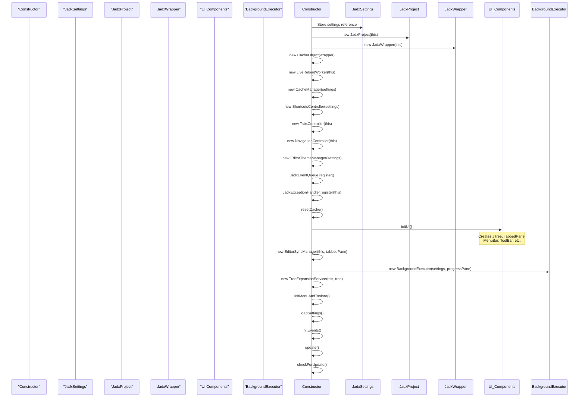
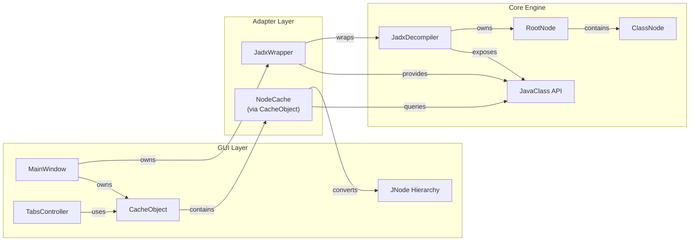
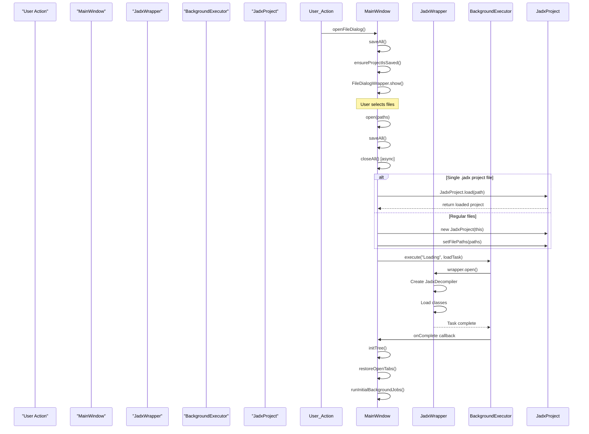
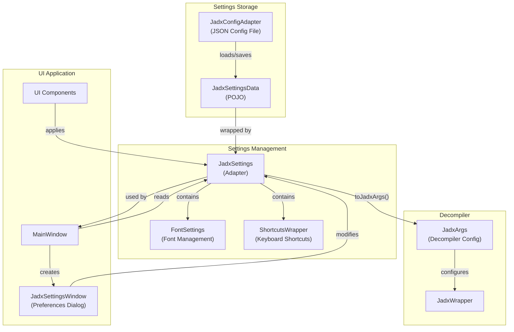
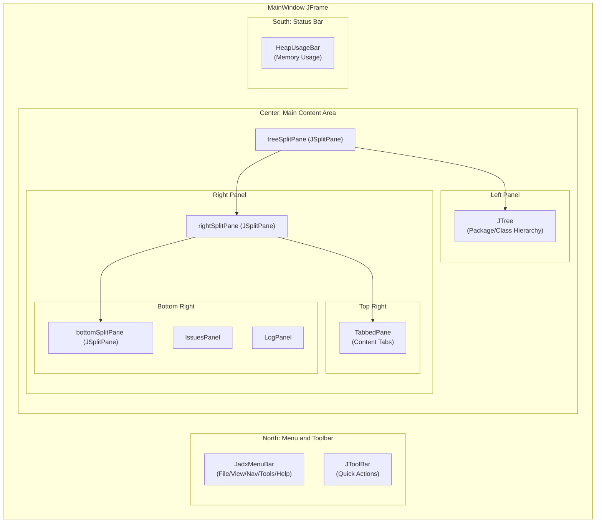

# Main Window and Core Architecture

<details>
<summary>Relevant source files</summary>

The following files were used as context for generating this wiki page:

- [jadx-gui/src/main/java/jadx/gui/settings/JadxProject.java](https://github.com/skylot/jadx/blob/HEAD/jadx-gui/src/main/java/jadx/gui/settings/JadxProject.java)
- [jadx-gui/src/main/java/jadx/gui/settings/JadxSettings.java](https://github.com/skylot/jadx/blob/HEAD/jadx-gui/src/main/java/jadx/gui/settings/JadxSettings.java)
- [jadx-gui/src/main/java/jadx/gui/settings/TabStateViewAdapter.java](https://github.com/skylot/jadx/blob/HEAD/jadx-gui/src/main/java/jadx/gui/settings/TabStateViewAdapter.java)
- [jadx-gui/src/main/java/jadx/gui/settings/data/ProjectData.java](https://github.com/skylot/jadx/blob/HEAD/jadx-gui/src/main/java/jadx/gui/settings/data/ProjectData.java)
- [jadx-gui/src/main/java/jadx/gui/settings/data/TabViewState.java](https://github.com/skylot/jadx/blob/HEAD/jadx-gui/src/main/java/jadx/gui/settings/data/TabViewState.java)
- [jadx-gui/src/main/java/jadx/gui/settings/ui/JadxSettingsWindow.java](https://github.com/skylot/jadx/blob/HEAD/jadx-gui/src/main/java/jadx/gui/settings/ui/JadxSettingsWindow.java)
- [jadx-gui/src/main/java/jadx/gui/treemodel/JClass.java](https://github.com/skylot/jadx/blob/HEAD/jadx-gui/src/main/java/jadx/gui/treemodel/JClass.java)
- [jadx-gui/src/main/java/jadx/gui/treemodel/JField.java](https://github.com/skylot/jadx/blob/HEAD/jadx-gui/src/main/java/jadx/gui/treemodel/JField.java)
- [jadx-gui/src/main/java/jadx/gui/treemodel/JLoadableNode.java](https://github.com/skylot/jadx/blob/HEAD/jadx-gui/src/main/java/jadx/gui/treemodel/JLoadableNode.java)
- [jadx-gui/src/main/java/jadx/gui/treemodel/JMethod.java](https://github.com/skylot/jadx/blob/HEAD/jadx-gui/src/main/java/jadx/gui/treemodel/JMethod.java)
- [jadx-gui/src/main/java/jadx/gui/treemodel/JNode.java](https://github.com/skylot/jadx/blob/HEAD/jadx-gui/src/main/java/jadx/gui/treemodel/JNode.java)
- [jadx-gui/src/main/java/jadx/gui/treemodel/JPackage.java](https://github.com/skylot/jadx/blob/HEAD/jadx-gui/src/main/java/jadx/gui/treemodel/JPackage.java)
- [jadx-gui/src/main/java/jadx/gui/treemodel/JResSearchNode.java](https://github.com/skylot/jadx/blob/HEAD/jadx-gui/src/main/java/jadx/gui/treemodel/JResSearchNode.java)
- [jadx-gui/src/main/java/jadx/gui/treemodel/JResource.java](https://github.com/skylot/jadx/blob/HEAD/jadx-gui/src/main/java/jadx/gui/treemodel/JResource.java)
- [jadx-gui/src/main/java/jadx/gui/treemodel/JRoot.java](https://github.com/skylot/jadx/blob/HEAD/jadx-gui/src/main/java/jadx/gui/treemodel/JRoot.java)
- [jadx-gui/src/main/java/jadx/gui/treemodel/JSources.java](https://github.com/skylot/jadx/blob/HEAD/jadx-gui/src/main/java/jadx/gui/treemodel/JSources.java)
- [jadx-gui/src/main/java/jadx/gui/treemodel/JSubResource.java](https://github.com/skylot/jadx/blob/HEAD/jadx-gui/src/main/java/jadx/gui/treemodel/JSubResource.java)
- [jadx-gui/src/main/java/jadx/gui/ui/MainWindow.java](https://github.com/skylot/jadx/blob/HEAD/jadx-gui/src/main/java/jadx/gui/ui/MainWindow.java)
- [jadx-gui/src/main/java/jadx/gui/ui/codearea/BinaryContentPanel.java](https://github.com/skylot/jadx/blob/HEAD/jadx-gui/src/main/java/jadx/gui/ui/codearea/BinaryContentPanel.java)
- [jadx-gui/src/main/java/jadx/gui/ui/codearea/EditorViewState.java](https://github.com/skylot/jadx/blob/HEAD/jadx-gui/src/main/java/jadx/gui/ui/codearea/EditorViewState.java)
- [jadx-gui/src/main/java/jadx/gui/ui/hexviewer/HexPreviewPanel.java](https://github.com/skylot/jadx/blob/HEAD/jadx-gui/src/main/java/jadx/gui/ui/hexviewer/HexPreviewPanel.java)
- [jadx-gui/src/main/java/jadx/gui/utils/res/ResTableHelper.java](https://github.com/skylot/jadx/blob/HEAD/jadx-gui/src/main/java/jadx/gui/utils/res/ResTableHelper.java)
- [jadx-gui/src/main/resources/i18n/Messages_de_DE.properties](https://github.com/skylot/jadx/blob/HEAD/jadx-gui/src/main/resources/i18n/Messages_de_DE.properties)
- [jadx-gui/src/main/resources/i18n/Messages_en_US.properties](https://github.com/skylot/jadx/blob/HEAD/jadx-gui/src/main/resources/i18n/Messages_en_US.properties)
- [jadx-gui/src/main/resources/i18n/Messages_es_ES.properties](https://github.com/skylot/jadx/blob/HEAD/jadx-gui/src/main/resources/i18n/Messages_es_ES.properties)
- [jadx-gui/src/main/resources/i18n/Messages_id_ID.properties](https://github.com/skylot/jadx/blob/HEAD/jadx-gui/src/main/resources/i18n/Messages_id_ID.properties)
- [jadx-gui/src/main/resources/i18n/Messages_ko_KR.properties](https://github.com/skylot/jadx/blob/HEAD/jadx-gui/src/main/resources/i18n/Messages_ko_KR.properties)
- [jadx-gui/src/main/resources/i18n/Messages_pt_BR.properties](https://github.com/skylot/jadx/blob/HEAD/jadx-gui/src/main/resources/i18n/Messages_pt_BR.properties)
- [jadx-gui/src/main/resources/i18n/Messages_ru_RU.properties](https://github.com/skylot/jadx/blob/HEAD/jadx-gui/src/main/resources/i18n/Messages_ru_RU.properties)
- [jadx-gui/src/main/resources/i18n/Messages_zh_CN.properties](https://github.com/skylot/jadx/blob/HEAD/jadx-gui/src/main/resources/i18n/Messages_zh_CN.properties)
- [jadx-gui/src/main/resources/i18n/Messages_zh_TW.properties](https://github.com/skylot/jadx/blob/HEAD/jadx-gui/src/main/resources/i18n/Messages_zh_TW.properties)

</details>


## Purpose and Scope

This document describes the `MainWindow` class and its role as the central orchestrator of the JADX GUI application. It covers the initialization sequence, core component relationships, integration with the decompilation engine via `JadxWrapper`, and the overall architectural patterns that govern the GUI's operation.

For information about specific UI components like code display areas and tabs, see [Code Display and Navigation](16_3.3-code-display-and-navigation.md). For settings management details, see [Settings and Configuration](15_3.2-settings-and-configuration.md). For background task execution and caching strategies, see [Background Processing and Caching](17_3.4-background-processing-and-caching.md).

**Sources:** [jadx-gui/src/main/java/jadx/gui/ui/MainWindow.java:1-183](https://github.com/skylot/jadx/blob/HEAD/jadx-gui/src/main/java/jadx/gui/ui/MainWindow.java#L1-L183)

---

## MainWindow: The Application Orchestrator

`MainWindow` extends `JFrame` and serves as the primary window and coordination hub for the entire JADX GUI application. It is responsible for:

- Initializing and coordinating all major subsystems (decompiler bridge, UI components, caching, background execution) [jadx-gui/src/main/java/jadx/gui/ui/MainWindow.java:255-283](https://github.com/skylot/jadx/blob/HEAD/jadx-gui/src/main/java/jadx/gui/ui/MainWindow.java#L255-L283)
- Managing the application lifecycle (opening/closing projects, saving state, handling user actions) [jadx-gui/src/main/java/jadx/gui/ui/MainWindow.java:489-620](https://github.com/skylot/jadx/blob/HEAD/jadx-gui/src/main/java/jadx/gui/ui/MainWindow.java#L489-L620)
- Orchestrating communication between the core decompilation engine and UI components [jadx-gui/src/main/java/jadx/gui/ui/MainWindow.java:302-316](https://github.com/skylot/jadx/blob/HEAD/jadx-gui/src/main/java/jadx/gui/ui/MainWindow.java#L302-L316)
- Maintaining application state through the `JadxProject` and `JadxSettings` objects [jadx-gui/src/main/java/jadx/gui/ui/MainWindow.java:192-194](https://github.com/skylot/jadx/blob/HEAD/jadx-gui/src/main/java/jadx/gui/ui/MainWindow.java#L192-L194)

The class is instantiated by `JadxGUI.main()` and remains active for the application's lifetime.

**Sources:** [jadx-gui/src/main/java/jadx/gui/ui/MainWindow.java:183-283](https://github.com/skylot/jadx/blob/HEAD/jadx-gui/src/main/java/jadx/gui/ui/MainWindow.java#L183-L283)

---

## Core Component Architecture

### Component Diagram: MainWindow Internal Structure

```mermaid
graph TB
    MW["MainWindow<br/>(JFrame)"]
    
    subgraph Backend_Integration ["Backend Integration"]
        JW["JadxWrapper<br/>Decompiler Bridge"]
        BE["BackgroundExecutor<br/>Async Tasks"]
        CO["CacheObject<br/>Node Cache"]
        CM["CacheManager<br/>Disk Cache"]
    end
    
    subgraph Settings_State ["Settings & State"]
        JS["JadxSettings<br/>User Preferences"]
        JP["JadxProject<br/>Project State"]
        TES["TreeExpansionService<br/>Tree State"]
    end
    
    subgraph UI_Controllers ["UI Controllers"]
        TC["TabsController<br/>Tab Management"]
        NC["NavigationController<br/>History Management"]
        ESM["EditorSyncManager<br/>Editor Sync"]
        ETM["EditorThemeManager<br/>Theme Management"]
    end
    
    subgraph UI_Components ["UI Components"]
        MB["JadxMenuBar<br/>Menu System"]
        TB["JToolBar<br/>Tool Bar"]
        TR["JTree<br/>Package/Class Tree"]
        TP["TabbedPane<br/>Content Tabs"]
        PP["ProgressPanel<br/>Task Status"]
        HUB["HeapUsageBar<br/>Memory Monitor"]
    end
    
    subgraph Supporting_Services ["Supporting Services"]
        SC["ShortcutsController<br/>Keyboard Shortcuts"]
        LRW["LiveReloadWorker<br/>File Watching"]
        RMG["RenameMappingsGui<br/>Mappings Management"]
        EV["JadxGuiEventsImpl<br/>Event Bus"]
    end
    
    MW --> JW
    MW --> BE
    MW --> CO
    MW --> CM
    MW --> JS
    MW --> JP
    MW --> TES
    MW --> TC
    MW --> NC
    MW --> ESM
    MW --> ETM
    MW --> MB
    MW --> TB
    MW --> TR
    MW --> TP
    MW --> PP
    MW --> HUB
    MW --> SC
    MW --> LRW
    MW --> RMG
    MW --> EV
    
    TC --> TP
    NC --> TC
    JW --> CO
    BE --> PP
```



**Sources:** [jadx-gui/src/main/java/jadx/gui/ui/MainWindow.java:191-253](https://github.com/skylot/jadx/blob/HEAD/jadx-gui/src/main/java/jadx/gui/ui/MainWindow.java#L191-L253)

---

## Key Components and Their Responsibilities

### Backend Integration Layer

| Component | Type | Responsibility |
|-----------|------|---------------|
| `JadxWrapper` | Decompiler Bridge | Wraps `JadxDecompiler` and exposes decompilation API to GUI; manages decompiler lifecycle [jadx-gui/src/main/java/jadx/gui/JadxWrapper.java:53-118](https://github.com/skylot/jadx/blob/HEAD/jadx-gui/src/main/java/jadx/gui/JadxWrapper.java#L53-L118) |
| `BackgroundExecutor` | Task Manager | Executes long-running tasks (decompilation, indexing) asynchronously with progress tracking [jadx-gui/src/main/java/jadx/gui/jobs/BackgroundExecutor.java:1-50](https://github.com/skylot/jadx/blob/HEAD/jadx-gui/src/main/java/jadx/gui/jobs/BackgroundExecutor.java#L1-L50) |
| `CacheObject` | Cache Coordinator | Provides unified access to `JNodeCache` for converting between API objects and tree nodes [jadx-gui/src/main/java/jadx/gui/utils/CacheObject.java:1-30](https://github.com/skylot/jadx/blob/HEAD/jadx-gui/src/main/java/jadx/gui/utils/CacheObject.java#L1-L30) |
| `CacheManager` | Cache Strategy | Manages disk-based code cache lifecycle and storage location [jadx-gui/src/main/java/jadx/gui/cache/manager/CacheManager.java:1-40](https://github.com/skylot/jadx/blob/HEAD/jadx-gui/src/main/java/jadx/gui/cache/manager/CacheManager.java#L1-L40) |

### Settings and State Management

| Component | Type | Responsibility |
|-----------|------|---------------|
| `JadxSettings` | Configuration | Persists user preferences (deobfuscation, themes, fonts, shortcuts) to disk [jadx-gui/src/main/java/jadx/gui/settings/JadxSettings.java:48-119](https://github.com/skylot/jadx/blob/HEAD/jadx-gui/src/main/java/jadx/gui/settings/JadxSettings.java#L48-L119) |
| `JadxProject` | Project State | Maintains project-specific state (file paths, open tabs, tree expansions, cache directory) [jadx-gui/src/main/java/jadx/gui/settings/JadxProject.java:1-100](https://github.com/skylot/jadx/blob/HEAD/jadx-gui/src/main/java/jadx/gui/settings/JadxProject.java#L1-L100) |
| `TreeExpansionService` | UI State | Saves and restores tree expansion state across sessions [jadx-gui/src/main/java/jadx/gui/tree/TreeExpansionService.java:1-50](https://github.com/skylot/jadx/blob/HEAD/jadx-gui/src/main/java/jadx/gui/tree/TreeExpansionService.java#L1-L50) |

### UI Controllers

| Component | Type | Responsibility |
|-----------|------|---------------|
| `TabsController` | Tab Lifecycle | Manages content tabs (open, close, pin, bookmark); coordinates with `TabbedPane` [jadx-gui/src/main/java/jadx/gui/ui/tab/TabsController.java:1-100](https://github.com/skylot/jadx/blob/HEAD/jadx-gui/src/main/java/jadx/gui/ui/tab/TabsController.java#L1-L100) |
| `NavigationController` | History Stack | Implements back/forward navigation through previously viewed code locations [jadx-gui/src/main/java/jadx/gui/ui/tab/NavigationController.java:1-50](https://github.com/skylot/jadx/blob/HEAD/jadx-gui/src/main/java/jadx/gui/ui/tab/NavigationController.java#L1-L50) |
| `EditorSyncManager` | Editor Coordination | Synchronizes cursor positions and selections across multiple editor views [jadx-gui/src/main/java/jadx/gui/ui/tab/EditorSyncManager.java:1-50](https://github.com/skylot/jadx/blob/HEAD/jadx-gui/src/main/java/jadx/gui/ui/tab/EditorSyncManager.java#L1-L50) |
| `EditorThemeManager` | Theme System | Manages syntax highlighting themes and applies them to code areas [jadx-gui/src/main/java/jadx/gui/ui/codearea/theme/EditorThemeManager.java:1-50](https://github.com/skylot/jadx/blob/HEAD/jadx-gui/src/main/java/jadx/gui/ui/codearea/theme/EditorThemeManager.java#L1-L50) |

### UI Component Layer

| Component | Type | Responsibility |
|-----------|------|---------------|
| `JTree tree` | Navigation Tree | Displays package/class hierarchy; uses `JRoot` as model root with `JNode` hierarchy [jadx-gui/src/main/java/jadx/gui/ui/MainWindow.java:211-215](https://github.com/skylot/jadx/blob/HEAD/jadx-gui/src/main/java/jadx/gui/ui/MainWindow.java#L211-L215) |
| `TabbedPane` | Tab Container | Swing component displaying open tabs; managed by `TabsController` [jadx-gui/src/main/java/jadx/gui/ui/tab/TabbedPane.java:1-100](https://github.com/skylot/jadx/blob/HEAD/jadx-gui/src/main/java/jadx/gui/ui/tab/TabbedPane.java#L1-L100) |
| `JadxMenuBar` | Menu System | Top-level menu bar with File/View/Navigation/Tools/Help menus [jadx-gui/src/main/java/jadx/gui/ui/menu/JadxMenuBar.java:1-100](https://github.com/skylot/jadx/blob/HEAD/jadx-gui/src/main/java/jadx/gui/ui/menu/JadxMenuBar.java#L1-L100) |
| `ProgressPanel` | Task Display | Shows background task progress and allows cancellation [jadx-gui/src/main/java/jadx/gui/ui/panel/ProgressPanel.java:1-50](https://github.com/skylot/jadx/blob/HEAD/jadx-gui/src/main/java/jadx/gui/ui/panel/ProgressPanel.java#L1-L50) |
| `HeapUsageBar` | Memory Monitor | Displays JVM heap usage in real-time [jadx-gui/src/main/java/jadx/gui/ui/MainWindow.java:248](https://github.com/skylot/jadx/blob/HEAD/jadx-gui/src/main/java/jadx/gui/ui/MainWindow.java#L248) |

**Sources:** [jadx-gui/src/main/java/jadx/gui/ui/MainWindow.java:191-253](https://github.com/skylot/jadx/blob/HEAD/jadx-gui/src/main/java/jadx/gui/ui/MainWindow.java#L191-L253), [jadx-gui/src/main/java/jadx/gui/settings/JadxSettings.java:48-70](https://github.com/skylot/jadx/blob/HEAD/jadx-gui/src/main/java/jadx/gui/settings/JadxSettings.java#L48-L70)

---

## Initialization Sequence

### MainWindow Constructor Flow



The initialization follows a strict order:

1. **Settings and State Setup**: Core configuration objects (`JadxSettings`, `JadxProject`) are initialized first [jadx-gui/src/main/java/jadx/gui/ui/MainWindow.java:256-263](https://github.com/skylot/jadx/blob/HEAD/jadx-gui/src/main/java/jadx/gui/ui/MainWindow.java#L256-L263)
2. **Backend Services**: Decompiler wrapper and cache infrastructure are created [jadx-gui/src/main/java/jadx/gui/ui/MainWindow.java:258-262](https://github.com/skylot/jadx/blob/HEAD/jadx-gui/src/main/java/jadx/gui/ui/MainWindow.java#L258-L262)
3. **UI Framework**: Base UI components (tree, tabs, panels) are constructed via `initUI()` [jadx-gui/src/main/java/jadx/gui/ui/MainWindow.java:271](https://github.com/skylot/jadx/blob/HEAD/jadx-gui/src/main/java/jadx/gui/ui/MainWindow.java#L271)
4. **Integration Layer**: Services that connect UI to backend (sync manager, background executor) are initialized [jadx-gui/src/main/java/jadx/gui/ui/MainWindow.java:272-274](https://github.com/skylot/jadx/blob/HEAD/jadx-gui/src/main/java/jadx/gui/ui/MainWindow.java#L272-L274)
5. **User Interface Finalization**: Menu/toolbar setup, settings load, event registration [jadx-gui/src/main/java/jadx/gui/ui/MainWindow.java:275-279](https://github.com/skylot/jadx/blob/HEAD/jadx-gui/src/main/java/jadx/gui/ui/MainWindow.java#L275-L279)
6. **Post-Init Tasks**: UI refresh and update check [jadx-gui/src/main/java/jadx/gui/ui/MainWindow.java:281-282](https://github.com/skylot/jadx/blob/HEAD/jadx-gui/src/main/java/jadx/gui/ui/MainWindow.java#L281-L282)

**Sources:** [jadx-gui/src/main/java/jadx/gui/ui/MainWindow.java:255-283](https://github.com/skylot/jadx/blob/HEAD/jadx-gui/src/main/java/jadx/gui/ui/MainWindow.java#L255-L283)

### Post-Constructor Initialization

After construction, `init()` must be called to finalize setup:

```java
public void init() {
    pack();
    setLocationAndPosition();
    treeSplitPane.setDividerLocation(settings.getTreeWidth());
    heapUsageBar.setVisible(settings.isShowHeapUsageBar());
    setVisible(true);
    processCommandLineArgs();
}
```

This method sizes the window, restores saved window position or centers on screen, restores UI component states from settings, makes the window visible, and processes command-line arguments (e.g., auto-open files) [jadx-gui/src/main/java/jadx/gui/ui/MainWindow.java:285-292](https://github.com/skylot/jadx/blob/HEAD/jadx-gui/src/main/java/jadx/gui/ui/MainWindow.java#L285-L292).

**Sources:** [jadx-gui/src/main/java/jadx/gui/ui/MainWindow.java:285-292](https://github.com/skylot/jadx/blob/HEAD/jadx-gui/src/main/java/jadx/gui/ui/MainWindow.java#L285-L292)

---

## JadxWrapper: Bridge to Decompilation Engine

### Architecture and Responsibilities

`JadxWrapper` serves as the adapter layer between the GUI and the core `JadxDecompiler` engine. It provides:

- **Lifecycle Management**: Creates, configures, and disposes of `JadxDecompiler` instances [jadx-gui/src/main/java/jadx/gui/JadxWrapper.java:66-88](https://github.com/skylot/jadx/blob/HEAD/jadx-gui/src/main/java/jadx/gui/JadxWrapper.java#L66-L88)
- **API Translation**: Converts between GUI data structures (`JNode` hierarchy) and core API objects (`JavaClass`, `JavaMethod`, `JavaField`) [jadx-gui/src/main/java/jadx/gui/JadxWrapper.java:197-220](https://github.com/skylot/jadx/blob/HEAD/jadx-gui/src/main/java/jadx/gui/JadxWrapper.java#L197-L220)
- **Resource Access**: Provides access to decompiled classes, methods, and resources [jadx-gui/src/main/java/jadx/gui/JadxWrapper.java:197-220](https://github.com/skylot/jadx/blob/HEAD/jadx-gui/src/main/java/jadx/gui/JadxWrapper.java#L197-L220)
- **Search Services**: Exposes search functionality for classes by name or alias [jadx-gui/src/main/java/jadx/gui/JadxWrapper.java:230-250](https://github.com/skylot/jadx/blob/HEAD/jadx-gui/src/main/java/jadx/gui/JadxWrapper.java#L230-L250)

### JadxWrapper Integration Pattern



The wrapper pattern ensures that the GUI is decoupled from internal engine details. When the GUI needs to display code, it requests a `JavaClass` from `JadxWrapper`, which internally queries the `JadxDecompiler` [jadx-gui/src/main/java/jadx/gui/JadxWrapper.java:197](https://github.com/skylot/jadx/blob/HEAD/jadx-gui/src/main/java/jadx/gui/JadxWrapper.java#L197). To navigate, it uses `CacheObject.getNodeCache()` to convert API objects to `JNode` instances for the tree [jadx-gui/src/main/java/jadx/gui/ui/MainWindow.java:302-316](https://github.com/skylot/jadx/blob/HEAD/jadx-gui/src/main/java/jadx/gui/ui/MainWindow.java#L302-L316).

**Sources:** [jadx-gui/src/main/java/jadx/gui/ui/MainWindow.java:100](https://github.com/skylot/jadx/blob/HEAD/jadx-gui/src/main/java/jadx/gui/ui/MainWindow.java#L100), [jadx-gui/src/main/java/jadx/gui/JadxWrapper.java:53-118](https://github.com/skylot/jadx/blob/HEAD/jadx-gui/src/main/java/jadx/gui/JadxWrapper.java#L53-L118)

---

## File Opening and Project Management

### File Opening Flow



### Project State Management

The `JadxProject` class maintains the list of input files, currently open tabs with their view states, tree expansion states, and the cache directory location [jadx-gui/src/main/java/jadx/gui/settings/JadxProject.java:1-100](https://github.com/skylot/jadx/blob/HEAD/jadx-gui/src/main/java/jadx/gui/settings/JadxProject.java#L1-L100). Projects can be persisted to `.jadx` files to save the workspace.

**Sources:** [jadx-gui/src/main/java/jadx/gui/ui/MainWindow.java:336-596](https://github.com/skylot/jadx/blob/HEAD/jadx-gui/src/main/java/jadx/gui/ui/MainWindow.java#L336-L596), [jadx-gui/src/main/java/jadx/gui/settings/JadxProject.java:1-100](https://github.com/skylot/jadx/blob/HEAD/jadx-gui/src/main/java/jadx/gui/settings/JadxProject.java#L1-L100)

---

## Settings Integration

### Settings Flow Architecture



### Settings Categories

Settings are organized into functional groups:

| Group | Key Settings | Applied To |
|-------|-------------|-----------|
| **Decompilation** | `decompilationMode`, `showInconsistentCode` | `JadxArgs` passed to decompiler [jadx-gui/src/main/java/jadx/gui/settings/JadxSettings.java:139-141](https://github.com/skylot/jadx/blob/HEAD/jadx-gui/src/main/java/jadx/gui/settings/JadxSettings.java#L139-L141) |
| **Deobfuscation** | `deobfuscationOn`, `deobfuscationMinLength` | Decompiler config and reload trigger [jadx-gui/src/main/java/jadx/gui/settings/JadxSettings.java:107-113](https://github.com/skylot/jadx/blob/HEAD/jadx-gui/src/main/java/jadx/gui/settings/JadxSettings.java#L107-L113) |
| **Appearance** | `lafTheme`, `editorTheme`, `uiZoom` | UI components and theme manager [jadx-gui/src/main/java/jadx/gui/settings/JadxSettings.java:228-250](https://github.com/skylot/jadx/blob/HEAD/jadx-gui/src/main/java/jadx/gui/settings/JadxSettings.java#L228-L250) |
| **Project** | `autoStartJobs`, `codeCacheMode` | Background executor and cache [jadx-gui/src/main/java/jadx/gui/settings/JadxSettings.java:175-181](https://github.com/skylot/jadx/blob/HEAD/jadx-gui/src/main/java/jadx/gui/settings/JadxSettings.java#L175-L181) |

**Sources:** [jadx-gui/src/main/java/jadx/gui/settings/JadxSettings.java:48-142](https://github.com/skylot/jadx/blob/HEAD/jadx-gui/src/main/java/jadx/gui/settings/JadxSettings.java#L48-L142), [jadx-gui/src/main/java/jadx/gui/settings/ui/JadxSettingsWindow.java:1-121](https://github.com/skylot/jadx/blob/HEAD/jadx-gui/src/main/java/jadx/gui/settings/ui/JadxSettingsWindow.java#L1-L121)

---

## UI Component Layout

### Main Window Structure



The layout uses nested `JSplitPane` components to create a flexible interface. `treeSplitPane` separates the navigation tree from the content area [jadx-gui/src/main/java/jadx/gui/ui/MainWindow.java:211](https://github.com/skylot/jadx/blob/HEAD/jadx-gui/src/main/java/jadx/gui/ui/MainWindow.java#L211), while `rightSplitPane` and `bottomSplitPane` manage the code tabs and utility panels like logs and issues [jadx-gui/src/main/java/jadx/gui/ui/MainWindow.java:212-214](https://github.com/skylot/jadx/blob/HEAD/jadx-gui/src/main/java/jadx/gui/ui/MainWindow.java#L212-L214).

**Sources:** [jadx-gui/src/main/java/jadx/gui/ui/MainWindow.java:211-215](https://github.com/skylot/jadx/blob/HEAD/jadx-gui/src/main/java/jadx/gui/ui/MainWindow.java#L211-L215)

---

## Event System and Action Handling

### Event Architecture

`MainWindow` registers listeners for global and local events in `initEvents()` [jadx-gui/src/main/java/jadx/gui/ui/MainWindow.java:666-669](https://github.com/skylot/jadx/blob/HEAD/jadx-gui/src/main/java/jadx/gui/ui/MainWindow.java#L666-L669).

| Event Type | Trigger | Handler | Action |
|------------|---------|---------|--------|
| `ReloadProject` | Settings change | `MainWindow` | Calls `reopen()` [jadx-gui/src/main/java/jadx/gui/ui/MainWindow.java:666](https://github.com/skylot/jadx/blob/HEAD/jadx-gui/src/main/java/jadx/gui/ui/MainWindow.java#L666) |
| Tree node click | User interaction | `MainWindow` | Opens class/resource in tab [jadx-gui/src/main/java/jadx/gui/ui/MainWindow.java:893-943](https://github.com/skylot/jadx/blob/HEAD/jadx-gui/src/main/java/jadx/gui/ui/MainWindow.java#L893-L943) |

**Sources:** [jadx-gui/src/main/java/jadx/gui/ui/MainWindow.java:666-669](https://github.com/skylot/jadx/blob/HEAD/jadx-gui/src/main/java/jadx/gui/ui/MainWindow.java#L666-L669), [jadx-gui/src/main/java/jadx/gui/ui/MainWindow.java:893-943](https://github.com/skylot/jadx/blob/HEAD/jadx-gui/src/main/java/jadx/gui/ui/MainWindow.java#L893-L943)

---

## Internationalization Support

The GUI supports multiple languages through the NLS (National Language Support) system and property files:
- **English**: `Messages_en_US.properties` [jadx-gui/src/main/resources/i18n/Messages_en_US.properties:1](https://github.com/skylot/jadx/blob/HEAD/jadx-gui/src/main/resources/i18n/Messages_en_US.properties#L1)
- **Chinese (Simplified)**: `Messages_zh_CN.properties` [jadx-gui/src/main/resources/i18n/Messages_zh_CN.properties:1](https://github.com/skylot/jadx/blob/HEAD/jadx-gui/src/main/resources/i18n/Messages_zh_CN.properties#L1)
- **Chinese (Traditional)**: `Messages_zh_TW.properties` [jadx-gui/src/main/resources/i18n/Messages_zh_TW.properties:1](https://github.com/skylot/jadx/blob/HEAD/jadx-gui/src/main/resources/i18n/Messages_zh_TW.properties#L1)
- **German**: `Messages_de_DE.properties` [jadx-gui/src/main/resources/i18n/Messages_de_DE.properties:1](https://github.com/skylot/jadx/blob/HEAD/jadx-gui/src/main/resources/i18n/Messages_de_DE.properties#L1)
- **Spanish**: `Messages_es_ES.properties` [jadx-gui/src/main/resources/i18n/Messages_es_ES.properties:1](https://github.com/skylot/jadx/blob/HEAD/jadx-gui/src/main/resources/i18n/Messages_es_ES.properties#L1)
- **Korean**: `Messages_ko_KR.properties` [jadx-gui/src/main/resources/i18n/Messages_ko_KR.properties:1](https://github.com/skylot/jadx/blob/HEAD/jadx-gui/src/main/resources/i18n/Messages_ko_KR.properties#L1)
- **Portuguese**: `Messages_pt_BR.properties` [jadx-gui/src/main/resources/i18n/Messages_pt_BR.properties:1](https://github.com/skylot/jadx/blob/HEAD/jadx-gui/src/main/resources/i18n/Messages_pt_BR.properties#L1)
- **Russian**: `Messages_ru_RU.properties` [jadx-gui/src/main/resources/i18n/Messages_ru_RU.properties:1](https://github.com/skylot/jadx/blob/HEAD/jadx-gui/src/main/resources/i18n/Messages_ru_RU.properties#L1)
- **Indonesian**: `Messages_id_ID.properties` [jadx-gui/src/main/resources/i18n/Messages_id_ID.properties:1](https://github.com/skylot/jadx/blob/HEAD/jadx-gui/src/main/resources/i18n/Messages_id_ID.properties#L1)

**Sources:** [jadx-gui/src/main/resources/i18n/Messages_en_US.properties:1-100](https://github.com/skylot/jadx/blob/HEAD/jadx-gui/src/main/resources/i18n/Messages_en_US.properties#L1-L100), [jadx-gui/src/main/resources/i18n/Messages_zh_CN.properties:1-100](https://github.com/skylot/jadx/blob/HEAD/jadx-gui/src/main/resources/i18n/Messages_zh_CN.properties#L1-L100)