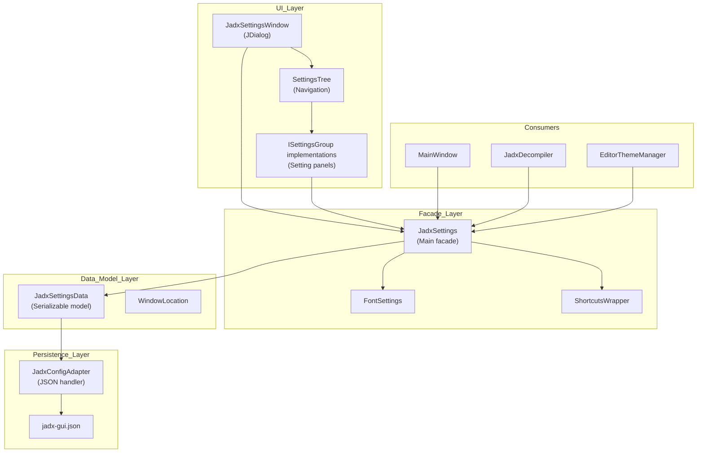
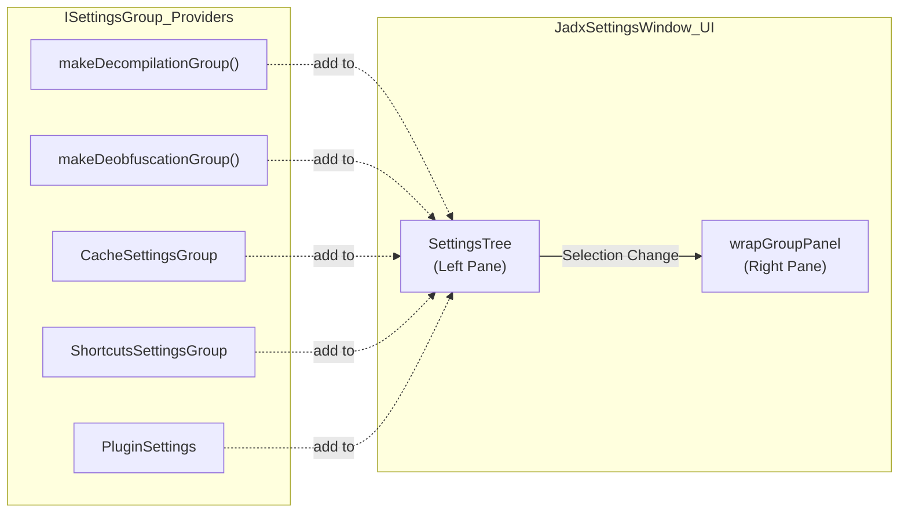
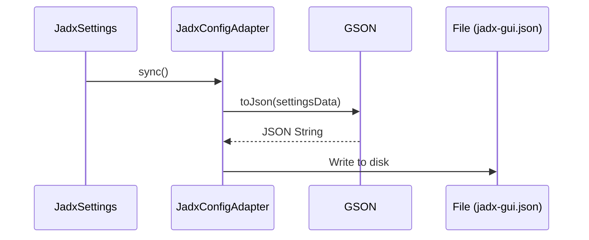

# Settings and Configuration

Relevant source files

The following files were used as context for generating this wiki page:

- [jadx-core/src/test/java/jadx/tests/integration/inner/TestAnonymousClass15.java](https://github.com/skylot/jadx/blob/HEAD/jadx-core/src/test/java/jadx/tests/integration/inner/TestAnonymousClass15.java)
- [jadx-gui/src/main/java/jadx/gui/settings/JadxProject.java](https://github.com/skylot/jadx/blob/HEAD/jadx-gui/src/main/java/jadx/gui/settings/JadxProject.java)
- [jadx-gui/src/main/java/jadx/gui/settings/JadxSettings.java](https://github.com/skylot/jadx/blob/HEAD/jadx-gui/src/main/java/jadx/gui/settings/JadxSettings.java)
- [jadx-gui/src/main/java/jadx/gui/settings/WindowLocation.java](https://github.com/skylot/jadx/blob/HEAD/jadx-gui/src/main/java/jadx/gui/settings/WindowLocation.java)
- [jadx-gui/src/main/java/jadx/gui/settings/data/ProjectData.java](https://github.com/skylot/jadx/blob/HEAD/jadx-gui/src/main/java/jadx/gui/settings/data/ProjectData.java)
- [jadx-gui/src/main/java/jadx/gui/settings/font/FontAdapter.java](https://github.com/skylot/jadx/blob/HEAD/jadx-gui/src/main/java/jadx/gui/settings/font/FontAdapter.java)
- [jadx-gui/src/main/java/jadx/gui/settings/font/FontSettings.java](https://github.com/skylot/jadx/blob/HEAD/jadx-gui/src/main/java/jadx/gui/settings/font/FontSettings.java)
- [jadx-gui/src/main/java/jadx/gui/settings/ui/JadxSettingsWindow.java](https://github.com/skylot/jadx/blob/HEAD/jadx-gui/src/main/java/jadx/gui/settings/ui/JadxSettingsWindow.java)
- [jadx-gui/src/main/java/jadx/gui/settings/ui/font/JadxFontDialog.java](https://github.com/skylot/jadx/blob/HEAD/jadx-gui/src/main/java/jadx/gui/settings/ui/font/JadxFontDialog.java)
- [jadx-gui/src/main/java/jadx/gui/ui/MainWindow.java](https://github.com/skylot/jadx/blob/HEAD/jadx-gui/src/main/java/jadx/gui/ui/MainWindow.java)
- [jadx-gui/src/main/java/jadx/gui/ui/panel/UndisplayedStringsPanel.java](https://github.com/skylot/jadx/blob/HEAD/jadx-gui/src/main/java/jadx/gui/ui/panel/UndisplayedStringsPanel.java)
- [jadx-gui/src/main/java/jadx/gui/utils/FontUtils.java](https://github.com/skylot/jadx/blob/HEAD/jadx-gui/src/main/java/jadx/gui/utils/FontUtils.java)
- [jadx-gui/src/main/java/jadx/gui/utils/LangLocale.java](https://github.com/skylot/jadx/blob/HEAD/jadx-gui/src/main/java/jadx/gui/utils/LangLocale.java)
- [jadx-gui/src/main/java/jadx/gui/utils/RectangleTypeAdapter.java](https://github.com/skylot/jadx/blob/HEAD/jadx-gui/src/main/java/jadx/gui/utils/RectangleTypeAdapter.java)
- [jadx-gui/src/main/resources/i18n/Messages_de_DE.properties](https://github.com/skylot/jadx/blob/HEAD/jadx-gui/src/main/resources/i18n/Messages_de_DE.properties)
- [jadx-gui/src/main/resources/i18n/Messages_en_US.properties](https://github.com/skylot/jadx/blob/HEAD/jadx-gui/src/main/resources/i18n/Messages_en_US.properties)
- [jadx-gui/src/main/resources/i18n/Messages_es_ES.properties](https://github.com/skylot/jadx/blob/HEAD/jadx-gui/src/main/resources/i18n/Messages_es_ES.properties)
- [jadx-gui/src/main/resources/i18n/Messages_id_ID.properties](https://github.com/skylot/jadx/blob/HEAD/jadx-gui/src/main/resources/i18n/Messages_id_ID.properties)
- [jadx-gui/src/main/resources/i18n/Messages_ko_KR.properties](https://github.com/skylot/jadx/blob/HEAD/jadx-gui/src/main/resources/i18n/Messages_ko_KR.properties)
- [jadx-gui/src/main/resources/i18n/Messages_pt_BR.properties](https://github.com/skylot/jadx/blob/HEAD/jadx-gui/src/main/resources/i18n/Messages_pt_BR.properties)
- [jadx-gui/src/main/resources/i18n/Messages_ru_RU.properties](https://github.com/skylot/jadx/blob/HEAD/jadx-gui/src/main/resources/i18n/Messages_ru_RU.properties)
- [jadx-gui/src/main/resources/i18n/Messages_zh_CN.properties](https://github.com/skylot/jadx/blob/HEAD/jadx-gui/src/main/resources/i18n/Messages_zh_CN.properties)
- [jadx-gui/src/main/resources/i18n/Messages_zh_TW.properties](https://github.com/skylot/jadx/blob/HEAD/jadx-gui/src/main/resources/i18n/Messages_zh_TW.properties)

The Settings System manages user preferences for the `jadx-gui` application, providing configuration for decompilation behavior, UI appearance, plugins, and project state. This system implements a multi-layer architecture with a facade pattern for accessing settings, a serializable data model, and JSON-based persistence.

---

## Architecture Overview

The Settings System is structured around four main layers that separate concerns between presentation, business logic, data modeling, and persistence:

**Diagram: Settings System Architecture**

The facade pattern isolates consumers from the underlying data model, while `JadxConfigAdapter` handles JSON serialization with custom type adapters for complex types like `java.nio.file.Path` and `java.awt.Rectangle`.

Sources: [jadx-gui/src/main/java/jadx/gui/settings/JadxSettings.java:48-62](https://github.com/skylot/jadx/blob/HEAD/jadx-gui/src/main/java/jadx/gui/settings/JadxSettings.java#L48-L62), [jadx-gui/src/main/java/jadx/gui/settings/ui/JadxSettingsWindow.java:83-106](https://github.com/skylot/jadx/blob/HEAD/jadx-gui/src/main/java/jadx/gui/settings/ui/JadxSettingsWindow.java#L83-L106)

---

## Core Classes and Implementation

### JadxSettings Facade

`JadxSettings` is the central coordinator for all configuration logic. It manages the `JadxSettingsData` instance and provides synchronization for disk writes.

| Method | Role |
|--------|------|
| `buildConfigAdapter()` | Configures GSON with `PathTypeAdapter` and `RectangleTypeAdapter` [jadx-gui/src/main/java/jadx/gui/settings/JadxSettings.java:64-69](https://github.com/skylot/jadx/blob/HEAD/jadx-gui/src/main/java/jadx/gui/settings/JadxSettings.java#L64-L69) |
| `sync()` | Synchronously saves current settings to disk using `dataWriteSync` lock [jadx-gui/src/main/java/jadx/gui/settings/JadxSettings.java:115-119](https://github.com/skylot/jadx/blob/HEAD/jadx-gui/src/main/java/jadx/gui/settings/JadxSettings.java#L115-L119) |
| `toJadxArgs()` | Converts GUI settings into `JadxArgs` for the core engine [jadx-gui/src/main/java/jadx/gui/settings/JadxSettings.java:139-141](https://github.com/skylot/jadx/blob/HEAD/jadx-gui/src/main/java/jadx/gui/settings/JadxSettings.java#L139-L141) |
| `upgradeSettings()` | Performs incremental version migrations [jadx-gui/src/main/java/jadx/gui/settings/JadxSettings.java:88-101](https://github.com/skylot/jadx/blob/HEAD/jadx-gui/src/main/java/jadx/gui/settings/JadxSettings.java#L88-L101) |
| `saveWindowPos()` | Persists window bounds and state indexed by class name [jadx-gui/src/main/java/jadx/gui/settings/JadxSettings.java:228-256](https://github.com/skylot/jadx/blob/HEAD/jadx-gui/src/main/java/jadx/gui/settings/JadxSettings.java#L228-L256) |

Sources: [jadx-gui/src/main/java/jadx/gui/settings/JadxSettings.java:48-141](https://github.com/skylot/jadx/blob/HEAD/jadx-gui/src/main/java/jadx/gui/settings/JadxSettings.java#L48-L141)

### JadxSettingsWindow UI

The `JadxSettingsWindow` provides a tree-based navigation interface for modifying preferences.

**Diagram: Settings Window Component Flow**

The window maintains a `needReload` flag. If settings affecting the decompilation pipeline (like `decompilationMode`) are changed, the GUI will trigger a project reload upon closing the dialog.

Sources: [jadx-gui/src/main/java/jadx/gui/settings/ui/JadxSettingsWindow.java:134-172](https://github.com/skylot/jadx/blob/HEAD/jadx-gui/src/main/java/jadx/gui/settings/ui/JadxSettingsWindow.java#L134-L172)

---

## Configuration Categories

### Decompilation and Engine Settings
These settings directly influence the `JadxDecompiler` behavior by populating `JadxArgs`.

*   **Decompilation Mode**: `RESTRUCTURE`, `SIMPLE`, or `FALLBACK` [jadx-gui/src/main/java/jadx/gui/settings/ui/JadxSettingsWindow.java:47](https://github.com/skylot/jadx/blob/HEAD/jadx-gui/src/main/java/jadx/gui/settings/ui/JadxSettingsWindow.java#L47).
*   **Parallelism**: `threadsCount` determines the number of background threads for processing [jadx-gui/src/main/java/jadx/gui/settings/JadxSettings.java:104-106](https://github.com/skylot/jadx/blob/HEAD/jadx-gui/src/main/java/jadx/gui/settings/JadxSettings.java#L104-L106).
*   **Inconsistency**: `showInconsistentCode` allows displaying partial results when decompilation fails [jadx-gui/src/main/resources/i18n/Messages_en_US.properties:250](https://github.com/skylot/jadx/blob/HEAD/jadx-gui/src/main/resources/i18n/Messages_en_US.properties#L250).

Sources: [jadx-gui/src/main/java/jadx/gui/settings/JadxSettings.java:104-106](https://github.com/skylot/jadx/blob/HEAD/jadx-gui/src/main/java/jadx/gui/settings/JadxSettings.java#L104-L106), [jadx-gui/src/main/java/jadx/gui/settings/ui/JadxSettingsWindow.java:138](https://github.com/skylot/jadx/blob/HEAD/jadx-gui/src/main/java/jadx/gui/settings/ui/JadxSettingsWindow.java#L138)

### Appearance and Editor
Manages the visual state of the `MainWindow` and code areas.

*   **Themes**: Supports `lafTheme` (UI Look and Feel) and `editorTheme` (syntax highlighting) [jadx-gui/src/main/java/jadx/gui/settings/ui/JadxSettingsWindow.java:73-74](https://github.com/skylot/jadx/blob/HEAD/jadx-gui/src/main/java/jadx/gui/settings/ui/JadxSettingsWindow.java#L73-L74).
*   **Fonts**: Managed by `FontSettings` and `FontAdapter`, supporting separate fonts for UI, code, and Smali [jadx-gui/src/main/java/jadx/gui/settings/font/FontSettings.java:39](https://github.com/skylot/jadx/blob/HEAD/jadx-gui/src/main/java/jadx/gui/settings/font/FontSettings.java#L39).
*   **Line Numbers**: `LineNumbersMode` (Normal, Debug, or Off) [jadx-gui/src/main/java/jadx/gui/settings/ui/JadxSettingsWindow.java:63](https://github.com/skylot/jadx/blob/HEAD/jadx-gui/src/main/java/jadx/gui/settings/ui/JadxSettingsWindow.java#L63).

Sources: [jadx-gui/src/main/java/jadx/gui/settings/JadxSettings.java:56](https://github.com/skylot/jadx/blob/HEAD/jadx-gui/src/main/java/jadx/gui/settings/JadxSettings.java#L56), [jadx-gui/src/main/java/jadx/gui/settings/ui/JadxSettingsWindow.java:142](https://github.com/skylot/jadx/blob/HEAD/jadx-gui/src/main/java/jadx/gui/settings/ui/JadxSettingsWindow.java#L142)

### Project and Session Persistence
State saved automatically to maintain the user's workspace. Unlike global settings, `JadxProject` manages state specific to the currently loaded files.

*   **Recent Projects**: A bounded list of `Path` objects, limited to 30 entries [jadx-gui/src/main/java/jadx/gui/settings/JadxSettings.java:51-212](https://github.com/skylot/jadx/blob/HEAD/jadx-gui/src/main/java/jadx/gui/settings/JadxSettings.java#L51-L212).
*   **Window Positions**: Stored in a map of `WindowLocation` objects, ensuring the UI restores to the same screen and coordinates [jadx-gui/src/main/java/jadx/gui/settings/JadxSettings.java:223-256](https://github.com/skylot/jadx/blob/HEAD/jadx-gui/src/main/java/jadx/gui/settings/JadxSettings.java#L223-L256).
*   **Project State**: `JadxProject` persists open tabs, tree expansions, and code renames/comments into a `.jadx` project file [jadx-gui/src/main/java/jadx/gui/settings/JadxProject.java:178-186](https://github.com/skylot/jadx/blob/HEAD/jadx-gui/src/main/java/jadx/gui/settings/JadxProject.java#L178-L186).

Sources: [jadx-gui/src/main/java/jadx/gui/settings/JadxSettings.java:200-256](https://github.com/skylot/jadx/blob/HEAD/jadx-gui/src/main/java/jadx/gui/settings/JadxSettings.java#L200-L256), [jadx-gui/src/main/java/jadx/gui/settings/JadxProject.java:52-194](https://github.com/skylot/jadx/blob/HEAD/jadx-gui/src/main/java/jadx/gui/settings/JadxProject.java#L52-L194)

---

## Persistence and Data Flow

### JSON Serialization
JADX uses GSON for persistence. The `JadxConfigAdapter` handles the conversion between `JadxSettingsData` and the `jadx-gui.json` file.

Sources: [jadx-gui/src/main/java/jadx/gui/settings/JadxSettings.java:64-73](https://github.com/skylot/jadx/blob/HEAD/jadx-gui/src/main/java/jadx/gui/settings/JadxSettings.java#L64-L73), [jadx-gui/src/main/java/jadx/gui/settings/JadxSettings.java:115-119](https://github.com/skylot/jadx/blob/HEAD/jadx-gui/src/main/java/jadx/gui/settings/JadxSettings.java#L115-L119)

### Internationalization (i18n)
Settings labels and tooltips are localized through the `NLS` system, which loads `Messages_*.properties` files. JADX supports 9 languages [jadx-gui/src/main/java/jadx/gui/ui/MainWindow.java:174](https://github.com/skylot/jadx/blob/HEAD/jadx-gui/src/main/java/jadx/gui/ui/MainWindow.java#L174).

| Locale | File | Language Name |
|--------|------|---------------|
| English | `Messages_en_US.properties` | English [jadx-gui/src/main/resources/i18n/Messages_en_US.properties:1](https://github.com/skylot/jadx/blob/HEAD/jadx-gui/src/main/resources/i18n/Messages_en_US.properties#L1) |
| Chinese (Simplified) | `Messages_zh_CN.properties` | 中文（简体） [jadx-gui/src/main/resources/i18n/Messages_zh_CN.properties:1](https://github.com/skylot/jadx/blob/HEAD/jadx-gui/src/main/resources/i18n/Messages_zh_CN.properties#L1) |
| Chinese (Traditional) | `Messages_zh_TW.properties` | 中文 (繁體) [jadx-gui/src/main/resources/i18n/Messages_zh_TW.properties:1](https://github.com/skylot/jadx/blob/HEAD/jadx-gui/src/main/resources/i18n/Messages_zh_TW.properties#L1) |
| German | `Messages_de_DE.properties` | Deutsch [jadx-gui/src/main/resources/i18n/Messages_de_DE.properties:1](https://github.com/skylot/jadx/blob/HEAD/jadx-gui/src/main/resources/i18n/Messages_de_DE.properties#L1) |
| Russian | `Messages_ru_RU.properties` | Русский [jadx-gui/src/main/resources/i18n/Messages_ru_RU.properties:1](https://github.com/skylot/jadx/blob/HEAD/jadx-gui/src/main/resources/i18n/Messages_ru_RU.properties#L1) |
| Spanish | `Messages_es_ES.properties` | Español [jadx-gui/src/main/resources/i18n/Messages_es_ES.properties:1](https://github.com/skylot/jadx/blob/HEAD/jadx-gui/src/main/resources/i18n/Messages_es_ES.properties#L1) |
| Korean | `Messages_ko_KR.properties` | 한국어 [jadx-gui/src/main/resources/i18n/Messages_ko_KR.properties:1](https://github.com/skylot/jadx/blob/HEAD/jadx-gui/src/main/resources/i18n/Messages_ko_KR.properties#L1) |
| Portuguese (Brazil) | `Messages_pt_BR.properties` | Português [jadx-gui/src/main/resources/i18n/Messages_pt_BR.properties:1](https://github.com/skylot/jadx/blob/HEAD/jadx-gui/src/main/resources/i18n/Messages_pt_BR.properties#L1) |
| Indonesian | `Messages_id_ID.properties` | Indonesian [jadx-gui/src/main/resources/i18n/Messages_id_ID.properties:1](https://github.com/skylot/jadx/blob/HEAD/jadx-gui/src/main/resources/i18n/Messages_id_ID.properties#L1) |

Sources: [jadx-gui/src/main/resources/i18n/Messages_en_US.properties:1-250](https://github.com/skylot/jadx/blob/HEAD/jadx-gui/src/main/resources/i18n/Messages_en_US.properties#L1-L250), [jadx-gui/src/main/resources/i18n/Messages_zh_CN.properties:1-250](https://github.com/skylot/jadx/blob/HEAD/jadx-gui/src/main/resources/i18n/Messages_zh_CN.properties#L1-L250), [jadx-gui/src/main/java/jadx/gui/ui/MainWindow.java:174](https://github.com/skylot/jadx/blob/HEAD/jadx-gui/src/main/java/jadx/gui/ui/MainWindow.java#L174)

---

## Event Handling
The settings window responds to global events to ensure the UI stays in sync with plugin-provided settings.

*   **Reload Event**: Listens for `JadxEvents.RELOAD_SETTINGS_WINDOW` to refresh the tree and panels when plugins are added or modified [jadx-gui/src/main/java/jadx/gui/settings/ui/JadxSettingsWindow.java:118-120](https://github.com/skylot/jadx/blob/HEAD/jadx-gui/src/main/java/jadx/gui/settings/ui/JadxSettingsWindow.java#L118-L120).
*   **Sync Logic**: The `reloadUI` function preserves the user's current tree selection while rebuilding the component tree [jadx-gui/src/main/java/jadx/gui/settings/ui/JadxSettingsWindow.java:122-132](https://github.com/skylot/jadx/blob/HEAD/jadx-gui/src/main/java/jadx/gui/settings/ui/JadxSettingsWindow.java#L122-L132).

Sources: [jadx-gui/src/main/java/jadx/gui/settings/ui/JadxSettingsWindow.java:118-132](https://github.com/skylot/jadx/blob/HEAD/jadx-gui/src/main/java/jadx/gui/settings/ui/JadxSettingsWindow.java#L118-L132)26:T3037,# Code Display and Navigat