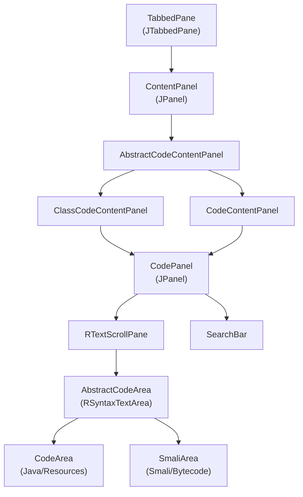
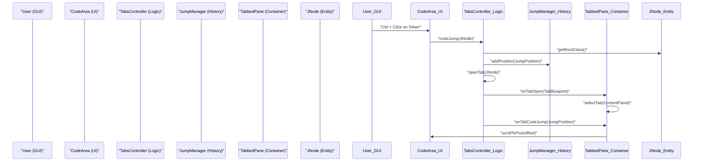

# Code Display and Navigation

Relevant source files

The following files were used as context for generating this wiki page:

- [jadx-core/src/test/java/jadx/tests/integration/others/TestImports.java](https://github.com/skylot/jadx/blob/HEAD/jadx-core/src/test/java/jadx/tests/integration/others/TestImports.java)
- [jadx-gui/src/main/java/jadx/gui/jobs/LoadTask.java](https://github.com/skylot/jadx/blob/HEAD/jadx-gui/src/main/java/jadx/gui/jobs/LoadTask.java)
- [jadx-gui/src/main/java/jadx/gui/jobs/SilentTask.java](https://github.com/skylot/jadx/blob/HEAD/jadx-gui/src/main/java/jadx/gui/jobs/SilentTask.java)
- [jadx-gui/src/main/java/jadx/gui/ui/codearea/AbstractCodeArea.java](https://github.com/skylot/jadx/blob/HEAD/jadx-gui/src/main/java/jadx/gui/ui/codearea/AbstractCodeArea.java)
- [jadx-gui/src/main/java/jadx/gui/ui/codearea/ClassCodeContentPanel.java](https://github.com/skylot/jadx/blob/HEAD/jadx-gui/src/main/java/jadx/gui/ui/codearea/ClassCodeContentPanel.java)
- [jadx-gui/src/main/java/jadx/gui/ui/codearea/CodeArea.java](https://github.com/skylot/jadx/blob/HEAD/jadx-gui/src/main/java/jadx/gui/ui/codearea/CodeArea.java)
- [jadx-gui/src/main/java/jadx/gui/ui/codearea/CodeContentPanel.java](https://github.com/skylot/jadx/blob/HEAD/jadx-gui/src/main/java/jadx/gui/ui/codearea/CodeContentPanel.java)
- [jadx-gui/src/main/java/jadx/gui/ui/codearea/CodePanel.java](https://github.com/skylot/jadx/blob/HEAD/jadx-gui/src/main/java/jadx/gui/ui/codearea/CodePanel.java)
- [jadx-gui/src/main/java/jadx/gui/ui/codearea/JadxTokenMaker.java](https://github.com/skylot/jadx/blob/HEAD/jadx-gui/src/main/java/jadx/gui/ui/codearea/JadxTokenMaker.java)
- [jadx-gui/src/main/java/jadx/gui/ui/codearea/MouseHoverHighlighter.java](https://github.com/skylot/jadx/blob/HEAD/jadx-gui/src/main/java/jadx/gui/ui/codearea/MouseHoverHighlighter.java)
- [jadx-gui/src/main/java/jadx/gui/ui/codearea/SearchBar.java](https://github.com/skylot/jadx/blob/HEAD/jadx-gui/src/main/java/jadx/gui/ui/codearea/SearchBar.java)
- [jadx-gui/src/main/java/jadx/gui/ui/codearea/SmaliArea.java](https://github.com/skylot/jadx/blob/HEAD/jadx-gui/src/main/java/jadx/gui/ui/codearea/SmaliArea.java)
- [jadx-gui/src/main/java/jadx/gui/ui/panel/ContentPanel.java](https://github.com/skylot/jadx/blob/HEAD/jadx-gui/src/main/java/jadx/gui/ui/panel/ContentPanel.java)
- [jadx-gui/src/main/java/jadx/gui/ui/tab/ITabStatesListener.java](https://github.com/skylot/jadx/blob/HEAD/jadx-gui/src/main/java/jadx/gui/ui/tab/ITabStatesListener.java)
- [jadx-gui/src/main/java/jadx/gui/ui/tab/LogTabStates.java](https://github.com/skylot/jadx/blob/HEAD/jadx-gui/src/main/java/jadx/gui/ui/tab/LogTabStates.java)
- [jadx-gui/src/main/java/jadx/gui/ui/tab/NavigationController.java](https://github.com/skylot/jadx/blob/HEAD/jadx-gui/src/main/java/jadx/gui/ui/tab/NavigationController.java)
- [jadx-gui/src/main/java/jadx/gui/ui/tab/QuickTabsTree.java](https://github.com/skylot/jadx/blob/HEAD/jadx-gui/src/main/java/jadx/gui/ui/tab/QuickTabsTree.java)
- [jadx-gui/src/main/java/jadx/gui/ui/tab/TabComponent.java](https://github.com/skylot/jadx/blob/HEAD/jadx-gui/src/main/java/jadx/gui/ui/tab/TabComponent.java)
- [jadx-gui/src/main/java/jadx/gui/ui/tab/TabbedPane.java](https://github.com/skylot/jadx/blob/HEAD/jadx-gui/src/main/java/jadx/gui/ui/tab/TabbedPane.java)
- [jadx-gui/src/main/java/jadx/gui/ui/tab/TabsController.java](https://github.com/skylot/jadx/blob/HEAD/jadx-gui/src/main/java/jadx/gui/ui/tab/TabsController.java)
- [jadx-gui/src/main/java/jadx/gui/utils/JumpManager.java](https://github.com/skylot/jadx/blob/HEAD/jadx-gui/src/main/java/jadx/gui/utils/JumpManager.java)
- [jadx-gui/src/main/java/jadx/gui/utils/JumpPosition.java](https://github.com/skylot/jadx/blob/HEAD/jadx-gui/src/main/java/jadx/gui/utils/JumpPosition.java)
- [jadx-gui/src/main/java/jadx/gui/utils/dbg/UIWatchDog.java](https://github.com/skylot/jadx/blob/HEAD/jadx-gui/src/main/java/jadx/gui/utils/dbg/UIWatchDog.java)

This page documents the code display system and navigation infrastructure in the JADX GUI. It covers the hierarchical panel structure, the specialized code area implementations for Java and Smali, and the controllers managing tab lifecycles and navigation history.

## Display Hierarchy

The display system follows a strictly hierarchical structure from the top-level `TabbedPane` down to individual text tokens.

### ContentPanel and CodePanel
`ContentPanel` is the base class for all components placed inside a tab [jadx-gui/src/main/java/jadx/gui/ui/panel/ContentPanel.java:14-20](https://github.com/skylot/jadx/blob/HEAD/jadx-gui/src/main/java/jadx/gui/ui/panel/ContentPanel.java#L14-L20).
- **ClassCodeContentPanel**: Specialized for classes; supports a "Split view" showing Java and Smali side-by-side [jadx-gui/src/main/java/jadx/gui/ui/codearea/ClassCodeContentPanel.java:47-60](https://github.com/skylot/jadx/blob/HEAD/jadx-gui/src/main/java/jadx/gui/ui/codearea/ClassCodeContentPanel.java#L47-L60). It manages synchronization between views using `CodeAreaSyncer` [jadx-gui/src/main/java/jadx/gui/ui/codearea/ClassCodeContentPanel.java:166-183](https://github.com/skylot/jadx/blob/HEAD/jadx-gui/src/main/java/jadx/gui/ui/codearea/ClassCodeContentPanel.java#L166-L183).
- **CodePanel**: A wrapper combining a `SearchBar`, an `RTextScrollPane`, and an `AbstractCodeArea` [jadx-gui/src/main/java/jadx/gui/ui/codearea/CodePanel.java:44-62](https://github.com/skylot/jadx/blob/HEAD/jadx-gui/src/main/java/jadx/gui/ui/codearea/CodePanel.java#L44-L62). It handles line number formatting, switching between physical and source lines (debug mode) via `applyLineFormatter()` [jadx-gui/src/main/java/jadx/gui/ui/codearea/CodePanel.java:149-154](https://github.com/skylot/jadx/blob/HEAD/jadx-gui/src/main/java/jadx/gui/ui/codearea/CodePanel.java#L149-L154).

**Sources:** [jadx-gui/src/main/java/jadx/gui/ui/panel/ContentPanel.java](https://github.com/skylot/jadx/blob/HEAD/jadx-gui/src/main/java/jadx/gui/ui/panel/ContentPanel.java), [jadx-gui/src/main/java/jadx/gui/ui/codearea/ClassCodeContentPanel.java](https://github.com/skylot/jadx/blob/HEAD/jadx-gui/src/main/java/jadx/gui/ui/codearea/ClassCodeContentPanel.java), [jadx-gui/src/main/java/jadx/gui/ui/codearea/CodePanel.java](https://github.com/skylot/jadx/blob/HEAD/jadx-gui/src/main/java/jadx/gui/ui/codearea/CodePanel.java)

---

## Code Area Implementations

All code displays inherit from `AbstractCodeArea`, which extends `RSyntaxTextArea` and provides common features like line wrapping, zooming, and folding [jadx-gui/src/main/java/jadx/gui/ui/codearea/AbstractCodeArea.java:64-113](https://github.com/skylot/jadx/blob/HEAD/jadx-gui/src/main/java/jadx/gui/ui/codearea/AbstractCodeArea.java#L64-L113).

### CodeArea (Java & Resources)
The primary implementation for Java source and text-based resources like `AndroidManifest.xml` or JSON [jadx-gui/src/main/java/jadx/gui/ui/codearea/CodeArea.java:69-78](https://github.com/skylot/jadx/blob/HEAD/jadx-gui/src/main/java/jadx/gui/ui/codearea/CodeArea.java#L69-L78).
- **Syntax Highlighting**: Uses `JadxTokenMaker` for Java code to associate text tokens with internal `ICodeAnnotation` metadata [jadx-gui/src/main/java/jadx/gui/ui/codearea/CodeArea.java:83-86](https://github.com/skylot/jadx/blob/HEAD/jadx-gui/src/main/java/jadx/gui/ui/codearea/CodeArea.java#L83-L86).
- **Hyperlinks**: Implements `CodeLinkGenerator` to allow `Ctrl+Click` navigation to class/method declarations [jadx-gui/src/main/java/jadx/gui/ui/codearea/CodeArea.java:92-96](https://github.com/skylot/jadx/blob/HEAD/jadx-gui/src/main/java/jadx/gui/ui/codearea/CodeArea.java#L92-L96).
- **Context Actions**: Provides a rich popup menu via `JNodePopupBuilder` including "Find Usage", "Go To Declaration", and "View Control Flow Graph" [jadx-gui/src/main/java/jadx/gui/ui/codearea/CodeArea.java:184-206](https://github.com/skylot/jadx/blob/HEAD/jadx-gui/src/main/java/jadx/gui/ui/codearea/CodeArea.java#L184-L206).

### SmaliArea
Displays Dalvik bytecode in Smali syntax [jadx-gui/src/main/java/jadx/gui/ui/codearea/SmaliArea.java:51-71](https://github.com/skylot/jadx/blob/HEAD/jadx-gui/src/main/java/jadx/gui/ui/codearea/SmaliArea.java#L51-L71).
- **Models**: Uses `NormalModel` for standard Smali [jadx-gui/src/main/java/jadx/gui/ui/codearea/SmaliArea.java:147-166](https://github.com/skylot/jadx/blob/HEAD/jadx-gui/src/main/java/jadx/gui/ui/codearea/SmaliArea.java#L147-L166) or `DebugModel` for an enhanced view including hex offsets and Dalvik opcodes [jadx-gui/src/main/java/jadx/gui/ui/codearea/SmaliArea.java:168-185](https://github.com/skylot/jadx/blob/HEAD/jadx-gui/src/main/java/jadx/gui/ui/codearea/SmaliArea.java#L168-L185).
- **Debugger Integration**: Supports breakpoint icons (`ICON_BREAKPOINT`) in the gutter [jadx-gui/src/main/java/jadx/gui/ui/codearea/SmaliArea.java:56-57](https://github.com/skylot/jadx/blob/HEAD/jadx-gui/src/main/java/jadx/gui/ui/codearea/SmaliArea.java#L56-L57) and highlighting the currently executing line during a debug session using `runningHighlightTag` [jadx-gui/src/main/java/jadx/gui/ui/codearea/SmaliArea.java:171-172](https://github.com/skylot/jadx/blob/HEAD/jadx-gui/src/main/java/jadx/gui/ui/codearea/SmaliArea.java#L171-L172).

**Sources:** [jadx-gui/src/main/java/jadx/gui/ui/codearea/AbstractCodeArea.java](https://github.com/skylot/jadx/blob/HEAD/jadx-gui/src/main/java/jadx/gui/ui/codearea/AbstractCodeArea.java), [jadx-gui/src/main/java/jadx/gui/ui/codearea/CodeArea.java](https://github.com/skylot/jadx/blob/HEAD/jadx-gui/src/main/java/jadx/gui/ui/codearea/CodeArea.java), [jadx-gui/src/main/java/jadx/gui/ui/codearea/SmaliArea.java](https://github.com/skylot/jadx/blob/HEAD/jadx-gui/src/main/java/jadx/gui/ui/codearea/SmaliArea.java)

---

## Navigation Infrastructure

Navigation is managed by `TabsController` (logical state) and `TabbedPane` (visual state).

### TabsController
Manages the lifecycle of `TabBlueprint` objects, which represent the data behind a tab [jadx-gui/src/main/java/jadx/gui/ui/tab/TabsController.java:27-31](https://github.com/skylot/jadx/blob/HEAD/jadx-gui/src/main/java/jadx/gui/ui/tab/TabsController.java#L27-L31).
- **Code Jumping**: `codeJump(JNode node)` handles complex navigation, such as loading a parent class and searching for the offset of an inner class or method declaration using metadata [jadx-gui/src/main/java/jadx/gui/ui/tab/TabsController.java:120-149](https://github.com/skylot/jadx/blob/HEAD/jadx-gui/src/main/java/jadx/gui/ui/tab/TabsController.java#L120-L149).
- **Preview Tabs**: If enabled in settings, opening a node from the tree uses a single "Preview" tab that is replaced by the next node unless pinned or double-clicked [jadx-gui/src/main/java/jadx/gui/ui/tab/TabsController.java:88-93](https://github.com/skylot/jadx/blob/HEAD/jadx-gui/src/main/java/jadx/gui/ui/tab/TabsController.java#L88-L93).

### TabbedPane
The visual container managing `ContentPanel` instances and tab-related events [jadx-gui/src/main/java/jadx/gui/ui/tab/TabbedPane.java:44-51](https://github.com/skylot/jadx/blob/HEAD/jadx-gui/src/main/java/jadx/gui/ui/tab/TabbedPane.java#L44-L51).
- **Key Bindings**: Intercepts `Ctrl+Tab` for switching between the last two active tabs and `Ctrl+W` for closing tabs [jadx-gui/src/main/java/jadx/gui/ui/tab/TabbedPane.java:102-172](https://github.com/skylot/jadx/blob/HEAD/jadx-gui/src/main/java/jadx/gui/ui/tab/TabbedPane.java#L102-L172).
- **Navigation History**: Uses `NavigationController` to track and traverse the history of visited nodes.

### JumpManager
Maintains a history of `JumpPosition` objects for "Forward" and "Back" navigation [jadx-gui/src/main/java/jadx/gui/utils/JumpManager.java:8-23](https://github.com/skylot/jadx/blob/HEAD/jadx-gui/src/main/java/jadx/gui/utils/JumpManager.java#L8-L23).
- **History Limits**: Stores up to 100 positions, shrinking by 50 when the limit is reached to maintain performance [jadx-gui/src/main/java/jadx/gui/utils/JumpManager.java:12-20](https://github.com/skylot/jadx/blob/HEAD/jadx-gui/src/main/java/jadx/gui/utils/JumpManager.java#L12-L20).
- **Navigation**: Provides `getPrev()` and `getNext()` to traverse the history stack [jadx-gui/src/main/java/jadx/gui/utils/JumpManager.java:63-89](https://github.com/skylot/jadx/blob/HEAD/jadx-gui/src/main/java/jadx/gui/utils/JumpManager.java#L63-L89).

### Code Entity Navigation Flow
The following diagram bridges the GUI components to the underlying code entities during a navigation event.

**Sources:** [jadx-gui/src/main/java/jadx/gui/ui/tab/TabsController.java](https://github.com/skylot/jadx/blob/HEAD/jadx-gui/src/main/java/jadx/gui/ui/tab/TabsController.java), [jadx-gui/src/main/java/jadx/gui/ui/tab/TabbedPane.java](https://github.com/skylot/jadx/blob/HEAD/jadx-gui/src/main/java/jadx/gui/ui/tab/TabbedPane.java), [jadx-gui/src/main/java/jadx/gui/utils/JumpManager.java](https://github.com/skylot/jadx/blob/HEAD/jadx-gui/src/main/java/jadx/gui/utils/JumpManager.java), [jadx-gui/src/main/java/jadx/gui/ui/tab/TabComponent.java](https://github.com/skylot/jadx/blob/HEAD/jadx-gui/src/main/java/jadx/gui/ui/tab/TabComponent.java), [jadx-gui/src/main/java/jadx/gui/ui/codearea/CodeArea.java](https://github.com/skylot/jadx/blob/HEAD/jadx-gui/src/main/java/jadx/gui/ui/codearea/CodeArea.java)

---

## Search and Interaction

### SearchBar
An inline toolbar for searching text within the current `CodeArea` [jadx-gui/src/main/java/jadx/gui/ui/codearea/SearchBar.java:30-46](https://github.com/skylot/jadx/blob/HEAD/jadx-gui/src/main/java/jadx/gui/ui/codearea/SearchBar.java#L30-L46).
- **Engine**: Uses `SearchEngine.find()` from the RSyntaxTextArea library [jadx-gui/src/main/java/jadx/gui/ui/codearea/SearchBar.java:207](https://github.com/skylot/jadx/blob/HEAD/jadx-gui/src/main/java/jadx/gui/ui/codearea/SearchBar.java#L207).
- **Modes**: Supports Match Case, Whole Word, and Regular Expressions [jadx-gui/src/main/java/jadx/gui/ui/codearea/SearchBar.java:178-189](https://github.com/skylot/jadx/blob/HEAD/jadx-gui/src/main/java/jadx/gui/ui/codearea/SearchBar.java#L178-L189).

### MouseHoverHighlighter
When hovering over an identifier in `CodeArea`, this component highlights all occurrences of that identifier within the visible area [jadx-gui/src/main/java/jadx/gui/ui/codearea/MouseHoverHighlighter.java:18-33](https://github.com/skylot/jadx/blob/HEAD/jadx-gui/src/main/java/jadx/gui/ui/codearea/MouseHoverHighlighter.java#L18-L33). It uses `CodeLinkGenerator` to identify the `JavaNode` at the current mouse offset [jadx-gui/src/main/java/jadx/gui/ui/codearea/MouseHoverHighlighter.java:65-68](https://github.com/skylot/jadx/blob/HEAD/jadx-gui/src/main/java/jadx/gui/ui/codearea/MouseHoverHighlighter.java#L65-L68).

### System-to-Code Mapping
The following table maps GUI interaction concepts to their primary implementation classes.

| Feature | Primary Class | Role |
| --- | --- | --- |
| Code Highlighting | `JadxTokenMaker` | Maps source tokens to JADX metadata [jadx-gui/src/main/java/jadx/gui/ui/codearea/JadxTokenMaker.java:22-29](https://github.com/skylot/jadx/blob/HEAD/jadx-gui/src/main/java/jadx/gui/ui/codearea/JadxTokenMaker.java#L22-L29) |
| Jump History | `JumpManager` | Stores navigation stack of `JumpPosition` [jadx-gui/src/main/java/jadx/gui/utils/JumpManager.java:8-23](https://github.com/skylot/jadx/blob/HEAD/jadx-gui/src/main/java/jadx/gui/utils/JumpManager.java#L8-L23) |
| Search UI | `SearchBar` | Handles local text search and "Mark All" [jadx-gui/src/main/java/jadx/gui/ui/codearea/SearchBar.java:30-46](https://github.com/skylot/jadx/blob/HEAD/jadx-gui/src/main/java/jadx/gui/ui/codearea/SearchBar.java#L30-L46) |
| Tab Logic | `TabsController` | Orchestrates tab opening/closing/selection [jadx-gui/src/main/java/jadx/gui/ui/tab/TabsController.java:27-42](https://github.com/skylot/jadx/blob/HEAD/jadx-gui/src/main/java/jadx/gui/ui/tab/TabsController.java#L27-L42) |
| Tab UI | `TabComponent` | Renders tab labels, icons, and pin/close buttons [jadx-gui/src/main/java/jadx/gui/ui/tab/TabComponent.java:39-59](https://github.com/skylot/jadx/blob/HEAD/jadx-gui/src/main/java/jadx/gui/ui/tab/TabComponent.java#L39-L59) |

**Sources:** [jadx-gui/src/main/java/jadx/gui/ui/codearea/SearchBar.java](https://github.com/skylot/jadx/blob/HEAD/jadx-gui/src/main/java/jadx/gui/ui/codearea/SearchBar.java), [jadx-gui/src/main/java/jadx/gui/ui/codearea/CodeArea.java](https://github.com/skylot/jadx/blob/HEAD/jadx-gui/src/main/java/jadx/gui/ui/codearea/CodeArea.java), [jadx-gui/src/main/java/jadx/gui/ui/codearea/MouseHoverHighlighter.java](https://github.com/skylot/jadx/blob/HEAD/jadx-gui/src/main/java/jadx/gui/ui/codearea/MouseHoverHighlighter.java), [jadx-gui/src/main/java/jadx/gui/ui/codearea/JadxTokenMaker.java](https://github.com/skylot/jadx/blob/HEAD/jadx-gui/src/main/java/jadx/gui/ui/codearea/JadxTokenMaker.java), [jadx-gui/src/main/java/jadx/gui/ui/tab/TabComponent.java](https://github.com/skylot/jadx/blob/HEAD/jadx-gui/src/main/java/jadx/gui/ui/tab/TabComponent.java), [jadx-gui/src/main/java/jadx/gui/ui/tab/TabsController.java](https://github.com/skylot/jadx/blob/HEAD/jadx-gui/src/main/java/jadx/gui/ui/tab/TabsController.java), [jadx-gui/src/main/java/jadx/gui/utils/JumpManager.java](https://github.com/skylot/jadx/blob/HEAD/jadx-gui/src/main/java/jadx/gui/utils/JumpManager.java)