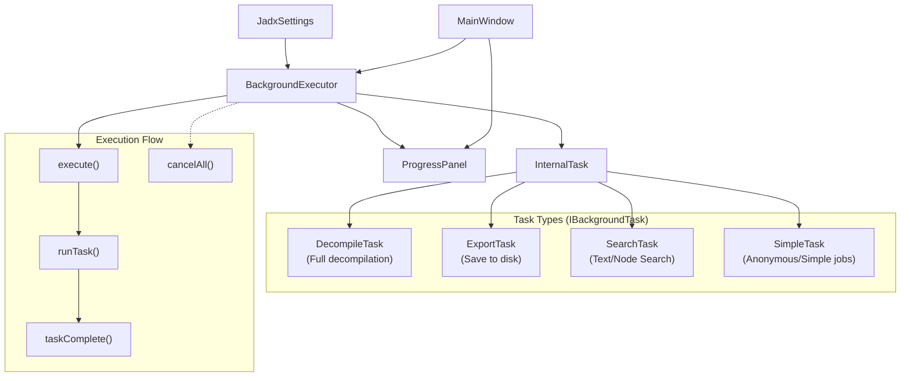
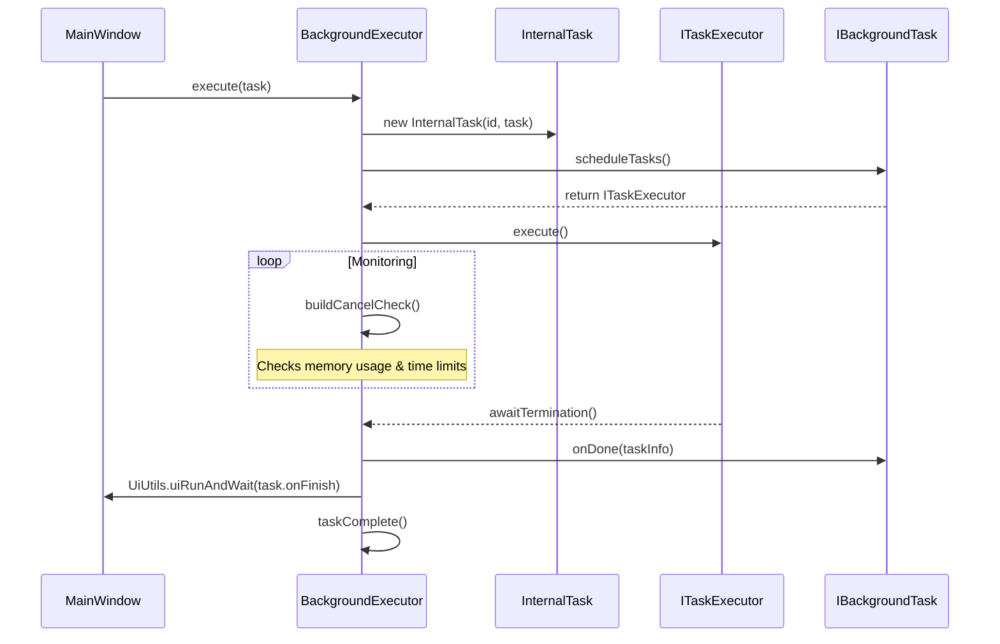
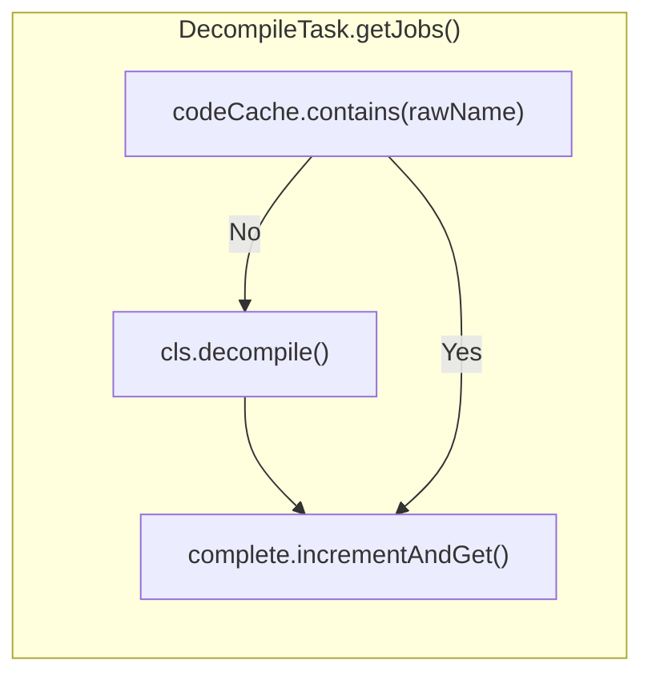

# Background Processing and Caching

Relevant source files

The following files were used as context for generating this wiki page:

- [jadx-commons/jadx-app-commons/README.md](https://github.com/skylot/jadx/blob/HEAD/jadx-commons/jadx-app-commons/README.md)
- [jadx-commons/jadx-app-commons/src/main/java/jadx/commons/app/JadxCommonEnv.java](https://github.com/skylot/jadx/blob/HEAD/jadx-commons/jadx-app-commons/src/main/java/jadx/commons/app/JadxCommonEnv.java)
- [jadx-core/src/main/java/jadx/api/plugins/JadxPlugin.java](https://github.com/skylot/jadx/blob/HEAD/jadx-core/src/main/java/jadx/api/plugins/JadxPlugin.java)
- [jadx-core/src/main/java/jadx/api/plugins/events/types/ReloadProject.java](https://github.com/skylot/jadx/blob/HEAD/jadx-core/src/main/java/jadx/api/plugins/events/types/ReloadProject.java)
- [jadx-core/src/main/java/jadx/api/plugins/gui/ISettingsGroup.java](https://github.com/skylot/jadx/blob/HEAD/jadx-core/src/main/java/jadx/api/plugins/gui/ISettingsGroup.java)
- [jadx-gui/src/main/java/jadx/gui/cache/code/disk/DiskCodeCache.java](https://github.com/skylot/jadx/blob/HEAD/jadx-gui/src/main/java/jadx/gui/cache/code/disk/DiskCodeCache.java)
- [jadx-gui/src/main/java/jadx/gui/jobs/BackgroundExecutor.java](https://github.com/skylot/jadx/blob/HEAD/jadx-gui/src/main/java/jadx/gui/jobs/BackgroundExecutor.java)
- [jadx-gui/src/main/java/jadx/gui/jobs/DecompileTask.java](https://github.com/skylot/jadx/blob/HEAD/jadx-gui/src/main/java/jadx/gui/jobs/DecompileTask.java)
- [jadx-gui/src/main/java/jadx/gui/jobs/ExportTask.java](https://github.com/skylot/jadx/blob/HEAD/jadx-gui/src/main/java/jadx/gui/jobs/ExportTask.java)
- [jadx-gui/src/main/java/jadx/gui/jobs/IBackgroundTask.java](https://github.com/skylot/jadx/blob/HEAD/jadx-gui/src/main/java/jadx/gui/jobs/IBackgroundTask.java)
- [jadx-gui/src/main/java/jadx/gui/settings/ui/SettingsGroup.java](https://github.com/skylot/jadx/blob/HEAD/jadx-gui/src/main/java/jadx/gui/settings/ui/SettingsGroup.java)
- [jadx-gui/src/main/java/jadx/gui/settings/ui/cache/CachesTable.java](https://github.com/skylot/jadx/blob/HEAD/jadx-gui/src/main/java/jadx/gui/settings/ui/cache/CachesTable.java)
- [jadx-gui/src/main/java/jadx/gui/settings/ui/plugins/PluginSettingsGroup.java](https://github.com/skylot/jadx/blob/HEAD/jadx-gui/src/main/java/jadx/gui/settings/ui/plugins/PluginSettingsGroup.java)
- [jadx-gui/src/main/java/jadx/gui/treemodel/CodeNode.java](https://github.com/skylot/jadx/blob/HEAD/jadx-gui/src/main/java/jadx/gui/treemodel/CodeNode.java)
- [jadx-gui/src/main/java/jadx/gui/ui/dialog/CommonSearchDialog.java](https://github.com/skylot/jadx/blob/HEAD/jadx-gui/src/main/java/jadx/gui/ui/dialog/CommonSearchDialog.java)
- [jadx-gui/src/main/java/jadx/gui/ui/dialog/RenameDialog.java](https://github.com/skylot/jadx/blob/HEAD/jadx-gui/src/main/java/jadx/gui/ui/dialog/RenameDialog.java)
- [jadx-gui/src/main/java/jadx/gui/ui/dialog/SearchDialog.java](https://github.com/skylot/jadx/blob/HEAD/jadx-gui/src/main/java/jadx/gui/ui/dialog/SearchDialog.java)
- [jadx-gui/src/main/java/jadx/gui/ui/dialog/UsageDialog.java](https://github.com/skylot/jadx/blob/HEAD/jadx-gui/src/main/java/jadx/gui/ui/dialog/UsageDialog.java)
- [jadx-gui/src/main/java/jadx/gui/utils/CacheObject.java](https://github.com/skylot/jadx/blob/HEAD/jadx-gui/src/main/java/jadx/gui/utils/CacheObject.java)
- [jadx-gui/src/main/java/jadx/gui/utils/JNodeCache.java](https://github.com/skylot/jadx/blob/HEAD/jadx-gui/src/main/java/jadx/gui/utils/JNodeCache.java)
- [jadx-gui/src/main/java/jadx/gui/utils/UiUtils.java](https://github.com/skylot/jadx/blob/HEAD/jadx-gui/src/main/java/jadx/gui/utils/UiUtils.java)
- [jadx-gui/src/main/java/jadx/gui/utils/files/JadxFiles.java](https://github.com/skylot/jadx/blob/HEAD/jadx-gui/src/main/java/jadx/gui/utils/files/JadxFiles.java)
- [jadx-gui/src/main/java/jadx/gui/utils/plugins/CloseablePlugins.java](https://github.com/skylot/jadx/blob/HEAD/jadx-gui/src/main/java/jadx/gui/utils/plugins/CloseablePlugins.java)
- [jadx-plugins-tools/src/main/java/jadx/plugins/tools/utils/PluginFiles.java](https://github.com/skylot/jadx/blob/HEAD/jadx-plugins-tools/src/main/java/jadx/plugins/tools/utils/PluginFiles.java)

## Purpose and Scope

This document describes JADX GUI's asynchronous task execution system and multi-tier code caching architecture. It covers how background jobs are scheduled and executed via the `BackgroundExecutor`, how decompiled code is cached, and how memory is managed through node unloading and monitoring strategies.

For information about the core decompilation pipeline itself, see [Decompilation Pipeline](06_2.2-decompilation-pipeline.md). For details on the GUI's code display system, see [Code Display and Navigation](16_3.3-code-display-and-navigation.md).

---

## Background Processing Architecture

JADX GUI uses a dedicated background processing system to execute long-running operations without blocking the Event Dispatch Thread (EDT). The `BackgroundExecutor` class orchestrates asynchronous task execution with progress tracking, memory monitoring, and cancellation support.

### BackgroundExecutor and Task Management

The `BackgroundExecutor` manages all background operations including file loading, decompilation, search, and export tasks. It uses a single-threaded `taskQueueExecutor` to queue tasks, but the tasks themselves (via `ITaskExecutor`) typically run jobs in parallel using multiple threads based on user settings [jadx-gui/src/main/java/jadx/gui/jobs/BackgroundExecutor.java:40-48](https://github.com/skylot/jadx/blob/HEAD/jadx-gui/src/main/java/jadx/gui/jobs/BackgroundExecutor.java#L40-L48), [jadx-gui/src/main/java/jadx/gui/jobs/BackgroundExecutor.java:112-116](https://github.com/skylot/jadx/blob/HEAD/jadx-gui/src/main/java/jadx/gui/jobs/BackgroundExecutor.java#L112-L116), [jadx-gui/src/main/java/jadx/gui/jobs/BackgroundExecutor.java:128-132](https://github.com/skylot/jadx/blob/HEAD/jadx-gui/src/main/java/jadx/gui/jobs/BackgroundExecutor.java#L128-L132).

**Background Task Orchestration**

**Sources:** [jadx-gui/src/main/java/jadx/gui/jobs/BackgroundExecutor.java:34-48](https://github.com/skylot/jadx/blob/HEAD/jadx-gui/src/main/java/jadx/gui/jobs/BackgroundExecutor.java#L34-L48), [jadx-gui/src/main/java/jadx/gui/jobs/BackgroundExecutor.java:50-53](https://github.com/skylot/jadx/blob/HEAD/jadx-gui/src/main/java/jadx/gui/jobs/BackgroundExecutor.java#L50-L53), [jadx-gui/src/main/java/jadx/gui/jobs/BackgroundExecutor.java:125-149](https://github.com/skylot/jadx/blob/HEAD/jadx-gui/src/main/java/jadx/gui/jobs/BackgroundExecutor.java#L125-L149)

### Task Execution Workflow

Background tasks follow a lifecycle managed by `InternalTask`. The executor monitors execution time and memory usage if requested by the task [jadx-gui/src/main/java/jadx/gui/jobs/BackgroundExecutor.java:125-149](https://github.com/skylot/jadx/blob/HEAD/jadx-gui/src/main/java/jadx/gui/jobs/BackgroundExecutor.java#L125-L149).

**Background Task Lifecycle**

**Sources:** [jadx-gui/src/main/java/jadx/gui/jobs/BackgroundExecutor.java:50-53](https://github.com/skylot/jadx/blob/HEAD/jadx-gui/src/main/java/jadx/gui/jobs/BackgroundExecutor.java#L50-L53), [jadx-gui/src/main/java/jadx/gui/jobs/BackgroundExecutor.java:125-149](https://github.com/skylot/jadx/blob/HEAD/jadx-gui/src/main/java/jadx/gui/jobs/BackgroundExecutor.java#L125-L149), [jadx-gui/src/main/java/jadx/gui/jobs/BackgroundExecutor.java:151-175](https://github.com/skylot/jadx/blob/HEAD/jadx-gui/src/main/java/jadx/gui/jobs/BackgroundExecutor.java#L151-L175)

### Key Background Operations

| Operation | Entry Point | Task Class | Purpose |
|-----------|-------------|------------|---------|
| **Full Decompilation** | `MainWindow.requestFullDecompilation()` | `DecompileTask` | Decompile and index all classes in background [jadx-gui/src/main/java/jadx/gui/jobs/DecompileTask.java:38-41](https://github.com/skylot/jadx/blob/HEAD/jadx-gui/src/main/java/jadx/gui/jobs/DecompileTask.java#L38-L41) |
| **Search** | `SearchDialog.initSearchEvents()` | `SearchTask` | Execute parallel search jobs via `ISearchProvider` [jadx-gui/src/main/java/jadx/gui/ui/dialog/SearchDialog.java:194-196](https://github.com/skylot/jadx/blob/HEAD/jadx-gui/src/main/java/jadx/gui/ui/dialog/SearchDialog.java#L194-L196) |
| **Usage Finding** | `UsageDialog.openInit()` | `SimpleTask` | Collect usage data for classes/methods/fields [jadx-gui/src/main/java/jadx/gui/ui/dialog/UsageDialog.java:67-80](https://github.com/skylot/jadx/blob/HEAD/jadx-gui/src/main/java/jadx/gui/ui/dialog/UsageDialog.java#L67-L80) |
| **Project Export** | `MainWindow.exportProject()` | `ExportTask` | Save decompiled sources to disk [jadx-gui/src/main/java/jadx/gui/jobs/ExportTask.java:24-29](https://github.com/skylot/jadx/blob/HEAD/jadx-gui/src/main/java/jadx/gui/jobs/ExportTask.java#L24-L29) |

---

## Multi-Tier Caching System

JADX implements a caching architecture to balance memory usage and performance. This includes code caching (source strings) and node caching (GUI tree elements).

### Code Cache Interaction

The system uses `ICodeCache` to store decompiled source. When `DecompileTask` runs, it checks the cache before initiating decompilation for each class to avoid redundant work [jadx-gui/src/main/java/jadx/gui/jobs/DecompileTask.java:74-96](https://github.com/skylot/jadx/blob/HEAD/jadx-gui/src/main/java/jadx/gui/jobs/DecompileTask.java#L74-L96).

**Code Cache Flow**

**Sources:** [jadx-gui/src/main/java/jadx/gui/jobs/DecompileTask.java:84-91](https://github.com/skylot/jadx/blob/HEAD/jadx-gui/src/main/java/jadx/gui/jobs/DecompileTask.java#L84-L91)

### GUI Node Caching

The `JNodeCache` manages the mapping between core API nodes (`JavaClass`, `JavaMethod`) and GUI tree nodes (`JClass`, `JMethod`). This ensures that UI components are reused and not recreated during navigation [jadx-gui/src/main/java/jadx/gui/utils/JNodeCache.java:24-31](https://github.com/skylot/jadx/blob/HEAD/jadx-gui/src/main/java/jadx/gui/utils/JNodeCache.java#L24-L31).

- **Mapping**: Uses a `ConcurrentHashMap` keyed by `ICodeNodeRef` [jadx-gui/src/main/java/jadx/gui/utils/JNodeCache.java:26](https://github.com/skylot/jadx/blob/HEAD/jadx-gui/src/main/java/jadx/gui/utils/JNodeCache.java#L26).
- **Conversion**: Automatically converts `JavaNode` types to their corresponding `JNode` subclasses via the `convert` method [jadx-gui/src/main/java/jadx/gui/utils/JNodeCache.java:118-140](https://github.com/skylot/jadx/blob/HEAD/jadx-gui/src/main/java/jadx/gui/utils/JNodeCache.java#L118-L140).
- **Cleanup**: Supports removing individual classes or whole class hierarchies from the cache when they are no longer needed [jadx-gui/src/main/java/jadx/gui/utils/JNodeCache.java:79-99](https://github.com/skylot/jadx/blob/HEAD/jadx-gui/src/main/java/jadx/gui/utils/JNodeCache.java#L79-L99).

**Sources:** [jadx-gui/src/main/java/jadx/gui/utils/JNodeCache.java:32-43](https://github.com/skylot/jadx/blob/HEAD/jadx-gui/src/main/java/jadx/gui/utils/JNodeCache.java#L32-L43), [jadx-gui/src/main/java/jadx/gui/utils/CacheObject.java:25-30](https://github.com/skylot/jadx/blob/HEAD/jadx-gui/src/main/java/jadx/gui/utils/CacheObject.java#L25-L30)

---

## Memory Management and Cancellation

The background system includes aggressive memory management to prevent `OutOfMemoryError` during heavy tasks.

### Memory Monitoring

Tasks like `DecompileTask` and `UsageDialog` enable memory usage checks [jadx-gui/src/main/java/jadx/gui/jobs/DecompileTask.java:159-161](https://github.com/skylot/jadx/blob/HEAD/jadx-gui/src/main/java/jadx/gui/jobs/DecompileTask.java#L159-L161), [jadx-gui/src/main/java/jadx/gui/ui/dialog/UsageDialog.java:73-76](https://github.com/skylot/jadx/blob/HEAD/jadx-gui/src/main/java/jadx/gui/ui/dialog/UsageDialog.java#L73-L76). 

The `UiUtils` class defines a `MIN_FREE_MEMORY` threshold calculated based on the maximum heap [jadx-gui/src/main/java/jadx/gui/utils/UiUtils.java:73](https://github.com/skylot/jadx/blob/HEAD/jadx-gui/src/main/java/jadx/gui/utils/UiUtils.java#L73). If free memory falls below this limit during a task, the `BackgroundExecutor` triggers a cancellation with `TaskStatus.CANCEL_BY_MEMORY`.

### Cancellation and Timeouts

Tasks can be canceled by the user, by the system due to low memory, or by exceeding a time limit [jadx-gui/src/main/java/jadx/gui/jobs/IBackgroundTask.java:32-44](https://github.com/skylot/jadx/blob/HEAD/jadx-gui/src/main/java/jadx/gui/jobs/IBackgroundTask.java#L32-L44).

- **Time Limits**: `DecompileTask` calculates a time limit based on the number of classes (default 50ms per class + 5s buffer) [jadx-gui/src/main/java/jadx/gui/jobs/DecompileTask.java:25-29](https://github.com/skylot/jadx/blob/HEAD/jadx-gui/src/main/java/jadx/gui/jobs/DecompileTask.java#L25-L29).
- **Graceful Termination**: When a task is canceled, the executor attempts to shut down the underlying `ITaskExecutor` gracefully before forcing a shutdown [jadx-gui/src/main/java/jadx/gui/jobs/BackgroundExecutor.java:181-208](https://github.com/skylot/jadx/blob/HEAD/jadx-gui/src/main/java/jadx/gui/jobs/BackgroundExecutor.java#L181-L208).

### Node Unloading

To save memory, JADX uses an unloading strategy after major tasks. After `DecompileTask` finishes, it calls `wrapper.unloadClasses()` and triggers `System.gc()` to release memory used by the decompiler's internal structures [jadx-gui/src/main/java/jadx/gui/jobs/DecompileTask.java:113-115](https://github.com/skylot/jadx/blob/HEAD/jadx-gui/src/main/java/jadx/gui/jobs/DecompileTask.java#L113-L115).

**Sources:** [jadx-gui/src/main/java/jadx/gui/jobs/DecompileTask.java:99-118](https://github.com/skylot/jadx/blob/HEAD/jadx-gui/src/main/java/jadx/gui/jobs/DecompileTask.java#L99-L118), [jadx-gui/src/main/java/jadx/gui/jobs/BackgroundExecutor.java:181-210](https://github.com/skylot/jadx/blob/HEAD/jadx-gui/src/main/java/jadx/gui/jobs/BackgroundExecutor.java#L181-L210), [jadx-gui/src/main/java/jadx/gui/utils/UiUtils.java:63-73](https://github.com/skylot/jadx/blob/HEAD/jadx-gui/src/main/java/jadx/gui/utils/UiUtils.java#L63-L73)