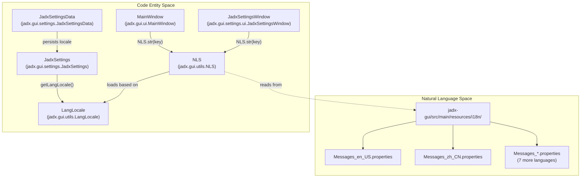
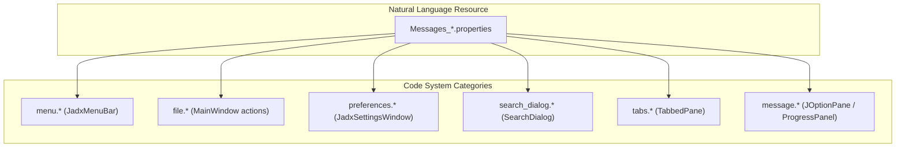
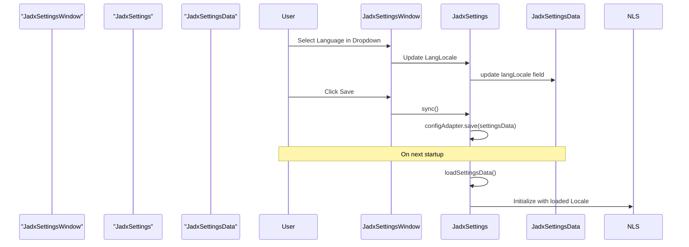

# Internationalization

<details>
<summary>Relevant source files</summary>

The following files were used as context for generating this wiki page:

- [jadx-core/src/main/java/jadx/core/deobf/NameMapper.java](https://github.com/skylot/jadx/blob/HEAD/jadx-core/src/main/java/jadx/core/deobf/NameMapper.java)
- [jadx-core/src/main/java/jadx/core/utils/StringUtils.java](https://github.com/skylot/jadx/blob/HEAD/jadx-core/src/main/java/jadx/core/utils/StringUtils.java)
- [jadx-gui/src/main/java/jadx/gui/cache/code/CodeCacheMode.java](https://github.com/skylot/jadx/blob/HEAD/jadx-gui/src/main/java/jadx/gui/cache/code/CodeCacheMode.java)
- [jadx-gui/src/main/java/jadx/gui/logs/LogPanel.java](https://github.com/skylot/jadx/blob/HEAD/jadx-gui/src/main/java/jadx/gui/logs/LogPanel.java)
- [jadx-gui/src/main/java/jadx/gui/settings/JadxProject.java](https://github.com/skylot/jadx/blob/HEAD/jadx-gui/src/main/java/jadx/gui/settings/JadxProject.java)
- [jadx-gui/src/main/java/jadx/gui/settings/JadxSettings.java](https://github.com/skylot/jadx/blob/HEAD/jadx-gui/src/main/java/jadx/gui/settings/JadxSettings.java)
- [jadx-gui/src/main/java/jadx/gui/settings/data/ProjectData.java](https://github.com/skylot/jadx/blob/HEAD/jadx-gui/src/main/java/jadx/gui/settings/data/ProjectData.java)
- [jadx-gui/src/main/java/jadx/gui/settings/ui/JadxSettingsWindow.java](https://github.com/skylot/jadx/blob/HEAD/jadx-gui/src/main/java/jadx/gui/settings/ui/JadxSettingsWindow.java)
- [jadx-gui/src/main/java/jadx/gui/treemodel/ApkSignatureNode.java](https://github.com/skylot/jadx/blob/HEAD/jadx-gui/src/main/java/jadx/gui/treemodel/ApkSignatureNode.java)
- [jadx-gui/src/main/java/jadx/gui/ui/MainWindow.java](https://github.com/skylot/jadx/blob/HEAD/jadx-gui/src/main/java/jadx/gui/ui/MainWindow.java)
- [jadx-gui/src/main/java/jadx/gui/ui/action/ActionCategory.java](https://github.com/skylot/jadx/blob/HEAD/jadx-gui/src/main/java/jadx/gui/ui/action/ActionCategory.java)
- [jadx-gui/src/main/java/jadx/gui/utils/NLS.java](https://github.com/skylot/jadx/blob/HEAD/jadx-gui/src/main/java/jadx/gui/utils/NLS.java)
- [jadx-gui/src/main/resources/i18n/Messages_de_DE.properties](https://github.com/skylot/jadx/blob/HEAD/jadx-gui/src/main/resources/i18n/Messages_de_DE.properties)
- [jadx-gui/src/main/resources/i18n/Messages_en_US.properties](https://github.com/skylot/jadx/blob/HEAD/jadx-gui/src/main/resources/i18n/Messages_en_US.properties)
- [jadx-gui/src/main/resources/i18n/Messages_es_ES.properties](https://github.com/skylot/jadx/blob/HEAD/jadx-gui/src/main/resources/i18n/Messages_es_ES.properties)
- [jadx-gui/src/main/resources/i18n/Messages_id_ID.properties](https://github.com/skylot/jadx/blob/HEAD/jadx-gui/src/main/resources/i18n/Messages_id_ID.properties)
- [jadx-gui/src/main/resources/i18n/Messages_ko_KR.properties](https://github.com/skylot/jadx/blob/HEAD/jadx-gui/src/main/resources/i18n/Messages_ko_KR.properties)
- [jadx-gui/src/main/resources/i18n/Messages_pt_BR.properties](https://github.com/skylot/jadx/blob/HEAD/jadx-gui/src/main/resources/i18n/Messages_pt_BR.properties)
- [jadx-gui/src/main/resources/i18n/Messages_ru_RU.properties](https://github.com/skylot/jadx/blob/HEAD/jadx-gui/src/main/resources/i18n/Messages_ru_RU.properties)
- [jadx-gui/src/main/resources/i18n/Messages_zh_CN.properties](https://github.com/skylot/jadx/blob/HEAD/jadx-gui/src/main/resources/i18n/Messages_zh_CN.properties)
- [jadx-gui/src/main/resources/i18n/Messages_zh_TW.properties](https://github.com/skylot/jadx/blob/HEAD/jadx-gui/src/main/resources/i18n/Messages_zh_TW.properties)
- [jadx-gui/src/test/java/jadx/gui/TestI18n.java](https://github.com/skylot/jadx/blob/HEAD/jadx-gui/src/test/java/jadx/gui/TestI18n.java)

</details>


This page documents the NLS (National Language Support) system that enables multi-language support across 9 languages in the JADX GUI. All user-facing text is externalized into properties files, enabling runtime language selection and localization maintenance.

---

## NLS System Architecture

The `NLS` class in `jadx.gui.utils.NLS` provides a centralized string localization mechanism using Java's `ResourceBundle` system. GUI components retrieve localized strings through static methods, with automatic fallback to English for missing translations.

**NLS Class Structure and Data Flow**



**Sources:** [jadx-gui/src/main/java/jadx/gui/utils/NLS.java:1-30](https://github.com/skylot/jadx/blob/HEAD/jadx-gui/src/main/java/jadx/gui/utils/NLS.java#L1-L30), [jadx-gui/src/main/java/jadx/gui/ui/MainWindow.java:174-175](https://github.com/skylot/jadx/blob/HEAD/jadx-gui/src/main/java/jadx/gui/ui/MainWindow.java#L174-L175), [jadx-gui/src/main/java/jadx/gui/settings/JadxSettings.java:42-43](https://github.com/skylot/jadx/blob/HEAD/jadx-gui/src/main/java/jadx/gui/settings/JadxSettings.java#L42-L43), [jadx-gui/src/main/resources/i18n/Messages_en_US.properties:1-2](https://github.com/skylot/jadx/blob/HEAD/jadx-gui/src/main/resources/i18n/Messages_en_US.properties#L1-L2)

### Supported Languages

JADX currently supports 9 languages through the `Messages_*.properties` system. Each file includes a `language.name` key for self-identification in the UI.

| Language | Locale Code | Properties File | Key Identification |
|----------|-------------|-----------------|--------------------|
| English | en_US | `Messages_en_US.properties` | `language.name=English` [Messages_en_US.properties:1](https://github.com/skylot/jadx/blob/HEAD/Messages_en_US.properties#L1) |
| Chinese (Simplified) | zh_CN | `Messages_zh_CN.properties` | `language.name=中文（简体）` [Messages_zh_CN.properties:1](https://github.com/skylot/jadx/blob/HEAD/Messages_zh_CN.properties#L1) |
| Chinese (Traditional) | zh_TW | `Messages_zh_TW.properties` | `language.name=中文 (繁體)` [Messages_zh_TW.properties:1](https://github.com/skylot/jadx/blob/HEAD/Messages_zh_TW.properties#L1) |
| German | de_DE | `Messages_de_DE.properties` | `language.name=Deutsch` [Messages_de_DE.properties:1](https://github.com/skylot/jadx/blob/HEAD/Messages_de_DE.properties#L1) |
| Spanish | es_ES | `Messages_es_ES.properties` | `language.name=Español` [Messages_es_ES.properties:1](https://github.com/skylot/jadx/blob/HEAD/Messages_es_ES.properties#L1) |
| Korean | ko_KR | `Messages_ko_KR.properties` | `language.name=한국어` [Messages_ko_KR.properties:1](https://github.com/skylot/jadx/blob/HEAD/Messages_ko_KR.properties#L1) |
| Portuguese (Brazil) | pt_BR | `Messages_pt_BR.properties` | `language.name=Português` [Messages_pt_BR.properties:1](https://github.com/skylot/jadx/blob/HEAD/Messages_pt_BR.properties#L1) |
| Russian | ru_RU | `Messages_ru_RU.properties` | `language.name=Русский` [Messages_ru_RU.properties:1](https://github.com/skylot/jadx/blob/HEAD/Messages_ru_RU.properties#L1) |
| Indonesian | id_ID | `Messages_id_ID.properties` | `language.name=Indonesian` [Messages_id_ID.properties:1](https://github.com/skylot/jadx/blob/HEAD/Messages_id_ID.properties#L1) |

**Sources:** [jadx-gui/src/main/resources/i18n/Messages_en_US.properties:1](https://github.com/skylot/jadx/blob/HEAD/jadx-gui/src/main/resources/i18n/Messages_en_US.properties#L1), [jadx-gui/src/main/resources/i18n/Messages_zh_CN.properties:1](https://github.com/skylot/jadx/blob/HEAD/jadx-gui/src/main/resources/i18n/Messages_zh_CN.properties#L1), [jadx-gui/src/main/resources/i18n/Messages_de_DE.properties:1](https://github.com/skylot/jadx/blob/HEAD/jadx-gui/src/main/resources/i18n/Messages_de_DE.properties#L1), [jadx-gui/src/main/resources/i18n/Messages_es_ES.properties:1](https://github.com/skylot/jadx/blob/HEAD/jadx-gui/src/main/resources/i18n/Messages_es_ES.properties#L1), [jadx-gui/src/main/resources/i18n/Messages_ko_KR.properties:1](https://github.com/skylot/jadx/blob/HEAD/jadx-gui/src/main/resources/i18n/Messages_ko_KR.properties#L1), [jadx-gui/src/main/resources/i18n/Messages_zh_TW.properties:1](https://github.com/skylot/jadx/blob/HEAD/jadx-gui/src/main/resources/i18n/Messages_zh_TW.properties#L1), [jadx-gui/src/main/resources/i18n/Messages_pt_BR.properties:1](https://github.com/skylot/jadx/blob/HEAD/jadx-gui/src/main/resources/i18n/Messages_pt_BR.properties#L1), [jadx-gui/src/main/resources/i18n/Messages_ru_RU.properties:1](https://github.com/skylot/jadx/blob/HEAD/jadx-gui/src/main/resources/i18n/Messages_ru_RU.properties#L1), [jadx-gui/src/main/resources/i18n/Messages_id_ID.properties:1](https://github.com/skylot/jadx/blob/HEAD/jadx-gui/src/main/resources/i18n/Messages_id_ID.properties#L1)

---

## String Retrieval API

The `NLS` class provides static methods for retrieving localized strings. These methods are used throughout the GUI wherever user-facing text is displayed.

### Basic String Lookup
The primary method is `NLS.str(String key)`, which returns the localized string for the given key.

```java
// Examples of NLS usage in GUI components
setTitle(NLS.str("preferences.title")); // [jadx-gui/src/main/java/jadx/gui/settings/ui/JadxSettingsWindow.java:109](https://github.com/skylot/jadx/blob/HEAD/jadx-gui/src/main/java/jadx/gui/settings/ui/JadxSettingsWindow.java#L109)
```

### Parameterized String Formatting
The NLS system supports parameterized strings using standard Java `String.format()` patterns.

| Key Example | Purpose | English Template |
|-------------|---------|------------------|
| `menu.update_label` | Version update | `New version %s available!` [Messages_en_US.properties:32](https://github.com/skylot/jadx/blob/HEAD/Messages_en_US.properties#L32) |
| `message.load_errors` | Loading failure | `Load failed.\nErrors count: %d...` [Messages_en_US.properties:139](https://github.com/skylot/jadx/blob/HEAD/Messages_en_US.properties#L139) |
| `heapUsage.text` | Memory status | `JADX memory usage: %.2f GB of %.2f GB...` [Messages_en_US.properties:164](https://github.com/skylot/jadx/blob/HEAD/Messages_en_US.properties#L164) |

**Sources:** [jadx-gui/src/main/java/jadx/gui/utils/NLS.java:1-30](https://github.com/skylot/jadx/blob/HEAD/jadx-gui/src/main/java/jadx/gui/utils/NLS.java#L1-L30), [jadx-gui/src/main/resources/i18n/Messages_en_US.properties:32](https://github.com/skylot/jadx/blob/HEAD/jadx-gui/src/main/resources/i18n/Messages_en_US.properties#L32), [jadx-gui/src/main/resources/i18n/Messages_en_US.properties:139](https://github.com/skylot/jadx/blob/HEAD/jadx-gui/src/main/resources/i18n/Messages_en_US.properties#L139), [jadx-gui/src/main/resources/i18n/Messages_en_US.properties:164](https://github.com/skylot/jadx/blob/HEAD/jadx-gui/src/main/resources/i18n/Messages_en_US.properties#L164)

---

## Properties File Structure

Each `Messages_*.properties` file follows a hierarchical key naming convention for organizational clarity.

**Property Key Organization**



**Key Naming Convention Table**

| Prefix | UI Location | Example Keys |
|--------|-------------|--------------|
| `menu.*` | Main menu bar | `menu.file`, `menu.view`, `menu.tools` [Messages_en_US.properties:3-22](https://github.com/skylot/jadx/blob/HEAD/Messages_en_US.properties#L3-L22) |
| `file.*` | File operations | `file.open_action`, `file.save_project`, `file.exit` [Messages_en_US.properties:35-53](https://github.com/skylot/jadx/blob/HEAD/Messages_en_US.properties#L35-L53) |
| `tree.*` | Project tree | `tree.sources_title`, `tree.resources_title`, `tree.loading` [Messages_en_US.properties:65-67](https://github.com/skylot/jadx/blob/HEAD/Messages_en_US.properties#L65-L67) |
| `search.*` | Search controls | `search.regex`, `search.match_case`, `search.find` [Messages_en_US.properties:100-103](https://github.com/skylot/jadx/blob/HEAD/Messages_en_US.properties#L100-L103) |
| `tabs.*` | Editor tabs | `tabs.close`, `tabs.pin`, `tabs.code`, `tabs.smali` [Messages_en_US.properties:113-128](https://github.com/skylot/jadx/blob/HEAD/Messages_en_US.properties#L113-L128) |
| `preferences.*` | Settings dialog | `preferences.appearance`, `preferences.decompile`, `preferences.language` [Messages_en_US.properties:251-255](https://github.com/skylot/jadx/blob/HEAD/Messages_en_US.properties#L251-L255) |

**Sources:** [jadx-gui/src/main/resources/i18n/Messages_en_US.properties:1-255](https://github.com/skylot/jadx/blob/HEAD/jadx-gui/src/main/resources/i18n/Messages_en_US.properties#L1-L255)

---

## Language Selection and Configuration

The language setting is managed through the `LangLocale` class and persisted in `JadxSettings`.

**Language Change Sequence**



**Implementation Details:**
- **Persistence:** The locale is stored in `JadxSettingsData` and handled by `JadxSettings` during the `sync()` operation [jadx-gui/src/main/java/jadx/gui/settings/JadxSettings.java:115-119](https://github.com/skylot/jadx/blob/HEAD/jadx-gui/src/main/java/jadx/gui/settings/JadxSettings.java#L115-L119).
- **UI Detection:** `JadxSettingsWindow` tracks language changes to determine if a restart notification or UI reload is necessary [jadx-gui/src/main/java/jadx/gui/settings/ui/JadxSettingsWindow.java:92-105](https://github.com/skylot/jadx/blob/HEAD/jadx-gui/src/main/java/jadx/gui/settings/ui/JadxSettingsWindow.java#L92-L105).
- **Default Locale:** If no setting exists, the system defaults to English (`en_US`).

**Sources:** [jadx-gui/src/main/java/jadx/gui/settings/JadxSettings.java:115-119](https://github.com/skylot/jadx/blob/HEAD/jadx-gui/src/main/java/jadx/gui/settings/JadxSettings.java#L115-L119), [jadx-gui/src/main/java/jadx/gui/settings/ui/JadxSettingsWindow.java:92-105](https://github.com/skylot/jadx/blob/HEAD/jadx-gui/src/main/java/jadx/gui/settings/ui/JadxSettingsWindow.java#L92-L105), [jadx-gui/src/main/java/jadx/gui/utils/NLS.java:1-30](https://github.com/skylot/jadx/blob/HEAD/jadx-gui/src/main/java/jadx/gui/utils/NLS.java#L1-L30)

---

## Translation Fallback and Maintenance

The NLS system uses Java's `ResourceBundle` fallback chain. If a key is missing in a specific locale (e.g., `Messages_de_DE.properties`), it defaults to the value in the base bundle (English).

**Maintenance Indicators:**
Incomplete translations are indicated in the properties files by commented-out keys prefixed with `#`. For example:
- In German: `#menu.enable_preview_tab=Enable Preview Tab` [Messages_de_DE.properties:10](https://github.com/skylot/jadx/blob/HEAD/Messages_de_DE.properties#L10)
- In Spanish: `#menu.recent_projects=Recent projects` [Messages_es_ES.properties:5](https://github.com/skylot/jadx/blob/HEAD/Messages_es_ES.properties#L5)

This allows developers to identify missing translations while ensuring the application remains functional using the English fallback.

**Sources:** [jadx-gui/src/main/resources/i18n/Messages_de_DE.properties:10](https://github.com/skylot/jadx/blob/HEAD/jadx-gui/src/main/resources/i18n/Messages_de_DE.properties#L10), [jadx-gui/src/main/resources/i18n/Messages_es_ES.properties:5](https://github.com/skylot/jadx/blob/HEAD/jadx-gui/src/main/resources/i18n/Messages_es_ES.properties#L5), [jadx-gui/src/main/java/jadx/gui/utils/NLS.java:1-30](https://github.com/skylot/jadx/blob/HEAD/jadx-gui/src/main/java/jadx/gui/utils/NLS.java#L1-L30)29:T3061,# Search and Dialogs

<det