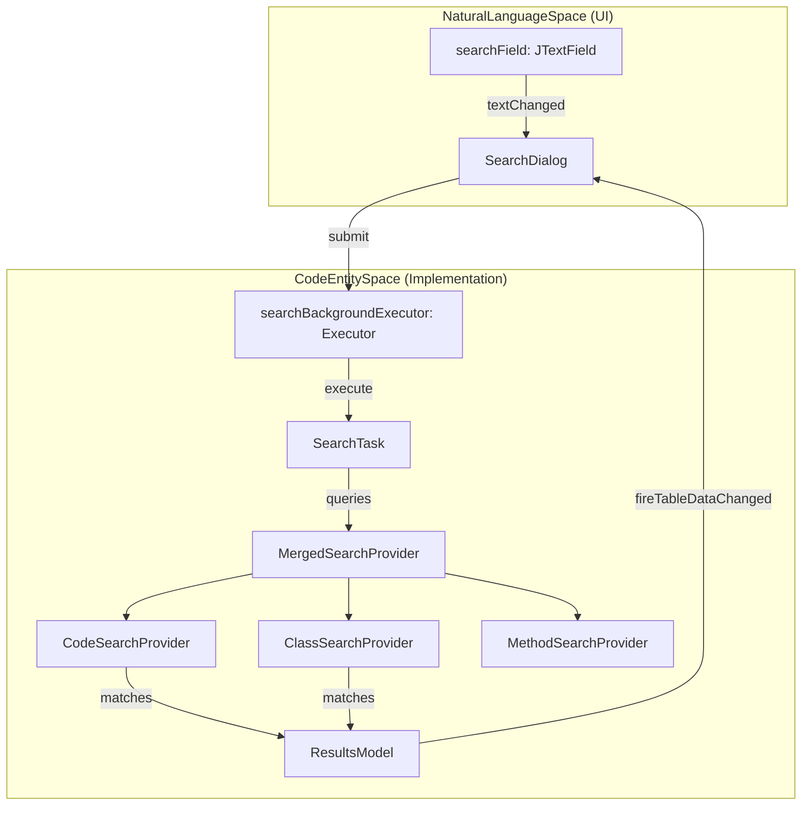
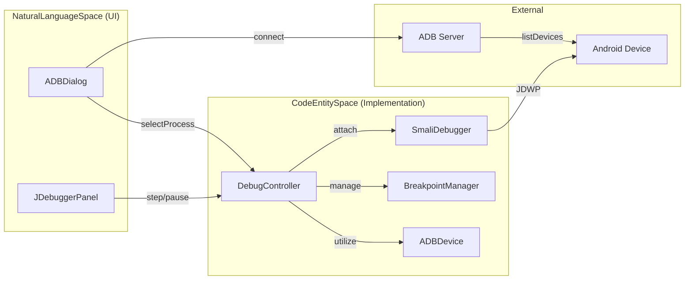

# Search and Dialogs

Relevant source files

The following files were used as context for generating this wiki page:

- [config/checkstyle/checkstyle.xml](https://github.com/skylot/jadx/blob/HEAD/config/checkstyle/checkstyle.xml)
- [jadx-core/src/main/java/jadx/core/utils/log/LogUtils.java](https://github.com/skylot/jadx/blob/HEAD/jadx-core/src/main/java/jadx/core/utils/log/LogUtils.java)
- [jadx-core/src/test/java/jadx/core/utils/log/LogUtilsTest.java](https://github.com/skylot/jadx/blob/HEAD/jadx-core/src/test/java/jadx/core/utils/log/LogUtilsTest.java)
- [jadx-core/src/test/java/jadx/tests/integration/loops/TestLoopCondition.java](https://github.com/skylot/jadx/blob/HEAD/jadx-core/src/test/java/jadx/tests/integration/loops/TestLoopCondition.java)
- [jadx-gui/src/main/java/jadx/gui/device/debugger/DebugController.java](https://github.com/skylot/jadx/blob/HEAD/jadx-gui/src/main/java/jadx/gui/device/debugger/DebugController.java)
- [jadx-gui/src/main/java/jadx/gui/device/debugger/LogcatController.java](https://github.com/skylot/jadx/blob/HEAD/jadx-gui/src/main/java/jadx/gui/device/debugger/LogcatController.java)
- [jadx-gui/src/main/java/jadx/gui/device/protocol/ADB.java](https://github.com/skylot/jadx/blob/HEAD/jadx-gui/src/main/java/jadx/gui/device/protocol/ADB.java)
- [jadx-gui/src/main/java/jadx/gui/device/protocol/ADBDevice.java](https://github.com/skylot/jadx/blob/HEAD/jadx-gui/src/main/java/jadx/gui/device/protocol/ADBDevice.java)
- [jadx-gui/src/main/java/jadx/gui/jobs/BackgroundExecutor.java](https://github.com/skylot/jadx/blob/HEAD/jadx-gui/src/main/java/jadx/gui/jobs/BackgroundExecutor.java)
- [jadx-gui/src/main/java/jadx/gui/jobs/DecompileTask.java](https://github.com/skylot/jadx/blob/HEAD/jadx-gui/src/main/java/jadx/gui/jobs/DecompileTask.java)
- [jadx-gui/src/main/java/jadx/gui/jobs/ExportTask.java](https://github.com/skylot/jadx/blob/HEAD/jadx-gui/src/main/java/jadx/gui/jobs/ExportTask.java)
- [jadx-gui/src/main/java/jadx/gui/jobs/IBackgroundTask.java](https://github.com/skylot/jadx/blob/HEAD/jadx-gui/src/main/java/jadx/gui/jobs/IBackgroundTask.java)
- [jadx-gui/src/main/java/jadx/gui/treemodel/CodeNode.java](https://github.com/skylot/jadx/blob/HEAD/jadx-gui/src/main/java/jadx/gui/treemodel/CodeNode.java)
- [jadx-gui/src/main/java/jadx/gui/ui/codearea/CommentAction.java](https://github.com/skylot/jadx/blob/HEAD/jadx-gui/src/main/java/jadx/gui/ui/codearea/CommentAction.java)
- [jadx-gui/src/main/java/jadx/gui/ui/codearea/mode/JCodeMode.java](https://github.com/skylot/jadx/blob/HEAD/jadx-gui/src/main/java/jadx/gui/ui/codearea/mode/JCodeMode.java)
- [jadx-gui/src/main/java/jadx/gui/ui/dialog/ADBDialog.java](https://github.com/skylot/jadx/blob/HEAD/jadx-gui/src/main/java/jadx/gui/ui/dialog/ADBDialog.java)
- [jadx-gui/src/main/java/jadx/gui/ui/dialog/CommentDialog.java](https://github.com/skylot/jadx/blob/HEAD/jadx-gui/src/main/java/jadx/gui/ui/dialog/CommentDialog.java)
- [jadx-gui/src/main/java/jadx/gui/ui/dialog/CommonSearchDialog.java](https://github.com/skylot/jadx/blob/HEAD/jadx-gui/src/main/java/jadx/gui/ui/dialog/CommonSearchDialog.java)
- [jadx-gui/src/main/java/jadx/gui/ui/dialog/RenameDialog.java](https://github.com/skylot/jadx/blob/HEAD/jadx-gui/src/main/java/jadx/gui/ui/dialog/RenameDialog.java)
- [jadx-gui/src/main/java/jadx/gui/ui/dialog/SearchDialog.java](https://github.com/skylot/jadx/blob/HEAD/jadx-gui/src/main/java/jadx/gui/ui/dialog/SearchDialog.java)
- [jadx-gui/src/main/java/jadx/gui/ui/dialog/UsageDialog.java](https://github.com/skylot/jadx/blob/HEAD/jadx-gui/src/main/java/jadx/gui/ui/dialog/UsageDialog.java)
- [jadx-gui/src/main/java/jadx/gui/ui/filedialog/CustomFileChooser.java](https://github.com/skylot/jadx/blob/HEAD/jadx-gui/src/main/java/jadx/gui/ui/filedialog/CustomFileChooser.java)
- [jadx-gui/src/main/java/jadx/gui/ui/filedialog/CustomFileDialog.java](https://github.com/skylot/jadx/blob/HEAD/jadx-gui/src/main/java/jadx/gui/ui/filedialog/CustomFileDialog.java)
- [jadx-gui/src/main/java/jadx/gui/ui/filedialog/FileDialogWrapper.java](https://github.com/skylot/jadx/blob/HEAD/jadx-gui/src/main/java/jadx/gui/ui/filedialog/FileDialogWrapper.java)
- [jadx-gui/src/main/java/jadx/gui/ui/filedialog/FileNameMultiExtensionFilter.java](https://github.com/skylot/jadx/blob/HEAD/jadx-gui/src/main/java/jadx/gui/ui/filedialog/FileNameMultiExtensionFilter.java)
- [jadx-gui/src/main/java/jadx/gui/ui/panel/JDebuggerPanel.java](https://github.com/skylot/jadx/blob/HEAD/jadx-gui/src/main/java/jadx/gui/ui/panel/JDebuggerPanel.java)
- [jadx-gui/src/main/java/jadx/gui/ui/panel/LogcatPanel.java](https://github.com/skylot/jadx/blob/HEAD/jadx-gui/src/main/java/jadx/gui/ui/panel/LogcatPanel.java)
- [jadx-gui/src/main/java/jadx/gui/ui/popupmenu/JClassExportType.java](https://github.com/skylot/jadx/blob/HEAD/jadx-gui/src/main/java/jadx/gui/ui/popupmenu/JClassExportType.java)
- [jadx-gui/src/main/java/jadx/gui/ui/popupmenu/JClassPopupMenu.java](https://github.com/skylot/jadx/blob/HEAD/jadx-gui/src/main/java/jadx/gui/ui/popupmenu/JClassPopupMenu.java)
- [jadx-gui/src/main/java/jadx/gui/ui/popupmenu/JResourcePopupMenu.java](https://github.com/skylot/jadx/blob/HEAD/jadx-gui/src/main/java/jadx/gui/ui/popupmenu/JResourcePopupMenu.java)
- [jadx-gui/src/main/java/jadx/gui/utils/CacheObject.java](https://github.com/skylot/jadx/blob/HEAD/jadx-gui/src/main/java/jadx/gui/utils/CacheObject.java)
- [jadx-gui/src/main/java/jadx/gui/utils/IOUtils.java](https://github.com/skylot/jadx/blob/HEAD/jadx-gui/src/main/java/jadx/gui/utils/IOUtils.java)
- [jadx-gui/src/main/java/jadx/gui/utils/JNodeCache.java](https://github.com/skylot/jadx/blob/HEAD/jadx-gui/src/main/java/jadx/gui/utils/JNodeCache.java)
- [jadx-gui/src/main/java/jadx/gui/utils/UiUtils.java](https://github.com/skylot/jadx/blob/HEAD/jadx-gui/src/main/java/jadx/gui/utils/UiUtils.java)

JADX-GUI provides a robust infrastructure for searching decompiled code, finding usages of code entities, and performing interactive operations like renaming and debugging. This page documents the search implementation, the usage/rename dialogs, and the integration with the Android Debug Bridge (ADB).

## Search Infrastructure

The search system is built around a hierarchy of dialogs and providers that allow for multi-threaded, asynchronous searching across classes, methods, fields, code, and resources.

### Search Dialog Hierarchy

The core of the search UI is `CommonSearchDialog`, which provides a reusable template for displaying search results in a table with a progress bar and common actions (Open, Copy, Cancel).

*   **`CommonSearchDialog`**: An abstract `JFrame` that handles the results table (`ResultsTable`), results model (`ResultsModel`), and basic UI components like the progress panel [jadx-gui/src/main/java/jadx/gui/ui/dialog/CommonSearchDialog.java:70-85](https://github.com/skylot/jadx/blob/HEAD/jadx-gui/src/main/java/jadx/gui/ui/dialog/CommonSearchDialog.java#L70-L85).
*   **`SearchDialog`**: The primary text search interface. It supports various `SearchOptions` (Class, Method, Field, Code, Resource, Comment) and uses `RxJava` to handle asynchronous search event streams [jadx-gui/src/main/java/jadx/gui/ui/dialog/SearchDialog.java:88-150](https://github.com/skylot/jadx/blob/HEAD/jadx-gui/src/main/java/jadx/gui/ui/dialog/SearchDialog.java#L88-L150).
*   **`UsageDialog`**: A specialized search dialog used to find all references to a specific `JNode` (class, method, or field) [jadx-gui/src/main/java/jadx/gui/ui/dialog/UsageDialog.java:38-42](https://github.com/skylot/jadx/blob/HEAD/jadx-gui/src/main/java/jadx/gui/ui/dialog/UsageDialog.java#L38-L42).

### Data Flow and Execution

The `SearchDialog` uses a background executor to perform searches without freezing the UI. It leverages `SearchTask` and various providers (e.g., `CodeSearchProvider`, `ClassSearchProvider`) to scan the codebase.

**Search Execution Diagram:**

Sources: [jadx-gui/src/main/java/jadx/gui/ui/dialog/SearchDialog.java:62-71](https://github.com/skylot/jadx/blob/HEAD/jadx-gui/src/main/java/jadx/gui/ui/dialog/SearchDialog.java#L62-L71), [jadx-gui/src/main/java/jadx/gui/ui/dialog/SearchDialog.java:156-180](https://github.com/skylot/jadx/blob/HEAD/jadx-gui/src/main/java/jadx/gui/ui/dialog/SearchDialog.java#L156-L180)

## Finding Usages

The `UsageDialog` identifies where a specific code element is referenced. It supports finding usages for methods (including overrides), classes (including constructors), and fields.

### Implementation Details
1.  **Query Building**: `buildUsageQuery()` maps the target `JNode` to its corresponding `JavaNode` and identifies where to look for usages using `JavaNode.getUseIn()` [jadx-gui/src/main/java/jadx/gui/ui/dialog/UsageDialog.java:105-137](https://github.com/skylot/jadx/blob/HEAD/jadx-gui/src/main/java/jadx/gui/ui/dialog/UsageDialog.java#L105-L137).
2.  **Constant Handling**: If "Replace Constants" is enabled in settings, searching for a field usage may trigger a full decompilation via `mainWindow.requestFullDecompilation()` to ensure all constant replacements are identified [jadx-gui/src/main/java/jadx/gui/ui/dialog/UsageDialog.java:82-91](https://github.com/skylot/jadx/blob/HEAD/jadx-gui/src/main/java/jadx/gui/ui/dialog/UsageDialog.java#L82-L91).
3.  **Data Collection**: `processUsage()` extracts the exact line of code and position for every usage found in a `JavaClass` using `topUseClass.getUsePlacesFor(codeInfo, searchNode)` [jadx-gui/src/main/java/jadx/gui/ui/dialog/UsageDialog.java:147-166](https://github.com/skylot/jadx/blob/HEAD/jadx-gui/src/main/java/jadx/gui/ui/dialog/UsageDialog.java#L147-L166).

Sources: [jadx-gui/src/main/java/jadx/gui/ui/dialog/UsageDialog.java:82-91](https://github.com/skylot/jadx/blob/HEAD/jadx-gui/src/main/java/jadx/gui/ui/dialog/UsageDialog.java#L82-L91), [jadx-gui/src/main/java/jadx/gui/ui/dialog/UsageDialog.java:105-166](https://github.com/skylot/jadx/blob/HEAD/jadx-gui/src/main/java/jadx/gui/ui/dialog/UsageDialog.java#L105-L166)

## Rename Dialog

The `RenameDialog` provides a UI for users to provide aliases for classes, packages, methods, or fields.

*   **Validation**: It uses `node.isValidName(newName)` to ensure the provided identifier is valid for the target entity [jadx-gui/src/main/java/jadx/gui/ui/dialog/RenameDialog.java:76-87](https://github.com/skylot/jadx/blob/HEAD/jadx-gui/src/main/java/jadx/gui/ui/dialog/RenameDialog.java#L76-L87).
*   **Event System**: Instead of renaming the entity directly, it emits a `NodeRenamedByUser` event via the `MainWindow` event bus. This allows the decompiler and the UI (tree, code areas) to react and update the display globally [jadx-gui/src/main/java/jadx/gui/ui/dialog/RenameDialog.java:114-120](https://github.com/skylot/jadx/blob/HEAD/jadx-gui/src/main/java/jadx/gui/ui/dialog/RenameDialog.java#L114-L120).

Sources: [jadx-gui/src/main/java/jadx/gui/ui/dialog/RenameDialog.java:35-49](https://github.com/skylot/jadx/blob/HEAD/jadx-gui/src/main/java/jadx/gui/ui/dialog/RenameDialog.java#L35-L49), [jadx-gui/src/main/java/jadx/gui/ui/dialog/RenameDialog.java:114-120](https://github.com/skylot/jadx/blob/HEAD/jadx-gui/src/main/java/jadx/gui/ui/dialog/RenameDialog.java#L114-L120)

## Comment Dialog

The `CommentDialog` allows users to add or edit code comments at specific positions in the source code.

*   **Persistence**: Comments are stored in the `JadxProject` metadata via `JadxCodeData`.
*   **Update Mechanism**: When a comment is added or updated, the dialog notifies the core engine and triggers a background refresh of the class code area.

Sources: [jadx-gui/src/main/java/jadx/gui/ui/dialog/CommentDialog.java:37-69](https://github.com/skylot/jadx/blob/HEAD/jadx-gui/src/main/java/jadx/gui/ui/dialog/CommentDialog.java#L37-L69)

## ADB and Debugger Integration

JADX-GUI includes an ADB (Android Debug Bridge) integration that allows users to attach a debugger to a running process on an Android device.

### ADB Dialog
The `ADBDialog` handles device discovery and process selection. It lists connected devices and their JDWP (Java Debug Wire Protocol) processes in a `JTree` [jadx-gui/src/main/java/jadx/gui/ui/dialog/ADBDialog.java:54-72](https://github.com/skylot/jadx/blob/HEAD/jadx-gui/src/main/java/jadx/gui/ui/dialog/ADBDialog.java#L54-L72).

*   **Device Tracking**: Implements `ADB.DeviceStateListener` and `ADB.JDWPProcessListener` to update the UI when devices are plugged in or processes start/stop [jadx-gui/src/main/java/jadx/gui/ui/dialog/ADBDialog.java:54](https://github.com/skylot/jadx/blob/HEAD/jadx-gui/src/main/java/jadx/gui/ui/dialog/ADBDialog.java#L54).
*   **App Launching**: Can trigger an app launch with the `-D` (wait for debugger) flag via `ADBDevice.launchApp()` [jadx-gui/src/main/java/jadx/gui/device/protocol/ADBDevice.java:104-122](https://github.com/skylot/jadx/blob/HEAD/jadx-gui/src/main/java/jadx/gui/device/protocol/ADBDevice.java#L104-L122).

### Debugger Controller
The `DebugController` orchestrates the debugging session, managing breakpoints and execution state. It implements `IDebugController` and `SmaliDebugger.SuspendListener` [jadx-gui/src/main/java/jadx/gui/device/debugger/DebugController.java:45](https://github.com/skylot/jadx/blob/HEAD/jadx-gui/src/main/java/jadx/gui/device/debugger/DebugController.java#L45).

**Debugger Integration Diagram:**

Sources: [jadx-gui/src/main/java/jadx/gui/ui/dialog/ADBDialog.java:54-72](https://github.com/skylot/jadx/blob/HEAD/jadx-gui/src/main/java/jadx/gui/ui/dialog/ADBDialog.java#L54-L72), [jadx-gui/src/main/java/jadx/gui/device/debugger/DebugController.java:75-105](https://github.com/skylot/jadx/blob/HEAD/jadx-gui/src/main/java/jadx/gui/device/debugger/DebugController.java#L75-L105), [jadx-gui/src/main/java/jadx/gui/device/protocol/ADBDevice.java:61-82](https://github.com/skylot/jadx/blob/HEAD/jadx-gui/src/main/java/jadx/gui/device/protocol/ADBDevice.java#L61-L82)

### Key Classes in Debugging

| Class | Responsibility |
| --- | --- |
| `ADBDevice` | Handles low-level ADB commands like port forwarding and shell execution [jadx-gui/src/main/java/jadx/gui/device/protocol/ADBDevice.java:25](https://github.com/skylot/jadx/blob/HEAD/jadx-gui/src/main/java/jadx/gui/device/protocol/ADBDevice.java#L25). |
| `DebugController` | Orchestrates the `SmaliDebugger` and updates the `JDebuggerPanel` [jadx-gui/src/main/java/jadx/gui/device/debugger/DebugController.java:45](https://github.com/skylot/jadx/blob/HEAD/jadx-gui/src/main/java/jadx/gui/device/debugger/DebugController.java#L45). |
| `JDebuggerPanel` | UI component containing the stack frame list, variable tree, and debugger logs [jadx-gui/src/main/java/jadx/gui/ui/panel/JDebuggerPanel.java:58](https://github.com/skylot/jadx/blob/HEAD/jadx-gui/src/main/java/jadx/gui/ui/panel/JDebuggerPanel.java#L58). |
| `SmaliDebugger` | The JDWP client implementation for debugging Android processes [jadx-gui/src/main/java/jadx/gui/device/debugger/DebugController.java:82](https://github.com/skylot/jadx/blob/HEAD/jadx-gui/src/main/java/jadx/gui/device/debugger/DebugController.java#L82). |

Sources: [jadx-gui/src/main/java/jadx/gui/device/protocol/ADBDevice.java:25](https://github.com/skylot/jadx/blob/HEAD/jadx-gui/src/main/java/jadx/gui/device/protocol/ADBDevice.java#L25), [jadx-gui/src/main/java/jadx/gui/device/debugger/DebugController.java:45-82](https://github.com/skylot/jadx/blob/HEAD/jadx-gui/src/main/java/jadx/gui/device/debugger/DebugController.java#L45-L82), [jadx-gui/src/main/java/jadx/gui/ui/panel/JDebuggerPanel.java:58](https://github.com/skylot/jadx/blob/HEAD/jadx-gui/src/main/java/jadx/gui/ui/panel/JDebuggerPanel.java#L58)