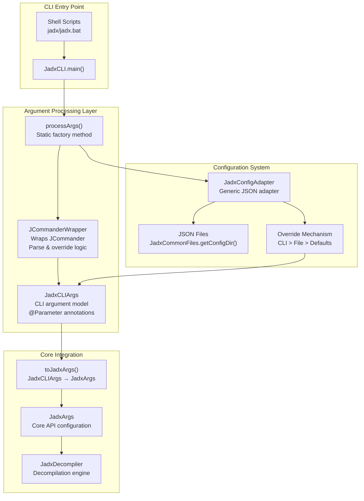
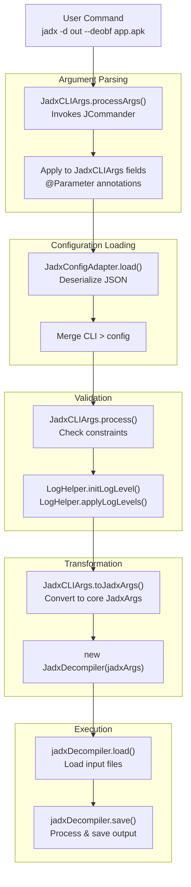

# Command Line Interface

<details>
<summary>Relevant source files</summary>

The following files were used as context for generating this wiki page:

- [README.md](https://github.com/skylot/jadx/blob/HEAD/README.md)
- [jadx-cli/src/main/java/jadx/cli/JCommanderWrapper.java](https://github.com/skylot/jadx/blob/HEAD/jadx-cli/src/main/java/jadx/cli/JCommanderWrapper.java)
- [jadx-cli/src/main/java/jadx/cli/JadxCLI.java](https://github.com/skylot/jadx/blob/HEAD/jadx-cli/src/main/java/jadx/cli/JadxCLI.java)
- [jadx-cli/src/main/java/jadx/cli/JadxCLIArgs.java](https://github.com/skylot/jadx/blob/HEAD/jadx-cli/src/main/java/jadx/cli/JadxCLIArgs.java)
- [jadx-cli/src/main/java/jadx/cli/LogHelper.java](https://github.com/skylot/jadx/blob/HEAD/jadx-cli/src/main/java/jadx/cli/LogHelper.java)
- [jadx-cli/src/test/java/jadx/cli/JadxCLIArgsTest.java](https://github.com/skylot/jadx/blob/HEAD/jadx-cli/src/test/java/jadx/cli/JadxCLIArgsTest.java)
- [jadx-cli/src/test/java/jadx/cli/TestInput.java](https://github.com/skylot/jadx/blob/HEAD/jadx-cli/src/test/java/jadx/cli/TestInput.java)
- [jadx-cli/src/test/resources/samples/HelloWorld.smali](https://github.com/skylot/jadx/blob/HEAD/jadx-cli/src/test/resources/samples/HelloWorld.smali)
- [jadx-cli/src/test/resources/samples/defpkg.smali](https://github.com/skylot/jadx/blob/HEAD/jadx-cli/src/test/resources/samples/defpkg.smali)
- [jadx-cli/src/test/resources/samples/hello.dex](https://github.com/skylot/jadx/blob/HEAD/jadx-cli/src/test/resources/samples/hello.dex)
- [jadx-cli/src/test/resources/samples/resources-only.apk](https://github.com/skylot/jadx/blob/HEAD/jadx-cli/src/test/resources/samples/resources-only.apk)
- [jadx-core/src/main/java/jadx/api/JadxArgs.java](https://github.com/skylot/jadx/blob/HEAD/jadx-core/src/main/java/jadx/api/JadxArgs.java)
- [jadx-core/src/main/java/jadx/core/plugins/files/SingleDirFilesGetter.java](https://github.com/skylot/jadx/blob/HEAD/jadx-core/src/main/java/jadx/core/plugins/files/SingleDirFilesGetter.java)
- [jadx-core/src/main/java/jadx/core/utils/files/FileUtils.java](https://github.com/skylot/jadx/blob/HEAD/jadx-core/src/main/java/jadx/core/utils/files/FileUtils.java)
- [jadx-core/src/main/java/jadx/core/xmlgen/BinaryXMLParser.java](https://github.com/skylot/jadx/blob/HEAD/jadx-core/src/main/java/jadx/core/xmlgen/BinaryXMLParser.java)
- [jadx-gui/src/main/java/jadx/gui/JadxGUI.java](https://github.com/skylot/jadx/blob/HEAD/jadx-gui/src/main/java/jadx/gui/JadxGUI.java)
- [jadx-gui/src/main/java/jadx/gui/JadxWrapper.java](https://github.com/skylot/jadx/blob/HEAD/jadx-gui/src/main/java/jadx/gui/JadxWrapper.java)

</details>


## Purpose and Scope

This page introduces the JADX command-line interface (CLI), its command structure, and how it provides scriptable access to decompilation functionality. The CLI serves as a terminal-based entry point to the core decompiler, accepting input files and configuration options to control decompilation behavior. For detailed information on specific subsystems, see:

- **[Argument Processing and Configuration](21_4.1-argument-processing-and-configuration.md)** — Details on `JadxCLIArgs`, JCommander integration, validation, and conversion to `JadxArgs`.
- **[Commands and Plugins Management](22_4.2-commands-and-plugins-management.md)** — Command registry, `ICommand` interface, and the `plugins` subcommand.
- **[Configuration Files and Common Directories](23_4.3-configuration-files-and-common-directories.md)** — JSON configuration, platform directories, and environment variables.

For the graphical interface, see [GUI Application](13_3-gui-application.md).

**Sources:** [README.md:87-134](https://github.com/skylot/jadx/blob/HEAD/README.md#L87-L134), [jadx-cli/src/main/java/jadx/cli/JadxCLI.java:25-35](https://github.com/skylot/jadx/blob/HEAD/jadx-cli/src/main/java/jadx/cli/JadxCLI.java#L25-L35)

## Overview

The JADX CLI (`jadx` executable) provides terminal-based access to the decompiler. It processes command-line arguments, loads configuration files, and invokes the core `JadxDecompiler` API to perform decompilation. The CLI is implemented in the `jadx-cli` module and is distributed as shell scripts (`jadx`, `jadx-gui`) that wrap the Java application.

The CLI supports:
- **Input file processing** — APK, DEX, JAR, CLASS, AAR, AAB, SMALI, ZIP, ARSC, XAPK, APKM, and Kotlin script files [README.md:89-89](https://github.com/skylot/jadx/blob/HEAD/README.md#L89).
- **Output control** — Separate directories for sources and resources, single-class extraction [jadx-cli/src/main/java/jadx/cli/JadxCLIArgs.java:55-81](https://github.com/skylot/jadx/blob/HEAD/jadx-cli/src/main/java/jadx/cli/JadxCLIArgs.java#L55-L81).
- **Decompilation modes** — `AUTO`, `RESTRUCTURE`, `SIMPLE`, `FALLBACK` [jadx-cli/src/main/java/jadx/cli/JadxCLIArgs.java:101-109](https://github.com/skylot/jadx/blob/HEAD/jadx-cli/src/main/java/jadx/cli/JadxCLIArgs.java#L101-L109).
- **Deobfuscation** — Name length constraints, mapping file support (ProGuard, Tiny, Enigma formats) [jadx-cli/src/main/java/jadx/cli/JadxCLIArgs.java:153-195](https://github.com/skylot/jadx/blob/HEAD/jadx-cli/src/main/java/jadx/cli/JadxCLIArgs.java#L153-L195).
- **Code generation options** — Imports, debug info, inline settings, Unicode escaping [jadx-cli/src/main/java/jadx/cli/JadxCLIArgs.java:117-151](https://github.com/skylot/jadx/blob/HEAD/jadx-cli/src/main/java/jadx/cli/JadxCLIArgs.java#L117-L151).
- **Resource processing** — XML decoding, pretty printing, Gradle export [jadx-cli/src/main/java/jadx/cli/JadxCLIArgs.java:66-98](https://github.com/skylot/jadx/blob/HEAD/jadx-cli/src/main/java/jadx/cli/JadxCLIArgs.java#L66-L98).
- **Plugin configuration** — Dynamic plugin options via `-P` flags [jadx-cli/src/main/java/jadx/cli/JadxCLIArgs.java:352-353](https://github.com/skylot/jadx/blob/HEAD/jadx-cli/src/main/java/jadx/cli/JadxCLIArgs.java#L352-L353).
- **Extensible commands** — Subcommand system for plugin management and other utilities [README.md:90-91](https://github.com/skylot/jadx/blob/HEAD/README.md#L90-L91).
- **Analysis Exports** — Ability to generate and save call graphs in JSON or DOT formats using `JadxCallGraph` [jadx-cli/src/main/java/jadx/cli/JadxCLI.java:140-163](https://github.com/skylot/jadx/blob/HEAD/jadx-cli/src/main/java/jadx/cli/JadxCLI.java#L140-L163).

**Sources:** [README.md:87-134](https://github.com/skylot/jadx/blob/HEAD/README.md#L87-L134), [jadx-cli/src/main/java/jadx/cli/JadxCLIArgs.java:47-354](https://github.com/skylot/jadx/blob/HEAD/jadx-cli/src/main/java/jadx/cli/JadxCLIArgs.java#L47-L354), [jadx-cli/src/main/java/jadx/cli/JadxCLI.java:140-163](https://github.com/skylot/jadx/blob/HEAD/jadx-cli/src/main/java/jadx/cli/JadxCLI.java#L140-L163)

## CLI Entry Points

The JADX CLI is invoked through platform-specific shell scripts that wrap the Java application. The main entry point is the `main()` method in the `JadxCLI` class [jadx-cli/src/main/java/jadx/cli/JadxCLI.java:28-35](https://github.com/skylot/jadx/blob/HEAD/jadx-cli/src/main/java/jadx/cli/JadxCLI.java#L28-L35).

### Unix/Linux/macOS Scripts
The `jadx` script in the `bin/` directory locates the Java runtime and executes the `jadx-cli` JAR, passing all arguments (`$@`) [README.md:45-47](https://github.com/skylot/jadx/blob/HEAD/README.md#L45-L47).

### Windows Batch Files
The `jadx.bat` script for Windows performs similar logic using `%*` to forward arguments [README.md:49-49](https://github.com/skylot/jadx/blob/HEAD/README.md#L49).

### Direct JAR Execution
The CLI can also be invoked directly via Java:
```bash
java -jar jadx-cli-<version>.jar [options] <input-files>
```

The execution flow in `JadxCLI.execute()`:
1. Parses command-line arguments using `JadxCLIArgs.processArgs()` [jadx-cli/src/main/java/jadx/cli/JadxCLI.java:43-46](https://github.com/skylot/jadx/blob/HEAD/jadx-cli/src/main/java/jadx/cli/JadxCLI.java#L43-L46).
2. Converts CLI arguments to core `JadxArgs` via `buildArgs()` [jadx-cli/src/main/java/jadx/cli/JadxCLI.java:49-52](https://github.com/skylot/jadx/blob/HEAD/jadx-cli/src/main/java/jadx/cli/JadxCLI.java#L49-L52).
3. Creates a `JadxDecompiler` instance and invokes `load()` then `save()` (or `SingleClassMode.process()` if applicable) [jadx-cli/src/main/java/jadx/cli/JadxCLI.java:75-88](https://github.com/skylot/jadx/blob/HEAD/jadx-cli/src/main/java/jadx/cli/JadxCLI.java#L75-L88).

**Sources:** [README.md:45-50](https://github.com/skylot/jadx/blob/HEAD/README.md#L45-L50), [jadx-cli/src/main/java/jadx/cli/JadxCLI.java:28-88](https://github.com/skylot/jadx/blob/HEAD/jadx-cli/src/main/java/jadx/cli/JadxCLI.java#L28-L88)

## Command Structure

The CLI follows a hierarchical command structure:

```
jadx [options] <input-files>
jadx <command> [command-options]
```

### Main Command (Default)
When no subcommand is specified, the CLI performs decompilation on the provided `<input files>` [jadx-cli/src/main/java/jadx/cli/JadxCLIArgs.java:51-52](https://github.com/skylot/jadx/blob/HEAD/jadx-cli/src/main/java/jadx/cli/JadxCLIArgs.java#L51-L52).

### Subcommands
The CLI supports extensible subcommands managed by `JadxCLICommands`:
- **`plugins`** — Manage JADX plugins (install, update, remove) [README.md:91-91](https://github.com/skylot/jadx/blob/HEAD/README.md#L91).

**Sources:** [README.md:87-91](https://github.com/skylot/jadx/blob/HEAD/README.md#L87-L91), [jadx-cli/src/main/java/jadx/cli/JadxCLIArgs.java:51-52](https://github.com/skylot/jadx/blob/HEAD/jadx-cli/src/main/java/jadx/cli/JadxCLIArgs.java#L51-L52), [jadx-cli/src/main/java/jadx/cli/JCommanderWrapper.java:62-68](https://github.com/skylot/jadx/blob/HEAD/jadx-cli/src/main/java/jadx/cli/JCommanderWrapper.java#L62-L68)

## High-Level Architecture

**Diagram: CLI Component Architecture and Data Flow**



**Sources:** [jadx-cli/src/main/java/jadx/cli/JadxCLI.java:37-88](https://github.com/skylot/jadx/blob/HEAD/jadx-cli/src/main/java/jadx/cli/JadxCLI.java#L37-L88), [jadx-cli/src/main/java/jadx/cli/JadxCLIArgs.java:47-354](https://github.com/skylot/jadx/blob/HEAD/jadx-cli/src/main/java/jadx/cli/JadxCLIArgs.java#L47-L354), [jadx-cli/src/main/java/jadx/cli/JCommanderWrapper.java:29-39](https://github.com/skylot/jadx/blob/HEAD/jadx-cli/src/main/java/jadx/cli/JCommanderWrapper.java#L29-L39)

## Processing Flow

**Diagram: From Command Line to Decompilation**



**Sources:** [jadx-cli/src/main/java/jadx/cli/JadxCLI.java:38-88](https://github.com/skylot/jadx/blob/HEAD/jadx-cli/src/main/java/jadx/cli/JadxCLI.java#L38-L88), [jadx-cli/src/main/java/jadx/cli/LogHelper.java:37-66](https://github.com/skylot/jadx/blob/HEAD/jadx-cli/src/main/java/jadx/cli/LogHelper.java#L37-L66), [jadx-cli/src/main/java/jadx/cli/JadxCLIArgs.java:216-220](https://github.com/skylot/jadx/blob/HEAD/jadx-cli/src/main/java/jadx/cli/JadxCLIArgs.java#L216-L220)

## Major Option Categories

The CLI provides over 50 command-line options defined as fields in `JadxCLIArgs` [jadx-cli/src/main/java/jadx/cli/JadxCLIArgs.java:47-354](https://github.com/skylot/jadx/blob/HEAD/jadx-cli/src/main/java/jadx/cli/JadxCLIArgs.java#L47-L354).

| Category | Purpose | Key Options |
|----------|---------|-------------|
| **Input/Output** | Specify input files and output locations | `-d`, `--output-dir-src`, `--single-class` |
| **Decompilation Mode** | Control code generation strategy | `-m`, `--decompilation-mode`, `--show-bad-code` |
| **Code Generation** | Control output code style | `--no-imports`, `--no-inline-methods`, `--escape-unicode` |
| **Deobfuscation** | Configure name deobfuscation | `--deobf`, `--mappings-path`, `--rename-flags` |
| **Resource Processing** | Control resource decoding | `-r`, `--no-res`, `--export-gradle` |
| **Performance** | Threading and optimization | `-j`, `--threads-count` |
| **Output Control** | Logging and format | `--log-level`, `-v`, `-q`, `--output-format` |
| **Plugins** | Plugin configuration | `-P<name>=<value>` |

**Sources:** [README.md:93-134](https://github.com/skylot/jadx/blob/HEAD/README.md#L93-L134), [jadx-cli/src/main/java/jadx/cli/JadxCLIArgs.java:50-354](https://github.com/skylot/jadx/blob/HEAD/jadx-cli/src/main/java/jadx/cli/JadxCLIArgs.java#L50-L354)

## Core Components

### JadxCLIArgs
The primary argument model using JCommander `@Parameter` annotations [jadx-cli/src/main/java/jadx/cli/JadxCLIArgs.java:47-51](https://github.com/skylot/jadx/blob/HEAD/jadx-cli/src/main/java/jadx/cli/JadxCLIArgs.java#L47-L51). It handles the conversion from CLI-specific flags to the core `JadxArgs` required by the decompiler [jadx-cli/src/main/java/jadx/cli/JadxCLIArgs.java:216-220](https://github.com/skylot/jadx/blob/HEAD/jadx-cli/src/main/java/jadx/cli/JadxCLIArgs.java#L216-L220). It implements `IJadxConfig` to participate in the unified configuration system [jadx-cli/src/main/java/jadx/cli/JadxCLIArgs.java:47](https://github.com/skylot/jadx/blob/HEAD/jadx-cli/src/main/java/jadx/cli/JadxCLIArgs.java#L47).

### LogHelper
Manages CLI logging levels (QUIET, PROGRESS, ERROR, WARN, INFO, DEBUG) [jadx-cli/src/main/java/jadx/cli/LogHelper.java:15-32](https://github.com/skylot/jadx/blob/HEAD/jadx-cli/src/main/java/jadx/cli/LogHelper.java#L15-L32). It can dynamically adjust levels for specific classes like `JadxDecompiler` or `JadxCLI` to show progress without flooding the console [jadx-cli/src/main/java/jadx/cli/LogHelper.java:71-78](https://github.com/skylot/jadx/blob/HEAD/jadx-cli/src/main/java/jadx/cli/LogHelper.java#L71-L78).

### JadxFilesGetter
Provides the decompiler with platform-appropriate directories for configuration and caching. The CLI uses `JadxFilesGetter.INSTANCE` [jadx-cli/src/main/java/jadx/cli/JadxCLI.java:68](https://github.com/skylot/jadx/blob/HEAD/jadx-cli/src/main/java/jadx/cli/JadxCLI.java#L68), which is defined in the `jadx-cli` module [jadx-cli/src/main/java/jadx/cli/plugins/JadxFilesGetter.java](https://github.com/skylot/jadx/blob/HEAD/jadx-cli/src/main/java/jadx/cli/plugins/JadxFilesGetter.java).

**Sources:** [jadx-cli/src/main/java/jadx/cli/JadxCLIArgs.java:47-60](https://github.com/skylot/jadx/blob/HEAD/jadx-cli/src/main/java/jadx/cli/JadxCLIArgs.java#L47-L60), [jadx-cli/src/main/java/jadx/cli/LogHelper.java:12-78](https://github.com/skylot/jadx/blob/HEAD/jadx-cli/src/main/java/jadx/cli/LogHelper.java#L12-L78), [jadx-cli/src/main/java/jadx/cli/JadxCLI.java:68](https://github.com/skylot/jadx/blob/HEAD/jadx-cli/src/main/java/jadx/cli/JadxCLI.java#L68)

## Plugin Options

Plugin-specific configuration is passed via the `-P` dynamic parameter flag [jadx-cli/src/main/java/jadx/cli/JadxCLIArgs.java:352-353](https://github.com/skylot/jadx/blob/HEAD/jadx-cli/src/main/java/jadx/cli/JadxCLIArgs.java#L352-L353):

```bash
-P<pluginId>.<option>=<value>
```

The `JadxCLIArgs` class collects these into a `pluginOptions` map [jadx-cli/src/main/java/jadx/cli/JadxCLIArgs.java:353](https://github.com/skylot/jadx/blob/HEAD/jadx-cli/src/main/java/jadx/cli/JadxCLIArgs.java#L353), which is then applied to the `JadxArgs` used to initialize the `JadxDecompiler` [jadx-api/src/main/java/jadx/api/JadxArgs.java:209](https://github.com/skylot/jadx/blob/HEAD/jadx-api/src/main/java/jadx/api/JadxArgs.java#L209). The `JCommanderWrapper` ensures that map-based options are merged rather than replaced during configuration overrides [jadx-cli/src/main/java/jadx/cli/JCommanderWrapper.java:88-93](https://github.com/skylot/jadx/blob/HEAD/jadx-cli/src/main/java/jadx/cli/JCommanderWrapper.java#L88-L93).

**Sources:** [jadx-cli/src/main/java/jadx/cli/JadxCLIArgs.java:352-353](https://github.com/skylot/jadx/blob/HEAD/jadx-cli/src/main/java/jadx/cli/JadxCLIArgs.java#L352-L353), [jadx-api/src/main/java/jadx/api/JadxArgs.java:209](https://github.com/skylot/jadx/blob/HEAD/jadx-api/src/main/java/jadx/api/JadxArgs.java#L209), [jadx-cli/src/main/java/jadx/cli/JCommanderWrapper.java:88-93](https://github.com/skylot/jadx/blob/HEAD/jadx-cli/src/main/java/jadx/cli/JCommanderWrapper.java#L88-L93)

## Related Subsystems

- **[Argument Processing and Configuration](21_4.1-argument-processing-and-configuration.md)** — Details on `JadxCLIArgs` structure, JCommander integration, and validation.
- **[Commands and Plugins Management](22_4.2-commands-and-plugins-management.md)** — Command registry system and the `plugins` command implementation.
- **[Configuration Files and Common Directories](23_4.3-configuration-files-and-common-directories.md)** — Config file format, platform directories, and environment variables.2b:T4ba3,# Argument Processing and