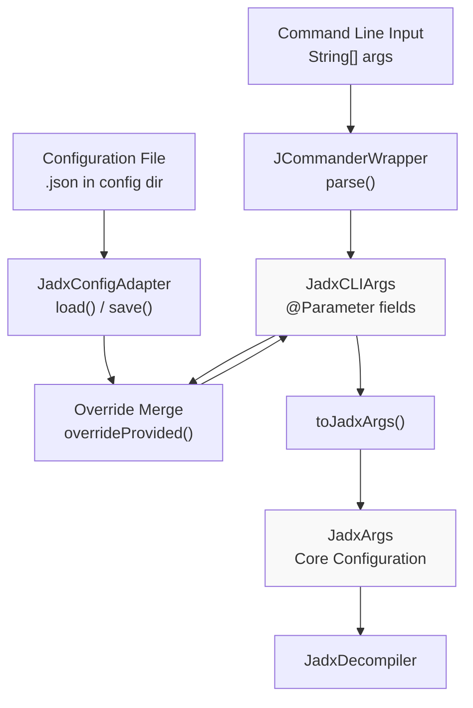
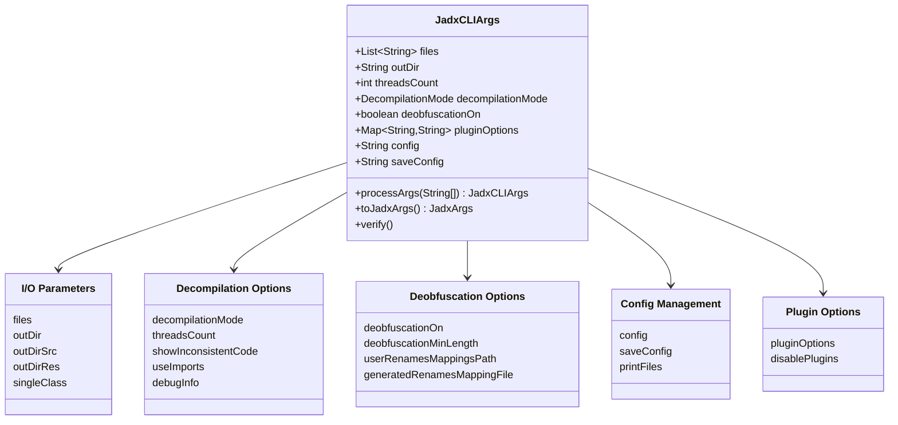
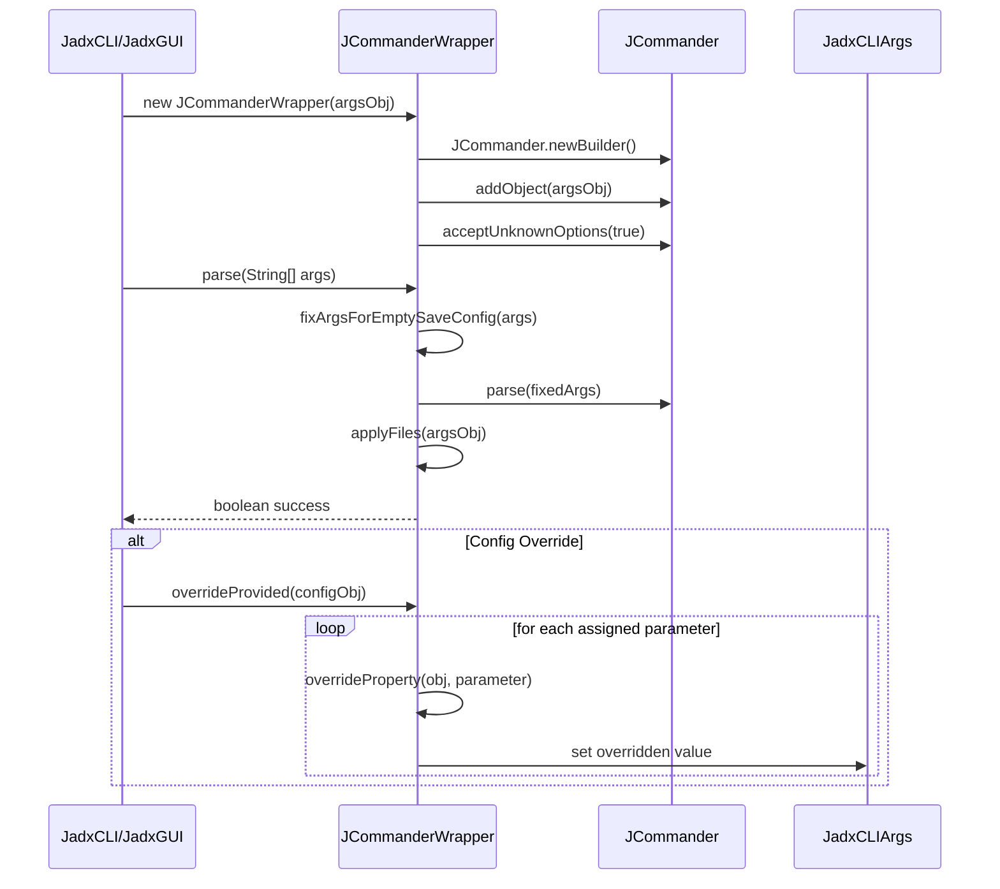
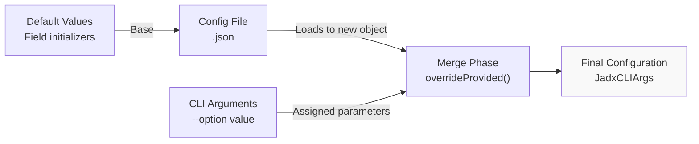
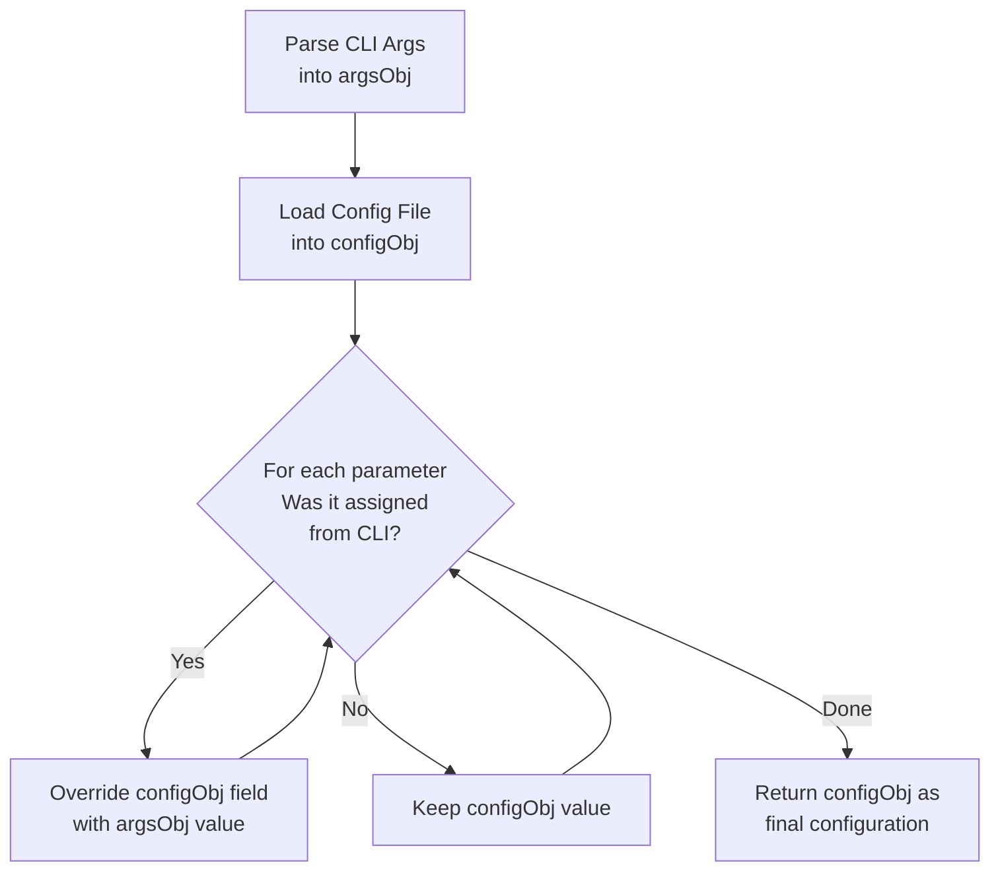
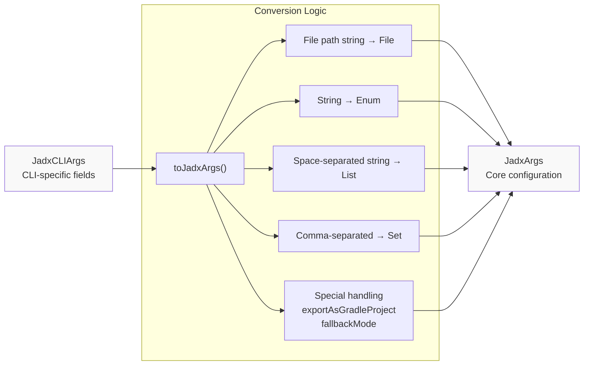
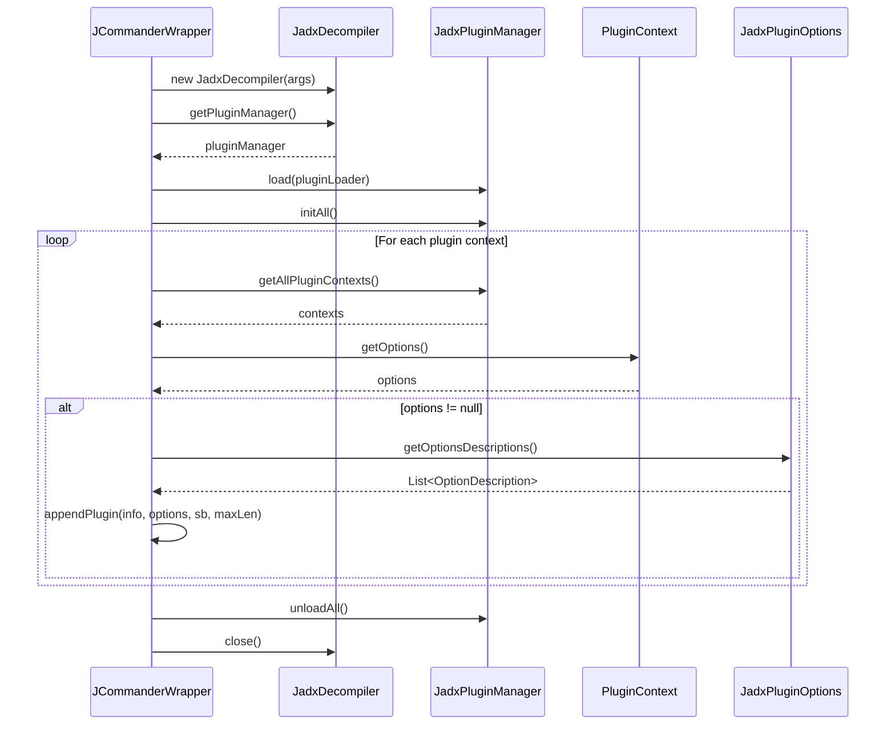
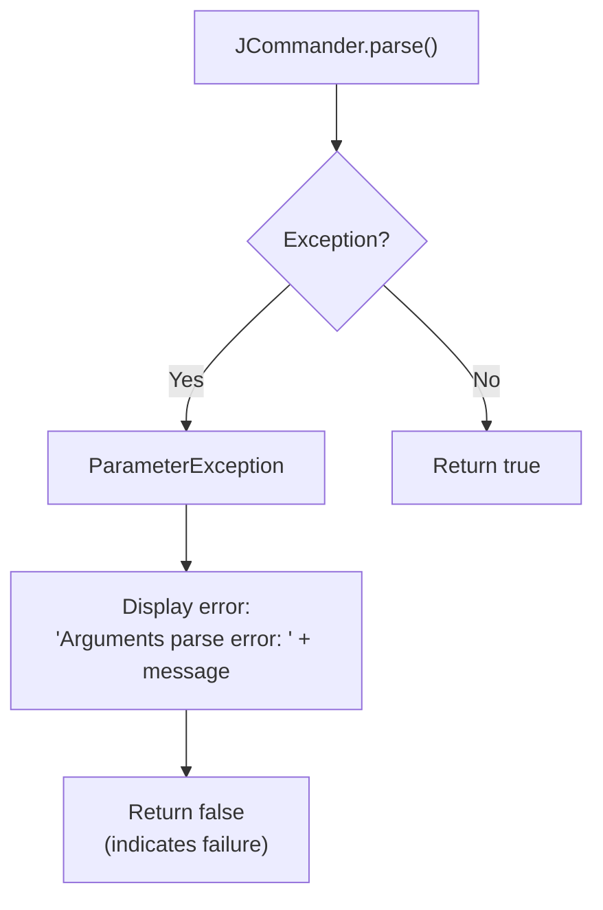

# Argument Processing and Configuration

<details>
<summary>Relevant source files</summary>

The following files were used as context for generating this wiki page:

- [README.md](https://github.com/skylot/jadx/blob/HEAD/README.md)
- [jadx-cli/src/main/java/jadx/cli/JCommanderWrapper.java](https://github.com/skylot/jadx/blob/HEAD/jadx-cli/src/main/java/jadx/cli/JCommanderWrapper.java)
- [jadx-cli/src/main/java/jadx/cli/JadxCLI.java](https://github.com/skylot/jadx/blob/HEAD/jadx-cli/src/main/java/jadx/cli/JadxCLI.java)
- [jadx-cli/src/main/java/jadx/cli/JadxCLIArgs.java](https://github.com/skylot/jadx/blob/HEAD/jadx-cli/src/main/java/jadx/cli/JadxCLIArgs.java)
- [jadx-cli/src/main/java/jadx/cli/LogHelper.java](https://github.com/skylot/jadx/blob/HEAD/jadx-cli/src/main/java/jadx/cli/LogHelper.java)
- [jadx-cli/src/test/java/jadx/cli/JadxCLIArgsTest.java](https://github.com/skylot/jadx/blob/HEAD/jadx-cli/src/test/java/jadx/cli/JadxCLIArgsTest.java)
- [jadx-cli/src/test/java/jadx/cli/TestInput.java](https://github.com/skylot/jadx/blob/HEAD/jadx-cli/src/test/java/jadx/cli/TestInput.java)
- [jadx-cli/src/test/resources/samples/HelloWorld.smali](https://github.com/skylot/jadx/blob/HEAD/jadx-cli/src/test/resources/samples/HelloWorld.smali)
- [jadx-cli/src/test/resources/samples/defpkg.smali](https://github.com/skylot/jadx/blob/HEAD/jadx-cli/src/test/resources/samples/defpkg.smali)
- [jadx-cli/src/test/resources/samples/hello.dex](https://github.com/skylot/jadx/blob/HEAD/jadx-cli/src/test/resources/samples/hello.dex)
- [jadx-cli/src/test/resources/samples/resources-only.apk](https://github.com/skylot/jadx/blob/HEAD/jadx-cli/src/test/resources/samples/resources-only.apk)
- [jadx-core/src/main/java/jadx/api/JadxArgs.java](https://github.com/skylot/jadx/blob/HEAD/jadx-core/src/main/java/jadx/api/JadxArgs.java)
- [jadx-core/src/main/java/jadx/core/plugins/files/SingleDirFilesGetter.java](https://github.com/skylot/jadx/blob/HEAD/jadx-core/src/main/java/jadx/core/plugins/files/SingleDirFilesGetter.java)
- [jadx-core/src/main/java/jadx/core/utils/files/FileUtils.java](https://github.com/skylot/jadx/blob/HEAD/jadx-core/src/main/java/jadx/core/utils/files/FileUtils.java)
- [jadx-core/src/main/java/jadx/core/xmlgen/BinaryXMLParser.java](https://github.com/skylot/jadx/blob/HEAD/jadx-core/src/main/java/jadx/core/xmlgen/BinaryXMLParser.java)
- [jadx-gui/src/main/java/jadx/gui/JadxGUI.java](https://github.com/skylot/jadx/blob/HEAD/jadx-gui/src/main/java/jadx/gui/JadxGUI.java)
- [jadx-gui/src/main/java/jadx/gui/JadxWrapper.java](https://github.com/skylot/jadx/blob/HEAD/jadx-gui/src/main/java/jadx/gui/JadxWrapper.java)

</details>


This page documents the CLI argument parsing system, configuration file management, and how command-line options are converted into the core `JadxArgs` configuration object. This system provides a flexible three-tier configuration hierarchy: default values, configuration files, and command-line overrides.

For information about the command execution system (including the `plugins` subcommand), see [Commands and Plugins Management](https://github.com/skylot/jadx/blob/HEAD/4.2). For details on configuration file storage locations and common directories, see [Configuration Files and Common Directories](https://github.com/skylot/jadx/blob/HEAD/4.3).

## System Overview

The argument processing system transforms command-line input into structured configuration through a multi-stage pipeline:



**Sources:** [jadx-cli/src/main/java/jadx/cli/JadxCLIArgs.java:363-404](https://github.com/skylot/jadx/blob/HEAD/jadx-cli/src/main/java/jadx/cli/JadxCLIArgs.java#L363-L404), [jadx-cli/src/main/java/jadx/cli/JCommanderWrapper.java:41-60](https://github.com/skylot/jadx/blob/HEAD/jadx-cli/src/main/java/jadx/cli/JCommanderWrapper.java#L41-L60)

## JadxCLIArgs Structure

`JadxCLIArgs` is the primary container for command-line arguments, using JCommander annotations to declare parameters. The class serves dual purposes: capturing CLI input and persisting/loading configuration files via `IJadxConfig` implementation [jadx-cli/src/main/java/jadx/cli/JadxCLIArgs.java:47-47](https://github.com/skylot/jadx/blob/HEAD/jadx-cli/src/main/java/jadx/cli/JadxCLIArgs.java#L47).

### Parameter Annotations

The class uses several annotation types to control argument behavior:

| Annotation | Purpose | Example |
|------------|---------|---------|
| `@Parameter` | Standard CLI option | `@Parameter(names = {"-d", "--output-dir"})` [jadx-cli/src/main/java/jadx/cli/JadxCLIArgs.java:55-56](https://github.com/skylot/jadx/blob/HEAD/jadx-cli/src/main/java/jadx/cli/JadxCLIArgs.java#L55-L56) |
| `@DynamicParameter` | Key-value pairs | `@DynamicParameter(names = "-P")` for plugin options [jadx-cli/src/main/java/jadx/cli/JadxCLIArgs.java:352-353](https://github.com/skylot/jadx/blob/HEAD/jadx-cli/src/main/java/jadx/cli/JadxCLIArgs.java#L352-L353) |
| `@JadxConfigExclude` | Exclude from config files | Applied to transient fields like `files`, `outDir` [jadx-cli/src/main/java/jadx/cli/JadxCLIArgs.java:50-54](https://github.com/skylot/jadx/blob/HEAD/jadx-cli/src/main/java/jadx/cli/JadxCLIArgs.java#L50-L54) |

**Key field categories in JadxCLIArgs:**



**Sources:** [jadx-cli/src/main/java/jadx/cli/JadxCLIArgs.java:50-354](https://github.com/skylot/jadx/blob/HEAD/jadx-cli/src/main/java/jadx/cli/JadxCLIArgs.java#L50-L354)

### Type Converters

JCommander requires custom converters for enum types. `JadxCLIArgs` defines several converter classes:

- `CommentsLevelConverter` - for `CommentsLevel` enum [jadx-cli/src/main/java/jadx/cli/JadxCLIArgs.java:971-975](https://github.com/skylot/jadx/blob/HEAD/jadx-cli/src/main/java/jadx/cli/JadxCLIArgs.java#L971-L975)
- `DecompilationModeConverter` - for `DecompilationMode` enum [jadx-cli/src/main/java/jadx/cli/JadxCLIArgs.java:1001-1005](https://github.com/skylot/jadx/blob/HEAD/jadx-cli/src/main/java/jadx/cli/JadxCLIArgs.java#L1001-L1005)
- `IntegerFormatConverter` - for `IntegerFormat` enum [jadx-cli/src/main/java/jadx/cli/JadxCLIArgs.java:1019-1023](https://github.com/skylot/jadx/blob/HEAD/jadx-cli/src/main/java/jadx/cli/JadxCLIArgs.java#L1019-L1023)
- `RenameConverter` - for `Set<RenameEnum>` with special handling for "none" and "all" [jadx-cli/src/main/java/jadx/cli/JadxCLIArgs.java:942-969](https://github.com/skylot/jadx/blob/HEAD/jadx-cli/src/main/java/jadx/cli/JadxCLIArgs.java#L942-L969)

All converters extend `BaseEnumConverter` which provides uppercase conversion and error handling [jadx-cli/src/main/java/jadx/cli/JadxCLIArgs.java:928-940](https://github.com/skylot/jadx/blob/HEAD/jadx-cli/src/main/java/jadx/cli/JadxCLIArgs.java#L928-L940).

**Sources:** [jadx-cli/src/main/java/jadx/cli/JadxCLIArgs.java:928-1026](https://github.com/skylot/jadx/blob/HEAD/jadx-cli/src/main/java/jadx/cli/JadxCLIArgs.java#L928-L1026)

## Argument Parsing with JCommanderWrapper

`JCommanderWrapper` encapsulates JCommander functionality and adds JADX-specific parsing logic:



**Sources:** [jadx-cli/src/main/java/jadx/cli/JCommanderWrapper.java:29-60](https://github.com/skylot/jadx/blob/HEAD/jadx-cli/src/main/java/jadx/cli/JCommanderWrapper.java#L29-L60), [jadx-cli/src/main/java/jadx/cli/JadxCLI.java:39-41](https://github.com/skylot/jadx/blob/HEAD/jadx-cli/src/main/java/jadx/cli/JadxCLI.java#L39-L41), [jadx-gui/src/main/java/jadx/gui/JadxGUI.java:27-28](https://github.com/skylot/jadx/blob/HEAD/jadx-gui/src/main/java/jadx/gui/JadxGUI.java#L27-L28)

### Special Parsing Logic

**Unknown Options Handling:** JCommander is configured with `acceptUnknownOptions(true)` to allow file paths as positional arguments [jadx-cli/src/main/java/jadx/cli/JCommanderWrapper.java:35](https://github.com/skylot/jadx/blob/HEAD/jadx-cli/src/main/java/jadx/cli/JCommanderWrapper.java#L35). These are collected via `getUnknownOptions()` and assigned to the `files` field [jadx-cli/src/main/java/jadx/cli/JCommanderWrapper.java:73-75](https://github.com/skylot/jadx/blob/HEAD/jadx-cli/src/main/java/jadx/cli/JCommanderWrapper.java#L73-L75).

**Empty --save-config Fix:** The `fixArgsForEmptySaveConfig()` method handles the special case where `--save-config` can be used with or without a value. If followed by another option or at the end of arguments, an empty string is inserted to satisfy JCommander's requirement for a parameter value [jadx-cli/src/main/java/jadx/cli/JCommanderWrapper.java:102-121](https://github.com/skylot/jadx/blob/HEAD/jadx-cli/src/main/java/jadx/cli/JCommanderWrapper.java#L102-L121).

**Map Merging:** When overriding configuration, Maps (like `pluginOptions`) are merged rather than replaced, allowing CLI options to supplement or selectively override config file values [jadx-cli/src/main/java/jadx/cli/JCommanderWrapper.java:88-95](https://github.com/skylot/jadx/blob/HEAD/jadx-cli/src/main/java/jadx/cli/JCommanderWrapper.java#L88-L95).

**Sources:** [jadx-cli/src/main/java/jadx/cli/JCommanderWrapper.java:73-130](https://github.com/skylot/jadx/blob/HEAD/jadx-cli/src/main/java/jadx/cli/JCommanderWrapper.java#L73-L130)

## Configuration Hierarchy

The system implements a three-tier configuration hierarchy with explicit override semantics:



### Processing Sequence

The `processArgs()` static method orchestrates the hierarchy [jadx-cli/src/main/java/jadx/cli/JadxCLIArgs.java:363-404](https://github.com/skylot/jadx/blob/HEAD/jadx-cli/src/main/java/jadx/cli/JadxCLIArgs.java#L363-L404):

1. **Initial Parse:** Parse CLI arguments into `argsObj` via `JCommanderWrapper.parse()` [jadx-cli/src/main/java/jadx/cli/JadxCLIArgs.java:366-370](https://github.com/skylot/jadx/blob/HEAD/jadx-cli/src/main/java/jadx/cli/JadxCLIArgs.java#L366-L370).
2. **Apply Arguments:** Call `applyArgs()` to set log levels via `LogHelper.initLogLevel(this)` and process basic flags [jadx-cli/src/main/java/jadx/cli/JadxCLIArgs.java:371](https://github.com/skylot/jadx/blob/HEAD/jadx-cli/src/main/java/jadx/cli/JadxCLIArgs.java#L371), [jadx-cli/src/main/java/jadx/cli/LogHelper.java:37-39](https://github.com/skylot/jadx/blob/HEAD/jadx-cli/src/main/java/jadx/cli/LogHelper.java#L37-L39).
3. **Process Commands:** Check for subcommands and early exit flags (`--help`, `--version`, `--print-files`) via `JCommanderWrapper.processCommands()` [jadx-cli/src/main/java/jadx/cli/JadxCLIArgs.java:372](https://github.com/skylot/jadx/blob/HEAD/jadx-cli/src/main/java/jadx/cli/JadxCLIArgs.java#L372), [jadx-cli/src/main/java/jadx/cli/JCommanderWrapper.java:62-68](https://github.com/skylot/jadx/blob/HEAD/jadx-cli/src/main/java/jadx/cli/JCommanderWrapper.java#L62-L68).
4. **Config Loading:** If `config` is not "none", load config file using `JadxConfigAdapter` and merge with CLI args using `overrideProvided()` [jadx-cli/src/main/java/jadx/cli/JadxCLIArgs.java:375-393](https://github.com/skylot/jadx/blob/HEAD/jadx-cli/src/main/java/jadx/cli/JadxCLIArgs.java#L375-L393).
5. **Verification:** Call `verify()` to validate the final configuration [jadx-cli/src/main/java/jadx/cli/JadxCLIArgs.java:395](https://github.com/skylot/jadx/blob/HEAD/jadx-cli/src/main/java/jadx/cli/JadxCLIArgs.java#L395).
6. **Save Config:** If `saveConfig` is set, save the configuration to the specified path and exit [jadx-cli/src/main/java/jadx/cli/JadxCLIArgs.java:397-402](https://github.com/skylot/jadx/blob/HEAD/jadx-cli/src/main/java/jadx/cli/JadxCLIArgs.java#L397-L402).

**Sources:** [jadx-cli/src/main/java/jadx/cli/JadxCLIArgs.java:363-404](https://github.com/skylot/jadx/blob/HEAD/jadx-cli/src/main/java/jadx/cli/JadxCLIArgs.java#L363-L404), [jadx-cli/src/main/java/jadx/cli/JCommanderWrapper.java:62-68](https://github.com/skylot/jadx/blob/HEAD/jadx-cli/src/main/java/jadx/cli/JCommanderWrapper.java#L62-L68)

### Override Mechanism

When a config file is loaded, the system creates a new `JadxCLIArgs` instance from the file, then applies CLI-provided values over it:



The override logic uses `ParameterDescription.isAssigned()` to determine which parameters were explicitly provided on the command line [jadx-cli/src/main/java/jadx/cli/JCommanderWrapper.java:53-60](https://github.com/skylot/jadx/blob/HEAD/jadx-cli/src/main/java/jadx/cli/JCommanderWrapper.java#L53-L60).

**Sources:** [jadx-cli/src/main/java/jadx/cli/JCommanderWrapper.java:53-60](https://github.com/skylot/jadx/blob/HEAD/jadx-cli/src/main/java/jadx/cli/JCommanderWrapper.java#L53-L60), [jadx-cli/src/main/java/jadx/cli/JadxCLIArgs.java:375-393](https://github.com/skylot/jadx/blob/HEAD/jadx-cli/src/main/java/jadx/cli/JadxCLIArgs.java#L375-L393)

## Conversion to JadxArgs

After parsing and configuration merging, `JadxCLIArgs` is converted to `JadxArgs` for use by the core decompiler. The `toJadxArgs()` method performs this transformation [jadx-cli/src/main/java/jadx/cli/JadxCLIArgs.java:456-515](https://github.com/skylot/jadx/blob/HEAD/jadx-cli/src/main/java/jadx/cli/JadxCLIArgs.java#L456-L515):



**Key transformations performed by toJadxArgs():**

| JadxCLIArgs Field | Transformation | JadxArgs Field |
|-------------------|----------------|----------------|
| `files` (List\<String\>) | `FileUtils.toFiles(files)` | `inputFiles` (List\<File\>) [jadx-cli/src/main/java/jadx/cli/JadxCLIArgs.java:461](https://github.com/skylot/jadx/blob/HEAD/jadx-cli/src/main/java/jadx/cli/JadxCLIArgs.java#L461) |
| `outputFormat` (String) | `OutputFormatEnum.valueOf(outputFormat.toUpperCase())` | `outputFormat` (enum) [jadx-cli/src/main/java/jadx/cli/JadxCLIArgs.java:489](https://github.com/skylot/jadx/blob/HEAD/jadx-cli/src/main/java/jadx/cli/JadxCLIArgs.java#L489) |
| `deobfuscationWhitelistStr` | `Arrays.asList(deobfuscationWhitelistStr.split(" "))` | `deobfuscationWhitelist` (List) [jadx-cli/src/main/java/jadx/cli/JadxCLIArgs.java:501-503](https://github.com/skylot/jadx/blob/HEAD/jadx-cli/src/main/java/jadx/cli/JadxCLIArgs.java#L501-L503) |
| `disablePlugins` | `Arrays.stream(disablePlugins.split(",")).map(String::trim)` | `disabledPlugins` (Set) [jadx-cli/src/main/java/jadx/cli/JadxCLIArgs.java:512-514](https://github.com/skylot/jadx/blob/HEAD/jadx-cli/src/main/java/jadx/cli/JadxCLIArgs.java#L512-L514) |
| `decompilationMode` | Direct assignment | `decompilationMode` (enum) [jadx-cli/src/main/java/jadx/cli/JadxCLIArgs.java:471](https://github.com/skylot/jadx/blob/HEAD/jadx-cli/src/main/java/jadx/cli/JadxCLIArgs.java#L471) |

**Special Handling:**

- **Fallback Mode:** If the deprecated `fallbackMode` flag is true, it overrides `decompilationMode` to `DecompilationMode.FALLBACK` [jadx-cli/src/main/java/jadx/cli/JadxCLIArgs.java:466-470](https://github.com/skylot/jadx/blob/HEAD/jadx-cli/src/main/java/jadx/cli/JadxCLIArgs.java#L466-L470).
- **Export Gradle:** If `exportAsGradleProject` is true but `exportGradleType` is null, it's set to `ExportGradleType.AUTO` [jadx-cli/src/main/java/jadx/cli/JadxCLIArgs.java:493-495](https://github.com/skylot/jadx/blob/HEAD/jadx-cli/src/main/java/jadx/cli/JadxCLIArgs.java#L493-L495).
- **Rename Flags:** The `Set<RenameEnum>` is copied into a new `EnumSet` via `EnumSet.copyOf(renameFlags)` [jadx-cli/src/main/java/jadx/cli/JadxCLIArgs.java:517-521](https://github.com/skylot/jadx/blob/HEAD/jadx-cli/src/main/java/jadx/cli/JadxCLIArgs.java#L517-L521).

**Sources:** [jadx-cli/src/main/java/jadx/cli/JadxCLIArgs.java:456-515](https://github.com/skylot/jadx/blob/HEAD/jadx-cli/src/main/java/jadx/cli/JadxCLIArgs.java#L456-L515), [jadx-api/src/main/java/jadx/api/JadxArgs.java:47-214](https://github.com/skylot/jadx/blob/HEAD/jadx-api/src/main/java/jadx/api/JadxArgs.java#L47-L214)

## Plugin Options Handling

Plugin options use a dynamic parameter system that allows arbitrary key-value pairs to be passed to plugins without predefined CLI arguments.

### Dynamic Parameter Syntax

Plugin options use the `-P` prefix followed by `key=value` pairs:

```
jadx -Pdex-input.verify-checksum=no -Pjava-convert.mode=d8 app.apk
```

The `@DynamicParameter` annotation on the `pluginOptions` field captures these [jadx-cli/src/main/java/jadx/cli/JadxCLIArgs.java:352-353](https://github.com/skylot/jadx/blob/HEAD/jadx-cli/src/main/java/jadx/cli/JadxCLIArgs.java#L352-L353):

```java
@DynamicParameter(names = "-P", description = "Plugin options", hidden = true)
protected Map<String, String> pluginOptions = new HashMap<>();
```

### Plugin Options in Help Output

`JCommanderWrapper` dynamically generates plugin option documentation by querying each plugin's `JadxPluginOptions` for descriptions.



**Sources:** [jadx-cli/src/main/java/jadx/cli/JCommanderWrapper.java:275-297](https://github.com/skylot/jadx/blob/HEAD/jadx-cli/src/main/java/jadx/cli/JCommanderWrapper.java#L275-L297)

### Plugin Option Format

The help output shows plugin options in this format [jadx-cli/src/main/java/jadx/cli/JCommanderWrapper.java:299-320](https://github.com/skylot/jadx/blob/HEAD/jadx-cli/src/main/java/jadx/cli/JCommanderWrapper.java#L299-L320):

```
Plugin options (-P<name>=<value>):
  plugin-id: Plugin description
    - option-name         - option description, values: [val1, val2], default: val1
```

Each option description includes [jadx-cli/src/main/java/jadx/cli/JCommanderWrapper.java:304-315](https://github.com/skylot/jadx/blob/HEAD/jadx-cli/src/main/java/jadx/cli/JCommanderWrapper.java#L304-L315):
- Option name (prefixed with plugin ID automatically)
- Description text
- Allowed values (if constrained)
- Default value (if present)

**Sources:** [jadx-cli/src/main/java/jadx/cli/JCommanderWrapper.java:275-320](https://github.com/skylot/jadx/blob/HEAD/jadx-cli/src/main/java/jadx/cli/JCommanderWrapper.java#L275-L320)

## Validation and Error Handling

### Argument Validation

The `verify()` method performs post-parse validation. For example, it ensures thread counts are positive and resets them to `DEFAULT_THREADS_COUNT` if invalid [jadx-cli/src/main/java/jadx/cli/JadxCLIArgs.java:441-445](https://github.com/skylot/jadx/blob/HEAD/jadx-cli/src/main/java/jadx/cli/JadxCLIArgs.java#L441-L445). Additional validation occurs in the `process()` method to catch unknown options that were incorrectly parsed as files [jadx-cli/src/main/java/jadx/cli/JadxCLIArgs.java:424-430](https://github.com/skylot/jadx/blob/HEAD/jadx-cli/src/main/java/jadx/cli/JadxCLIArgs.java#L424-L430):

```java
for (String fileName : files) {
    if (fileName.startsWith("-")) {
        throw new JadxArgsValidateException("Unknown option: " + fileName);
    }
}
```

**Sources:** [jadx-cli/src/main/java/jadx/cli/JadxCLIArgs.java:441-445](https://github.com/skylot/jadx/blob/HEAD/jadx-cli/src/main/java/jadx/cli/JadxCLIArgs.java#L441-L445), [jadx-cli/src/main/java/jadx/cli/JadxCLIArgs.java:424-430](https://github.com/skylot/jadx/blob/HEAD/jadx-cli/src/main/java/jadx/cli/JadxCLIArgs.java#L424-L430)

### Error Messages

Parsing errors are caught in `JCommanderWrapper.parse()` and displayed via `System.err` [jadx-cli/src/main/java/jadx/cli/JCommanderWrapper.java:48-50](https://github.com/skylot/jadx/blob/HEAD/jadx-cli/src/main/java/jadx/cli/JCommanderWrapper.java#L48-L50):



**Sources:** [jadx-cli/src/main/java/jadx/cli/JCommanderWrapper.java:41-50](https://github.com/skylot/jadx/blob/HEAD/jadx-cli/src/main/java/jadx/cli/JCommanderWrapper.java#L41-L50)

## Field Exclusion from Config Files

The `@JadxConfigExclude` annotation marks fields that should not be persisted to configuration files. These typically include:

- **Input/Output paths:** `files`, `outDir`, `outDirSrc`, `outDirRes` [jadx-cli/src/main/java/jadx/cli/JadxCLIArgs.java:50-63](https://github.com/skylot/jadx/blob/HEAD/jadx-cli/src/main/java/jadx/cli/JadxCLIArgs.java#L50-L63)
- **Single-use operations:** `singleClass`, `singleClassOutput` [jadx-cli/src/main/java/jadx/cli/JadxCLIArgs.java:75-81](https://github.com/skylot/jadx/blob/HEAD/jadx-cli/src/main/java/jadx/cli/JadxCLIArgs.java#L75-L81)
- **Action flags:** `printHelp`, `printVersion`, `printFiles` [jadx-cli/src/main/java/jadx/cli/JadxCLIArgs.java:340-346](https://github.com/skylot/jadx/blob/HEAD/jadx-cli/src/main/java/jadx/cli/JadxCLIArgs.java#L340-L346)
- **Config control:** `config`, `saveConfig` [jadx-cli/src/main/java/jadx/cli/JadxCLIArgs.java:316-338](https://github.com/skylot/jadx/blob/HEAD/jadx-cli/src/main/java/jadx/cli/JadxCLIArgs.java#L316-L338)

This ensures the config file contains only reusable decompilation preferences while allowing per-run customization through CLI arguments.

**Sources:** [jadx-cli/src/main/java/jadx/cli/JadxCLIArgs.java:50-346](https://github.com/skylot/jadx/blob/HEAD/jadx-cli/src/main/java/jadx/cli/JadxCLIArgs.java#L50-L346)2c:T2fbc