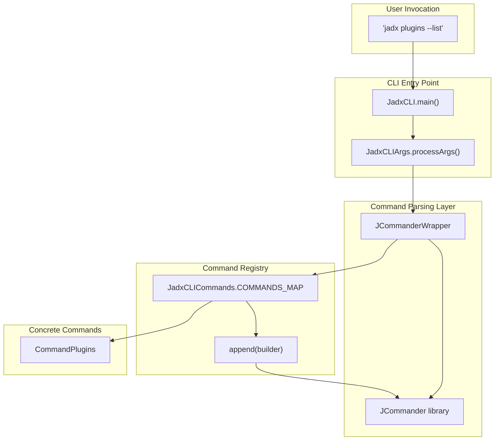
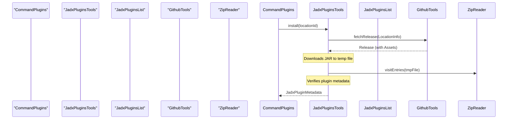

# Commands and Plugins Management

Relevant source files

The following files were used as context for generating this wiki page:

- [jadx-cli/src/main/java/jadx/cli/JadxAppCommon.java](https://github.com/skylot/jadx/blob/HEAD/jadx-cli/src/main/java/jadx/cli/JadxAppCommon.java)
- [jadx-cli/src/main/java/jadx/cli/JadxCLICommands.java](https://github.com/skylot/jadx/blob/HEAD/jadx-cli/src/main/java/jadx/cli/JadxCLICommands.java)
- [jadx-cli/src/main/java/jadx/cli/commands/CommandPlugins.java](https://github.com/skylot/jadx/blob/HEAD/jadx-cli/src/main/java/jadx/cli/commands/CommandPlugins.java)
- [jadx-cli/src/main/java/jadx/cli/commands/ICommand.java](https://github.com/skylot/jadx/blob/HEAD/jadx-cli/src/main/java/jadx/cli/commands/ICommand.java)
- [jadx-core/src/main/java/jadx/api/security/IJadxSecurity.java](https://github.com/skylot/jadx/blob/HEAD/jadx-core/src/main/java/jadx/api/security/IJadxSecurity.java)
- [jadx-core/src/main/java/jadx/api/security/JadxSecurityFlag.java](https://github.com/skylot/jadx/blob/HEAD/jadx-core/src/main/java/jadx/api/security/JadxSecurityFlag.java)
- [jadx-core/src/main/java/jadx/api/security/SanitizeType.java](https://github.com/skylot/jadx/blob/HEAD/jadx-core/src/main/java/jadx/api/security/SanitizeType.java)
- [jadx-core/src/main/java/jadx/api/security/impl/JadxSecurity.java](https://github.com/skylot/jadx/blob/HEAD/jadx-core/src/main/java/jadx/api/security/impl/JadxSecurity.java)
- [jadx-core/src/main/java/jadx/core/export/TemplateFile.java](https://github.com/skylot/jadx/blob/HEAD/jadx-core/src/main/java/jadx/core/export/TemplateFile.java)
- [jadx-core/src/main/java/jadx/core/export/gen/AndroidGradleGenerator.java](https://github.com/skylot/jadx/blob/HEAD/jadx-core/src/main/java/jadx/core/export/gen/AndroidGradleGenerator.java)
- [jadx-core/src/main/java/jadx/core/export/gen/SimpleJavaGradleGenerator.java](https://github.com/skylot/jadx/blob/HEAD/jadx-core/src/main/java/jadx/core/export/gen/SimpleJavaGradleGenerator.java)
- [jadx-core/src/main/resources/export/android/app.build.gradle.tmpl](https://github.com/skylot/jadx/blob/HEAD/jadx-core/src/main/resources/export/android/app.build.gradle.tmpl)
- [jadx-core/src/main/resources/export/android/lib.build.gradle.tmpl](https://github.com/skylot/jadx/blob/HEAD/jadx-core/src/main/resources/export/android/lib.build.gradle.tmpl)
- [jadx-gui/src/main/java/jadx/gui/settings/ui/plugins/AvailablePluginNode.java](https://github.com/skylot/jadx/blob/HEAD/jadx-gui/src/main/java/jadx/gui/settings/ui/plugins/AvailablePluginNode.java)
- [jadx-gui/src/main/java/jadx/gui/settings/ui/plugins/PluginSettings.java](https://github.com/skylot/jadx/blob/HEAD/jadx-gui/src/main/java/jadx/gui/settings/ui/plugins/PluginSettings.java)
- [jadx-gui/src/main/java/jadx/gui/update/JadxUpdate.kt](https://github.com/skylot/jadx/blob/HEAD/jadx-gui/src/main/java/jadx/gui/update/JadxUpdate.kt)
- [jadx-plugins-tools/src/main/java/jadx/plugins/tools/JadxPluginsList.java](https://github.com/skylot/jadx/blob/HEAD/jadx-plugins-tools/src/main/java/jadx/plugins/tools/JadxPluginsList.java)
- [jadx-plugins-tools/src/main/java/jadx/plugins/tools/data/JadxPluginListCache.java](https://github.com/skylot/jadx/blob/HEAD/jadx-plugins-tools/src/main/java/jadx/plugins/tools/data/JadxPluginListCache.java)
- [jadx-plugins-tools/src/main/java/jadx/plugins/tools/data/JadxPluginListEntry.java](https://github.com/skylot/jadx/blob/HEAD/jadx-plugins-tools/src/main/java/jadx/plugins/tools/data/JadxPluginListEntry.java)
- [jadx-plugins-tools/src/main/java/jadx/plugins/tools/resolvers/github/GithubTools.java](https://github.com/skylot/jadx/blob/HEAD/jadx-plugins-tools/src/main/java/jadx/plugins/tools/resolvers/github/GithubTools.java)
- [jadx-plugins-tools/src/main/java/jadx/plugins/tools/resolvers/github/LocationInfo.java](https://github.com/skylot/jadx/blob/HEAD/jadx-plugins-tools/src/main/java/jadx/plugins/tools/resolvers/github/LocationInfo.java)
- [jadx-plugins-tools/src/test/java/jadx/plugins/tools/resolvers/github/GithubToolsTest.java](https://github.com/skylot/jadx/blob/HEAD/jadx-plugins-tools/src/test/java/jadx/plugins/tools/resolvers/github/GithubToolsTest.java)
- [jadx-plugins-tools/src/test/resources/github/plugins-list-good.json](https://github.com/skylot/jadx/blob/HEAD/jadx-plugins-tools/src/test/resources/github/plugins-list-good.json)

This document describes the command system in the JADX CLI, which enables subcommand-style invocations like `jadx plugins --list`, and the extensive plugin management infrastructure that allows installing, updating, and configuring external JADX plugins.

The command system provides discrete, self-contained operations with their own argument sets. The plugin management system allows configuring plugins via `-P` flags and managing the lifecycle of external plugins through the `plugins` subcommand.

## Command System Architecture

The command system uses a registry pattern where commands implement the `ICommand` interface and are dispatched based on the first positional argument after `jadx`.

### Natural Language to Code Entity Mapping (Commands)

| System Concept | Code Entity | File Path |
| :--- | :--- | :--- |
| **Command Interface** | `ICommand` | [jadx-cli/src/main/java/jadx/cli/commands/ICommand.java:23-66](https://github.com/skylot/jadx/blob/HEAD/jadx-cli/src/main/java/jadx/cli/commands/ICommand.java#L23-L66) |
| **Command Registry** | `JadxCLICommands` | [jadx-cli/src/main/java/jadx/cli/JadxCLICommands.java:12-37](https://github.com/skylot/jadx/blob/HEAD/jadx-cli/src/main/java/jadx/cli/JadxCLICommands.java#L12-L37) |
| **Plugin Management Cmd** | `CommandPlugins` | [jadx-cli/src/main/java/jadx/cli/commands/CommandPlugins.java:23-145](https://github.com/skylot/jadx/blob/HEAD/jadx-cli/src/main/java/jadx/cli/commands/CommandPlugins.java#L23-L145) |
| **Command Dispatcher** | `JCommanderWrapper` | [jadx-cli/src/main/java/jadx/cli/JCommanderWrapper.java:62-68](https://github.com/skylot/jadx/blob/HEAD/jadx-cli/src/main/java/jadx/cli/JCommanderWrapper.java#L62-L68) |

**CLI Command Dispatch Pipeline**

Sources: [jadx-cli/src/main/java/jadx/cli/JadxCLICommands.java:12-37](https://github.com/skylot/jadx/blob/HEAD/jadx-cli/src/main/java/jadx/cli/JadxCLICommands.java#L12-L37), [jadx-cli/src/main/java/jadx/cli/JCommanderWrapper.java:29-68](https://github.com/skylot/jadx/blob/HEAD/jadx-cli/src/main/java/jadx/cli/JCommanderWrapper.java#L29-L68)

## Plugin Management System

The plugin management system (encapsulated in `jadx-plugins-tools`) handles the discovery, installation, and updating of plugins from various sources (GitHub, local files, or a centralized marketplace).

### Natural Language to Code Entity Mapping (Plugins)

| System Concept | Code Entity | File Path |
| :--- | :--- | :--- |
| **Plugin Tools Entry** | `JadxPluginsTools` | [jadx-plugins-tools/src/main/java/jadx/plugins/tools/JadxPluginsTools.java:47-194](https://github.com/skylot/jadx/blob/HEAD/jadx-plugins-tools/src/main/java/jadx/plugins/tools/JadxPluginsTools.java#L47-L194) |
| **Marketplace List** | `JadxPluginsList` | [jadx-plugins-tools/src/main/java/jadx/plugins/tools/JadxPluginsList.java:33-153](https://github.com/skylot/jadx/blob/HEAD/jadx-plugins-tools/src/main/java/jadx/plugins/tools/JadxPluginsList.java#L33-L153) |
| **GitHub API Client** | `GithubTools` | [jadx-plugins-tools/src/main/java/jadx/plugins/tools/resolvers/github/GithubTools.java:22-127](https://github.com/skylot/jadx/blob/HEAD/jadx-plugins-tools/src/main/java/jadx/plugins/tools/resolvers/github/GithubTools.java#L22-L127) |
| **Location Descriptor** | `LocationInfo` | [jadx-plugins-tools/src/main/java/jadx/plugins/tools/resolvers/github/LocationInfo.java:5-37](https://github.com/skylot/jadx/blob/HEAD/jadx-plugins-tools/src/main/java/jadx/plugins/tools/resolvers/github/LocationInfo.java#L5-L37) |
| **Plugin List Entry** | `JadxPluginListEntry` | [jadx-plugins-tools/src/main/java/jadx/plugins/tools/data/JadxPluginListEntry.java:3-22](https://github.com/skylot/jadx/blob/HEAD/jadx-plugins-tools/src/main/java/jadx/plugins/tools/data/JadxPluginListEntry.java#L3-L22) |

### Plugin Installation Flow
When a user runs `jadx plugins --install <locationId>`, the system resolves the location to a physical artifact (usually a JAR), downloads it, and registers it in the internal registry.

Sources: [jadx-cli/src/main/java/jadx/cli/commands/CommandPlugins.java:82-85](https://github.com/skylot/jadx/blob/HEAD/jadx-cli/src/main/java/jadx/cli/commands/CommandPlugins.java#L82-L85), [jadx-plugins-tools/src/main/java/jadx/plugins/tools/JadxPluginsList.java:108-117](https://github.com/skylot/jadx/blob/HEAD/jadx-plugins-tools/src/main/java/jadx/plugins/tools/JadxPluginsList.java#L108-L117), [jadx-plugins-tools/src/main/java/jadx/plugins/tools/JadxPluginsList.java:138-152](https://github.com/skylot/jadx/blob/HEAD/jadx-plugins-tools/src/main/java/jadx/plugins/tools/JadxPluginsList.java#L138-L152)

## The 'plugins' Command Detail

The `CommandPlugins` class implements the logic for the `plugins` subcommand. It interacts with `JadxPluginsTools` to perform requested operations.

### Supported Operations
| Flag | Description | Code Reference |
| :--- | :--- | :--- |
| `-i`, `--install` | Install via `locationId` (e.g., `github:user/repo`) | [jadx-cli/src/main/java/jadx/cli/commands/CommandPlugins.java:25-26](https://github.com/skylot/jadx/blob/HEAD/jadx-cli/src/main/java/jadx/cli/commands/CommandPlugins.java#L25-L26) |
| `-j`, `--install-jar`| Install from a local `.jar` file | [jadx-cli/src/main/java/jadx/cli/commands/CommandPlugins.java:28-29](https://github.com/skylot/jadx/blob/HEAD/jadx-cli/src/main/java/jadx/cli/commands/CommandPlugins.java#L28-L29) |
| `-l`, `--list` | List installed plugins | [jadx-cli/src/main/java/jadx/cli/commands/CommandPlugins.java:31-32](https://github.com/skylot/jadx/blob/HEAD/jadx-cli/src/main/java/jadx/cli/commands/CommandPlugins.java#L31-L32) |
| `-a`, `--available` | Fetch marketplace list from `jadx-plugins-list` repo | [jadx-cli/src/main/java/jadx/cli/commands/CommandPlugins.java:34-35](https://github.com/skylot/jadx/blob/HEAD/jadx-cli/src/main/java/jadx/cli/commands/CommandPlugins.java#L34-L35) |
| `-u`, `--update` | Update all installed plugins | [jadx-cli/src/main/java/jadx/cli/commands/CommandPlugins.java:37-38](https://github.com/skylot/jadx/blob/HEAD/jadx-cli/src/main/java/jadx/cli/commands/CommandPlugins.java#L37-L38) |
| `--uninstall` | Remove a plugin by its ID | [jadx-cli/src/main/java/jadx/cli/commands/CommandPlugins.java:40-41](https://github.com/skylot/jadx/blob/HEAD/jadx-cli/src/main/java/jadx/cli/commands/CommandPlugins.java#L40-L41) |
| `--disable` / `--enable`| Toggle plugin loading status | [jadx-cli/src/main/java/jadx/cli/commands/CommandPlugins.java:43-47](https://github.com/skylot/jadx/blob/HEAD/jadx-cli/src/main/java/jadx/cli/commands/CommandPlugins.java#L43-L47) |

Sources: [jadx-cli/src/main/java/jadx/cli/commands/CommandPlugins.java:22-61](https://github.com/skylot/jadx/blob/HEAD/jadx-cli/src/main/java/jadx/cli/commands/CommandPlugins.java#L22-L61)

## Plugin Options Management

Plugins can define their own CLI options. These are handled via a specialized prefix `-P`.

### Option Merging Logic
`JCommanderWrapper` provides logic to merge plugin options instead of replacing the entire map when multiple `-P` flags are provided.

*   **Logic**: `mergeValues` checks if the field type is a `Map`. If so, it uses `Utils.mergeMaps` to combine the existing map with the new one [jadx-cli/src/main/java/jadx/cli/JCommanderWrapper.java:88-93](https://github.com/skylot/jadx/blob/HEAD/jadx-cli/src/main/java/jadx/cli/JCommanderWrapper.java#L88-L93).
*   **CLI Usage Example**: `jadx -Pdex-input.verify-checksum=no app.apk` [jadx-cli/src/main/java/jadx/cli/JCommanderWrapper.java:165](https://github.com/skylot/jadx/blob/HEAD/jadx-cli/src/main/java/jadx/cli/JCommanderWrapper.java#L165).

### GUI Integration
Plugin options are also exposed in the GUI via `PluginSettings`.
*   **Discovery**: `ISettingsGroup build()` uses `CollectPlugins` to find all loaded plugins and their options [jadx-gui/src/main/java/jadx/gui/settings/ui/plugins/PluginSettings.java:57-67](https://github.com/skylot/jadx/blob/HEAD/jadx-gui/src/main/java/jadx/gui/settings/ui/plugins/PluginSettings.java#L57-L67).
*   **Persistence**: Options are stored either in the global `JadxSettings` or per-project in `JadxProject` if the `OptionFlag.PER_PROJECT` is set [jadx-gui/src/main/java/jadx/gui/settings/ui/plugins/PluginSettings.java:153-161](https://github.com/skylot/jadx/blob/HEAD/jadx-gui/src/main/java/jadx/gui/settings/ui/plugins/PluginSettings.java#L153-L161).
*   **Editor Generation**: The GUI dynamically generates editors (checkboxes, text fields, combos) based on `OptionType` and `OptionDescription` [jadx-gui/src/main/java/jadx/gui/settings/ui/plugins/PluginSettings.java:188-200](https://github.com/skylot/jadx/blob/HEAD/jadx-gui/src/main/java/jadx/gui/settings/ui/plugins/PluginSettings.java#L188-L200).

Sources: [jadx-gui/src/main/java/jadx/gui/settings/ui/plugins/PluginSettings.java:144-186](https://github.com/skylot/jadx/blob/HEAD/jadx-gui/src/main/java/jadx/gui/settings/ui/plugins/PluginSettings.java#L144-L186), [jadx-cli/src/main/java/jadx/cli/JCommanderWrapper.java:80-96](https://github.com/skylot/jadx/blob/HEAD/jadx-cli/src/main/java/jadx/cli/JCommanderWrapper.java#L80-L96)

## Data Structures and Marketplace

### Marketplace Discovery
`JadxPluginsList` manages a cached list of available plugins. It fetches a `plugins-list` bundle from the `jadx-decompiler/jadx-plugins-list` GitHub repository [jadx-plugins-tools/src/main/java/jadx/plugins/tools/JadxPluginsList.java:108-117](https://github.com/skylot/jadx/blob/HEAD/jadx-plugins-tools/src/main/java/jadx/plugins/tools/JadxPluginsList.java#L108-L117).

*   **Caching**: The list is stored in a local cache `PLUGINS_LIST_CACHE` to allow offline browsing [jadx-plugins-tools/src/main/java/jadx/plugins/tools/JadxPluginsList.java:87-97](https://github.com/skylot/jadx/blob/HEAD/jadx-plugins-tools/src/main/java/jadx/plugins/tools/JadxPluginsList.java#L87-L97).
*   **Fetching**: The `get(Consumer)` method first applies cached data, then fetches the latest release info from GitHub. If a new version is available, it downloads the zip bundle, parses the JSON entries, and updates the cache [jadx-plugins-tools/src/main/java/jadx/plugins/tools/JadxPluginsList.java:62-79](https://github.com/skylot/jadx/blob/HEAD/jadx-plugins-tools/src/main/java/jadx/plugins/tools/JadxPluginsList.java#L62-L79).

### Gradle Export Integration
The command and plugin system also supports exporting decompiled Android projects to Gradle formats.
*   **Android Projects**: `AndroidGradleGenerator` uses `TemplateFile` to populate `app.build.gradle.tmpl` with parameters like `applicationId`, `minSdkVersion`, and `targetSdkVersion` [jadx-core/src/main/java/jadx/core/export/gen/AndroidGradleGenerator.java:155-168](https://github.com/skylot/jadx/blob/HEAD/jadx-core/src/main/java/jadx/core/export/gen/AndroidGradleGenerator.java#L155-L168).
*   **Security**: Exported strings are sanitized using `IJadxSecurity.sanitizeString` with `SanitizeType.GRADLE_GROOVY` to prevent injection in build scripts [jadx-core/src/main/java/jadx/core/export/gen/AndroidGradleGenerator.java:183-188](https://github.com/skylot/jadx/blob/HEAD/jadx-core/src/main/java/jadx/core/export/gen/AndroidGradleGenerator.java#L183-L188).

Sources: [jadx-plugins-tools/src/main/java/jadx/plugins/tools/JadxPluginsList.java:62-79](https://github.com/skylot/jadx/blob/HEAD/jadx-plugins-tools/src/main/java/jadx/plugins/tools/JadxPluginsList.java#L62-L79), [jadx-core/src/main/java/jadx/core/export/gen/AndroidGradleGenerator.java:59-72](https://github.com/skylot/jadx/blob/HEAD/jadx-core/src/main/java/jadx/core/export/gen/AndroidGradleGenerator.java#L59-L72), [jadx-core/src/main/java/jadx/core/export/TemplateFile.java:25-54](https://github.com/skylot/jadx/blob/HEAD/jadx-core/src/main/java/jadx/core/export/TemplateFile.java#L25-L54)