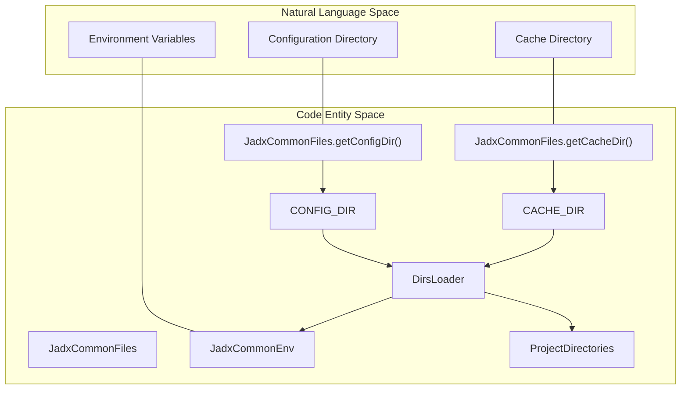
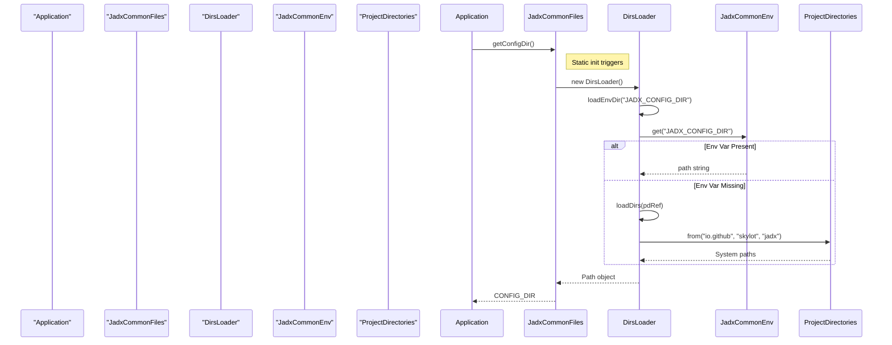
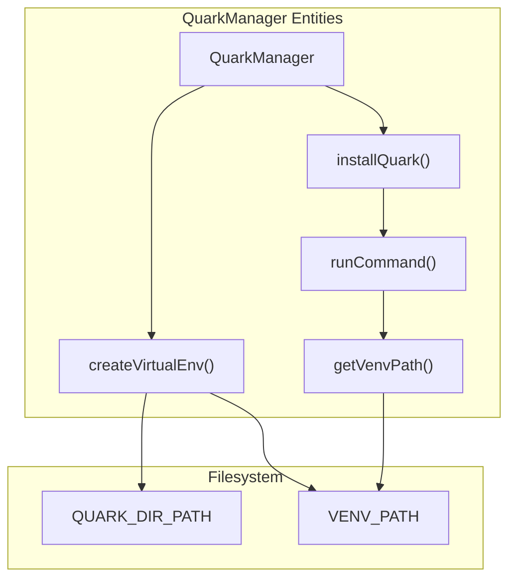

# Configuration Files and Common Directories

Relevant source files

The following files were used as context for generating this wiki page:

- [.gitignore](https://github.com/skylot/jadx/blob/HEAD/.gitignore)
- [gradle.properties](https://github.com/skylot/jadx/blob/HEAD/gradle.properties)
- [jadx-commons/jadx-app-commons/build.gradle.kts](https://github.com/skylot/jadx/blob/HEAD/jadx-commons/jadx-app-commons/build.gradle.kts)
- [jadx-commons/jadx-app-commons/src/main/java/jadx/commons/app/JadxCommonFiles.java](https://github.com/skylot/jadx/blob/HEAD/jadx-commons/jadx-app-commons/src/main/java/jadx/commons/app/JadxCommonFiles.java)
- [jadx-commons/jadx-app-commons/src/main/java/jadx/commons/app/JadxSystemInfo.java](https://github.com/skylot/jadx/blob/HEAD/jadx-commons/jadx-app-commons/src/main/java/jadx/commons/app/JadxSystemInfo.java)
- [jadx-gui/src/main/java/jadx/gui/plugins/quark/QuarkManager.java](https://github.com/skylot/jadx/blob/HEAD/jadx-gui/src/main/java/jadx/gui/plugins/quark/QuarkManager.java)
- [jadx-gui/src/main/java/jadx/gui/ui/JadxEventQueue.java](https://github.com/skylot/jadx/blob/HEAD/jadx-gui/src/main/java/jadx/gui/ui/JadxEventQueue.java)
- [jadx-gui/src/main/java/jadx/gui/utils/Link.java](https://github.com/skylot/jadx/blob/HEAD/jadx-gui/src/main/java/jadx/gui/utils/Link.java)
- [jadx-gui/src/main/java/jadx/gui/utils/shortcut/Shortcut.java](https://github.com/skylot/jadx/blob/HEAD/jadx-gui/src/main/java/jadx/gui/utils/shortcut/Shortcut.java)

This page documents JADX's configuration file system and platform-appropriate directory management. It covers the location and structure of configuration files, cache directories, environment variable overrides, and the implementation of platform-specific path resolution.

## Directory Structure Overview

JADX uses a systematic approach to manage configuration, cache, and temporary files across different platforms. The directory locations follow platform conventions (Windows, macOS, Linux) and can be overridden via environment variables.

### Common Directories Architecture

The following diagram maps the natural language directory concepts to the code entities in `JadxCommonFiles`.

**Sources:** [jadx-commons/jadx-app-commons/src/main/java/jadx/commons/app/JadxCommonFiles.java:18-36](https://github.com/skylot/jadx/blob/HEAD/jadx-commons/jadx-app-commons/src/main/java/jadx/commons/app/JadxCommonFiles.java#L18-L36), [jadx-commons/jadx-app-commons/src/main/java/jadx/commons/app/JadxCommonEnv.java:5-10](https://github.com/skylot/jadx/blob/HEAD/jadx-commons/jadx-app-commons/src/main/java/jadx/commons/app/JadxCommonEnv.java#L5-L10)

## Platform-Specific Directories

The `JadxCommonFiles` class provides platform-appropriate directory locations using the `directories-jni` library [jadx-commons/jadx-app-commons/build.gradle.kts:6](https://github.com/skylot/jadx/blob/HEAD/jadx-commons/jadx-app-commons/build.gradle.kts#L6). This ensures JADX respects OS-level standards for where application data should reside.

### Default Locations by Platform

| Platform | Config Directory | Cache Directory |
|----------|------------------|-----------------|
| **Windows** | `%APPDATA%\io.github\skylot\jadx\config` | `%LOCALAPPDATA%\io.github\skylot\jadx\cache` |
| **macOS** | `~/Library/Application Support/io.github.skylot.jadx` | `~/Library/Caches/io.github.skylot.jadx` |
| **Linux/Unix** | `~/.config/jadx` (XDG_CONFIG_HOME) | `~/.cache/jadx` (XDG_CACHE_HOME) |

### Implementation Details

The `JadxCommonFiles` class initializes directories statically via an internal `DirsLoader` [jadx-commons/jadx-app-commons/src/main/java/jadx/commons/app/JadxCommonFiles.java:32-36](https://github.com/skylot/jadx/blob/HEAD/jadx-commons/jadx-app-commons/src/main/java/jadx/commons/app/JadxCommonFiles.java#L32-L36). It uses an `AtomicReference` to cache the `ProjectDirectories` instance once loaded [jadx-commons/jadx-app-commons/src/main/java/jadx/commons/app/JadxCommonFiles.java:44-46](https://github.com/skylot/jadx/blob/HEAD/jadx-commons/jadx-app-commons/src/main/java/jadx/commons/app/JadxCommonFiles.java#L44-L46).

**Sources:** [jadx-commons/jadx-app-commons/src/main/java/jadx/commons/app/JadxCommonFiles.java:42-81](https://github.com/skylot/jadx/blob/HEAD/jadx-commons/jadx-app-commons/src/main/java/jadx/commons/app/JadxCommonFiles.java#L42-L81), [jadx-commons/jadx-app-commons/src/main/java/jadx/commons/app/JadxCommonEnv.java:7-10](https://github.com/skylot/jadx/blob/HEAD/jadx-commons/jadx-app-commons/src/main/java/jadx/commons/app/JadxCommonEnv.java#L7-L10)

### Windows Implementation Selection

On Windows, JADX selects the directory resolution strategy based on the system architecture. The `getWinDirs()` method determines which implementation of the `Windows` interface to use [jadx-commons/jadx-app-commons/src/main/java/jadx/commons/app/JadxCommonFiles.java:86-96](https://github.com/skylot/jadx/blob/HEAD/jadx-commons/jadx-app-commons/src/main/java/jadx/commons/app/JadxCommonFiles.java#L86-L96):

1. **JNI (`WindowsJni`)**: Used if the architecture is `amd64` (x86-64), as the JNI library is compiled specifically for this architecture [jadx-commons/jadx-app-commons/src/main/java/jadx/commons/app/JadxCommonFiles.java:89-92](https://github.com/skylot/jadx/blob/HEAD/jadx-commons/jadx-app-commons/src/main/java/jadx/commons/app/JadxCommonFiles.java#L89-L92).
2. **PowerShell (`WindowsPowerShell`)**: Used as a fallback for other architectures or if JNI fails [jadx-commons/jadx-app-commons/src/main/java/jadx/commons/app/JadxCommonFiles.java:88-89](https://github.com/skylot/jadx/blob/HEAD/jadx-commons/jadx-app-commons/src/main/java/jadx/commons/app/JadxCommonFiles.java#L88-L89).

**Sources:** [jadx-commons/jadx-app-commons/src/main/java/jadx/commons/app/JadxCommonFiles.java:86-96](https://github.com/skylot/jadx/blob/HEAD/jadx-commons/jadx-app-commons/src/main/java/jadx/commons/app/JadxCommonFiles.java#L86-L96), [jadx-commons/jadx-app-commons/src/main/java/jadx/commons/app/JadxSystemInfo.java:15-22](https://github.com/skylot/jadx/blob/HEAD/jadx-commons/jadx-app-commons/src/main/java/jadx/commons/app/JadxSystemInfo.java#L15-L22)

## Environment Variables

JADX supports environment variables for overriding default directory paths. The `JadxCommonEnv` utility class provides helper methods to retrieve these values as Strings, booleans, or integers [jadx-commons/jadx-app-commons/src/main/java/jadx/commons/app/JadxCommonEnv.java:7-26](https://github.com/skylot/jadx/blob/HEAD/jadx-commons/jadx-app-commons/src/main/java/jadx/commons/app/JadxCommonEnv.java#L7-L26).

### Core Environment Variables

| Variable | Purpose | Code Reference |
|----------|---------|----------------|
| `JADX_CONFIG_DIR` | Override the platform-default configuration directory. | [jadx-commons/jadx-app-commons/src/main/java/jadx/commons/app/JadxCommonFiles.java:45](https://github.com/skylot/jadx/blob/HEAD/jadx-commons/jadx-app-commons/src/main/java/jadx/commons/app/JadxCommonFiles.java#L45) |
| `JADX_CACHE_DIR` | Override the platform-default cache directory. | [jadx-commons/jadx-app-commons/src/main/java/jadx/commons/app/JadxCommonFiles.java:46](https://github.com/skylot/jadx/blob/HEAD/jadx-commons/jadx-app-commons/src/main/java/jadx/commons/app/JadxCommonFiles.java#L46) |

**Sources:** [jadx-commons/jadx-app-commons/src/main/java/jadx/commons/app/JadxCommonFiles.java:42-63](https://github.com/skylot/jadx/blob/HEAD/jadx-commons/jadx-app-commons/src/main/java/jadx/commons/app/JadxCommonFiles.java#L42-L63), [jadx-commons/jadx-app-commons/src/main/java/jadx/commons/app/JadxCommonEnv.java:5-31](https://github.com/skylot/jadx/blob/HEAD/jadx-commons/jadx-app-commons/src/main/java/jadx/commons/app/JadxCommonEnv.java#L5-L31)

## System Information and OS Utilities

The `JadxSystemInfo` class acts as a central registry for JVM and OS properties, which are used to determine directory logic and UI behavior [jadx-commons/jadx-app-commons/src/main/java/jadx/commons/app/JadxSystemInfo.java:7-22](https://github.com/skylot/jadx/blob/HEAD/jadx-commons/jadx-app-commons/src/main/java/jadx/commons/app/JadxSystemInfo.java#L7-L22).

### OS Detection and Architecture
- **OS Flags**: `IS_WINDOWS`, `IS_MAC`, `IS_LINUX`, `IS_UNIX` are derived from `os.name` [jadx-commons/jadx-app-commons/src/main/java/jadx/commons/app/JadxSystemInfo.java:15-18](https://github.com/skylot/jadx/blob/HEAD/jadx-commons/jadx-app-commons/src/main/java/jadx/commons/app/JadxSystemInfo.java#L15-L18).
- **Architecture Flags**: `IS_AMD64` and `IS_ARM64` are derived from `os.arch` [jadx-commons/jadx-app-commons/src/main/java/jadx/commons/app/JadxSystemInfo.java:21-22](https://github.com/skylot/jadx/blob/HEAD/jadx-commons/jadx-app-commons/src/main/java/jadx/commons/app/JadxSystemInfo.java#L21-L22).

### OS-Specific Logic Examples
- **Linux Scrolling**: `JadxEventQueue` uses `IS_LINUX` and `XToolkit` checks to map mouse wheel events for horizontal scrolling on certain X11 configurations [jadx-gui/src/main/java/jadx/gui/ui/JadxEventQueue.java:14-21](https://github.com/skylot/jadx/blob/HEAD/jadx-gui/src/main/java/jadx/gui/ui/JadxEventQueue.java#L14-L21).
- **macOS Shortcuts**: The `Shortcut` class uses `IS_MAC` to determine if `KeyStroke` should use specific modifiers [jadx-gui/src/main/java/jadx/gui/utils/shortcut/Shortcut.java:88-92](https://github.com/skylot/jadx/blob/HEAD/jadx-gui/src/main/java/jadx/gui/utils/shortcut/Shortcut.java#L88-L92).
- **Browser Launching**: The `Link` class uses `IS_WINDOWS` and `IS_MAC` to choose between `rundll32` or `open` commands when `Desktop.browse()` is unavailable [jadx-gui/src/main/java/jadx/gui/utils/Link.java:66-77](https://github.com/skylot/jadx/blob/HEAD/jadx-gui/src/main/java/jadx/gui/utils/Link.java#L66-L77).

**Sources:** [jadx-commons/jadx-app-commons/src/main/java/jadx/commons/app/JadxSystemInfo.java:6-26](https://github.com/skylot/jadx/blob/HEAD/jadx-commons/jadx-app-commons/src/main/java/jadx/commons/app/JadxSystemInfo.java#L6-L26), [jadx-gui/src/main/java/jadx/gui/ui/JadxEventQueue.java:14-15](https://github.com/skylot/jadx/blob/HEAD/jadx-gui/src/main/java/jadx/gui/ui/JadxEventQueue.java#L14-L15), [jadx-gui/src/main/java/jadx/gui/utils/Link.java:65-85](https://github.com/skylot/jadx/blob/HEAD/jadx-gui/src/main/java/jadx/gui/utils/Link.java#L65-L85)

## External Plugin Directories

Some plugins maintain their own directory structures for external dependencies. A prominent example is the Quark engine integration.

### Quark Plugin Directory Structure
The `QuarkManager` manages a dedicated directory for the Quark engine and its Python virtual environment [jadx-gui/src/main/java/jadx/gui/plugins/quark/QuarkManager.java:30-31](https://github.com/skylot/jadx/blob/HEAD/jadx-gui/src/main/java/jadx/gui/plugins/quark/QuarkManager.java#L30-L31):
- **Base Path**: `${user.home}/.quark-engine` [jadx-gui/src/main/java/jadx/gui/plugins/quark/QuarkManager.java:30](https://github.com/skylot/jadx/blob/HEAD/jadx-gui/src/main/java/jadx/gui/plugins/quark/QuarkManager.java#L30).
- **Virtual Env**: Located at `${QUARK_DIR_PATH}/quark_venv` [jadx-gui/src/main/java/jadx/gui/plugins/quark/QuarkManager.java:31](https://github.com/skylot/jadx/blob/HEAD/jadx-gui/src/main/java/jadx/gui/plugins/quark/QuarkManager.java#L31).
- **OS Path Resolution**: Executables within the venv are resolved via `getVenvPath`, which appends `Scripts` and `.exe` on Windows, or `bin` on other platforms [jadx-gui/src/main/java/jadx/gui/plugins/quark/QuarkManager.java:195-200](https://github.com/skylot/jadx/blob/HEAD/jadx-gui/src/main/java/jadx/gui/plugins/quark/QuarkManager.java#L195-L200).

### Quark Manager Logic Flow
The following diagram illustrates how `QuarkManager` interacts with the filesystem and external commands.

**Sources:** [jadx-gui/src/main/java/jadx/gui/plugins/quark/QuarkManager.java:27-40](https://github.com/skylot/jadx/blob/HEAD/jadx-gui/src/main/java/jadx/gui/plugins/quark/QuarkManager.java#L27-L40), [jadx-gui/src/main/java/jadx/gui/plugins/quark/QuarkManager.java:124-144](https://github.com/skylot/jadx/blob/HEAD/jadx-gui/src/main/java/jadx/gui/plugins/quark/QuarkManager.java#L124-L144), [jadx-gui/src/main/java/jadx/gui/plugins/quark/QuarkManager.java:195-200](https://github.com/skylot/jadx/blob/HEAD/jadx-gui/src/main/java/jadx/gui/plugins/quark/QuarkManager.java#L195-L200)