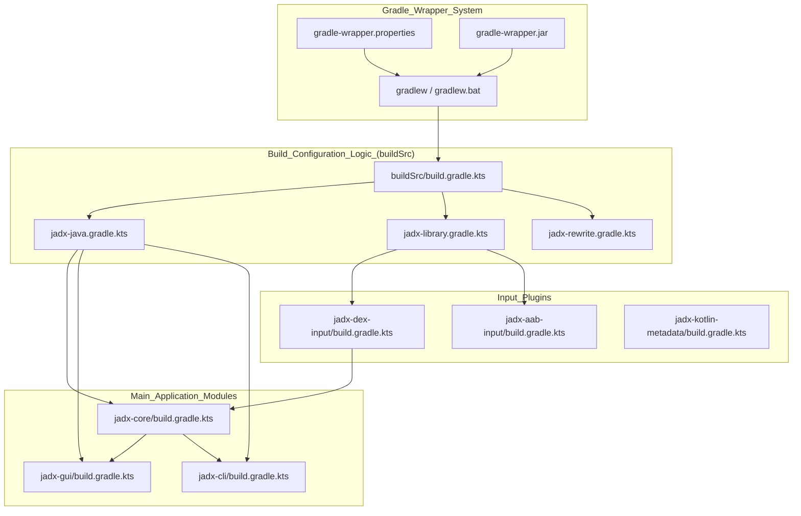
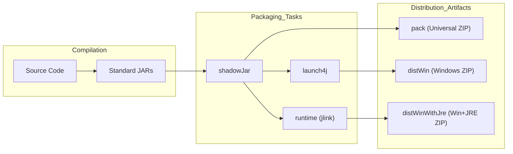

# Build System and Distribution

Relevant source files

The following files were used as context for generating this wiki page:

- [build.gradle.kts](https://github.com/skylot/jadx/blob/HEAD/build.gradle.kts)
- [buildSrc/build.gradle.kts](https://github.com/skylot/jadx/blob/HEAD/buildSrc/build.gradle.kts)
- [buildSrc/src/main/kotlin/jadx-java.gradle.kts](https://github.com/skylot/jadx/blob/HEAD/buildSrc/src/main/kotlin/jadx-java.gradle.kts)
- [buildSrc/src/main/kotlin/jadx-rewrite.gradle.kts](https://github.com/skylot/jadx/blob/HEAD/buildSrc/src/main/kotlin/jadx-rewrite.gradle.kts)
- [gradle/wrapper/gradle-wrapper.jar](https://github.com/skylot/jadx/blob/HEAD/gradle/wrapper/gradle-wrapper.jar)
- [gradle/wrapper/gradle-wrapper.properties](https://github.com/skylot/jadx/blob/HEAD/gradle/wrapper/gradle-wrapper.properties)
- [gradlew](https://github.com/skylot/jadx/blob/HEAD/gradlew)
- [gradlew.bat](https://github.com/skylot/jadx/blob/HEAD/gradlew.bat)
- [jadx-cli/build.gradle.kts](https://github.com/skylot/jadx/blob/HEAD/jadx-cli/build.gradle.kts)
- [jadx-core/build.gradle.kts](https://github.com/skylot/jadx/blob/HEAD/jadx-core/build.gradle.kts)
- [jadx-gui/build.gradle.kts](https://github.com/skylot/jadx/blob/HEAD/jadx-gui/build.gradle.kts)
- [jadx-plugins/jadx-aab-input/build.gradle.kts](https://github.com/skylot/jadx/blob/HEAD/jadx-plugins/jadx-aab-input/build.gradle.kts)
- [jadx-plugins/jadx-dex-input/build.gradle.kts](https://github.com/skylot/jadx/blob/HEAD/jadx-plugins/jadx-dex-input/build.gradle.kts)
- [jadx-plugins/jadx-java-convert/build.gradle.kts](https://github.com/skylot/jadx/blob/HEAD/jadx-plugins/jadx-java-convert/build.gradle.kts)
- [jadx-plugins/jadx-kotlin-metadata/build.gradle.kts](https://github.com/skylot/jadx/blob/HEAD/jadx-plugins/jadx-kotlin-metadata/build.gradle.kts)
- [jadx-plugins/jadx-kotlin-source-debug-extension/build.gradle.kts](https://github.com/skylot/jadx/blob/HEAD/jadx-plugins/jadx-kotlin-source-debug-extension/build.gradle.kts)
- [jadx-plugins/jadx-smali-input/build.gradle.kts](https://github.com/skylot/jadx/blob/HEAD/jadx-plugins/jadx-smali-input/build.gradle.kts)

This document describes the Gradle-based build system used to compile JADX from source code into distributable artifacts. It covers the Gradle wrapper configuration, multi-module project structure, custom Gradle plugins, packaging tasks, and distribution formats. The build system produces three primary distribution bundles: a cross-platform ZIP, a Windows executable without a JRE, and a Windows executable with a bundled JRE.

---

## Purpose and Scope

The JADX build system orchestrates the compilation of over 20 modules (core, GUI, CLI, and numerous plugins), enforces code quality standards, and produces platform-specific artifacts. It utilizes Gradle 9.6.1 with Kotlin DSL and custom convention plugins defined in the `buildSrc` directory [gradle/wrapper/gradle-wrapper.properties:4-4](https://github.com/skylot/jadx/blob/HEAD/gradle/wrapper/gradle-wrapper.properties#L4).

Key responsibilities include:
- **Compilation**: Building Java and Kotlin modules targeting Java 11 bytecode [buildSrc/src/main/kotlin/jadx-java.gradle.kts:50-51](https://github.com/skylot/jadx/blob/HEAD/buildSrc/src/main/kotlin/jadx-java.gradle.kts#L50-L51).
- **Code Quality**: Enforcing standards via Spotless, Checkstyle, and OpenRewrite [build.gradle.kts:53-59](https://github.com/skylot/jadx/blob/HEAD/build.gradle.kts#L53-L59).
- **Testing**: Executing integration and unit tests with parallel execution [buildSrc/src/main/kotlin/jadx-java.gradle.kts:64-72](https://github.com/skylot/jadx/blob/HEAD/buildSrc/src/main/kotlin/jadx-java.gradle.kts#L64-L72).
- **Packaging**: Generating shadow JARs (fat JARs), Windows executables via Launch4j, and custom JREs via jlink [jadx-gui/build.gradle.kts:7-9](https://github.com/skylot/jadx/blob/HEAD/jadx-gui/build.gradle.kts#L7-L9).
- **Distribution**: Assembling final ZIP archives for various platforms [build.gradle.kts:181-216](https://github.com/skylot/jadx/blob/HEAD/build.gradle.kts#L181-L216).

---

## Build System Architecture

The build system is structured as a hierarchical Gradle project where the root script coordinates global tasks and distribution, while `buildSrc` provides reusable logic.

### Entity Relationship Diagram
The following diagram maps build system concepts to the specific code entities that implement them.

**Sources:** [build.gradle.kts:8-12](https://github.com/skylot/jadx/blob/HEAD/build.gradle.kts#L8-L12), [buildSrc/src/main/kotlin/jadx-java.gradle.kts:6-13](https://github.com/skylot/jadx/blob/HEAD/buildSrc/src/main/kotlin/jadx-java.gradle.kts#L6-L13), [gradle/wrapper/gradle-wrapper.properties:1-10](https://github.com/skylot/jadx/blob/HEAD/gradle/wrapper/gradle-wrapper.properties#L1-L10), [jadx-gui/build.gradle.kts:3-10](https://github.com/skylot/jadx/blob/HEAD/jadx-gui/build.gradle.kts#L3-L10)

---

## Gradle Wrapper System

The Gradle Wrapper ensures reproducible builds by using a specific Gradle version (9.6.1) across all development and CI environments.

- **Properties**: Defines the distribution URL and SHA-256 checksum for verification [gradle/wrapper/gradle-wrapper.properties:3-4](https://github.com/skylot/jadx/blob/HEAD/gradle/wrapper/gradle-wrapper.properties#L3-L4).
- **Scripts**: `gradlew` (Unix) and `gradlew.bat` (Windows) handle the bootstrapping of the Gradle environment [gradlew:1-20](https://github.com/skylot/jadx/blob/HEAD/gradlew#L1-L20).
- **JVM Configuration**: The build can be customized via environment variables like `JADX_BUILD_JAVA_VERSION` [build.gradle.kts:21-32](https://github.com/skylot/jadx/blob/HEAD/build.gradle.kts#L21-L32) and `JADX_TEST_JAVA_VERSION` [jadx-core/build.gradle.kts:30-44](https://github.com/skylot/jadx/blob/HEAD/jadx-core/build.gradle.kts#L30-L44).

For details, see [Gradle Wrapper System](25_5.1-gradle-wrapper-system.md).

**Sources:** [gradle/wrapper/gradle-wrapper.properties:1-10](https://github.com/skylot/jadx/blob/HEAD/gradle/wrapper/gradle-wrapper.properties#L1-L10), [build.gradle.kts:21-32](https://github.com/skylot/jadx/blob/HEAD/build.gradle.kts#L21-L32), [jadx-core/build.gradle.kts:30-44](https://github.com/skylot/jadx/blob/HEAD/jadx-core/build.gradle.kts#L30-L44)

---

## Build Configuration and Modules

JADX uses a multi-module structure where functionality is isolated into specific projects (e.g., `jadx-core`, `jadx-gui`, `jadx-plugins`).

### Convention Plugins (buildSrc)
Common build logic is encapsulated in `buildSrc`:
- **`jadx-java`**: Sets Java 11 compatibility and configures testing with JUnit 5 [buildSrc/src/main/kotlin/jadx-java.gradle.kts:44-52](https://github.com/skylot/jadx/blob/HEAD/buildSrc/src/main/kotlin/jadx-java.gradle.kts#L44-L52). It also configures ErrorProne and NullAway for static analysis [buildSrc/src/main/kotlin/jadx-java.gradle.kts:75-97](https://github.com/skylot/jadx/blob/HEAD/buildSrc/src/main/kotlin/jadx-java.gradle.kts#L75-L97).
- **`jadx-rewrite`**: Integrates OpenRewrite for automated code refactoring and modernization recipes [buildSrc/src/main/kotlin/jadx-rewrite.gradle.kts:1-14](https://github.com/skylot/jadx/blob/HEAD/buildSrc/src/main/kotlin/jadx-rewrite.gradle.kts#L1-L14).
- **`jadx-library`**: Handles common library configurations for shared modules.

### Dependency Management
Dependencies are managed per-module. `jadx-gui` depends on `jadx-core`, `jadx-cli`, and various UI libraries like `flatlaf` and `rsyntaxtextarea` [jadx-gui/build.gradle.kts:12-35](https://github.com/skylot/jadx/blob/HEAD/jadx-gui/build.gradle.kts#L12-L35). `jadx-core` serves as the base for most plugins [jadx-plugins/jadx-aab-input/build.gradle.kts:6](https://github.com/skylot/jadx/blob/HEAD/jadx-plugins/jadx-aab-input/build.gradle.kts#L6).

For details, see [Build Configuration and Modules](26_5.2-build-configuration-and-modules.md).

**Sources:** [build.gradle.kts:53-59](https://github.com/skylot/jadx/blob/HEAD/build.gradle.kts#L53-L59), [buildSrc/src/main/kotlin/jadx-java.gradle.kts:75-97](https://github.com/skylot/jadx/blob/HEAD/buildSrc/src/main/kotlin/jadx-java.gradle.kts#L75-L97), [jadx-core/build.gradle.kts:5-28](https://github.com/skylot/jadx/blob/HEAD/jadx-core/build.gradle.kts#L5-L28), [jadx-gui/build.gradle.kts:12-67](https://github.com/skylot/jadx/blob/HEAD/jadx-gui/build.gradle.kts#L12-L67)

---

## Distribution and Packaging

JADX produces several distribution formats to support different user needs and platforms.

### Packaging Pipeline
The following diagram illustrates the transformation of code into final distribution artifacts.

- **Shadow JAR**: The `com.gradleup.shadow` plugin creates "fat" JARs containing all dependencies for the GUI [jadx-gui/build.gradle.kts:112-118](https://github.com/skylot/jadx/blob/HEAD/jadx-gui/build.gradle.kts#L112-L118).
- **Launch4j**: Generates native Windows `.exe` wrappers that point to the shadow JAR [jadx-gui/build.gradle.kts:147-176](https://github.com/skylot/jadx/blob/HEAD/jadx-gui/build.gradle.kts#L147-L176).
- **jlink (Runtime)**: The `org.beryx.runtime` plugin creates a stripped-down, custom JRE for the "with-JRE" distribution [jadx-gui/build.gradle.kts:183-222](https://github.com/skylot/jadx/blob/HEAD/jadx-gui/build.gradle.kts#L183-L222).

### Distribution Formats
| Format | Task | Description |
|--------|------|-------------|
| **Cross-platform** | `pack` | ZIP containing shell/batch scripts and universal shadow JARs [build.gradle.kts:181-192](https://github.com/skylot/jadx/blob/HEAD/build.gradle.kts#L181-L192). |
| **Windows** | `distWin` | ZIP containing a Launch4j `.exe` and the GUI shadow JAR [build.gradle.kts:194-204](https://github.com/skylot/jadx/blob/HEAD/build.gradle.kts#L194-L204). |
| **Windows + JRE** | `distWinWithJre` | ZIP containing the `.exe`, JAR, and a bundled custom JRE [build.gradle.kts:206-215](https://github.com/skylot/jadx/blob/HEAD/build.gradle.kts#L206-L215). |

For details, see [Distribution and Packaging](27_5.3-distribution-and-packaging.md).

**Sources:** [jadx-gui/build.gradle.kts:112-118](https://github.com/skylot/jadx/blob/HEAD/jadx-gui/build.gradle.kts#L112-L118), [jadx-gui/build.gradle.kts:147-176](https://github.com/skylot/jadx/blob/HEAD/jadx-gui/build.gradle.kts#L147-L176), [build.gradle.kts:181-215](https://github.com/skylot/jadx/blob/HEAD/build.gradle.kts#L181-L215)

---

## CI/CD and Quality Tools

JADX employs various quality tools to maintain code health, managed primarily through the root build script.

- **Spotless**: Enforces code formatting for Java (Eclipse formatter), Kotlin (ktlint), and Gradle scripts [build.gradle.kts:64-84](https://github.com/skylot/jadx/blob/HEAD/build.gradle.kts#L64-L84).
- **Checkstyle**: Validates Java code against predefined style rules [build.gradle.kts:55](https://github.com/skylot/jadx/blob/HEAD/build.gradle.kts#L55).
- **ErrorProne & NullAway**: Integrated into the `compileJava` task to catch common bugs and null pointer issues [buildSrc/src/main/kotlin/jadx-java.gradle.kts:75-97](https://github.com/skylot/jadx/blob/HEAD/buildSrc/src/main/kotlin/jadx-java.gradle.kts#L75-L97).
- **OpenRewrite**: Provides recipes for automated migrations (e.g., AssertJ migration) [buildSrc/src/main/kotlin/jadx-rewrite.gradle.kts:9-34](https://github.com/skylot/jadx/blob/HEAD/buildSrc/src/main/kotlin/jadx-rewrite.gradle.kts#L9-L34).

For details, see [CI/CD and Quality Tools](28_5.4-ci-cd-and-quality-tools.md).

**Sources:** [build.gradle.kts:64-84](https://github.com/skylot/jadx/blob/HEAD/build.gradle.kts#L64-L84), [buildSrc/src/main/kotlin/jadx-rewrite.gradle.kts:9-34](https://github.com/skylot/jadx/blob/HEAD/buildSrc/src/main/kotlin/jadx-rewrite.gradle.kts#L9-L34), [buildSrc/src/main/kotlin/jadx-java.gradle.kts:75-97](https://github.com/skylot/jadx/blob/HEAD/buildSrc/src/main/kotlin/jadx-java.gradle.kts#L75-L97)