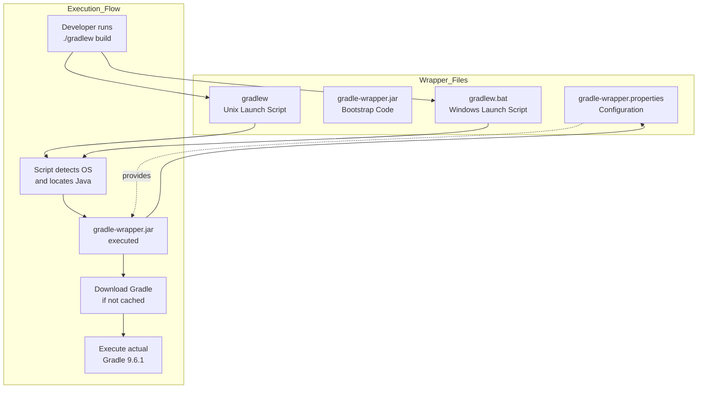
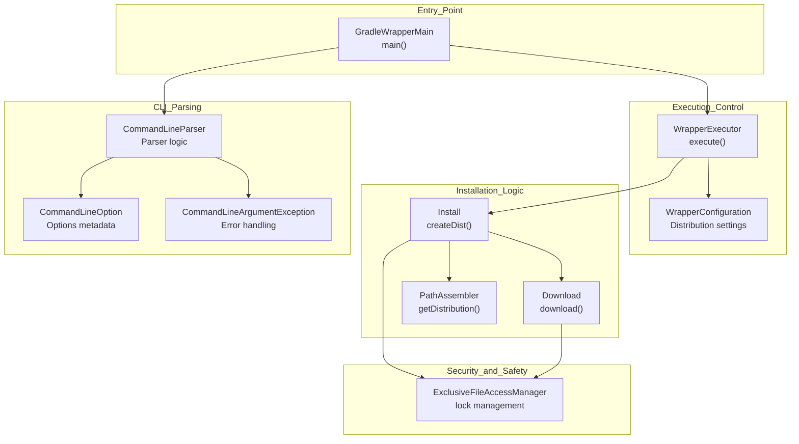
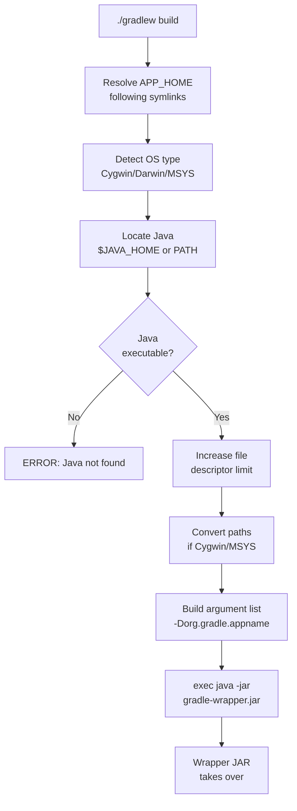
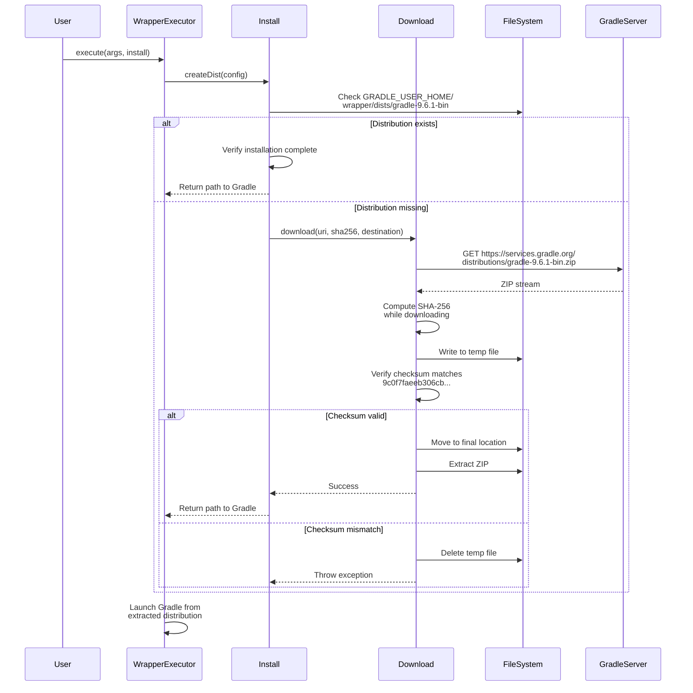

# Gradle Wrapper System

<details>
<summary>Relevant source files</summary>

The following files were used as context for generating this wiki page:

- [gradle/wrapper/gradle-wrapper.jar](https://github.com/skylot/jadx/blob/HEAD/gradle/wrapper/gradle-wrapper.jar)
- [gradle/wrapper/gradle-wrapper.properties](https://github.com/skylot/jadx/blob/HEAD/gradle/wrapper/gradle-wrapper.properties)
- [gradlew](https://github.com/skylot/jadx/blob/HEAD/gradlew)
- [gradlew.bat](https://github.com/skylot/jadx/blob/HEAD/gradlew.bat)

</details>


## Purpose and Scope

This document describes JADX's Gradle Wrapper system, which provides reproducible builds by pinning a specific Gradle version (**9.6.1**) and automatically downloading it when needed. The wrapper eliminates the need for developers to manually install Gradle and ensures all builds use the same version regardless of environment.

For information about the overall build configuration and module structure, see [Build Configuration and Modules](26_5.2-build-configuration-and-modules.md). For distribution packaging, see [Distribution and Packaging](27_5.3-distribution-and-packaging.md).

## Wrapper Components Overview

The Gradle Wrapper consists of four main components that work together to bootstrap the build process:

Title: Gradle Wrapper Execution Flow


Sources: [gradle/wrapper/gradle-wrapper.properties:1-10](https://github.com/skylot/jadx/blob/HEAD/gradle/wrapper/gradle-wrapper.properties#L1-L10), [gradlew:1-249](https://github.com/skylot/jadx/blob/HEAD/gradlew#L1-L249), [gradlew.bat:1-83](https://github.com/skylot/jadx/blob/HEAD/gradlew.bat#L1-L83)

## Wrapper Configuration

The `gradle/wrapper/gradle-wrapper.properties` file defines the Gradle distribution to download and how to obtain it:

| Property | Value | Purpose |
|----------|-------|---------|
| `distributionUrl` | `https://services.gradle.org/distributions/gradle-9.6.1-bin.zip` | Location of Gradle distribution |
| `distributionSha256Sum` | `9c0f7faeeb306cb14e4279a3e084ca6b596894089a0638e68a07c945a32c9e14` | Verification checksum |
| `distributionBase` | `GRADLE_USER_HOME` | Base directory for downloads |
| `distributionPath` | `wrapper/dists` | Subdirectory under base |
| `zipStoreBase` | `GRADLE_USER_HOME` | Base directory for ZIP cache |
| `zipStorePath` | `wrapper/dists` | Subdirectory for ZIPs |
| `networkTimeout` | `10000` | Download timeout (ms) |
| `validateDistributionUrl` | `true` | Enforce HTTPS validation |

The `distributionSha256Sum` provides cryptographic verification to prevent tampering or corruption during download [gradle/wrapper/gradle-wrapper.properties:3](https://github.com/skylot/jadx/blob/HEAD/gradle/wrapper/gradle-wrapper.properties#L3). The wrapper will refuse to use a distribution whose checksum doesn't match.

Sources: [gradle/wrapper/gradle-wrapper.properties:1-10](https://github.com/skylot/jadx/blob/HEAD/gradle/wrapper/gradle-wrapper.properties#L1-L10)

## Wrapper JAR Architecture

The `gradle/wrapper/gradle-wrapper.jar` is a self-contained executable JAR containing all classes needed to download and launch Gradle. It includes internal CLI parsing and path management logic.

Title: Gradle Wrapper JAR Internals


Sources: [gradle/wrapper/gradle-wrapper.jar:1-36](https://github.com/skylot/jadx/blob/HEAD/gradle/wrapper/gradle-wrapper.jar#L1-L36), [gradle/wrapper/gradle-wrapper.jar:17-25](https://github.com/skylot/jadx/blob/HEAD/gradle/wrapper/gradle-wrapper.jar#L17-L25)

### Core Wrapper Classes

The wrapper JAR contains several key Java classes that implement the bootstrap logic:

**Main Execution Classes:**
- `GradleWrapperMain`: Entry point that parses arguments and delegates to `WrapperExecutor`.
- `WrapperExecutor`: Orchestrates the installation and execution of the actual Gradle distribution.
- `BootstrapMainStarter`: Starts the actual Gradle daemon after download.

**Installation and Download:**
- `Install`: Manages distribution installation, checking cache, and creating distribution directory.
- `Download`: Handles HTTP/HTTPS downloads with progress tracking and proxy support.

**CLI and Configuration:**
- `CommandLineParser`: Parses command line arguments passed to the wrapper [gradle/wrapper/gradle-wrapper.jar:23-25](https://github.com/skylot/jadx/blob/HEAD/gradle/wrapper/gradle-wrapper.jar#L23-L25).
- `CommandLineOption`: Defines available CLI flags [gradle/wrapper/gradle-wrapper.jar:17-22](https://github.com/skylot/jadx/blob/HEAD/gradle/wrapper/gradle-wrapper.jar#L17-L22).
- `PropertiesFileHandler`: Loads and parses `gradle-wrapper.properties`.
- `PathAssembler`: Computes installation paths based on distribution URL and user home.

**Security and Safety:**
- `ExclusiveFileAccessManager`: Provides file locking to prevent concurrent installation issues.

Sources: [gradle/wrapper/gradle-wrapper.jar:1-36](https://github.com/skylot/jadx/blob/HEAD/gradle/wrapper/gradle-wrapper.jar#L1-L36)

## Launch Scripts

### Unix/Linux Script (gradlew)

The `gradlew` shell script is a POSIX-compliant wrapper that:

1. **Resolves the application home directory**: Follows symlinks to find the actual script location [gradlew:70-89](https://github.com/skylot/jadx/blob/HEAD/gradlew#L70-L89).
2. **Detects the operating system**: Sets flags for Cygwin, MSYS, Darwin, and NonStop [gradlew:105-115](https://github.com/skylot/jadx/blob/HEAD/gradlew#L105-L115).
3. **Locates Java**: Uses `$JAVA_HOME` if set, otherwise searches PATH [gradlew:119-142](https://github.com/skylot/jadx/blob/HEAD/gradlew#L119-L142).
4. **Increases file descriptor limits**: On Unix systems for better performance [gradlew:144-161](https://github.com/skylot/jadx/blob/HEAD/gradlew#L144-L161).
5. **Converts paths**: On Cygwin/MSYS, converts paths to Windows format [gradlew:172-199](https://github.com/skylot/jadx/blob/HEAD/gradlew#L172-L199).
6. **Executes wrapper JAR**: Launches `gradle-wrapper.jar` with appropriate JVM options [gradlew:202-248](https://github.com/skylot/jadx/blob/HEAD/gradlew#L202-L248).

Title: Unix gradlew Execution Logic


Sources: [gradlew:1-249](https://github.com/skylot/jadx/blob/HEAD/gradlew#L1-L249)

### Windows Script (gradlew.bat)

The `gradlew.bat` batch file provides equivalent functionality for Windows:

1. **Sets local scope**: Uses `setlocal` to avoid polluting environment [gradlew.bat:27](https://github.com/skylot/jadx/blob/HEAD/gradlew.bat#L27).
2. **Resolves directory**: Determines script location and normalizes path [gradlew.bat:29-36](https://github.com/skylot/jadx/blob/HEAD/gradlew.bat#L29-L36).
3. **Finds Java**: Checks `%JAVA_HOME%` or searches for `java.exe` in PATH [gradlew.bat:41-68](https://github.com/skylot/jadx/blob/HEAD/gradlew.bat#L41-L68).
4. **Executes wrapper JAR**: Runs `gradle-wrapper.jar` with JVM options [gradlew.bat:76-78](https://github.com/skylot/jadx/blob/HEAD/gradlew.bat#L76-L78).
5. **Handles exit codes**: Propagates error codes from Gradle [gradlew.bat:80-82](https://github.com/skylot/jadx/blob/HEAD/gradlew.bat#L80-L82).

Sources: [gradlew.bat:1-83](https://github.com/skylot/jadx/blob/HEAD/gradlew.bat#L1-L83)

## Distribution Download and Verification

The wrapper downloads and caches the Gradle distribution when first executed:

Title: Distribution Download Sequence


Sources: [gradle/wrapper/gradle-wrapper.properties:3-4](https://github.com/skylot/jadx/blob/HEAD/gradle/wrapper/gradle-wrapper.properties#L3-L4)

### Download Implementation Details

The `Download` implementation in the wrapper JAR features:

1. **Checksum verification**: SHA-256 hash `9c0f7faeeb306cb14e4279a3e084ca6b596894089a0638e68a07c945a32c9e14` is validated before extraction [gradle/wrapper/gradle-wrapper.properties:3](https://github.com/skylot/jadx/blob/HEAD/gradle/wrapper/gradle-wrapper.properties#L3).
2. **Network timeout**: Respects `networkTimeout` property (10 seconds) [gradle/wrapper/gradle-wrapper.properties:5](https://github.com/skylot/jadx/blob/HEAD/gradle/wrapper/gradle-wrapper.properties#L5).
3. **Retries**: Configuration for `retries` (0) and `retryBackOffMs` (500) [gradle/wrapper/gradle-wrapper.properties:6-7](https://github.com/skylot/jadx/blob/HEAD/gradle/wrapper/gradle-wrapper.properties#L6-L7).
4. **URL validation**: `validateDistributionUrl=true` enforces HTTPS validation [gradle/wrapper/gradle-wrapper.properties:8](https://github.com/skylot/jadx/blob/HEAD/gradle/wrapper/gradle-wrapper.properties#L8).

Sources: [gradle/wrapper/gradle-wrapper.properties:1-10](https://github.com/skylot/jadx/blob/HEAD/gradle/wrapper/gradle-wrapper.properties#L1-L10)

## JVM Configuration

### Wrapper JVM Options

The wrapper process itself runs with minimal heap allocation to conserve resources during the bootstrap phase:

```
DEFAULT_JVM_OPTS="-Xmx64m" "-Xms64m"
```

Sources: [gradlew.bat:39](https://github.com/skylot/jadx/blob/HEAD/gradlew.bat#L39), [gradlew:203](https://github.com/skylot/jadx/blob/HEAD/gradlew#L203)

### Environment Variables

The scripts support several environment variables for customization:

| Variable | Purpose |
|----------|---------|
| `JAVA_HOME` | Override Java installation location [gradlew:120](https://github.com/skylot/jadx/blob/HEAD/gradlew#L120), [gradlew.bat:42](https://github.com/skylot/jadx/blob/HEAD/gradlew.bat#L42) |
| `JAVA_OPTS` | Additional JVM options for wrapper [gradlew:205](https://github.com/skylot/jadx/blob/HEAD/gradlew#L205), [gradlew.bat:78](https://github.com/skylot/jadx/blob/HEAD/gradlew.bat#L78) |
| `GRADLE_OPTS` | Additional Gradle-specific options [gradlew:206](https://github.com/skylot/jadx/blob/HEAD/gradlew#L206), [gradlew.bat:78](https://github.com/skylot/jadx/blob/HEAD/gradlew.bat#L78) |
| `GRADLE_USER_HOME` | Override default cache directory (~/.gradle) [gradle/wrapper/gradle-wrapper.properties:1](https://github.com/skylot/jadx/blob/HEAD/gradle/wrapper/gradle-wrapper.properties#L1) |

These are combined when launching the wrapper JAR:

```bash
# Unix Example
"$JAVACMD" $DEFAULT_JVM_OPTS $JAVA_OPTS $GRADLE_OPTS \
    "-Dorg.gradle.appname=$APP_BASE_NAME" \
    -jar "$APP_HOME/gradle/wrapper/gradle-wrapper.jar" \
    "$@"
```

Sources: [gradlew:202-248](https://github.com/skylot/jadx/blob/HEAD/gradlew#L202-L248), [gradlew.bat:76-78](https://github.com/skylot/jadx/blob/HEAD/gradlew.bat#L76-L78)

## Reproducible Builds Guarantee

The wrapper system guarantees reproducible builds through:

1. **Version pinning**: Exact Gradle version (**9.6.1**) specified in `distributionUrl` [gradle/wrapper/gradle-wrapper.properties:4](https://github.com/skylot/jadx/blob/HEAD/gradle/wrapper/gradle-wrapper.properties#L4).
2. **Checksum verification**: SHA-256 hash prevents use of corrupted or tampered distributions [gradle/wrapper/gradle-wrapper.properties:3](https://github.com/skylot/jadx/blob/HEAD/gradle/wrapper/gradle-wrapper.properties#L3).
3. **Consistent execution**: Same wrapper code in JAR for all developers.
4. **URL validation**: Prevents downgrade attacks by enforcing HTTPS [gradle/wrapper/gradle-wrapper.properties:8](https://github.com/skylot/jadx/blob/HEAD/gradle/wrapper/gradle-wrapper.properties#L8).

Sources: [gradle/wrapper/gradle-wrapper.properties:3-8](https://github.com/skylot/jadx/blob/HEAD/gradle/wrapper/gradle-wrapper.properties#L3-L8)