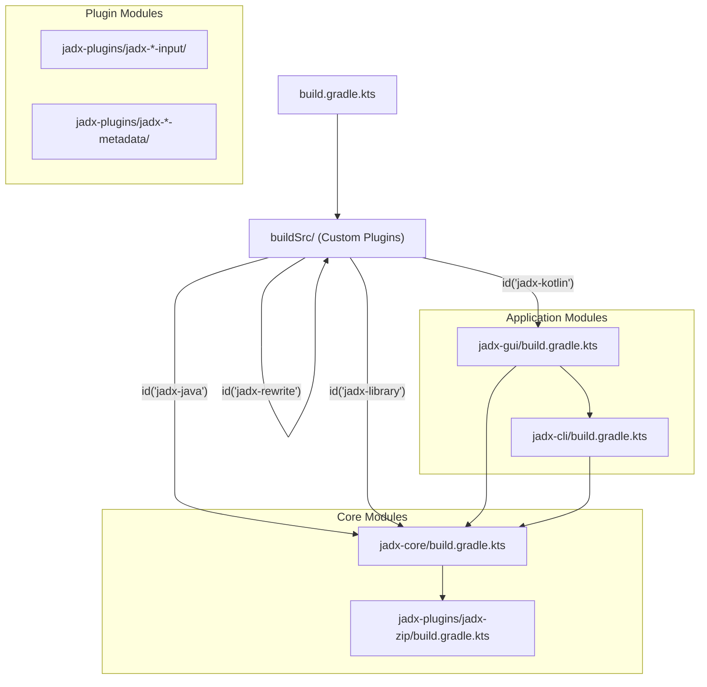
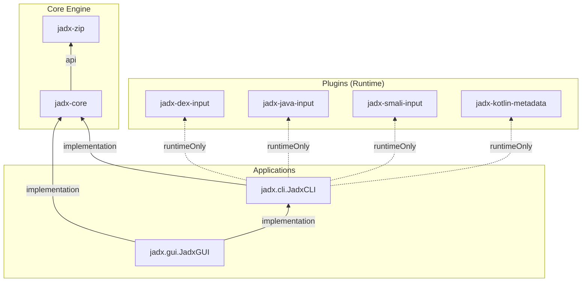

# Build Configuration and Modules

<details>
<summary>Relevant source files</summary>

The following files were used as context for generating this wiki page:

- [.github/pull_request_template.md](https://github.com/skylot/jadx/blob/HEAD/.github/pull_request_template.md)
- [CODE_OF_CONDUCT.md](https://github.com/skylot/jadx/blob/HEAD/CODE_OF_CONDUCT.md)
- [CONTRIBUTING.md](https://github.com/skylot/jadx/blob/HEAD/CONTRIBUTING.md)
- [SECURITY.md](https://github.com/skylot/jadx/blob/HEAD/SECURITY.md)
- [build.gradle.kts](https://github.com/skylot/jadx/blob/HEAD/build.gradle.kts)
- [buildSrc/build.gradle.kts](https://github.com/skylot/jadx/blob/HEAD/buildSrc/build.gradle.kts)
- [buildSrc/src/main/kotlin/jadx-java.gradle.kts](https://github.com/skylot/jadx/blob/HEAD/buildSrc/src/main/kotlin/jadx-java.gradle.kts)
- [buildSrc/src/main/kotlin/jadx-library.gradle.kts](https://github.com/skylot/jadx/blob/HEAD/buildSrc/src/main/kotlin/jadx-library.gradle.kts)
- [buildSrc/src/main/kotlin/jadx-rewrite.gradle.kts](https://github.com/skylot/jadx/blob/HEAD/buildSrc/src/main/kotlin/jadx-rewrite.gradle.kts)
- [jadx-cli/build.gradle.kts](https://github.com/skylot/jadx/blob/HEAD/jadx-cli/build.gradle.kts)
- [jadx-core/build.gradle.kts](https://github.com/skylot/jadx/blob/HEAD/jadx-core/build.gradle.kts)
- [jadx-gui/build.gradle.kts](https://github.com/skylot/jadx/blob/HEAD/jadx-gui/build.gradle.kts)
- [jadx-plugins/jadx-aab-input/build.gradle.kts](https://github.com/skylot/jadx/blob/HEAD/jadx-plugins/jadx-aab-input/build.gradle.kts)
- [jadx-plugins/jadx-apks-input/build.gradle.kts](https://github.com/skylot/jadx/blob/HEAD/jadx-plugins/jadx-apks-input/build.gradle.kts)
- [jadx-plugins/jadx-apks-input/src/main/java/jadx/plugins/input/apks/ApksCustomCodeInput.kt](https://github.com/skylot/jadx/blob/HEAD/jadx-plugins/jadx-apks-input/src/main/java/jadx/plugins/input/apks/ApksCustomCodeInput.kt)
- [jadx-plugins/jadx-apks-input/src/main/java/jadx/plugins/input/apks/ApksCustomResourcesLoader.kt](https://github.com/skylot/jadx/blob/HEAD/jadx-plugins/jadx-apks-input/src/main/java/jadx/plugins/input/apks/ApksCustomResourcesLoader.kt)
- [jadx-plugins/jadx-apks-input/src/main/java/jadx/plugins/input/apks/ApksInputPlugin.kt](https://github.com/skylot/jadx/blob/HEAD/jadx-plugins/jadx-apks-input/src/main/java/jadx/plugins/input/apks/ApksInputPlugin.kt)
- [jadx-plugins/jadx-apks-input/src/main/resources/META-INF/services/jadx.api.plugins.JadxPlugin](https://github.com/skylot/jadx/blob/HEAD/jadx-plugins/jadx-apks-input/src/main/resources/META-INF/services/jadx.api.plugins.JadxPlugin)
- [jadx-plugins/jadx-dex-input/build.gradle.kts](https://github.com/skylot/jadx/blob/HEAD/jadx-plugins/jadx-dex-input/build.gradle.kts)
- [jadx-plugins/jadx-java-convert/build.gradle.kts](https://github.com/skylot/jadx/blob/HEAD/jadx-plugins/jadx-java-convert/build.gradle.kts)
- [jadx-plugins/jadx-kotlin-metadata/build.gradle.kts](https://github.com/skylot/jadx/blob/HEAD/jadx-plugins/jadx-kotlin-metadata/build.gradle.kts)
- [jadx-plugins/jadx-kotlin-source-debug-extension/build.gradle.kts](https://github.com/skylot/jadx/blob/HEAD/jadx-plugins/jadx-kotlin-source-debug-extension/build.gradle.kts)
- [jadx-plugins/jadx-smali-input/build.gradle.kts](https://github.com/skylot/jadx/blob/HEAD/jadx-plugins/jadx-smali-input/build.gradle.kts)
- [settings.gradle.kts](https://github.com/skylot/jadx/blob/HEAD/settings.gradle.kts)

</details>


## Purpose and Scope

This document describes the Gradle build configuration system used by the Jadx project, including the multi-module project structure, custom Gradle plugins defined in `buildSrc`, dependency management strategies, and test configurations. It explains how the build system manages Java 11 target compatibility while allowing compilation with newer JDKs, applies code formatting, and organizes the relationship between the core engine, GUI, CLI, and plugin subsystems.

For information about the Gradle Wrapper, see [5.1 Gradle Wrapper System](25_5.1-gradle-wrapper-system.md). For information about packaging and distribution tasks, see [5.3 Distribution and Packaging](27_5.3-distribution-and-packaging.md).

## Build Configuration Overview

The Jadx build system uses Gradle with Kotlin DSL. The project is organized as a multi-module build where global settings are defined in the root and standardized behavior is injected via custom plugins in `buildSrc`.

### System Build Hierarchy

The following diagram bridges the build configuration files to the functional modules they produce.


**Sources:** [build.gradle.kts:53-59](https://github.com/skylot/jadx/blob/HEAD/build.gradle.kts#L53-L59), [jadx-gui/build.gradle.kts:3-10](https://github.com/skylot/jadx/blob/HEAD/jadx-gui/build.gradle.kts#L3-L10), [jadx-core/build.gradle.kts:1-3](https://github.com/skylot/jadx/blob/HEAD/jadx-core/build.gradle.kts#L1-L3), [jadx-cli/build.gradle.kts:1-8](https://github.com/skylot/jadx/blob/HEAD/jadx-cli/build.gradle.kts#L1-L8)

## buildSrc Custom Plugins

The `buildSrc` directory contains the "build logic" of the project. By defining custom plugins here, Jadx ensures that all modules adhere to the same compiler flags, dependency versions, and code quality standards.

### jadx-java Plugin
The `jadx-java` plugin is the primary configuration for Java-based modules. It enforces Java 11 compatibility while allowing the build environment to use a newer JDK via toolchains. It also integrates ErrorProne and NullAway for static analysis.

| Feature | Implementation | Source |
| :--- | :--- | :--- |
| **Java Version** | `sourceCompatibility = JavaVersion.VERSION_11` | [buildSrc/src/main/kotlin/jadx-java.gradle.kts:50-51](https://github.com/skylot/jadx/blob/HEAD/buildSrc/src/main/kotlin/jadx-java.gradle.kts#L50-L51) |
| **Toolchain** | Configurable via `jadxBuildJavaVersion` extra property | [buildSrc/src/main/kotlin/jadx-java.gradle.kts:44-49](https://github.com/skylot/jadx/blob/HEAD/buildSrc/src/main/kotlin/jadx-java.gradle.kts#L44-L49) |
| **Encoding** | `options.encoding = "UTF-8"` | [buildSrc/src/main/kotlin/jadx-java.gradle.kts:56](https://github.com/skylot/jadx/blob/HEAD/buildSrc/src/main/kotlin/jadx-java.gradle.kts#L56) |
| **Testing** | `useJUnitPlatform()` with parallel forks | [buildSrc/src/main/kotlin/jadx-java.gradle.kts:65-66](https://github.com/skylot/jadx/blob/HEAD/buildSrc/src/main/kotlin/jadx-java.gradle.kts#L65-L66) |
| **Static Analysis** | ErrorProne and NullAway (severity controlled by `jadxBuildChecksMode`) | [buildSrc/src/main/kotlin/jadx-java.gradle.kts:75-97](https://github.com/skylot/jadx/blob/HEAD/buildSrc/src/main/kotlin/jadx-java.gradle.kts#L75-L97) |

### jadx-rewrite Plugin
This plugin integrates **OpenRewrite** to automate code maintenance and modernization. It currently activates recipes for migrating to AssertJ in tests and provides optional recipes for logging and static analysis.

**Active Recipes:**
- `org.openrewrite.java.testing.assertj.Assertj`: Modernizes JUnit/Hamcrest assertions to AssertJ fluent API. [buildSrc/src/main/kotlin/jadx-rewrite.gradle.kts:33](https://github.com/skylot/jadx/blob/HEAD/buildSrc/src/main/kotlin/jadx-rewrite.gradle.kts#L33)

**Sources:** [buildSrc/src/main/kotlin/jadx-java.gradle.kts:1-36](https://github.com/skylot/jadx/blob/HEAD/buildSrc/src/main/kotlin/jadx-java.gradle.kts#L1-L36), [buildSrc/src/main/kotlin/jadx-rewrite.gradle.kts:1-36](https://github.com/skylot/jadx/blob/HEAD/buildSrc/src/main/kotlin/jadx-rewrite.gradle.kts#L1-L36), [buildSrc/build.gradle.kts:8-11](https://github.com/skylot/jadx/blob/HEAD/buildSrc/build.gradle.kts#L8-L11)

## Module Structure and Dependencies

Jadx uses a tiered dependency model to keep the core engine decoupled from specific UI implementations while allowing the applications to bundle necessary plugins.

### Dependency Flow Diagram

This diagram maps the code entities (modules) to their dependency relationships, highlighting how the `jadx-cli` and `jadx-gui` orchestrate the underlying engine and plugins.


**Sources:** [jadx-gui/build.gradle.kts:12-16](https://github.com/skylot/jadx/blob/HEAD/jadx-gui/build.gradle.kts#L12-L16), [jadx-cli/build.gradle.kts:10-27](https://github.com/skylot/jadx/blob/HEAD/jadx-cli/build.gradle.kts#L10-L27), [jadx-core/build.gradle.kts:5-7](https://github.com/skylot/jadx/blob/HEAD/jadx-core/build.gradle.kts#L5-L7)

### Module Specifics

*   **`jadx-core`**: The engine. It depends on `jadx-input-api` and `jadx-zip`. It uses `gson` for serialization. [jadx-core/build.gradle.kts:6-9](https://github.com/skylot/jadx/blob/HEAD/jadx-core/build.gradle.kts#L6-L9)
*   **`jadx-cli`**: The command-line interface. It includes `runtimeOnly` dependencies for all standard input plugins (DEX, Java, Smali, AAB, etc.) so they are available at execution time without being compile-time requirements. [jadx-cli/build.gradle.kts:16-27](https://github.com/skylot/jadx/blob/HEAD/jadx-cli/build.gradle.kts#L16-L27)
*   **`jadx-gui`**: The desktop application. It pulls in `jadx-core`, `jadx-cli`, and various UI libraries like `flatlaf` for themes, `rsyntaxtextarea` for code viewing, and `bined` for hex viewing. [jadx-gui/build.gradle.kts:12-53](https://github.com/skylot/jadx/blob/HEAD/jadx-gui/build.gradle.kts#L12-L53)
*   **Input Plugins**: Specialized modules like `jadx-aab-input` or `jadx-java-convert` that wrap external tools (e.g., `aapt2-proto`, `bundletool`, `r8`, `dalvik-dx`) to provide input data to the core. [jadx-plugins/jadx-aab-input/build.gradle.kts:8-15](https://github.com/skylot/jadx/blob/HEAD/jadx-plugins/jadx-aab-input/build.gradle.kts#L8-L15), [jadx-plugins/jadx-java-convert/build.gradle.kts:8-12](https://github.com/skylot/jadx/blob/HEAD/jadx-plugins/jadx-java-convert/build.gradle.kts#L8-L12)

## Test Configuration

Jadx maintains a rigorous testing environment, particularly for the core decompiler which relies on integration tests.

### Java Toolchain for Tests
The build system allows running tests on a different Java version than the one used for building, controlled by the `JADX_TEST_JAVA_VERSION` environment variable.

```kotlin
val jadxTestJavaVersion = getTestJavaVersion()
tasks.named<Test>("test") {
    jadxTestJavaVersion?.let { testJavaVer ->
        javaLauncher = javaToolchains.launcherFor {
            languageVersion = JavaLanguageVersion.of(testJavaVer)
        }
    }
}
```
**Sources:** [jadx-core/build.gradle.kts:30-52](https://github.com/skylot/jadx/blob/HEAD/jadx-core/build.gradle.kts#L30-L52)

### Integration Test Dependencies
To test decompilation accurately, `jadx-core` requires various input plugins during the test phase to process different bytecode formats.
*   **DEX/Smali**: `jadx-dex-input`, `jadx-smali-input`. [jadx-core/build.gradle.kts:13-16](https://github.com/skylot/jadx/blob/HEAD/jadx-core/build.gradle.kts#L13-L16)
*   **Java**: `jadx-java-input`, `jadx-java-convert`. [jadx-core/build.gradle.kts:17-18](https://github.com/skylot/jadx/blob/HEAD/jadx-core/build.gradle.kts#L17-L18)
*   **Raung**: `jadx-raung-input`. [jadx-core/build.gradle.kts:19](https://github.com/skylot/jadx/blob/HEAD/jadx-core/build.gradle.kts#L19)

## Code Quality and Formatting

The project enforces strict code style using **Spotless** and **Checkstyle**.

### Spotless Configuration
Spotless is applied to all projects in the root `build.gradle.kts`. It manages:
*   **Java**: Eclipse formatter with custom config, unused import removal, and import ordering. [build.gradle.kts:65-70](https://github.com/skylot/jadx/blob/HEAD/build.gradle.kts#L65-L70)
*   **Kotlin**: `ktlint` with tab indentation. [build.gradle.kts:71-74](https://github.com/skylot/jadx/blob/HEAD/build.gradle.kts#L71-L74)
*   **Misc**: Unix line endings and UTF-8 encoding for Gradle and XML files. [build.gradle.kts:79-84](https://github.com/skylot/jadx/blob/HEAD/build.gradle.kts#L79-L84)

### Static Analysis (ErrorProne & NullAway)
Static analysis is integrated into the Java compilation task. The level of enforcement is controlled by the `JADX_BUILD_CHECKS_MODE` environment variable (off, warn, error).
*   **ErrorProne**: Catches common Java programming mistakes. [buildSrc/src/main/kotlin/jadx-java.gradle.kts:80-83](https://github.com/skylot/jadx/blob/HEAD/buildSrc/src/main/kotlin/jadx-java.gradle.kts#L80-L83)
*   **NullAway**: Specifically targets `NullPointerException` risks in the `jadx` package. [buildSrc/src/main/kotlin/jadx-java.gradle.kts:84-89](https://github.com/skylot/jadx/blob/HEAD/buildSrc/src/main/kotlin/jadx-java.gradle.kts#L84-L89)

**Sources:** [build.gradle.kts:35-51](https://github.com/skylot/jadx/blob/HEAD/build.gradle.kts#L35-L51), [build.gradle.kts:53-92](https://github.com/skylot/jadx/blob/HEAD/build.gradle.kts#L53-L92), [buildSrc/src/main/kotlin/jadx-java.gradle.kts:75-97](https://github.com/skylot/jadx/blob/HEAD/buildSrc/src/main/kotlin/jadx-java.gradle.kts#L75-L97)