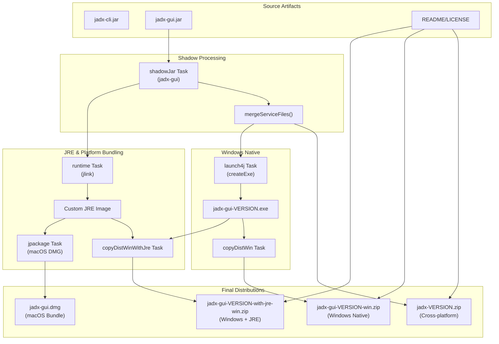
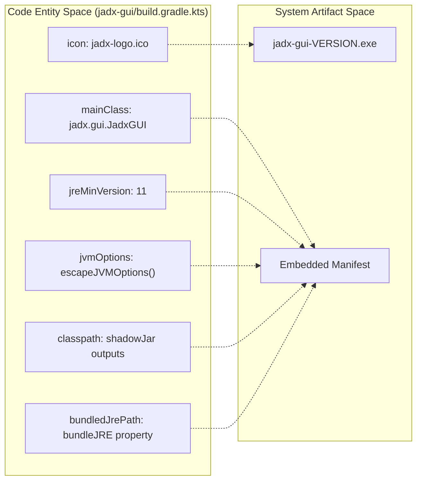

# Distribution and Packaging

<details>
<summary>Relevant source files</summary>

The following files were used as context for generating this wiki page:

- [build.gradle.kts](https://github.com/skylot/jadx/blob/HEAD/build.gradle.kts)
- [buildSrc/build.gradle.kts](https://github.com/skylot/jadx/blob/HEAD/buildSrc/build.gradle.kts)
- [buildSrc/src/main/kotlin/jadx-java.gradle.kts](https://github.com/skylot/jadx/blob/HEAD/buildSrc/src/main/kotlin/jadx-java.gradle.kts)
- [buildSrc/src/main/kotlin/jadx-rewrite.gradle.kts](https://github.com/skylot/jadx/blob/HEAD/buildSrc/src/main/kotlin/jadx-rewrite.gradle.kts)
- [jadx-cli/build.gradle.kts](https://github.com/skylot/jadx/blob/HEAD/jadx-cli/build.gradle.kts)
- [jadx-core/build.gradle.kts](https://github.com/skylot/jadx/blob/HEAD/jadx-core/build.gradle.kts)
- [jadx-gui/build.gradle.kts](https://github.com/skylot/jadx/blob/HEAD/jadx-gui/build.gradle.kts)
- [jadx-gui/dist/macos/jadx-logo.icns](https://github.com/skylot/jadx/blob/HEAD/jadx-gui/dist/macos/jadx-logo.icns)
- [jadx-gui/dist/macos/jpackage-file-associations/aab.properties](https://github.com/skylot/jadx/blob/HEAD/jadx-gui/dist/macos/jpackage-file-associations/aab.properties)
- [jadx-gui/dist/macos/jpackage-file-associations/aar.properties](https://github.com/skylot/jadx/blob/HEAD/jadx-gui/dist/macos/jpackage-file-associations/aar.properties)
- [jadx-gui/dist/macos/jpackage-file-associations/apk.properties](https://github.com/skylot/jadx/blob/HEAD/jadx-gui/dist/macos/jpackage-file-associations/apk.properties)
- [jadx-gui/dist/macos/jpackage-file-associations/apkm.properties](https://github.com/skylot/jadx/blob/HEAD/jadx-gui/dist/macos/jpackage-file-associations/apkm.properties)
- [jadx-gui/dist/macos/jpackage-file-associations/apks.properties](https://github.com/skylot/jadx/blob/HEAD/jadx-gui/dist/macos/jpackage-file-associations/apks.properties)
- [jadx-gui/dist/macos/jpackage-file-associations/arsc.properties](https://github.com/skylot/jadx/blob/HEAD/jadx-gui/dist/macos/jpackage-file-associations/arsc.properties)
- [jadx-gui/dist/macos/jpackage-file-associations/dex.properties](https://github.com/skylot/jadx/blob/HEAD/jadx-gui/dist/macos/jpackage-file-associations/dex.properties)
- [jadx-gui/dist/macos/jpackage-file-associations/jadx.properties](https://github.com/skylot/jadx/blob/HEAD/jadx-gui/dist/macos/jpackage-file-associations/jadx.properties)
- [jadx-gui/dist/macos/jpackage-file-associations/smali.properties](https://github.com/skylot/jadx/blob/HEAD/jadx-gui/dist/macos/jpackage-file-associations/smali.properties)
- [jadx-plugins/jadx-aab-input/build.gradle.kts](https://github.com/skylot/jadx/blob/HEAD/jadx-plugins/jadx-aab-input/build.gradle.kts)
- [jadx-plugins/jadx-dex-input/build.gradle.kts](https://github.com/skylot/jadx/blob/HEAD/jadx-plugins/jadx-dex-input/build.gradle.kts)
- [jadx-plugins/jadx-java-convert/build.gradle.kts](https://github.com/skylot/jadx/blob/HEAD/jadx-plugins/jadx-java-convert/build.gradle.kts)
- [jadx-plugins/jadx-kotlin-metadata/build.gradle.kts](https://github.com/skylot/jadx/blob/HEAD/jadx-plugins/jadx-kotlin-metadata/build.gradle.kts)
- [jadx-plugins/jadx-kotlin-source-debug-extension/build.gradle.kts](https://github.com/skylot/jadx/blob/HEAD/jadx-plugins/jadx-kotlin-source-debug-extension/build.gradle.kts)
- [jadx-plugins/jadx-smali-input/build.gradle.kts](https://github.com/skylot/jadx/blob/HEAD/jadx-plugins/jadx-smali-input/build.gradle.kts)

</details>


## Purpose and Scope

This document describes the distribution and packaging system for JADX, which transforms compiled Java and Kotlin bytecode into distributable artifacts for end users. The system utilizes a multi-module Gradle build to create shadow JARs (fat JARs), Windows native executables via Launch4j, custom Java Runtime Environment (JRE) bundles using `jlink` via the `runtime` plugin, and macOS DMG installers via `jpackage`.

---

## Overview of Packaging Pipeline

The distribution system consists of three main packaging stages: fat JAR creation with `shadowJar`, Windows executable generation with `launch4j`, and custom JRE bundling with the `runtime` plugin. These components work together to produce cross-platform, Windows-specific, and macOS-specific distribution artifacts.

### Packaging Data Flow



**Sources:** [jadx-gui/build.gradle.kts:112-222](https://github.com/skylot/jadx/blob/HEAD/jadx-gui/build.gradle.kts#L112-L222), [build.gradle.kts:150-225](https://github.com/skylot/jadx/blob/HEAD/build.gradle.kts#L150-L225)

---

## Fat JAR Creation with shadowJar

The `shadowJar` plugin creates "uber" JARs containing all dependencies bundled into a single executable. This is primarily used for the GUI and as the basis for native launchers.

### Plugin Configuration

JADX uses the `com.gradleup.shadow` plugin (version 8.3.8) in both `jadx-gui` and `jadx-cli` modules [jadx-gui/build.gradle.kts:7](https://github.com/skylot/jadx/blob/HEAD/jadx-gui/build.gradle.kts#L7), [jadx-cli/build.gradle.kts:7](https://github.com/skylot/jadx/blob/HEAD/jadx-cli/build.gradle.kts#L7).

**jadx-gui Configuration:**
```kotlin
tasks.shadowJar {
	isZip64 = true
	mergeServiceFiles()
	manifest {
		from(tasks.jar.get().manifest)
	}
}
```
[jadx-gui/build.gradle.kts:112-118](https://github.com/skylot/jadx/blob/HEAD/jadx-gui/build.gradle.kts#L112-L118)

### Key shadowJar Settings

| Setting | Value | Purpose |
|---------|-------|---------|
| `isZip64` | `true` | Supports large archives exceeding standard ZIP limits [jadx-gui/build.gradle.kts:113](https://github.com/skylot/jadx/blob/HEAD/jadx-gui/build.gradle.kts#L113) |
| `mergeServiceFiles()` | N/A | Combines `META-INF/services` files from dependencies (crucial for SPI) [jadx-gui/build.gradle.kts:114](https://github.com/skylot/jadx/blob/HEAD/jadx-gui/build.gradle.kts#L114) |
| `manifest` | Inherits from `jar` | Preserves `Main-Class` attribute (`jadx.gui.JadxGUI`) [jadx-gui/build.gradle.kts:115-117](https://github.com/skylot/jadx/blob/HEAD/jadx-gui/build.gradle.kts#L115-L117) |

In `jadx-cli`, the `shadowJar` task is explicitly emptied because the CLI artifacts are typically handled via `installShadowDist` or aggregated from the GUI shadow outputs to reduce duplication [jadx-cli/build.gradle.kts:54-57](https://github.com/skylot/jadx/blob/HEAD/jadx-cli/build.gradle.kts#L54-L57).

**Sources:** [jadx-gui/build.gradle.kts:112-118](https://github.com/skylot/jadx/blob/HEAD/jadx-gui/build.gradle.kts#L112-L118), [jadx-cli/build.gradle.kts:54-57](https://github.com/skylot/jadx/blob/HEAD/jadx-cli/build.gradle.kts#L54-L57)

---

## Windows Executable Generation with launch4j

The `launch4j` plugin wraps the GUI fat JAR in a Windows native executable to provide a standard desktop experience.

### launch4j Configuration Mapping



**Sources:** [jadx-gui/build.gradle.kts:147-176](https://github.com/skylot/jadx/blob/HEAD/jadx-gui/build.gradle.kts#L147-L176)

### Key Configuration Parameters

| Parameter | Value | Purpose |
|-----------|-------|---------|
| `mainClassName` | `jadx.gui.JadxGUI` | Entry point for the Windows process [jadx-gui/build.gradle.kts:148](https://github.com/skylot/jadx/blob/HEAD/jadx-gui/build.gradle.kts#L148) |
| `icon` | `jadx-logo.ico` | Sets the application icon in Windows Explorer [jadx-gui/build.gradle.kts:151](https://github.com/skylot/jadx/blob/HEAD/jadx-gui/build.gradle.kts#L151) |
| `jreMinVersion` | `11` | Minimum Java version check on launch [jadx-gui/build.gradle.kts:157](https://github.com/skylot/jadx/blob/HEAD/jadx-gui/build.gradle.kts#L157) |
| `bundledJrePath` | `%EXEDIR%/jre` | Path to look for bundled JRE if `bundleJRE` property is set [jadx-gui/build.gradle.kts:163](https://github.com/skylot/jadx/blob/HEAD/jadx-gui/build.gradle.kts#L163) |

The `escapeJVMOptions()` helper function ensures JVM arguments starting with `-D` are correctly quoted for the Windows shell [jadx-gui/build.gradle.kts:178-182](https://github.com/skylot/jadx/blob/HEAD/jadx-gui/build.gradle.kts#L178-L182).

---

## JRE Bundling and Platform Packages

The `org.beryx.runtime` plugin (version 2.0.1) creates custom, stripped-down JRE bundles using `jlink` and manages `jpackage` for native installers [jadx-gui/build.gradle.kts:9](https://github.com/skylot/jadx/blob/HEAD/jadx-gui/build.gradle.kts#L9).

### Custom JRE Composition

The JRE is minimized by including only the specific modules required for JADX operations:

| Module | Purpose |
|--------|---------|
| `java.desktop` | Swing/AWT UI and font management [jadx-gui/build.gradle.kts:186](https://github.com/skylot/jadx/blob/HEAD/jadx-gui/build.gradle.kts#L186) |
| `java.naming` | Required for internal dependency resolution [jadx-gui/build.gradle.kts:187](https://github.com/skylot/jadx/blob/HEAD/jadx-gui/build.gradle.kts#L187) |
| `java.xml` | XML processing for Android resources [jadx-gui/build.gradle.kts:188](https://github.com/skylot/jadx/blob/HEAD/jadx-gui/build.gradle.kts#L188) |
| `jdk.crypto.cryptoki` | Essential for HTTPS connections (plugin downloads/updates) [jadx-gui/build.gradle.kts:190](https://github.com/skylot/jadx/blob/HEAD/jadx-gui/build.gradle.kts#L190) |
| `jdk.accessibility` | UI accessibility support [jadx-gui/build.gradle.kts:191](https://github.com/skylot/jadx/blob/HEAD/jadx-gui/build.gradle.kts#L191) |

The bundle is further optimized using `--strip-debug`, `--no-header-files`, and `--no-man-pages` [jadx-gui/build.gradle.kts:184](https://github.com/skylot/jadx/blob/HEAD/jadx-gui/build.gradle.kts#L184).

### macOS jpackage Integration

On macOS, the build system uses `jpackage` to create a `.dmg` installer. This includes extensive file associations for formats like `.apk`, `.dex`, `.smali`, and `.aab` [jadx-gui/build.gradle.kts:196-200](https://github.com/skylot/jadx/blob/HEAD/jadx-gui/build.gradle.kts#L196-L200).

**Sources:** [jadx-gui/build.gradle.kts:183-222](https://github.com/skylot/jadx/blob/HEAD/jadx-gui/build.gradle.kts#L183-L222)

---

## Distribution Formats

The root `build.gradle.kts` defines tasks to aggregate module outputs into final distribution ZIP files.

### Artifact Descriptions

1.  **Universal Cross-Platform ZIP**: Produced by the `pack` task. It contains the CLI and GUI artifacts, shell scripts, and documentation. It modifies the start scripts to use `jadx.cli.JadxCLI` as the entry point [build.gradle.kts:151-192](https://github.com/skylot/jadx/blob/HEAD/build.gradle.kts#L151-L192).
2.  **Windows Native Bundle**: Produced by the `distWin` task. It aggregates the `.exe` from Launch4j and the `lib/` folder containing the shadow JAR [build.gradle.kts:194-204](https://github.com/skylot/jadx/blob/HEAD/build.gradle.kts#L194-L204).
3.  **Windows Bundle with JRE**: Produced by the `distWinWithJre` task. This includes the Windows native bundle plus the custom JRE image generated by the `runtime` task [build.gradle.kts:206-215](https://github.com/skylot/jadx/blob/HEAD/build.gradle.kts#L206-L215).
4.  **macOS DMG**: Produced by the `distMac` task, which copies the `jpackage` output into the build directory [build.gradle.kts:217-225](https://github.com/skylot/jadx/blob/HEAD/build.gradle.kts#L217-L225).

### Build Configuration and Quality

The build system enforces strict quality controls across all modules:

| Tool | Role | Configuration |
|------|------|---------------|
| **Spotless** | Code Formatting | Enforces Eclipse XML format for Java and ktlint for Kotlin [build.gradle.kts:64-84](https://github.com/skylot/jadx/blob/HEAD/build.gradle.kts#L64-L84). |
| **ErrorProne** | Static Analysis | Integrated into `compileJava` with configurable severity (`off`, `warn`, `error`) [buildSrc/src/main/kotlin/jadx-java.gradle.kts:75-97](https://github.com/skylot/jadx/blob/HEAD/buildSrc/src/main/kotlin/jadx-java.gradle.kts#L75-L97). |
| **OpenRewrite** | Refactoring | Automated recipes for AssertJ migrations and testing framework cleanup [buildSrc/src/main/kotlin/jadx-rewrite.gradle.kts:16-35](https://github.com/skylot/jadx/blob/HEAD/buildSrc/src/main/kotlin/jadx-rewrite.gradle.kts#L16-L35). |
| **Checkstyle** | Style Enforcement | Validates code against project-specific style rules [buildSrc/src/main/kotlin/jadx-java.gradle.kts:8](https://github.com/skylot/jadx/blob/HEAD/buildSrc/src/main/kotlin/jadx-java.gradle.kts#L8). |

**Sources:** [build.gradle.kts:1-129](https://github.com/skylot/jadx/blob/HEAD/build.gradle.kts#L1-L129), [buildSrc/src/main/kotlin/jadx-java.gradle.kts:1-98](https://github.com/skylot/jadx/blob/HEAD/buildSrc/src/main/kotlin/jadx-java.gradle.kts#L1-L98), [buildSrc/src/main/kotlin/jadx-rewrite.gradle.kts:1-35](https://github.com/skylot/jadx/blob/HEAD/buildSrc/src/main/kotlin/jadx-rewrite.gradle.kts#L1-L35)