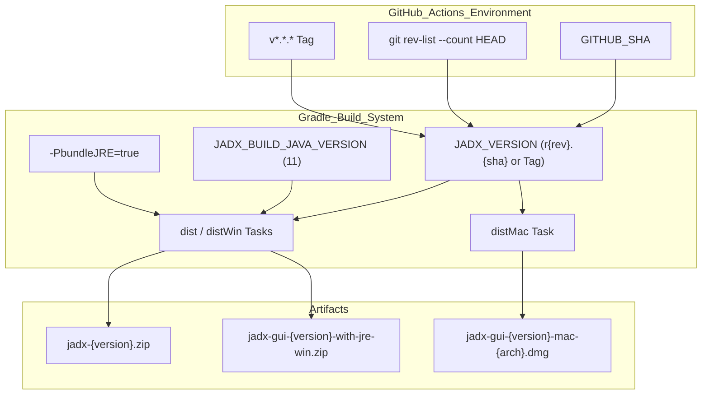
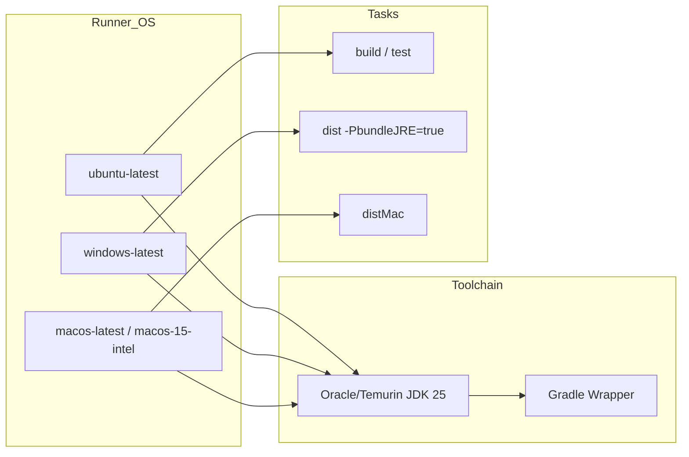

# CI/CD and Quality Tools

Relevant source files

The following files were used as context for generating this wiki page:

- [.github/workflows/build-artifacts.yml](https://github.com/skylot/jadx/blob/HEAD/.github/workflows/build-artifacts.yml)
- [.github/workflows/build-test.yml](https://github.com/skylot/jadx/blob/HEAD/.github/workflows/build-test.yml)
- [.github/workflows/release.yml](https://github.com/skylot/jadx/blob/HEAD/.github/workflows/release.yml)
- [.gitignore](https://github.com/skylot/jadx/blob/HEAD/.gitignore)
- [.gitlab-ci.yml](https://github.com/skylot/jadx/blob/HEAD/.gitlab-ci.yml)
- [gradle.properties](https://github.com/skylot/jadx/blob/HEAD/gradle.properties)

This page documents the continuous integration, continuous delivery, and automated quality assurance infrastructure used in JADX. It covers the GitHub Actions workflows, Docker-based build environments, and the suite of static analysis and formatting tools integrated into the Gradle build pipeline.

## Overview

JADX employs a robust CI/CD system primarily hosted on GitHub Actions, supplemented by GitLab CI. The infrastructure ensures code consistency through automated formatting (Spotless) and refactoring (OpenRewrite). Version management is strictly controlled via the Gradle Wrapper and environment-specific Java toolchains to ensure reproducible builds across different platforms.

---

## CI/CD Pipelines

### GitHub Actions (Primary)

JADX utilizes three main GitHub Actions workflows to manage the lifecycle of the application from testing to release.

#### 1. Build Test Workflow
The `Build Test` workflow runs on every push and pull request to the `master` branch. It ensures cross-platform compatibility by running on both `ubuntu-latest` and `windows-latest` [.github/workflows/build-test.yml:13-15](https://github.com/skylot/jadx/blob/HEAD/.github/workflows/build-test.yml#L13-L15).

**Workflow Steps:**
- **Environment Setup:** Configures JDK 25 (Temurin) [.github/workflows/build-test.yml:19-23](https://github.com/skylot/jadx/blob/HEAD/.github/workflows/build-test.yml#L19-L23).
- **Build Execution:** Runs `./gradlew build dist distWin` [.github/workflows/build-test.yml:29](https://github.com/skylot/jadx/blob/HEAD/.github/workflows/build-test.yml#L29).
- **Java Targeting:** Sets `JADX_BUILD_JAVA_VERSION` to `11` to ensure the produced bytecode is compatible with Java 11 runtimes [.github/workflows/build-test.yml:31](https://github.com/skylot/jadx/blob/HEAD/.github/workflows/build-test.yml#L31).

Sources: [.github/workflows/build-test.yml:1-32](https://github.com/skylot/jadx/blob/HEAD/.github/workflows/build-test.yml#L1-L32)

#### 2. Build Artifacts Workflow
Triggered on pushes to `master`, this workflow generates development snapshots. It implements a custom versioning scheme based on git commit counts and the short SHA [.github/workflows/build-artifacts.yml:23-25](https://github.com/skylot/jadx/blob/HEAD/.github/workflows/build-artifacts.yml#L23-L25).

**Artifact Generation:**
- **Standard Bundle:** Cross-platform distribution built on Linux via `dist` and `distWin` tasks [.github/workflows/build-artifacts.yml:31](https://github.com/skylot/jadx/blob/HEAD/.github/workflows/build-artifacts.yml#L31).
- **Windows No-JRE:** Windows executable without a bundled runtime, extracted from `jadx-gui/build/jadx-gui-win/*` [.github/workflows/build-artifacts.yml:48-50](https://github.com/skylot/jadx/blob/HEAD/.github/workflows/build-artifacts.yml#L48-L50).
- **Windows With-JRE:** Built on `windows-latest` using `-PbundleJRE=true` to include a custom JRE via `jlink` [.github/workflows/build-artifacts.yml:81-88](https://github.com/skylot/jadx/blob/HEAD/.github/workflows/build-artifacts.yml#L81-L88).
- **macOS Bundles:** Built on `macos-latest` and `macos-15-intel` using `distMac` to generate DMG files for both ARM and Intel architectures [.github/workflows/build-artifacts.yml:93-124](https://github.com/skylot/jadx/blob/HEAD/.github/workflows/build-artifacts.yml#L93-L124).

Sources: [.github/workflows/build-artifacts.yml:1-127](https://github.com/skylot/jadx/blob/HEAD/.github/workflows/build-artifacts.yml#L1-L127)

#### 3. Release Workflow
Triggered by version tags (e.g., `v1.5.0`) [.github/workflows/release.yml:3-6](https://github.com/skylot/jadx/blob/HEAD/.github/workflows/release.yml#L3-L6). It coordinates building Windows bundles with JREs on Windows runners [.github/workflows/release.yml:13-34](https://github.com/skylot/jadx/blob/HEAD/.github/workflows/release.yml#L13-L34), macOS DMGs on Mac runners [.github/workflows/release.yml:44-77](https://github.com/skylot/jadx/blob/HEAD/.github/workflows/release.yml#L44-L77), and then aggregating all artifacts on a Linux runner for final upload to GitHub Releases [.github/workflows/release.yml:79-137](https://github.com/skylot/jadx/blob/HEAD/.github/workflows/release.yml#L79-L137). The release uses `softprops/action-gh-release` to upload files including ZIP and DMG formats [.github/workflows/release.yml:129-137](https://github.com/skylot/jadx/blob/HEAD/.github/workflows/release.yml#L129-L137).

Sources: [.github/workflows/release.yml:1-137](https://github.com/skylot/jadx/blob/HEAD/.github/workflows/release.yml#L1-L137)

### GitLab CI (Secondary)
A parallel pipeline exists in `.gitlab-ci.yml`, utilizing an `eclipse-temurin:21` Docker image [.gitlab-ci.yml:13](https://github.com/skylot/jadx/blob/HEAD/.gitlab-ci.yml#L13). It enforces strict Java 11 compliance for both building and testing via `JADX_BUILD_JAVA_VERSION=11` and `JADX_TEST_JAVA_VERSION=11` [.gitlab-ci.yml:14](https://github.com/skylot/jadx/blob/HEAD/.gitlab-ci.yml#L14).

Sources: [.gitlab-ci.yml:1-15](https://github.com/skylot/jadx/blob/HEAD/.gitlab-ci.yml#L1-L15)

---

## Quality and Maintenance Tools

### Build Configuration and JVM Arguments
The project uses specific JVM flags to enable the `google-java-format` (used by Spotless) on Java versions >= 16 by exporting internal compiler packages [.gradle.properties:11-16](https://github.com/skylot/jadx/blob/HEAD/.gradle.properties#L11-L16). Parallel execution and caching are enabled to optimize build times [.gradle.properties:2-3](https://github.com/skylot/jadx/blob/HEAD/.gradle.properties#L2-L3).

Sources: [.gradle.properties:1-17](https://github.com/skylot/jadx/blob/HEAD/.gradle.properties#L1-L17)

### Automated Quality Tools
While the build script details are abstracted in convention plugins, the CI pipeline enforces quality through the standard `./gradlew build` task which executes tests and static analysis [.github/workflows/build-test.yml:29](https://github.com/skylot/jadx/blob/HEAD/.github/workflows/build-test.yml#L29).

---

## System Architecture: CI/CD Flow

The following diagrams illustrate how the CI/CD configuration interacts with the build environment and code entities.

### Build Toolchain and Versioning Flow
This diagram shows how environment variables and git metadata flow into the Gradle build to produce versioned artifacts.

Sources: [.github/workflows/build-artifacts.yml:21-33](https://github.com/skylot/jadx/blob/HEAD/.github/workflows/build-artifacts.yml#L21-L33), [.github/workflows/build-artifacts.yml:70-81](https://github.com/skylot/jadx/blob/HEAD/.github/workflows/build-artifacts.yml#L70-L81), [.github/workflows/release.yml:23-28](https://github.com/skylot/jadx/blob/HEAD/.github/workflows/release.yml#L23-L28), [.github/workflows/release.yml:68-69](https://github.com/skylot/jadx/blob/HEAD/.github/workflows/release.yml#L68-L69)

### CI Pipeline Matrix and Environment
This diagram maps the CI jobs to their respective operating systems and toolchains.

Sources: [.github/workflows/build-test.yml:13-23](https://github.com/skylot/jadx/blob/HEAD/.github/workflows/build-test.yml#L13-L23), [.github/workflows/build-artifacts.yml:54-64](https://github.com/skylot/jadx/blob/HEAD/.github/workflows/build-artifacts.yml#L54-L64), [.github/workflows/build-artifacts.yml:92-106](https://github.com/skylot/jadx/blob/HEAD/.github/workflows/build-artifacts.yml#L92-L106), [.github/workflows/release.yml:13-21](https://github.com/skylot/jadx/blob/HEAD/.github/workflows/release.yml#L13-L21)