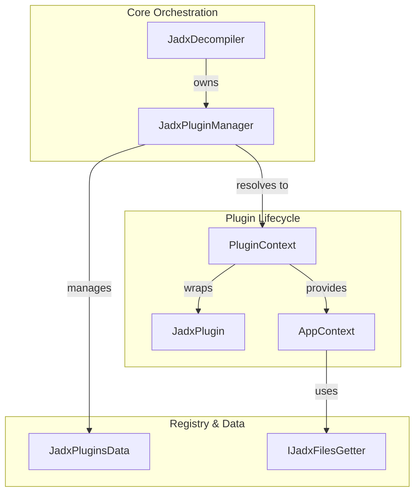
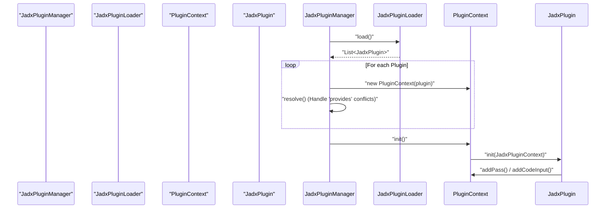
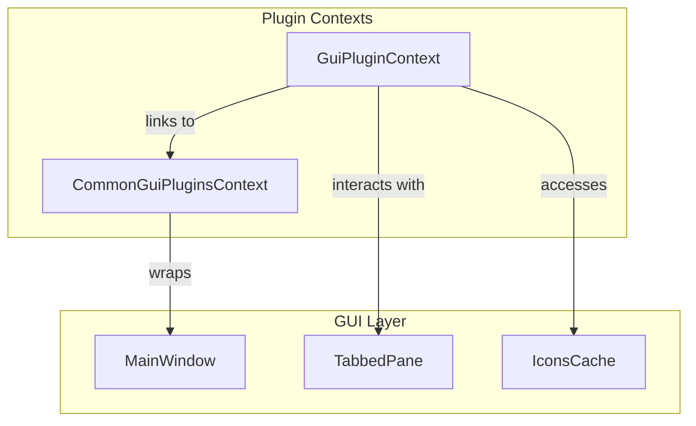

# Plugin System

Relevant source files

The following files were used as context for generating this wiki page:

- [jadx-cli/src/main/java/jadx/cli/plugins/JadxFilesGetter.java](https://github.com/skylot/jadx/blob/HEAD/jadx-cli/src/main/java/jadx/cli/plugins/JadxFilesGetter.java)
- [jadx-commons/jadx-app-commons/src/main/java/jadx/commons/app/JadxTempFiles.java](https://github.com/skylot/jadx/blob/HEAD/jadx-commons/jadx-app-commons/src/main/java/jadx/commons/app/JadxTempFiles.java)
- [jadx-core/src/main/java/jadx/api/gui/tree/ITreeNode.java](https://github.com/skylot/jadx/blob/HEAD/jadx-core/src/main/java/jadx/api/gui/tree/ITreeNode.java)
- [jadx-core/src/main/java/jadx/api/plugins/JadxPluginContext.java](https://github.com/skylot/jadx/blob/HEAD/jadx-core/src/main/java/jadx/api/plugins/JadxPluginContext.java)
- [jadx-core/src/main/java/jadx/api/plugins/events/types/ReloadSettingsWindow.java](https://github.com/skylot/jadx/blob/HEAD/jadx-core/src/main/java/jadx/api/plugins/events/types/ReloadSettingsWindow.java)
- [jadx-core/src/main/java/jadx/api/plugins/gui/JadxGuiContext.java](https://github.com/skylot/jadx/blob/HEAD/jadx-core/src/main/java/jadx/api/plugins/gui/JadxGuiContext.java)
- [jadx-core/src/main/java/jadx/api/plugins/gui/JadxGuiSettings.java](https://github.com/skylot/jadx/blob/HEAD/jadx-core/src/main/java/jadx/api/plugins/gui/JadxGuiSettings.java)
- [jadx-core/src/main/java/jadx/core/plugins/JadxPluginManager.java](https://github.com/skylot/jadx/blob/HEAD/jadx-core/src/main/java/jadx/core/plugins/JadxPluginManager.java)
- [jadx-core/src/main/java/jadx/core/plugins/PluginContext.java](https://github.com/skylot/jadx/blob/HEAD/jadx-core/src/main/java/jadx/core/plugins/PluginContext.java)
- [jadx-core/src/main/java/jadx/core/plugins/files/TempFilesGetter.java](https://github.com/skylot/jadx/blob/HEAD/jadx-core/src/main/java/jadx/core/plugins/files/TempFilesGetter.java)
- [jadx-gui/src/main/java/jadx/gui/plugins/context/CommonGuiPluginsContext.java](https://github.com/skylot/jadx/blob/HEAD/jadx-gui/src/main/java/jadx/gui/plugins/context/CommonGuiPluginsContext.java)
- [jadx-gui/src/main/java/jadx/gui/plugins/context/GuiPluginContext.java](https://github.com/skylot/jadx/blob/HEAD/jadx-gui/src/main/java/jadx/gui/plugins/context/GuiPluginContext.java)
- [jadx-gui/src/main/java/jadx/gui/plugins/context/TreePopupMenuEntry.java](https://github.com/skylot/jadx/blob/HEAD/jadx-gui/src/main/java/jadx/gui/plugins/context/TreePopupMenuEntry.java)
- [jadx-gui/src/main/java/jadx/gui/utils/IconsCache.java](https://github.com/skylot/jadx/blob/HEAD/jadx-gui/src/main/java/jadx/gui/utils/IconsCache.java)
- [jadx-gui/src/main/java/jadx/gui/utils/plugins/CollectPlugins.java](https://github.com/skylot/jadx/blob/HEAD/jadx-gui/src/main/java/jadx/gui/utils/plugins/CollectPlugins.java)

This document describes the plugin system in Jadx, including its architecture, plugin loading mechanism, configuration, and available plugin types. The focus is on how Jadx discovers, loads, and interacts with plugins, and how plugins extend Jadx to support additional input formats and processing features.

---

## Purpose and Scope

The plugin system in Jadx provides a modular and extensible architecture for supporting multiple input formats (such as DEX, JAR, Smali, AAB, XAPK, APKM, etc.) and additional processing features (such as deobfuscation mappings, Kotlin metadata, and bytecode conversion). 

This is a **parent page** providing a high-level overview. For detailed technical documentation, please refer to the following child pages:

- **[Plugin Architecture and Interfaces](30_6.1-plugin-architecture-and-interfaces.md)**: Details on `JadxPluginManager`, lifecycle management, and discovery.
- **[Input Plugins](31_6.2-input-plugins.md)**: Technical details on `JadxCodeInput`, `ICodeLoader`, and file format loading.
- **[Processing Plugins](32_6.3-processing-plugins.md)**: Information on `JadxPass` implementations and visitor pipeline transformations.
- **[Plugin Tools and External Plugin Management](33_6.4-plugin-tools-and-external-plugin-management.md)**: Managing external plugins via `JadxPluginsTools`, the `plugins.json` registry, and GitHub resolvers.

---

## High-Level Architecture

The plugin system is orchestrated by the `JadxPluginManager` [jadx-core/src/main/java/jadx/core/plugins/JadxPluginManager.java:26-36](https://github.com/skylot/jadx/blob/HEAD/jadx-core/src/main/java/jadx/core/plugins/JadxPluginManager.java#L26-L36), which manages a set of `PluginContext` objects [jadx-core/src/main/java/jadx/core/plugins/PluginContext.java:37-51](https://github.com/skylot/jadx/blob/HEAD/jadx-core/src/main/java/jadx/core/plugins/PluginContext.java#L37-L51). Each plugin must implement the `JadxPlugin` interface [jadx-core/src/main/java/jadx/api/plugins/JadxPlugin.java:10-12](https://github.com/skylot/jadx/blob/HEAD/jadx-core/src/main/java/jadx/api/plugins/JadxPlugin.java#L10-L12).

### Diagram: Plugin Infrastructure and Context

This diagram maps the natural language concepts of "Plugin Management" to the specific code entities that handle them.

**Sources:**
[jadx-core/src/main/java/jadx/core/plugins/JadxPluginManager.java:26-42](https://github.com/skylot/jadx/blob/HEAD/jadx-core/src/main/java/jadx/core/plugins/JadxPluginManager.java#L26-L42)
[jadx-core/src/main/java/jadx/core/plugins/PluginContext.java:37-58](https://github.com/skylot/jadx/blob/HEAD/jadx-core/src/main/java/jadx/core/plugins/PluginContext.java#L37-L58)
[jadx-core/src/main/java/jadx/core/plugins/files/IJadxFilesGetter.java:8-10](https://github.com/skylot/jadx/blob/HEAD/jadx-core/src/main/java/jadx/core/plugins/files/IJadxFilesGetter.java#L8-L10)

---

## Plugin Discovery and Loading

Plugins are discovered using a `JadxPluginLoader` [jadx-core/src/main/java/jadx/core/plugins/JadxPluginManager.java:51-58](https://github.com/skylot/jadx/blob/HEAD/jadx-core/src/main/java/jadx/core/plugins/JadxPluginManager.java#L51-L58). During the `load` phase, the manager verifies version compatibility [jadx-core/src/main/java/jadx/core/plugins/JadxPluginManager.java:71-82](https://github.com/skylot/jadx/blob/HEAD/jadx-core/src/main/java/jadx/core/plugins/JadxPluginManager.java#L71-L82) and resolves conflicts where multiple plugins might provide the same functionality via the `provides` metadata [jadx-core/src/main/java/jadx/core/plugins/JadxPluginManager.java:110-132](https://github.com/skylot/jadx/blob/HEAD/jadx-core/src/main/java/jadx/core/plugins/JadxPluginManager.java#L110-L132).

External plugins are loaded from JAR files using `JadxExternalPluginsLoader` [jadx-gui/src/main/java/jadx/gui/utils/plugins/CollectPlugins.java:47](https://github.com/skylot/jadx/blob/HEAD/jadx-gui/src/main/java/jadx/gui/utils/plugins/CollectPlugins.java#L47).

### Diagram: Initialization Sequence

This diagram shows how `JadxPluginManager` transitions from raw discovery to an initialized state.

**Sources:**
[jadx-core/src/main/java/jadx/core/plugins/JadxPluginManager.java:51-69](https://github.com/skylot/jadx/blob/HEAD/jadx-core/src/main/java/jadx/core/plugins/JadxPluginManager.java#L51-L69)
[jadx-core/src/main/java/jadx/core/plugins/PluginContext.java:60-65](https://github.com/skylot/jadx/blob/HEAD/jadx-core/src/main/java/jadx/core/plugins/PluginContext.java#L60-L65)

---

## Plugin Configuration and Options

Plugins can define their own configuration parameters by implementing `JadxPluginOptions` and registering them via `registerOptions` [jadx-core/src/main/java/jadx/core/plugins/PluginContext.java:115-122](https://github.com/skylot/jadx/blob/HEAD/jadx-core/src/main/java/jadx/core/plugins/PluginContext.java#L115-L122). These options are verified to ensure they are prefixed with the plugin ID to prevent collisions [jadx-core/src/main/java/jadx/core/plugins/JadxPluginManager.java:187-208](https://github.com/skylot/jadx/blob/HEAD/jadx-core/src/main/java/jadx/core/plugins/JadxPluginManager.java#L187-L208).

For details on how these options are surfaced in the UI or CLI, see [Plugin Architecture and Interfaces](30_6.1-plugin-architecture-and-interfaces.md).

---

## Extension Points

Plugins extend JADX primarily through the `JadxPluginContext` interface [jadx-core/src/main/java/jadx/api/plugins/JadxPluginContext.java:19-68](https://github.com/skylot/jadx/blob/HEAD/jadx-core/src/main/java/jadx/api/plugins/JadxPluginContext.java#L19-L68), which allows them to:

| Extension Point | Interface / Class | Purpose |
| --- | --- | --- |
| **Input Loading** | `JadxCodeInput` | Register new loaders for file formats like DEX or Java [jadx-core/src/main/java/jadx/api/plugins/JadxPluginContext.java:27](https://github.com/skylot/jadx/blob/HEAD/jadx-core/src/main/java/jadx/api/plugins/JadxPluginContext.java#L27). |
| **Code Processing** | `JadxPass` | Inject custom transformation passes into the decompiler pipeline [jadx-core/src/main/java/jadx/api/plugins/JadxPluginContext.java:25](https://github.com/skylot/jadx/blob/HEAD/jadx-core/src/main/java/jadx/api/plugins/JadxPluginContext.java#L25). |
| **GUI Integration** | `JadxGuiContext` | Add custom menu actions, popup menus, or icons [jadx-core/src/main/java/jadx/api/plugins/JadxPluginContext.java:47](https://github.com/skylot/jadx/blob/HEAD/jadx-core/src/main/java/jadx/api/plugins/JadxPluginContext.java#L47). |
| **Resource Loading** | `IResourcesLoader` | Customize how Android resources are decoded [jadx-core/src/main/java/jadx/api/plugins/JadxPluginContext.java:41](https://github.com/skylot/jadx/blob/HEAD/jadx-core/src/main/java/jadx/api/plugins/JadxPluginContext.java#L41). |

### GUI Extensions
In the GUI application, plugins can access `JadxGuiContext` [jadx-core/src/main/java/jadx/api/plugins/gui/JadxGuiContext.java:17-117](https://github.com/skylot/jadx/blob/HEAD/jadx-core/src/main/java/jadx/api/plugins/gui/JadxGuiContext.java#L17-L117) to integrate with the Swing-based UI. This includes:
- Adding menu entries to the 'Plugins' section [jadx-core/src/main/java/jadx/api/plugins/gui/JadxGuiContext.java:25-27](https://github.com/skylot/jadx/blob/HEAD/jadx-core/src/main/java/jadx/api/plugins/gui/JadxGuiContext.java#L25-L27).
- Adding popup menu entries for code viewer [jadx-core/src/main/java/jadx/api/plugins/gui/JadxGuiContext.java:30-39](https://github.com/skylot/jadx/blob/HEAD/jadx-core/src/main/java/jadx/api/plugins/gui/JadxGuiContext.java#L30-L39) or tree nodes [jadx-core/src/main/java/jadx/api/plugins/gui/JadxGuiContext.java:42-48](https://github.com/skylot/jadx/blob/HEAD/jadx-core/src/main/java/jadx/api/plugins/gui/JadxGuiContext.java#L42-L48).
- Loading SVG icons from JADX resources [jadx-core/src/main/java/jadx/api/plugins/gui/JadxGuiContext.java:74-81](https://github.com/skylot/jadx/blob/HEAD/jadx-core/src/main/java/jadx/api/plugins/gui/JadxGuiContext.java#L74-L81).

For details on input formats, see [Input Plugins](31_6.2-input-plugins.md). For pipeline transformations, see [Processing Plugins](32_6.3-processing-plugins.md).

---

## External Plugin Management

External plugins can be managed dynamically. The `CollectPlugins` utility [jadx-gui/src/main/java/jadx/gui/utils/plugins/CollectPlugins.java:21-53](https://github.com/skylot/jadx/blob/HEAD/jadx-gui/src/main/java/jadx/gui/utils/plugins/CollectPlugins.java#L21-L53) allows collecting and initializing plugins even if the decompiler is not yet fully initialized, often used for populating settings or UI components.

### Diagram: GUI Plugin Integration
This diagram illustrates how a plugin interacts with the GUI components through the `GuiPluginContext`.

**Sources:**
[jadx-gui/src/main/java/jadx/gui/plugins/context/GuiPluginContext.java:39-63](https://github.com/skylot/jadx/blob/HEAD/jadx-gui/src/main/java/jadx/gui/plugins/context/GuiPluginContext.java#L39-L63)
[jadx-gui/src/main/java/jadx/gui/plugins/context/CommonGuiPluginsContext.java:19-38](https://github.com/skylot/jadx/blob/HEAD/jadx-gui/src/main/java/jadx/gui/plugins/context/CommonGuiPluginsContext.java#L19-L38)
[jadx-gui/src/main/java/jadx/gui/utils/IconsCache.java:8-15](https://github.com/skylot/jadx/blob/HEAD/jadx-gui/src/main/java/jadx/gui/utils/IconsCache.java#L8-L15)

The `JadxFilesGetter` (and its temporary variant `TempFilesGetter`) provides the necessary directory paths for config and cache storage [jadx-core/src/main/java/jadx/core/plugins/files/TempFilesGetter.java:29-41](https://github.com/skylot/jadx/blob/HEAD/jadx-core/src/main/java/jadx/core/plugins/files/TempFilesGetter.java#L29-L41).

For details on the external management system, see [Plugin Tools and External Plugin Management](33_6.4-plugin-tools-and-external-plugin-management.md).

**Sources:**
[jadx-core/src/main/java/jadx/core/plugins/JadxPluginManager.java:210-215](https://github.com/skylot/jadx/blob/HEAD/jadx-core/src/main/java/jadx/core/plugins/JadxPluginManager.java#L210-L215)
[jadx-core/src/main/java/jadx/api/plugins/JadxPluginContext.java:19-68](https://github.com/skylot/jadx/blob/HEAD/jadx-core/src/main/java/jadx/api/plugins/JadxPluginContext.java#L19-L68)
[jadx-gui/src/main/java/jadx/gui/utils/plugins/CollectPlugins.java:39-52](https://github.com/skylot/jadx/blob/HEAD/jadx-gui/src/main/java/jadx/gui/utils/plugins/CollectPlugins.java#L39-L52)
[jadx-core/src/main/java/jadx/core/plugins/files/TempFilesGetter.java:29-41](https://github.com/skylot/jadx/blob/HEAD/jadx-core/src/main/java/jadx/core/plugins/files/TempFilesGetter.java#L29-L41)
[jadx-gui/src/main/java/jadx/gui/plugins/context/GuiPluginContext.java:17-117](https://github.com/skylot/jadx/blob/HEAD/jadx-gui/src/main/java/jadx/gui/plugins/context/GuiPluginContext.java#L17-L117)