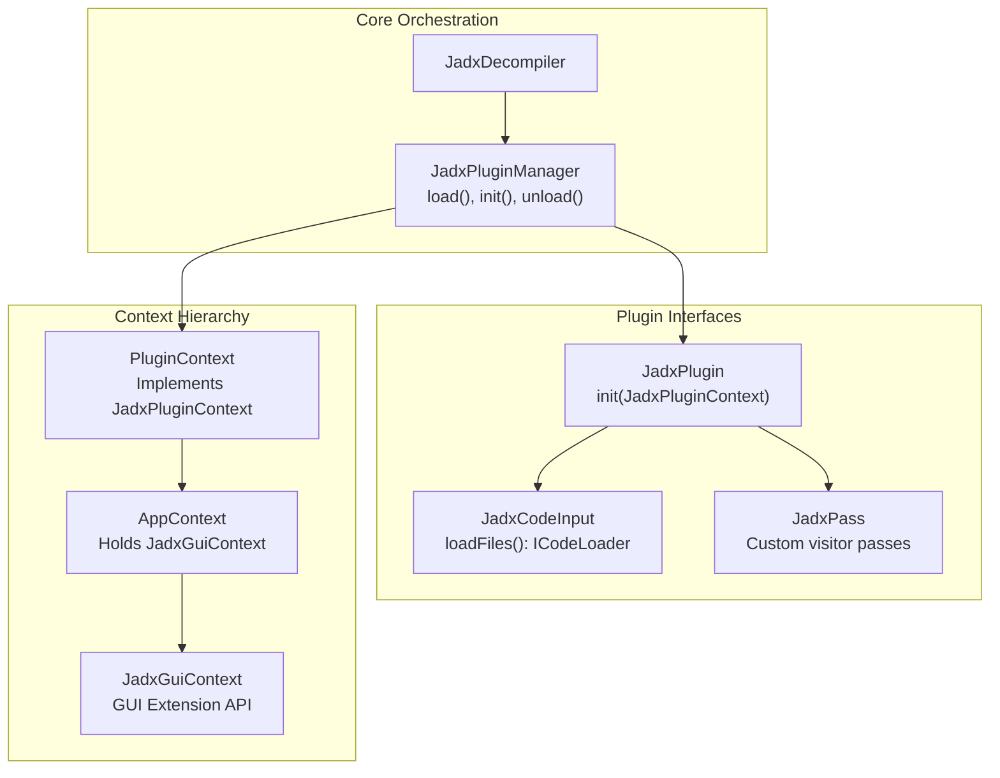
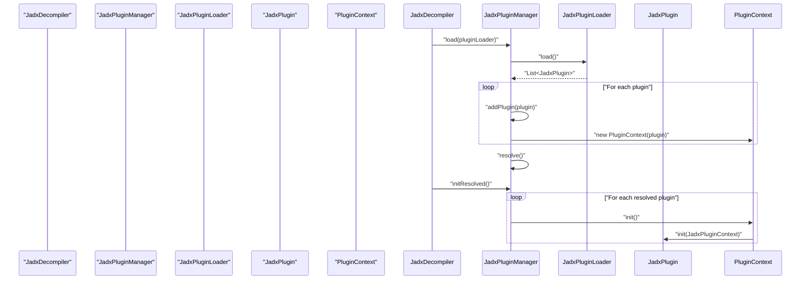
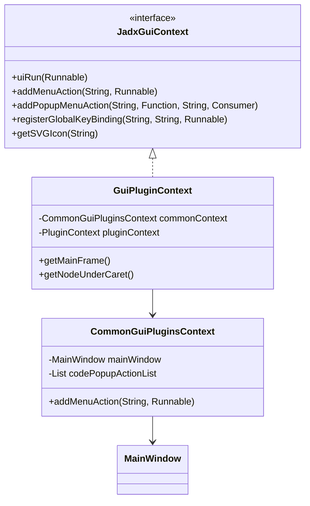

# Plugin Architecture and Interfaces

Relevant source files

The following files were used as context for generating this wiki page:

- [jadx-cli/src/main/java/jadx/cli/plugins/JadxFilesGetter.java](https://github.com/skylot/jadx/blob/HEAD/jadx-cli/src/main/java/jadx/cli/plugins/JadxFilesGetter.java)
- [jadx-commons/jadx-app-commons/README.md](https://github.com/skylot/jadx/blob/HEAD/jadx-commons/jadx-app-commons/README.md)
- [jadx-commons/jadx-app-commons/src/main/java/jadx/commons/app/JadxCommonEnv.java](https://github.com/skylot/jadx/blob/HEAD/jadx-commons/jadx-app-commons/src/main/java/jadx/commons/app/JadxCommonEnv.java)
- [jadx-commons/jadx-app-commons/src/main/java/jadx/commons/app/JadxTempFiles.java](https://github.com/skylot/jadx/blob/HEAD/jadx-commons/jadx-app-commons/src/main/java/jadx/commons/app/JadxTempFiles.java)
- [jadx-core/src/main/java/jadx/api/gui/tree/ITreeNode.java](https://github.com/skylot/jadx/blob/HEAD/jadx-core/src/main/java/jadx/api/gui/tree/ITreeNode.java)
- [jadx-core/src/main/java/jadx/api/plugins/JadxPlugin.java](https://github.com/skylot/jadx/blob/HEAD/jadx-core/src/main/java/jadx/api/plugins/JadxPlugin.java)
- [jadx-core/src/main/java/jadx/api/plugins/JadxPluginContext.java](https://github.com/skylot/jadx/blob/HEAD/jadx-core/src/main/java/jadx/api/plugins/JadxPluginContext.java)
- [jadx-core/src/main/java/jadx/api/plugins/events/types/ReloadProject.java](https://github.com/skylot/jadx/blob/HEAD/jadx-core/src/main/java/jadx/api/plugins/events/types/ReloadProject.java)
- [jadx-core/src/main/java/jadx/api/plugins/events/types/ReloadSettingsWindow.java](https://github.com/skylot/jadx/blob/HEAD/jadx-core/src/main/java/jadx/api/plugins/events/types/ReloadSettingsWindow.java)
- [jadx-core/src/main/java/jadx/api/plugins/gui/ISettingsGroup.java](https://github.com/skylot/jadx/blob/HEAD/jadx-core/src/main/java/jadx/api/plugins/gui/ISettingsGroup.java)
- [jadx-core/src/main/java/jadx/api/plugins/gui/JadxGuiContext.java](https://github.com/skylot/jadx/blob/HEAD/jadx-core/src/main/java/jadx/api/plugins/gui/JadxGuiContext.java)
- [jadx-core/src/main/java/jadx/api/plugins/gui/JadxGuiSettings.java](https://github.com/skylot/jadx/blob/HEAD/jadx-core/src/main/java/jadx/api/plugins/gui/JadxGuiSettings.java)
- [jadx-core/src/main/java/jadx/core/plugins/JadxPluginManager.java](https://github.com/skylot/jadx/blob/HEAD/jadx-core/src/main/java/jadx/core/plugins/JadxPluginManager.java)
- [jadx-core/src/main/java/jadx/core/plugins/PluginContext.java](https://github.com/skylot/jadx/blob/HEAD/jadx-core/src/main/java/jadx/core/plugins/PluginContext.java)
- [jadx-core/src/main/java/jadx/core/plugins/files/TempFilesGetter.java](https://github.com/skylot/jadx/blob/HEAD/jadx-core/src/main/java/jadx/core/plugins/files/TempFilesGetter.java)
- [jadx-gui/src/main/java/jadx/gui/cache/code/disk/DiskCodeCache.java](https://github.com/skylot/jadx/blob/HEAD/jadx-gui/src/main/java/jadx/gui/cache/code/disk/DiskCodeCache.java)
- [jadx-gui/src/main/java/jadx/gui/plugins/context/CommonGuiPluginsContext.java](https://github.com/skylot/jadx/blob/HEAD/jadx-gui/src/main/java/jadx/gui/plugins/context/CommonGuiPluginsContext.java)
- [jadx-gui/src/main/java/jadx/gui/plugins/context/GuiPluginContext.java](https://github.com/skylot/jadx/blob/HEAD/jadx-gui/src/main/java/jadx/gui/plugins/context/GuiPluginContext.java)
- [jadx-gui/src/main/java/jadx/gui/plugins/context/TreePopupMenuEntry.java](https://github.com/skylot/jadx/blob/HEAD/jadx-gui/src/main/java/jadx/gui/plugins/context/TreePopupMenuEntry.java)
- [jadx-gui/src/main/java/jadx/gui/settings/ui/SettingsGroup.java](https://github.com/skylot/jadx/blob/HEAD/jadx-gui/src/main/java/jadx/gui/settings/ui/SettingsGroup.java)
- [jadx-gui/src/main/java/jadx/gui/settings/ui/cache/CachesTable.java](https://github.com/skylot/jadx/blob/HEAD/jadx-gui/src/main/java/jadx/gui/settings/ui/cache/CachesTable.java)
- [jadx-gui/src/main/java/jadx/gui/settings/ui/plugins/PluginSettingsGroup.java](https://github.com/skylot/jadx/blob/HEAD/jadx-gui/src/main/java/jadx/gui/settings/ui/plugins/PluginSettingsGroup.java)
- [jadx-gui/src/main/java/jadx/gui/utils/IconsCache.java](https://github.com/skylot/jadx/blob/HEAD/jadx-gui/src/main/java/jadx/gui/utils/IconsCache.java)
- [jadx-gui/src/main/java/jadx/gui/utils/files/JadxFiles.java](https://github.com/skylot/jadx/blob/HEAD/jadx-gui/src/main/java/jadx/gui/utils/files/JadxFiles.java)
- [jadx-gui/src/main/java/jadx/gui/utils/plugins/CloseablePlugins.java](https://github.com/skylot/jadx/blob/HEAD/jadx-gui/src/main/java/jadx/gui/utils/plugins/CloseablePlugins.java)
- [jadx-gui/src/main/java/jadx/gui/utils/plugins/CollectPlugins.java](https://github.com/skylot/jadx/blob/HEAD/jadx-gui/src/main/java/jadx/gui/utils/plugins/CollectPlugins.java)
- [jadx-plugins-tools/src/main/java/jadx/plugins/tools/utils/PluginFiles.java](https://github.com/skylot/jadx/blob/HEAD/jadx-plugins-tools/src/main/java/jadx/plugins/tools/utils/PluginFiles.java)

## Overview

The JADX plugin system provides extensibility through a well-defined set of interfaces and a centralized plugin manager. The `JadxPluginManager` [jadx-core/src/main/java/jadx/core/plugins/JadxPluginManager.java:26-26](https://github.com/skylot/jadx/blob/HEAD/jadx-core/src/main/java/jadx/core/plugins/JadxPluginManager.java#L26) discovers and initializes plugins, which can extend JADX's capabilities in several ways:

1.  **Input Plugins** - Load different file formats (DEX, Java bytecode, Smali, etc.) via the `JadxCodeInput` interface [jadx-core/src/main/java/jadx/core/plugins/JadxPluginManager.java:210-213](https://github.com/skylot/jadx/blob/HEAD/jadx-core/src/main/java/jadx/core/plugins/JadxPluginManager.java#L210-L213).
2.  **Processing Plugins** - Transform the intermediate representation via the `JadxPass` interface [jadx-core/src/main/java/jadx/api/plugins/pass/JadxPass.java:7-7](https://github.com/skylot/jadx/blob/HEAD/jadx-core/src/main/java/jadx/api/plugins/pass/JadxPass.java#L7).
3.  **GUI Plugins** - Extend the JADX-GUI with menus, popup actions, and custom settings groups via `JadxGuiContext` [jadx-core/src/main/java/jadx/api/plugins/gui/JadxGuiContext.java:17-17](https://github.com/skylot/jadx/blob/HEAD/jadx-core/src/main/java/jadx/api/plugins/gui/JadxGuiContext.java#L17).

**Plugin System Architecture**

**Sources:** [jadx-core/src/main/java/jadx/core/plugins/JadxPluginManager.java:26-26](https://github.com/skylot/jadx/blob/HEAD/jadx-core/src/main/java/jadx/core/plugins/JadxPluginManager.java#L26), [jadx-core/src/main/java/jadx/core/plugins/PluginContext.java:37-37](https://github.com/skylot/jadx/blob/HEAD/jadx-core/src/main/java/jadx/core/plugins/PluginContext.java#L37), [jadx-core/src/main/java/jadx/api/plugins/JadxPlugin.java:7-7](https://github.com/skylot/jadx/blob/HEAD/jadx-core/src/main/java/jadx/api/plugins/JadxPlugin.java#L7), [jadx-core/src/main/java/jadx/api/plugins/gui/JadxGuiContext.java:17-17](https://github.com/skylot/jadx/blob/HEAD/jadx-core/src/main/java/jadx/api/plugins/gui/JadxGuiContext.java#L17)

## Core Plugin Interfaces

### JadxPlugin Interface

The `JadxPlugin` interface is the base contract for all plugins. Each plugin must implement this interface to be discovered and initialized by the plugin manager.

**Key Methods:**
*   `init(JadxPluginContext context)`: Called during plugin initialization, receives a context with access to core services [jadx-api/src/main/java/jadx/api/plugins/JadxPlugin.java:10-10](https://github.com/skylot/jadx/blob/HEAD/jadx-api/src/main/java/jadx/api/plugins/JadxPlugin.java#L10).
*   `getPluginInfo()`: Returns metadata about the plugin (ID, name, description) [jadx-api/src/main/java/jadx/api/plugins/JadxPlugin.java:9-9](https://github.com/skylot/jadx/blob/HEAD/jadx-api/src/main/java/jadx/api/plugins/JadxPlugin.java#L9).
*   `unload()`: Optional cleanup method called when the plugin is removed [jadx-api/src/main/java/jadx/api/plugins/JadxPlugin.java:12-13](https://github.com/skylot/jadx/blob/HEAD/jadx-api/src/main/java/jadx/api/plugins/JadxPlugin.java#L12-L13).

**Sources:** [jadx-api/src/main/java/jadx/api/plugins/JadxPlugin.java:7-14](https://github.com/skylot/jadx/blob/HEAD/jadx-api/src/main/java/jadx/api/plugins/JadxPlugin.java#L7-L14)

### JadxPluginContext Interface

When a plugin is initialized, it receives a `JadxPluginContext`. This object acts as the primary API for plugins to interact with the JADX core.

**Available Capabilities:**
*   **Pipeline Extension**: Add custom visitor passes via `addPass(JadxPass)` [jadx-core/src/main/java/jadx/core/plugins/PluginContext.java:100-102](https://github.com/skylot/jadx/blob/HEAD/jadx-core/src/main/java/jadx/core/plugins/PluginContext.java#L100-L102).
*   **Input Handling**: Register new input formats via `addCodeInput(JadxCodeInput)` [jadx-core/src/main/java/jadx/core/plugins/PluginContext.java:105-107](https://github.com/skylot/jadx/blob/HEAD/jadx-core/src/main/java/jadx/core/plugins/PluginContext.java#L105-L107).
*   **Configuration**: Register and read plugin-specific options via `registerOptions(JadxPluginOptions)` [jadx-core/src/main/java/jadx/core/plugins/PluginContext.java:115-122](https://github.com/skylot/jadx/blob/HEAD/jadx-core/src/main/java/jadx/core/plugins/PluginContext.java#L115-L122).
*   **GUI Access**: Access `JadxGuiContext` for UI-specific extensions [jadx-core/src/main/java/jadx/core/plugins/PluginContext.java:174-176](https://github.com/skylot/jadx/blob/HEAD/jadx-core/src/main/java/jadx/core/plugins/PluginContext.java#L174-L176).
*   **Filesystem**: Access plugin-specific storage via `files()` [jadx-core/src/main/java/jadx/core/plugins/PluginContext.java:204-206](https://github.com/skylot/jadx/blob/HEAD/jadx-core/src/main/java/jadx/core/plugins/PluginContext.java#L204-L206).

**Sources:** [jadx-core/src/main/java/jadx/api/plugins/JadxPluginContext.java:19-68](https://github.com/skylot/jadx/blob/HEAD/jadx-core/src/main/java/jadx/api/plugins/JadxPluginContext.java#L19-L68), [jadx-core/src/main/java/jadx/core/plugins/PluginContext.java:37-218](https://github.com/skylot/jadx/blob/HEAD/jadx-core/src/main/java/jadx/core/plugins/PluginContext.java#L37-L218)

## JadxPluginManager and Discovery

The `JadxPluginManager` [jadx-core/src/main/java/jadx/core/plugins/JadxPluginManager.java:26-26](https://github.com/skylot/jadx/blob/HEAD/jadx-core/src/main/java/jadx/core/plugins/JadxPluginManager.java#L26) manages the lifecycle of all plugins. It handles discovery, resolution of conflicting "providers", initialization, and unloading.

### Plugin Discovery and Loading

Plugins are typically loaded using a `JadxPluginLoader` [jadx-core/src/main/java/jadx/core/plugins/JadxPluginManager.java:51-51](https://github.com/skylot/jadx/blob/HEAD/jadx-core/src/main/java/jadx/core/plugins/JadxPluginManager.java#L51). The manager clears existing plugins, verifies compatibility with the current JADX version via `VerifyRequiredVersion` [jadx-core/src/main/java/jadx/core/plugins/JadxPluginManager.java:53-53](https://github.com/skylot/jadx/blob/HEAD/jadx-core/src/main/java/jadx/core/plugins/JadxPluginManager.java#L53), and adds them to an internal `allPlugins` set [jadx-core/src/main/java/jadx/core/plugins/JadxPluginManager.java:52-58](https://github.com/skylot/jadx/blob/HEAD/jadx-core/src/main/java/jadx/core/plugins/JadxPluginManager.java#L52-L58).

### Conflict Resolution

JADX supports a "provides" system where multiple plugins can provide the same functionality (e.g., multiple Java input loaders). The manager resolves these conflicts in `resolve()` [jadx-core/src/main/java/jadx/core/plugins/JadxPluginManager.java:110-110](https://github.com/skylot/jadx/blob/HEAD/jadx-core/src/main/java/jadx/core/plugins/JadxPluginManager.java#L110):
*   If only one plugin provides a capability, it is selected [jadx-core/src/main/java/jadx/core/plugins/JadxPluginManager.java:115-116](https://github.com/skylot/jadx/blob/HEAD/jadx-core/src/main/java/jadx/core/plugins/JadxPluginManager.java#L115-L116).
*   If multiple exist, the manager checks `provideSuggestions` for a preferred plugin ID [jadx-core/src/main/java/jadx/core/plugins/JadxPluginManager.java:118-122](https://github.com/skylot/jadx/blob/HEAD/jadx-core/src/main/java/jadx/core/plugins/JadxPluginManager.java#L118-L122).
*   Otherwise, it defaults to the first candidate found [jadx-core/src/main/java/jadx/core/plugins/JadxPluginManager.java:124-126](https://github.com/skylot/jadx/blob/HEAD/jadx-core/src/main/java/jadx/core/plugins/JadxPluginManager.java#L124-L126).

**Plugin Loading Sequence**

**Sources:** [jadx-core/src/main/java/jadx/core/plugins/JadxPluginManager.java:51-132](https://github.com/skylot/jadx/blob/HEAD/jadx-core/src/main/java/jadx/core/plugins/JadxPluginManager.java#L51-L132), [jadx-core/src/main/java/jadx/core/plugins/PluginContext.java:60-65](https://github.com/skylot/jadx/blob/HEAD/jadx-core/src/main/java/jadx/core/plugins/PluginContext.java#L60-L65)

## GUI Plugin Extensions

In the JADX-GUI application, plugins can access `JadxGuiContext` [jadx-core/src/main/java/jadx/api/plugins/gui/JadxGuiContext.java:17-17](https://github.com/skylot/jadx/blob/HEAD/jadx-core/src/main/java/jadx/api/plugins/gui/JadxGuiContext.java#L17) to modify the user interface. This is implemented by `GuiPluginContext` [jadx-gui/src/main/java/jadx/gui/plugins/context/GuiPluginContext.java:39-39](https://github.com/skylot/jadx/blob/HEAD/jadx-gui/src/main/java/jadx/gui/plugins/context/GuiPluginContext.java#L39).

### GUI Integration Points

| Method | Description |
| :--- | :--- |
| `addMenuAction` | Adds a global menu entry under the 'Plugins' section [jadx-core/src/main/java/jadx/api/plugins/gui/JadxGuiContext.java:27-27](https://github.com/skylot/jadx/blob/HEAD/jadx-core/src/main/java/jadx/api/plugins/gui/JadxGuiContext.java#L27) |
| `addPopupMenuAction` | Adds an entry to the code viewer's right-click menu [jadx-core/src/main/java/jadx/api/plugins/gui/JadxGuiContext.java:36-39](https://github.com/skylot/jadx/blob/HEAD/jadx-core/src/main/java/jadx/api/plugins/gui/JadxGuiContext.java#L36-L39) |
| `addTreePopupMenuEntry`| Adds an entry to the resource/class tree right-click menu [jadx-core/src/main/java/jadx/api/plugins/gui/JadxGuiContext.java:48-48](https://github.com/skylot/jadx/blob/HEAD/jadx-core/src/main/java/jadx/api/plugins/gui/JadxGuiContext.java#L48) |
| `registerGlobalKeyBinding` | Attaches a keyboard shortcut to the main window [jadx-core/src/main/java/jadx/api/plugins/gui/JadxGuiContext.java:58-58](https://github.com/skylot/jadx/blob/HEAD/jadx-core/src/main/java/jadx/api/plugins/gui/JadxGuiContext.java#L58) |
| `getSVGIcon` | Loads and caches SVG icons from JADX resources [jadx-core/src/main/java/jadx/api/plugins/gui/JadxGuiContext.java:81-81](https://github.com/skylot/jadx/blob/HEAD/jadx-core/src/main/java/jadx/api/plugins/gui/JadxGuiContext.java#L81) |

### GUI Context Implementation

`GuiPluginContext` bridges the plugin API to the internal `MainWindow` and `CommonGuiPluginsContext` [jadx-gui/src/main/java/jadx/gui/plugins/context/GuiPluginContext.java:47-50](https://github.com/skylot/jadx/blob/HEAD/jadx-gui/src/main/java/jadx/gui/plugins/context/GuiPluginContext.java#L47-L50). It provides helper methods to interact with the active code area, such as `getNodeUnderCaret()` [jadx-gui/src/main/java/jadx/gui/plugins/context/GuiPluginContext.java:150-159](https://github.com/skylot/jadx/blob/HEAD/jadx-gui/src/main/java/jadx/gui/plugins/context/GuiPluginContext.java#L150-L159) or `openUsageDialog(ICodeNodeRef)` [jadx-gui/src/main/java/jadx/gui/plugins/context/GuiPluginContext.java:204-206](https://github.com/skylot/jadx/blob/HEAD/jadx-gui/src/main/java/jadx/gui/plugins/context/GuiPluginContext.java#L204-L206).

**GUI Context Interaction**

**Sources:** [jadx-gui/src/main/java/jadx/gui/plugins/context/GuiPluginContext.java:39-234](https://github.com/skylot/jadx/blob/HEAD/jadx-gui/src/main/java/jadx/gui/plugins/context/GuiPluginContext.java#L39-L234), [jadx-core/src/main/java/jadx/api/plugins/gui/JadxGuiContext.java:17-117](https://github.com/skylot/jadx/blob/HEAD/jadx-core/src/main/java/jadx/api/plugins/gui/JadxGuiContext.java#L17-L117), [jadx-gui/src/main/java/jadx/gui/utils/IconsCache.java:12-14](https://github.com/skylot/jadx/blob/HEAD/jadx-gui/src/main/java/jadx/gui/utils/IconsCache.java#L12-L14)

## Plugin Options and Settings

Plugins can declare custom options that appear in the CLI help and GUI settings window.

1.  **Declaration**: Plugins call `context.registerOptions(JadxPluginOptions)` during `init()` [jadx-core/src/main/java/jadx/core/plugins/PluginContext.java:115-116](https://github.com/skylot/jadx/blob/HEAD/jadx-core/src/main/java/jadx/core/plugins/PluginContext.java#L115-L116).
2.  **Verification**: `JadxPluginManager` verifies that option names start with the plugin ID to prevent namespace collisions [jadx-core/src/main/java/jadx/core/plugins/JadxPluginManager.java:193-198](https://github.com/skylot/jadx/blob/HEAD/jadx-core/src/main/java/jadx/core/plugins/JadxPluginManager.java#L193-L198).
3.  **Persistence**: In the GUI, `PluginSettingsGroup` [jadx-gui/src/main/java/jadx/gui/settings/ui/plugins/PluginSettingsGroup.java:48-48](https://github.com/skylot/jadx/blob/HEAD/jadx-gui/src/main/java/jadx/gui/settings/ui/plugins/PluginSettingsGroup.java#L48) dynamically builds the settings UI for installed plugins. It uses `CollectPlugins` to gather all loaded plugins even if the decompiler isn't fully initialized [jadx-gui/src/main/java/jadx/gui/utils/plugins/CollectPlugins.java:21-53](https://github.com/skylot/jadx/blob/HEAD/jadx-gui/src/main/java/jadx/gui/utils/plugins/CollectPlugins.java#L21-L53).

**Sources:** [jadx-core/src/main/java/jadx/core/plugins/JadxPluginManager.java:187-208](https://github.com/skylot/jadx/blob/HEAD/jadx-core/src/main/java/jadx/core/plugins/JadxPluginManager.java#L187-L208), [jadx-gui/src/main/java/jadx/gui/settings/ui/plugins/PluginSettingsGroup.java:48-130](https://github.com/skylot/jadx/blob/HEAD/jadx-gui/src/main/java/jadx/gui/settings/ui/plugins/PluginSettingsGroup.java#L48-L130), [jadx-gui/src/main/java/jadx/gui/utils/plugins/CollectPlugins.java:39-52](https://github.com/skylot/jadx/blob/HEAD/jadx-gui/src/main/java/jadx/gui/utils/plugins/CollectPlugins.java#L39-L52)

## Plugin Filesystem Access

Plugins often need to store configuration, cache, or temporary files. The `IJadxFiles` interface provides standardized paths:
*   `getConfigDir()`: Persistent configuration. In CLI, this is resolved via `JadxFilesGetter` [jadx-cli/src/main/java/jadx/cli/plugins/JadxFilesGetter.java:14-16](https://github.com/skylot/jadx/blob/HEAD/jadx-cli/src/main/java/jadx/cli/plugins/JadxFilesGetter.java#L14-L16).
*   `getCacheDir()`: Non-critical cache data [jadx-core/src/main/java/jadx/core/plugins/files/TempFilesGetter.java:34-36](https://github.com/skylot/jadx/blob/HEAD/jadx-core/src/main/java/jadx/core/plugins/files/TempFilesGetter.java#L34-L36).
*   `getTempDir()`: Temporary workspace for the current session [jadx-core/src/main/java/jadx/core/plugins/files/TempFilesGetter.java:39-41](https://github.com/skylot/jadx/blob/HEAD/jadx-core/src/main/java/jadx/core/plugins/files/TempFilesGetter.java#L39-L41).

Standard plugin directories like `installed`, `dropins`, and `plugins.json` are managed by `PluginFiles` [jadx-plugins-tools/src/main/java/jadx/plugins/tools/utils/PluginFiles.java:11-14](https://github.com/skylot/jadx/blob/HEAD/jadx-plugins-tools/src/main/java/jadx/plugins/tools/utils/PluginFiles.java#L11-L14).

**Sources:** [jadx-core/src/main/java/jadx/core/plugins/files/TempFilesGetter.java:8-48](https://github.com/skylot/jadx/blob/HEAD/jadx-core/src/main/java/jadx/core/plugins/files/TempFilesGetter.java#L8-L48), [jadx-core/src/main/java/jadx/core/plugins/PluginContext.java:204-206](https://github.com/skylot/jadx/blob/HEAD/jadx-core/src/main/java/jadx/core/plugins/PluginContext.java#L204-L206), [jadx-cli/src/main/java/jadx/cli/plugins/JadxFilesGetter.java:9-20](https://github.com/skylot/jadx/blob/HEAD/jadx-cli/src/main/java/jadx/cli/plugins/JadxFilesGetter.java#L9-L20), [jadx-plugins-tools/src/main/java/jadx/plugins/tools/utils/PluginFiles.java:10-15](https://github.com/skylot/jadx/blob/HEAD/jadx-plugins-tools/src/main/java/jadx/plugins/tools/utils/PluginFiles.java#L10-L15)