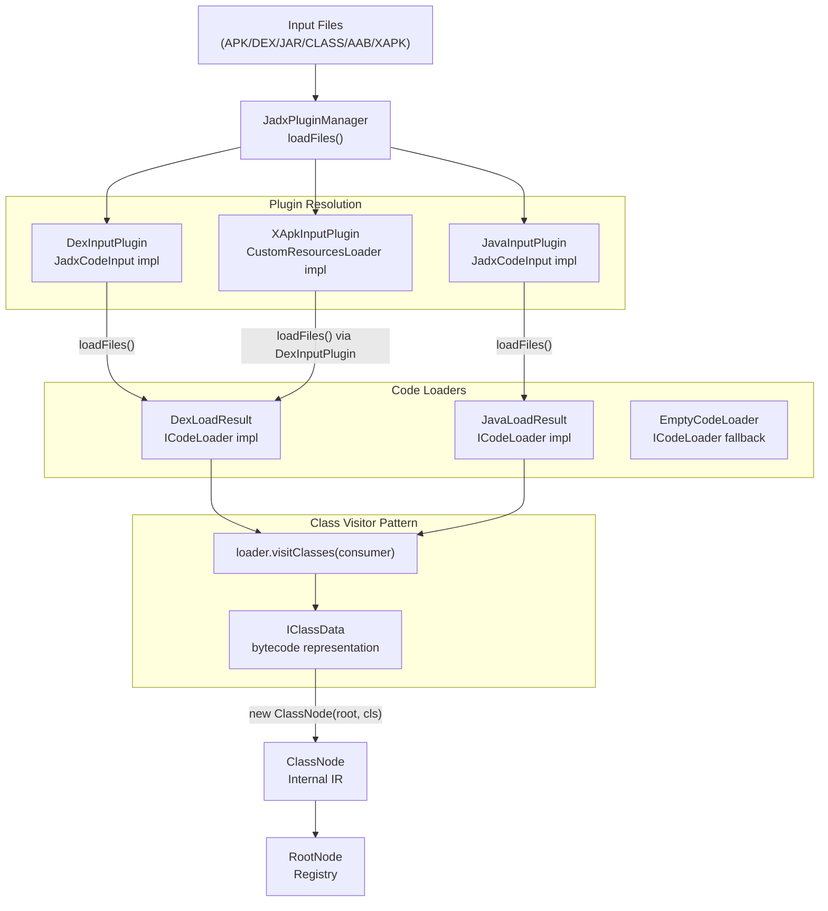
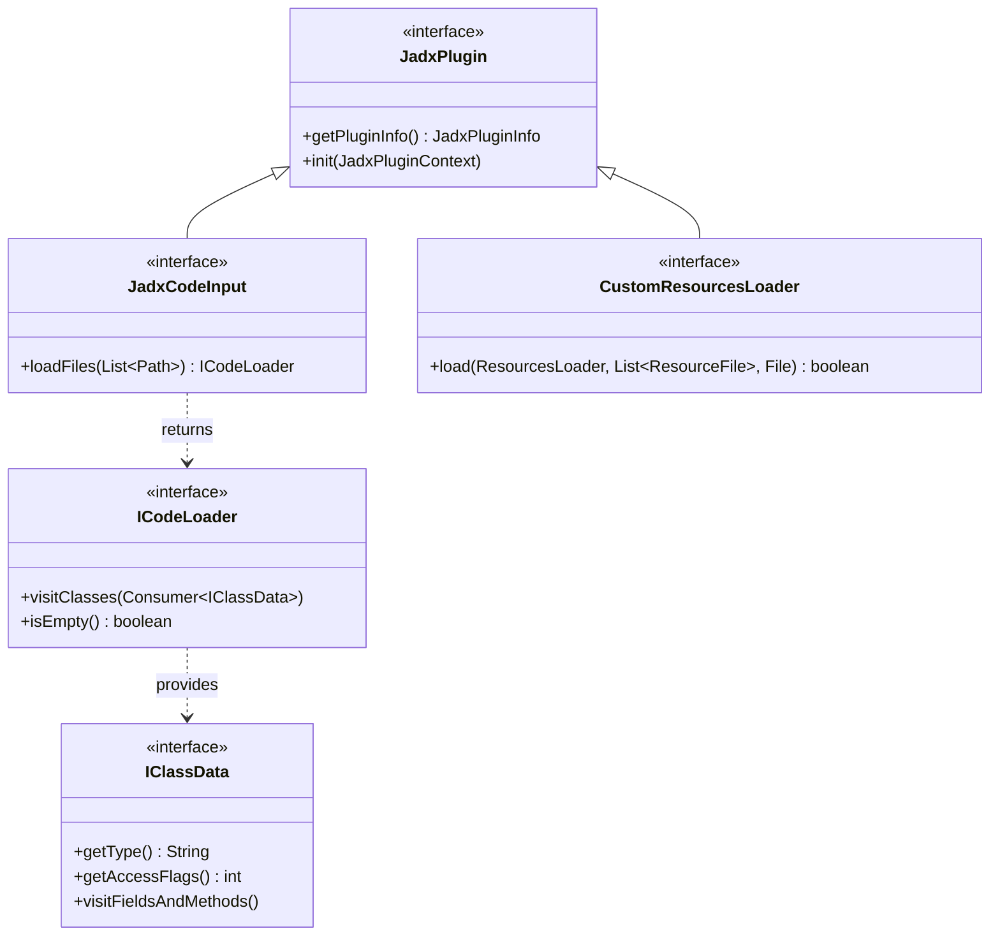

# Input Plugins

Relevant source files

The following files were used as context for generating this wiki page:

- [.run/jadx-gui.run.xml](https://github.com/skylot/jadx/blob/HEAD/.run/jadx-gui.run.xml)
- [jadx-core/src/main/java/jadx/api/JadxArgsValidator.java](https://github.com/skylot/jadx/blob/HEAD/jadx-core/src/main/java/jadx/api/JadxArgsValidator.java)
- [jadx-core/src/main/java/jadx/api/plugins/options/impl/BasePluginOptionsBuilder.java](https://github.com/skylot/jadx/blob/HEAD/jadx-core/src/main/java/jadx/api/plugins/options/impl/BasePluginOptionsBuilder.java)
- [jadx-core/src/main/java/jadx/core/dex/instructions/java/JsrNode.java](https://github.com/skylot/jadx/blob/HEAD/jadx-core/src/main/java/jadx/core/dex/instructions/java/JsrNode.java)
- [jadx-core/src/main/java/jadx/core/dex/visitors/ProcessInstructionsVisitor.java](https://github.com/skylot/jadx/blob/HEAD/jadx-core/src/main/java/jadx/core/dex/visitors/ProcessInstructionsVisitor.java)
- [jadx-core/src/main/java/jadx/core/dex/visitors/blocks/ResolveJavaJSR.java](https://github.com/skylot/jadx/blob/HEAD/jadx-core/src/main/java/jadx/core/dex/visitors/blocks/ResolveJavaJSR.java)
- [jadx-core/src/main/java/jadx/core/plugins/JadxPluginsData.java](https://github.com/skylot/jadx/blob/HEAD/jadx-core/src/main/java/jadx/core/plugins/JadxPluginsData.java)
- [jadx-core/src/test/java/jadx/tests/integration/java8/TestLambdaResugar.java](https://github.com/skylot/jadx/blob/HEAD/jadx-core/src/test/java/jadx/tests/integration/java8/TestLambdaResugar.java)
- [jadx-core/src/test/java/jadx/tests/integration/others/TestStringConcatJava11.java](https://github.com/skylot/jadx/blob/HEAD/jadx-core/src/test/java/jadx/tests/integration/others/TestStringConcatJava11.java)
- [jadx-core/src/test/resources/test-samples/hello.dex](https://github.com/skylot/jadx/blob/HEAD/jadx-core/src/test/resources/test-samples/hello.dex)
- [jadx-plugins/jadx-apks-input/build.gradle.kts](https://github.com/skylot/jadx/blob/HEAD/jadx-plugins/jadx-apks-input/build.gradle.kts)
- [jadx-plugins/jadx-apks-input/src/main/java/jadx/plugins/input/apks/ApksCustomCodeInput.kt](https://github.com/skylot/jadx/blob/HEAD/jadx-plugins/jadx-apks-input/src/main/java/jadx/plugins/input/apks/ApksCustomCodeInput.kt)
- [jadx-plugins/jadx-apks-input/src/main/java/jadx/plugins/input/apks/ApksCustomResourcesLoader.kt](https://github.com/skylot/jadx/blob/HEAD/jadx-plugins/jadx-apks-input/src/main/java/jadx/plugins/input/apks/ApksCustomResourcesLoader.kt)
- [jadx-plugins/jadx-apks-input/src/main/java/jadx/plugins/input/apks/ApksInputPlugin.kt](https://github.com/skylot/jadx/blob/HEAD/jadx-plugins/jadx-apks-input/src/main/java/jadx/plugins/input/apks/ApksInputPlugin.kt)
- [jadx-plugins/jadx-apks-input/src/main/resources/META-INF/services/jadx.api.plugins.JadxPlugin](https://github.com/skylot/jadx/blob/HEAD/jadx-plugins/jadx-apks-input/src/main/resources/META-INF/services/jadx.api.plugins.JadxPlugin)
- [jadx-plugins/jadx-dex-input/src/main/java/jadx/plugins/input/dex/DexFileLoader.java](https://github.com/skylot/jadx/blob/HEAD/jadx-plugins/jadx-dex-input/src/main/java/jadx/plugins/input/dex/DexFileLoader.java)
- [jadx-plugins/jadx-dex-input/src/main/java/jadx/plugins/input/dex/DexInputPlugin.java](https://github.com/skylot/jadx/blob/HEAD/jadx-plugins/jadx-dex-input/src/main/java/jadx/plugins/input/dex/DexInputPlugin.java)
- [jadx-plugins/jadx-dex-input/src/main/java/jadx/plugins/input/dex/DexLoadResult.java](https://github.com/skylot/jadx/blob/HEAD/jadx-plugins/jadx-dex-input/src/main/java/jadx/plugins/input/dex/DexLoadResult.java)
- [jadx-plugins/jadx-dex-input/src/main/java/jadx/plugins/input/dex/DexReader.java](https://github.com/skylot/jadx/blob/HEAD/jadx-plugins/jadx-dex-input/src/main/java/jadx/plugins/input/dex/DexReader.java)
- [jadx-plugins/jadx-dex-input/src/main/java/jadx/plugins/input/dex/sections/DexConsts.java](https://github.com/skylot/jadx/blob/HEAD/jadx-plugins/jadx-dex-input/src/main/java/jadx/plugins/input/dex/sections/DexConsts.java)
- [jadx-plugins/jadx-dex-input/src/main/java/jadx/plugins/input/dex/sections/DexHeaderV41.java](https://github.com/skylot/jadx/blob/HEAD/jadx-plugins/jadx-dex-input/src/main/java/jadx/plugins/input/dex/sections/DexHeaderV41.java)
- [jadx-plugins/jadx-dex-input/src/main/java/jadx/plugins/input/dex/utils/DataReader.java](https://github.com/skylot/jadx/blob/HEAD/jadx-plugins/jadx-dex-input/src/main/java/jadx/plugins/input/dex/utils/DataReader.java)
- [jadx-plugins/jadx-dex-input/src/main/java/jadx/plugins/input/dex/utils/DexCheckSum.java](https://github.com/skylot/jadx/blob/HEAD/jadx-plugins/jadx-dex-input/src/main/java/jadx/plugins/input/dex/utils/DexCheckSum.java)
- [jadx-plugins/jadx-dex-input/src/main/java/jadx/plugins/input/dex/utils/IDexData.java](https://github.com/skylot/jadx/blob/HEAD/jadx-plugins/jadx-dex-input/src/main/java/jadx/plugins/input/dex/utils/IDexData.java)
- [jadx-plugins/jadx-dex-input/src/main/java/jadx/plugins/input/dex/utils/SimpleDexData.java](https://github.com/skylot/jadx/blob/HEAD/jadx-plugins/jadx-dex-input/src/main/java/jadx/plugins/input/dex/utils/SimpleDexData.java)
- [jadx-plugins/jadx-dex-input/src/test/java/jadx/plugins/input/dex/DexInputPluginTest.java](https://github.com/skylot/jadx/blob/HEAD/jadx-plugins/jadx-dex-input/src/test/java/jadx/plugins/input/dex/DexInputPluginTest.java)
- [jadx-plugins/jadx-java-convert/src/main/java/jadx/plugins/input/javaconvert/D8Converter.java](https://github.com/skylot/jadx/blob/HEAD/jadx-plugins/jadx-java-convert/src/main/java/jadx/plugins/input/javaconvert/D8Converter.java)
- [jadx-plugins/jadx-java-convert/src/main/java/jadx/plugins/input/javaconvert/JavaConvertLoader.java](https://github.com/skylot/jadx/blob/HEAD/jadx-plugins/jadx-java-convert/src/main/java/jadx/plugins/input/javaconvert/JavaConvertLoader.java)
- [jadx-plugins/jadx-java-input/src/main/java/jadx/plugins/input/java/JavaInputLoader.java](https://github.com/skylot/jadx/blob/HEAD/jadx-plugins/jadx-java-input/src/main/java/jadx/plugins/input/java/JavaInputLoader.java)
- [jadx-plugins/jadx-java-input/src/main/java/jadx/plugins/input/java/JavaInputPlugin.java](https://github.com/skylot/jadx/blob/HEAD/jadx-plugins/jadx-java-input/src/main/java/jadx/plugins/input/java/JavaInputPlugin.java)
- [jadx-plugins/jadx-java-input/src/main/java/jadx/plugins/input/java/JavaLoadResult.java](https://github.com/skylot/jadx/blob/HEAD/jadx-plugins/jadx-java-input/src/main/java/jadx/plugins/input/java/JavaLoadResult.java)
- [jadx-plugins/jadx-java-input/src/test/java/jadx/plugins/input/java/CustomLoadTest.java](https://github.com/skylot/jadx/blob/HEAD/jadx-plugins/jadx-java-input/src/test/java/jadx/plugins/input/java/CustomLoadTest.java)
- [jadx-plugins/jadx-java-input/src/test/resources/samples/HelloWorld$HelloInner.class](https://github.com/skylot/jadx/blob/HEAD/jadx-plugins/jadx-java-input/src/test/resources/samples/HelloWorld$HelloInner.class)
- [jadx-plugins/jadx-java-input/src/test/resources/samples/HelloWorld.class](https://github.com/skylot/jadx/blob/HEAD/jadx-plugins/jadx-java-input/src/test/resources/samples/HelloWorld.class)
- [jadx-plugins/jadx-raung-input/src/main/java/jadx/plugins/input/raung/RaungInputPlugin.java](https://github.com/skylot/jadx/blob/HEAD/jadx-plugins/jadx-raung-input/src/main/java/jadx/plugins/input/raung/RaungInputPlugin.java)
- [jadx-plugins/jadx-smali-input/src/main/java/jadx/plugins/input/smali/SmaliConvert.java](https://github.com/skylot/jadx/blob/HEAD/jadx-plugins/jadx-smali-input/src/main/java/jadx/plugins/input/smali/SmaliConvert.java)
- [jadx-plugins/jadx-smali-input/src/main/java/jadx/plugins/input/smali/SmaliInputOptions.java](https://github.com/skylot/jadx/blob/HEAD/jadx-plugins/jadx-smali-input/src/main/java/jadx/plugins/input/smali/SmaliInputOptions.java)
- [jadx-plugins/jadx-smali-input/src/main/java/jadx/plugins/input/smali/SmaliInputPlugin.java](https://github.com/skylot/jadx/blob/HEAD/jadx-plugins/jadx-smali-input/src/main/java/jadx/plugins/input/smali/SmaliInputPlugin.java)
- [jadx-plugins/jadx-smali-input/src/main/java/jadx/plugins/input/smali/SmaliUtils.java](https://github.com/skylot/jadx/blob/HEAD/jadx-plugins/jadx-smali-input/src/main/java/jadx/plugins/input/smali/SmaliUtils.java)
- [jadx-plugins/jadx-xapk-input/src/main/java/jadx/plugins/input/xapk/XApkCustomInput.java](https://github.com/skylot/jadx/blob/HEAD/jadx-plugins/jadx-xapk-input/src/main/java/jadx/plugins/input/xapk/XApkCustomInput.java)
- [jadx-plugins/jadx-xapk-input/src/main/java/jadx/plugins/input/xapk/XApkInputPlugin.java](https://github.com/skylot/jadx/blob/HEAD/jadx-plugins/jadx-xapk-input/src/main/java/jadx/plugins/input/xapk/XApkInputPlugin.java)
- [jadx-plugins/jadx-xapk-input/src/main/java/jadx/plugins/input/xapk/XApkLoader.java](https://github.com/skylot/jadx/blob/HEAD/jadx-plugins/jadx-xapk-input/src/main/java/jadx/plugins/input/xapk/XApkLoader.java)
- [settings.gradle.kts](https://github.com/skylot/jadx/blob/HEAD/settings.gradle.kts)

**Purpose**: Input plugins enable JADX to load and parse different bytecode and source formats (DEX, Java bytecode, Smali, AAB, XAPK, etc.) into the internal `ClassNode` representation used by the decompilation pipeline. This document describes the input plugin architecture, available plugins, and the loading process.

For information about processing plugins that transform code after loading, see [6.3 Processing Plugins](32_6.3-processing-plugins.md). For the overall plugin system architecture, see [6.1 Plugin Architecture and Interfaces](30_6.1-plugin-architecture-and-interfaces.md).

---

## Architecture Overview

Input plugins serve as format adapters that convert various file types into JADX's internal class representation. The plugin system uses a discovery and delegation pattern where `JadxPluginManager` locates plugins, and each plugin provides `ICodeLoader` instances that stream class data into `ClassNode` objects.

**Input Plugin Loading Flow**

Sources: [jadx-plugins/jadx-dex-input/src/main/java/jadx/plugins/input/dex/DexInputPlugin.java:19-35](https://github.com/skylot/jadx/blob/HEAD/jadx-plugins/jadx-dex-input/src/main/java/jadx/plugins/input/dex/DexInputPlugin.java#L19-L35), [jadx-plugins/jadx-xapk-input/src/main/java/jadx/plugins/input/xapk/XApkCustomInput.java:31-44](https://github.com/skylot/jadx/blob/HEAD/jadx-plugins/jadx-xapk-input/src/main/java/jadx/plugins/input/xapk/XApkCustomInput.java#L31-L44), [jadx-plugins/jadx-dex-input/src/main/java/jadx/plugins/input/dex/DexLoadResult.java:1-10](https://github.com/skylot/jadx/blob/HEAD/jadx-plugins/jadx-dex-input/src/main/java/jadx/plugins/input/dex/DexLoadResult.java#L1-L10)

---

## Core Plugin Interfaces

Input plugins implement a three-tier interface hierarchy that separates plugin discovery, file loading, and class visiting concerns.

**Plugin Interface Hierarchy**

Sources: [jadx-plugins/jadx-dex-input/src/main/java/jadx/plugins/input/dex/DexInputPlugin.java:19-35](https://github.com/skylot/jadx/blob/HEAD/jadx-plugins/jadx-dex-input/src/main/java/jadx/plugins/input/dex/DexInputPlugin.java#L19-L35), [jadx-plugins/jadx-xapk-input/src/main/java/jadx/plugins/input/xapk/XApkCustomInput.java:21-28](https://github.com/skylot/jadx/blob/HEAD/jadx-plugins/jadx-xapk-input/src/main/java/jadx/plugins/input/xapk/XApkCustomInput.java#L21-L28)

---

## Available Input Plugins

JADX includes several built-in input plugins for different Android and Java formats. Each plugin is a separate Gradle module defined in the root settings [settings.gradle.kts:21-33](https://github.com/skylot/jadx/blob/HEAD/settings.gradle.kts#L21-L33).

| Plugin Module | Supported Formats | Key Dependencies | Purpose |
|---------------|-------------------|------------------|---------|
| **jadx-dex-input** | `.dex`, `.apk` | `jadx-zip` | Primary Android bytecode format |
| **jadx-java-input** | `.class`, `.jar` | ASM library | Java bytecode loading |
| **jadx-java-convert** | `.jar`, `.class`, `.aar` | D8/DX | Converts Java bytecode to DEX for uniform processing |
| **jadx-smali-input** | `.smali` | `com.android.tools.smali:smali` | Human-readable DEX assembly |
| **jadx-xapk-input** | `.xapk` | `gson` | APK Pure bundle format |
| **jadx-raung-input** | `.raung` | Raung parser | Alternative DEX assembly format |
| **jadx-aab-input** | `.aab` | `aapt2-proto` | Android App Bundle format |
| **jadx-apkm-input** | `.apkm` | `jadx-zip` | APKMirror bundle format |
| **jadx-apks-input** | `.apks` | `jadx-zip` | Split APK bundle format |

Sources: [settings.gradle.kts:21-33](https://github.com/skylot/jadx/blob/HEAD/settings.gradle.kts#L21-L33), [jadx-plugins/jadx-dex-input/src/main/java/jadx/plugins/input/dex/DexInputPlugin.java:19-25](https://github.com/skylot/jadx/blob/HEAD/jadx-plugins/jadx-dex-input/src/main/java/jadx/plugins/input/dex/DexInputPlugin.java#L19-L25), [jadx-plugins/jadx-java-input/src/main/java/jadx/plugins/input/java/JavaInputPlugin.java:19-25](https://github.com/skylot/jadx/blob/HEAD/jadx-plugins/jadx-java-input/src/main/java/jadx/plugins/input/java/JavaInputPlugin.java#L19-L25), [jadx-plugins/jadx-java-convert/src/main/java/jadx/plugins/input/javaconvert/JavaConvertLoader.java:25-44](https://github.com/skylot/jadx/blob/HEAD/jadx-plugins/jadx-java-convert/src/main/java/jadx/plugins/input/javaconvert/JavaConvertLoader.java#L25-L44), [jadx-plugins/jadx-smali-input/src/main/java/jadx/plugins/input/smali/SmaliInputPlugin.java:16-25](https://github.com/skylot/jadx/blob/HEAD/jadx-plugins/jadx-smali-input/src/main/java/jadx/plugins/input/smali/SmaliInputPlugin.java#L16-L25)

### DEX Input Plugin

The primary input plugin for Android applications. It uses `DexFileLoader` to scan paths and extract DEX content.

- **DEX v41 Support**: Handles sub-DEX structures within a single file using `DexHeaderV41.readSubDexOffsets` [jadx-plugins/jadx-dex-input/src/main/java/jadx/plugins/input/dex/DexFileLoader.java:103-109](https://github.com/skylot/jadx/blob/HEAD/jadx-plugins/jadx-dex-input/src/main/java/jadx/plugins/input/dex/DexFileLoader.java#L103-L109).
- **Checksum Verification**: Optionally verifies Adler32 checksums via `DexCheckSum.verify` [jadx-plugins/jadx-dex-input/src/main/java/jadx/plugins/input/dex/utils/DexCheckSum.java:9-25](https://github.com/skylot/jadx/blob/HEAD/jadx-plugins/jadx-dex-input/src/main/java/jadx/plugins/input/dex/utils/DexCheckSum.java#L9-L25).
- **Zip Integration**: Uses `ZipReader` to traverse APKs and extract `classes.dex` entries [jadx-plugins/jadx-dex-input/src/main/java/jadx/plugins/input/dex/DexFileLoader.java:130-155](https://github.com/skylot/jadx/blob/HEAD/jadx-plugins/jadx-dex-input/src/main/java/jadx/plugins/input/dex/DexFileLoader.java#L130-L155).

Sources: [jadx-plugins/jadx-dex-input/src/main/java/jadx/plugins/input/dex/DexFileLoader.java:30-56](https://github.com/skylot/jadx/blob/HEAD/jadx-plugins/jadx-dex-input/src/main/java/jadx/plugins/input/dex/DexFileLoader.java#L30-L56), [jadx-plugins/jadx-dex-input/src/main/java/jadx/plugins/input/dex/DexInputPlugin.java:41-47](https://github.com/skylot/jadx/blob/HEAD/jadx-plugins/jadx-dex-input/src/main/java/jadx/plugins/input/dex/DexInputPlugin.java#L41-L47)

### Java Convert Plugin

This plugin bridges the gap between Java bytecode and the DEX-centric JADX core by converting `.class` and `.jar` files into DEX using either D8 or DX.

- **Multi-format Support**: Processes JARs, AARs, and individual `.class` files [jadx-plugins/jadx-java-convert/src/main/java/jadx/plugins/input/javaconvert/JavaConvertLoader.java:38-44](https://github.com/skylot/jadx/blob/HEAD/jadx-plugins/jadx-java-convert/src/main/java/jadx/plugins/input/javaconvert/JavaConvertLoader.java#L38-L44).
- **D8/DX Integration**: Can use `D8Converter` or `DxConverter` based on user options [jadx-plugins/jadx-java-convert/src/main/java/jadx/plugins/input/javaconvert/JavaConvertLoader.java:187-215](https://github.com/skylot/jadx/blob/HEAD/jadx-plugins/jadx-java-convert/src/main/java/jadx/plugins/input/javaconvert/JavaConvertLoader.java#L187-L215).
- **Repackaging**: Automatically repacks Spring Boot jars or jars with duplicated classes (e.g., `META-INF/versions/`) to ensure clean conversion [jadx-plugins/jadx-java-convert/src/main/java/jadx/plugins/input/javaconvert/JavaConvertLoader.java:117-175](https://github.com/skylot/jadx/blob/HEAD/jadx-plugins/jadx-java-convert/src/main/java/jadx/plugins/input/javaconvert/JavaConvertLoader.java#L117-L175).

Sources: [jadx-plugins/jadx-java-convert/src/main/java/jadx/plugins/input/javaconvert/JavaConvertLoader.java:25-185](https://github.com/skylot/jadx/blob/HEAD/jadx-plugins/jadx-java-convert/src/main/java/jadx/plugins/input/javaconvert/JavaConvertLoader.java#L25-L185), [jadx-plugins/jadx-java-convert/src/main/java/jadx/plugins/input/javaconvert/D8Converter.java:16-32](https://github.com/skylot/jadx/blob/HEAD/jadx-plugins/jadx-java-convert/src/main/java/jadx/plugins/input/javaconvert/D8Converter.java#L16-L32)

### Smali Input Plugin

The Smali plugin allows loading `.smali` source files by compiling them into DEX in-memory before processing.

- **Parallel Compilation**: Uses an `ExecutorService` with a fixed thread pool to assemble multiple smali files concurrently [jadx-plugins/jadx-smali-input/src/main/java/jadx/plugins/input/smali/SmaliConvert.java:58-69](https://github.com/skylot/jadx/blob/HEAD/jadx-plugins/jadx-smali-input/src/main/java/jadx/plugins/input/smali/SmaliConvert.java#L58-L69).
- **Assembly**: Utilizes `SmaliUtils.assemble` to transform smali source into DEX bytecode bytes [jadx-plugins/jadx-smali-input/src/main/java/jadx/plugins/input/smali/SmaliConvert.java:75-83](https://github.com/skylot/jadx/blob/HEAD/jadx-plugins/jadx-smali-input/src/main/java/jadx/plugins/input/smali/SmaliConvert.java#L75-L83).
- **Data Transfer**: Results are stored as `SimpleDexData` which contains the generated DEX content and the original file name [jadx-plugins/jadx-smali-input/src/main/java/jadx/plugins/input/smali/SmaliConvert.java:79](https://github.com/skylot/jadx/blob/HEAD/jadx-plugins/jadx-smali-input/src/main/java/jadx/plugins/input/smali/SmaliConvert.java#L79).

Sources: [jadx-plugins/jadx-smali-input/src/main/java/jadx/plugins/input/smali/SmaliConvert.java:23-95](https://github.com/skylot/jadx/blob/HEAD/jadx-plugins/jadx-smali-input/src/main/java/jadx/plugins/input/smali/SmaliConvert.java#L23-L95), [jadx-plugins/jadx-smali-input/src/main/java/jadx/plugins/input/smali/SmaliInputPlugin.java:16-25](https://github.com/skylot/jadx/blob/HEAD/jadx-plugins/jadx-smali-input/src/main/java/jadx/plugins/input/smali/SmaliInputPlugin.java#L16-L25)

### XAPK Input Plugin

Handles the XAPK format by unpacking it into a temporary directory and delegating code loading to the DEX plugin.

- **Manifest Parsing**: Reads `manifest.json` using GSON to identify split APKs [jadx-plugins/jadx-xapk-input/src/main/java/jadx/plugins/input/xapk/XApkLoader.java:57-65](https://github.com/skylot/jadx/blob/HEAD/jadx-plugins/jadx-xapk-input/src/main/java/jadx/plugins/input/xapk/XApkLoader.java#L57-L65).
- **Delegation**: Once split APKs are identified, it calls `DexInputPlugin.loadFiles(apks)` to handle the actual bytecode loading [jadx-plugins/jadx-xapk-input/src/main/java/jadx/plugins/input/xapk/XApkCustomInput.java:42-43](https://github.com/skylot/jadx/blob/HEAD/jadx-plugins/jadx-xapk-input/src/main/java/jadx/plugins/input/xapk/XApkCustomInput.java#L42-L43).
- **Resource Integration**: Implements `CustomResourcesLoader` to inject split APK resources into the `ResourcesLoader` pipeline [jadx-plugins/jadx-xapk-input/src/main/java/jadx/plugins/input/xapk/XApkCustomInput.java:47-69](https://github.com/skylot/jadx/blob/HEAD/jadx-plugins/jadx-xapk-input/src/main/java/jadx/plugins/input/xapk/XApkCustomInput.java#L47-L69).

Sources: [jadx-plugins/jadx-xapk-input/src/main/java/jadx/plugins/input/xapk/XApkLoader.java:42-71](https://github.com/skylot/jadx/blob/HEAD/jadx-plugins/jadx-xapk-input/src/main/java/jadx/plugins/input/xapk/XApkLoader.java#L42-L71), [jadx-plugins/jadx-xapk-input/src/main/java/jadx/plugins/input/xapk/XApkCustomInput.java:21-44](https://github.com/skylot/jadx/blob/HEAD/jadx-plugins/jadx-xapk-input/src/main/java/jadx/plugins/input/xapk/XApkCustomInput.java#L21-L44)

---

## Plugin Loading and Class Node Creation

The transition from raw files to the `ClassNode` structure involves `JadxDecompiler` orchestrating the plugins.

**Code Entity Mapping**

Sources: [jadx-plugins/jadx-dex-input/src/main/java/jadx/plugins/input/dex/DexFileLoader.java:48-56](https://github.com/skylot/jadx/blob/HEAD/jadx-plugins/jadx-dex-input/src/main/java/jadx/plugins/input/dex/DexFileLoader.java#L48-L56), [jadx-plugins/jadx-dex-input/src/main/java/jadx/plugins/input/dex/DexInputPlugin.java:41-47](https://github.com/skylot/jadx/blob/HEAD/jadx-plugins/jadx-dex-input/src/main/java/jadx/plugins/input/dex/DexInputPlugin.java#L41-L47), [jadx-plugins/jadx-java-input/src/main/java/jadx/plugins/input/java/JavaInputLoader.java:1-50](https://github.com/skylot/jadx/blob/HEAD/jadx-plugins/jadx-java-input/src/main/java/jadx/plugins/input/java/JavaInputLoader.java#L1-L50)

### Loading Sequence

1. **Validation**: `JadxArgsValidator.checkInputFiles` ensures input files exist or custom loaders are provided [jadx-core/src/main/java/jadx/api/JadxArgsValidator.java:26-34](https://github.com/skylot/jadx/blob/HEAD/jadx-core/src/main/java/jadx/api/JadxArgsValidator.java#L26-L34).
2. **Plugin Initialization**: `DexInputPlugin.init` registers options and the code input provider [jadx-plugins/jadx-dex-input/src/main/java/jadx/plugins/input/dex/DexInputPlugin.java:31-35](https://github.com/skylot/jadx/blob/HEAD/jadx-plugins/jadx-dex-input/src/main/java/jadx/plugins/input/dex/DexInputPlugin.java#L31-L35).
3. **File Collection**: `DexFileLoader.collectDexFiles` filters and loads DEX readers from the provided paths [jadx-plugins/jadx-dex-input/src/main/java/jadx/plugins/input/dex/DexFileLoader.java:48-56](https://github.com/skylot/jadx/blob/HEAD/jadx-plugins/jadx-dex-input/src/main/java/jadx/plugins/input/dex/DexFileLoader.java#L48-L56).
4. **Result Wrapping**: The readers are wrapped in a `DexLoadResult` (implementing `ICodeLoader`) [jadx-plugins/jadx-dex-input/src/main/java/jadx/plugins/input/dex/DexInputPlugin.java:46](https://github.com/skylot/jadx/blob/HEAD/jadx-plugins/jadx-dex-input/src/main/java/jadx/plugins/input/dex/DexInputPlugin.java#L46).
5. **Class Iteration**: The core engine calls `visitClasses` on the loader to populate the `RootNode` with `ClassNode` objects. For DEX, this is handled in `DexReader.visitClasses` [jadx-plugins/jadx-dex-input/src/main/java/jadx/plugins/input/dex/DexReader.java:25-38](https://github.com/skylot/jadx/blob/HEAD/jadx-plugins/jadx-dex-input/src/main/java/jadx/plugins/input/dex/DexReader.java#L25-L38).

Sources: [jadx-plugins/jadx-dex-input/src/main/java/jadx/plugins/input/dex/DexInputPlugin.java:19-69](https://github.com/skylot/jadx/blob/HEAD/jadx-plugins/jadx-dex-input/src/main/java/jadx/plugins/input/dex/DexInputPlugin.java#L19-L69), [jadx-core/src/main/java/jadx/api/JadxArgsValidator.java:12-34](https://github.com/skylot/jadx/blob/HEAD/jadx-core/src/main/java/jadx/api/JadxArgsValidator.java#L12-L34), [jadx-plugins/jadx-dex-input/src/main/java/jadx/plugins/input/dex/DexReader.java:25-38](https://github.com/skylot/jadx/blob/HEAD/jadx-plugins/jadx-dex-input/src/main/java/jadx/plugins/input/dex/DexReader.java#L25-L38)