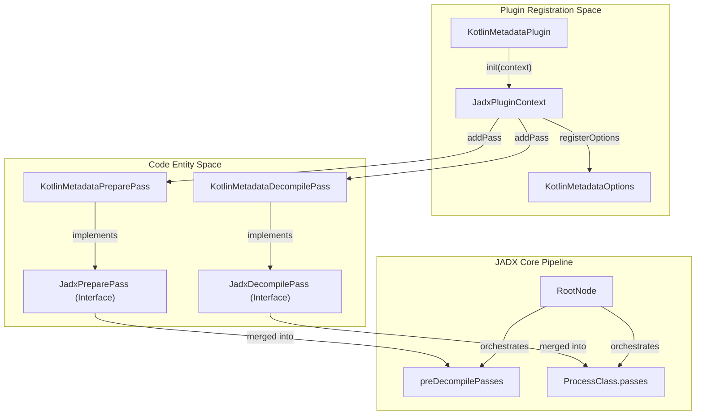
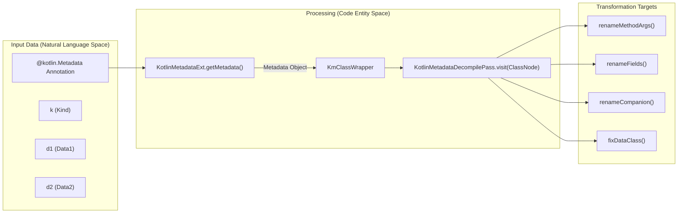
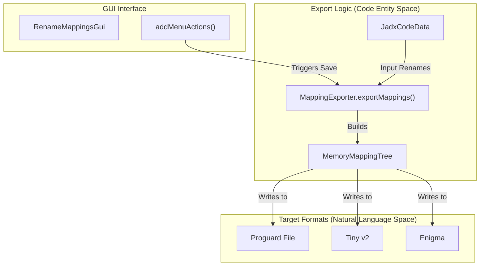

# Processing Plugins

Relevant source files

The following files were used as context for generating this wiki page:

- [jadx-core/src/main/java/jadx/api/impl/passes/DecompilePassWrapper.java](https://github.com/skylot/jadx/blob/HEAD/jadx-core/src/main/java/jadx/api/impl/passes/DecompilePassWrapper.java)
- [jadx-core/src/main/java/jadx/api/plugins/options/impl/BaseOptionsParser.java](https://github.com/skylot/jadx/blob/HEAD/jadx-core/src/main/java/jadx/api/plugins/options/impl/BaseOptionsParser.java)
- [jadx-core/src/main/java/jadx/api/plugins/options/impl/OptionBuilder.java](https://github.com/skylot/jadx/blob/HEAD/jadx-core/src/main/java/jadx/api/plugins/options/impl/OptionBuilder.java)
- [jadx-core/src/main/java/jadx/core/dex/visitors/ProcessAnonymous.java](https://github.com/skylot/jadx/blob/HEAD/jadx-core/src/main/java/jadx/core/dex/visitors/ProcessAnonymous.java)
- [jadx-core/src/main/java/jadx/core/utils/DebugChecksPass.java](https://github.com/skylot/jadx/blob/HEAD/jadx-core/src/main/java/jadx/core/utils/DebugChecksPass.java)
- [jadx-gui/src/main/java/jadx/gui/plugins/mappings/JInputMapping.java](https://github.com/skylot/jadx/blob/HEAD/jadx-gui/src/main/java/jadx/gui/plugins/mappings/JInputMapping.java)
- [jadx-gui/src/main/java/jadx/gui/plugins/mappings/RenameMappingsGui.java](https://github.com/skylot/jadx/blob/HEAD/jadx-gui/src/main/java/jadx/gui/plugins/mappings/RenameMappingsGui.java)
- [jadx-plugins/jadx-dex-input/src/main/java/jadx/plugins/input/dex/DexInputOptions.java](https://github.com/skylot/jadx/blob/HEAD/jadx-plugins/jadx-dex-input/src/main/java/jadx/plugins/input/dex/DexInputOptions.java)
- [jadx-plugins/jadx-java-convert/src/main/java/jadx/plugins/input/javaconvert/JavaConvertOptions.java](https://github.com/skylot/jadx/blob/HEAD/jadx-plugins/jadx-java-convert/src/main/java/jadx/plugins/input/javaconvert/JavaConvertOptions.java)
- [jadx-plugins/jadx-java-convert/src/main/java/jadx/plugins/input/javaconvert/JavaConvertPlugin.java](https://github.com/skylot/jadx/blob/HEAD/jadx-plugins/jadx-java-convert/src/main/java/jadx/plugins/input/javaconvert/JavaConvertPlugin.java)
- [jadx-plugins/jadx-kotlin-metadata/src/main/kotlin/jadx/plugins/kotlin/metadata/KotlinMetadataOptions.kt](https://github.com/skylot/jadx/blob/HEAD/jadx-plugins/jadx-kotlin-metadata/src/main/kotlin/jadx/plugins/kotlin/metadata/KotlinMetadataOptions.kt)
- [jadx-plugins/jadx-kotlin-metadata/src/main/kotlin/jadx/plugins/kotlin/metadata/KotlinMetadataPlugin.kt](https://github.com/skylot/jadx/blob/HEAD/jadx-plugins/jadx-kotlin-metadata/src/main/kotlin/jadx/plugins/kotlin/metadata/KotlinMetadataPlugin.kt)
- [jadx-plugins/jadx-kotlin-metadata/src/main/kotlin/jadx/plugins/kotlin/metadata/pass/KotlinMetadataDecompilePass.kt](https://github.com/skylot/jadx/blob/HEAD/jadx-plugins/jadx-kotlin-metadata/src/main/kotlin/jadx/plugins/kotlin/metadata/pass/KotlinMetadataDecompilePass.kt)
- [jadx-plugins/jadx-kotlin-metadata/src/main/kotlin/jadx/plugins/kotlin/metadata/pass/KotlinMetadataPreparePass.kt](https://github.com/skylot/jadx/blob/HEAD/jadx-plugins/jadx-kotlin-metadata/src/main/kotlin/jadx/plugins/kotlin/metadata/pass/KotlinMetadataPreparePass.kt)
- [jadx-plugins/jadx-kotlin-metadata/src/main/kotlin/jadx/plugins/kotlin/metadata/utils/KmClassWrapper.kt](https://github.com/skylot/jadx/blob/HEAD/jadx-plugins/jadx-kotlin-metadata/src/main/kotlin/jadx/plugins/kotlin/metadata/utils/KmClassWrapper.kt)
- [jadx-plugins/jadx-kotlin-metadata/src/main/kotlin/jadx/plugins/kotlin/metadata/utils/KmExt.kt](https://github.com/skylot/jadx/blob/HEAD/jadx-plugins/jadx-kotlin-metadata/src/main/kotlin/jadx/plugins/kotlin/metadata/utils/KmExt.kt)
- [jadx-plugins/jadx-kotlin-metadata/src/main/kotlin/jadx/plugins/kotlin/metadata/utils/KotlinMetadataExt.kt](https://github.com/skylot/jadx/blob/HEAD/jadx-plugins/jadx-kotlin-metadata/src/main/kotlin/jadx/plugins/kotlin/metadata/utils/KotlinMetadataExt.kt)
- [jadx-plugins/jadx-kotlin-metadata/src/main/kotlin/jadx/plugins/kotlin/metadata/utils/KotlinMetadataUtils.kt](https://github.com/skylot/jadx/blob/HEAD/jadx-plugins/jadx-kotlin-metadata/src/main/kotlin/jadx/plugins/kotlin/metadata/utils/KotlinMetadataUtils.kt)
- [jadx-plugins/jadx-kotlin-metadata/src/main/kotlin/jadx/plugins/kotlin/metadata/utils/KotlinUtils.kt](https://github.com/skylot/jadx/blob/HEAD/jadx-plugins/jadx-kotlin-metadata/src/main/kotlin/jadx/plugins/kotlin/metadata/utils/KotlinUtils.kt)
- [jadx-plugins/jadx-kotlin-metadata/src/main/kotlin/jadx/plugins/kotlin/metadata/utils/LogExt.kt](https://github.com/skylot/jadx/blob/HEAD/jadx-plugins/jadx-kotlin-metadata/src/main/kotlin/jadx/plugins/kotlin/metadata/utils/LogExt.kt)
- [jadx-plugins/jadx-kotlin-metadata/src/main/kotlin/jadx/plugins/kotlin/metadata/utils/ToStringParser.kt](https://github.com/skylot/jadx/blob/HEAD/jadx-plugins/jadx-kotlin-metadata/src/main/kotlin/jadx/plugins/kotlin/metadata/utils/ToStringParser.kt)
- [jadx-plugins/jadx-kotlin-metadata/src/test/kotlin/TestJavaParser.kt](https://github.com/skylot/jadx/blob/HEAD/jadx-plugins/jadx-kotlin-metadata/src/test/kotlin/TestJavaParser.kt)
- [jadx-plugins/jadx-kotlin-metadata/src/test/kotlin/TestKotlinMetadata.kt](https://github.com/skylot/jadx/blob/HEAD/jadx-plugins/jadx-kotlin-metadata/src/test/kotlin/TestKotlinMetadata.kt)
- [jadx-plugins/jadx-kotlin-metadata/src/test/resources/samples/MainKt.class](https://github.com/skylot/jadx/blob/HEAD/jadx-plugins/jadx-kotlin-metadata/src/test/resources/samples/MainKt.class)
- [jadx-plugins/jadx-rename-mappings/src/main/java/jadx/plugins/mappings/RenameMappingsData.java](https://github.com/skylot/jadx/blob/HEAD/jadx-plugins/jadx-rename-mappings/src/main/java/jadx/plugins/mappings/RenameMappingsData.java)
- [jadx-plugins/jadx-rename-mappings/src/main/java/jadx/plugins/mappings/RenameMappingsOptions.java](https://github.com/skylot/jadx/blob/HEAD/jadx-plugins/jadx-rename-mappings/src/main/java/jadx/plugins/mappings/RenameMappingsOptions.java)
- [jadx-plugins/jadx-rename-mappings/src/main/java/jadx/plugins/mappings/RenameMappingsPlugin.java](https://github.com/skylot/jadx/blob/HEAD/jadx-plugins/jadx-rename-mappings/src/main/java/jadx/plugins/mappings/RenameMappingsPlugin.java)
- [jadx-plugins/jadx-rename-mappings/src/main/java/jadx/plugins/mappings/load/ApplyMappingsPass.java](https://github.com/skylot/jadx/blob/HEAD/jadx-plugins/jadx-rename-mappings/src/main/java/jadx/plugins/mappings/load/ApplyMappingsPass.java)
- [jadx-plugins/jadx-rename-mappings/src/main/java/jadx/plugins/mappings/load/CodeMappingsPass.java](https://github.com/skylot/jadx/blob/HEAD/jadx-plugins/jadx-rename-mappings/src/main/java/jadx/plugins/mappings/load/CodeMappingsPass.java)
- [jadx-plugins/jadx-rename-mappings/src/main/java/jadx/plugins/mappings/load/LoadMappingsPass.java](https://github.com/skylot/jadx/blob/HEAD/jadx-plugins/jadx-rename-mappings/src/main/java/jadx/plugins/mappings/load/LoadMappingsPass.java)
- [jadx-plugins/jadx-rename-mappings/src/main/java/jadx/plugins/mappings/save/MappingExporter.java](https://github.com/skylot/jadx/blob/HEAD/jadx-plugins/jadx-rename-mappings/src/main/java/jadx/plugins/mappings/save/MappingExporter.java)
- [jadx-plugins/jadx-rename-mappings/src/main/java/jadx/plugins/mappings/utils/DalvikToJavaBytecodeUtils.java](https://github.com/skylot/jadx/blob/HEAD/jadx-plugins/jadx-rename-mappings/src/main/java/jadx/plugins/mappings/utils/DalvikToJavaBytecodeUtils.java)
- [jadx-plugins/jadx-rename-mappings/src/main/java/jadx/plugins/mappings/utils/VariablesUtils.java](https://github.com/skylot/jadx/blob/HEAD/jadx-plugins/jadx-rename-mappings/src/main/java/jadx/plugins/mappings/utils/VariablesUtils.java)

Processing plugins extend JADX's decompilation capabilities by injecting custom transformation passes into the visitor pipeline. These plugins operate on the intermediate representation (IR) after classes have been loaded but during or after the decompilation process. Processing plugins differ from input plugins (see [Input Plugins](https://github.com/skylot/jadx/blob/HEAD/6.2)) which handle file loading, and from the plugin management tools (see [Plugin Tools](https://github.com/skylot/jadx/blob/HEAD/6.4)) which handle installation.

This document covers the architecture of processing plugins, how they integrate with the visitor pipeline, the available plugin types, and examples of built-in processing plugins like Kotlin Metadata and Rename Mappings.

Sources: [jadx-plugins/jadx-kotlin-metadata/src/main/kotlin/jadx/plugins/kotlin/metadata/KotlinMetadataPlugin.kt:9-28](https://github.com/skylot/jadx/blob/HEAD/jadx-plugins/jadx-kotlin-metadata/src/main/kotlin/jadx/plugins/kotlin/metadata/KotlinMetadataPlugin.kt#L9-L28), [jadx-plugins/jadx-rename-mappings/src/main/java/jadx/plugins/mappings/RenameMappingsPlugin.java:1-30](https://github.com/skylot/jadx/blob/HEAD/jadx-plugins/jadx-rename-mappings/src/main/java/jadx/plugins/mappings/RenameMappingsPlugin.java#L1-L30)

---

## Processing Plugin Architecture

Processing plugins implement the `JadxPlugin` interface and register custom passes via the `JadxPluginContext`. Unlike input plugins that handle file loading, processing plugins modify the decompilation pipeline by adding custom visitor passes that transform the intermediate representation.

### Processing Plugin Integration Flow

The following diagram illustrates how a plugin like `KotlinMetadataPlugin` registers its passes into the core engine.

Sources: [jadx-plugins/jadx-kotlin-metadata/src/main/kotlin/jadx/plugins/kotlin/metadata/KotlinMetadataPlugin.kt:15-23](https://github.com/skylot/jadx/blob/HEAD/jadx-plugins/jadx-kotlin-metadata/src/main/kotlin/jadx/plugins/kotlin/metadata/KotlinMetadataPlugin.kt#L15-L23), [jadx-core/src/main/java/jadx/api/impl/passes/DecompilePassWrapper.java:14-21](https://github.com/skylot/jadx/blob/HEAD/jadx-core/src/main/java/jadx/api/impl/passes/DecompilePassWrapper.java#L14-L21)

---

## Pass Types and Interfaces

Processing plugins provide passes that implement specific interfaces based on when they execute in the decompilation pipeline. JADX defines primary pass types that are wrapped into the internal visitor system.

### Primary Pass Interfaces

| Interface | Execution Stage | Purpose |
|-----------|----------------|---------|
| `JadxPreparePass` | Pre-decompile | Global analysis before main decompilation (e.g., loading metadata). |
| `JadxDecompilePass` | Decompile stage | Main transformation during decompilation (e.g., renaming variables). |

### Wrapper Mechanism

To integrate with the core `AbstractVisitor` system, plugin passes are wrapped. For example, `DecompilePassWrapper` translates the plugin-facing `JadxDecompilePass` into an internal `IDexTreeVisitor` [jadx-core/src/main/java/jadx/api/impl/passes/DecompilePassWrapper.java:14-21](https://github.com/skylot/jadx/blob/HEAD/jadx-core/src/main/java/jadx/api/impl/passes/DecompilePassWrapper.java#L14-L21).

**Pass Execution Logic**
The wrapper delegates the `visit(ClassNode)` and `visit(MethodNode)` calls to the plugin implementation, ensuring that any errors are caught and logged as warnings/errors on the specific node [jadx-core/src/main/java/jadx/api/impl/passes/DecompilePassWrapper.java:38-54](https://github.com/skylot/jadx/blob/HEAD/jadx-core/src/main/java/jadx/api/impl/passes/DecompilePassWrapper.java#L38-L54).

Sources: [jadx-core/src/main/java/jadx/api/impl/passes/DecompilePassWrapper.java:1-60](https://github.com/skylot/jadx/blob/HEAD/jadx-core/src/main/java/jadx/api/impl/passes/DecompilePassWrapper.java#L1-L60), [jadx-plugins/jadx-kotlin-metadata/src/main/kotlin/jadx/plugins/kotlin/metadata/pass/KotlinMetadataDecompilePass.kt:17-24](https://github.com/skylot/jadx/blob/HEAD/jadx-plugins/jadx-kotlin-metadata/src/main/kotlin/jadx/plugins/kotlin/metadata/pass/KotlinMetadataDecompilePass.kt#L17-L24)

---

## Kotlin Metadata Plugin Example

The `KotlinMetadataPlugin` is a primary example of a processing plugin. It uses the `kotlin.Metadata` annotation to perform renames and structural fixes that standard Java decompilation would miss.

### Data Flow: Metadata to Rename

This diagram shows how the plugin extracts data from the IR and applies it back to the code nodes.

### Key Implementation Details
- **Extraction**: The plugin reads the `kotlin.Metadata` annotation parameters (`k`, `mv`, `d1`, `d2`) using helper functions in `KotlinMetadataExt.kt` [jadx-plugins/jadx-kotlin-metadata/src/main/kotlin/jadx/plugins/kotlin/metadata/utils/KotlinMetadataExt.kt:13-35](https://github.com/skylot/jadx/blob/HEAD/jadx-plugins/jadx-kotlin-metadata/src/main/kotlin/jadx/plugins/kotlin/metadata/utils/KotlinMetadataExt.kt#L13-L35).
- **Transformation**: The `KotlinMetadataDecompilePass` iterates through the metadata to rename method arguments, fields, and companion objects [jadx-plugins/jadx-kotlin-metadata/src/main/kotlin/jadx/plugins/kotlin/metadata/pass/KotlinMetadataDecompilePass.kt:48-87](https://github.com/skylot/jadx/blob/HEAD/jadx-plugins/jadx-kotlin-metadata/src/main/kotlin/jadx/plugins/kotlin/metadata/pass/KotlinMetadataDecompilePass.kt#L48-L87).
- **Renaming Reason**: When a rename is performed, the plugin attaches a `RenameReasonAttr` to the node with the text "from kotlin metadata" to inform the user why the name was changed [jadx-plugins/jadx-kotlin-metadata/src/main/kotlin/jadx/plugins/kotlin/metadata/pass/KotlinMetadataDecompilePass.kt:134](https://github.com/skylot/jadx/blob/HEAD/jadx-plugins/jadx-kotlin-metadata/src/main/kotlin/jadx/plugins/kotlin/metadata/pass/KotlinMetadataDecompilePass.kt#L134).

Sources: [jadx-plugins/jadx-kotlin-metadata/src/main/kotlin/jadx/plugins/kotlin/metadata/utils/KotlinMetadataExt.kt:1-69](https://github.com/skylot/jadx/blob/HEAD/jadx-plugins/jadx-kotlin-metadata/src/main/kotlin/jadx/plugins/kotlin/metadata/utils/KotlinMetadataExt.kt#L1-L69), [jadx-plugins/jadx-kotlin-metadata/src/main/kotlin/jadx/plugins/kotlin/metadata/pass/KotlinMetadataDecompilePass.kt:30-42](https://github.com/skylot/jadx/blob/HEAD/jadx-plugins/jadx-kotlin-metadata/src/main/kotlin/jadx/plugins/kotlin/metadata/pass/KotlinMetadataDecompilePass.kt#L30-L42), [jadx-plugins/jadx-kotlin-metadata/src/main/kotlin/jadx/plugins/kotlin/metadata/utils/KmClassWrapper.kt:9-36](https://github.com/skylot/jadx/blob/HEAD/jadx-plugins/jadx-kotlin-metadata/src/main/kotlin/jadx/plugins/kotlin/metadata/utils/KmClassWrapper.kt#L9-L36)

---

## Rename Mappings Plugin

The `Rename Mappings` plugin provides functionality to load and save external mapping files (e.g., Proguard, Tiny, Enigma) to rename classes, methods, and fields.

### Mapping Export and Transformation

The plugin uses `MappingExporter` to convert JADX's internal `JadxCodeData` (containing manual renames and comments) into various mapping formats.

### Implementation Highlights
- **GUI Integration**: `RenameMappingsGui` adds "Open Mappings" and "Save Mappings" actions to the main file menu [jadx-gui/src/main/java/jadx/gui/plugins/mappings/RenameMappingsGui.java:62-89](https://github.com/skylot/jadx/blob/HEAD/jadx-gui/src/main/java/jadx/gui/plugins/mappings/RenameMappingsGui.java#L62-L89).
- **Variable Indexing**: When exporting mappings for local variables, the plugin must calculate the Local Variable Table (LVT) index from Dalvik registers using `DalvikToJavaBytecodeUtils` [jadx-plugins/jadx-rename-mappings/src/main/java/jadx/plugins/mappings/save/MappingExporter.java:161-165](https://github.com/skylot/jadx/blob/HEAD/jadx-plugins/jadx-rename-mappings/src/main/java/jadx/plugins/mappings/save/MappingExporter.java#L161-L165).
- **Data Persistence**: It listens for code data updates and can auto-save mappings based on `UserRenamesMappingsMode` [jadx-gui/src/main/java/jadx/gui/plugins/mappings/RenameMappingsGui.java:109-119](https://github.com/skylot/jadx/blob/HEAD/jadx-gui/src/main/java/jadx/gui/plugins/mappings/RenameMappingsGui.java#L109-L119).

Sources: [jadx-gui/src/main/java/jadx/gui/plugins/mappings/RenameMappingsGui.java:43-89](https://github.com/skylot/jadx/blob/HEAD/jadx-gui/src/main/java/jadx/gui/plugins/mappings/RenameMappingsGui.java#L43-L89), [jadx-plugins/jadx-rename-mappings/src/main/java/jadx/plugins/mappings/save/MappingExporter.java:57-130](https://github.com/skylot/jadx/blob/HEAD/jadx-plugins/jadx-rename-mappings/src/main/java/jadx/plugins/mappings/save/MappingExporter.java#L57-L130)

---

## Internal Processing Visitors

While plugins provide modular extensions, JADX also uses the visitor pattern for core processing tasks like anonymous class handling.

### Anonymous Class Processing
The `ProcessAnonymous` visitor identifies synthetic classes that can be inlined as anonymous classes or lambdas [jadx-core/src/main/java/jadx/core/dex/visitors/ProcessAnonymous.java:28-36](https://github.com/skylot/jadx/blob/HEAD/jadx-core/src/main/java/jadx/core/dex/visitors/ProcessAnonymous.java#L28-L36).

- **Marking**: It checks if a class `canBeAnonymous` (e.g., is synthetic or has a numeric suffix) and marks it with `AFlag.DONT_GENERATE` while adding an `AnonymousClassAttr` [jadx-core/src/main/java/jadx/core/dex/visitors/ProcessAnonymous.java:72-98](https://github.com/skylot/jadx/blob/HEAD/jadx-core/src/main/java/jadx/core/dex/visitors/ProcessAnonymous.java#L72-L98).
- **Dependency Management**: It reorders dependencies so the anonymous class is processed before its outer class, ensuring proper code generation [jadx-core/src/main/java/jadx/core/dex/visitors/ProcessAnonymous.java:99-111](https://github.com/skylot/jadx/blob/HEAD/jadx-core/src/main/java/jadx/core/dex/visitors/ProcessAnonymous.java#L99-L111).

Sources: [jadx-core/src/main/java/jadx/core/dex/visitors/ProcessAnonymous.java:28-111](https://github.com/skylot/jadx/blob/HEAD/jadx-core/src/main/java/jadx/core/dex/visitors/ProcessAnonymous.java#L28-L111)

---

## Plugin Configuration and Options

Processing plugins can expose options that users can configure via the CLI or GUI. The `KotlinMetadataOptions` class demonstrates this by registering multiple boolean options [jadx-plugins/jadx-kotlin-metadata/src/main/kotlin/jadx/plugins/kotlin/metadata/KotlinMetadataOptions.kt:6-21](https://github.com/skylot/jadx/blob/HEAD/jadx-plugins/jadx-kotlin-metadata/src/main/kotlin/jadx/plugins/kotlin/metadata/KotlinMetadataOptions.kt#L6-L21).

- **Method Args**: `kotlin-metadata.method-args` (default: true) [jadx-plugins/jadx-kotlin-metadata/src/main/kotlin/jadx/plugins/kotlin/metadata/KotlinMetadataOptions.kt:28-31](https://github.com/skylot/jadx/blob/HEAD/jadx-plugins/jadx-kotlin-metadata/src/main/kotlin/jadx/plugins/kotlin/metadata/KotlinMetadataOptions.kt#L28-L31)
- **Fields**: `kotlin-metadata.fields` (default: true) [jadx-plugins/jadx-kotlin-metadata/src/main/kotlin/jadx/plugins/kotlin/metadata/KotlinMetadataOptions.kt:33-36](https://github.com/skylot/jadx/blob/HEAD/jadx-plugins/jadx-kotlin-metadata/src/main/kotlin/jadx/plugins/kotlin/metadata/KotlinMetadataOptions.kt#L33-L36)
- **Companion**: `kotlin-metadata.companion` (default: true) [jadx-plugins/jadx-kotlin-metadata/src/main/kotlin/jadx/plugins/kotlin/metadata/KotlinMetadataOptions.kt:38-41](https://github.com/skylot/jadx/blob/HEAD/jadx-plugins/jadx-kotlin-metadata/src/main/kotlin/jadx/plugins/kotlin/metadata/KotlinMetadataOptions.kt#L38-L41)
- **Data Class**: `kotlin-metadata.data-class` (default: true) [jadx-plugins/jadx-kotlin-metadata/src/main/kotlin/jadx/plugins/kotlin/metadata/KotlinMetadataOptions.kt:43-46](https://github.com/skylot/jadx/blob/HEAD/jadx-plugins/jadx-kotlin-metadata/src/main/kotlin/jadx/plugins/kotlin/metadata/KotlinMetadataOptions.kt#L43-L46)

These options determine whether the plugin registers its `KotlinMetadataPreparePass` and `KotlinMetadataDecompilePass` during the `init` phase [jadx-plugins/jadx-kotlin-metadata/src/main/kotlin/jadx/plugins/kotlin/metadata/KotlinMetadataPlugin.kt:15-23](https://github.com/skylot/jadx/blob/HEAD/jadx-plugins/jadx-kotlin-metadata/src/main/kotlin/jadx/plugins/kotlin/metadata/KotlinMetadataPlugin.kt#L15-L23).

Sources: [jadx-plugins/jadx-kotlin-metadata/src/main/kotlin/jadx/plugins/kotlin/metadata/KotlinMetadataOptions.kt:22-72](https://github.com/skylot/jadx/blob/HEAD/jadx-plugins/jadx-kotlin-metadata/src/main/kotlin/jadx/plugins/kotlin/metadata/KotlinMetadataOptions.kt#L22-L72), [jadx-plugins/jadx-kotlin-metadata/src/main/kotlin/jadx/plugins/kotlin/metadata/KotlinMetadataPlugin.kt:15-23](https://github.com/skylot/jadx/blob/HEAD/jadx-plugins/jadx-kotlin-metadata/src/main/kotlin/jadx/plugins/kotlin/metadata/KotlinMetadataPlugin.kt#L15-L23)