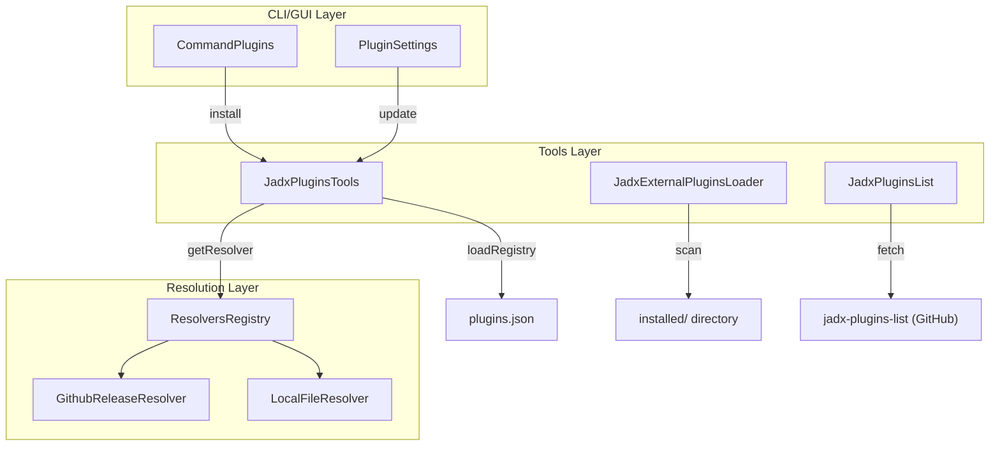
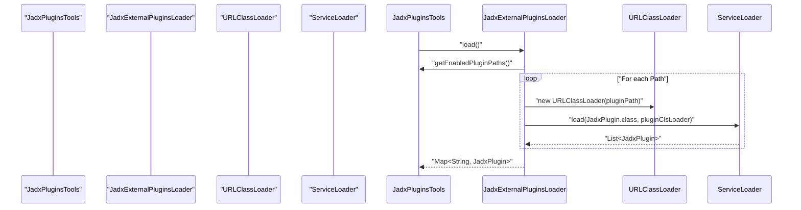

# Plugin Tools and External Plugin Management

Relevant source files

The following files were used as context for generating this wiki page:

- [jadx-cli/src/main/java/jadx/cli/JadxCLICommands.java](https://github.com/skylot/jadx/blob/HEAD/jadx-cli/src/main/java/jadx/cli/JadxCLICommands.java)
- [jadx-cli/src/main/java/jadx/cli/commands/CommandPlugins.java](https://github.com/skylot/jadx/blob/HEAD/jadx-cli/src/main/java/jadx/cli/commands/CommandPlugins.java)
- [jadx-cli/src/main/java/jadx/cli/commands/ICommand.java](https://github.com/skylot/jadx/blob/HEAD/jadx-cli/src/main/java/jadx/cli/commands/ICommand.java)
- [jadx-cli/src/test/java/jadx/plugins/tools/utils/PluginUtilsTest.java](https://github.com/skylot/jadx/blob/HEAD/jadx-cli/src/test/java/jadx/plugins/tools/utils/PluginUtilsTest.java)
- [jadx-core/src/main/java/jadx/api/plugins/JadxPluginInfo.java](https://github.com/skylot/jadx/blob/HEAD/jadx-core/src/main/java/jadx/api/plugins/JadxPluginInfo.java)
- [jadx-core/src/main/java/jadx/api/plugins/JadxPluginInfoBuilder.java](https://github.com/skylot/jadx/blob/HEAD/jadx-core/src/main/java/jadx/api/plugins/JadxPluginInfoBuilder.java)
- [jadx-core/src/main/java/jadx/core/dex/visitors/usage/UsageInfo.java](https://github.com/skylot/jadx/blob/HEAD/jadx-core/src/main/java/jadx/core/dex/visitors/usage/UsageInfo.java)
- [jadx-core/src/main/java/jadx/core/dex/visitors/usage/UsageInfoVisitor.java](https://github.com/skylot/jadx/blob/HEAD/jadx-core/src/main/java/jadx/core/dex/visitors/usage/UsageInfoVisitor.java)
- [jadx-core/src/main/java/jadx/core/utils/DotGraphUtils.java](https://github.com/skylot/jadx/blob/HEAD/jadx-core/src/main/java/jadx/core/utils/DotGraphUtils.java)
- [jadx-core/src/test/java/jadx/tests/integration/annotations/TestAnnotationsUsage.java](https://github.com/skylot/jadx/blob/HEAD/jadx-core/src/test/java/jadx/tests/integration/annotations/TestAnnotationsUsage.java)
- [jadx-core/src/test/java/jadx/tests/integration/generics/TestUsageInGenerics.java](https://github.com/skylot/jadx/blob/HEAD/jadx-core/src/test/java/jadx/tests/integration/generics/TestUsageInGenerics.java)
- [jadx-gui/src/main/java/jadx/gui/plugins/context/GuiSettingsContext.java](https://github.com/skylot/jadx/blob/HEAD/jadx-gui/src/main/java/jadx/gui/plugins/context/GuiSettingsContext.java)
- [jadx-gui/src/main/java/jadx/gui/settings/ui/plugins/AvailablePluginNode.java](https://github.com/skylot/jadx/blob/HEAD/jadx-gui/src/main/java/jadx/gui/settings/ui/plugins/AvailablePluginNode.java)
- [jadx-gui/src/main/java/jadx/gui/settings/ui/plugins/InstallPluginDialog.java](https://github.com/skylot/jadx/blob/HEAD/jadx-gui/src/main/java/jadx/gui/settings/ui/plugins/InstallPluginDialog.java)
- [jadx-gui/src/main/java/jadx/gui/settings/ui/plugins/PluginSettings.java](https://github.com/skylot/jadx/blob/HEAD/jadx-gui/src/main/java/jadx/gui/settings/ui/plugins/PluginSettings.java)
- [jadx-gui/src/main/java/jadx/gui/settings/ui/plugins/TitleNode.java](https://github.com/skylot/jadx/blob/HEAD/jadx-gui/src/main/java/jadx/gui/settings/ui/plugins/TitleNode.java)
- [jadx-gui/src/main/java/jadx/gui/ui/graphs/CallGraphDialog.java](https://github.com/skylot/jadx/blob/HEAD/jadx-gui/src/main/java/jadx/gui/ui/graphs/CallGraphDialog.java)
- [jadx-gui/src/main/java/jadx/gui/ui/graphs/ClassInheritanceGraphDialog.java](https://github.com/skylot/jadx/blob/HEAD/jadx-gui/src/main/java/jadx/gui/ui/graphs/ClassInheritanceGraphDialog.java)
- [jadx-gui/src/main/java/jadx/gui/ui/graphs/ClassMethodGraphDialog.java](https://github.com/skylot/jadx/blob/HEAD/jadx-gui/src/main/java/jadx/gui/ui/graphs/ClassMethodGraphDialog.java)
- [jadx-gui/src/main/java/jadx/gui/update/JadxUpdate.kt](https://github.com/skylot/jadx/blob/HEAD/jadx-gui/src/main/java/jadx/gui/update/JadxUpdate.kt)
- [jadx-plugins-tools/build.gradle.kts](https://github.com/skylot/jadx/blob/HEAD/jadx-plugins-tools/build.gradle.kts)
- [jadx-plugins-tools/src/main/java/jadx/plugins/tools/JadxExternalPluginsLoader.java](https://github.com/skylot/jadx/blob/HEAD/jadx-plugins-tools/src/main/java/jadx/plugins/tools/JadxExternalPluginsLoader.java)
- [jadx-plugins-tools/src/main/java/jadx/plugins/tools/JadxPluginsList.java](https://github.com/skylot/jadx/blob/HEAD/jadx-plugins-tools/src/main/java/jadx/plugins/tools/JadxPluginsList.java)
- [jadx-plugins-tools/src/main/java/jadx/plugins/tools/JadxPluginsTools.java](https://github.com/skylot/jadx/blob/HEAD/jadx-plugins-tools/src/main/java/jadx/plugins/tools/JadxPluginsTools.java)
- [jadx-plugins-tools/src/main/java/jadx/plugins/tools/data/JadxPluginListCache.java](https://github.com/skylot/jadx/blob/HEAD/jadx-plugins-tools/src/main/java/jadx/plugins/tools/data/JadxPluginListCache.java)
- [jadx-plugins-tools/src/main/java/jadx/plugins/tools/data/JadxPluginListEntry.java](https://github.com/skylot/jadx/blob/HEAD/jadx-plugins-tools/src/main/java/jadx/plugins/tools/data/JadxPluginListEntry.java)
- [jadx-plugins-tools/src/main/java/jadx/plugins/tools/data/JadxPluginMetadata.java](https://github.com/skylot/jadx/blob/HEAD/jadx-plugins-tools/src/main/java/jadx/plugins/tools/data/JadxPluginMetadata.java)
- [jadx-plugins-tools/src/main/java/jadx/plugins/tools/resolvers/file/LocalFileResolver.java](https://github.com/skylot/jadx/blob/HEAD/jadx-plugins-tools/src/main/java/jadx/plugins/tools/resolvers/file/LocalFileResolver.java)
- [jadx-plugins-tools/src/main/java/jadx/plugins/tools/resolvers/github/GithubReleaseResolver.java](https://github.com/skylot/jadx/blob/HEAD/jadx-plugins-tools/src/main/java/jadx/plugins/tools/resolvers/github/GithubReleaseResolver.java)
- [jadx-plugins-tools/src/main/java/jadx/plugins/tools/resolvers/github/GithubTools.java](https://github.com/skylot/jadx/blob/HEAD/jadx-plugins-tools/src/main/java/jadx/plugins/tools/resolvers/github/GithubTools.java)
- [jadx-plugins-tools/src/main/java/jadx/plugins/tools/resolvers/github/LocationInfo.java](https://github.com/skylot/jadx/blob/HEAD/jadx-plugins-tools/src/main/java/jadx/plugins/tools/resolvers/github/LocationInfo.java)
- [jadx-plugins-tools/src/main/java/jadx/plugins/tools/utils/PluginUtils.java](https://github.com/skylot/jadx/blob/HEAD/jadx-plugins-tools/src/main/java/jadx/plugins/tools/utils/PluginUtils.java)
- [jadx-plugins-tools/src/test/java/jadx/plugins/tools/resolvers/github/GithubToolsTest.java](https://github.com/skylot/jadx/blob/HEAD/jadx-plugins-tools/src/test/java/jadx/plugins/tools/resolvers/github/GithubToolsTest.java)
- [jadx-plugins-tools/src/test/resources/github/plugins-list-good.json](https://github.com/skylot/jadx/blob/HEAD/jadx-plugins-tools/src/test/resources/github/plugins-list-good.json)
- [jadx-plugins/jadx-xapk-input/build.gradle.kts](https://github.com/skylot/jadx/blob/HEAD/jadx-plugins/jadx-xapk-input/build.gradle.kts)

The plugin management system in JADX provides the infrastructure for discovering, installing, updating, and removing external plugins. It bridges the gap between the core decompiler and external artifacts (JARs or ZIPs) hosted on GitHub or local filesystems.

## JadxPluginsTools Orchestrator

`JadxPluginsTools` is the central singleton orchestrator for managing the lifecycle of external plugins. It handles the high-level logic for installation, updates, and uninstallation by coordinating between resolvers and the local plugin registry.

### Key Responsibilities
- **Installation**: Resolves a `locationId` (e.g., `github:owner/repo`) to a physical artifact, verifies compatibility with the current JADX version using `VerifyRequiredVersion`, and saves it to the local storage [jadx-plugins-tools/src/main/java/jadx/plugins/tools/JadxPluginsTools.java:59-99](https://github.com/skylot/jadx/blob/HEAD/jadx-plugins-tools/src/main/java/jadx/plugins/tools/JadxPluginsTools.java#L59-L99).
- **Update Management**: Iterates through installed plugins and uses the original resolvers to check for newer compatible versions [jadx-plugins-tools/src/main/java/jadx/plugins/tools/JadxPluginsTools.java:118-143](https://github.com/skylot/jadx/blob/HEAD/jadx-plugins-tools/src/main/java/jadx/plugins/tools/JadxPluginsTools.java#L118-L143).
- **Registry Maintenance**: Manages the `plugins.json` file which tracks installed plugin metadata, including IDs, versions, and local paths [jadx-plugins-tools/src/main/java/jadx/plugins/tools/JadxPluginsTools.java:146-161](https://github.com/skylot/jadx/blob/HEAD/jadx-plugins-tools/src/main/java/jadx/plugins/tools/JadxPluginsTools.java#L146-L161).

### Implementation Details
The tool uses `VerifyRequiredVersion` to ensure that a plugin's `requiredJadxVersion` matches the running JADX instance before allowing installation [jadx-plugins-tools/src/main/java/jadx/plugins/tools/JadxPluginsTools.java:81-90](https://github.com/skylot/jadx/blob/HEAD/jadx-plugins-tools/src/main/java/jadx/plugins/tools/JadxPluginsTools.java#L81-L90).

**Plugin Management Data Flow**

Sources: [jadx-plugins-tools/src/main/java/jadx/plugins/tools/JadxPluginsTools.java:47-57](https://github.com/skylot/jadx/blob/HEAD/jadx-plugins-tools/src/main/java/jadx/plugins/tools/JadxPluginsTools.java#L47-L57), [jadx-cli/src/main/java/jadx/cli/commands/CommandPlugins.java:23-69](https://github.com/skylot/jadx/blob/HEAD/jadx-cli/src/main/java/jadx/cli/commands/CommandPlugins.java#L23-L69), [jadx-gui/src/main/java/jadx/gui/settings/ui/plugins/PluginSettings.java:46-56](https://github.com/skylot/jadx/blob/HEAD/jadx-gui/src/main/java/jadx/gui/settings/ui/plugins/PluginSettings.java#L46-L56).

## Plugin Resolvers

Resolvers implement the `IJadxPluginResolver` interface to translate a `locationId` into `JadxPluginMetadata`.

### GitHub Release Resolver
The `GithubReleaseResolver` handles `locationId` strings starting with `github:`. It parses the owner, project, and optional version or artifact prefix [jadx-plugins-tools/src/main/java/jadx/plugins/tools/resolvers/github/GithubReleaseResolver.java:67-91](https://github.com/skylot/jadx/blob/HEAD/jadx-plugins-tools/src/main/java/jadx/plugins/tools/resolvers/github/GithubReleaseResolver.java#L67-L91).
- **Asset Discovery**: It searches for `.jar` or `.zip` files in GitHub Releases that match the project name and version [jadx-plugins-tools/src/main/java/jadx/plugins/tools/resolvers/github/GithubReleaseResolver.java:93-116](https://github.com/skylot/jadx/blob/HEAD/jadx-plugins-tools/src/main/java/jadx/plugins/tools/resolvers/github/GithubReleaseResolver.java#L93-L116).
- **Version Filtering**: It can fetch multiple releases to find one compatible with the current JADX version [jadx-plugins-tools/src/main/java/jadx/plugins/tools/resolvers/github/GithubReleaseResolver.java:32-41](https://github.com/skylot/jadx/blob/HEAD/jadx-plugins-tools/src/main/java/jadx/plugins/tools/resolvers/github/GithubReleaseResolver.java#L32-L41).

### Local File Resolver
The `LocalFileResolver` handles `file:` prefixed IDs. It allows installing plugins directly from a local JAR or ZIP file. It does not support updates as there is no remote source to poll [jadx-plugins-tools/src/main/java/jadx/plugins/tools/resolvers/file/LocalFileResolver.java:12-21](https://github.com/skylot/jadx/blob/HEAD/jadx-plugins-tools/src/main/java/jadx/plugins/tools/resolvers/file/LocalFileResolver.java#L12-L21).

Sources: [jadx-plugins-tools/src/main/java/jadx/plugins/tools/resolvers/github/GithubReleaseResolver.java:17-48](https://github.com/skylot/jadx/blob/HEAD/jadx-plugins-tools/src/main/java/jadx/plugins/tools/resolvers/github/GithubReleaseResolver.java#L17-L48), [jadx-plugins-tools/src/main/java/jadx/plugins/tools/resolvers/file/LocalFileResolver.java:12-41](https://github.com/skylot/jadx/blob/HEAD/jadx-plugins-tools/src/main/java/jadx/plugins/tools/resolvers/file/LocalFileResolver.java#L12-L41).

## Plugin Discovery and Marketplace

`JadxPluginsList` manages the "Marketplace" feature. It fetches a curated list of plugins from the `jadx-decompiler/jadx-plugins-list` repository on GitHub [jadx-plugins-tools/src/main/java/jadx/plugins/tools/JadxPluginsList.java:108-117](https://github.com/skylot/jadx/blob/HEAD/jadx-plugins-tools/src/main/java/jadx/plugins/tools/JadxPluginsList.java#L108-L117).

- **Caching**: To improve performance and work offline, it caches the fetched list in `PLUGINS_LIST_CACHE` (usually `plugins-list.json`) [jadx-plugins-tools/src/main/java/jadx/plugins/tools/JadxPluginsList.java:87-106](https://github.com/skylot/jadx/blob/HEAD/jadx-plugins-tools/src/main/java/jadx/plugins/tools/JadxPluginsList.java#L87-L106).
- **Update Logic**: When `get()` is called, it first provides the cached data, then fetches the latest release info from GitHub in the background to update the cache if a new version is available [jadx-plugins-tools/src/main/java/jadx/plugins/tools/JadxPluginsList.java:62-79](https://github.com/skylot/jadx/blob/HEAD/jadx-plugins-tools/src/main/java/jadx/plugins/tools/JadxPluginsList.java#L62-L79).

Sources: [jadx-plugins-tools/src/main/java/jadx/plugins/tools/JadxPluginsList.java:33-47](https://github.com/skylot/jadx/blob/HEAD/jadx-plugins-tools/src/main/java/jadx/plugins/tools/JadxPluginsList.java#L33-L47).

## External Plugin Loading

The `JadxExternalPluginsLoader` is responsible for physically loading the plugin classes into the JVM using `URLClassLoader`.

### Loading Process
1. **Scanning**: It scans the paths provided by `JadxPluginsTools.getEnabledPluginPaths()` for JAR files [jadx-plugins-tools/src/main/java/jadx/plugins/tools/JadxExternalPluginsLoader.java:76-81](https://github.com/skylot/jadx/blob/HEAD/jadx-plugins-tools/src/main/java/jadx/plugins/tools/JadxExternalPluginsLoader.java#L76-L81).
2. **Class Isolation**: Each plugin JAR is loaded into its own `URLClassLoader` with a name prefix `jadx-plugin:` to prevent class conflicts [jadx-plugins-tools/src/main/java/jadx/plugins/tools/JadxExternalPluginsLoader.java:103-106](https://github.com/skylot/jadx/blob/HEAD/jadx-plugins-tools/src/main/java/jadx/plugins/tools/JadxExternalPluginsLoader.java#L103-L106).
3. **Service Discovery**: It uses `java.util.ServiceLoader` to find implementations of the `JadxPlugin` interface within the loaded JARs [jadx-plugins-tools/src/main/java/jadx/plugins/tools/JadxExternalPluginsLoader.java:64-74](https://github.com/skylot/jadx/blob/HEAD/jadx-plugins-tools/src/main/java/jadx/plugins/tools/JadxExternalPluginsLoader.java#L64-L74).

**Code Entity Space: Loading Sequence**

Sources: [jadx-plugins-tools/src/main/java/jadx/plugins/tools/JadxExternalPluginsLoader.java:25-47](https://github.com/skylot/jadx/blob/HEAD/jadx-plugins-tools/src/main/java/jadx/plugins/tools/JadxExternalPluginsLoader.java#L25-L47), [jadx-plugins-tools/src/main/java/jadx/plugins/tools/JadxExternalPluginsLoader.java:83-110](https://github.com/skylot/jadx/blob/HEAD/jadx-plugins-tools/src/main/java/jadx/plugins/tools/JadxExternalPluginsLoader.java#L83-L110).

## Call Graph and Usage Analysis (jadx-analysis)

The core analysis capabilities are extended by visitors that collect cross-reference (XREF) and usage data. This is utilized by GUI features like Call Graphs.

### UsageInfoVisitor
`UsageInfoVisitor` is a pipeline visitor that scans classes and methods to build a dependency map [jadx-core/src/main/java/jadx/core/dex/visitors/usage/UsageInfoVisitor.java:41-50](https://github.com/skylot/jadx/blob/HEAD/jadx-core/src/main/java/jadx/core/dex/visitors/usage/UsageInfoVisitor.java#L41-L50).
- **Instruction Scanning**: It visits every instruction in a method using `ICodeReader.visitInstructions` to identify `TYPE_REF`, `FIELD_REF`, and `METHOD_REF` opcodes [jadx-core/src/main/java/jadx/core/dex/visitors/usage/UsageInfoVisitor.java:123-142](https://github.com/skylot/jadx/blob/HEAD/jadx-core/src/main/java/jadx/core/dex/visitors/usage/UsageInfoVisitor.java#L123-L142).
- **Resolution**: References are resolved to `MethodNode` or `FieldNode` entities to build the usage graph [jadx-core/src/main/java/jadx/core/dex/visitors/usage/UsageInfoVisitor.java:151-174](https://github.com/skylot/jadx/blob/HEAD/jadx-core/src/main/java/jadx/core/dex/visitors/usage/UsageInfoVisitor.java#L151-L174).

### UsageInfo Data Structure
The `UsageInfo` class stores the resulting relationships [jadx-core/src/main/java/jadx/core/dex/visitors/usage/UsageInfo.java:29-42](https://github.com/skylot/jadx/blob/HEAD/jadx-core/src/main/java/jadx/core/dex/visitors/usage/UsageInfo.java#L29-L42):
- `mthUsage`: Maps a method to the set of methods that call it.
- `mthUses`: Maps a method to the set of methods it calls.
- `clsDeps`: Tracks class-level dependencies for generating inheritance or dependency graphs.

Sources: [jadx-core/src/main/java/jadx/core/dex/visitors/usage/UsageInfoVisitor.java:50-84](https://github.com/skylot/jadx/blob/HEAD/jadx-core/src/main/java/jadx/core/dex/visitors/usage/UsageInfoVisitor.java#L50-L84), [jadx-core/src/main/java/jadx/core/dex/visitors/usage/UsageInfo.java:29-58](https://github.com/skylot/jadx/blob/HEAD/jadx-core/src/main/java/jadx/core/dex/visitors/usage/UsageInfo.java#L29-L58).

## Plugin Registry (plugins.json)

The `plugins.json` file (represented by the `JadxInstalledPlugins` class) acts as the source of truth for the plugin system's state. It contains a list of `JadxPluginMetadata` objects.

| Field | Description |
| --- | --- |
| `pluginId` | Unique identifier for the plugin (e.g., `dex-input`) [jadx-plugins-tools/src/main/java/jadx/plugins/tools/data/JadxPluginMetadata.java:9](https://github.com/skylot/jadx/blob/HEAD/jadx-plugins-tools/src/main/java/jadx/plugins/tools/data/JadxPluginMetadata.java#L9) |
| `version` | The currently installed version string [jadx-plugins-tools/src/main/java/jadx/plugins/tools/data/JadxPluginMetadata.java:15](https://github.com/skylot/jadx/blob/HEAD/jadx-plugins-tools/src/main/java/jadx/plugins/tools/data/JadxPluginMetadata.java#L15) |
| `locationId` | The source string used for updates (e.g., `github:owner/repo`) [jadx-plugins-tools/src/main/java/jadx/plugins/tools/data/JadxPluginMetadata.java:17](https://github.com/skylot/jadx/blob/HEAD/jadx-plugins-tools/src/main/java/jadx/plugins/tools/data/JadxPluginMetadata.java#L17) |
| `path` | Local filesystem path to the plugin JAR [jadx-plugins-tools/src/main/java/jadx/plugins/tools/data/JadxPluginMetadata.java:23](https://github.com/skylot/jadx/blob/HEAD/jadx-plugins-tools/src/main/java/jadx/plugins/tools/data/JadxPluginMetadata.java#L23) |
| `disabled` | Boolean flag to prevent the plugin from loading without uninstalling it [jadx-plugins-tools/src/main/java/jadx/plugins/tools/data/JadxPluginMetadata.java:25](https://github.com/skylot/jadx/blob/HEAD/jadx-plugins-tools/src/main/java/jadx/plugins/tools/data/JadxPluginMetadata.java#L25) |

Sources: [jadx-plugins-tools/src/main/java/jadx/plugins/tools/data/JadxPluginMetadata.java:8-25](https://github.com/skylot/jadx/blob/HEAD/jadx-plugins-tools/src/main/java/jadx/plugins/tools/data/JadxPluginMetadata.java#L8-L25).

## CLI Integration

The `CommandPlugins` class implements the `plugins` subcommand in the JADX CLI. It exposes the functionality of `JadxPluginsTools` to the user.

- **`--install <locationId>`**: Triggers `JadxPluginsTools.install()` [jadx-cli/src/main/java/jadx/cli/commands/CommandPlugins.java:82-85](https://github.com/skylot/jadx/blob/HEAD/jadx-cli/src/main/java/jadx/cli/commands/CommandPlugins.java#L82-L85).
- **`--list`**: Displays metadata for all plugins in the registry [jadx-cli/src/main/java/jadx/cli/commands/CommandPlugins.java:107-110](https://github.com/skylot/jadx/blob/HEAD/jadx-cli/src/main/java/jadx/cli/commands/CommandPlugins.java#L107-L110).
- **`--update`**: Runs the bulk update process and reports changes [jadx-cli/src/main/java/jadx/cli/commands/CommandPlugins.java:95-106](https://github.com/skylot/jadx/blob/HEAD/jadx-cli/src/main/java/jadx/cli/commands/CommandPlugins.java#L95-L106).
- **`--available`**: Fetches and prints the list from the online marketplace via `JadxPluginsList` [jadx-cli/src/main/java/jadx/cli/commands/CommandPlugins.java:119-127](https://github.com/skylot/jadx/blob/HEAD/jadx-cli/src/main/java/jadx/cli/commands/CommandPlugins.java#L119-L127).

Sources: [jadx-cli/src/main/java/jadx/cli/commands/CommandPlugins.java:23-60](https://github.com/skylot/jadx/blob/HEAD/jadx-cli/src/main/java/jadx/cli/commands/CommandPlugins.java#L23-L60).