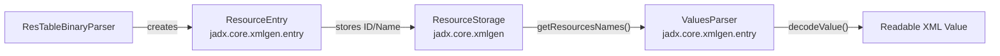
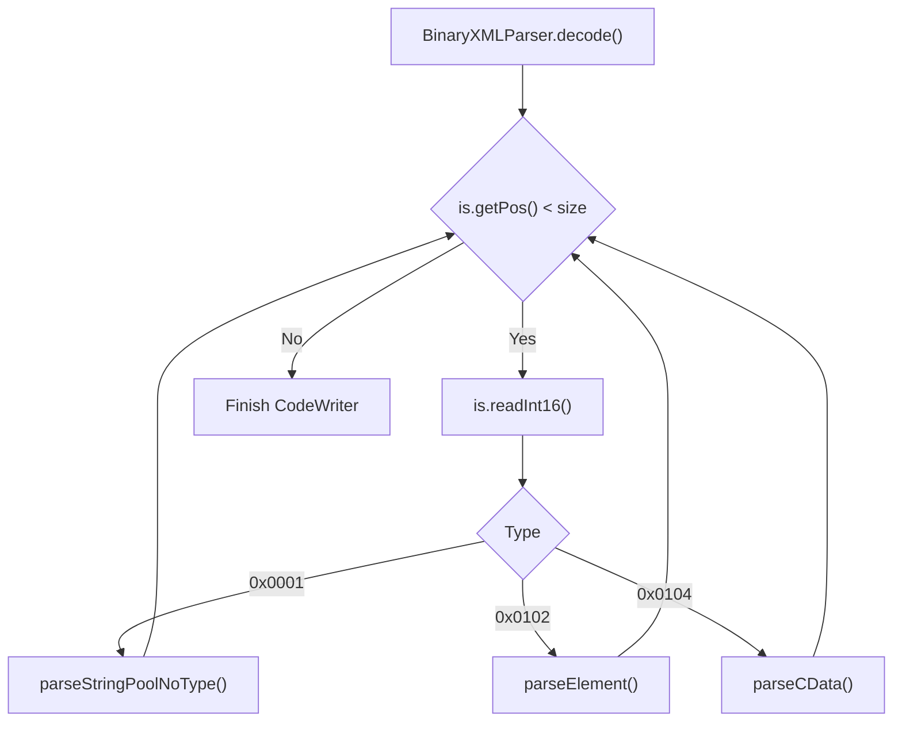

# Android Resource Processing

Relevant source files

The following files were used as context for generating this wiki page:

- [jadx-core/src/main/java/jadx/api/ResourceFile.java](https://github.com/skylot/jadx/blob/HEAD/jadx-core/src/main/java/jadx/api/ResourceFile.java)
- [jadx-core/src/main/java/jadx/api/ResourceFileContent.java](https://github.com/skylot/jadx/blob/HEAD/jadx-core/src/main/java/jadx/api/ResourceFileContent.java)
- [jadx-core/src/main/java/jadx/api/ResourceType.java](https://github.com/skylot/jadx/blob/HEAD/jadx-core/src/main/java/jadx/api/ResourceType.java)
- [jadx-core/src/main/java/jadx/api/ResourcesLoader.java](https://github.com/skylot/jadx/blob/HEAD/jadx-core/src/main/java/jadx/api/ResourcesLoader.java)
- [jadx-core/src/main/java/jadx/core/xmlgen/CommonBinaryParser.java](https://github.com/skylot/jadx/blob/HEAD/jadx-core/src/main/java/jadx/core/xmlgen/CommonBinaryParser.java)
- [jadx-core/src/main/java/jadx/core/xmlgen/ManifestAttributes.java](https://github.com/skylot/jadx/blob/HEAD/jadx-core/src/main/java/jadx/core/xmlgen/ManifestAttributes.java)
- [jadx-core/src/main/java/jadx/core/xmlgen/ParserConstants.java](https://github.com/skylot/jadx/blob/HEAD/jadx-core/src/main/java/jadx/core/xmlgen/ParserConstants.java)
- [jadx-core/src/main/java/jadx/core/xmlgen/ParserStream.java](https://github.com/skylot/jadx/blob/HEAD/jadx-core/src/main/java/jadx/core/xmlgen/ParserStream.java)
- [jadx-core/src/main/java/jadx/core/xmlgen/ResContainer.java](https://github.com/skylot/jadx/blob/HEAD/jadx-core/src/main/java/jadx/core/xmlgen/ResContainer.java)
- [jadx-core/src/main/java/jadx/core/xmlgen/ResNameUtils.java](https://github.com/skylot/jadx/blob/HEAD/jadx-core/src/main/java/jadx/core/xmlgen/ResNameUtils.java)
- [jadx-core/src/main/java/jadx/core/xmlgen/ResTableBinaryParser.java](https://github.com/skylot/jadx/blob/HEAD/jadx-core/src/main/java/jadx/core/xmlgen/ResTableBinaryParser.java)
- [jadx-core/src/main/java/jadx/core/xmlgen/ResourceStorage.java](https://github.com/skylot/jadx/blob/HEAD/jadx-core/src/main/java/jadx/core/xmlgen/ResourceStorage.java)
- [jadx-core/src/main/java/jadx/core/xmlgen/ResourcesSaver.java](https://github.com/skylot/jadx/blob/HEAD/jadx-core/src/main/java/jadx/core/xmlgen/ResourcesSaver.java)
- [jadx-core/src/main/java/jadx/core/xmlgen/entry/EntryConfig.java](https://github.com/skylot/jadx/blob/HEAD/jadx-core/src/main/java/jadx/core/xmlgen/entry/EntryConfig.java)
- [jadx-core/src/main/java/jadx/core/xmlgen/entry/RawNamedValue.java](https://github.com/skylot/jadx/blob/HEAD/jadx-core/src/main/java/jadx/core/xmlgen/entry/RawNamedValue.java)
- [jadx-core/src/main/java/jadx/core/xmlgen/entry/ResourceEntry.java](https://github.com/skylot/jadx/blob/HEAD/jadx-core/src/main/java/jadx/core/xmlgen/entry/ResourceEntry.java)
- [jadx-core/src/main/java/jadx/core/xmlgen/entry/ValuesParser.java](https://github.com/skylot/jadx/blob/HEAD/jadx-core/src/main/java/jadx/core/xmlgen/entry/ValuesParser.java)
- [jadx-core/src/test/java/jadx/core/xmlgen/ResNameUtilsTest.java](https://github.com/skylot/jadx/blob/HEAD/jadx-core/src/test/java/jadx/core/xmlgen/ResNameUtilsTest.java)
- [jadx-plugins/jadx-aab-input/src/main/java/jadx/plugins/input/aab/parsers/CommonProtoParser.java](https://github.com/skylot/jadx/blob/HEAD/jadx-plugins/jadx-aab-input/src/main/java/jadx/plugins/input/aab/parsers/CommonProtoParser.java)

The Android Resource Processing subsystem in JADX handles the conversion of Android's binary resource formats into human-readable representations. This system processes three primary resource types:

1.  **Binary XML files** — `AndroidManifest.xml` and other compiled XML layouts.
2.  **Resource tables** — `resources.arsc` (binary) or `resources.pb` (protobuf) containing resource definitions and values.
3.  **Other resources** — Images (including 9-patch decoding), fonts, native libraries, and raw files.

The resource processing system operates in parallel with code decompilation. While the decompilation pipeline processes DEX bytecode, resource processors decode binary formats into XML and other readable formats. `ResourcesLoader` acts as the primary entry point for identifying and dispatching these files to their respective decoders [jadx-core/src/main/java/jadx/api/ResourcesLoader.java:54-62](https://github.com/skylot/jadx/blob/HEAD/jadx-core/src/main/java/jadx/api/ResourcesLoader.java#L54-L62).

This page provides a high-level overview. For detailed implementation details, see:
*   [Binary XML Parsing](35_7.1-binary-xml-parsing.md) — Document `BinaryXMLParser`, `ParserStream` for binary I/O, and the chunk-based parsing process.
*   [Resource Value Decoding](36_7.2-resource-value-decoding.md) — Explain `ValuesParser` for decoding resource values and `ManifestAttributes` for attribute interpretation.
*   [Resource Storage and Integration](37_7.3-resource-storage-and-integration.md) — Document `ResourceStorage`, `ResourceEntry` data structures, and how resources integrate with `RootNode`.

## System Architecture

The following diagram illustrates the relationship between input loading, specialized parsers, and the final generation of readable resources.

**High-Level Component Overview**

```mermaid
graph TB
    subgraph Input_Loading_jadx_core ["Input Loading [jadx-core]"]
        ResourcesLoader["ResourcesLoader<br/>jadx.api"]
        InputFiles["APK/AAB Files"]
    end
    
    subgraph Binary_XML_Processing ["Binary XML Processing"]
        BinaryXMLParser["BinaryXMLParser<br/>jadx.core.xmlgen"]
        BinaryXMLStrings["BinaryXMLStrings<br/>String pool decoder"]
        ManifestAttributes["ManifestAttributes<br/>Enum/flag decoder"]
    end
    
    subgraph Resource_Table_Processing ["Resource Table Processing"]
        ResTableBinaryParser["ResTableBinaryParser<br/>resources.arsc parser"]
        ResourceStorage["ResourceStorage<br/>Entry collection"]
        ValuesParser["ValuesParser<br/>Value type decoder"]
    end
    
    subgraph Resource_Generation ["Resource Generation"]
        ResXmlGen["ResXmlGen<br/>values/*.xml generator"]
    end
    
    subgraph Data_Containers ["Data Containers"]
        ResContainer["ResContainer<br/>Resource wrapper"]
    end
    
    InputFiles --> ResourcesLoader
    ResourcesLoader --> BinaryXMLParser
    ResourcesLoader --> ResTableBinaryParser
    
    BinaryXMLParser --> BinaryXMLStrings
    BinaryXMLParser --> ManifestAttributes
    BinaryXMLParser --> ResContainer
    
    ResTableBinaryParser --> ResourceStorage
    ResourceStorage --> ValuesParser
    ValuesParser --> ResXmlGen
    ResXmlGen --> ResContainer
    
    style BinaryXMLParser fill:none
    style ResTableBinaryParser fill:none
    style ResXmlGen fill:none
```

Sources:
* [jadx-core/src/main/java/jadx/api/ResourcesLoader.java:126-148](https://github.com/skylot/jadx/blob/HEAD/jadx-core/src/main/java/jadx/api/ResourcesLoader.java#L126-L148)
* [jadx-core/src/main/java/jadx/core/xmlgen/ResTableBinaryParser.java:32-82](https://github.com/skylot/jadx/blob/HEAD/jadx-core/src/main/java/jadx/core/xmlgen/ResTableBinaryParser.java#L32-L82)
* [jadx-core/src/main/java/jadx/core/xmlgen/entry/ValuesParser.java:16-25](https://github.com/skylot/jadx/blob/HEAD/jadx-core/src/main/java/jadx/core/xmlgen/entry/ValuesParser.java#L16-L25)
* [jadx-core/src/main/java/jadx/core/xmlgen/ResContainer.java:13-22](https://github.com/skylot/jadx/blob/HEAD/jadx-core/src/main/java/jadx/core/xmlgen/ResContainer.java#L13-L22)

## Resource Table Processing

The resource table (`resources.arsc`) contains the mapping of resource IDs to values across different configurations (locale, screen density, etc.).

1.  **Parsing**: `ResTableBinaryParser` reads the binary table structure, including package chunks, type specs, and entry configs [jadx-core/src/main/java/jadx/core/xmlgen/ResTableBinaryParser.java:112-144](https://github.com/skylot/jadx/blob/HEAD/jadx-core/src/main/java/jadx/core/xmlgen/ResTableBinaryParser.java#L112-L144). It utilizes `ParserStream` to handle little-endian binary I/O [jadx-core/src/main/java/jadx/core/xmlgen/ParserStream.java:37-52](https://github.com/skylot/jadx/blob/HEAD/jadx-core/src/main/java/jadx/core/xmlgen/ParserStream.java#L37-L52).
2.  **Storage**: Parsed entries are stored as `ResourceEntry` objects [jadx-core/src/main/java/jadx/core/xmlgen/entry/ResourceEntry.java:5-16](https://github.com/skylot/jadx/blob/HEAD/jadx-core/src/main/java/jadx/core/xmlgen/entry/ResourceEntry.java#L5-L16). These are managed by `ResourceStorage`, which organizes resources by their full name and provides ID resolution [jadx-core/src/main/java/jadx/core/xmlgen/ResTableBinaryParser.java:93-95](https://github.com/skylot/jadx/blob/HEAD/jadx-core/src/main/java/jadx/core/xmlgen/ResTableBinaryParser.java#L93-L95).
3.  **Value Decoding**: `ValuesParser` converts raw data types defined in `ParserConstants` (e.g., `TYPE_REFERENCE`, `TYPE_INT_COLOR_ARGB8`) into human-readable strings [jadx-core/src/main/java/jadx/core/xmlgen/entry/ValuesParser.java:84-147](https://github.com/skylot/jadx/blob/HEAD/jadx-core/src/main/java/jadx/core/xmlgen/entry/ValuesParser.java#L84-L147).
4.  **Integration**: The `ResXmlGen` class uses the decoded values and storage to generate the final `values.xml` and `public.xml` files [jadx-core/src/main/java/jadx/core/xmlgen/ResTableBinaryParser.java:103-110](https://github.com/skylot/jadx/blob/HEAD/jadx-core/src/main/java/jadx/core/xmlgen/ResTableBinaryParser.java#L103-L110).

**Resource Entry Data Flow**

Sources:
* [jadx-core/src/main/java/jadx/core/xmlgen/ResTableBinaryParser.java:103-110](https://github.com/skylot/jadx/blob/HEAD/jadx-core/src/main/java/jadx/core/xmlgen/ResTableBinaryParser.java#L103-L110)
* [jadx-core/src/main/java/jadx/core/xmlgen/entry/ResourceEntry.java:5-24](https://github.com/skylot/jadx/blob/HEAD/jadx-core/src/main/java/jadx/core/xmlgen/entry/ResourceEntry.java#L5-L24)
* [jadx-core/src/main/java/jadx/core/xmlgen/entry/ValuesParser.java:77-81](https://github.com/skylot/jadx/blob/HEAD/jadx-core/src/main/java/jadx/core/xmlgen/entry/ValuesParser.java#L77-L81)
* [jadx-core/src/main/java/jadx/core/xmlgen/ParserConstants.java:43-89](https://github.com/skylot/jadx/blob/HEAD/jadx-core/src/main/java/jadx/core/xmlgen/ParserConstants.java#L43-L89)

## Binary XML Processing

Android compiles XML files into a chunk-based binary format. `BinaryXMLParser` reverses this by iterating through chunks and reconstructing the XML tree.

| Chunk Type | Constant | Description |
| :--- | :--- | :--- |
| String Pool | `RES_STRING_POOL_TYPE` | Contains all strings used in the XML [jadx-core/src/main/java/jadx/core/xmlgen/ParserConstants.java:18](https://github.com/skylot/jadx/blob/HEAD/jadx-core/src/main/java/jadx/core/xmlgen/ParserConstants.java#L18) |
| Start Element | `RES_XML_START_ELEMENT_TYPE` | Marks the beginning of an XML tag [jadx-core/src/main/java/jadx/core/xmlgen/ParserConstants.java:25](https://github.com/skylot/jadx/blob/HEAD/jadx-core/src/main/java/jadx/core/xmlgen/ParserConstants.java#L25) |
| End Element | `RES_XML_END_ELEMENT_TYPE` | Marks the end of an XML tag [jadx-core/src/main/java/jadx/core/xmlgen/ParserConstants.java:26](https://github.com/skylot/jadx/blob/HEAD/jadx-core/src/main/java/jadx/core/xmlgen/ParserConstants.java#L26) |
| Resource Map | `RES_XML_RESOURCE_MAP_TYPE` | Maps attribute IDs to their names [jadx-core/src/main/java/jadx/core/xmlgen/ParserConstants.java:29](https://github.com/skylot/jadx/blob/HEAD/jadx-core/src/main/java/jadx/core/xmlgen/ParserConstants.java#L29) |

`ManifestAttributes` is specifically used during this process to decode Android-specific flags and enums found in the manifest and layouts [jadx-core/src/main/java/jadx/core/xmlgen/ManifestAttributes.java:28-36](https://github.com/skylot/jadx/blob/HEAD/jadx-core/src/main/java/jadx/core/xmlgen/ManifestAttributes.java#L28-L36).

**Binary XML Decoding Loop**

Sources:
* [jadx-core/src/main/java/jadx/core/xmlgen/CommonBinaryParser.java:13-16](https://github.com/skylot/jadx/blob/HEAD/jadx-core/src/main/java/jadx/core/xmlgen/CommonBinaryParser.java#L13-L16)
* [jadx-core/src/main/java/jadx/core/xmlgen/ParserConstants.java:17-30](https://github.com/skylot/jadx/blob/HEAD/jadx-core/src/main/java/jadx/core/xmlgen/ParserConstants.java#L17-L30)
* [jadx-core/src/main/java/jadx/core/xmlgen/ManifestAttributes.java:174-206](https://github.com/skylot/jadx/blob/HEAD/jadx-core/src/main/java/jadx/core/xmlgen/ManifestAttributes.java#L174-L206)

## Loading and Saving

The resource subsystem handles file I/O and persistence through two main classes:

*   **ResourcesLoader**: Responsible for identifying file types (via `ResourceType`) and extracting them from ZIP/APK containers [jadx-core/src/main/java/jadx/api/ResourcesLoader.java:126-148](https://github.com/skylot/jadx/blob/HEAD/jadx-core/src/main/java/jadx/api/ResourcesLoader.java#L126-L148). It also handles special cases like 9-patch image decoding via `Res9patchStreamDecoder` [jadx-core/src/main/java/jadx/api/ResourcesLoader.java:169-182](https://github.com/skylot/jadx/blob/HEAD/jadx-core/src/main/java/jadx/api/ResourcesLoader.java#L169-L182).
*   **ResourcesSaver**: Implements the logic to write `ResContainer` data to the disk, ensuring path security via `IJadxSecurity` and handling different data types like `TEXT`, `DECODED_DATA`, and `RES_LINK` [jadx-core/src/main/java/jadx/core/xmlgen/ResourcesSaver.java:65-96](https://github.com/skylot/jadx/blob/HEAD/jadx-core/src/main/java/jadx/core/xmlgen/ResourcesSaver.java#L65-L96).

For details, see [Resource Storage and Integration](37_7.3-resource-storage-and-integration.md).

Sources:
* [jadx-core/src/main/java/jadx/api/ResourcesLoader.java:126-148](https://github.com/skylot/jadx/blob/HEAD/jadx-core/src/main/java/jadx/api/ResourcesLoader.java#L126-L148)
* [jadx-core/src/main/java/jadx/api/ResourceType.java:62-79](https://github.com/skylot/jadx/blob/HEAD/jadx-core/src/main/java/jadx/api/ResourceType.java#L62-L79)
* [jadx-core/src/main/java/jadx/core/xmlgen/ResourcesSaver.java:65-96](https://github.com/skylot/jadx/blob/HEAD/jadx-core/src/main/java/jadx/core/xmlgen/ResourcesSaver.java#L65-L96)39:T502a,# B