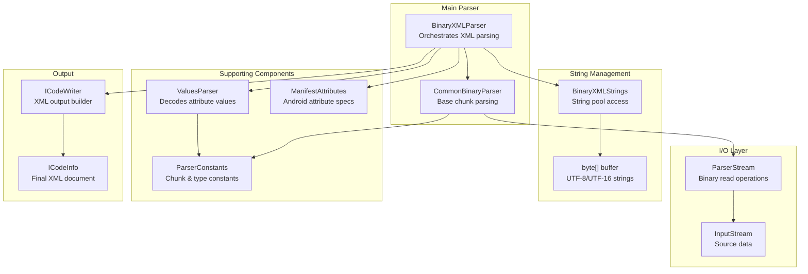
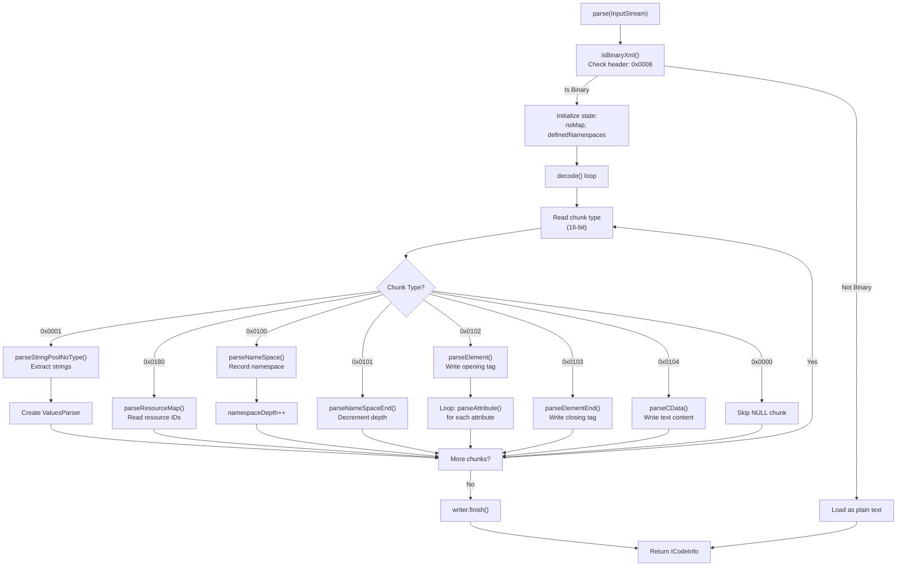
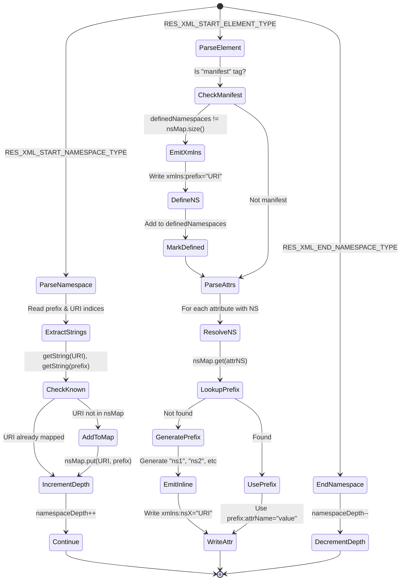
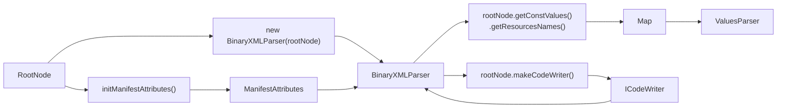

# Binary XML Parsing

Relevant source files

The following files were used as context for generating this wiki page:

- [README.md](https://github.com/skylot/jadx/blob/HEAD/README.md)
- [jadx-cli/src/main/java/jadx/cli/JCommanderWrapper.java](https://github.com/skylot/jadx/blob/HEAD/jadx-cli/src/main/java/jadx/cli/JCommanderWrapper.java)
- [jadx-cli/src/main/java/jadx/cli/JadxCLI.java](https://github.com/skylot/jadx/blob/HEAD/jadx-cli/src/main/java/jadx/cli/JadxCLI.java)
- [jadx-cli/src/main/java/jadx/cli/JadxCLIArgs.java](https://github.com/skylot/jadx/blob/HEAD/jadx-cli/src/main/java/jadx/cli/JadxCLIArgs.java)
- [jadx-cli/src/main/java/jadx/cli/LogHelper.java](https://github.com/skylot/jadx/blob/HEAD/jadx-cli/src/main/java/jadx/cli/LogHelper.java)
- [jadx-cli/src/main/java/jadx/cli/tools/ConvertArscFile.java](https://github.com/skylot/jadx/blob/HEAD/jadx-cli/src/main/java/jadx/cli/tools/ConvertArscFile.java)
- [jadx-cli/src/test/java/jadx/cli/JadxCLIArgsTest.java](https://github.com/skylot/jadx/blob/HEAD/jadx-cli/src/test/java/jadx/cli/JadxCLIArgsTest.java)
- [jadx-core/src/main/java/jadx/api/JadxArgs.java](https://github.com/skylot/jadx/blob/HEAD/jadx-core/src/main/java/jadx/api/JadxArgs.java)
- [jadx-core/src/main/java/jadx/core/utils/files/FileUtils.java](https://github.com/skylot/jadx/blob/HEAD/jadx-core/src/main/java/jadx/core/utils/files/FileUtils.java)
- [jadx-core/src/main/java/jadx/core/xmlgen/BinaryXMLParser.java](https://github.com/skylot/jadx/blob/HEAD/jadx-core/src/main/java/jadx/core/xmlgen/BinaryXMLParser.java)
- [jadx-core/src/main/java/jadx/core/xmlgen/BinaryXMLStrings.java](https://github.com/skylot/jadx/blob/HEAD/jadx-core/src/main/java/jadx/core/xmlgen/BinaryXMLStrings.java)
- [jadx-core/src/main/java/jadx/core/xmlgen/CommonBinaryParser.java](https://github.com/skylot/jadx/blob/HEAD/jadx-core/src/main/java/jadx/core/xmlgen/CommonBinaryParser.java)
- [jadx-core/src/main/java/jadx/core/xmlgen/ManifestAttributes.java](https://github.com/skylot/jadx/blob/HEAD/jadx-core/src/main/java/jadx/core/xmlgen/ManifestAttributes.java)
- [jadx-core/src/main/java/jadx/core/xmlgen/ParserConstants.java](https://github.com/skylot/jadx/blob/HEAD/jadx-core/src/main/java/jadx/core/xmlgen/ParserConstants.java)
- [jadx-core/src/main/java/jadx/core/xmlgen/ParserStream.java](https://github.com/skylot/jadx/blob/HEAD/jadx-core/src/main/java/jadx/core/xmlgen/ParserStream.java)
- [jadx-core/src/main/java/jadx/core/xmlgen/ResNameUtils.java](https://github.com/skylot/jadx/blob/HEAD/jadx-core/src/main/java/jadx/core/xmlgen/ResNameUtils.java)
- [jadx-core/src/main/java/jadx/core/xmlgen/ResTableBinaryParser.java](https://github.com/skylot/jadx/blob/HEAD/jadx-core/src/main/java/jadx/core/xmlgen/ResTableBinaryParser.java)
- [jadx-core/src/main/java/jadx/core/xmlgen/ResXmlGen.java](https://github.com/skylot/jadx/blob/HEAD/jadx-core/src/main/java/jadx/core/xmlgen/ResXmlGen.java)
- [jadx-core/src/main/java/jadx/core/xmlgen/ResourceStorage.java](https://github.com/skylot/jadx/blob/HEAD/jadx-core/src/main/java/jadx/core/xmlgen/ResourceStorage.java)
- [jadx-core/src/main/java/jadx/core/xmlgen/StringFormattedCheck.java](https://github.com/skylot/jadx/blob/HEAD/jadx-core/src/main/java/jadx/core/xmlgen/StringFormattedCheck.java)
- [jadx-core/src/main/java/jadx/core/xmlgen/entry/EntryConfig.java](https://github.com/skylot/jadx/blob/HEAD/jadx-core/src/main/java/jadx/core/xmlgen/entry/EntryConfig.java)
- [jadx-core/src/main/java/jadx/core/xmlgen/entry/RawNamedValue.java](https://github.com/skylot/jadx/blob/HEAD/jadx-core/src/main/java/jadx/core/xmlgen/entry/RawNamedValue.java)
- [jadx-core/src/main/java/jadx/core/xmlgen/entry/ResourceEntry.java](https://github.com/skylot/jadx/blob/HEAD/jadx-core/src/main/java/jadx/core/xmlgen/entry/ResourceEntry.java)
- [jadx-core/src/main/java/jadx/core/xmlgen/entry/ValuesParser.java](https://github.com/skylot/jadx/blob/HEAD/jadx-core/src/main/java/jadx/core/xmlgen/entry/ValuesParser.java)
- [jadx-core/src/main/resources/android/attrs.xml](https://github.com/skylot/jadx/blob/HEAD/jadx-core/src/main/resources/android/attrs.xml)
- [jadx-core/src/main/resources/android/attrs_manifest.xml](https://github.com/skylot/jadx/blob/HEAD/jadx-core/src/main/resources/android/attrs_manifest.xml)
- [jadx-core/src/main/resources/android/res-map.txt](https://github.com/skylot/jadx/blob/HEAD/jadx-core/src/main/resources/android/res-map.txt)
- [jadx-core/src/test/java/jadx/core/xmlgen/ResNameUtilsTest.java](https://github.com/skylot/jadx/blob/HEAD/jadx-core/src/test/java/jadx/core/xmlgen/ResNameUtilsTest.java)
- [jadx-core/src/test/java/jadx/core/xmlgen/ResXmlGenTest.java](https://github.com/skylot/jadx/blob/HEAD/jadx-core/src/test/java/jadx/core/xmlgen/ResXmlGenTest.java)
- [jadx-gui/src/main/java/jadx/gui/JadxGUI.java](https://github.com/skylot/jadx/blob/HEAD/jadx-gui/src/main/java/jadx/gui/JadxGUI.java)
- [jadx-gui/src/main/java/jadx/gui/JadxWrapper.java](https://github.com/skylot/jadx/blob/HEAD/jadx-gui/src/main/java/jadx/gui/JadxWrapper.java)
- [jadx-plugins/jadx-aab-input/src/main/java/jadx/plugins/input/aab/parsers/CommonProtoParser.java](https://github.com/skylot/jadx/blob/HEAD/jadx-plugins/jadx-aab-input/src/main/java/jadx/plugins/input/aab/parsers/CommonProtoParser.java)

## Purpose and Scope

This document describes JADX's binary XML parsing system, which decodes Android's compiled XML resources (such as `AndroidManifest.xml` and layout files) into human-readable XML format. The system reads chunk-based binary data, extracts string pools, and reconstructs XML element hierarchies with proper namespace handling.

For resource value decoding (attributes, colors, dimensions), see [Resource Value Decoding](36_7.2-resource-value-decoding.md). For how parsed resources integrate with the decompiler, see [Resource Storage and Integration](37_7.3-resource-storage-and-integration.md).

## Binary XML Format Overview

Android's binary XML format is a compact, chunk-based representation defined in the Android Open Source Project (AOSP). The format consists of:

- **File Header**: Version and size information [jadx-core/src/main/java/jadx/core/xmlgen/BinaryXMLParser.java:84-94](https://github.com/skylot/jadx/blob/HEAD/jadx-core/src/main/java/jadx/core/xmlgen/BinaryXMLParser.java#L84-L94).
- **String Pool Chunk**: All strings referenced in the document [jadx-core/src/main/java/jadx/core/xmlgen/CommonBinaryParser.java:18-47](https://github.com/skylot/jadx/blob/HEAD/jadx-core/src/main/java/jadx/core/xmlgen/CommonBinaryParser.java#L18-L47).
- **Resource Map Chunk**: Maps attribute indices to resource IDs [jadx-core/src/main/java/jadx/core/xmlgen/BinaryXMLParser.java:138-148](https://github.com/skylot/jadx/blob/HEAD/jadx-core/src/main/java/jadx/core/xmlgen/BinaryXMLParser.java#L138-L148).
- **XML Chunks**: START_NAMESPACE, END_NAMESPACE, START_ELEMENT, END_ELEMENT, and CDATA [jadx-core/src/main/java/jadx/core/xmlgen/BinaryXMLParser.java:111-125](https://github.com/skylot/jadx/blob/HEAD/jadx-core/src/main/java/jadx/core/xmlgen/BinaryXMLParser.java#L111-L125).

The parser handles different chunk types sequentially while maintaining namespace context and resolving string references.

Sources: [jadx-core/src/main/java/jadx/core/xmlgen/BinaryXMLParser.java:96-136](https://github.com/skylot/jadx/blob/HEAD/jadx-core/src/main/java/jadx/core/xmlgen/BinaryXMLParser.java#L96-L136), [jadx-core/src/main/java/jadx/core/xmlgen/CommonBinaryParser.java:18-47](https://github.com/skylot/jadx/blob/HEAD/jadx-core/src/main/java/jadx/core/xmlgen/CommonBinaryParser.java#L18-L47)

## Core Components

**Diagram: Binary XML Parsing Component Architecture**

Sources: [jadx-core/src/main/java/jadx/core/xmlgen/BinaryXMLParser.java:26-62](https://github.com/skylot/jadx/blob/HEAD/jadx-core/src/main/java/jadx/core/xmlgen/BinaryXMLParser.java#L26-L62), [jadx-core/src/main/java/jadx/core/xmlgen/CommonBinaryParser.java:8-12](https://github.com/skylot/jadx/blob/HEAD/jadx-core/src/main/java/jadx/core/xmlgen/CommonBinaryParser.java#L8-L12), [jadx-core/src/main/java/jadx/core/xmlgen/ParserStream.java:12-26](https://github.com/skylot/jadx/blob/HEAD/jadx-core/src/main/java/jadx/core/xmlgen/ParserStream.java#L12-L26)

### BinaryXMLParser

The `BinaryXMLParser` class is the main entry point for parsing binary XML files. It extends `CommonBinaryParser` and coordinates the entire parsing process.

**Key Responsibilities:**
- Parse file header and validate binary XML format [jadx-core/src/main/java/jadx/core/xmlgen/BinaryXMLParser.java:84-94](https://github.com/skylot/jadx/blob/HEAD/jadx-core/src/main/java/jadx/core/xmlgen/BinaryXMLParser.java#L84-L94).
- Process different chunk types (string pool, resource map, namespaces, elements) [jadx-core/src/main/java/jadx/core/xmlgen/BinaryXMLParser.java:96-136](https://github.com/skylot/jadx/blob/HEAD/jadx-core/src/main/java/jadx/core/xmlgen/BinaryXMLParser.java#L96-L136).
- Build output XML with proper indentation and formatting [jadx-core/src/main/java/jadx/core/xmlgen/BinaryXMLParser.java:227-288](https://github.com/skylot/jadx/blob/HEAD/jadx-core/src/main/java/jadx/core/xmlgen/BinaryXMLParser.java#L227-L288).
- Handle namespace definitions and resolve prefixes [jadx-core/src/main/java/jadx/core/xmlgen/BinaryXMLParser.java:150-201](https://github.com/skylot/jadx/blob/HEAD/jadx-core/src/main/java/jadx/core/xmlgen/BinaryXMLParser.java#L150-L201).

**Key Fields:**
- `is: ParserStream` - Binary input stream [jadx-core/src/main/java/jadx/core/xmlgen/CommonBinaryParser.java:11](https://github.com/skylot/jadx/blob/HEAD/jadx-core/src/main/java/jadx/core/xmlgen/CommonBinaryParser.java#L11).
- `strings: BinaryXMLStrings` - Parsed string pool [jadx-core/src/main/java/jadx/core/xmlgen/BinaryXMLParser.java:40](https://github.com/skylot/jadx/blob/HEAD/jadx-core/src/main/java/jadx/core/xmlgen/BinaryXMLParser.java#L40).
- `writer: ICodeWriter` - XML output builder [jadx-core/src/main/java/jadx/core/xmlgen/BinaryXMLParser.java:39](https://github.com/skylot/jadx/blob/HEAD/jadx-core/src/main/java/jadx/core/xmlgen/BinaryXMLParser.java#L39).
- `nsMap: Map<String, String>` - Namespace URI to prefix mapping [jadx-core/src/main/java/jadx/core/xmlgen/BinaryXMLParser.java:34](https://github.com/skylot/jadx/blob/HEAD/jadx-core/src/main/java/jadx/core/xmlgen/BinaryXMLParser.java#L34).
- `resourceIds: int[]` - Resource ID mapping from resource map chunk [jadx-core/src/main/java/jadx/core/xmlgen/BinaryXMLParser.java:47](https://github.com/skylot/jadx/blob/HEAD/jadx-core/src/main/java/jadx/core/xmlgen/BinaryXMLParser.java#L47).
- `valuesParser: ValuesParser` - Decodes typed attribute values [jadx-core/src/main/java/jadx/core/xmlgen/BinaryXMLParser.java:43](https://github.com/skylot/jadx/blob/HEAD/jadx-core/src/main/java/jadx/core/xmlgen/BinaryXMLParser.java#L43).

Sources: [jadx-core/src/main/java/jadx/core/xmlgen/BinaryXMLParser.java:26-62](https://github.com/skylot/jadx/blob/HEAD/jadx-core/src/main/java/jadx/core/xmlgen/BinaryXMLParser.java#L26-L62), [jadx-core/src/main/java/jadx/core/xmlgen/CommonBinaryParser.java:8-12](https://github.com/skylot/jadx/blob/HEAD/jadx-core/src/main/java/jadx/core/xmlgen/CommonBinaryParser.java#L8-L12)

### ParserStream

`ParserStream` provides low-level binary I/O operations with position tracking and endianness handling. All multi-byte integers are read in little-endian format per the Android binary format specification.

**Key Methods:**

| Method | Description |
|--------|-------------|
| `readInt8()` | Read single byte [jadx-core/src/main/java/jadx/core/xmlgen/ParserStream.java:32-35](https://github.com/skylot/jadx/blob/HEAD/jadx-core/src/main/java/jadx/core/xmlgen/ParserStream.java#L32-L35). |
| `readInt16()` | Read 16-bit little-endian integer [jadx-core/src/main/java/jadx/core/xmlgen/ParserStream.java:37-42](https://github.com/skylot/jadx/blob/HEAD/jadx-core/src/main/java/jadx/core/xmlgen/ParserStream.java#L37-L42). |
| `readInt32()` | Read 32-bit little-endian integer [jadx-core/src/main/java/jadx/core/xmlgen/ParserStream.java:44-52](https://github.com/skylot/jadx/blob/HEAD/jadx-core/src/main/java/jadx/core/xmlgen/ParserStream.java#L44-L52). |
| `readUInt32()` | Read 32-bit unsigned integer as long [jadx-core/src/main/java/jadx/core/xmlgen/ParserStream.java:54-56](https://github.com/skylot/jadx/blob/HEAD/jadx-core/src/main/java/jadx/core/xmlgen/ParserStream.java#L54-L56). |
| `readInt8Array(count)` | Read byte array of specified length [jadx-core/src/main/java/jadx/core/xmlgen/ParserStream.java:74-89](https://github.com/skylot/jadx/blob/HEAD/jadx-core/src/main/java/jadx/core/xmlgen/ParserStream.java#L74-L89). |
| `skip(count)` | Skip bytes with validation [jadx-core/src/main/java/jadx/core/xmlgen/ParserStream.java:92-103](https://github.com/skylot/jadx/blob/HEAD/jadx-core/src/main/java/jadx/core/xmlgen/ParserStream.java#L92-L103). |
| `getPos()` | Get current stream position [jadx-core/src/main/java/jadx/core/xmlgen/ParserStream.java:28-30](https://github.com/skylot/jadx/blob/HEAD/jadx-core/src/main/java/jadx/core/xmlgen/ParserStream.java#L28-L30). |
| `mark(len)` / `reset()` | Mark/reset stream position [jadx-core/src/main/java/jadx/core/xmlgen/ParserStream.java:146-158](https://github.com/skylot/jadx/blob/HEAD/jadx-core/src/main/java/jadx/core/xmlgen/ParserStream.java#L146-L158). |

Sources: [jadx-core/src/main/java/jadx/core/xmlgen/ParserStream.java:12-193](https://github.com/skylot/jadx/blob/HEAD/jadx-core/src/main/java/jadx/core/xmlgen/ParserStream.java#L12-L193)

### BinaryXMLStrings

`BinaryXMLStrings` manages the string pool, which contains all strings used in the XML document. Strings can be encoded in UTF-8 or UTF-16LE format.

**String Retrieval Process:**
1. Given string ID, lookup 4-byte offset in index array [jadx-core/src/main/java/jadx/core/xmlgen/BinaryXMLStrings.java:46-48](https://github.com/skylot/jadx/blob/HEAD/jadx-core/src/main/java/jadx/core/xmlgen/BinaryXMLStrings.java#L46-L48).
2. Add offset to `stringsStart` position [jadx-core/src/main/java/jadx/core/xmlgen/BinaryXMLStrings.java:54](https://github.com/skylot/jadx/blob/HEAD/jadx-core/src/main/java/jadx/core/xmlgen/BinaryXMLStrings.java#L54).
3. Read length prefix (1 or 2 bytes depending on encoding) [jadx-core/src/main/java/jadx/core/xmlgen/BinaryXMLStrings.java:75-118](https://github.com/skylot/jadx/blob/HEAD/jadx-core/src/main/java/jadx/core/xmlgen/BinaryXMLStrings.java#L75-L118).
4. Extract string bytes and decode using appropriate charset [jadx-core/src/main/java/jadx/core/xmlgen/BinaryXMLStrings.java:56-62](https://github.com/skylot/jadx/blob/HEAD/jadx-core/src/main/java/jadx/core/xmlgen/BinaryXMLStrings.java#L56-L62).
5. Cache decoded string for future lookups [jadx-core/src/main/java/jadx/core/xmlgen/BinaryXMLStrings.java:42-44](https://github.com/skylot/jadx/blob/HEAD/jadx-core/src/main/java/jadx/core/xmlgen/BinaryXMLStrings.java#L42-L44).

Sources: [jadx-core/src/main/java/jadx/core/xmlgen/BinaryXMLStrings.java:9-119](https://github.com/skylot/jadx/blob/HEAD/jadx-core/src/main/java/jadx/core/xmlgen/BinaryXMLStrings.java#L9-L119)

### CommonBinaryParser

`CommonBinaryParser` provides base functionality for parsing string pool chunks, which are shared across binary XML and resource table parsing.

The `parseStringPoolNoType()` method reads:
- Header size (expected 0x1c) [jadx-core/src/main/java/jadx/core/xmlgen/CommonBinaryParser.java:20-23](https://github.com/skylot/jadx/blob/HEAD/jadx-core/src/main/java/jadx/core/xmlgen/CommonBinaryParser.java#L20-L23).
- Total chunk size [jadx-core/src/main/java/jadx/core/xmlgen/CommonBinaryParser.java:24](https://github.com/skylot/jadx/blob/HEAD/jadx-core/src/main/java/jadx/core/xmlgen/CommonBinaryParser.java#L24).
- String count and style count [jadx-core/src/main/java/jadx/core/xmlgen/CommonBinaryParser.java:31-32](https://github.com/skylot/jadx/blob/HEAD/jadx-core/src/main/java/jadx/core/xmlgen/CommonBinaryParser.java#L31-L32).
- Flags (UTF-8 or UTF-16 encoding) [jadx-core/src/main/java/jadx/core/xmlgen/CommonBinaryParser.java:33](https://github.com/skylot/jadx/blob/HEAD/jadx-core/src/main/java/jadx/core/xmlgen/CommonBinaryParser.java#L33).
- String data offset and style data offset [jadx-core/src/main/java/jadx/core/xmlgen/CommonBinaryParser.java:34-35](https://github.com/skylot/jadx/blob/HEAD/jadx-core/src/main/java/jadx/core/xmlgen/CommonBinaryParser.java#L34-L35).

Sources: [jadx-core/src/main/java/jadx/core/xmlgen/CommonBinaryParser.java:8-53](https://github.com/skylot/jadx/blob/HEAD/jadx-core/src/main/java/jadx/core/xmlgen/CommonBinaryParser.java#L8-L53)

## Parsing Process

**Diagram: Binary XML Parsing Flow**

Sources: [jadx-core/src/main/java/jadx/core/xmlgen/BinaryXMLParser.java:64-82](https://github.com/skylot/jadx/blob/HEAD/jadx-core/src/main/java/jadx/core/xmlgen/BinaryXMLParser.java#L64-L82), [jadx-core/src/main/java/jadx/core/xmlgen/BinaryXMLParser.java:96-136](https://github.com/skylot/jadx/blob/HEAD/jadx-core/src/main/java/jadx/core/xmlgen/BinaryXMLParser.java#L96-L136)

### Chunk Type Processing

The parser handles different chunk types in a sequential manner:

| Chunk Type | Hex | Handler Method |
|------------|-----|----------------|
| `RES_STRING_POOL_TYPE` | 0x0001 | `parseStringPoolNoType()` [jadx-core/src/main/java/jadx/core/xmlgen/BinaryXMLParser.java:104-107](https://github.com/skylot/jadx/blob/HEAD/jadx-core/src/main/java/jadx/core/xmlgen/BinaryXMLParser.java#L104-L107). |
| `RES_XML_RESOURCE_MAP_TYPE` | 0x0180 | `parseResourceMap()` [jadx-core/src/main/java/jadx/core/xmlgen/BinaryXMLParser.java:108-110](https://github.com/skylot/jadx/blob/HEAD/jadx-core/src/main/java/jadx/core/xmlgen/BinaryXMLParser.java#L108-L110). |
| `RES_XML_START_NAMESPACE_TYPE` | 0x0100 | `parseNameSpace()` [jadx-core/src/main/java/jadx/core/xmlgen/BinaryXMLParser.java:111-113](https://github.com/skylot/jadx/blob/HEAD/jadx-core/src/main/java/jadx/core/xmlgen/BinaryXMLParser.java#L111-L113). |
| `RES_XML_END_NAMESPACE_TYPE` | 0x0101 | `parseNameSpaceEnd()` [jadx-core/src/main/java/jadx/core/xmlgen/BinaryXMLParser.java:117-119](https://github.com/skylot/jadx/blob/HEAD/jadx-core/src/main/java/jadx/core/xmlgen/BinaryXMLParser.java#L117-L119). |
| `RES_XML_START_ELEMENT_TYPE` | 0x0102 | `parseElement()` [jadx-core/src/main/java/jadx/core/xmlgen/BinaryXMLParser.java:120-122](https://github.com/skylot/jadx/blob/HEAD/jadx-core/src/main/java/jadx/core/xmlgen/BinaryXMLParser.java#L120-L122). |
| `RES_XML_END_ELEMENT_TYPE` | 0x0103 | `parseElementEnd()` [jadx-core/src/main/java/jadx/core/xmlgen/BinaryXMLParser.java:123-125](https://github.com/skylot/jadx/blob/HEAD/jadx-core/src/main/java/jadx/core/xmlgen/BinaryXMLParser.java#L123-L125). |
| `RES_XML_CDATA_TYPE` | 0x0104 | `parseCData()` [jadx-core/src/main/java/jadx/core/xmlgen/BinaryXMLParser.java:114-116](https://github.com/skylot/jadx/blob/HEAD/jadx-core/src/main/java/jadx/core/xmlgen/BinaryXMLParser.java#L114-L116). |
| `RES_NULL_TYPE` | 0x0000 | No-op [jadx-core/src/main/java/jadx/core/xmlgen/BinaryXMLParser.java:101-103](https://github.com/skylot/jadx/blob/HEAD/jadx-core/src/main/java/jadx/core/xmlgen/BinaryXMLParser.java#L101-L103). |

Sources: [jadx-core/src/main/java/jadx/core/xmlgen/BinaryXMLParser.java:100-134](https://github.com/skylot/jadx/blob/HEAD/jadx-core/src/main/java/jadx/core/xmlgen/BinaryXMLParser.java#L100-L134)

## Element and Attribute Parsing

### Element Structure

When parsing a `START_ELEMENT` chunk, the binary format contains header info, element names, and a block of attributes. `BinaryXMLParser` reads the line number for source mapping [jadx-core/src/main/java/jadx/core/xmlgen/BinaryXMLParser.java:239](https://github.com/skylot/jadx/blob/HEAD/jadx-core/src/main/java/jadx/core/xmlgen/BinaryXMLParser.java#L239) and iterates through the attribute count [jadx-core/src/main/java/jadx/core/xmlgen/BinaryXMLParser.java:259](https://github.com/skylot/jadx/blob/HEAD/jadx-core/src/main/java/jadx/core/xmlgen/BinaryXMLParser.java#L259).

Sources: [jadx-core/src/main/java/jadx/core/xmlgen/BinaryXMLParser.java:227-288](https://github.com/skylot/jadx/blob/HEAD/jadx-core/src/main/java/jadx/core/xmlgen/BinaryXMLParser.java#L227-L288)

### Attribute Structure

Each attribute consists of a namespace index, name index, and typed data value [jadx-core/src/main/java/jadx/core/xmlgen/BinaryXMLParser.java:290-305](https://github.com/skylot/jadx/blob/HEAD/jadx-core/src/main/java/jadx/core/xmlgen/BinaryXMLParser.java#L290-L305).

The `parseAttribute()` method:
1. Reads attribute namespace and name from string pool [jadx-core/src/main/java/jadx/core/xmlgen/BinaryXMLParser.java:291-292](https://github.com/skylot/jadx/blob/HEAD/jadx-core/src/main/java/jadx/core/xmlgen/BinaryXMLParser.java#L291-L292).
2. Resolves namespace prefix (or generates one if undefined) [jadx-core/src/main/java/jadx/core/xmlgen/BinaryXMLParser.java:339-378](https://github.com/skylot/jadx/blob/HEAD/jadx-core/src/main/java/jadx/core/xmlgen/BinaryXMLParser.java#L339-L378).
3. Decodes value based on data type using `ValuesParser` [jadx-core/src/main/java/jadx/core/xmlgen/BinaryXMLParser.java:322-327](https://github.com/skylot/jadx/blob/HEAD/jadx-core/src/main/java/jadx/core/xmlgen/BinaryXMLParser.java#L322-L327).
4. Writes attribute to output with proper formatting [jadx-core/src/main/java/jadx/core/xmlgen/BinaryXMLParser.java:306-337](https://github.com/skylot/jadx/blob/HEAD/jadx-core/src/main/java/jadx/core/xmlgen/BinaryXMLParser.java#L306-L337).

Sources: [jadx-core/src/main/java/jadx/core/xmlgen/BinaryXMLParser.java:290-337](https://github.com/skylot/jadx/blob/HEAD/jadx-core/src/main/java/jadx/core/xmlgen/BinaryXMLParser.java#L290-L337)

## Namespace Handling

**Diagram: Namespace Resolution State Machine**

The parser maintains `nsMap` to map namespace URIs to prefixes [jadx-core/src/main/java/jadx/core/xmlgen/BinaryXMLParser.java:34](https://github.com/skylot/jadx/blob/HEAD/jadx-core/src/main/java/jadx/core/xmlgen/BinaryXMLParser.java#L34) and `definedNamespaces` to track which xmlns declarations have been written [jadx-core/src/main/java/jadx/core/xmlgen/BinaryXMLParser.java:36](https://github.com/skylot/jadx/blob/HEAD/jadx-core/src/main/java/jadx/core/xmlgen/BinaryXMLParser.java#L36).

Sources: [jadx-core/src/main/java/jadx/core/xmlgen/BinaryXMLParser.java:150-201](https://github.com/skylot/jadx/blob/HEAD/jadx-core/src/main/java/jadx/core/xmlgen/BinaryXMLParser.java#L150-L201), [jadx-core/src/main/java/jadx/core/xmlgen/BinaryXMLParser.java:339-378](https://github.com/skylot/jadx/blob/HEAD/jadx-core/src/main/java/jadx/core/xmlgen/BinaryXMLParser.java#L339-L378)

## String Pool Implementation

### String Pool Chunk Format

The string pool starts with a header defining string/style counts and encoding flags (UTF-8 or UTF-16) [jadx-core/src/main/java/jadx/core/xmlgen/CommonBinaryParser.java:31-35](https://github.com/skylot/jadx/blob/HEAD/jadx-core/src/main/java/jadx/core/xmlgen/CommonBinaryParser.java#L31-L35).

Sources: [jadx-core/src/main/java/jadx/core/xmlgen/CommonBinaryParser.java:18-47](https://github.com/skylot/jadx/blob/HEAD/jadx-core/src/main/java/jadx/core/xmlgen/CommonBinaryParser.java#L18-L47)

### String Extraction

`BinaryXMLStrings` implements the lookup logic, handling both UTF-8 and UTF-16 encodings based on the flags provided in the chunk header [jadx-core/src/main/java/jadx/core/xmlgen/BinaryXMLStrings.java:38-73](https://github.com/skylot/jadx/blob/HEAD/jadx-core/src/main/java/jadx/core/xmlgen/BinaryXMLStrings.java#L38-L73).

Sources: [jadx-core/src/main/java/jadx/core/xmlgen/BinaryXMLStrings.java:38-73](https://github.com/skylot/jadx/blob/HEAD/jadx-core/src/main/java/jadx/core/xmlgen/BinaryXMLStrings.java#L38-L73), [jadx-core/src/main/java/jadx/core/xmlgen/BinaryXMLStrings.java:75-118](https://github.com/skylot/jadx/blob/HEAD/jadx-core/src/main/java/jadx/core/xmlgen/BinaryXMLStrings.java#L75-L118)

## Resource Map Chunk

The resource map chunk (`RES_XML_RESOURCE_MAP_TYPE = 0x0180`) maps attribute indices to Android resource IDs [jadx-core/src/main/java/jadx/core/xmlgen/BinaryXMLParser.java:138-148](https://github.com/skylot/jadx/blob/HEAD/jadx-core/src/main/java/jadx/core/xmlgen/BinaryXMLParser.java#L138-L148).

Sources: [jadx-core/src/main/java/jadx/core/xmlgen/BinaryXMLParser.java:138-148](https://github.com/skylot/jadx/blob/HEAD/jadx-core/src/main/java/jadx/core/xmlgen/BinaryXMLParser.java#L138-L148)

## Integration Points

**Diagram: BinaryXMLParser Integration with RootNode**

The parser integrates with JADX's core system through `RootNode` to access resource name mappings [jadx-core/src/main/java/jadx/core/xmlgen/BinaryXMLParser.java:57-58](https://github.com/skylot/jadx/blob/HEAD/jadx-core/src/main/java/jadx/core/xmlgen/BinaryXMLParser.java#L57-L58) and manifest attribute specifications [jadx-core/src/main/java/jadx/core/xmlgen/BinaryXMLParser.java:54](https://github.com/skylot/jadx/blob/HEAD/jadx-core/src/main/java/jadx/core/xmlgen/BinaryXMLParser.java#L54).

Sources: [jadx-core/src/main/java/jadx/core/xmlgen/BinaryXMLParser.java:52-62](https://github.com/skylot/jadx/blob/HEAD/jadx-core/src/main/java/jadx/core/xmlgen/BinaryXMLParser.java#L52-L62)