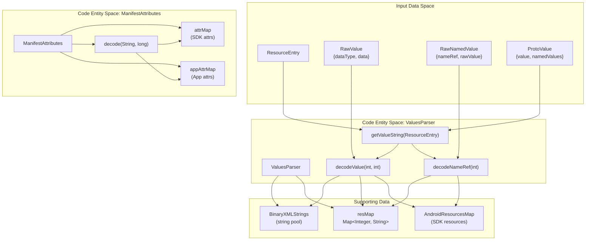
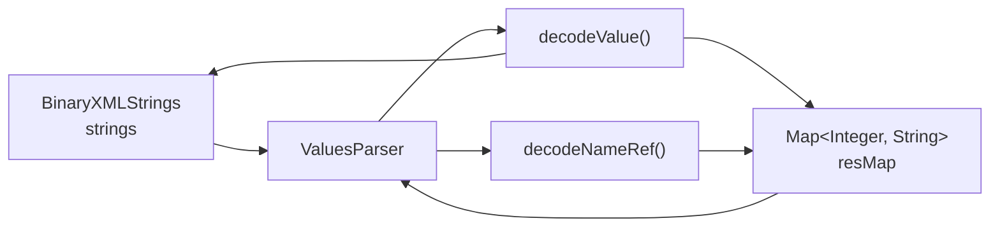
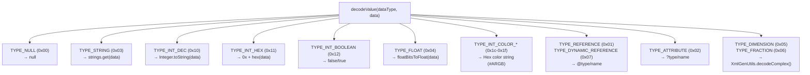
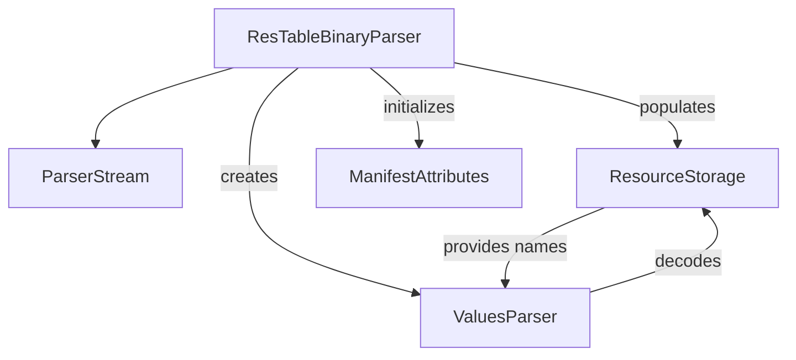

# Resource Value Decoding

Relevant source files

The following files were used as context for generating this wiki page:

- [jadx-core/src/main/java/jadx/core/utils/android/AndroidManifestParser.java](https://github.com/skylot/jadx/blob/HEAD/jadx-core/src/main/java/jadx/core/utils/android/AndroidManifestParser.java)
- [jadx-core/src/main/java/jadx/core/utils/android/AppAttribute.java](https://github.com/skylot/jadx/blob/HEAD/jadx-core/src/main/java/jadx/core/utils/android/AppAttribute.java)
- [jadx-core/src/main/java/jadx/core/utils/android/ApplicationParams.java](https://github.com/skylot/jadx/blob/HEAD/jadx-core/src/main/java/jadx/core/utils/android/ApplicationParams.java)
- [jadx-core/src/main/java/jadx/core/xmlgen/CommonBinaryParser.java](https://github.com/skylot/jadx/blob/HEAD/jadx-core/src/main/java/jadx/core/xmlgen/CommonBinaryParser.java)
- [jadx-core/src/main/java/jadx/core/xmlgen/ManifestAttributes.java](https://github.com/skylot/jadx/blob/HEAD/jadx-core/src/main/java/jadx/core/xmlgen/ManifestAttributes.java)
- [jadx-core/src/main/java/jadx/core/xmlgen/ParserConstants.java](https://github.com/skylot/jadx/blob/HEAD/jadx-core/src/main/java/jadx/core/xmlgen/ParserConstants.java)
- [jadx-core/src/main/java/jadx/core/xmlgen/ParserStream.java](https://github.com/skylot/jadx/blob/HEAD/jadx-core/src/main/java/jadx/core/xmlgen/ParserStream.java)
- [jadx-core/src/main/java/jadx/core/xmlgen/ResNameUtils.java](https://github.com/skylot/jadx/blob/HEAD/jadx-core/src/main/java/jadx/core/xmlgen/ResNameUtils.java)
- [jadx-core/src/main/java/jadx/core/xmlgen/ResTableBinaryParser.java](https://github.com/skylot/jadx/blob/HEAD/jadx-core/src/main/java/jadx/core/xmlgen/ResTableBinaryParser.java)
- [jadx-core/src/main/java/jadx/core/xmlgen/ResourceStorage.java](https://github.com/skylot/jadx/blob/HEAD/jadx-core/src/main/java/jadx/core/xmlgen/ResourceStorage.java)
- [jadx-core/src/main/java/jadx/core/xmlgen/entry/EntryConfig.java](https://github.com/skylot/jadx/blob/HEAD/jadx-core/src/main/java/jadx/core/xmlgen/entry/EntryConfig.java)
- [jadx-core/src/main/java/jadx/core/xmlgen/entry/RawNamedValue.java](https://github.com/skylot/jadx/blob/HEAD/jadx-core/src/main/java/jadx/core/xmlgen/entry/RawNamedValue.java)
- [jadx-core/src/main/java/jadx/core/xmlgen/entry/ResourceEntry.java](https://github.com/skylot/jadx/blob/HEAD/jadx-core/src/main/java/jadx/core/xmlgen/entry/ResourceEntry.java)
- [jadx-core/src/main/java/jadx/core/xmlgen/entry/ValuesParser.java](https://github.com/skylot/jadx/blob/HEAD/jadx-core/src/main/java/jadx/core/xmlgen/entry/ValuesParser.java)
- [jadx-core/src/main/resources/export/android/build.gradle.tmpl](https://github.com/skylot/jadx/blob/HEAD/jadx-core/src/main/resources/export/android/build.gradle.tmpl)
- [jadx-core/src/test/java/jadx/core/xmlgen/ResNameUtilsTest.java](https://github.com/skylot/jadx/blob/HEAD/jadx-core/src/test/java/jadx/core/xmlgen/ResNameUtilsTest.java)
- [jadx-core/src/test/java/jadx/tests/functional/TemplateFileTest.java](https://github.com/skylot/jadx/blob/HEAD/jadx-core/src/test/java/jadx/tests/functional/TemplateFileTest.java)
- [jadx-gui/src/main/java/jadx/gui/device/debugger/DbgUtils.java](https://github.com/skylot/jadx/blob/HEAD/jadx-gui/src/main/java/jadx/gui/device/debugger/DbgUtils.java)
- [jadx-gui/src/main/java/jadx/gui/ui/dialog/ExcludePkgDialog.java](https://github.com/skylot/jadx/blob/HEAD/jadx-gui/src/main/java/jadx/gui/ui/dialog/ExcludePkgDialog.java)
- [jadx-gui/src/main/java/jadx/gui/ui/panel/SimpleCodePanel.java](https://github.com/skylot/jadx/blob/HEAD/jadx-gui/src/main/java/jadx/gui/ui/panel/SimpleCodePanel.java)
- [jadx-plugins/jadx-aab-input/src/main/java/jadx/plugins/input/aab/parsers/CommonProtoParser.java](https://github.com/skylot/jadx/blob/HEAD/jadx-plugins/jadx-aab-input/src/main/java/jadx/plugins/input/aab/parsers/CommonProtoParser.java)

## Purpose and Scope

This document explains the resource value decoding subsystem in JADX, which transforms binary-encoded Android resource values into human-readable strings. The system handles various data types (integers, booleans, colors, dimensions, references) and Android-specific attribute interpretation (enums and flags).

The primary classes involved are `ValuesParser` for generic data type conversion and `ManifestAttributes` for specialized Android attribute interpretation.

## Overview

Resource value decoding operates as a critical translation layer between binary resource data and human-readable output. When Android packages resources (in `resources.arsc` or binary XML files), it encodes values using type-tagged data structures. JADX's decoding subsystem reverses this process using two primary components:

1.  **`ValuesParser`**: Generic value decoder that handles all Android resource data types defined in `ParserConstants`.
2.  **`ManifestAttributes`**: Android-specific attribute interpreter for manifest and resource attributes, handling enums and flags.

Sources: [jadx-core/src/main/java/jadx/core/xmlgen/entry/ValuesParser.java:1-25](https://github.com/skylot/jadx/blob/HEAD/jadx-core/src/main/java/jadx/core/xmlgen/entry/ValuesParser.java#L1-L25), [jadx-core/src/main/java/jadx/core/xmlgen/ManifestAttributes.java:28-77](https://github.com/skylot/jadx/blob/HEAD/jadx-core/src/main/java/jadx/core/xmlgen/ManifestAttributes.java#L28-L77)

## Value Decoding Architecture

Title: Resource Decoding System Components

**Value Decoding Pipeline**: `ValuesParser` processes resource entries by extracting values (simple or named), decoding them based on their data types, and resolving references through string pools and resource name maps. `ManifestAttributes` provides specialized decoding for Android manifest attributes using pre-loaded attribute definitions from `attrs.xml`.

Sources: [jadx-core/src/main/java/jadx/core/xmlgen/entry/ValuesParser.java:16-168](https://github.com/skylot/jadx/blob/HEAD/jadx-core/src/main/java/jadx/core/xmlgen/entry/ValuesParser.java#L16-L168), [jadx-core/src/main/java/jadx/core/xmlgen/ManifestAttributes.java:28-77](https://github.com/skylot/jadx/blob/HEAD/jadx-core/src/main/java/jadx/core/xmlgen/ManifestAttributes.java#L28-L77), [jadx-core/src/main/java/jadx/core/xmlgen/ParserConstants.java:42-90](https://github.com/skylot/jadx/blob/HEAD/jadx-core/src/main/java/jadx/core/xmlgen/ParserConstants.java#L42-L90)

## ValuesParser Class

### Constructor and Dependencies

`ValuesParser` requires two dependencies for value decoding:

Title: ValuesParser Dependencies

The constructor initializes these fields at [jadx-core/src/main/java/jadx/core/xmlgen/entry/ValuesParser.java:22-25](https://github.com/skylot/jadx/blob/HEAD/jadx-core/src/main/java/jadx/core/xmlgen/entry/ValuesParser.java#L22-L25). The `strings` field provides access to the parsed string pool for `TYPE_STRING` values, while `resMap` maps resource IDs to their type-qualified names.

Sources: [jadx-core/src/main/java/jadx/core/xmlgen/entry/ValuesParser.java:19-25](https://github.com/skylot/jadx/blob/HEAD/jadx-core/src/main/java/jadx/core/xmlgen/entry/ValuesParser.java#L19-L25)

### Value String Extraction

`ValuesParser` provides methods for extracting string representations from `ResourceEntry` objects:

| Method | Purpose | Implementation |
|--------|---------|----------------|
| `getSimpleValueString()` | Extracts simple scalar values | Returns `ProtoValue.getValue()` or decodes `RawValue` [jadx-core/src/main/java/jadx/core/xmlgen/entry/ValuesParser.java:28-38](https://github.com/skylot/jadx/blob/HEAD/jadx-core/src/main/java/jadx/core/xmlgen/entry/ValuesParser.java#L28-L38) |
| `getValueString()` | Extracts all values, including complex | Handles `ProtoValue`, `RawValue`, and `List<RawNamedValue>` [jadx-core/src/main/java/jadx/core/xmlgen/entry/ValuesParser.java:41-74](https://github.com/skylot/jadx/blob/HEAD/jadx-core/src/main/java/jadx/core/xmlgen/entry/ValuesParser.java#L41-L74) |

The `getValueString()` method handles three value formats:
1.  **ProtoValue**: Returns value directly or formats named values as a list [jadx-core/src/main/java/jadx/core/xmlgen/entry/ValuesParser.java:42-57](https://github.com/skylot/jadx/blob/HEAD/jadx-core/src/main/java/jadx/core/xmlgen/entry/ValuesParser.java#L42-L57).
2.  **RawValue**: Delegates to `decodeValue()` [jadx-core/src/main/java/jadx/core/xmlgen/entry/ValuesParser.java:58-61](https://github.com/skylot/jadx/blob/HEAD/jadx-core/src/main/java/jadx/core/xmlgen/entry/ValuesParser.java#L58-L61).
3.  **Named Values**: Formats as `name=value` pairs for complex entries like styles [jadx-core/src/main/java/jadx/core/xmlgen/entry/ValuesParser.java:62-73](https://github.com/skylot/jadx/blob/HEAD/jadx-core/src/main/java/jadx/core/xmlgen/entry/ValuesParser.java#L62-L73).

Sources: [jadx-core/src/main/java/jadx/core/xmlgen/entry/ValuesParser.java:27-74](https://github.com/skylot/jadx/blob/HEAD/jadx-core/src/main/java/jadx/core/xmlgen/entry/ValuesParser.java#L27-L74)

### Type-Specific Decoding

The core decoding logic in `decodeValue(int dataType, int data)` handles distinct data types defined in `ParserConstants`:

Title: Type Decoding Logic Map

**Reference Type Handling**: Reference types follow a tiered resolution strategy:
1.  Check local `resMap` [jadx-core/src/main/java/jadx/core/xmlgen/entry/ValuesParser.java:109-110](https://github.com/skylot/jadx/blob/HEAD/jadx-core/src/main/java/jadx/core/xmlgen/entry/ValuesParser.java#L109-L110).
2.  Check `AndroidResourcesMap` for SDK resources [jadx-core/src/main/java/jadx/core/xmlgen/entry/ValuesParser.java:111-114](https://github.com/skylot/jadx/blob/HEAD/jadx-core/src/main/java/jadx/core/xmlgen/entry/ValuesParser.java#L111-L114).
3.  Fallback to `?unknown_ref` or `0` [jadx-core/src/main/java/jadx/core/xmlgen/entry/ValuesParser.java:115-118](https://github.com/skylot/jadx/blob/HEAD/jadx-core/src/main/java/jadx/core/xmlgen/entry/ValuesParser.java#L115-L118).

Sources: [jadx-core/src/main/java/jadx/core/xmlgen/entry/ValuesParser.java:84-147](https://github.com/skylot/jadx/blob/HEAD/jadx-core/src/main/java/jadx/core/xmlgen/entry/ValuesParser.java#L84-L147), [jadx-core/src/main/java/jadx/core/xmlgen/ParserConstants.java:42-90](https://github.com/skylot/jadx/blob/HEAD/jadx-core/src/main/java/jadx/core/xmlgen/ParserConstants.java#L42-L90)

## ManifestAttributes System

### Architecture and Purpose

`ManifestAttributes` manages Android attribute definitions loaded from embedded XML schemas (`attrs.xml` and `attrs_manifest.xml`). It provides specialized decoding for attributes that use enumerated or flag-based values.

Sources: [jadx-core/src/main/java/jadx/core/xmlgen/ManifestAttributes.java:28-77](https://github.com/skylot/jadx/blob/HEAD/jadx-core/src/main/java/jadx/core/xmlgen/ManifestAttributes.java#L28-L77)

### Attribute Definition Loading

During initialization, `ManifestAttributes` parses embedded XML files [jadx-core/src/main/java/jadx/core/xmlgen/ManifestAttributes.java:79-83](https://github.com/skylot/jadx/blob/HEAD/jadx-core/src/main/java/jadx/core/xmlgen/ManifestAttributes.java#L79-L83):
*   `/android/attrs.xml` [jadx-core/src/main/java/jadx/core/xmlgen/ManifestAttributes.java:31](https://github.com/skylot/jadx/blob/HEAD/jadx-core/src/main/java/jadx/core/xmlgen/ManifestAttributes.java#L31)
*   `/android/attrs_manifest.xml` [jadx-core/src/main/java/jadx/core/xmlgen/ManifestAttributes.java:32](https://github.com/skylot/jadx/blob/HEAD/jadx-core/src/main/java/jadx/core/xmlgen/ManifestAttributes.java#L32)

The `parseValues(String, NodeList)` method extracts `<enum>` or `<flag>` definitions and stores them in `attrMap` [jadx-core/src/main/java/jadx/core/xmlgen/ManifestAttributes.java:133-172](https://github.com/skylot/jadx/blob/HEAD/jadx-core/src/main/java/jadx/core/xmlgen/ManifestAttributes.java#L133-L172).

### Attribute Value Decoding

The `decode(String attrName, long value)` method performs attribute-specific value interpretation [jadx-core/src/main/java/jadx/core/xmlgen/ManifestAttributes.java:174-206](https://github.com/skylot/jadx/blob/HEAD/jadx-core/src/main/java/jadx/core/xmlgen/ManifestAttributes.java#L174-L206):

1.  **Enum Attributes**: Performs a simple map lookup: `attrValuesMap.get(value)` [jadx-core/src/main/java/jadx/core/xmlgen/ManifestAttributes.java:188](https://github.com/skylot/jadx/blob/HEAD/jadx-core/src/main/java/jadx/core/xmlgen/ManifestAttributes.java#L188).
2.  **Flag Attributes**: Performs bitwise matching to support combined flags. It sorts flag keys descending to match larger masks first, then joins matches with `|` [jadx-core/src/main/java/jadx/core/xmlgen/ManifestAttributes.java:189-203](https://github.com/skylot/jadx/blob/HEAD/jadx-core/src/main/java/jadx/core/xmlgen/ManifestAttributes.java#L189-L203).

Sources: [jadx-core/src/main/java/jadx/core/xmlgen/ManifestAttributes.java:174-206](https://github.com/skylot/jadx/blob/HEAD/jadx-core/src/main/java/jadx/core/xmlgen/ManifestAttributes.java#L174-L206)

### App-Specific Attribute Updates

The `updateAttributes(IResTableParser parser)` method extracts app-defined attributes from the resource table [jadx-core/src/main/java/jadx/core/xmlgen/ManifestAttributes.java:208-240](https://github.com/skylot/jadx/blob/HEAD/jadx-core/src/main/java/jadx/core/xmlgen/ManifestAttributes.java#L208-L240). It processes `ResourceEntry` objects with type `"attr"`, identifying `ATTR_TYPE_FLAGS` or `ATTR_TYPE_ENUM` via bitmasking [jadx-core/src/main/java/jadx/core/xmlgen/ManifestAttributes.java:223-231](https://github.com/skylot/jadx/blob/HEAD/jadx-core/src/main/java/jadx/core/xmlgen/ManifestAttributes.java#L223-L231).

Sources: [jadx-core/src/main/java/jadx/core/xmlgen/ManifestAttributes.java:208-240](https://github.com/skylot/jadx/blob/HEAD/jadx-core/src/main/java/jadx/core/xmlgen/ManifestAttributes.java#L208-L240)

## Supporting Components

### Binary Stream Parsing
The `ParserStream` class extends `InputStream` to provide little-endian reading capabilities required for binary resource decoding, such as `readInt32()` [jadx-core/src/main/java/jadx/core/xmlgen/ParserStream.java:44-52](https://github.com/skylot/jadx/blob/HEAD/jadx-core/src/main/java/jadx/core/xmlgen/ParserStream.java#L44-L52) and `readString16Fixed(int)` [jadx-core/src/main/java/jadx/core/xmlgen/ParserStream.java:58-61](https://github.com/skylot/jadx/blob/HEAD/jadx-core/src/main/java/jadx/core/xmlgen/ParserStream.java#L58-L61).

### Resource Table Parsing and Storage
`ResTableBinaryParser` orchestrates the decoding of `resources.arsc`. It initializes a `ResourceStorage` to hold `ResourceEntry` objects [jadx-core/src/main/java/jadx/core/xmlgen/ResTableBinaryParser.java:93-95](https://github.com/skylot/jadx/blob/HEAD/jadx-core/src/main/java/jadx/core/xmlgen/ResTableBinaryParser.java#L93-L95). During `decodeFiles()`, it creates a `ValuesParser` using the collected string pool and resource names [jadx-core/src/main/java/jadx/core/xmlgen/ResTableBinaryParser.java:104](https://github.com/skylot/jadx/blob/HEAD/jadx-core/src/main/java/jadx/core/xmlgen/ResTableBinaryParser.java#L104).

Title: Resource Parsing Data Flow

Sources: [jadx-core/src/main/java/jadx/core/xmlgen/ResTableBinaryParser.java:90-110](https://github.com/skylot/jadx/blob/HEAD/jadx-core/src/main/java/jadx/core/xmlgen/ResTableBinaryParser.java#L90-L110), [jadx-core/src/main/java/jadx/core/xmlgen/ResourceStorage.java:13-96](https://github.com/skylot/jadx/blob/HEAD/jadx-core/src/main/java/jadx/core/xmlgen/ResourceStorage.java#L13-L96)3b:T3827,# Resource 