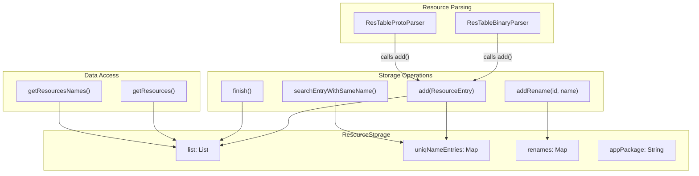
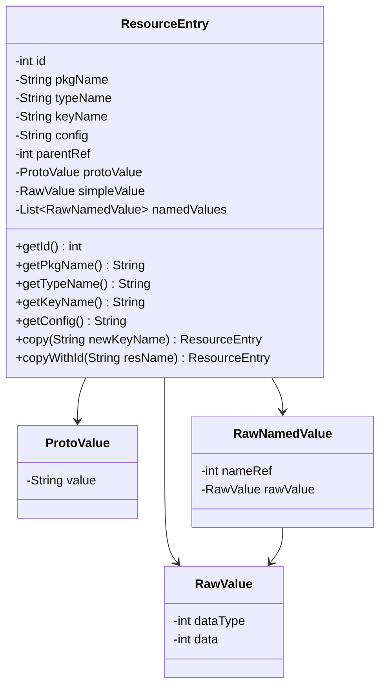
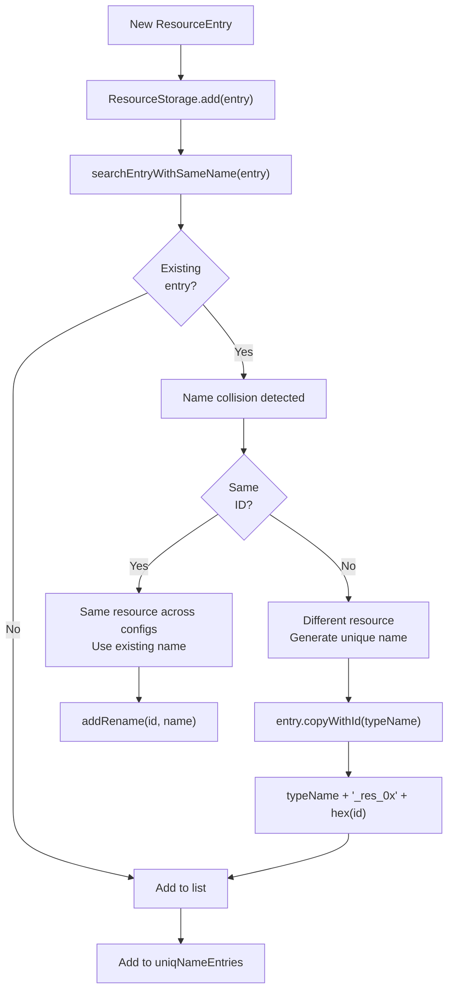
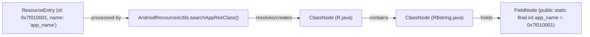
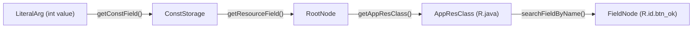
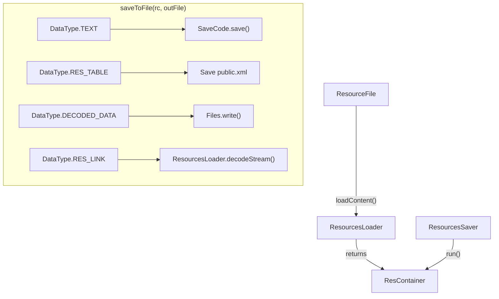

# Resource Storage and Integration

Relevant source files

The following files were used as context for generating this wiki page:

- [jadx-core/src/main/java/jadx/api/JadxDecompiler.java](https://github.com/skylot/jadx/blob/HEAD/jadx-core/src/main/java/jadx/api/JadxDecompiler.java)
- [jadx-core/src/main/java/jadx/api/JavaClass.java](https://github.com/skylot/jadx/blob/HEAD/jadx-core/src/main/java/jadx/api/JavaClass.java)
- [jadx-core/src/main/java/jadx/api/JavaField.java](https://github.com/skylot/jadx/blob/HEAD/jadx-core/src/main/java/jadx/api/JavaField.java)
- [jadx-core/src/main/java/jadx/api/JavaMethod.java](https://github.com/skylot/jadx/blob/HEAD/jadx-core/src/main/java/jadx/api/JavaMethod.java)
- [jadx-core/src/main/java/jadx/api/ResourceFile.java](https://github.com/skylot/jadx/blob/HEAD/jadx-core/src/main/java/jadx/api/ResourceFile.java)
- [jadx-core/src/main/java/jadx/api/ResourceFileContent.java](https://github.com/skylot/jadx/blob/HEAD/jadx-core/src/main/java/jadx/api/ResourceFileContent.java)
- [jadx-core/src/main/java/jadx/api/ResourceType.java](https://github.com/skylot/jadx/blob/HEAD/jadx-core/src/main/java/jadx/api/ResourceType.java)
- [jadx-core/src/main/java/jadx/api/ResourcesLoader.java](https://github.com/skylot/jadx/blob/HEAD/jadx-core/src/main/java/jadx/api/ResourcesLoader.java)
- [jadx-core/src/main/java/jadx/core/ProcessClass.java](https://github.com/skylot/jadx/blob/HEAD/jadx-core/src/main/java/jadx/core/ProcessClass.java)
- [jadx-core/src/main/java/jadx/core/dex/info/ClassInfo.java](https://github.com/skylot/jadx/blob/HEAD/jadx-core/src/main/java/jadx/core/dex/info/ClassInfo.java)
- [jadx-core/src/main/java/jadx/core/dex/nodes/ClassNode.java](https://github.com/skylot/jadx/blob/HEAD/jadx-core/src/main/java/jadx/core/dex/nodes/ClassNode.java)
- [jadx-core/src/main/java/jadx/core/dex/nodes/RootNode.java](https://github.com/skylot/jadx/blob/HEAD/jadx-core/src/main/java/jadx/core/dex/nodes/RootNode.java)
- [jadx-core/src/main/java/jadx/core/utils/android/AndroidResourcesUtils.java](https://github.com/skylot/jadx/blob/HEAD/jadx-core/src/main/java/jadx/core/utils/android/AndroidResourcesUtils.java)
- [jadx-core/src/main/java/jadx/core/xmlgen/ResContainer.java](https://github.com/skylot/jadx/blob/HEAD/jadx-core/src/main/java/jadx/core/xmlgen/ResContainer.java)
- [jadx-core/src/main/java/jadx/core/xmlgen/ResourcesSaver.java](https://github.com/skylot/jadx/blob/HEAD/jadx-core/src/main/java/jadx/core/xmlgen/ResourcesSaver.java)
- [jadx-core/src/test/java/jadx/tests/api/IntegrationTest.java](https://github.com/skylot/jadx/blob/HEAD/jadx-core/src/test/java/jadx/tests/api/IntegrationTest.java)

This document covers the resource storage system in JADX, which maintains parsed Android resource data and integrates it with the decompiler's core structures. After binary XML and resource tables are parsed, `ResourceStorage` stores the extracted `ResourceEntry` objects and provides name resolution for references throughout the codebase.

## Purpose and Scope

The resource storage system performs these functions:
1.  **Resource Collection**: Storing parsed `ResourceEntry` objects with metadata.
2.  **Name Management**: Ensuring unique resource names within type/config combinations.
3.  **ID-to-Name Resolution**: Providing resource name lookup for references via `ValuesParser`.
4.  **RootNode Integration**: Connecting resource data to the decompiler's central registry for deobfuscation and code generation.

The core classes are `ResourceStorage` for collection management, `ResourceEntry` for individual resource data, and integration points in `RootNode` and `ResTableBinaryParser`.

Sources: [jadx-core/src/main/java/jadx/core/xmlgen/ResourceStorage.java:1-30](https://github.com/skylot/jadx/blob/HEAD/jadx-core/src/main/java/jadx/core/xmlgen/ResourceStorage.java#L1-L30), [jadx-core/src/main/java/jadx/core/xmlgen/entry/ResourceEntry.java:1-24](https://github.com/skylot/jadx/blob/HEAD/jadx-core/src/main/java/jadx/core/xmlgen/entry/ResourceEntry.java#L1-L24), [jadx-core/src/main/java/jadx/core/xmlgen/entry/ValuesParser.java:19-25](https://github.com/skylot/jadx/blob/HEAD/jadx-core/src/main/java/jadx/core/xmlgen/entry/ValuesParser.java#L19-L25)

## ResourceStorage Architecture

`ResourceStorage` is the central repository for parsed Android resources. It maintains a list of `ResourceEntry` objects and provides mechanisms for uniqueness checking, name conflict resolution, and ID-to-name mapping.

**ResourceStorage Structure and Flow**

Sources: [jadx-core/src/main/java/jadx/core/xmlgen/ResTableBinaryParser.java:93-95](https://github.com/skylot/jadx/blob/HEAD/jadx-core/src/main/java/jadx/core/xmlgen/ResTableBinaryParser.java#L93-L95), [jadx-core/src/main/java/jadx/core/xmlgen/ResourceStorage.java:13-96](https://github.com/skylot/jadx/blob/HEAD/jadx-core/src/main/java/jadx/core/xmlgen/ResourceStorage.java#L13-L96)

### Key Components

| Component | Type | Purpose |
|-----------|------|---------|
| `ResourceStorage` | Storage | Central repository for all parsed resources. |
| `ResourceEntry` | Data structure | Represents individual resource with metadata. |
| `uniqNameEntries` | Map | Ensures name uniqueness within type/config. |
| `renames` | Map | Preserves renamed resources across configurations. |

Sources: [jadx-core/src/main/java/jadx/core/xmlgen/ResourceStorage.java:13-36](https://github.com/skylot/jadx/blob/HEAD/jadx-core/src/main/java/jadx/core/xmlgen/ResourceStorage.java#L13-L36), [jadx-core/src/main/java/jadx/core/xmlgen/ResTableBinaryParser.java:93-93](https://github.com/skylot/jadx/blob/HEAD/jadx-core/src/main/java/jadx/core/xmlgen/ResTableBinaryParser.java#L93)

## ResourceEntry Structure

`ResourceEntry` is the data structure representing an individual Android resource. Each entry contains identification, type information, configuration qualifiers, and value data.

**ResourceEntry Data Model**

Sources: [jadx-core/src/main/java/jadx/core/xmlgen/entry/ResourceEntry.java:5-108](https://github.com/skylot/jadx/blob/HEAD/jadx-core/src/main/java/jadx/core/xmlgen/entry/ResourceEntry.java#L5-L108), [jadx-core/src/main/java/jadx/core/xmlgen/entry/RawValue.java:3-10](https://github.com/skylot/jadx/blob/HEAD/jadx-core/src/main/java/jadx/core/xmlgen/entry/RawValue.java#L3-L10), [jadx-core/src/main/java/jadx/core/xmlgen/entry/RawNamedValue.java:3-10](https://github.com/skylot/jadx/blob/HEAD/jadx-core/src/main/java/jadx/core/xmlgen/entry/RawNamedValue.java#L3-L10)

### ResourceEntry Fields

| Field | Type | Purpose |
|-------|------|---------|
| `id` | `int` | Unique resource identifier (0xPPTTEEEE format). |
| `pkgName` | `String` | Package name (typically app package or "android"). |
| `typeName` | `String` | Resource type (string, drawable, layout, etc.). |
| `keyName` | `String` | Resource name within type. |
| `config` | `String` | Configuration qualifiers (e.g., "-en-hdpi"). |
| `parentRef` | `int` | Parent resource ID for styles. |
| `protoValue` | `ProtoValue` | Protobuf-decoded value (from AAB/Proto format). |
| `simpleValue` | `RawValue` | Binary-decoded simple value. |
| `namedValues` | `List<RawNamedValue>` | Binary-decoded complex values (arrays, styles). |

Sources: [jadx-core/src/main/java/jadx/core/xmlgen/entry/ResourceEntry.java:7-24](https://github.com/skylot/jadx/blob/HEAD/jadx-core/src/main/java/jadx/core/xmlgen/entry/ResourceEntry.java#L7-L24), [jadx-core/src/main/java/jadx/core/xmlgen/entry/ResourceEntry.java:40-51](https://github.com/skylot/jadx/blob/HEAD/jadx-core/src/main/java/jadx/core/xmlgen/entry/ResourceEntry.java#L40-L51)

### Value Types and Decoding

Resources are decoded into string representations for the final output using `ValuesParser`.

1.  **Proto Values** (`protoValue`): Used when resources are parsed from Protocol Buffer formats. [jadx-core/src/main/java/jadx/core/xmlgen/entry/ResourceEntry.java:14-14](https://github.com/skylot/jadx/blob/HEAD/jadx-core/src/main/java/jadx/core/xmlgen/entry/ResourceEntry.java#L14)
2.  **Simple Values** (`simpleValue`): Single typed values like strings, integers, or colors. Decoded via `ValuesParser.decodeValue`. [jadx-core/src/main/java/jadx/core/xmlgen/entry/ValuesParser.java:77-81](https://github.com/skylot/jadx/blob/HEAD/jadx-core/src/main/java/jadx/core/xmlgen/entry/ValuesParser.java#L77-L81)
3.  **Named Values** (`namedValues`): Complex structures like styles or arrays. Each `RawNamedValue` contains a `nameRef` and a `RawValue`. [jadx-core/src/main/java/jadx/core/xmlgen/entry/ValuesParser.java:62-74](https://github.com/skylot/jadx/blob/HEAD/jadx-core/src/main/java/jadx/core/xmlgen/entry/ValuesParser.java#L62-L74)

Sources: [jadx-core/src/main/java/jadx/core/xmlgen/entry/ValuesParser.java:84-147](https://github.com/skylot/jadx/blob/HEAD/jadx-core/src/main/java/jadx/core/xmlgen/entry/ValuesParser.java#L84-L147)

## Resource Name Uniqueness and Collision Handling

`ResourceStorage` ensures that resource names are unique within each type and configuration combination. When duplicate names are encountered, it handles them through renaming and tracking mechanisms.

**Uniqueness Check and Resolution**

Sources: [jadx-core/src/main/java/jadx/core/xmlgen/ResourceStorage.java:38-61](https://github.com/skylot/jadx/blob/HEAD/jadx-core/src/main/java/jadx/core/xmlgen/ResourceStorage.java#L38-L61), [jadx-core/src/main/java/jadx/core/xmlgen/entry/ResourceEntry.java:35-37](https://github.com/skylot/jadx/blob/HEAD/jadx-core/src/main/java/jadx/core/xmlgen/entry/ResourceEntry.java#L35-L37)

### Rename Tracking

The `renames` map preserves name consistency across configurations. When a resource with the same ID but a different name is encountered in another configuration, `ResourceStorage` ensures they are synchronized. This ensures that `@string/app_name` in the default configuration and `@string/app_name` in `-en` configuration refer to the same underlying resource ID.

Sources: [jadx-core/src/main/java/jadx/core/xmlgen/ResourceStorage.java:29-36](https://github.com/skylot/jadx/blob/HEAD/jadx-core/src/main/java/jadx/core/xmlgen/ResourceStorage.java#L29-L36), [jadx-core/src/main/java/jadx/core/xmlgen/ResourceStorage.java:54-61](https://github.com/skylot/jadx/blob/HEAD/jadx-core/src/main/java/jadx/core/xmlgen/ResourceStorage.java#L54-L61)

## Integration with RootNode and Deobfuscation

Parsed resources integrate with the `RootNode` to allow for global resolution during decompilation and to support constant replacement in Java code.

### App 'R' Class Generation

The `AndroidResourcesUtils` class manages the mapping of resource IDs to Java fields. It either finds an existing `R` class or generates a synthetic one to hold resource IDs.

**Resource to Java Entity Mapping**

Sources: [jadx-core/src/main/java/jadx/core/utils/android/AndroidResourcesUtils.java:39-63](https://github.com/skylot/jadx/blob/HEAD/jadx-core/src/main/java/jadx/core/utils/android/AndroidResourcesUtils.java#L39-L63), [jadx-core/src/main/java/jadx/core/utils/android/AndroidResourcesUtils.java:105-143](https://github.com/skylot/jadx/blob/HEAD/jadx-core/src/main/java/jadx/core/utils/android/AndroidResourcesUtils.java#L105-L143)

### Constant Storage and Resource Fields

`ConstStorage` maintains a mapping of resource IDs to their names to facilitate replacing literal integers with `R.type.name` references in decompiled code.

**Resource ID Resolution Flow**

Sources: [jadx-core/src/main/java/jadx/core/dex/nodes/RootNode.java:75-76](https://github.com/skylot/jadx/blob/HEAD/jadx-core/src/main/java/jadx/core/dex/nodes/RootNode.java#L75-L76), [jadx-core/src/main/java/jadx/core/utils/android/AndroidResourcesUtils.java:164-179](https://github.com/skylot/jadx/blob/HEAD/jadx-core/src/main/java/jadx/core/utils/android/AndroidResourcesUtils.java#L164-L179)

### Resource File Aliasing

`ResourceFile` supports setting aliases (deobfuscated names) based on `ResourceEntry` data. This is used to organize resources into standard Android directory structures (e.g., `res/drawable/`) even if they were obfuscated in the input file.

Sources: [jadx-core/src/main/java/jadx/api/ResourceFile.java:59-100](https://github.com/skylot/jadx/blob/HEAD/jadx-core/src/main/java/jadx/api/ResourceFile.java#L59-L100)

## Resource Saving and Output

The `ResourcesSaver` class handles the physical writing of resources to the output directory. It processes `ResContainer` objects, which can hold text, decoded binary data, or links to other resource files.

**Resource Saving Process**

Sources: [jadx-core/src/main/java/jadx/core/xmlgen/ResourcesSaver.java:20-40](https://github.com/skylot/jadx/blob/HEAD/jadx-core/src/main/java/jadx/core/xmlgen/ResourcesSaver.java#L20-L40), [jadx-core/src/main/java/jadx/core/xmlgen/ResourcesSaver.java:65-96](https://github.com/skylot/jadx/blob/HEAD/jadx-core/src/main/java/jadx/core/xmlgen/ResourcesSaver.java#L65-L96), [jadx-core/src/main/java/jadx/core/xmlgen/ResContainer.java:15-38](https://github.com/skylot/jadx/blob/HEAD/jadx-core/src/main/java/jadx/core/xmlgen/ResContainer.java#L15-L38)

### Resource Types Handling

| Resource Type | Content Loading | Saving Action |
|---------------|-----------------|---------------|
| `MANIFEST` / `XML` | `BinaryXMLParser.parse()` | Saves as `.xml` text. |
| `ARSC` | `decodeTable().decodeFiles()` | Generates `res/values/public.xml` and sub-files. |
| `IMG` | `decodeImage()` (handles 9-patch) | Writes decoded `.png` or links original. |
| Other | `ResContainer.resourceFileLink()` | Copies original file via stream. |

Sources: [jadx-core/src/main/java/jadx/api/ResourcesLoader.java:126-148](https://github.com/skylot/jadx/blob/HEAD/jadx-core/src/main/java/jadx/api/ResourcesLoader.java#L126-L148), [jadx-core/src/main/java/jadx/api/ResourcesLoader.java:169-182](https://github.com/skylot/jadx/blob/HEAD/jadx-core/src/main/java/jadx/api/ResourcesLoader.java#L169-L182), [jadx-core/src/main/java/jadx/core/xmlgen/ResourcesSaver.java:98-109](https://github.com/skylot/jadx/blob/HEAD/jadx-core/src/main/java/jadx/core/xmlgen/ResourcesSaver.java#L98-L109)